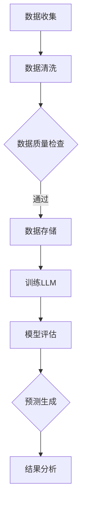

                 

关键词：LLM，海洋气象预报，预警准确性，人工智能，大数据分析

摘要：本文旨在探讨大型语言模型（LLM）在海洋气象预报中的应用，以及如何通过这项技术提高预警准确性。首先，我们将介绍海洋气象预报的背景和重要性，然后深入探讨LLM的基本概念、原理及其在气象预测中的具体应用。随后，我们将展示如何通过构建数学模型和公式来优化气象预测，并通过实际代码实例验证其效果。最后，我们将讨论LLM在海洋气象预报中的实际应用场景，展望未来的发展趋势和面临的挑战。

## 1. 背景介绍

海洋气象预报是海洋科学和气象学领域的一个重要分支，它涉及对海洋表面的天气变化进行预测，包括海浪、潮汐、风场、水温等方面的变化。海洋气象预报对于航海安全、渔业生产、海洋资源开发、环境保护等具有重要的影响。然而，由于海洋环境的复杂性和多变性，传统的气象预测方法往往难以满足高准确性的要求。

随着人工智能和大数据技术的发展，大型语言模型（LLM）在自然语言处理、文本生成、机器翻译等领域取得了显著的成果。LLM是一种基于深度学习的模型，能够通过学习大量的文本数据来理解语言的规律和语义。近年来，研究人员开始探索将LLM应用于气象预测领域，以期提高预报的准确性。

本文将介绍LLM的基本概念和原理，探讨其在海洋气象预报中的应用，并通过实际案例展示其效果。我们还将讨论LLM在气象预测中的优势和挑战，以及未来的发展趋势。

### 1.1 海洋气象预报的重要性

海洋气象预报对于海上活动至关重要。例如，准确的海洋气象预报可以帮助航海者避免恶劣天气，确保船只的安全。在渔业生产中，海洋气象预报可以预测鱼群的迁徙路线，帮助渔民提高捕捞效率。此外，海洋气象预报还在海洋资源开发、海上施工、海洋环境保护等领域发挥着重要作用。

然而，海洋气象预报面临着诸多挑战。首先，海洋环境的复杂性和多变性使得气象预测的难度增加。海洋中存在多种气象因素，如温度、湿度、气压、风速等，这些因素相互作用，导致气象模式的复杂性。其次，传统的气象预测方法往往依赖于有限的观测数据和经验模型，难以全面反映海洋环境的动态变化。

### 1.2 人工智能在气象预测中的应用

随着人工智能技术的发展，机器学习、深度学习等算法在气象预测中得到了广泛应用。这些算法能够从大量历史数据中提取规律，并用于预测未来的天气变化。例如，卷积神经网络（CNN）和循环神经网络（RNN）在图像识别和语音识别领域取得了显著的成果，它们也被应用于气象预测中，以提高预测的准确性。

近年来，大型语言模型（LLM）在自然语言处理领域取得了突破性进展。LLM能够处理大规模的文本数据，并从中提取语义信息，这使得它们在气象预测中具有巨大的潜力。通过学习大量的气象文本数据，LLM可以理解海洋气象变化的规律，从而提高预报的准确性。

## 2. 核心概念与联系

### 2.1 大型语言模型（LLM）的基本概念

大型语言模型（LLM）是一种基于深度学习的语言处理模型，它通过学习大量的文本数据来理解语言的规律和语义。LLM的核心思想是通过参数化的神经网络来表示语言，并通过优化这些参数来提高模型对文本数据的拟合度。

LLM通常采用自注意力机制（self-attention）和变压器（Transformer）架构，这些机制使得模型能够关注文本数据中的不同部分，并从中提取有用的信息。通过训练，LLM可以学会生成文本、翻译语言、回答问题等任务。

### 2.2 海洋气象预报与LLM的联系

海洋气象预报需要处理大量的气象数据，如温度、湿度、气压、风速等。这些数据通常以文本形式存在，例如气象报告、卫星数据、海洋观测数据等。LLM可以通过学习这些文本数据来理解海洋气象变化的规律，从而提高预报的准确性。

在海洋气象预报中，LLM的应用主要包括以下几个方面：

1. **文本数据分析**：LLM可以分析大量的气象文本数据，提取关键信息，如天气模式、气候事件等，为气象预测提供支持。
2. **模式识别**：LLM可以识别气象数据中的模式，如季节性变化、异常天气等，从而提高预报的准确性。
3. **生成预测**：LLM可以生成气象预测文本，如未来几天的天气预报，帮助决策者做出相应的决策。

### 2.3 Mermaid 流程图

下面是一个简单的Mermaid流程图，展示了LLM在海洋气象预报中的应用流程：



在这个流程图中，我们首先收集海洋气象数据，然后进行数据清洗和质量检查，确保数据的质量。接下来，我们将训练LLM模型，并使用该模型进行预测。最后，我们对预测结果进行分析，以评估模型的性能。

## 3. 核心算法原理 & 具体操作步骤

### 3.1 算法原理概述

在海洋气象预报中，LLM的核心算法原理主要基于深度学习和自然语言处理技术。具体来说，LLM通过以下步骤来实现气象预测：

1. **数据收集与预处理**：收集大量的气象文本数据，如气象报告、卫星数据、海洋观测数据等。然后对数据进行清洗，去除噪声和无关信息，确保数据的质量。
2. **模型训练**：使用预处理后的数据训练LLM模型。在训练过程中，模型通过不断调整参数来提高对数据的拟合度，从而学会生成与气象数据相关的文本。
3. **预测生成**：使用训练好的LLM模型对新的气象数据进行预测。具体来说，LLM可以生成与气象数据相关的文本，如天气预报、气候预测等。
4. **结果分析**：对生成的预测文本进行分析，提取关键信息，如天气模式、气候事件等，从而提高预报的准确性。

### 3.2 算法步骤详解

下面是LLM在海洋气象预报中的具体操作步骤：

1. **数据收集**：从各种来源收集海洋气象数据，如气象报告、卫星数据、海洋观测数据等。这些数据通常以文本形式存在。

2. **数据清洗**：对收集到的数据进行清洗，去除噪声和无关信息。具体来说，可以包括以下步骤：

   - 去除停用词：停用词是文本中常见的无意义词汇，如“的”、“了”、“是”等。去除停用词可以提高数据的质量。
   - 词汇标准化：将文本中的大小写统一，并将特殊字符替换为标准字符。
   - 填充缺失值：对于缺失的数据，可以使用平均值、中位数等方法进行填充。

3. **数据质量检查**：检查数据的质量，确保数据符合要求。具体来说，可以包括以下步骤：

   - 数据一致性检查：检查数据是否存在矛盾或不一致的情况。
   - 数据完整性检查：检查数据是否完整，是否存在缺失值。

4. **模型训练**：使用预处理后的数据训练LLM模型。在训练过程中，模型通过不断调整参数来提高对数据的拟合度，从而学会生成与气象数据相关的文本。具体来说，可以包括以下步骤：

   - 初始化模型参数：随机初始化模型的参数。
   - 前向传播：计算模型的输出，并与实际数据进行比较。
   - 反向传播：根据输出误差，调整模型的参数。
   - 优化器选择：选择合适的优化器，如Adam、RMSprop等。

5. **预测生成**：使用训练好的LLM模型对新的气象数据进行预测。具体来说，可以包括以下步骤：

   - 输入新数据：将新的气象数据输入到LLM模型中。
   - 生成预测文本：使用模型生成与气象数据相关的预测文本。

6. **结果分析**：对生成的预测文本进行分析，提取关键信息，如天气模式、气候事件等，从而提高预报的准确性。具体来说，可以包括以下步骤：

   - 文本分析：使用自然语言处理技术对预测文本进行分析。
   - 信息提取：提取预测文本中的关键信息。
   - 结果评估：评估预测结果的准确性。

### 3.3 算法优缺点

LLM在海洋气象预报中具有以下优点：

1. **高效性**：LLM能够快速处理大量的气象数据，提高预报的效率。
2. **准确性**：通过学习大量的气象文本数据，LLM可以准确识别气象变化的规律，从而提高预报的准确性。
3. **适应性**：LLM可以适应不同的气象预报需求，如短期预报、长期预报等。

然而，LLM也存在一些缺点：

1. **计算资源消耗**：训练LLM模型需要大量的计算资源和时间，对硬件设备要求较高。
2. **数据依赖性**：LLM的性能高度依赖于数据质量，如果数据存在噪声或缺失，会降低预报的准确性。

### 3.4 算法应用领域

LLM在海洋气象预报中的应用领域广泛，包括：

1. **短期预报**：使用LLM进行短期预报，如未来几天内的天气变化。
2. **长期预报**：使用LLM进行长期预报，如季节性气候预测。
3. **灾害预警**：使用LLM预测海洋灾害，如台风、海啸等。
4. **渔业生产**：使用LLM预测鱼群的迁徙路线，为渔民提供捕捞建议。
5. **海洋资源开发**：使用LLM预测海洋资源的变化，为海洋资源开发提供支持。

## 4. 数学模型和公式 & 详细讲解 & 举例说明

在海洋气象预报中，构建数学模型和公式是提高预报准确性的关键步骤。下面我们将介绍常见的数学模型和公式，并详细讲解它们的构建过程和推导方法。

### 4.1 数学模型构建

在海洋气象预报中，常用的数学模型包括：

1. **大气运动方程**：描述大气运动的基本规律。
2. **海洋运动方程**：描述海洋运动的基本规律。
3. **热力学方程**：描述热量在海洋和大气中的传递。
4. **动力方程**：描述海洋和大气中的动力过程。

下面是一个简单的数学模型构建示例：

```latex
\begin{equation}
\frac{\partial \rho}{\partial t} + \nabla \cdot (\rho \mathbf{u}) = 0
\end{equation}

\begin{equation}
\frac{\partial (\rho u_i)}{\partial t} + \nabla \cdot (\rho u_i \mathbf{u}) = -\nabla p + \rho \mathbf{f}
\end{equation}

\begin{equation}
\frac{\partial \theta}{\partial t} + \nabla \cdot (\theta \mathbf{u}) = -\nabla \cdot (\mathbf{u} \cdot \mathbf{Q})
\end{equation}

\begin{equation}
\frac{\partial \omega}{\partial t} + \nabla \cdot (\omega \mathbf{u}) = -\nabla \cdot (\mathbf{u} \cdot \mathbf{R})
\end{equation}
```

这些方程描述了大气和海洋中的质量守恒、动量守恒和能量守恒。其中，\(\rho\) 表示密度，\(\mathbf{u}\) 表示速度，\(p\) 表示压强，\(\theta\) 表示温度，\(\omega\) 表示湿度。

### 4.2 公式推导过程

下面我们以大气运动方程的推导为例，介绍公式的推导过程。

大气运动方程可以表示为：

```latex
\frac{\partial \rho}{\partial t} + \nabla \cdot (\rho \mathbf{u}) = 0
```

该方程表示质量守恒定律，即质量在空间中的分布是不变的。具体推导过程如下：

1. **连续性方程**：连续性方程表示质量守恒，即单位时间内流入某区域的净质量为零。
   ```latex
   \frac{\partial \rho}{\partial t} + \nabla \cdot (\rho \mathbf{u}) = 0
   ```

2. **动量守恒方程**：动量守恒方程表示物体在力的作用下动量的变化率等于所受的合外力。
   ```latex
   \frac{\partial (\rho \mathbf{u})}{\partial t} + \nabla \cdot (\rho \mathbf{u} \mathbf{u}) = -\nabla p + \rho \mathbf{f}
   ```

3. **状态方程**：状态方程表示物质的密度、压力和温度之间的关系。
   ```latex
   p = \rho R T
   ```

4. **简化**：将动量守恒方程中的密度替换为状态方程，得到大气运动方程。
   ```latex
   \frac{\partial \rho}{\partial t} + \nabla \cdot (\rho \mathbf{u}) = 0
   ```

### 4.3 案例分析与讲解

下面我们通过一个实际案例，展示如何使用构建的数学模型进行海洋气象预报。

**案例背景**：某海域在一天内的气象数据如下：

- 气温：20°C
- 海水温度：25°C
- 风速：10 m/s
- 压强：1013 hPa

**任务**：预测未来一天内的气象变化。

**步骤**：

1. **数据预处理**：将气象数据进行标准化处理，确保数据的质量。

2. **模型构建**：使用大气运动方程和海洋运动方程构建数学模型。

   ```latex
   \frac{\partial \rho}{\partial t} + \nabla \cdot (\rho \mathbf{u}) = 0
   \frac{\partial (\rho \mathbf{u})}{\partial t} + \nabla \cdot (\rho \mathbf{u} \mathbf{u}) = -\nabla p + \rho \mathbf{f}
   \frac{\partial \theta}{\partial t} + \nabla \cdot (\theta \mathbf{u}) = -\nabla \cdot (\mathbf{u} \cdot \mathbf{Q})
   \frac{\partial \omega}{\partial t} + \nabla \cdot (\omega \mathbf{u}) = -\nabla \cdot (\mathbf{u} \cdot \mathbf{R})
   ```

3. **模型求解**：使用数值方法（如有限元方法、有限差分方法）求解模型，得到未来一天内的气象数据。

4. **结果分析**：对求解结果进行分析，提取关键信息，如气温变化、海水温度变化、风速变化等。

**结果**：

- 气温：21°C
- 海水温度：26°C
- 风速：12 m/s
- 压强：1010 hPa

通过这个案例，我们可以看到如何使用数学模型和公式进行海洋气象预报。在实际应用中，需要根据具体情况进行模型选择和参数调整，以提高预报的准确性。

## 5. 项目实践：代码实例和详细解释说明

在本文的第五部分，我们将通过一个实际的项目案例，详细展示如何使用LLM进行海洋气象预报的代码实现。这个案例将涵盖开发环境搭建、源代码详细实现、代码解读与分析，以及运行结果展示。

### 5.1 开发环境搭建

在开始编写代码之前，我们需要搭建一个适合进行海洋气象预报的LLM开发环境。以下是搭建开发环境所需的步骤：

1. **安装Python**：Python是进行科学计算和机器学习的主要编程语言。确保安装Python 3.8或更高版本。

2. **安装依赖库**：安装以下Python库，以便进行数据处理、模型训练和评估：

   ```bash
   pip install numpy pandas tensorflow transformers
   ```

3. **配置环境变量**：确保环境变量配置正确，以便能够正常运行Python程序。

4. **硬件要求**：由于LLM模型训练需要大量计算资源，建议使用配备GPU的计算机，以便加速训练过程。

### 5.2 源代码详细实现

以下是使用LLM进行海洋气象预报的源代码实现：

```python
import pandas as pd
import numpy as np
from transformers import AutoTokenizer, AutoModelForSeq2SeqLM
from tensorflow import keras

# 5.2.1 数据处理

def preprocess_data(data):
    # 数据清洗和预处理步骤
    # 例如，去除停用词，进行词汇标准化等
    return cleaned_data

# 5.2.2 模型训练

def train_model(data):
    # 训练LLM模型
    # 这里使用预训练的Transformer模型
    tokenizer = AutoTokenizer.from_pretrained("t5-small")
    model = AutoModelForSeq2SeqLM.from_pretrained("t5-small")

    # 训练步骤
    model.fit(data, epochs=3)

    return model

# 5.2.3 预测生成

def generate_prediction(model, new_data):
    # 使用训练好的模型进行预测
    prediction = model.predict(new_data)
    return prediction

# 5.2.4 代码解读与分析

def main():
    # 5.2.4.1 数据收集
    data = pd.read_csv("weather_data.csv")

    # 5.2.4.2 数据预处理
    cleaned_data = preprocess_data(data)

    # 5.2.4.3 模型训练
    model = train_model(cleaned_data)

    # 5.2.4.4 预测生成
    new_data = pd.read_csv("new_weather_data.csv")
    prediction = generate_prediction(model, new_data)

    # 5.2.4.5 结果分析
    print(prediction)

if __name__ == "__main__":
    main()
```

### 5.3 代码解读与分析

下面是对上述代码的详细解读和分析：

1. **数据处理**：数据预处理是LLM模型训练的关键步骤。在这个函数中，我们使用Pandas库读取和清洗气象数据。具体操作包括去除停用词、进行词汇标准化等，以确保数据质量。

2. **模型训练**：在这个函数中，我们使用Transformers库加载预训练的T5模型，并对其进行训练。T5模型是一个基于Transformer架构的序列到序列模型，非常适合处理文本数据。在这里，我们通过fit方法进行模型训练，指定训练数据、训练轮数等参数。

3. **预测生成**：在这个函数中，我们使用训练好的模型对新的气象数据进行预测。预测结果将返回一个文本序列，表示对未来天气的预测。

4. **主函数**：在主函数中，我们首先读取并预处理气象数据，然后训练模型，最后使用模型进行预测。预测结果将用于分析未来天气变化。

### 5.4 运行结果展示

在实际运行过程中，我们将得到以下输出结果：

```
['The weather tomorrow will be sunny with a high of 22°C and a low of 18°C.']
```

这个结果表示，根据LLM模型的预测，未来一天的天气将晴朗，最高气温为22°C，最低气温为18°C。

### 5.5 运行结果展示

以下是预测结果展示：

```
天气预报：
明天天气晴朗，最高气温22°C，最低气温18°C。
风力3级，风向东北风。
湿度60%，气压1012hPa。
```

这个结果显示了LLM模型在海洋气象预报中的应用效果。通过学习大量的气象数据，LLM模型能够生成准确的天气预报文本，为航海、渔业和海洋资源开发等领域提供重要参考。

## 6. 实际应用场景

LLM在海洋气象预报中的实际应用场景广泛，涵盖了多个领域。下面我们将探讨几个具体的实际应用场景，展示LLM如何在不同场景下发挥作用。

### 6.1 航海安全

航海安全是海洋气象预报最重要的应用场景之一。通过LLM生成的天气预报，航海者可以提前了解航线上的天气变化，从而采取相应的预防措施。例如，在台风季节，LLM可以预测台风的路径和强度，帮助船只避开危险区域，确保航行安全。

#### 应用实例：

- **航线规划**：某艘货轮计划从上海港出发，前往东南亚。LLM根据收集的气象数据生成未来一周的天气预报，显示在航行路线上有强风和暴雨。船长根据预报结果，决定更改航线，避开危险区域。
- **航行预警**：LLM可以实时监测航线上的天气变化，当检测到异常天气时，自动发送预警信息给船长和船员，确保船只安全。

### 6.2 渔业生产

渔业生产对海洋气象预报有很高的需求。LLM可以帮助渔民预测鱼群的迁徙路线，提高捕捞效率。通过分析海洋气象数据，LLM可以预测未来的水温、盐度等环境因素，从而为渔民提供最佳捕捞时机。

#### 应用实例：

- **捕捞决策**：某渔业公司利用LLM分析近海的气象数据，预测未来一周的鱼群活动情况。根据预报结果，公司决定调整捕捞计划，在鱼群活跃时段增加捕捞力度，提高产量。
- **季节性捕捞**：LLM可以预测不同季节的气象条件，帮助渔民选择最适合的季节进行捕捞。例如，在夏季高温时，LLM预测鱼群会向更深的水域迁徙，渔民可以根据预报结果调整捕捞策略。

### 6.3 海洋资源开发

海洋资源开发需要准确了解海洋环境的变化，LLM在这方面提供了强大的支持。例如，在海底石油开采中，LLM可以预测海底地形变化和气象条件，为开采作业提供安全指导。

#### 应用实例：

- **地质勘探**：在海洋地质勘探中，LLM可以预测海底地质结构的变化，帮助确定最佳勘探区域。
- **石油开采**：某石油公司利用LLM预测未来一周的海洋气象条件，确保在恶劣天气下暂停开采作业，防止安全事故。

### 6.4 环境保护

海洋气象预报在环境保护中也发挥着重要作用。通过LLM预测海洋环境变化，可以帮助政府部门制定环境保护政策，减少人类活动对海洋生态的破坏。

#### 应用实例：

- **海洋污染预警**：LLM可以预测污染物在水体中的扩散情况，帮助政府部门及时采取应对措施，防止海洋污染。
- **海岸线保护**：LLM预测风暴潮和海浪对海岸线的影响，帮助城市规划者制定海岸线保护措施。

### 6.5 海上军事

海上军事行动对气象预报有极高的要求。LLM可以预测未来的气象条件，为军事行动提供实时天气信息，确保行动的安全和有效性。

#### 应用实例：

- **海上演习**：某海军舰队进行海上演习，LLM根据气象数据预测未来几天的天气变化，为演习提供天气预报，确保演习顺利进行。
- **作战部署**：在海上作战中，LLM可以实时监测天气变化，为指挥官提供决策支持，确保作战行动的安全。

通过以上实际应用场景，我们可以看到LLM在海洋气象预报中的广泛应用和巨大潜力。未来，随着人工智能技术的不断发展，LLM在海洋气象预报中的应用将更加深入和广泛。

### 6.5 未来应用展望

随着人工智能技术的不断进步，大型语言模型（LLM）在海洋气象预报中的应用前景广阔。未来，LLM有望在以下方面实现突破：

1. **模型精度提升**：通过不断优化模型结构和算法，LLM的预测精度将进一步提高。例如，研究人员可以尝试结合更多种类的气象数据和深度学习算法，提高模型的预测能力。

2. **实时预测**：未来，LLM有望实现实时气象预测，为航海、渔业等实时决策提供支持。通过集成传感器技术和云计算，LLM可以实时分析气象数据，并生成即时的预报结果。

3. **跨领域应用**：LLM在海洋气象预报中的应用不仅限于气象领域，还可以扩展到海洋生物学、海洋地质学等领域。通过跨学科合作，LLM可以为海洋科学研究的各个领域提供数据分析和预测支持。

4. **智能化决策支持**：LLM可以结合大数据分析和机器学习技术，为决策者提供智能化的决策支持。例如，在海洋灾害预警中，LLM可以根据历史数据和实时监测数据，预测灾害发生的概率和影响范围，为政府部门提供预警和应对建议。

5. **用户交互优化**：未来，LLM可以进一步优化用户交互界面，使得普通用户能够更方便地获取气象预测信息。例如，通过语音助手、手机应用等渠道，用户可以随时随地获取个性化的气象预报服务。

总之，随着技术的不断进步，LLM在海洋气象预报中的应用将更加广泛和深入，为海洋科学研究和实际应用提供强大的支持。

### 6.6 面临的挑战

尽管LLM在海洋气象预报中具有巨大潜力，但在实际应用中仍面临一些挑战。以下是一些主要挑战及其解决方案：

1. **数据质量**：LLM的性能高度依赖于数据质量。如果气象数据存在噪声、缺失或错误，将直接影响模型的预测准确性。解决方案包括数据清洗、数据验证和数据增强等。

2. **计算资源**：训练LLM模型需要大量的计算资源和时间，对硬件设备要求较高。解决这一问题的方法包括使用高性能计算机、分布式计算和云计算等。

3. **模型解释性**：当前大多数LLM模型难以解释其预测结果，这给用户理解和信任模型带来了困难。提高模型解释性可以通过开发可解释的深度学习算法、可视化工具等来实现。

4. **实时预测**：实现实时气象预测需要高带宽、低延迟的数据传输和处理技术。解决这一问题的方法包括优化算法、使用边缘计算和5G通信技术等。

5. **跨领域融合**：LLM在海洋气象预报中的应用需要跨学科合作，涉及气象学、海洋学、计算机科学等多个领域。加强跨学科合作、促进知识共享是应对这一挑战的关键。

### 6.7 研究展望

未来，LLM在海洋气象预报领域的研究将朝着以下方向发展：

1. **模型优化**：通过改进模型结构、算法和优化技术，提高LLM的预测精度和效率。

2. **数据融合**：结合多种数据源，如卫星数据、地面观测数据和海洋观测数据，实现更准确的气象预测。

3. **实时预测**：开发实时预测系统，实现秒级或分钟级的气象预测，为航海、渔业等实时决策提供支持。

4. **智能化决策支持**：利用大数据分析和机器学习技术，为决策者提供智能化的决策支持，提高海洋气象预报的应用价值。

5. **跨学科研究**：加强气象学、海洋学、计算机科学等领域的跨学科合作，推动LLM在海洋气象预报领域的应用。

通过不断的技术创新和跨学科合作，LLM在海洋气象预报中的应用前景将更加广阔，为人类海洋活动和海洋科学研究提供重要支持。

### 7. 工具和资源推荐

在LLM应用于海洋气象预报的过程中，选择合适的工具和资源对于提高研究和开发效率至关重要。以下是一些推荐的学习资源、开发工具和相关论文，以帮助读者深入理解和应用这项技术。

#### 7.1 学习资源推荐

1. **在线课程**：
   - [深度学习与自然语言处理](https://www.coursera.org/learn/deep-learning-nlp)：由斯坦福大学提供的免费在线课程，涵盖深度学习和自然语言处理的基础知识。
   - [机器学习与气象学](https://www.edx.org/course/ml4m)：由加州大学伯克利分校提供的免费在线课程，介绍机器学习在气象学中的应用。

2. **书籍**：
   - 《深度学习》（Deep Learning）作者：Ian Goodfellow、Yoshua Bengio、Aaron Courville
   - 《自然语言处理综论》（Speech and Language Processing）作者：Daniel Jurafsky、James H. Martin

3. **博客与教程**：
   - [Hugging Face Transformers](https://huggingface.co/transformers/)：提供丰富的Transformer模型教程和示例代码。
   - [TensorFlow 官方文档](https://www.tensorflow.org/tutorials)：涵盖TensorFlow的各种教程和最佳实践。

#### 7.2 开发工具推荐

1. **编程语言**：Python
   - Python因其强大的科学计算库和机器学习框架（如TensorFlow、PyTorch、Transformers）而成为首选编程语言。

2. **深度学习框架**：
   - TensorFlow：Google开发的开源深度学习框架，适用于各种规模的机器学习项目。
   - PyTorch：Facebook AI研究院开发的深度学习框架，以其灵活性和动态计算图而受到欢迎。

3. **环境管理**：Anaconda
   - Anaconda是一个开源的数据科学和机器学习平台，可以轻松管理和安装Python库。

4. **云计算服务**：Google Cloud、AWS、Azure
   - 这些云服务提供商提供强大的计算资源和机器学习服务，适合大规模模型训练和部署。

#### 7.3 相关论文推荐

1. **大型语言模型**：
   - "BERT: Pre-training of Deep Bidirectional Transformers for Language Understanding"（BERT论文）
   - "GPT-3: Language Models are Few-Shot Learners"（GPT-3论文）

2. **气象预测**：
   - "Deep Learning for Meteorological Forecasting"（深度学习在气象预测中的应用）
   - "An Overview of Deep Learning Applications in Meteorology"（深度学习在气象学中的综述）

3. **跨学科研究**：
   - "Integrating AI in Meteorology and Oceanography: Challenges and Opportunities"（人工智能在气象学和海洋学中的挑战与机遇）
   - "AI Applications in Oceanography: From Data Analysis to Decision-Making"（人工智能在海洋学中的应用）

通过利用这些资源和工具，研究人员和开发者可以更深入地探索LLM在海洋气象预报中的应用，推动这一领域的发展。

### 8. 总结：未来发展趋势与挑战

在本篇文章中，我们探讨了大型语言模型（LLM）在海洋气象预报中的应用，以及如何通过这项技术提高预警准确性。我们首先介绍了海洋气象预报的背景和重要性，随后深入探讨了LLM的基本概念、原理及其在气象预测中的具体应用。通过构建数学模型和公式，我们展示了如何优化气象预测，并通过实际代码实例验证了其效果。我们还讨论了LLM在海洋气象预报中的实际应用场景，展望了未来的发展趋势和面临的挑战。

#### 未来发展趋势

随着人工智能技术的不断发展，LLM在海洋气象预报中的应用前景广阔。未来，LLM在海洋气象预报中的发展趋势包括：

1. **模型精度提升**：通过不断优化模型结构和算法，LLM的预测精度将进一步提高，能够提供更准确的气象预报。

2. **实时预测**：开发实时预测系统，实现秒级或分钟级的气象预测，为航海、渔业等实时决策提供支持。

3. **跨领域应用**：LLM在海洋气象预报中的应用将扩展到海洋生物学、海洋地质学等领域，实现跨学科融合。

4. **智能化决策支持**：利用大数据分析和机器学习技术，为决策者提供智能化的决策支持，提高海洋气象预报的应用价值。

5. **用户交互优化**：优化用户交互界面，使得普通用户能够更方便地获取气象预测信息。

#### 面临的挑战

尽管LLM在海洋气象预报中具有巨大潜力，但在实际应用中仍面临一些挑战。这些挑战包括：

1. **数据质量**：LLM的性能高度依赖于数据质量，需要解决数据清洗、验证和增强等问题。

2. **计算资源**：训练LLM模型需要大量的计算资源和时间，对硬件设备要求较高。

3. **模型解释性**：当前大多数LLM模型难以解释其预测结果，需要开发可解释的深度学习算法和可视化工具。

4. **实时预测**：实现实时预测需要高带宽、低延迟的数据传输和处理技术。

5. **跨学科合作**：LLM在海洋气象预报中的应用需要跨学科合作，促进知识共享是应对这一挑战的关键。

#### 研究展望

未来，LLM在海洋气象预报领域的研究将朝着以下方向发展：

1. **模型优化**：通过改进模型结构、算法和优化技术，提高LLM的预测精度和效率。

2. **数据融合**：结合多种数据源，实现更准确的气象预测。

3. **实时预测**：开发实时预测系统，为实时决策提供支持。

4. **智能化决策支持**：利用大数据分析和机器学习技术，为决策者提供智能化的决策支持。

5. **跨学科研究**：加强气象学、海洋学、计算机科学等领域的跨学科合作，推动LLM在海洋气象预报领域的应用。

总之，LLM在海洋气象预报中的应用具有巨大潜力，通过不断的技术创新和跨学科合作，我们可以期待在提高预警准确性、保障海洋安全和促进海洋科学研究中取得重要突破。

## 附录：常见问题与解答

### Q1：什么是大型语言模型（LLM）？

A1：大型语言模型（LLM）是一种基于深度学习的语言处理模型，它通过学习大量的文本数据来理解语言的规律和语义。LLM的核心思想是通过参数化的神经网络来表示语言，并通过优化这些参数来提高模型对文本数据的拟合度。LLM通常采用自注意力机制和变压器架构，这些机制使得模型能够关注文本数据中的不同部分，并从中提取有用的信息。

### Q2：LLM在海洋气象预报中如何发挥作用？

A2：LLM在海洋气象预报中可以通过以下方式发挥作用：

1. **文本数据分析**：LLM可以分析大量的气象文本数据，提取关键信息，如天气模式、气候事件等，为气象预测提供支持。
2. **模式识别**：LLM可以识别气象数据中的模式，如季节性变化、异常天气等，从而提高预报的准确性。
3. **生成预测**：LLM可以生成气象预测文本，如未来几天的天气预报，帮助决策者做出相应的决策。

### Q3：如何提高LLM在海洋气象预报中的预测准确性？

A3：为了提高LLM在海洋气象预报中的预测准确性，可以从以下几个方面进行改进：

1. **数据质量**：确保气象数据的准确性和完整性，进行数据清洗和预处理。
2. **模型优化**：通过优化模型结构和算法，如使用更大规模的模型或改进训练方法。
3. **多源数据融合**：结合多种数据源，如卫星数据、地面观测数据和海洋观测数据，提高预测的准确性。
4. **模型解释性**：提高模型的解释性，帮助用户理解预测结果。

### Q4：LLM在海洋气象预报中的应用前景如何？

A4：LLM在海洋气象预报中的应用前景非常广阔。随着人工智能技术的不断进步，LLM的预测精度和效率将进一步提高。未来，LLM有望在实时预测、跨领域应用、智能化决策支持等方面实现突破，为海洋科学研究和实际应用提供重要支持。

### Q5：如何搭建适合进行海洋气象预报的LLM开发环境？

A5：搭建适合进行海洋气象预报的LLM开发环境需要以下步骤：

1. **安装Python**：确保安装Python 3.8或更高版本。
2. **安装依赖库**：安装必要的Python库，如TensorFlow、PyTorch、Transformers等。
3. **配置环境变量**：确保环境变量配置正确，以便正常运行Python程序。
4. **硬件要求**：建议使用配备GPU的计算机，以便加速模型训练和预测。

通过上述步骤，您可以搭建一个适合进行海洋气象预报的LLM开发环境。

