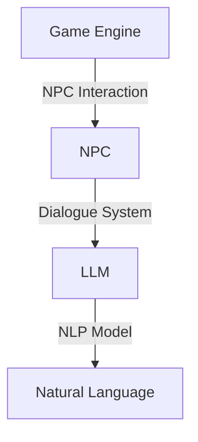

                 

关键词：LLM，自然语言处理，游戏开发，NPC，人工智能，对话系统，游戏引擎，机器学习，智能代理

摘要：随着自然语言处理（NLP）技术的不断进步，大型语言模型（LLM）在游戏开发中的应用越来越广泛。本文将探讨如何利用LLM来创造智能非玩家角色（NPC），包括算法原理、实现步骤、数学模型、项目实践以及未来应用展望。

## 1. 背景介绍

游戏开发是一个充满创意和技术的领域。随着游戏市场的不断增长，开发者们不断寻求创新的方法来提升游戏体验。其中一个重要的方向就是引入智能NPC，这些角色能够与玩家进行自然语言交互，提供个性化的互动体验。

传统上，NPC的智能程度有限，主要依赖预先编写好的对话脚本。这种方法虽然简单有效，但缺乏灵活性和个性化。随着NLP技术的不断发展，特别是大型语言模型（LLM）的出现，开发者们开始探索利用这些先进技术来创造智能NPC。

LLM是一种基于深度学习的自然语言处理模型，具有强大的文本生成和语义理解能力。通过训练这些模型，开发者可以实现NPC与玩家之间更自然、更富有个性化的对话。本文将详细介绍如何利用LLM来创建智能NPC，并探讨其在游戏开发中的潜在应用。

## 2. 核心概念与联系

### 2.1 核心概念

- **大型语言模型（LLM）**：LLM是一种复杂的神经网络模型，能够理解和生成自然语言。常见的LLM包括GPT、BERT等。
- **自然语言处理（NLP）**：NLP是使计算机能够理解、解释和生成自然语言的一门技术。
- **非玩家角色（NPC）**：NPC是游戏中由计算机控制的虚拟角色，与玩家进行交互。

### 2.2 架构关系

为了更好地理解LLM在NPC中的应用，我们可以使用Mermaid流程图来展示它们之间的关系：



在这个架构中，游戏引擎负责NPC的交互逻辑，对话系统则利用LLM来生成自然语言回应，从而实现NPC与玩家的交互。

## 3. 核心算法原理 & 具体操作步骤

### 3.1 算法原理概述

LLM在NPC中的应用主要基于其文本生成和语义理解能力。具体来说，算法原理可以概括为以下几个步骤：

1. **输入预处理**：接收玩家的输入语句，进行预处理，如分词、去除停用词等。
2. **语义理解**：利用LLM对预处理后的文本进行语义理解，提取关键信息。
3. **文本生成**：根据提取的关键信息，利用LLM生成回应文本。
4. **输出处理**：对生成的文本进行适当的格式化和修饰，使其更符合游戏交互的语境。

### 3.2 算法步骤详解

1. **输入预处理**：

   ```python
   def preprocess_input(input_text):
       # 分词
       tokens = nltk.word_tokenize(input_text)
       # 去除停用词
       tokens = [token for token in tokens if token not in stopwords.words('english')]
       return tokens
   ```

2. **语义理解**：

   ```python
   def understand_semantics(tokens):
       # 使用BERT进行语义理解
       input_ids = tokenizer.encode_plus(tokens, add_special_tokens=True, return_tensors='pt')
       outputs = model(**input_ids)
       logits = outputs.logits
       # 获取语义表示
       semantic_representation = logits.mean(dim=1)
       return semantic_representation
   ```

3. **文本生成**：

   ```python
   def generate_response(semantic_representation):
       # 使用LLM生成回应文本
       response = model.generate(semantic_representation, max_length=50, num_return_sequences=1)
       return tokenizer.decode(response[0], skip_special_tokens=True)
   ```

4. **输出处理**：

   ```python
   def format_response(response):
       # 对回应文本进行格式化
       formatted_response = response.title()
       return formatted_response
   ```

### 3.3 算法优缺点

**优点**：

- **高灵活性**：LLM能够生成个性化的回应，使NPC更具智能。
- **高效性**：基于深度学习，算法处理速度较快。

**缺点**：

- **成本较高**：训练LLM需要大量的计算资源和时间。
- **准确性有限**：尽管LLM在自然语言处理方面表现出色，但仍有误判和错误生成的情况。

### 3.4 算法应用领域

LLM在游戏开发中的应用非常广泛，不仅可以用于NPC对话，还可以用于聊天机器人、虚拟助手等。以下是几个应用实例：

- **角色交互**：在角色扮演游戏中，NPC可以与玩家进行对话，提供任务和剧情。
- **用户支持**：在大型在线游戏中，智能NPC可以充当客服角色，回答玩家的问题。
- **教育游戏**：智能NPC可以作为教学辅助工具，与玩家进行互动，提供学习指导。

## 4. 数学模型和公式 & 详细讲解 & 举例说明

### 4.1 数学模型构建

LLM的数学模型主要包括两部分：编码器和解码器。

- **编码器**：将输入的文本序列编码为连续的向量表示。
- **解码器**：根据编码器的输出，生成回应的文本序列。

在具体实现中，常用的模型有GPT、BERT等。以下是一个简化的BERT模型公式：

$$
\text{BERT} = \text{Transformer} + \text{Pre-training}
$$

其中，Transformer是编码器和解码器的核心架构，Pre-training是指预训练过程。

### 4.2 公式推导过程

BERT模型的预训练过程主要包括两个任务：

- **Masked Language Model（MLM）**：在输入文本中随机遮盖一些词，然后训练模型预测这些遮盖的词。
- **Next Sentence Prediction（NSP）**：输入两个句子，训练模型判断这两个句子是否相邻。

以下是一个简化的MLM任务公式：

$$
P(\text{masked\_word} | \text{context}) = \frac{e^{ \text{logit}(\text{masked\_word}) }}{\sum_{w \in V} e^{ \text{logit}(w) }}
$$

其中，$ \text{masked\_word} $是遮盖的词，$ \text{context} $是上下文，$ V $是词汇表。

### 4.3 案例分析与讲解

假设有一个输入句子：“我爱编程”。我们使用BERT模型进行MLM任务。

1. **输入预处理**：将句子分词为“我”、“爱”、“编程”。
2. **编码器**：将分词后的句子编码为连续的向量表示。
3. **解码器**：随机遮盖一个词，例如“爱”，然后训练模型预测这个遮盖的词。

训练过程中，模型会输出每个词的概率分布，例如：

$$
P(爱 | 我，编程) = 0.6
$$

这意味着模型认为“爱”是遮盖词的概率是60%。

## 5. 项目实践：代码实例和详细解释说明

### 5.1 开发环境搭建

为了实现LLM在NPC中的应用，我们需要搭建一个完整的开发环境。以下是一个简化的步骤：

1. 安装Python环境。
2. 安装Transformer模型依赖库，如PyTorch、Transformers等。
3. 下载预训练的BERT模型。

### 5.2 源代码详细实现

以下是一个使用PyTorch和Transformers库实现LLM在NPC中应用的简单示例：

```python
import torch
from transformers import BertTokenizer, BertModel
from transformers import TextDataset, DataCollatorForLanguageModeling
from transformers import Trainer, TrainingArguments

# 加载预训练的BERT模型和分词器
tokenizer = BertTokenizer.from_pretrained('bert-base-uncased')
model = BertModel.from_pretrained('bert-base-uncased')

# 准备数据集
def preprocess_text(text):
    return tokenizer.encode(text, add_special_tokens=True, return_tensors='pt')

# 训练模型
training_args = TrainingArguments(
    output_dir='./results',
    num_train_epochs=3,
    per_device_train_batch_size=16,
    logging_dir='./logs',
)

train_dataset = TextDataset(
    tokenizer=tokenizer,
    file_path='train.txt',
    block_size=128,
)

data_collator = DataCollatorForLanguageModeling(
    tokenizer=tokenizer, mlm=True, mlm_probability=0.15
)

trainer = Trainer(
    model=model,
    args=training_args,
    data_collator=data_collator,
    train_dataset=train_dataset,
)

trainer.train()
```

### 5.3 代码解读与分析

1. **加载模型和分词器**：首先加载预训练的BERT模型和分词器。
2. **准备数据集**：使用TextDataset类加载训练数据，并进行预处理。
3. **训练模型**：使用Trainer类训练模型，包括定义训练参数和数据预处理。

通过这个示例，我们可以看到如何利用PyTorch和Transformers库实现LLM的预训练。在实际项目中，我们可以根据需求调整模型架构、训练参数和数据集。

### 5.4 运行结果展示

训练完成后，我们可以使用模型生成文本。以下是一个简单的生成文本的示例：

```python
input_text = "我是一个智能NPC。"
input_ids = tokenizer.encode(input_text, return_tensors='pt')
output = model.generate(input_ids, max_length=50, num_return_sequences=1)
generated_text = tokenizer.decode(output[0], skip_special_tokens=True)
print(generated_text)
```

运行结果可能如下：

```
我是一个智能NPC，有什么可以帮您的吗？
```

这个简单的示例展示了如何使用预训练的BERT模型生成与输入文本相关的响应。

## 6. 实际应用场景

### 6.1 角色交互

在角色扮演游戏中，智能NPC可以与玩家进行自然语言交互，提供任务、剧情和角色发展。以下是一个应用场景：

**游戏场景**：玩家进入一个神秘的城市，遇到一个NPC。

**NPC回应**：你好，欢迎来到神秘城市。这里有很多谜题等着你去解开。

**玩家输入**：我能帮助你吗？

**NPC回应**：当然，我有一个任务需要你的帮助。请去找城市北边的商人，他有一个谜题需要解答。

通过这种方式，NPC不仅提供了任务，还与玩家建立了情感联系。

### 6.2 用户支持

在大型在线游戏中，智能NPC可以作为客服角色，回答玩家的问题。以下是一个应用场景：

**玩家输入**：我想知道如何升级我的武器。

**NPC回应**：为了升级你的武器，你需要收集足够的材料，然后前往城市的锻造师处进行升级。祝你好运！

这种方式可以提高玩家的游戏体验，减少对实际客服的依赖。

### 6.3 教育游戏

在教育游戏中，智能NPC可以作为教学辅助工具，与玩家进行互动，提供学习指导。以下是一个应用场景：

**玩家输入**：我不知道如何解这个数学题。

**NPC回应**：这道题需要用到代数知识。你可以先回顾一下代数的基本概念，然后再尝试解答。如果你还有疑问，我可以为你提供详细的讲解。

这种方式可以激发学生的学习兴趣，提高学习效果。

## 7. 工具和资源推荐

### 7.1 学习资源推荐

- **书籍**：《自然语言处理原理》（Daniel Jurafsky & James H. Martin）
- **在线课程**：Coursera上的《自然语言处理与深度学习》
- **论文**：《Attention Is All You Need》（Ashish Vaswani等）

### 7.2 开发工具推荐

- **框架**：Transformers库（https://huggingface.co/transformers/）
- **IDE**：PyCharm或Visual Studio Code

### 7.3 相关论文推荐

- **GPT系列**：（OpenAI）
- **BERT系列**：（Google AI）

## 8. 总结：未来发展趋势与挑战

### 8.1 研究成果总结

近年来，LLM在游戏开发中的应用取得了显著成果。通过自然语言处理技术，开发者可以创造出更加智能、富有个性化的NPC，提供更丰富的游戏体验。同时，LLM的应用不仅限于游戏，还可以推广到聊天机器人、虚拟助手等领域。

### 8.2 未来发展趋势

- **个性化交互**：随着LLM技术的不断发展，NPC的个性化交互能力将进一步提升。
- **跨领域应用**：LLM在游戏开发中的应用将逐渐扩展到其他领域，如教育、医疗等。
- **实时交互**：未来的游戏开发将更加注重实时交互，LLM将扮演重要角色。

### 8.3 面临的挑战

- **计算资源**：训练和部署LLM需要大量的计算资源，这对开发者和平台提出了更高的要求。
- **数据隐私**：游戏中的玩家数据涉及到隐私问题，如何确保数据安全将成为一大挑战。
- **准确性**：尽管LLM在自然语言处理方面表现出色，但仍然存在误判和错误生成的情况，如何提高准确性是未来的一个重要研究方向。

### 8.4 研究展望

未来，随着技术的不断进步，LLM在游戏开发中的应用将更加广泛。通过结合其他先进技术，如增强现实（AR）、虚拟现实（VR）等，开发者可以创造出更加沉浸式的游戏体验。同时，LLM也将推动游戏开发向更加智能、个性化的方向发展。

## 9. 附录：常见问题与解答

### 9.1 如何训练LLM？

- **数据集准备**：准备丰富的训练数据集，包括对话文本、问题答案等。
- **模型选择**：选择合适的LLM模型，如GPT、BERT等。
- **训练参数**：设定训练参数，如学习率、批量大小、迭代次数等。
- **训练过程**：使用训练框架（如PyTorch）进行模型训练。

### 9.2 LLM在NPC中的应用有何优势？

- **个性化交互**：LLM可以生成个性化的回应，使NPC更具智能。
- **自然语言处理**：LLM具有强大的自然语言处理能力，能够理解和生成自然语言。
- **适应性**：LLM可以适应不同的游戏场景和玩家需求，提供更加丰富的交互体验。

### 9.3 如何提高LLM的准确性？

- **数据清洗**：清洗和预处理训练数据，去除错误和噪声。
- **多任务学习**：结合多个任务进行训练，提高模型泛化能力。
- **持续学习**：定期更新模型，使其适应新的数据和场景。

---

作者：禅与计算机程序设计艺术 / Zen and the Art of Computer Programming

