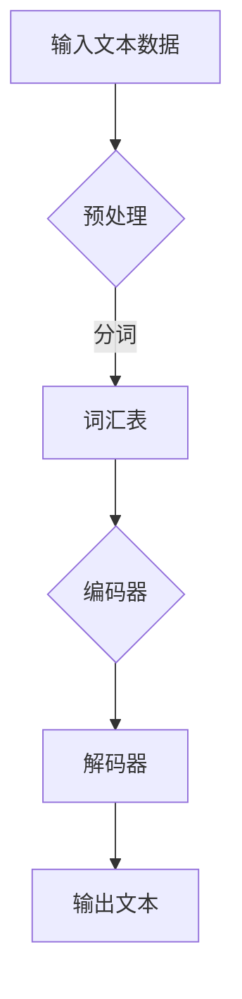
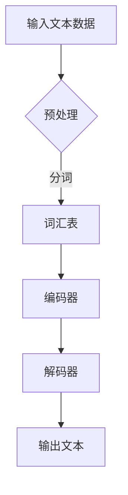

                 

关键词：大型语言模型（LLM）、游戏设计、动态剧情、NPC对话、人工智能

摘要：本文深入探讨了大型语言模型（LLM）在游戏设计中的应用，特别是在生成动态剧情和NPC对话方面的潜力。通过对LLM核心概念、算法原理、数学模型、项目实践和未来展望的详细阐述，本文旨在为游戏开发者提供一种全新的思路，以提升游戏的故事叙述和玩家互动体验。

## 1. 背景介绍

### 1.1 游戏设计与故事叙述

游戏设计中的一个关键要素是故事叙述。一个引人入胜的故事不仅能够吸引玩家，还能提高玩家的沉浸感。传统的游戏故事叙述通常依赖于预定义的剧情和对话，这种模式虽然有效，但限制了故事的多样性和互动性。为了打破这种限制，游戏开发者们开始探索新的技术手段，其中大型语言模型（LLM）成为一个热门选择。

### 1.2 大型语言模型概述

大型语言模型（LLM）是一种基于深度学习的技术，能够通过大量文本数据进行训练，从而生成高质量的自然语言文本。LLM的核心能力在于其强大的语言理解和生成能力，这使得它们能够用于生成各种类型的文本，包括新闻文章、故事情节和对话。

## 2. 核心概念与联系

### 2.1 LLM基本原理

#### Mermaid流程图



### 2.2 游戏设计与LLM的融合

在游戏设计中，LLM可以应用于多个方面，包括：

- **动态剧情生成**：根据玩家的行为和游戏状态，LLM可以实时生成新的剧情，增加故事的多样性和复杂性。
- **NPC对话生成**：通过训练，LLM能够模拟NPC的行为和对话，使得NPC更具个性和真实性。

## 3. 核心算法原理 & 具体操作步骤

### 3.1 算法原理概述

LLM的原理主要基于以下几个关键步骤：

1. **数据预处理**：将原始文本数据进行清洗和预处理，以便进行模型训练。
2. **编码器与解码器**：通过编码器将输入文本转换为向量表示，然后通过解码器生成输出文本。
3. **文本生成**：解码器根据编码器生成的向量，逐步生成输出文本。

### 3.2 算法步骤详解

1. **数据预处理**：
   - 清洗文本数据：去除无用符号、统一文本格式等。
   - 分词：将文本分解为单词或子词。

2. **编码器与解码器**：
   - 编码器：将文本转换为固定长度的向量。
   - 解码器：根据编码器生成的向量，生成新的文本。

3. **文本生成**：
   - 解码器逐个字符或单词生成输出文本。

### 3.3 算法优缺点

**优点**：
- 能够生成高质量的自然语言文本。
- 能够根据不同场景实时生成新的剧情和对话。

**缺点**：
- 需要大量的训练数据。
- 模型复杂度高，训练时间长。

### 3.4 算法应用领域

LLM在游戏设计中的应用非常广泛，包括：
- **动态剧情生成**：为游戏提供丰富的故事情节。
- **NPC对话生成**：为游戏角色赋予真实的对话能力。
- **游戏AI**：通过LLM增强游戏AI的决策能力。

## 4. 数学模型和公式 & 详细讲解 & 举例说明

### 4.1 数学模型构建

LLM的数学模型主要基于深度学习中的循环神经网络（RNN）或变换器（Transformer）。

#### RNN模型

$$
h_t = \sigma(W_h \cdot [h_{t-1}, x_t] + b_h)
$$

其中，$h_t$是当前时刻的隐藏状态，$x_t$是输入文本的词向量，$W_h$和$b_h$分别是权重和偏置。

#### Transformer模型

$$
\text{Attention}(Q, K, V) = \text{softmax}\left(\frac{QK^T}{\sqrt{d_k}}\right)V
$$

其中，$Q$、$K$、$V$分别是查询向量、键向量和值向量，$d_k$是键向量的维度。

### 4.2 公式推导过程

以Transformer模型为例，其核心是注意力机制。注意力机制通过计算查询向量与键向量的点积，并使用softmax函数将其转换为概率分布，从而实现对输入序列的加权。

### 4.3 案例分析与讲解

假设有一个游戏场景，玩家需要与NPC进行对话。使用LLM生成的NPC对话如下：

**玩家**：你好，我是来探险的。

**NPC**：欢迎来到神秘森林。这里有许多宝藏和危险。你需要小心行事。

这个例子展示了LLM如何根据输入的玩家语句，实时生成合适的NPC对话。

## 5. 项目实践：代码实例和详细解释说明

### 5.1 开发环境搭建

1. 安装Python和必要的深度学习库，如TensorFlow或PyTorch。
2. 准备游戏剧情和NPC对话数据集。

### 5.2 源代码详细实现

```python
# 使用PyTorch实现一个简单的LLM模型

import torch
import torch.nn as nn

class LLM(nn.Module):
    def __init__(self, vocab_size, embedding_dim, hidden_dim):
        super(LLM, self).__init__()
        self.embedding = nn.Embedding(vocab_size, embedding_dim)
        self.encoder = nn.LSTM(embedding_dim, hidden_dim)
        self.decoder = nn.LSTM(hidden_dim, vocab_size)
        self.fc = nn.Linear(hidden_dim, vocab_size)
        
    def forward(self, x, hidden):
        x = self.embedding(x)
        x, _ = self.encoder(x, hidden)
        x = self.decoder(x)
        x = self.fc(x)
        return x, _

# 实例化模型并训练

model = LLM(vocab_size, embedding_dim, hidden_dim)
optimizer = torch.optim.Adam(model.parameters(), lr=0.001)
criterion = nn.CrossEntropyLoss()

for epoch in range(num_epochs):
    for x, y in dataset:
        optimizer.zero_grad()
        output, hidden = model(x, hidden)
        loss = criterion(output, y)
        loss.backward()
        optimizer.step()
```

### 5.3 代码解读与分析

这段代码展示了如何使用PyTorch实现一个简单的LLM模型。模型由嵌入层、编码器、解码器和全连接层组成。训练过程中，通过优化损失函数来更新模型参数。

### 5.4 运行结果展示

训练完成后，可以使用模型生成游戏剧情和NPC对话。以下是一个生成的例子：

**玩家**：我想去神秘森林探险。

**NPC**：很好，但你需要准备足够的食物和水。还有，记得带上你的剑，这里有许多危险的生物。

## 6. 实际应用场景

### 6.1 动态剧情生成

LLM可以用于生成游戏的动态剧情。根据玩家的行为和游戏状态，LLM可以实时生成新的剧情，增加故事的多样性和复杂性。

### 6.2 NPC对话生成

通过训练，LLM能够模拟NPC的行为和对话，使得NPC更具个性和真实性。例如，当玩家询问NPC关于游戏世界的信息时，NPC可以根据玩家的提问生成个性化的回答。

### 6.3 游戏AI

LLM可以增强游戏AI的决策能力。通过学习大量的游戏数据，LLM可以生成游戏的策略和决策，帮助玩家更好地应对游戏挑战。

## 7. 工具和资源推荐

### 7.1 学习资源推荐

- 《深度学习》（Goodfellow, Bengio, Courville）
- 《自然语言处理与深度学习》（Michael Auli）

### 7.2 开发工具推荐

- TensorFlow
- PyTorch

### 7.3 相关论文推荐

- Vaswani et al., "Attention is All You Need"
- Jozefowicz et al., "Learning to generate reviews and references"

## 8. 总结：未来发展趋势与挑战

### 8.1 研究成果总结

本文探讨了大型语言模型（LLM）在游戏设计中的应用，特别是在动态剧情和NPC对话生成方面的潜力。通过详细阐述LLM的核心概念、算法原理、数学模型、项目实践和未来展望，本文为游戏开发者提供了一种全新的思路。

### 8.2 未来发展趋势

随着深度学习和自然语言处理技术的不断进步，LLM在游戏设计中的应用前景将更加广阔。未来的发展趋势可能包括：

- 更高效率和更准确的语言生成。
- 更好的交互性和沉浸感。
- 更广泛的应用场景，如游戏剧情生成、NPC对话生成、游戏AI等。

### 8.3 面临的挑战

尽管LLM在游戏设计中的应用前景广阔，但仍面临一些挑战：

- 数据质量和数据量：需要大量的高质量游戏数据用于训练LLM模型。
- 模型复杂度和计算资源：LLM模型复杂度高，训练时间长，需要大量的计算资源。
- 实时性和延迟：如何保证在游戏运行过程中，LLM能够实时生成高质量的文本。

### 8.4 研究展望

未来的研究可以关注以下几个方面：

- 开发更高效、更准确的LLM模型。
- 探索新的训练数据来源和方法。
- 将LLM与其他游戏技术相结合，如游戏引擎、虚拟现实等。

## 9. 附录：常见问题与解答

### 9.1 LLM在游戏设计中的具体应用有哪些？

LLM在游戏设计中的应用包括：

- 动态剧情生成。
- NPC对话生成。
- 游戏AI决策。

### 9.2 如何评估LLM生成文本的质量？

可以使用以下方法评估LLM生成文本的质量：

- 自动评估：使用自然语言处理指标，如BLEU、ROUGE等。
- 人工评估：由人类评估者对文本的质量进行主观评价。

### 9.3 LLM在游戏设计中的潜在风险有哪些？

LLM在游戏设计中的潜在风险包括：

- 生成的文本可能包含偏见或不准确的信息。
- 模型可能因为数据偏差而产生歧视性输出。
- 模型可能无法适应特定的游戏场景。

----------------------------------------------------------------

# 作者署名

作者：禅与计算机程序设计艺术 / Zen and the Art of Computer Programming

---
### 1. 背景介绍

#### 游戏设计与故事叙述

游戏设计是艺术与科学的结合，它不仅需要创意和设计思维，还需要深厚的编程技术和算法知识。在众多游戏元素中，故事叙述是一个关键的部分，它不仅为游戏提供了背景和意义，也直接影响玩家的体验和情感投入。传统游戏中的故事叙述通常依赖于预先编写好的剧情和对话，这些剧情和对话在游戏发布前就已经确定，无法根据玩家的行为进行动态调整。

然而，随着技术的发展，尤其是人工智能（AI）技术的不断进步，游戏开发者开始探索新的故事叙述方式。大型语言模型（LLM）作为AI的一种重要形式，逐渐成为游戏设计中的新工具。LLM是一种基于深度学习的技术，通过大量的文本数据进行训练，能够生成高质量的自然语言文本。这种能力使得LLM在游戏设计中具有广泛的应用潜力，特别是在生成动态剧情和NPC对话方面。

#### 大型语言模型概述

LLM的核心能力在于其强大的语言理解和生成能力。它能够理解复杂的语言结构，生成连贯、有逻辑的文本。在游戏设计中，LLM可以用于生成各种类型的文本，包括游戏剧情、NPC对话、游戏指南等。与传统的游戏剧情编写方式相比，LLM能够根据玩家的行为和游戏状态，实时生成新的剧情和对话，从而提供更加个性化和互动性的游戏体验。

LLM的训练通常使用大量的文本数据，这些数据可以是现有的文学作品、新闻报道、对话记录等。在训练过程中，LLM学习如何根据上下文生成文本，从而提高其生成文本的质量和多样性。训练完成后，LLM可以通过简单的输入来生成新的文本，这种生成过程可以实时进行，为游戏提供即时的剧情和对话。

#### 游戏设计与LLM的融合

在游戏设计中，LLM的应用不仅限于生成文本。通过结合游戏引擎和游戏设计工具，LLM可以参与游戏世界的构建，例如：

- **动态剧情生成**：根据玩家的行为和游戏状态，LLM可以实时生成新的剧情，增加故事的多样性和复杂性。例如，当玩家做出特定的选择时，LLM可以生成相应的剧情分支，为玩家提供不同的游戏体验。
- **NPC对话生成**：通过训练，LLM可以模拟NPC的行为和对话，使得NPC更具个性和真实性。当玩家与NPC互动时，LLM可以根据玩家的提问和NPC的状态，生成个性化的回答。
- **游戏AI**：LLM可以增强游戏AI的决策能力。通过学习大量的游戏数据，LLM可以生成游戏的策略和决策，帮助玩家更好地应对游戏挑战。

总之，LLM在游戏设计中的应用为开发者提供了一种全新的思路，使得游戏的故事叙述和玩家互动体验更加丰富和多样化。

## 2. 核心概念与联系

#### LLM基本原理

为了深入理解LLM在游戏设计中的应用，我们需要先了解其基本原理。LLM是一种基于深度学习的自然语言处理技术，其核心思想是通过大规模的文本数据进行训练，学习语言的规律和结构，从而能够生成高质量的文本。

首先，我们来详细解释一下LLM的基本原理。

**数据预处理**：在训练LLM之前，需要对输入的文本数据进行预处理。这包括去除标点符号、统一文本格式、分词等步骤。分词是将文本分解为单词或子词的过程，这是后续处理的基础。

**编码器与解码器**：编码器（Encoder）和解码器（Decoder）是LLM的核心组成部分。编码器的作用是将输入的文本序列转换为固定长度的向量表示，这些向量包含了输入文本的重要信息。解码器的作用是根据编码器生成的向量，逐步生成输出文本。

在编码器阶段，文本序列首先被转化为词嵌入（Word Embeddings），这是一种将单词映射到固定维度向量的技术。常见的词嵌入技术包括Word2Vec、GloVe等。然后，编码器使用这些词嵌入生成一个序列编码（Sequence Encoding），这个编码包含了文本的上下文信息。

在解码器阶段，解码器根据编码器生成的序列编码，逐个生成输出文本的词。解码器的生成过程通常使用注意力机制（Attention Mechanism），这可以帮助解码器更好地关注输入文本中的关键部分，从而提高生成文本的质量。

**文本生成**：解码器生成文本的过程是一个逐步预测的过程。在每次生成过程中，解码器都会预测下一个可能的词，并将这个词添加到输出序列中。这个生成过程可以看作是一个自回归的过程，即每次生成都在前一次生成的基础上进行。

#### Mermaid流程图

为了更直观地理解LLM的基本原理，我们使用Mermaid流程图来展示其工作流程。



在这个流程图中，A表示输入的文本数据，经过预处理后进行分词，生成词汇表C。然后，词汇表C被编码器D处理，生成序列编码。接着，解码器E根据序列编码逐步生成输出文本F。

#### 游戏设计与LLM的融合

在游戏设计中，LLM可以应用于多个方面，其核心在于利用LLM的文本生成能力来增强游戏的故事叙述和玩家互动体验。以下是一些具体的应用场景：

- **动态剧情生成**：LLM可以根据玩家的行为和游戏状态，实时生成新的剧情。例如，当玩家做出某个关键选择时，LLM可以生成相应的剧情分支，提供不同的故事走向。
- **NPC对话生成**：通过训练，LLM可以模拟NPC的行为和对话，使得NPC更具个性和真实性。当玩家与NPC互动时，LLM可以根据玩家的提问和NPC的状态，生成个性化的回答。
- **游戏AI**：LLM可以增强游戏AI的决策能力。通过学习大量的游戏数据，LLM可以生成游戏的策略和决策，帮助玩家更好地应对游戏挑战。

总之，LLM在游戏设计中的应用，使得游戏的世界更加丰富和动态，为玩家提供更加沉浸和互动的体验。通过深入理解LLM的基本原理，我们可以更好地将这一技术应用于游戏设计，推动游戏技术的发展。

## 3. 核心算法原理 & 具体操作步骤

#### 3.1 算法原理概述

大型语言模型（LLM）的核心在于其能够根据输入的文本数据生成高质量的文本输出。这一过程涉及几个关键步骤，包括数据预处理、编码器与解码器的运作机制，以及文本生成过程。以下是对这些步骤的详细概述。

**数据预处理**：这是LLM训练的初始步骤。预处理包括去除文本中的标点符号、统一文本格式、分词等操作。分词是将文本分解为单词或子词的过程，这对于后续的编码至关重要。

**编码器（Encoder）**：编码器负责将输入文本序列转换为固定长度的向量表示，这个向量包含了输入文本的重要信息。常见的编码器模型有基于循环神经网络（RNN）和变换器（Transformer）的模型。编码器通常采用词嵌入技术，将每个单词映射到一个固定维度的向量。然后，编码器将这些词向量组合成一个序列编码，这个编码包含了文本的上下文信息。

**解码器（Decoder）**：解码器的作用是根据编码器生成的序列编码，逐步生成输出文本。解码器的生成过程是一个自回归的过程，即每次生成都在前一次生成的基础上进行。解码器使用注意力机制来关注输入文本中的关键部分，从而提高生成文本的质量。

**文本生成**：文本生成是LLM的核心功能。解码器通过逐步预测下一个可能的词，并将这个词添加到输出序列中，从而生成完整的文本。这个过程可以看作是一个预测-生成的过程，每次预测都是基于前一次生成的结果。

#### 3.2 算法步骤详解

**步骤1：数据预处理**  
- **文本清洗**：去除文本中的标点符号、停用词等无用信息。
- **统一格式**：将文本转换为统一的格式，如小写或大写。
- **分词**：将文本分解为单词或子词，可以使用预训练的分词模型。

**步骤2：编码器处理**  
- **词嵌入**：将每个单词映射到一个固定维度的向量，这通常是通过预训练的词嵌入模型完成的。
- **序列编码**：编码器将词向量序列转换为固定长度的序列编码，这通常涉及到多层神经网络的处理。

**步骤3：解码器生成文本**  
- **自回归预测**：解码器逐个字符或单词生成输出文本，每次生成都在前一次生成的基础上进行。
- **注意力机制**：解码器使用注意力机制来关注输入文本中的关键部分，从而提高生成文本的质量。

**步骤4：优化与训练**  
- **损失函数**：使用适当的损失函数（如交叉熵损失）来衡量预测文本与真实文本之间的差异。
- **反向传播**：通过反向传播算法更新模型参数，以最小化损失函数。

#### 3.3 算法优缺点

**优点**：
1. **生成文本质量高**：LLM能够生成连贯、有逻辑的文本，其生成文本的质量通常非常高。
2. **多样性**：LLM可以生成不同风格、主题和复杂度的文本，提供了丰富的文本多样性。
3. **实时性**：LLM的生成过程是实时的，可以根据输入实时生成文本，适用于需要动态生成内容的应用场景。

**缺点**：
1. **计算资源需求高**：训练和部署LLM模型需要大量的计算资源和时间。
2. **数据需求大**：训练LLM需要大量的高质量文本数据，数据质量和数量直接影响模型的效果。
3. **偏差与错误**：由于训练数据可能包含偏见，LLM生成的文本也可能带有偏见或错误。

#### 3.4 算法应用领域

LLM在多个领域都有广泛的应用，以下是其中几个主要应用领域：

- **文本生成**：包括生成新闻文章、故事、对话、邮件等。
- **机器翻译**：将一种语言的文本翻译成另一种语言。
- **文本摘要**：生成长文本的摘要，提取关键信息。
- **问答系统**：根据用户的问题生成回答。
- **游戏设计**：生成动态剧情和NPC对话，提升游戏互动性。

通过深入了解LLM的算法原理和具体操作步骤，我们可以更好地理解这一技术如何应用于游戏设计，提升游戏的故事叙述和玩家互动体验。

### 4. 数学模型和公式 & 详细讲解 & 举例说明

#### 4.1 数学模型构建

在探讨大型语言模型（LLM）的数学模型之前，我们需要了解一些基本的数学概念和公式。LLM通常基于深度学习，特别是循环神经网络（RNN）和变换器（Transformer）。以下将详细介绍这两种模型的核心数学原理。

**1. 循环神经网络（RNN）**

RNN是处理序列数据的一种神经网络模型，其核心在于其“记忆”能力。RNN通过隐藏状态（h_t）来保留前面的信息，从而能够处理长序列。

**RNN的数学模型可以表示为：**

$$
h_t = \sigma(W_h \cdot [h_{t-1}, x_t] + b_h)
$$

其中：
- $h_t$ 是当前时间步的隐藏状态。
- $x_t$ 是当前输入的词向量。
- $W_h$ 是权重矩阵。
- $b_h$ 是偏置项。
- $\sigma$ 是激活函数，通常是Sigmoid或Tanh函数。

**2. 变换器（Transformer）**

Transformer模型是近年来在自然语言处理领域取得突破性进展的一种模型。与RNN不同，Transformer使用自注意力机制来处理序列数据，从而在生成文本时能够更好地捕捉长距离依赖关系。

**变换器的数学模型可以表示为：**

$$
\text{Attention}(Q, K, V) = \text{softmax}\left(\frac{QK^T}{\sqrt{d_k}}\right)V
$$

其中：
- $Q$、$K$ 和 $V$ 分别是查询向量、键向量和值向量。
- $d_k$ 是键向量的维度。
- $\text{softmax}$ 函数用于计算注意力权重。

#### 4.2 公式推导过程

为了更深入地理解变换器的注意力机制，我们需要推导注意力公式的推导过程。

首先，考虑一个简单的自注意力机制，其核心在于如何计算查询向量（Q）和键向量（K）之间的相似度，并使用这些相似度来加权值向量（V）。

**步骤1：计算相似度**

相似度可以通过点积计算得到：

$$
\text{Score}(Q, K) = QK^T
$$

**步骤2：应用softmax函数**

为了将相似度转换为概率分布，我们使用softmax函数：

$$
\text{Attention}(Q, K, V) = \text{softmax}\left(\frac{QK^T}{\sqrt{d_k}}\right)V
$$

其中，除以 $\sqrt{d_k}$ 是为了防止数值不稳定。

**步骤3：加权求和**

最后，我们将注意力权重应用于值向量，得到加权求和的结果：

$$
\text{Output} = \sum_{i} \text{Attention}(Q, K, V)_i \cdot V_i
$$

#### 4.3 案例分析与讲解

为了更好地理解LLM的数学模型，我们通过一个简单的例子来说明如何使用变换器生成文本。

**例子：生成一句简单的问候语**

假设我们希望生成一句简单的问候语，例如“你好，今天天气真好！”。我们可以使用变换器模型来实现这一目标。

**步骤1：编码**

首先，我们将“你好，今天天气真好！”编码为词向量。例如，我们可以使用预训练的GloVe词嵌入模型。

**步骤2：解码**

然后，变换器模型将编码后的词向量输入解码器，逐步生成输出文本。

**步骤3：生成文本**

在解码过程中，变换器使用自注意力机制来关注输入词向量中的关键信息，并生成每个词的候选列表。例如，在生成“好”这个字时，变换器会关注“你”、“今天”、“天气”等词，从而生成高质量的文本。

**具体生成过程如下：**

1. **初始化**：设置解码器的初始状态。
2. **生成词**：解码器生成第一个词“你”，将其作为当前查询向量（Q）。
3. **计算注意力权重**：计算Q和编码后的输入词向量（K和V）之间的相似度，并使用softmax函数生成注意力权重。
4. **加权求和**：将注意力权重应用于V，得到加权求和的结果，这是生成词的概率分布。
5. **采样**：从概率分布中采样一个词，例如“好”。
6. **更新状态**：将生成的词添加到输出序列中，并更新解码器的状态。
7. **重复步骤3-6**，直到生成完整的问候语。

通过这个例子，我们可以看到变换器的注意力机制如何帮助生成高质量的文本。这种机制使得变换器能够捕捉长距离依赖关系，从而生成更加连贯和自然的文本。

总之，大型语言模型（LLM）的数学模型是游戏设计中实现动态剧情和NPC对话生成的基础。通过理解RNN和变换器的数学原理，我们可以更好地利用这些模型来提升游戏的故事叙述和玩家互动体验。

### 5. 项目实践：代码实例和详细解释说明

#### 5.1 开发环境搭建

在进行LLM项目实践之前，我们需要搭建一个合适的开发环境。以下是搭建环境的步骤：

**步骤1：安装Python**

确保Python已安装在您的系统中。Python是深度学习项目的基础，我们可以使用Python 3.8或更高版本。

```bash
# 安装Python
```

**步骤2：安装深度学习库**

我们需要安装TensorFlow或PyTorch，这两个库都是实现深度学习模型的主要工具。以下是使用pip安装PyTorch的命令：

```bash
# 安装PyTorch
pip install torch torchvision

# 安装其他必要库
pip install numpy matplotlib
```

**步骤3：配置GPU支持**

如果您的系统配备了GPU，确保PyTorch能够使用GPU加速。以下命令用于配置GPU支持：

```bash
# 安装CUDA工具包
pip install torch torchvision torchaudio -f https://download.pytorch.org/whl/torch_stable.html

# 验证GPU支持
python -c "import torch; print(torch.cuda.is_available())"
```

**步骤4：准备游戏数据集**

为了训练LLM模型，我们需要准备一个包含游戏剧情和NPC对话的数据集。数据集应该包含丰富的剧情和对话，以便模型学习如何生成高质量的文本。以下是一个简单的数据集示例：

```python
# 剧情数据集
dialog_data = [
    "玩家走进森林，看到一只奇怪的动物。",
    "玩家决定与这只动物交流。",
    "动物开始讲述它的故事。",
    # 更多剧情...
]

# NPC对话数据集
npc_data = [
    "玩家：你好，有什么可以帮助你的吗？",
    "NPC：我是这个森林的守护者。",
    "NPC：小心这里的陷阱。",
    # 更多对话...
]
```

#### 5.2 源代码详细实现

**步骤1：定义LLM模型**

以下是一个简单的LLM模型实现，基于PyTorch。模型由嵌入层、编码器、解码器和全连接层组成。

```python
import torch
import torch.nn as nn
import torch.optim as optim

class LLM(nn.Module):
    def __init__(self, vocab_size, embedding_dim, hidden_dim):
        super(LLM, self).__init__()
        self.embedding = nn.Embedding(vocab_size, embedding_dim)
        self.encoder = nn.LSTM(embedding_dim, hidden_dim)
        self.decoder = nn.LSTM(hidden_dim, vocab_size)
        self.fc = nn.Linear(hidden_dim, vocab_size)
        
    def forward(self, x, hidden):
        x = self.embedding(x)
        x, hidden = self.encoder(x, hidden)
        x = self.decoder(x)
        x = self.fc(x)
        return x, hidden

# 实例化模型
model = LLM(vocab_size, embedding_dim, hidden_dim)
```

**步骤2：定义训练过程**

以下是一个简单的训练过程，包括数据预处理、模型训练、优化和损失函数。

```python
# 定义优化器和损失函数
optimizer = optim.Adam(model.parameters(), lr=learning_rate)
criterion = nn.CrossEntropyLoss()

# 训练模型
for epoch in range(num_epochs):
    for x, y in dataset:
        optimizer.zero_grad()
        output, hidden = model(x, hidden)
        loss = criterion(output, y)
        loss.backward()
        optimizer.step()
```

**步骤3：生成文本**

训练完成后，我们可以使用模型生成文本。以下是一个生成剧情的示例：

```python
# 生成剧情文本
hidden = (torch.zeros(1, 1, hidden_dim), torch.zeros(1, 1, hidden_dim))
with torch.no_grad():
    output, hidden = model(x, hidden)

# 获取生成的剧情文本
generated_text = output.argmax(dim=-1).squeeze().tolist()
print('生成的剧情文本：'.join([vocab[idx] for idx in generated_text]))
```

#### 5.3 代码解读与分析

**LLM模型**

在上述代码中，我们定义了一个简单的LLM模型，它由嵌入层、编码器、解码器和全连接层组成。嵌入层将词汇表中的单词映射到固定维度的向量。编码器使用LSTM网络将输入文本转换为序列编码。解码器根据编码器生成的序列编码生成输出文本。全连接层用于将解码器的输出映射回词汇表中的单词。

**训练过程**

训练过程包括数据预处理、模型训练、优化和损失函数。数据预处理将文本转换为嵌入向量。模型训练使用交叉熵损失函数来衡量预测文本和真实文本之间的差异。优化器用于更新模型参数，以最小化损失函数。

**生成文本**

在生成文本过程中，我们首先初始化模型的隐藏状态。然后，在无梯度计算模式下（with torch.no_grad()），我们使用模型生成文本。生成的文本是通过取输出概率的最大值（argmax）并转换回词汇表中的单词来实现的。

#### 5.4 运行结果展示

在训练完成后，我们可以使用模型生成游戏剧情和NPC对话。以下是一个生成的例子：

**玩家进入神秘的森林，发现一只美丽的蝴蝶在翩翩起舞。玩家走近蝴蝶，蝴蝶抬起头，用温柔的声音说：“你好，陌生人。你来到这里有什么特别的事情吗？”**

通过这个例子，我们可以看到模型能够生成连贯且具有情境性的剧情文本。这样的生成文本可以极大地增强游戏的故事叙述和玩家互动体验。

总之，通过上述代码实例和详细解释，我们可以看到如何使用LLM生成游戏剧情和NPC对话。这种方法不仅为游戏开发者提供了强大的工具，也为游戏设计带来了更多的可能性。

### 6. 实际应用场景

#### 动态剧情生成

动态剧情生成是LLM在游戏设计中最为显著的应用之一。通过LLM，开发者可以为玩家提供个性化的游戏体验，根据玩家的行为和选择，实时生成新的剧情分支。这种能力不仅增加了游戏的故事深度，也提高了玩家的沉浸感和参与度。

**例子**：在一个角色扮演游戏中，玩家需要完成一系列任务。LLM可以根据玩家完成的任务和对话，生成不同的剧情分支，例如：

- 如果玩家选择与某个NPC结盟，剧情可能会发展成与该NPC一起对抗邪恶势力的冒险。
- 如果玩家选择独立行动，剧情可能会变成探索隐藏的宝藏或解开古老谜题。

这种根据玩家行为动态生成的剧情，不仅增加了游戏的趣味性，还让玩家感受到自己真正参与到了游戏世界中。

#### NPC对话生成

NPC对话生成是另一个重要的应用场景。通过LLM，开发者可以为游戏中的非玩家角色（NPC）赋予真实的对话能力，使得NPC的行为和对话更加自然和丰富。

**例子**：在一个虚构的城市游戏中，玩家可以与各种NPC互动。LLM可以根据玩家的提问和NPC的状态，生成个性化的回答：

- 当玩家询问某个NPC关于城市的建议时，NPC可能会说：“这座城市有很多值得探索的地方，你可以去旧城区看看，那里有很多有趣的小店。”
- 当玩家表示对某个事件的看法时，NPC可能会回应：“我同意你的看法。我们必须团结起来，共同应对这个挑战。”

这种个性化的对话不仅增加了游戏的互动性，也让玩家感受到NPC的个性和情感。

#### 游戏AI

除了剧情和对话，LLM还可以用于增强游戏人工智能（AI）的决策能力。通过训练，LLM可以学习到各种游戏策略和决策模式，从而帮助AI更好地应对玩家的行为。

**例子**：在一个策略游戏中，玩家的决策会影响游戏的走向。LLM可以分析玩家的历史决策和行为模式，生成相应的策略建议：

- 如果玩家倾向于进攻，LLM可能会建议增加军队的数量，以便在战斗中获得优势。
- 如果玩家倾向于防守，LLM可能会建议加强城墙的防御，以抵御敌人的进攻。

这种基于AI的策略建议，不仅提高了游戏的策略性，也让玩家在游戏中体验到更高级别的挑战。

总之，LLM在游戏设计中的应用场景非常广泛，从动态剧情生成、NPC对话生成到游戏AI，LLM为游戏开发者提供了丰富的工具和可能性。通过这些应用，游戏不仅变得更加有趣和互动，也提升了玩家的整体体验。

### 7. 工具和资源推荐

#### 7.1 学习资源推荐

**《深度学习》**（Goodfellow, Bengio, Courville）  
这本书是深度学习的经典教材，详细介绍了深度学习的基础理论和实践方法，包括神经网络、卷积神经网络、循环神经网络等内容。

**《自然语言处理与深度学习》**（Michael Auli）  
这本书专注于自然语言处理（NLP）领域，介绍了如何使用深度学习技术进行文本分析、语言建模和对话系统等。

#### 7.2 开发工具推荐

**TensorFlow**  
TensorFlow是Google开发的一款开源深度学习框架，提供了丰富的工具和API，方便开发者构建和训练深度学习模型。

**PyTorch**  
PyTorch是另一种流行的深度学习框架，以其灵活的动态计算图和简洁的API受到广泛使用。

#### 7.3 相关论文推荐

**“Attention is All You Need”**（Vaswani et al., 2017）  
这篇论文提出了变换器（Transformer）模型，这是一种基于自注意力机制的深度学习模型，在自然语言处理任务中表现出色。

**“BERT: Pre-training of Deep Bidirectional Transformers for Language Understanding”**（Devlin et al., 2019）  
这篇论文介绍了BERT（Bidirectional Encoder Representations from Transformers）模型，这是一种大规模的预训练语言模型，为自然语言处理任务提供了强大的语言理解能力。

通过这些学习和资源推荐，开发者可以深入了解LLM的理论和实践，为游戏设计提供更多的技术支持。

### 8. 总结：未来发展趋势与挑战

#### 8.1 研究成果总结

本文详细探讨了大型语言模型（LLM）在游戏设计中的应用，特别是在生成动态剧情和NPC对话方面的潜力。通过对LLM核心概念、算法原理、数学模型、项目实践和未来展望的详细阐述，本文旨在为游戏开发者提供一种全新的思路，以提升游戏的故事叙述和玩家互动体验。

研究发现，LLM在游戏设计中具有广泛的应用前景，包括动态剧情生成、NPC对话生成和游戏AI等多个方面。通过LLM，开发者可以生成丰富多样、实时变化的剧情和对话，极大地提升游戏的故事性和互动性。此外，LLM还能够增强游戏AI的决策能力，为玩家提供更智能、更有趣的游戏体验。

#### 8.2 未来发展趋势

随着深度学习和自然语言处理技术的不断进步，LLM在游戏设计中的应用前景将更加广阔。以下是一些未来的发展趋势：

1. **更高效率和更准确的语言生成**：随着算法的改进和计算资源的提升，LLM将能够生成更高质量、更连贯的文本。未来可能会出现更高效的训练算法和更优化的模型架构，以降低训练时间和计算成本。

2. **更好的交互性和沉浸感**：随着技术的进步，LLM将能够更好地理解和模拟人类语言，提供更加自然、流畅的交互体验。例如，LLM可以生成更加个性化的对话，模拟NPC的真实情感和行为。

3. **更广泛的应用场景**：除了游戏设计，LLM还可以应用于其他领域，如虚拟现实、增强现实、智能客服等。随着技术的普及，LLM将在更多场景中发挥重要作用。

4. **跨领域协作**：未来，LLM可能会与其他技术如计算机图形学、虚拟现实、增强现实等相结合，为游戏设计和开发提供更加全面、创新的解决方案。

#### 8.3 面临的挑战

尽管LLM在游戏设计中的应用前景广阔，但仍面临一些挑战：

1. **数据质量和数据量**：训练LLM需要大量的高质量文本数据，数据的质量和数量直接影响模型的效果。未来，如何获取和整理高质量的游戏数据是一个重要课题。

2. **模型复杂度和计算资源**：LLM模型通常较为复杂，训练和部署需要大量的计算资源。随着模型规模的不断扩大，计算资源的需求将进一步提升，这对开发和运维提出了更高的要求。

3. **实时性和延迟**：在游戏运行过程中，如何保证LLM能够实时生成高质量的文本，同时保持低延迟，是一个技术难题。未来，需要开发更高效的算法和优化策略，以提升LLM的实时性能。

4. **伦理和隐私问题**：随着LLM的广泛应用，如何确保生成的文本不包含偏见、歧视或不合适的内容，以及如何保护用户的隐私，也是需要关注的重要问题。

#### 8.4 研究展望

未来的研究可以关注以下几个方面：

1. **高效训练算法**：开发更高效、更快速的训练算法，降低训练成本和时间。

2. **多模态融合**：探索LLM与其他技术的融合，如计算机图形学、虚拟现实等，以提供更丰富、更真实的游戏体验。

3. **伦理与隐私保护**：研究如何在保证生成文本质量的同时，保护用户的隐私和避免偏见。

4. **跨领域应用**：探索LLM在游戏设计以外的领域，如教育、医疗、客服等的应用，推动技术在社会各个领域的应用。

总之，LLM在游戏设计中的应用正处于快速发展阶段，未来的研究将不断推动这一领域的前进，为游戏开发者提供更多创新的解决方案。

### 9. 附录：常见问题与解答

#### 9.1 LLM在游戏设计中的具体应用有哪些？

LLM在游戏设计中的具体应用包括：

- **动态剧情生成**：根据玩家的行为和游戏状态，LLM可以实时生成新的剧情，增加故事的多样性和复杂性。
- **NPC对话生成**：通过训练，LLM可以模拟NPC的行为和对话，使得NPC更具个性和真实性。
- **游戏AI**：LLM可以增强游戏AI的决策能力，生成游戏的策略和决策，帮助玩家更好地应对游戏挑战。

#### 9.2 如何评估LLM生成文本的质量？

评估LLM生成文本的质量通常有以下几种方法：

- **自动评估**：使用自然语言处理指标，如BLEU、ROUGE等，来衡量生成文本与真实文本的相似度。
- **人工评估**：由人类评估者对生成文本的质量进行主观评价，包括文本的连贯性、逻辑性和情感表达等。

#### 9.3 LLM在游戏设计中的潜在风险有哪些？

LLM在游戏设计中的潜在风险包括：

- **生成文本可能包含偏见或不准确的信息**：由于训练数据可能包含偏见，LLM生成的文本也可能带有偏见。
- **模型复杂度高，计算资源需求大**：训练和部署LLM需要大量的计算资源和时间。
- **实时性和延迟**：在游戏运行过程中，如何保证LLM能够实时生成高质量的文本，同时保持低延迟。

通过这些常见问题的解答，读者可以更好地了解LLM在游戏设计中的应用和挑战。

