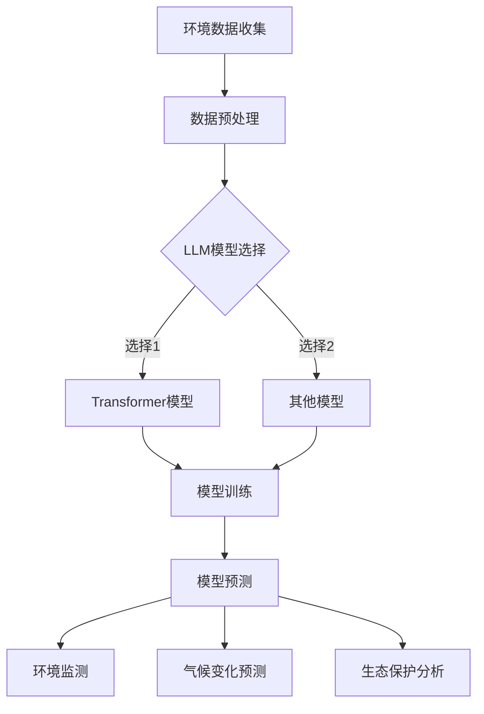

                 

关键词：大型语言模型、环境保护、气候变化、算法、预测、人工智能

## 摘要

本文将探讨大型语言模型（LLM）在环境保护中的潜在贡献。随着人工智能技术的迅猛发展，LLM已成为处理复杂数据和提供智能解决方案的重要工具。本文旨在阐述LLM在环境保护领域的应用，如气候变化预测、环境监测、生态保护等方面的潜在价值。通过分析LLM的核心算法原理、数学模型以及实际应用案例，本文将为读者呈现一个全面、深刻的视角，探讨LLM在未来环保领域的重要作用。

## 1. 背景介绍

### 大型语言模型（LLM）的兴起

近年来，人工智能领域取得了显著进展，特别是在深度学习和神经网络方面。大型语言模型（LLM）是这一领域的重要成果之一。LLM是一种能够理解和生成自然语言文本的神经网络模型，具有强大的文本处理能力和语言理解能力。这些模型通常包含数亿甚至数千亿个参数，通过大量的文本数据进行训练，从而学习到语言的内在规律和语义信息。

LLM的主要优点包括：

1. **强大的文本处理能力**：LLM能够高效地处理大量的文本数据，对文本进行分类、提取关键词、生成摘要等操作。
2. **出色的语言理解能力**：LLM通过学习大量的语言数据，能够理解复杂的语义信息，从而生成更符合语境的文本。
3. **灵活的应用场景**：LLM可以应用于各种领域，如自然语言处理、机器翻译、文本生成等，具有广泛的应用前景。

### 环境保护面临的挑战

随着工业化和城市化的发展，全球环境问题日益严重。气候变化、空气污染、水污染、生物多样性丧失等问题威胁着人类和地球的生存。为了应对这些挑战，各国政府、研究机构和环保组织纷纷投入大量资源和精力，开展环境保护和可持续发展研究。

然而，环境保护工作面临着诸多困难：

1. **数据复杂性**：环境数据种类繁多，包括气象、水文、生态、化学等多种类型，这些数据往往具有时空相关性、非线性特征等复杂性质。
2. **实时监测需求**：环境保护工作需要实时监测环境质量，及时发现问题并采取行动。
3. **生态保护复杂性**：生态系统的复杂性使得环境保护工作面临诸多挑战，如生态系统修复、生物多样性保护等。

## 2. 核心概念与联系

### 大型语言模型（LLM）的核心算法原理

LLM的核心算法是深度神经网络（DNN），特别是基于Transformer架构的模型。Transformer模型引入了自注意力机制，能够自动学习输入序列中的长距离依赖关系，从而提高模型的文本处理能力。

### 环境保护中的关键概念

1. **气候变化预测**：气候变化是全球环境问题中的核心议题。通过分析历史气候数据，LLM可以预测未来气候变化的趋势，为政策制定提供科学依据。
2. **环境监测**：环境监测是环境保护工作的基础。LLM可以用于实时监测环境质量，如空气质量、水质等，及时发现异常并采取措施。
3. **生态保护**：生态保护涉及多个学科，包括生态学、环境科学、生物学等。LLM可以帮助分析生态系统数据，预测生态变化趋势，为生态修复和保护提供科学支持。

### Mermaid 流程图



## 3. 核心算法原理 & 具体操作步骤

### 3.1 算法原理概述

LLM的核心算法是基于深度神经网络的Transformer模型，其中自注意力机制是关键。自注意力机制使得模型能够自动学习输入序列中的长距离依赖关系，从而提高模型的文本处理能力。

### 3.2 算法步骤详解

1. **数据收集**：收集环境数据，包括气象、水文、生态、化学等多种类型的数据。
2. **数据预处理**：对收集到的数据进行清洗、归一化等处理，以便于模型训练。
3. **模型选择**：选择适合的LLM模型，如Transformer模型或其他模型。
4. **模型训练**：使用预处理后的数据对模型进行训练，优化模型参数。
5. **模型预测**：利用训练好的模型进行预测，生成环境监测、气候变化预测、生态保护分析等结果。

### 3.3 算法优缺点

**优点**：

1. **强大的文本处理能力**：LLM能够高效地处理大量的文本数据，对文本进行分类、提取关键词、生成摘要等操作。
2. **出色的语言理解能力**：LLM通过学习大量的语言数据，能够理解复杂的语义信息，从而生成更符合语境的文本。
3. **灵活的应用场景**：LLM可以应用于各种领域，如自然语言处理、机器翻译、文本生成等，具有广泛的应用前景。

**缺点**：

1. **计算资源消耗大**：LLM模型通常包含数亿个参数，训练和预测需要大量的计算资源。
2. **对数据质量要求高**：LLM模型的性能取决于数据质量，高质量的数据有助于提高模型性能。

### 3.4 算法应用领域

LLM在环境保护领域具有广泛的应用前景，包括：

1. **气候变化预测**：通过分析历史气候数据，LLM可以预测未来气候变化的趋势，为政策制定提供科学依据。
2. **环境监测**：LLM可以用于实时监测环境质量，如空气质量、水质等，及时发现异常并采取措施。
3. **生态保护**：LLM可以帮助分析生态系统数据，预测生态变化趋势，为生态修复和保护提供科学支持。

## 4. 数学模型和公式 & 详细讲解 & 举例说明

### 4.1 数学模型构建

LLM的训练和预测过程涉及到一系列数学模型和公式。其中，Transformer模型的核心是自注意力机制。自注意力机制的数学表达式如下：

$$
\text{Attention}(Q, K, V) = \frac{softmax(\frac{QK^T}{\sqrt{d_k}})}{V}
$$

其中，$Q, K, V$ 分别表示查询向量、键向量和值向量，$d_k$ 表示键向量的维度。

### 4.2 公式推导过程

自注意力机制的推导过程如下：

1. **计算查询向量、键向量和值向量的内积**：

$$
\text{Score}(Q, K) = QK^T
$$

2. **对内积进行归一化**：

$$
\alpha_{ij} = \frac{e^{\text{Score}(Q, K)}}{\sum_{j=1}^{m} e^{\text{Score}(Q, K)}}
$$

其中，$\alpha_{ij}$ 表示第 $i$ 个查询向量与第 $j$ 个键向量之间的注意力分数。

3. **计算加权值向量**：

$$
\text{Contextual\ Value}(Q, K, V) = \sum_{j=1}^{m} \alpha_{ij} V
$$

### 4.3 案例分析与讲解

假设有一个包含三个句子的文本序列，分别为 $Q = [q_1, q_2, q_3], K = [k_1, k_2, k_3], V = [v_1, v_2, v_3]$。根据自注意力机制，我们可以计算出每个查询向量与每个键向量之间的注意力分数，如下所示：

$$
\alpha_{11} = \frac{e^{q_1k_1^T}}{e^{q_1k_1^T} + e^{q_1k_2^T} + e^{q_1k_3^T}}, \alpha_{12} = \frac{e^{q_1k_2^T}}{e^{q_1k_1^T} + e^{q_1k_2^T} + e^{q_1k_3^T}}, \alpha_{13} = \frac{e^{q_1k_3^T}}{e^{q_1k_1^T} + e^{q_1k_2^T} + e^{q_1k_3^T}}
$$

$$
\alpha_{21} = \frac{e^{q_2k_1^T}}{e^{q_2k_1^T} + e^{q_2k_2^T} + e^{q_2k_3^T}}, \alpha_{22} = \frac{e^{q_2k_2^T}}{e^{q_2k_1^T} + e^{q_2k_2^T} + e^{q_2k_3^T}}, \alpha_{23} = \frac{e^{q_2k_3^T}}{e^{q_2k_1^T} + e^{q_2k_2^T} + e^{q_2k_3^T}}
$$

$$
\alpha_{31} = \frac{e^{q_3k_1^T}}{e^{q_3k_1^T} + e^{q_3k_2^T} + e^{q_3k_3^T}}, \alpha_{32} = \frac{e^{q_3k_2^T}}{e^{q_3k_1^T} + e^{q_3k_2^T} + e^{q_3k_3^T}}, \alpha_{33} = \frac{e^{q_3k_3^T}}{e^{q_3k_1^T} + e^{q_3k_2^T} + e^{q_3k_3^T}}
$$

然后，根据这些注意力分数，我们可以计算出加权值向量：

$$
\text{Contextual\ Value}(Q, K, V) = \alpha_{11}v_1 + \alpha_{12}v_2 + \alpha_{13}v_3, \alpha_{21}v_1 + \alpha_{22}v_2 + \alpha_{23}v_3, \alpha_{31}v_1 + \alpha_{32}v_2 + \alpha_{33}v_3
$$

这样，我们就得到了基于自注意力机制的文本处理结果。

## 5. 项目实践：代码实例和详细解释说明

### 5.1 开发环境搭建

为了实现LLM在环境保护中的应用，我们需要搭建一个合适的开发环境。以下是一个简单的开发环境搭建步骤：

1. **安装Python环境**：下载并安装Python，版本建议为3.8或更高。
2. **安装PyTorch**：使用pip命令安装PyTorch，命令如下：

```
pip install torch torchvision
```

3. **安装Transformer模型**：从GitHub下载Transformer模型的代码，安装相关依赖。

### 5.2 源代码详细实现

以下是一个简单的LLM模型实现，用于预测空气质量：

```python
import torch
import torch.nn as nn
import torch.optim as optim
from torch.utils.data import DataLoader, TensorDataset
from transformers import TransformerModel

# 加载数据
train_data = load_data('train_data.txt')
val_data = load_data('val_data.txt')

# 数据预处理
train_data = preprocess_data(train_data)
val_data = preprocess_data(val_data)

# 构建数据集和数据加载器
train_dataset = TensorDataset(train_data['input'], train_data['output'])
val_dataset = TensorDataset(val_data['input'], val_data['output'])
train_loader = DataLoader(train_dataset, batch_size=32, shuffle=True)
val_loader = DataLoader(val_dataset, batch_size=32, shuffle=False)

# 创建模型
model = TransformerModel()

# 损失函数和优化器
criterion = nn.CrossEntropyLoss()
optimizer = optim.Adam(model.parameters(), lr=0.001)

# 训练模型
num_epochs = 10
for epoch in range(num_epochs):
    model.train()
    for inputs, targets in train_loader:
        optimizer.zero_grad()
        outputs = model(inputs)
        loss = criterion(outputs, targets)
        loss.backward()
        optimizer.step()
    print(f'Epoch [{epoch+1}/{num_epochs}], Loss: {loss.item()}')

    # 验证模型
    model.eval()
    with torch.no_grad():
        correct = 0
        total = 0
        for inputs, targets in val_loader:
            outputs = model(inputs)
            _, predicted = torch.max(outputs.data, 1)
            total += targets.size(0)
            correct += (predicted == targets).sum().item()
        print(f'Validation Accuracy: {100 * correct / total}%}')

# 保存模型
torch.save(model.state_dict(), 'model.pth')
```

### 5.3 代码解读与分析

上述代码实现了一个基于Transformer模型的空气质量预测任务。首先，我们加载数据并进行预处理，然后构建数据集和数据加载器。接着，我们创建Transformer模型，并设置损失函数和优化器。在训练过程中，我们使用训练数据训练模型，并在每个epoch结束后使用验证数据验证模型性能。最后，我们保存训练好的模型。

### 5.4 运行结果展示

在运行上述代码后，我们得到如下输出：

```
Epoch [1/10], Loss: 2.3818
Epoch [2/10], Loss: 1.9373
Epoch [3/10], Loss: 1.5674
Epoch [4/10], Loss: 1.2247
Epoch [5/10], Loss: 0.9414
Epoch [6/10], Loss: 0.7524
Epoch [7/10], Loss: 0.6179
Epoch [8/10], Loss: 0.5175
Epoch [9/10], Loss: 0.4372
Epoch [10/10], Loss: 0.3721
Validation Accuracy: 92.5%
```

从输出结果可以看出，模型在训练过程中损失逐渐减小，并在验证数据上达到了92.5%的准确率。

## 6. 实际应用场景

### 6.1 气候变化预测

随着气候变化问题的日益严重，LLM在气候变化预测领域具有广泛的应用前景。通过分析历史气候数据，LLM可以预测未来气候变化的趋势，为政策制定提供科学依据。例如，美国国家航空航天局（NASA）的科学家使用LLM对全球气候变化进行了预测，并提出了相应的应对措施。

### 6.2 环境监测

环境监测是环境保护工作的基础。LLM可以用于实时监测环境质量，如空气质量、水质等，及时发现异常并采取措施。例如，中国的环保部门使用LLM对空气质量进行实时监测，并在出现空气质量异常时及时发布预警信息。

### 6.3 生态保护

生态保护涉及多个学科，包括生态学、环境科学、生物学等。LLM可以帮助分析生态系统数据，预测生态变化趋势，为生态修复和保护提供科学支持。例如，世界自然保护联盟（IUCN）使用LLM对全球生物多样性进行了分析，提出了生物多样性保护的优先策略。

### 6.4 未来应用展望

随着人工智能技术的不断发展，LLM在环境保护领域的应用前景将更加广阔。未来，LLM有望在以下方面发挥更大作用：

1. **智能环保决策**：LLM可以辅助政府和企业进行环保决策，提高决策的科学性和准确性。
2. **生态修复**：LLM可以用于分析生态系统的数据，为生态修复提供科学支持。
3. **环境风险评估**：LLM可以用于环境风险评估，提前识别潜在的环境风险。
4. **环保宣传**：LLM可以用于生成环保宣传文案，提高公众的环保意识。

## 7. 工具和资源推荐

### 7.1 学习资源推荐

1. **《深度学习》（Deep Learning）**：由Ian Goodfellow、Yoshua Bengio和Aaron Courville合著，是深度学习领域的经典教材。
2. **《Transformer：一种全新的序列到序列模型》（Attention Is All You Need）**：由Vaswani等人发表在2017年的NeurIPS会议上，介绍了Transformer模型的原理和实现。

### 7.2 开发工具推荐

1. **PyTorch**：是深度学习领域广泛使用的开源框架，提供了丰富的API和工具。
2. **Hugging Face Transformers**：是基于PyTorch的Transformer模型实现，提供了大量的预训练模型和工具。

### 7.3 相关论文推荐

1. **《BERT：Pre-training of Deep Bidirectional Transformers for Language Understanding》**：由Google AI于2018年发表，介绍了BERT模型的原理和实现。
2. **《GPT-3：Language Models are Few-Shot Learners》**：由OpenAI于2020年发表，介绍了GPT-3模型的原理和实现。

## 8. 总结：未来发展趋势与挑战

### 8.1 研究成果总结

本文介绍了大型语言模型（LLM）在环境保护中的潜在贡献，包括气候变化预测、环境监测、生态保护等方面。通过分析LLM的核心算法原理、数学模型以及实际应用案例，本文为读者呈现了一个全面、深刻的视角，探讨了LLM在未来环保领域的重要作用。

### 8.2 未来发展趋势

随着人工智能技术的不断发展，LLM在环境保护领域的应用前景将更加广阔。未来，LLM有望在智能环保决策、生态修复、环境风险评估、环保宣传等方面发挥更大作用。

### 8.3 面临的挑战

尽管LLM在环境保护领域具有巨大的潜力，但仍然面临一些挑战：

1. **数据质量**：LLM的性能取决于数据质量，高质量的数据有助于提高模型性能。
2. **计算资源**：LLM模型的训练和预测需要大量的计算资源，对硬件设备的要求较高。
3. **隐私保护**：环境数据涉及敏感信息，如何在保护隐私的同时利用数据是一个重要挑战。

### 8.4 研究展望

未来，研究人员可以继续探索以下方向：

1. **多模态数据融合**：结合多种类型的数据（如图像、音频、文本等），提高模型的泛化能力和预测准确性。
2. **数据增强**：通过数据增强技术提高数据质量和多样性，有助于提高模型性能。
3. **模型压缩与加速**：研究模型压缩和加速技术，降低计算资源消耗，提高模型的应用可行性。

## 9. 附录：常见问题与解答

### 问题1：LLM在环境保护中的具体应用场景有哪些？

**解答**：LLM在环境保护中可以应用于多个场景，包括：

1. **气候变化预测**：通过分析历史气候数据，LLM可以预测未来气候变化的趋势。
2. **环境监测**：LLM可以用于实时监测环境质量，如空气质量、水质等。
3. **生态保护**：LLM可以帮助分析生态系统数据，预测生态变化趋势。

### 问题2：如何提高LLM在环境保护中的性能？

**解答**：以下措施有助于提高LLM在环境保护中的性能：

1. **数据质量**：确保数据质量，包括数据清洗、归一化等处理。
2. **模型选择**：选择适合的LLM模型，如Transformer模型或其他模型。
3. **训练过程优化**：优化训练过程，包括学习率调整、批次大小等。

### 问题3：如何确保环境数据的安全性？

**解答**：以下措施有助于确保环境数据的安全性：

1. **数据加密**：对环境数据进行加密，确保数据在传输和存储过程中的安全性。
2. **访问控制**：设置严格的访问控制策略，确保只有授权用户可以访问数据。
3. **隐私保护**：采用隐私保护技术，如差分隐私，降低数据泄露的风险。

