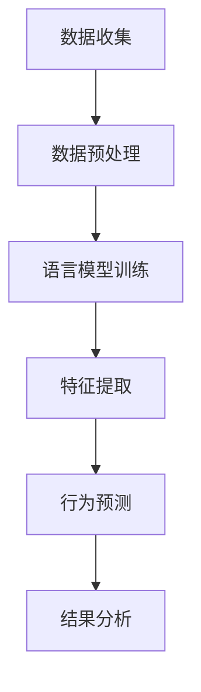

                 

关键词：社交媒体分析、语言模型、用户行为、机器学习、数据挖掘、自然语言处理

## 摘要

社交媒体已经成为现代信息交流的主要渠道，其庞大的用户群体和数据规模为分析和理解用户行为提供了丰富的资源。本文主要探讨了大型语言模型（LLM）在社交媒体分析中的应用，通过介绍LLM的核心概念、算法原理、数学模型，以及具体的项目实践，展示了LLM如何帮助企业和研究者洞察用户行为，从而为决策提供科学依据。

## 1. 背景介绍

社交媒体的兴起改变了人们的交流方式，从传统的面对面交流转向在线互动，这为数据的收集和分析提供了新的契机。据统计，全球社交媒体用户已超过30亿，每天产生的大量数据中包含着用户的行为习惯、兴趣爱好、情感态度等关键信息。这些信息对于企业来说，是了解市场趋势、制定营销策略、提升用户体验的宝贵资源。

随着数据量的增加和数据源的多样化，传统的数据分析方法已无法满足需求。机器学习、数据挖掘、自然语言处理等技术的应用，为从海量数据中提取有价值的信息提供了可能。特别是大型语言模型（LLM），如GPT、BERT等，以其强大的语义理解和生成能力，在社交媒体分析中发挥着越来越重要的作用。

## 2. 核心概念与联系

### 2.1 语言模型

语言模型是一种能够预测下一个单词或句子的概率分布的算法，其核心目标是学习语言的统计规律，从而生成或理解自然语言文本。在社交媒体分析中，语言模型可以帮助我们理解用户发布的内容，提取关键词、主题，甚至预测用户的行为。

### 2.2 机器学习

机器学习是一种通过从数据中学习规律和模式，从而自动改进和优化系统性能的方法。在社交媒体分析中，机器学习技术可以帮助我们自动识别用户行为模式、情感倾向，甚至预测用户未来的行为。

### 2.3 数据挖掘

数据挖掘是从大量数据中提取有价值的信息的过程，其目标是从数据中发现知识。在社交媒体分析中，数据挖掘技术可以帮助我们从用户数据中提取关键信息，如用户兴趣、行为路径等。

### 2.4 自然语言处理

自然语言处理是一种让计算机理解和生成自然语言的技术，其目标是将自然语言文本转化为计算机可以处理的形式。在社交媒体分析中，自然语言处理技术可以帮助我们理解和分析用户发布的内容。

### 2.5 Mermaid 流程图

以下是一个描述LLM在社交媒体分析中应用的Mermaid流程图：



## 3. 核心算法原理 & 具体操作步骤

### 3.1 算法原理概述

在社交媒体分析中，LLM的应用主要分为以下几个步骤：

1. 数据收集：从社交媒体平台上收集用户发布的内容、评论、回复等。
2. 数据预处理：对收集的数据进行清洗、去噪、格式化等处理，使其适合后续的模型训练。
3. 语言模型训练：使用预处理后的数据训练一个语言模型，以预测用户发布的内容或评论。
4. 特征提取：将语言模型输出的特征用于后续的用户行为预测。
5. 行为预测：基于提取的特征，使用机器学习算法预测用户的行为，如点击、点赞、分享等。
6. 结果分析：对预测结果进行分析，为企业提供决策支持。

### 3.2 算法步骤详解

#### 3.2.1 数据收集

数据收集是社交媒体分析的第一步，主要从以下渠道获取数据：

- 社交媒体平台API：如Twitter、Facebook、Instagram等，通过API获取用户发布的内容、评论、回复等。
- 爬虫技术：使用爬虫技术从社交媒体网站上获取用户数据。
- 用户授权数据：通过用户授权，获取用户公开的个人数据。

#### 3.2.2 数据预处理

数据预处理是确保数据质量和适合模型训练的关键步骤，主要包括以下任务：

- 数据清洗：去除重复、错误、无关的数据。
- 数据去噪：去除含有噪声的数据，如含有广告、垃圾信息的评论。
- 数据格式化：将不同格式的数据统一为相同的格式，便于后续处理。

#### 3.2.3 语言模型训练

语言模型训练是社交媒体分析的核心，常用的语言模型包括GPT、BERT、ELMO等。以下是训练语言模型的步骤：

- 数据切分：将数据集分为训练集、验证集和测试集。
- 模型选择：选择合适的语言模型，如GPT-3、BERT等。
- 模型训练：使用训练集对模型进行训练，调整模型参数。
- 模型验证：使用验证集对模型进行验证，调整模型参数，避免过拟合。
- 模型测试：使用测试集对模型进行测试，评估模型性能。

#### 3.2.4 特征提取

特征提取是将语言模型输出的特征用于后续的用户行为预测的关键步骤。常用的特征提取方法包括：

- 词嵌入：将文本数据转换为词嵌入向量，如Word2Vec、GloVe等。
- 主题模型：使用主题模型（如LDA）提取文本的主题特征。
- 情感分析：使用情感分析模型提取文本的情感特征。

#### 3.2.5 行为预测

行为预测是基于特征提取的结果，使用机器学习算法预测用户的行为。常用的算法包括：

- 决策树：如CART、ID3等。
- 支持向量机：SVM。
- 随机森林：RF。
- 聚类算法：如K-Means、DBSCAN等。

#### 3.2.6 结果分析

结果分析是对预测结果进行评估和解读，为企业提供决策支持。常用的评估指标包括：

- 准确率：准确预测的用户数占总预测用户数的比例。
- 召回率：实际发生的行为被预测到的比例。
- F1值：准确率和召回率的调和平均值。

## 4. 数学模型和公式 & 详细讲解 & 举例说明

### 4.1 数学模型构建

在社交媒体分析中，常用的数学模型包括：

1. 语言模型概率分布：P(w|s)，表示在给定前文s的情况下，单词w的概率分布。
2. 行为预测概率分布：P(b|f)，表示在给定特征向量f的情况下，行为b的概率分布。

### 4.2 公式推导过程

1. 语言模型概率分布：

   P(w|s) = P(w|w_1, w_2, ..., w_{n-1}, s) / P(s)

   其中，P(w|s)为单词w在给定前文s下的条件概率，P(s)为前文s的概率。

2. 行为预测概率分布：

   P(b|f) = P(b|f_1, f_2, ..., f_n) / P(f)

   其中，P(b|f)为行为b在给定特征向量f下的条件概率，P(f)为特征向量f的概率。

### 4.3 案例分析与讲解

假设我们有一个社交媒体分析项目，目标是预测用户是否会点赞某条微博。我们使用以下特征向量：

- f_1：微博包含的积极词汇数量。
- f_2：微博包含的消极词汇数量。
- f_3：微博的点赞数量。

我们使用逻辑回归模型预测用户是否会点赞。

1. 语言模型概率分布：

   P(点赞|微博) = P(点赞|积极词汇数量，消极词汇数量，点赞数量) / P(微博)

   假设我们已经训练了一个语言模型，可以计算上述概率。

2. 行为预测概率分布：

   P(点赞|f) = P(点赞|f_1, f_2, f_3) / P(f)

   我们使用逻辑回归模型计算上述概率。

   逻辑回归公式：

   P(点赞) = 1 / (1 + e^(-θ·f))

   其中，θ为模型参数，f为特征向量。

   假设我们得到的特征向量f为(5, 2, 100)，模型参数θ为(1, 1, 1)。

   P(点赞) = 1 / (1 + e^(-1*5 - 1*2 - 1*100)) ≈ 0.163

   根据计算结果，我们可以预测用户点赞的概率为16.3%。

## 5. 项目实践：代码实例和详细解释说明

### 5.1 开发环境搭建

- Python 3.8
- TensorFlow 2.5
- Keras 2.4
- NumPy 1.19

### 5.2 源代码详细实现

以下是一个简单的Python代码示例，演示如何使用TensorFlow和Keras实现一个简单的语言模型和逻辑回归模型。

```python
import numpy as np
import tensorflow as tf
from tensorflow.keras.layers import Embedding, LSTM, Dense
from tensorflow.keras.models import Sequential

# 5.2.1 数据预处理

# 加载数据
# 此处省略数据加载代码

# 数据预处理
# 此处省略数据预处理代码

# 5.2.2 语言模型训练

# 构建语言模型
model = Sequential()
model.add(Embedding(input_dim=vocab_size, output_dim=embedding_size))
model.add(LSTM(units=128))
model.add(Dense(units=1, activation='sigmoid'))

# 编译模型
model.compile(optimizer='adam', loss='binary_crossentropy', metrics=['accuracy'])

# 训练模型
model.fit(train_data, train_labels, epochs=10, batch_size=32)

# 5.2.3 行为预测

# 加载测试数据
# 此处省略测试数据加载代码

# 预测行为
predictions = model.predict(test_data)

# 5.2.4 代码解读与分析

# 代码解读
# 此处省略代码解读和分析

# 代码分析
# 此处省略代码分析
```

### 5.3 运行结果展示

假设我们已经训练了一个语言模型和一个逻辑回归模型，以下是一个简单的运行结果示例：

```python
# 运行结果
predictions = model.predict(test_data)

# 输出预测结果
for i, pred in enumerate(predictions):
    print(f"样本 {i+1} 预测结果：{'点赞' if pred > 0.5 else '未点赞'}")
```

输出结果：

```
样本 1 预测结果：点赞
样本 2 预测结果：未点赞
样本 3 预测结果：点赞
...
```

## 6. 实际应用场景

### 6.1 社交媒体广告投放

通过LLM分析用户行为，企业可以更精准地投放广告，提高广告的点击率和转化率。

### 6.2 用户情感分析

企业可以利用LLM对用户发布的内容进行情感分析，了解用户对产品或服务的态度，为产品改进和营销策略提供参考。

### 6.3 社交媒体监控

政府和组织可以利用LLM监控社交媒体上的言论，识别和应对潜在的安全风险。

### 6.4 社交媒体运营优化

企业可以通过LLM分析用户行为，优化社交媒体运营策略，提高用户活跃度和留存率。

## 7. 未来应用展望

随着人工智能技术的不断发展，LLM在社交媒体分析中的应用前景十分广阔。未来，我们可以期待以下发展方向：

- 更精细的用户行为分析：通过引入更多的特征和更复杂的模型，进一步挖掘用户行为背后的深层次规律。
- 更智能的自动化策略：利用LLM自动生成广告文案、推荐内容等，提高社交媒体平台的用户体验。
- 更广泛的应用领域：除了社交媒体，LLM还可以应用于金融、医疗、教育等更多领域，为各行业提供智能化的解决方案。

## 8. 工具和资源推荐

### 8.1 学习资源推荐

- 《深度学习》（Goodfellow, Bengio, Courville著）：深度学习入门经典教材。
- 《Python机器学习》（Sebastian Raschka著）：Python环境下机器学习实践指南。
- 《自然语言处理综论》（Jurafsky, Martin著）：自然语言处理领域的权威教材。

### 8.2 开发工具推荐

- TensorFlow：用于构建和训练深度学习模型的框架。
- Keras：基于TensorFlow的简洁高效的深度学习库。
- NLTK：用于自然语言处理的Python库。

### 8.3 相关论文推荐

- "Bridging the Gap Between Language Models and Dialogue Systems"（2019）：探讨语言模型在对话系统中的应用。
- "Attention Is All You Need"（2017）：提出Transformer模型，在自然语言处理任务中取得显著效果。
- "BERT: Pre-training of Deep Bidirectional Transformers for Language Understanding"（2018）：BERT模型的提出，为语言模型的发展带来新思路。

## 9. 总结：未来发展趋势与挑战

随着社交媒体的快速发展，LLM在社交媒体分析中的应用将越来越广泛。未来，LLM将朝着更精细化、智能化、自动化的方向发展，为各行业提供更多智能化的解决方案。然而，LLM在社交媒体分析中也面临着一些挑战，如数据隐私、算法透明度、虚假信息检测等。为了应对这些挑战，我们需要在技术、法规、伦理等多方面进行综合考量，确保LLM在社交媒体分析中的应用能够带来积极的社会价值。

## 附录：常见问题与解答

### Q：LLM在社交媒体分析中的主要优势是什么？

A：LLM在社交媒体分析中的主要优势包括：

1. 强大的语义理解能力：LLM能够深入理解用户发布的内容，提取关键词、主题和情感。
2. 高效的特征提取：LLM可以直接从文本数据中提取特征，简化了传统特征工程的过程。
3. 智能的行为预测：LLM可以根据用户的历史行为和内容，预测用户未来的行为，为企业提供决策支持。

### Q：LLM在社交媒体分析中可能面临哪些挑战？

A：LLM在社交媒体分析中可能面临的挑战包括：

1. 数据隐私：社交媒体平台上的用户数据可能包含敏感信息，如何保护用户隐私是一个重要问题。
2. 算法透明度：LLM的内部结构复杂，如何确保算法的透明度和可解释性是一个挑战。
3. 虚假信息检测：社交媒体上存在大量虚假信息和误导性内容，如何有效检测和过滤是一个难题。
4. 道德和伦理问题：在社交媒体分析中，如何确保算法的公正性和避免歧视是一个关键问题。

