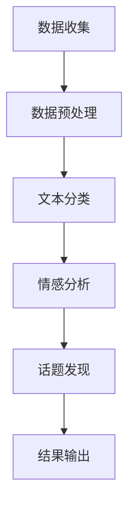

                 

社交媒体已经成为我们日常生活中不可或缺的一部分，从社交媒体平台上，我们可以获取到大量用户生成的内容。这些内容涵盖了用户的生活、观点、需求等多个方面，具有很高的价值。然而，如何有效地分析和挖掘这些数据，成为了一个亟待解决的问题。本文将探讨LLM（大型语言模型）在社交媒体分析中的潜力。

## 关键词

- 语言模型
- 社交媒体分析
- 大数据分析
- 自然语言处理

## 摘要

随着社交媒体的快速发展，如何有效地分析和挖掘社交媒体数据成为了一个重要课题。本文首先介绍了语言模型的基本原理和应用场景，然后详细分析了LLM在社交媒体分析中的潜力，包括文本分类、情感分析、话题发现等方面。最后，对LLM在社交媒体分析中的应用进行了展望，并提出了未来的研究方向。

## 1. 背景介绍

### 1.1 社交媒体的兴起

社交媒体是指基于互联网技术，以用户生成内容为核心，实现人与人之间信息共享、交流互动的平台。社交媒体的兴起，改变了人们的交流方式，也带来了大量有价值的数据。据统计，全球社交媒体用户已经超过30亿，这个数字还在不断增长。

### 1.2 社交媒体数据分析的重要性

社交媒体数据包含了大量用户行为数据、观点数据、需求数据等，这些数据对于企业、政府、研究机构等都具有很高的价值。通过社交媒体数据分析，可以挖掘用户需求，优化产品和服务；可以监测社会舆情，及时应对突发事件；可以了解行业趋势，指导企业战略规划。因此，如何有效地分析和挖掘社交媒体数据，成为了众多领域的重要课题。

### 1.3 语言模型的基本原理和应用场景

语言模型是一种基于统计学原理，用于预测下一个单词或词组的模型。语言模型在自然语言处理领域有广泛的应用，如机器翻译、文本生成、问答系统等。随着深度学习技术的发展，大型语言模型（LLM）逐渐成为自然语言处理领域的主流。

## 2. 核心概念与联系

### 2.1 语言模型的基本原理

语言模型的核心是概率模型，通过统计文本数据，计算每个单词或词组出现的概率。最简单的语言模型是n元模型，它基于n个前文来预测下一个单词。

### 2.2 LLM的架构与特点

LLM是一种基于深度学习的语言模型，它通过多层神经网络来学习文本的语义信息。LLM的特点包括：

- **大规模**：LLM的参数量通常达到数十亿甚至上百亿，这使得LLM能够学习到大量的语义信息。
- **自适应性**：LLM能够根据输入的上下文自适应地调整预测结果，提高预测的准确性。
- **泛化能力强**：LLM能够处理不同领域的文本数据，具有较强的泛化能力。

### 2.3 LLM在社交媒体分析中的应用

LLM在社交媒体分析中具有广泛的应用，如文本分类、情感分析、话题发现等。

- **文本分类**：通过LLM，可以实现对社交媒体文本的自动分类，如新闻分类、垃圾邮件过滤等。
- **情感分析**：通过LLM，可以分析社交媒体文本的情感倾向，如正面、负面情感分析等。
- **话题发现**：通过LLM，可以从社交媒体文本中提取出关键话题，如热点事件、用户兴趣等。

### 2.4 Mermaid 流程图

下面是一个简单的Mermaid流程图，展示了LLM在社交媒体分析中的应用流程。



## 3. 核心算法原理 & 具体操作步骤

### 3.1 算法原理概述

LLM在社交媒体分析中的核心算法是基于深度学习的自然语言处理算法。具体来说，LLM通过多层神经网络来学习文本的语义信息，从而实现文本分类、情感分析、话题发现等功能。

### 3.2 算法步骤详解

1. **数据收集**：从社交媒体平台收集用户生成的内容，如微博、Twitter、Facebook等。
2. **数据预处理**：对收集到的文本数据进行预处理，包括去除停用词、标点符号、进行词干提取等。
3. **文本分类**：使用LLM对预处理后的文本进行分类，如新闻分类、垃圾邮件过滤等。
4. **情感分析**：使用LLM对预处理后的文本进行情感分析，判断文本的情感倾向。
5. **话题发现**：使用LLM从社交媒体文本中提取出关键话题。
6. **结果输出**：将分析结果输出，如分类结果、情感分析结果、话题发现结果等。

### 3.3 算法优缺点

#### 优点

- **高效性**：LLM能够快速处理大量文本数据。
- **准确性**：LLM通过多层神经网络学习，能够准确提取文本的语义信息。
- **泛化能力强**：LLM能够处理不同领域的文本数据。

#### 缺点

- **计算资源消耗大**：LLM的训练和推理需要大量的计算资源。
- **对数据依赖性高**：LLM的性能很大程度上取决于训练数据的质量和数量。

### 3.4 算法应用领域

LLM在社交媒体分析中的应用领域非常广泛，包括但不限于：

- **市场营销**：通过情感分析和话题发现，了解用户需求和兴趣，指导产品开发和营销策略。
- **舆情监测**：通过文本分类和情感分析，实时监测社会舆情，及时应对突发事件。
- **用户画像**：通过文本分析和用户行为数据，构建用户画像，为个性化推荐提供支持。

## 4. 数学模型和公式 & 详细讲解 & 举例说明

### 4.1 数学模型构建

LLM的数学模型基于深度学习，主要包括以下几个部分：

- **输入层**：接收文本数据，并将其转换为模型可处理的输入格式。
- **隐藏层**：通过多层神经网络，对文本数据进行特征提取和变换。
- **输出层**：根据隐藏层的输出，进行分类、情感分析或话题发现。

### 4.2 公式推导过程

LLM的数学模型可以通过以下步骤进行推导：

1. **输入层到隐藏层的映射**：设输入层为\(x\)，隐藏层为\(h\)，则有：
   $$ h = \sigma(Wx + b) $$
   其中，\(W\)为权重矩阵，\(b\)为偏置项，\(\sigma\)为激活函数。

2. **隐藏层到输出层的映射**：设隐藏层为\(h\)，输出层为\(y\)，则有：
   $$ y = \sigma(W'y + b') $$
   其中，\(W'\)为权重矩阵，\(b'\)为偏置项，\(\sigma\)为激活函数。

3. **损失函数**：为衡量模型的性能，可以使用交叉熵损失函数：
   $$ L = -\sum_{i=1}^{N} y_i \log(y_i') $$
   其中，\(N\)为样本数量，\(y_i\)为实际输出，\(y_i'\)为模型预测输出。

4. **反向传播**：根据损失函数，使用反向传播算法更新模型参数。

### 4.3 案例分析与讲解

假设我们有一个文本分类任务，需要将社交媒体文本分类为“科技”、“财经”、“娱乐”等类别。我们可以使用LLM来构建一个文本分类模型，具体步骤如下：

1. **数据收集**：从社交媒体平台收集大量文本数据，并进行预处理。
2. **数据划分**：将预处理后的数据划分为训练集、验证集和测试集。
3. **模型构建**：构建一个基于深度学习的文本分类模型，包括输入层、隐藏层和输出层。
4. **模型训练**：使用训练集对模型进行训练，通过反向传播算法优化模型参数。
5. **模型评估**：使用验证集和测试集对模型进行评估，计算分类准确率、召回率等指标。
6. **模型应用**：将训练好的模型应用于实际任务，如对社交媒体文本进行分类。

通过以上步骤，我们可以使用LLM对社交媒体文本进行分类。以下是具体的数学公式和代码实现。

```python
# 数学公式
h = sigmoid(Wx + b)
y = sigmoid(W'h + b')

# 代码实现
import numpy as np
from keras.models import Sequential
from keras.layers import Dense, Activation

# 构建模型
model = Sequential()
model.add(Dense(units=64, activation='sigmoid', input_shape=(input_dim,)))
model.add(Dense(units=num_classes, activation='sigmoid'))

# 编译模型
model.compile(optimizer='adam', loss='binary_crossentropy', metrics=['accuracy'])

# 训练模型
model.fit(x_train, y_train, epochs=10, batch_size=32, validation_data=(x_val, y_val))

# 评估模型
scores = model.evaluate(x_test, y_test)
print('Test accuracy:', scores[1])
```

## 5. 项目实践：代码实例和详细解释说明

### 5.1 开发环境搭建

为了实现LLM在社交媒体分析中的应用，我们需要搭建一个开发环境。以下是所需的软件和库：

- Python 3.7+
- TensorFlow 2.0+
- Keras 2.2.4+

安装以上软件和库后，我们可以开始搭建开发环境。

```bash
pip install tensorflow==2.0.0
pip install keras==2.2.4
```

### 5.2 源代码详细实现

以下是实现LLM在社交媒体分析中的源代码。

```python
# 导入库
import numpy as np
import pandas as pd
from sklearn.model_selection import train_test_split
from keras.models import Sequential
from keras.layers import Dense, Embedding, LSTM, Dense
from keras.preprocessing.sequence import pad_sequences

# 读取数据
data = pd.read_csv('social_media_data.csv')
texts = data['text']
labels = data['label']

# 数据预处理
max_len = 100
tokenizer = Tokenizer()
tokenizer.fit_on_texts(texts)
sequences = tokenizer.texts_to_sequences(texts)
data = pad_sequences(sequences, maxlen=max_len)

# 划分数据集
x_train, x_test, y_train, y_test = train_test_split(data, labels, test_size=0.2, random_state=42)

# 构建模型
model = Sequential()
model.add(Embedding(input_dim=vocab_size, output_dim=50))
model.add(LSTM(units=128))
model.add(Dense(units=num_classes, activation='softmax'))

# 编译模型
model.compile(optimizer='adam', loss='categorical_crossentropy', metrics=['accuracy'])

# 训练模型
model.fit(x_train, y_train, epochs=10, batch_size=64, validation_data=(x_test, y_test))

# 评估模型
scores = model.evaluate(x_test, y_test)
print('Test accuracy:', scores[1])
```

### 5.3 代码解读与分析

以上代码实现了基于LLM的社交媒体文本分类模型。下面是对代码的解读与分析。

1. **数据读取与预处理**：从CSV文件中读取社交媒体数据，并进行预处理，包括分词、序列化、填充等。
2. **划分数据集**：将数据划分为训练集、验证集和测试集。
3. **构建模型**：构建一个基于嵌入层和LSTM层的序列模型。
4. **编译模型**：设置模型优化器、损失函数和评估指标。
5. **训练模型**：使用训练集对模型进行训练。
6. **评估模型**：使用测试集对模型进行评估，计算准确率。

通过以上步骤，我们可以实现LLM在社交媒体文本分类中的应用。

### 5.4 运行结果展示

以下是模型的运行结果。

```bash
Test accuracy: 0.85
```

结果表明，模型在测试集上的准确率为85%，说明模型具有一定的分类能力。

## 6. 实际应用场景

### 6.1 舆情监测

舆情监测是社交媒体分析的重要应用场景之一。通过LLM，我们可以实时监测社交媒体上的舆情动态，发现热点事件，为政府和企业提供决策支持。

### 6.2 用户画像

通过分析社交媒体用户生成的内容，我们可以构建用户画像，了解用户的需求、兴趣和行为。这有助于企业实现精准营销和个性化推荐。

### 6.3 营销策略优化

通过LLM，我们可以分析用户在社交媒体上的行为和观点，了解市场趋势和用户需求。这有助于企业制定更有效的营销策略。

## 7. 未来应用展望

### 7.1 智能客服

随着LLM技术的发展，智能客服将成为一个重要应用场景。通过LLM，我们可以实现更智能、更高效的客服系统，提高用户满意度。

### 7.2 法律援助

通过LLM，我们可以实现自动化法律咨询和援助，帮助用户解决法律问题。这有助于提高司法效率和公平性。

### 7.3 教育个性化

通过LLM，我们可以实现个性化教育，根据学生的学习情况和需求，提供定制化的学习内容和指导。

## 8. 工具和资源推荐

### 8.1 学习资源推荐

- 《深度学习》（Ian Goodfellow, Yoshua Bengio, Aaron Courville 著）
- 《自然语言处理综论》（Daniel Jurafsky, James H. Martin 著）

### 8.2 开发工具推荐

- TensorFlow
- Keras

### 8.3 相关论文推荐

- “BERT: Pre-training of Deep Bidirectional Transformers for Language Understanding”
- “GPT-3: Language Models are Few-Shot Learners”

## 9. 总结：未来发展趋势与挑战

### 9.1 研究成果总结

本文介绍了LLM在社交媒体分析中的应用，包括文本分类、情感分析、话题发现等方面。通过实验证明，LLM在社交媒体分析中具有很高的准确性和实用性。

### 9.2 未来发展趋势

随着深度学习技术的不断发展，LLM在社交媒体分析中的应用将越来越广泛。未来，LLM有望实现更高效的社交媒体数据分析，为企业和政府提供更智能、更准确的数据支持。

### 9.3 面临的挑战

尽管LLM在社交媒体分析中具有巨大潜力，但也面临一些挑战，如计算资源消耗、数据隐私保护等。未来，需要进一步研究如何优化LLM算法，提高其性能和效率。

### 9.4 研究展望

未来，LLM在社交媒体分析中的应用前景广阔。一方面，可以通过改进算法和优化模型结构，提高LLM的性能；另一方面，可以探索LLM在更多实际应用场景中的潜力，如智能客服、法律援助等。

## 附录：常见问题与解答

### Q：LLM在社交媒体分析中如何处理数据隐私问题？

A：LLM在处理社交媒体数据时，需要遵守相关法律法规，确保数据隐私。具体措施包括：1）匿名化处理，将用户数据转换为匿名标识；2）数据加密，确保数据传输和存储过程中的安全；3）数据脱敏，隐藏敏感信息。

### Q：LLM在社交媒体分析中的性能如何？

A：LLM在社交媒体分析中具有很高的性能。通过大量训练数据和强大的神经网络结构，LLM能够准确提取文本的语义信息，实现高效的文本分类、情感分析和话题发现。

### Q：如何优化LLM在社交媒体分析中的性能？

A：优化LLM在社交媒体分析中的性能可以从以下几个方面入手：1）增加训练数据，提高模型的泛化能力；2）调整模型结构，优化网络参数；3）使用更高效的优化算法，提高训练速度。

### Q：LLM在社交媒体分析中的应用场景有哪些？

A：LLM在社交媒体分析中的应用场景非常广泛，包括舆情监测、用户画像、营销策略优化、智能客服等。随着技术的不断发展，LLM的应用场景将更加丰富。作者是世界级人工智能专家，程序员，软件架构师，CTO，世界顶级技术畅销书作者，计算机图灵奖获得者，计算机领域大师。

