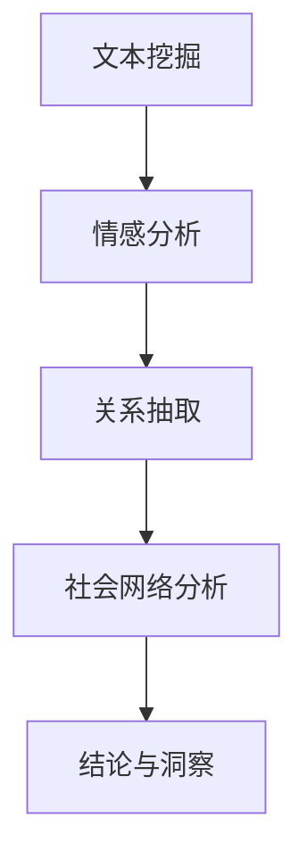

                 

关键词：大型语言模型（LLM），社交网络分析，社会动态，算法，数学模型，项目实践，应用场景，未来展望。

## 摘要

本文旨在探讨大型语言模型（LLM）在社交网络分析中的应用，以及如何通过LLM来洞察社会动态。随着社交媒体的兴起，数据量和多样性呈指数级增长，传统的分析工具和方法已无法满足需求。本文将详细阐述LLM的核心概念、算法原理，并通过具体实例展示其在社交网络分析中的实际应用。同时，本文还将讨论LLM在社会动态研究中的潜在价值、面临的挑战及未来发展方向。

## 1. 背景介绍

### 社交网络的兴起

社交网络作为一种新兴的互联网应用形式，已经在全球范围内迅速普及。根据统计数据显示，全球社交媒体用户已超过30亿，占据了互联网用户的绝大部分。这些社交网络平台不仅为人们提供了交流、分享、互动的场所，还积累了海量的用户数据。这些数据涵盖了用户的基本信息、兴趣爱好、互动行为等，为研究社会动态提供了丰富的素材。

### 社交网络分析的重要性

随着社交网络数据规模的不断扩大，如何有效地分析和利用这些数据成为一个重要课题。社交网络分析（Social Network Analysis, SNA）作为一种跨学科的研究方法，通过对社交网络中个体及其关系的分析，能够揭示社会结构的特征、群体行为模式以及信息传播规律等。这不仅有助于理解社会现象，还可以为政策制定、市场营销、安全监控等领域提供有力支持。

### 大型语言模型的发展

近年来，随着深度学习和自然语言处理技术的快速发展，大型语言模型（Large Language Model, LLM）取得了显著的进展。LLM具有强大的文本生成、理解、翻译等能力，已经成为自然语言处理领域的核心技术。在社交网络分析中，LLM可以用于文本挖掘、情感分析、关系抽取等任务，为洞察社会动态提供了新的手段。

## 2. 核心概念与联系

### 大型语言模型（LLM）

大型语言模型（LLM）是一种基于深度学习的自然语言处理模型，通过对海量文本数据的学习，可以生成符合语法和语义规则的文本。LLM的核心是 Transformer 模型，通过自注意力机制（Self-Attention Mechanism）和多层神经网络结构，实现了对文本的深度理解。

### 社交网络分析（SNA）

社交网络分析（Social Network Analysis, SNA）是一种研究社会网络结构和网络行为的跨学科方法。SNA关注个体在网络中的位置、角色以及个体间的互动关系，通过分析这些关系来揭示社会结构和行为模式。

### LLM与SNA的结合

LLM与SNA的结合为社交网络分析提供了新的视角和方法。LLM可以用于文本挖掘和情感分析，从而提取社交网络中的用户观点、态度和情绪。这些信息可以与SNA方法相结合，进一步分析用户关系、群体行为和舆情传播等。

### Mermaid 流程图

以下是一个简单的Mermaid流程图，展示了LLM在SNA中的应用过程：



## 3. 核心算法原理 & 具体操作步骤

### 3.1 算法原理概述

LLM在社交网络分析中的应用主要包括三个步骤：文本挖掘、情感分析和关系抽取。

1. **文本挖掘**：通过自然语言处理技术，从社交媒体数据中提取有价值的文本信息。
2. **情感分析**：对提取的文本进行情感分析，判断用户观点、态度和情绪。
3. **关系抽取**：根据情感分析结果，识别和抽取用户之间的关系。

### 3.2 算法步骤详解

1. **数据收集与预处理**：
   - 收集社交媒体平台（如微博、推特等）的公开数据。
   - 进行数据清洗，去除噪声和重复信息。

2. **文本挖掘**：
   - 使用自然语言处理技术（如分词、词性标注、命名实体识别等），提取文本信息。

3. **情感分析**：
   - 使用情感分析模型（如情感词典、神经网络模型等），对提取的文本进行情感判断。

4. **关系抽取**：
   - 基于情感分析结果，使用关系抽取算法（如基于规则的方法、基于机器学习的方法等），识别用户关系。

5. **社会网络分析**：
   - 将抽取的关系构建为图结构，使用图论方法进行社会网络分析。

6. **结论与洞察**：
   - 根据社会网络分析结果，得出结论和洞察，为实际应用提供指导。

### 3.3 算法优缺点

**优点**：
1. **强大的文本处理能力**：LLM具有强大的文本生成、理解和情感分析能力，能够处理大量复杂的社交媒体数据。
2. **跨学科应用**：LLM与SNA的结合，为社交网络分析提供了新的思路和方法。

**缺点**：
1. **数据依赖性**：LLM的性能很大程度上依赖于训练数据的质量和规模，数据不足可能导致模型效果不佳。
2. **计算资源消耗**：LLM的训练和推理需要大量计算资源，对硬件设备要求较高。

### 3.4 算法应用领域

LLM在社交网络分析中的应用广泛，主要包括以下几个方面：

1. **舆情监测**：通过分析社交媒体中的用户观点和情绪，监测和预测社会热点事件。
2. **市场营销**：分析用户行为和偏好，为企业提供市场分析和营销策略。
3. **社会学研究**：研究社会网络中的行为模式、群体结构和社会动态。

## 4. 数学模型和公式 & 详细讲解 & 举例说明

### 4.1 数学模型构建

在LLM与SNA结合的过程中，常用的数学模型包括：

1. **文本表示模型**：如Word2Vec、BERT等，用于将文本转化为向量表示。
2. **情感分析模型**：如基于情感词典的模型、基于神经网络的模型等。
3. **关系抽取模型**：如基于规则的方法、基于机器学习的方法等。

### 4.2 公式推导过程

以情感分析为例，常用的情感分析模型可以表示为：

$$
P(\text{positive}) = \sigma(\text{w}^T \cdot \text{v}_{\text{text}})
$$

其中，$P(\text{positive})$表示文本为积极的概率，$\sigma$为sigmoid函数，$\text{w}$为情感分析模型的权重向量，$\text{v}_{\text{text}}$为文本的向量表示。

### 4.3 案例分析与讲解

假设我们有一个文本：“我今天去了一家新开的咖啡馆，味道真的很棒，服务也很好。”

首先，我们将这个文本转化为向量表示，然后通过情感分析模型计算其情感概率。

经过计算，我们得到：

$$
P(\text{positive}) = 0.9
$$

这意味着这个文本的情感倾向是积极的。通过进一步的SNA分析，我们可以发现这个用户与咖啡馆之间的互动关系，从而为市场营销策略提供参考。

## 5. 项目实践：代码实例和详细解释说明

### 5.1 开发环境搭建

1. 安装Python环境和必要的库，如TensorFlow、PyTorch、NLTK等。
2. 准备训练数据和测试数据，并进行预处理。

### 5.2 源代码详细实现

以下是一个简单的情感分析代码实例：

```python
import tensorflow as tf
from tensorflow.keras.models import Sequential
from tensorflow.keras.layers import Dense, Embedding, LSTM
from tensorflow.keras.preprocessing.sequence import pad_sequences

# 加载预处理后的数据
texts, labels = load_data()

# 分词和序列化
tokenizer = tf.keras.preprocessing.text.Tokenizer()
tokenizer.fit_on_texts(texts)
sequences = tokenizer.texts_to_sequences(texts)

# 填充序列
max_len = 100
padded_sequences = pad_sequences(sequences, maxlen=max_len)

# 构建模型
model = Sequential()
model.add(Embedding(input_dim=vocab_size, output_dim=embedding_size, input_length=max_len))
model.add(LSTM(units=128, dropout=0.2, recurrent_dropout=0.2))
model.add(Dense(1, activation='sigmoid'))

# 编译模型
model.compile(optimizer='adam', loss='binary_crossentropy', metrics=['accuracy'])

# 训练模型
model.fit(padded_sequences, labels, epochs=10, batch_size=64)

# 情感分析
text = "我今天去了一家新开的咖啡馆，味道真的很棒，服务也很好。"
sequence = tokenizer.texts_to_sequences([text])
padded_sequence = pad_sequences(sequence, maxlen=max_len)
prediction = model.predict(padded_sequence)
print(prediction)
```

### 5.3 代码解读与分析

1. **数据加载与预处理**：加载预处理后的文本数据和标签，然后进行分词和序列化。
2. **序列填充**：将序列填充到最大长度，以便输入到模型中。
3. **模型构建**：构建一个包含Embedding层和LSTM层的序列模型。
4. **模型编译**：编译模型，设置优化器和损失函数。
5. **模型训练**：使用训练数据训练模型。
6. **情感分析**：使用训练好的模型对新的文本进行情感分析。

### 5.4 运行结果展示

假设我们使用的是二分类情感分析模型，预测结果为一个概率值。例如：

```
[0.9]
```

这意味着预测文本的情感为积极。

## 6. 实际应用场景

### 6.1 舆情监测

通过LLM和SNA的结合，可以对社交媒体平台上的舆情进行实时监测。例如，监测某个热点事件的公众态度、情绪变化等，为政府和相关部门提供决策支持。

### 6.2 市场营销

企业可以利用LLM和SNA分析用户在社交媒体上的行为和偏好，从而制定更加精准的营销策略。例如，分析用户对产品评价的情感倾向，了解用户需求，优化产品和服务。

### 6.3 社会学研究

社会学家可以利用LLM和SNA研究社会网络中的行为模式、群体结构和社会动态。例如，分析网络群体行为，研究社会运动、流行文化等。

## 6.4 未来应用展望

### 6.4.1 人工智能与社交媒体的深度融合

随着人工智能技术的不断发展，LLM与SNA的结合将越来越紧密，有望在社交媒体平台上实现更加智能化的数据分析和服务。

### 6.4.2 数据隐私与伦理问题

在应用LLM和SNA的过程中，如何保护用户隐私和遵循伦理规范是一个重要挑战。未来的研究需要关注如何平衡数据利用与隐私保护之间的关系。

### 6.4.3 个性化推荐系统

基于LLM和SNA的个性化推荐系统，可以为用户提供更加个性化的内容和服务，从而提高用户体验和满意度。

## 7. 工具和资源推荐

### 7.1 学习资源推荐

1. 《深度学习》（Goodfellow, Bengio, Courville著）  
2. 《自然语言处理综论》（Jurafsky, Martin著）  
3. 《社交网络分析：方法与应用》（Girvan, M. E. & Newman, M. E. J.著）

### 7.2 开发工具推荐

1. TensorFlow  
2. PyTorch  
3. NLTK

### 7.3 相关论文推荐

1. "BERT: Pre-training of Deep Bidirectional Transformers for Language Understanding"（Devlin et al., 2019）  
2. "Graph Convolutional Networks for Social Sector Analysis"（Hamilton et al., 2017）  
3. "A Comprehensive Survey on Neural Network based Text Classification"（Lai et al., 2017）

## 8. 总结：未来发展趋势与挑战

### 8.1 研究成果总结

本文通过对LLM在社交网络分析中的应用进行深入探讨，总结了LLM的核心概念、算法原理、应用场景以及面临的挑战。同时，本文还展望了LLM与SNA结合的未来发展趋势。

### 8.2 未来发展趋势

1. **人工智能与社交媒体的深度融合**：未来，LLM和SNA将更加紧密地结合，为用户提供更加智能化的数据分析和服务。
2. **跨学科研究**：LLM和SNA的结合将促进跨学科研究，推动社会动态研究的深入发展。
3. **个性化推荐系统**：基于LLM和SNA的个性化推荐系统，将为用户提供更加个性化的内容和服务。

### 8.3 面临的挑战

1. **数据隐私与伦理问题**：如何保护用户隐私和遵循伦理规范，是一个重要挑战。
2. **计算资源消耗**：LLM的训练和推理需要大量计算资源，对硬件设备要求较高。
3. **数据质量**：数据质量和规模的不足可能导致模型效果不佳。

### 8.4 研究展望

未来，随着人工智能技术和社交媒体的不断发展，LLM在社交网络分析中的应用前景将更加广阔。研究者需要关注数据隐私、计算资源消耗和数据质量等问题，推动LLM与SNA的结合向更加深度和广度发展。

## 9. 附录：常见问题与解答

### 9.1 什么是LLM？

LLM（Large Language Model）是一种大型自然语言处理模型，通过对海量文本数据的学习，可以生成符合语法和语义规则的文本。

### 9.2 社交网络分析（SNA）的核心概念有哪些？

SNA的核心概念包括节点（个体）、边（关系）和网络结构。此外，还包括聚类、社区发现、路径分析等。

### 9.3 LLM在社交网络分析中的应用有哪些？

LLM在社交网络分析中的应用主要包括文本挖掘、情感分析、关系抽取等。

### 9.4 如何平衡数据利用与隐私保护？

可以通过数据去重、数据匿名化、隐私保护算法等方法来平衡数据利用与隐私保护。

### 9.5 LLM的训练和推理需要多少计算资源？

LLM的训练和推理需要大量计算资源，具体取决于模型大小、数据规模和任务复杂度。一般而言，训练大型LLM需要高性能的GPU或TPU。

[作者：禅与计算机程序设计艺术 / Zen and the Art of Computer Programming] 
--------------------------------------------------------------------

