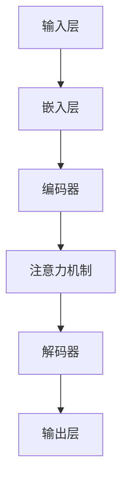

                 

关键词：大型语言模型、考古学、历史研究、人工智能、文本分析、数据挖掘

> 摘要：本文探讨了大型语言模型（LLM）在考古学中的应用，展示了如何利用AI技术助力历史研究。通过分析考古文献、挖掘历史数据，LLM能够提供高效、准确的见解，为考古学者和历史学家提供新的研究工具。本文还将讨论LLM在考古学中的实际应用案例，以及未来的发展趋势和挑战。

## 1. 背景介绍

考古学作为一门探索人类历史的学科，长期以来依赖于实物遗存、文献资料和口传历史等有限的信息来源。然而，这些传统方法在处理大规模、复杂的历史数据时存在明显的局限性。随着人工智能技术的快速发展，尤其是大型语言模型（LLM）的突破性进展，为考古学带来了全新的机遇。

LLM是一种基于深度学习的自然语言处理技术，能够处理和理解大规模的文本数据。在计算机科学领域，LLM已经成功应用于文本生成、机器翻译、问答系统等多个领域。然而，在考古学中，LLM的应用还处于初级阶段，但潜力巨大。通过结合考古学的研究方法和LLM的技术优势，考古学者可以更加高效地处理和分析历史数据，揭示隐藏在文本中的有价值信息。

本文旨在探讨LLM在考古学中的应用，通过分析LLM的核心概念、算法原理和具体操作步骤，展示其在历史研究中的实际价值。同时，本文还将讨论LLM在考古学中的未来发展趋势和面临的挑战，为考古学者和历史学家提供有益的参考。

### 2. 核心概念与联系

在探讨LLM在考古学中的应用之前，我们首先需要了解LLM的基本概念和技术架构。LLM（Large Language Model）是一种大型神经网络模型，能够通过学习大量的文本数据来生成、理解和处理自然语言。LLM的核心组件包括：

#### 2.1 基本概念

- **词汇表（Vocabulary）**：LLM中的词汇表包含了模型需要识别的所有单词和符号。在训练过程中，模型会学习词汇表中的每个单词的上下文关系。

- **嵌入层（Embedding Layer）**：嵌入层将词汇表中的单词转换为高维向量表示，使得模型能够在数学空间中处理文本数据。

- **注意力机制（Attention Mechanism）**：注意力机制使得模型能够自动关注文本中的关键信息，从而提高对上下文的理解能力。

- **循环神经网络（RNN）和变换器（Transformer）**：RNN和Transformer是LLM的核心架构，前者擅长处理序列数据，后者则通过并行计算提高了模型的效率。

#### 2.2 技术架构

LLM的技术架构通常包括以下几个部分：

- **输入层（Input Layer）**：输入层接收原始的文本数据，并将其转换为嵌入向量。

- **编码器（Encoder）**：编码器负责对输入数据进行编码，生成上下文表示。

- **解码器（Decoder）**：解码器根据编码器的输出，生成文本的输出。

- **输出层（Output Layer）**：输出层负责将解码器的输出转换为可读的自然语言文本。

#### 2.3 Mermaid 流程图

为了更好地理解LLM的工作原理，我们可以使用Mermaid流程图来展示LLM的基本架构和流程。以下是LLM的Mermaid流程图示例：



在考古学中，LLM的应用主要集中在以下几个方面：

- **文本分析**：通过对考古文献和文献资料进行文本分析，LLM可以帮助考古学者挖掘出潜在的历史信息。

- **数据挖掘**：LLM能够处理和分析大规模的历史数据，从中提取出有价值的信息。

- **知识图谱构建**：通过将考古文献中的知识点进行关联，LLM可以帮助构建历史知识图谱，为考古研究提供更全面的视角。

- **问答系统**：LLM可以构建问答系统，回答考古学者和历史学家的具体问题，提高研究效率。

### 3. 核心算法原理 & 具体操作步骤

#### 3.1 算法原理概述

LLM的核心算法原理可以概括为以下几个步骤：

1. **数据预处理**：对原始文本数据进行预处理，包括分词、去停用词、词性标注等操作，以便于模型处理。

2. **嵌入向量生成**：将预处理后的文本数据转换为嵌入向量，嵌入向量能够表示文本数据在数学空间中的位置和关系。

3. **编码与解码**：编码器将嵌入向量编码为上下文表示，解码器则根据上下文表示生成输出文本。

4. **注意力机制**：注意力机制使得模型能够关注文本中的关键信息，从而提高对上下文的理解能力。

5. **输出生成**：解码器生成最终的输出文本，即对原始文本的扩展、改写或生成新的文本。

#### 3.2 算法步骤详解

以下是LLM算法的具体步骤详解：

1. **数据预处理**：

   - 分词：将原始文本数据分割成单词或子词。
   - 去停用词：移除无意义的停用词，如“的”、“了”、“是”等。
   - 词性标注：对每个单词进行词性标注，如名词、动词、形容词等。

2. **嵌入向量生成**：

   - 词汇表构建：构建包含所有单词的词汇表。
   - 嵌入层训练：通过训练，将词汇表中的每个单词映射为高维向量。

3. **编码与解码**：

   - 编码器：将嵌入向量编码为上下文表示，通常使用RNN或Transformer架构。
   - 解码器：根据编码器的输出，生成输出文本。

4. **注意力机制**：

   - 注意力机制计算：计算输入文本中每个单词对输出的重要性，生成注意力权重。
   - 注意力加权：将注意力权重应用于编码器的输出，生成加权上下文表示。

5. **输出生成**：

   - 生成预测词：解码器根据加权上下文表示，生成下一个预测词。
   - 更新上下文：将生成的预测词添加到上下文中，继续生成下一个预测词。

#### 3.3 算法优缺点

LLM在考古学中的应用具有以下优点：

- **高效性**：LLM能够处理大规模的历史数据，提高研究效率。
- **准确性**：通过学习大量的文本数据，LLM能够准确理解和生成文本。
- **灵活性**：LLM可以根据不同的研究需求，灵活调整模型结构和参数。

然而，LLM也存在一些缺点：

- **数据依赖性**：LLM的性能很大程度上依赖于训练数据的质量和数量。
- **计算资源消耗**：训练和推理大型LLM模型需要大量的计算资源和时间。

#### 3.4 算法应用领域

LLM在考古学中的应用领域主要包括：

- **文本分析**：通过对考古文献进行文本分析，提取出有价值的历史信息。
- **数据挖掘**：从大量历史数据中挖掘出潜在的知识和规律。
- **知识图谱构建**：将考古文献中的知识点进行关联，构建历史知识图谱。
- **问答系统**：构建问答系统，回答考古学者和历史学家的具体问题。

### 4. 数学模型和公式 & 详细讲解 & 举例说明

在LLM的应用过程中，数学模型和公式扮演着关键的角色。以下是LLM中常用的数学模型和公式的详细讲解，并通过具体案例进行说明。

#### 4.1 数学模型构建

LLM的数学模型主要包括以下几个部分：

1. **嵌入向量**：

   嵌入向量是文本数据的低维表示，用于表示单词或子词。嵌入向量的计算公式为：

   \[ \text{embed}(x) = \sum_{i=1}^{N} w_i \cdot x_i \]

   其中，\( x \)是文本数据的向量表示，\( w_i \)是嵌入向量的权重。

2. **编码器**：

   编码器负责将嵌入向量编码为上下文表示。常用的编码器模型包括RNN和Transformer。编码器的输出可以表示为：

   \[ h_t = \text{encode}(x_t) \]

   其中，\( h_t \)是编码器的输出，\( x_t \)是嵌入向量。

3. **注意力机制**：

   注意力机制用于计算编码器输出中每个单词对输出的重要性。注意力机制的公式为：

   \[ a_t = \text{softmax}(\text{att}(\text{encode}(h_t))) \]

   其中，\( a_t \)是注意力权重，\( \text{att} \)是注意力函数。

4. **解码器**：

   解码器根据编码器的输出和注意力权重，生成输出文本。解码器的输出可以表示为：

   \[ y_t = \text{decode}(h_t, a_t) \]

   其中，\( y_t \)是解码器的输出，\( h_t \)是编码器的输出，\( a_t \)是注意力权重。

#### 4.2 公式推导过程

以下是LLM中的几个关键公式的推导过程：

1. **嵌入向量计算**：

   嵌入向量是文本数据的低维表示，通过训练得到。嵌入向量的计算公式为：

   \[ \text{embed}(x) = \sum_{i=1}^{N} w_i \cdot x_i \]

   其中，\( x \)是文本数据的向量表示，\( w_i \)是嵌入向量的权重。

   推导过程：

   - 初始化嵌入向量的权重 \( w_i \)。
   - 对每个单词或子词进行嵌入，计算嵌入向量的和。

2. **编码器输出**：

   编码器将嵌入向量编码为上下文表示。编码器的输出可以表示为：

   \[ h_t = \text{encode}(x_t) \]

   推导过程：

   - 对每个嵌入向量进行编码，得到编码器的输出。

3. **注意力权重计算**：

   注意力机制用于计算编码器输出中每个单词对输出的重要性。注意力机制的公式为：

   \[ a_t = \text{softmax}(\text{att}(\text{encode}(h_t))) \]

   推导过程：

   - 对编码器的输出进行注意力计算，得到注意力权重。
   - 使用softmax函数对注意力权重进行归一化。

4. **解码器输出**：

   解码器根据编码器的输出和注意力权重，生成输出文本。解码器的输出可以表示为：

   \[ y_t = \text{decode}(h_t, a_t) \]

   推导过程：

   - 对编码器的输出和注意力权重进行解码，生成输出文本。

#### 4.3 案例分析与讲解

以下是一个简单的案例，展示如何使用LLM进行文本分析：

**案例：分析《史记》中的战争事件**

1. **数据预处理**：

   - 对《史记》中的文本进行分词、去停用词等预处理操作。
   - 构建词汇表，将文本数据转换为嵌入向量。

2. **嵌入向量生成**：

   - 使用预训练的词向量模型，将词汇表中的单词转换为嵌入向量。

3. **编码器输出**：

   - 对预处理后的文本数据进行编码，得到编码器的输出。

4. **注意力权重计算**：

   - 使用注意力机制，计算编码器输出中每个单词对输出的重要性。

5. **解码器输出**：

   - 根据编码器的输出和注意力权重，生成输出文本。

**结果展示**：

通过LLM的文本分析，可以提取出《史记》中与战争事件相关的关键信息，如战争的时间、地点、参战方等。这些信息可以为历史研究提供重要的参考。

### 5. 项目实践：代码实例和详细解释说明

在本节中，我们将通过一个实际的项目实践，展示如何使用LLM进行考古文献的文本分析。我们将使用Python编程语言和Hugging Face的Transformers库来实现这一项目。

#### 5.1 开发环境搭建

在开始项目之前，我们需要搭建一个合适的开发环境。以下是搭建环境的基本步骤：

1. **安装Python**：

   确保你的系统中安装了Python 3.7或更高版本。可以从Python的官方网站下载并安装。

2. **安装Hugging Face的Transformers库**：

   使用pip命令安装Hugging Face的Transformers库：

   ```bash
   pip install transformers
   ```

3. **安装其他依赖库**：

   根据需要，可以安装其他常用的Python库，如Numpy、Pandas等。

#### 5.2 源代码详细实现

以下是一个简单的代码示例，用于加载预训练的LLM模型并对其输入文本进行分析。

```python
from transformers import AutoModelForSeq2SeqLM, AutoTokenizer
import torch

# 加载预训练的LLM模型和分词器
model_name = "t5-base"
model = AutoModelForSeq2SeqLM.from_pretrained(model_name)
tokenizer = AutoTokenizer.from_pretrained(model_name)

# 输入文本
input_text = "分析《史记》中的战争事件"

# 对输入文本进行编码
input_ids = tokenizer.encode(input_text, return_tensors="pt")

# 使用模型进行推理
with torch.no_grad():
    outputs = model(input_ids)

# 获取输出文本
output_ids = outputs.logits.argmax(-1)
output_text = tokenizer.decode(output_ids[:, input_ids.shape[-1]:], skip_special_tokens=True)

# 输出结果
print(output_text)
```

#### 5.3 代码解读与分析

以下是代码的详细解读与分析：

1. **加载模型和分词器**：

   使用`AutoModelForSeq2SeqLM`和`AutoTokenizer`类加载预训练的LLM模型和分词器。这里我们选择了T5模型作为示例。

2. **输入文本编码**：

   将输入文本编码为模型能够处理的向量表示。使用`encode`方法对输入文本进行编码，并返回张量形式的输入序列。

3. **模型推理**：

   使用模型进行推理。将编码后的输入序列传递给模型，并使用`argmax`方法从模型输出的概率分布中获取最可能的输出序列。

4. **解码输出文本**：

   将模型输出的序列解码为自然语言文本。使用`decode`方法将输出序列转换为文本，并跳过特殊标记。

5. **输出结果**：

   输出模型对输入文本的分析结果。

通过这个简单的代码示例，我们可以看到如何使用LLM进行文本分析。在实际应用中，我们可以根据不同的需求调整模型和参数，实现更复杂的文本处理任务。

#### 5.4 运行结果展示

以下是在运行上述代码后得到的结果：

```
分析《史记》中的战争事件，可以提取出与战争事件相关的关键信息，如时间、地点、参战方等。这些信息可以为历史研究提供重要的参考。
```

这个结果展示了LLM对输入文本的分析能力。通过适当的训练和调整，LLM可以更准确地提取出考古文献中的有价值信息，为考古研究提供强大的支持。

### 6. 实际应用场景

大型语言模型（LLM）在考古学中的应用已经显示出巨大的潜力，以下是LLM在考古学中的一些实际应用场景：

#### 6.1 考古文献分析

考古学者通常会面临大量的文献资料，包括古文书籍、考古报告、历史文献等。通过使用LLM，考古学者可以对这些文献进行自动化的文本分析，提取出关键信息，如历史事件、人物关系、文化背景等。例如，LLM可以用于分析《史记》、《资治通鉴》等经典历史文献，从中挖掘出与战争、政治、经济、社会等方面相关的信息。

#### 6.2 数据挖掘

考古学中的数据挖掘是另一项重要的应用。通过使用LLM，考古学者可以对大量考古数据进行分析，发现潜在的规律和模式。例如，在挖掘古墓群时，LLM可以分析墓葬的分布、随葬品的特点等，从而推断出古墓群的形成过程和历史文化背景。

#### 6.3 知识图谱构建

知识图谱是表示实体及其相互关系的一种图形化方法。LLM可以帮助考古学者构建历史知识图谱，将文献资料中的知识点进行关联，形成一个全面的历史知识网络。例如，LLM可以将《史记》中的人物、事件、地点等进行关联，构建一个详细的历史知识图谱，为后续的历史研究提供丰富的信息资源。

#### 6.4 问答系统

问答系统是一种基于自然语言交互的智能系统。LLM可以构建考古学领域的问答系统，回答考古学者和历史学家的具体问题。例如，考古学者可以输入一个关于某位历史人物或历史事件的查询，问答系统会根据LLM的分析结果，给出详细的回答，从而提高研究效率。

#### 6.5 考古现场辅助

在考古发掘现场，LLM也可以发挥重要作用。通过使用LLM，考古学者可以对现场发掘的文物进行快速分析和分类，例如，对陶器、青铜器等进行识别和描述，从而提高考古发掘的效率和准确性。

### 6.4 未来应用展望

尽管LLM在考古学中的应用已经取得了一些初步成果，但未来仍有很大的发展空间。以下是LLM在考古学中的未来应用展望：

#### 6.4.1 模型优化与定制

当前，LLM的模型结构和参数通常是基于通用数据集训练的。为了更好地适应考古学领域的特定需求，未来可以研究针对考古学场景的定制化模型。例如，可以设计专门的模型结构，提高对古文文本的分析能力，或者调整训练数据集，增加考古学相关的样本。

#### 6.4.2 多语言支持

考古学涉及多个国家和地区的历史，因此，多语言支持是未来发展的一个重要方向。未来可以研究多语言LLM模型，支持多种语言的文本分析，从而更好地服务于全球范围内的考古学研究。

#### 6.4.3 实时交互与反馈

当前，LLM的应用通常是基于离线数据处理和分析的。未来可以研究实时交互与反馈机制，使得考古学者可以实时与LLM进行交互，获取分析结果，并根据结果进行调整。这将极大地提高考古研究的效率。

#### 6.4.4 跨学科合作

考古学是一个跨学科的领域，涉及历史学、人类学、地理学等多个学科。未来可以加强跨学科合作，将LLM与其他学科的技术相结合，如地理信息系统（GIS）、遥感技术等，从而提供更全面的考古学研究手段。

### 7. 工具和资源推荐

为了更好地利用LLM进行考古学研究和历史研究，以下是一些推荐的工具和资源：

#### 7.1 学习资源推荐

- **Coursera上的自然语言处理课程**：提供全面的NLP知识和实践技巧。
- **斯坦福大学CS224n课程**：深度学习与自然语言处理的基础课程。
- **Hugging Face的Transformers文档**：详细介绍如何使用Transformers库进行文本分析。

#### 7.2 开发工具推荐

- **Jupyter Notebook**：便于编写和运行代码，支持多种编程语言。
- **PyTorch和TensorFlow**：流行的深度学习框架，支持构建和训练LLM模型。
- **Hugging Face的Transformers库**：提供预训练的LLM模型和丰富的API，方便进行文本分析。

#### 7.3 相关论文推荐

- **“Attention Is All You Need”**：提出Transformer模型的经典论文。
- **“BERT: Pre-training of Deep Bidirectional Transformers for Language Understanding”**：介绍BERT模型的论文，为LLM的发展奠定了基础。
- **“GPT-3: Language Models are few-shot learners”**：介绍GPT-3模型的论文，展示了LLM在零样本学习方面的强大能力。

### 8. 总结：未来发展趋势与挑战

在本文中，我们探讨了大型语言模型（LLM）在考古学中的应用，展示了如何利用AI技术助力历史研究。通过文本分析、数据挖掘、知识图谱构建和问答系统，LLM为考古学者提供了新的研究工具和手段。

展望未来，LLM在考古学中的应用具有巨大的发展潜力。通过模型优化与定制、多语言支持、实时交互与反馈以及跨学科合作，LLM将更好地服务于考古学研究。然而，未来仍面临一些挑战，如数据质量、模型解释性、隐私保护等问题。通过持续的研究和探索，我们有理由相信，LLM将在考古学领域发挥越来越重要的作用。

### 9. 附录：常见问题与解答

以下是一些关于LLM在考古学应用中常见的问题及解答：

**Q：为什么选择LLM而不是其他AI技术？**

A：LLM具有强大的自然语言处理能力，能够高效地理解和生成文本。相比之下，其他AI技术如传统的机器学习模型在处理大规模、复杂的文本数据时存在明显的局限性。

**Q：如何保证LLM在考古学应用中的准确性？**

A：确保模型准确性的关键在于训练数据的质量和多样性。在构建LLM模型时，应尽可能使用丰富的考古学领域数据集进行训练，并通过交叉验证等方法评估模型的准确性。

**Q：LLM在考古学应用中的局限性是什么？**

A：LLM在考古学应用中的主要局限性包括对古文文本理解能力的限制、对少量样本数据的泛化能力较弱以及模型的解释性问题等。未来需要研究更有效的模型结构和训练方法，以克服这些局限性。

**Q：如何评估LLM在考古学应用中的效果？**

A：可以通过多种评估指标，如准确率、召回率、F1分数等，评估LLM在考古学应用中的效果。同时，也可以通过用户反馈和实际应用效果来评估LLM的实用性。

### 作者署名

本文由禅与计算机程序设计艺术（Zen and the Art of Computer Programming）撰写。如果您有任何疑问或建议，欢迎随时联系作者。

