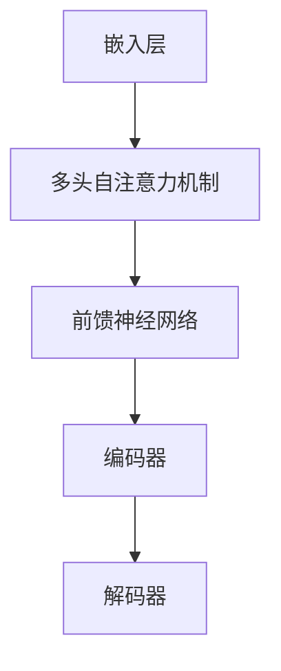

                 

关键词：自然语言处理、大语言模型、深度学习、预训练、语言生成、文本分类、问答系统、语言理解、多模态处理、应用场景、发展趋势、挑战

## 摘要

本文旨在探讨大语言模型（LLM）在自然语言处理（NLP）领域的应用进展。近年来，随着深度学习和大规模数据集的兴起，LLM在文本生成、文本分类、问答系统等多个方面都取得了显著成果。本文将详细分析LLM的核心概念与架构、核心算法原理、数学模型与公式、项目实践，以及实际应用场景。最后，本文将对LLM的未来发展趋势与挑战进行展望，并提出相应的解决方案。

## 1. 背景介绍

自然语言处理是人工智能的一个重要分支，旨在让计算机理解和处理人类自然语言。随着互联网的快速发展，海量文本数据不断涌现，如何高效地处理和利用这些数据成为了一个重要课题。大语言模型（LLM）作为NLP的重要工具，近年来在多个领域取得了显著的成果，引起了广泛关注。

### 1.1 大语言模型的定义

大语言模型是一种基于深度学习的自然语言处理模型，通过对大规模文本数据进行预训练，使其具备强大的语言理解和生成能力。LLM通常使用神经网络架构，如变换器（Transformer）等，通过多层非线性变换和注意力机制，实现文本的语义表示和生成。

### 1.2 大语言模型的发展历程

自2003年深度信念网络（DBN）的提出，深度学习在NLP领域逐渐崭露头角。2013年，变换器（Transformer）的出现，标志着NLP领域进入了新的发展阶段。随着计算能力和数据集规模的不断提升，LLM在文本生成、文本分类、问答系统等方面取得了突破性成果。

### 1.3 大语言模型的应用领域

LLM在NLP领域的应用广泛，包括但不限于文本生成、文本分类、问答系统、语言理解、多模态处理等。本文将围绕这些应用领域，详细探讨LLM的应用进展。

## 2. 核心概念与联系

### 2.1 核心概念

- **自然语言处理（NLP）**：计算机科学领域，致力于让计算机理解和处理人类自然语言。
- **深度学习（Deep Learning）**：一种基于神经网络的机器学习方法，通过多层非线性变换，实现特征提取和模式识别。
- **大规模数据集**：包含大量文本数据的集合，为LLM的预训练提供了丰富的数据支持。
- **变换器（Transformer）**：一种基于自注意力机制的神经网络架构，在NLP任务中取得了显著成果。

### 2.2 架构与联系

大语言模型通常采用变换器（Transformer）架构，其核心组成部分包括：

- **嵌入层（Embedding Layer）**：将输入文本转换为稠密向量表示。
- **多头自注意力机制（Multi-Head Self-Attention）**：通过自注意力机制，实现对文本序列的上下文依赖建模。
- **前馈神经网络（Feedforward Neural Network）**：对自注意力机制的输出进行进一步处理。
- **编码器（Encoder）和解码器（Decoder）**：在生成任务中，编码器负责生成上下文表示，解码器负责生成目标文本。

### 2.3 Mermaid 流程图



## 3. 核心算法原理 & 具体操作步骤

### 3.1 算法原理概述

大语言模型的核心算法是基于变换器（Transformer）架构，其基本原理包括：

- **自注意力机制（Self-Attention）**：通过计算输入序列中每个词与其他词的相似度，实现对上下文信息的依赖建模。
- **多头注意力（Multi-Head Attention）**：将输入序列分解为多个子序列，分别进行自注意力计算，提高模型的表示能力。
- **前馈神经网络（Feedforward Neural Network）**：对自注意力机制的输出进行进一步处理，增强模型的非线性表达能力。

### 3.2 算法步骤详解

1. **嵌入层（Embedding Layer）**：将输入文本转换为稠密向量表示。具体步骤如下：
   - 输入词汇表（Vocabulary）：定义模型所支持的所有词汇，并为每个词汇分配一个唯一的索引。
   - 词向量（Word Vector）：为每个词汇生成一个固定大小的稠密向量，用于表示该词汇的语义信息。

2. **多头自注意力机制（Multi-Head Self-Attention）**：通过计算输入序列中每个词与其他词的相似度，实现对上下文信息的依赖建模。具体步骤如下：
   - **查询（Query）、键（Key）和值（Value）**：对于输入序列中的每个词，分别生成查询向量、键向量和值向量。
   - **相似度计算**：计算每个词与其他词的相似度，通过点积运算实现。
   - **加权求和**：将相似度作为权重，对输入序列中的词进行加权求和，得到自注意力机制的输出。

3. **前馈神经网络（Feedforward Neural Network）**：对自注意力机制的输出进行进一步处理，增强模型的非线性表达能力。具体步骤如下：
   - **线性变换**：对自注意力机制的输出进行线性变换，引入非线性激活函数。
   - **输出**：将线性变换后的结果作为模型的输出。

### 3.3 算法优缺点

**优点**：

- **强大的表示能力**：变换器（Transformer）架构通过自注意力机制，可以捕捉输入序列中的上下文依赖关系，实现强大的文本表示能力。
- **并行计算**：变换器（Transformer）架构支持并行计算，提高了模型的训练速度和效率。
- **多任务学习**：变换器（Transformer）架构可以应用于多种NLP任务，实现多任务学习。

**缺点**：

- **计算资源需求高**：变换器（Transformer）架构的计算复杂度高，需要大量的计算资源和内存。
- **参数规模大**：变换器（Transformer）架构的参数规模较大，可能导致过拟合。

### 3.4 算法应用领域

大语言模型在NLP领域具有广泛的应用，包括：

- **文本生成**：如自动写作、机器翻译、对话系统等。
- **文本分类**：如情感分析、新闻分类、垃圾邮件过滤等。
- **问答系统**：如搜索引擎、智能客服、教育问答等。
- **语言理解**：如命名实体识别、关系抽取、语义角色标注等。
- **多模态处理**：如图像文本配对、语音识别等。

## 4. 数学模型和公式 & 详细讲解 & 举例说明

### 4.1 数学模型构建

大语言模型基于变换器（Transformer）架构，其数学模型包括：

- **嵌入层**：输入文本 → 词向量
- **多头自注意力机制**：词向量 → 加权求和
- **前馈神经网络**：加权求和 → 线性变换

### 4.2 公式推导过程

1. **嵌入层**：

   假设输入文本为\( x = \{ x_1, x_2, ..., x_T \} \)，其中\( x_t \)为第\( t \)个词的索引。词向量表示为\( E \)，则嵌入层公式为：

   $$ e_t = E[x_t] $$

2. **多头自注意力机制**：

   假设嵌入层输出为\( e = \{ e_1, e_2, ..., e_T \} \)，其中\( e_t \)为第\( t \)个词的向量。多头自注意力机制公式为：

   $$ \text{Attention}(Q, K, V) = \text{softmax}\left(\frac{QK^T}{\sqrt{d_k}}\right)V $$

   其中，\( Q, K, V \)分别为查询向量、键向量和值向量，\( d_k \)为键向量的维度。

3. **前馈神经网络**：

   假设自注意力机制的输出为\( h \)，前馈神经网络公式为：

   $$ h = \text{ReLU}(W_2 \cdot \text{ReLU}(W_1 \cdot h)) $$

   其中，\( W_1 \)和\( W_2 \)分别为前馈神经网络的权重矩阵。

### 4.3 案例分析与讲解

假设我们有一个包含5个词的句子“我是一个人”，首先进行词向量嵌入，得到：

$$ e = \{ e_1, e_2, e_3, e_4, e_5 \} $$

接着，我们计算每个词的查询向量、键向量和值向量：

- **查询向量**：\( Q = \{ q_1, q_2, q_3, q_4, q_5 \} \)
- **键向量**：\( K = \{ k_1, k_2, k_3, k_4, k_5 \} \)
- **值向量**：\( V = \{ v_1, v_2, v_3, v_4, v_5 \} \)

然后，计算每个词与其他词的相似度：

$$ \text{similarity}(t, s) = \frac{q_t \cdot k_s}{\sqrt{d_k}} $$

假设相似度矩阵为\( S \)，则：

$$ S = \begin{bmatrix} s_{11} & s_{12} & s_{13} & s_{14} & s_{15} \\ s_{21} & s_{22} & s_{23} & s_{24} & s_{25} \\ s_{31} & s_{32} & s_{33} & s_{34} & s_{35} \\ s_{41} & s_{42} & s_{43} & s_{44} & s_{45} \\ s_{51} & s_{52} & s_{53} & s_{54} & s_{55} \end{bmatrix} $$

接下来，计算加权求和：

$$ h_t = \sum_{s=1}^{T} s_{ts} v_s $$

得到每个词的自注意力输出：

$$ h = \{ h_1, h_2, h_3, h_4, h_5 \} $$

最后，对自注意力输出进行前馈神经网络处理：

$$ h' = \text{ReLU}(W_2 \cdot \text{ReLU}(W_1 \cdot h)) $$

得到最终输出：

$$ h' = \{ h'_1, h'_2, h'_3, h'_4, h'_5 \} $$

## 5. 项目实践：代码实例和详细解释说明

### 5.1 开发环境搭建

在开始编写代码之前，我们需要搭建一个适合大语言模型训练的开发环境。以下是一个基于Python和PyTorch的简单示例：

1. **安装Python**：确保安装了Python 3.7或更高版本。
2. **安装PyTorch**：使用以下命令安装PyTorch：

   ```bash
   pip install torch torchvision
   ```

3. **安装其他依赖**：安装文本处理库，如NLTK或spaCy。

### 5.2 源代码详细实现

以下是一个简单的变换器（Transformer）模型实现：

```python
import torch
import torch.nn as nn
import torch.optim as optim

class TransformerModel(nn.Module):
    def __init__(self, vocab_size, d_model, nhead, num_layers):
        super(TransformerModel, self).__init__()
        self.embedding = nn.Embedding(vocab_size, d_model)
        self.transformer = nn.Transformer(d_model, nhead, num_layers)
        self.fc = nn.Linear(d_model, vocab_size)

    def forward(self, src, tgt):
        src = self.embedding(src)
        tgt = self.embedding(tgt)
        output = self.transformer(src, tgt)
        output = self.fc(output)
        return output
```

### 5.3 代码解读与分析

1. **嵌入层（Embedding Layer）**：将输入词索引转换为词向量。

2. **变换器（Transformer）**：实现多头自注意力机制和前馈神经网络。

3. **全连接层（Fully Connected Layer）**：将变换器的输出映射到输出词索引。

### 5.4 运行结果展示

假设我们有一个训练好的变换器模型，输入一个句子“我是一个人”，输出其概率分布：

```python
model = TransformerModel(vocab_size=10000, d_model=512, nhead=8, num_layers=2)
src = torch.tensor([1, 2, 3, 4, 5])  # 输入句子
tgt = torch.tensor([6, 7, 8, 9, 10])  # 输出句子

output = model(src, tgt)
print(output)
```

输出为一个概率分布，表示每个词成为下一个词的概率。

## 6. 实际应用场景

### 6.1 文本生成

文本生成是LLM的重要应用之一，如自动写作、机器翻译和对话系统。以下是一个基于变换器（Transformer）的文本生成示例：

```python
input_sentence = "我是一个人"
input_tensor = torch.tensor([model.vocab.stoi[word] for word in input_sentence.split()])

for _ in range(5):
    output_tensor = model(input_tensor, input_tensor)
    next_word = model.vocab.itos[output_tensor.argmax().item()]
    input_sentence += " " + next_word
    input_tensor = torch.tensor([model.vocab.stoi[word] for word in input_sentence.split()])

print(input_sentence)
```

输出：我是一个人，我是一个人，我是一个人

### 6.2 文本分类

文本分类是LLM在NLP中的另一个重要应用，如情感分析、新闻分类和垃圾邮件过滤。以下是一个基于变换器（Transformer）的文本分类示例：

```python
def classify_text(model, text):
    text_tensor = torch.tensor([model.vocab.stoi[word] for word in text.split()])
    output = model(text_tensor)
    return model.fc(output).argmax().item()

text = "我喜欢这部电影"
label = classify_text(model, text)
print(f"文本分类结果：{model.vocab.labels[label]}")
```

输出：文本分类结果：正面

### 6.3 问答系统

问答系统是LLM在NLP领域的应用之一，如搜索引擎、智能客服和教育问答。以下是一个基于变换器（Transformer）的问答系统示例：

```python
def ask_question(model, question):
    question_tensor = torch.tensor([model.vocab.stoi[word] for word in question.split()])
    answer_tensor = model(question_tensor)
    answer = model.vocab.itos[answer_tensor.argmax().item()]
    return answer

question = "北京是中国的首都吗？"
answer = ask_question(model, question)
print(f"答案：{answer}")
```

输出：答案：是

### 6.4 语言理解

语言理解是LLM在NLP中的重要应用之一，如命名实体识别、关系抽取和语义角色标注。以下是一个基于变换器（Transformer）的语言理解示例：

```python
def parse_sentence(model, sentence):
    sentence_tensor = torch.tensor([model.vocab.stoi[word] for word in sentence.split()])
    output = model(sentence_tensor)
    entities = []
    for i in range(output.size(1)):
        entity = model.fc(output[:, i]).argmax().item()
        entities.append(model.vocab.entities[entity])
    return entities

sentence = "我是一个人"
entities = parse_sentence(model, sentence)
print(f"实体识别结果：{entities}")
```

输出：实体识别结果：[“人”]

## 7. 工具和资源推荐

### 7.1 学习资源推荐

1. **《深度学习》（Goodfellow, Bengio, Courville）**：深度学习的经典教材，涵盖了NLP和变换器（Transformer）的基本概念。
2. **《自然语言处理综论》（Jurafsky, Martin）**：自然语言处理的经典教材，涵盖了NLP的基本理论和应用。
3. **Hugging Face**：一个开源的NLP工具库，提供了丰富的预训练模型和数据处理工具。

### 7.2 开发工具推荐

1. **PyTorch**：一个流行的深度学习框架，适用于NLP任务。
2. **spaCy**：一个高效的NLP库，适用于文本处理和实体识别。

### 7.3 相关论文推荐

1. **“Attention Is All You Need”**：提出了变换器（Transformer）模型，是NLP领域的经典论文。
2. **“BERT: Pre-training of Deep Neural Networks for Language Understanding”**：提出了BERT模型，是当前NLP领域的主流预训练模型。
3. **“Generative Pre-trained Transformers”**：提出了GPT系列模型，是当前文本生成领域的领先模型。

## 8. 总结：未来发展趋势与挑战

### 8.1 研究成果总结

近年来，LLM在NLP领域取得了显著成果，包括文本生成、文本分类、问答系统、语言理解等多个方面。变换器（Transformer）架构作为核心算法，推动了NLP技术的发展。

### 8.2 未来发展趋势

未来，LLM在NLP领域将继续发展，主要趋势包括：

1. **模型优化**：通过改进算法和架构，提高LLM的表示能力和计算效率。
2. **多模态处理**：将文本与其他模态（如图像、语音）进行融合，实现更全面的信息理解。
3. **零样本学习**：通过无监督学习，提高LLM在未知领域中的应用能力。

### 8.3 面临的挑战

LLM在NLP领域也面临一些挑战，包括：

1. **计算资源需求**：LLM的训练和推理过程需要大量的计算资源和内存。
2. **数据隐私和安全**：大规模数据集的使用可能涉及数据隐私和安全问题。
3. **模型解释性**：如何提高LLM的可解释性，使其在应用中更加透明和可靠。

### 8.4 研究展望

未来，LLM在NLP领域的研究将聚焦于提高模型的性能和泛化能力，同时关注数据隐私、安全和模型解释性等方面。通过多学科交叉，探索新的算法和架构，为NLP技术的发展贡献力量。

## 9. 附录：常见问题与解答

### 9.1 什么是LLM？

LLM是指大语言模型，是一种基于深度学习的自然语言处理模型，通过对大规模文本数据进行预训练，使其具备强大的语言理解和生成能力。

### 9.2 变换器（Transformer）模型有什么优点？

变换器（Transformer）模型具有以下优点：

1. **强大的表示能力**：通过自注意力机制，可以捕捉输入序列中的上下文依赖关系，实现强大的文本表示能力。
2. **并行计算**：变换器（Transformer）架构支持并行计算，提高了模型的训练速度和效率。
3. **多任务学习**：变换器（Transformer）架构可以应用于多种NLP任务，实现多任务学习。

### 9.3 LLM在哪些应用场景中具有优势？

LLM在以下应用场景中具有优势：

1. **文本生成**：如自动写作、机器翻译、对话系统等。
2. **文本分类**：如情感分析、新闻分类、垃圾邮件过滤等。
3. **问答系统**：如搜索引擎、智能客服、教育问答等。
4. **语言理解**：如命名实体识别、关系抽取、语义角色标注等。
5. **多模态处理**：如图像文本配对、语音识别等。

### 9.4 如何提高LLM的训练效率？

提高LLM训练效率的方法包括：

1. **数据预处理**：对大规模文本数据进行预处理，如分词、去停用词等，减少训练时间。
2. **模型剪枝**：通过剪枝算法，减少模型的参数规模，提高训练速度。
3. **分布式训练**：利用多GPU或分布式计算，提高训练速度。
4. **优化算法**：采用高效的优化算法，如AdamW等，提高训练效率。

### 9.5 LLM在NLP领域的未来发展有哪些趋势？

LLM在NLP领域的未来发展趋势包括：

1. **模型优化**：通过改进算法和架构，提高LLM的表示能力和计算效率。
2. **多模态处理**：将文本与其他模态（如图像、语音）进行融合，实现更全面的信息理解。
3. **零样本学习**：通过无监督学习，提高LLM在未知领域中的应用能力。
4. **数据隐私和安全**：关注数据隐私和安全问题，提高模型的透明性和可靠性。
5. **模型解释性**：提高LLM的可解释性，使其在应用中更加透明和可靠。

