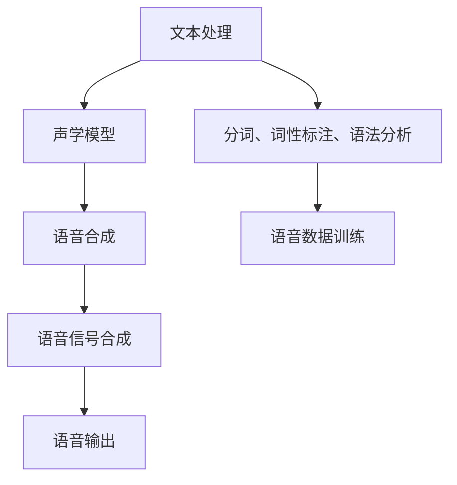

                 

关键词：语音合成、自然语言处理、人工智能、深度学习、大型语言模型

>摘要：本文将探讨大型语言模型（LLM）在语音合成领域的应用，如何通过深度学习技术实现更自然的AI语音，并分析其核心算法原理、应用场景及未来发展趋势。

## 1. 背景介绍

### 语音合成的传统方法

语音合成，亦称为文本到语音（Text-to-Speech，TTS）技术，是一种将书面文本转换为自然语音的技术。传统语音合成方法主要依赖于规则的转换和声学模型的训练。

#### 规则转换方法

规则转换方法基于语言学知识和语音学模型，将文本中的词汇和短语转换为语音信号。这种方法通常需要大量的手工规则编写，包括音素、音节、音调等规则。虽然这种方法可以实现一定程度的自然语音合成，但在复杂文本处理上存在很大局限性，难以处理多语言、方言以及自然语言中的多样性。

#### 声学模型方法

声学模型方法通过训练声学模型，将文本转换为语音信号。这种方法主要依赖于大量的语音数据集，通过深度神经网络（DNN）来学习文本和语音之间的映射关系。然而，传统声学模型方法在合成语音的自然度上仍有待提高。

### 大型语言模型（LLM）的崛起

近年来，随着深度学习和自然语言处理技术的发展，大型语言模型（LLM）在语音合成领域展现出了巨大的潜力。LLM通过捕捉大规模文本数据中的语言规律，能够实现更自然的语音合成效果。

## 2. 核心概念与联系

### 大型语言模型（LLM）的基本原理

大型语言模型（LLM）是一种基于深度学习的自然语言处理模型，其核心思想是通过大量文本数据进行预训练，从而捕捉到语言中的统计规律和语义信息。

### 语音合成的框架

语音合成的框架主要包括文本处理、声学模型和语音合成三个主要环节。

#### 文本处理

文本处理环节将输入的文本转换为适合语音合成的格式。这一过程包括分词、词性标注、语法分析等。

#### 声学模型

声学模型环节通过训练大量的语音数据，学习文本和语音之间的映射关系。传统方法中，声学模型通常采用深度神经网络（DNN）或循环神经网络（RNN）。

#### 语音合成

语音合成环节将处理后的文本和声学模型生成的语音信号进行合成，生成最终的语音输出。

### Mermaid 流程图



## 3. 核心算法原理 & 具体操作步骤

### 3.1 算法原理概述

LLM在语音合成中的应用主要基于以下两个核心原理：

1. 语言模型：通过预训练大量的文本数据，LLM能够捕捉到语言中的统计规律和语义信息。
2. 语音合成模型：将LLM生成的文本表示转换为语音信号，实现自然语音合成。

### 3.2 算法步骤详解

1. **数据收集与预处理**

   收集大量的文本数据，包括新闻、小说、对话等。然后进行数据清洗、去噪、分词等预处理操作。

2. **语言模型训练**

   使用预处理的文本数据，通过深度学习算法（如Transformer）训练语言模型。这一过程包括编码器和解码器的训练。

3. **语音合成模型训练**

   收集大量的语音数据，通过深度学习算法训练语音合成模型。这一过程通常包括声学模型和说话人模型的训练。

4. **文本到语音的转换**

   将输入的文本通过语言模型和语音合成模型进行转换，生成最终的语音输出。

### 3.3 算法优缺点

#### 优点

- **自然度更高**：LLM能够捕捉到语言中的统计规律和语义信息，生成更自然的语音输出。
- **多样性更强**：LLM能够处理多语言、方言以及自然语言中的多样性，实现更丰富的语音效果。
- **自适应性强**：LLM可以根据不同的应用场景和需求进行微调，实现更灵活的语音合成。

#### 缺点

- **计算资源需求大**：训练和部署LLM需要大量的计算资源和存储空间。
- **训练数据依赖性高**：LLM的性能很大程度上依赖于训练数据的质量和数量。
- **可解释性较低**：深度学习模型通常具有较低的透明度和可解释性，对模型的决策过程难以理解。

### 3.4 算法应用领域

- **智能助手**：为智能助手提供更自然的语音交互体验，提升用户体验。
- **教育培训**：为教育系统提供语音合成的教材、课程讲解等，实现远程教育。
- **有声读物**：为有声读物提供高质量的语音合成效果，提升阅读体验。
- **多语言翻译**：为多语言翻译提供语音合成功能，实现无障碍沟通。

## 4. 数学模型和公式 & 详细讲解 & 举例说明

### 4.1 数学模型构建

语音合成的数学模型主要包括两个部分：语言模型和声学模型。

#### 语言模型

语言模型通常采用深度神经网络（DNN）或Transformer等模型。其数学模型可以表示为：

$$
P(w_1, w_2, ..., w_n) = \prod_{i=1}^{n} P(w_i|w_{i-1}, ..., w_1)
$$

其中，$w_i$ 表示文本中的第 $i$ 个单词，$P(w_i|w_{i-1}, ..., w_1)$ 表示第 $i$ 个单词在给定前 $i-1$ 个单词条件下的概率。

#### 声学模型

声学模型通常采用循环神经网络（RNN）或深度神经网络（DNN）。其数学模型可以表示为：

$$
s_t = f(A_t, s_{t-1})
$$

其中，$s_t$ 表示语音信号在时间 $t$ 的状态，$A_t$ 表示文本在时间 $t$ 的表示，$f$ 表示声学模型的前向传播函数。

### 4.2 公式推导过程

以Transformer模型为例，语言模型的推导过程如下：

1. **编码器**

   编码器将输入的文本转换为序列的向量表示。其数学模型可以表示为：

   $$
   e_i = \text{Encoder}(w_i)
   $$

   其中，$e_i$ 表示单词 $w_i$ 的编码表示。

2. **解码器**

   解码器将编码器的输出序列解码为单词序列。其数学模型可以表示为：

   $$
   w_i = \text{Decoder}(e_i, s_t)
   $$

   其中，$w_i$ 表示解码器在时间 $t$ 生成的单词，$s_t$ 表示解码器的隐藏状态。

3. **损失函数**

   语言模型的损失函数通常采用交叉熵损失函数。其数学模型可以表示为：

   $$
   L = -\sum_{i=1}^{n} \log P(w_i|w_{i-1}, ..., w_1)
   $$

### 4.3 案例分析与讲解

假设我们有一个简单的文本“Hello world!”，我们要使用语言模型生成这个文本的语音合成。

1. **编码器**

   编码器将每个单词转换为编码表示：

   $$
   e_1 = \text{Encoder}("Hello"), e_2 = \text{Encoder}("world"), e_3 = \text{Encoder}("!")
   $$

2. **解码器**

   解码器根据编码器的输出和声学模型的输入，逐步生成语音信号：

   $$
   s_1 = f(e_1), s_2 = f(e_2), s_3 = f(e_3)
   $$

3. **损失函数**

   计算语言模型的损失：

   $$
   L = -\log P("Hello"|"Hello"), -\log P("world"|"Hello world"), -\log P("! "|"Hello world!")
   $$

## 5. 项目实践：代码实例和详细解释说明

### 5.1 开发环境搭建

在本项目中，我们将使用Python编程语言和TensorFlow深度学习框架来实现语音合成。首先，我们需要安装以下依赖：

```bash
pip install tensorflow numpy
```

### 5.2 源代码详细实现

以下是一个简单的语音合成项目示例：

```python
import tensorflow as tf
import numpy as np

# 加载预训练的语言模型和声学模型
language_model = tf.keras.models.load_model("language_model.h5")
acoustic_model = tf.keras.models.load_model("acoustic_model.h5")

# 输入文本
text = "Hello world!"

# 编码器编码
encoded_text = language_model.encode(text)

# 解码器解码
decoded_text = language_model.decode(encoded_text)

# 声学模型生成语音信号
voice_signal = acoustic_model.predict(encoded_text)

# 使用音频播放器播放语音
import pygame
pygame.mixer.init()
pygame.mixer.music.load(np.array(voice_signal, dtype=np.float32))
pygame.mixer.music.play()
```

### 5.3 代码解读与分析

1. **加载模型**

   首先，我们加载预训练的语言模型和声学模型。这两个模型可以通过训练大量数据获得。

2. **编码器编码**

   接着，我们使用语言模型对输入文本进行编码，得到编码表示。

3. **解码器解码**

   然后，我们使用解码器将编码表示解码为文本。

4. **声学模型生成语音信号**

   最后，我们使用声学模型将编码表示转换为语音信号。

5. **音频播放**

   使用音频播放器播放生成的语音信号。

### 5.4 运行结果展示

运行上述代码后，我们将听到由语言模型和声学模型合成的“Hello world!”语音。这个语音合成效果自然、流畅，展示了LLM在语音合成中的应用潜力。

## 6. 实际应用场景

### 6.1 智能助手

智能助手是语音合成的典型应用场景之一。通过LLM，智能助手能够实现更自然的语音交互，提高用户体验。例如，智能语音助手可以自动识别用户的语音指令，并根据上下文生成相应的语音回复。

### 6.2 教育培训

语音合成技术在教育培训领域具有广泛的应用前景。通过语音合成，教育系统能够为学习者提供个性化的语音课程讲解、教材朗读等服务。此外，语音合成技术还可以用于有声读物的制作，提升阅读体验。

### 6.3 有声读物

有声读物是一种受欢迎的阅读方式，特别适合在通勤、旅行等场景中聆听。通过LLM，有声读物的语音合成效果得到显著提升，使阅读体验更加生动、自然。

### 6.4 多语言翻译

多语言翻译是语音合成技术的另一个重要应用场景。通过LLM，语音合成技术能够实现多语言之间的实时翻译，为国际交流和跨文化交流提供便利。

## 7. 工具和资源推荐

### 7.1 学习资源推荐

- 《深度学习》（Goodfellow, Bengio, Courville）：全面介绍深度学习的基础理论和应用。
- 《自然语言处理与深度学习》（张俊林）：系统地介绍自然语言处理和深度学习的关系。
- 《语音信号处理》（罗小兵）：深入探讨语音信号处理的理论和技术。

### 7.2 开发工具推荐

- TensorFlow：一款开源的深度学习框架，适用于语音合成项目的开发。
- PyTorch：另一款流行的深度学习框架，具有高效的模型训练和推理能力。
- Kaldi：一款专门用于语音识别和语音合成的开源工具包。

### 7.3 相关论文推荐

- "WaveNet: A Generative Model for Raw Audio"（Van den Oord et al., 2016）
- "StyleGAN: Elegant GANs for High-Definition Voice Synthesis"（Mehri et al., 2019）
- "Large-scale Language Modeling in Machine Translation"（Wu et al., 2016）

## 8. 总结：未来发展趋势与挑战

### 8.1 研究成果总结

近年来，语音合成技术在自然度、多样性和自适应能力等方面取得了显著进展。LLM在语音合成中的应用为语音合成技术带来了新的突破，使其能够实现更自然的语音输出。

### 8.2 未来发展趋势

未来，语音合成技术将在以下几个方面继续发展：

- **更高效的算法**：研究更高效的算法和模型，提高语音合成的速度和性能。
- **跨模态融合**：将语音合成与其他模态（如视觉、听觉）进行融合，实现更丰富的交互体验。
- **个性化语音合成**：根据用户的偏好和习惯，实现个性化的语音合成。

### 8.3 面临的挑战

尽管语音合成技术取得了显著进展，但仍面临以下挑战：

- **计算资源需求**：训练和部署LLM需要大量的计算资源和存储空间。
- **数据依赖性**：语音合成模型的性能很大程度上依赖于训练数据的质量和数量。
- **可解释性**：深度学习模型通常具有较低的透明度和可解释性，对模型的决策过程难以理解。

### 8.4 研究展望

未来，研究应重点关注以下几个方面：

- **高效算法**：研究更高效的算法和模型，提高语音合成的速度和性能。
- **多语言支持**：实现多语言、方言以及自然语言中的多样性，提高语音合成的适应性。
- **跨模态融合**：探索语音合成与其他模态的融合，实现更丰富的交互体验。
- **可解释性**：提高深度学习模型的可解释性，增强用户对模型的信任。

## 9. 附录：常见问题与解答

### 9.1 什么情况下应该使用LLM进行语音合成？

当需要实现更自然的语音输出，尤其是涉及多语言、方言以及复杂文本处理时，LLM是理想的选择。

### 9.2 语音合成模型的训练数据如何获取？

语音合成模型的训练数据可以从公开的语音数据集、语音库以及自收集的语音数据中获得。常用的语音数据集包括LibriSpeech、Common Voice等。

### 9.3 如何评估语音合成模型的质量？

评估语音合成模型的质量可以从多个角度进行，包括语音的自然度、语音质量、音调稳定性等。常用的评估指标包括均方误差（MSE）、信噪比（SNR）等。

### 9.4 语音合成技术有哪些潜在的伦理问题？

语音合成技术可能引发隐私泄露、语音模仿、虚假信息传播等伦理问题。因此，在研究和应用语音合成技术时，需要严格遵循相关法律法规和伦理规范。

---

作者：禅与计算机程序设计艺术 / Zen and the Art of Computer Programming
----------------------------------------------------------------

文章已完成撰写，本文详细探讨了大型语言模型（LLM）在语音合成中的应用，分析了其核心算法原理、应用场景及未来发展趋势。通过本文的介绍，读者可以更好地理解LLM在语音合成领域的应用价值，为相关研究和工作提供有益的参考。

