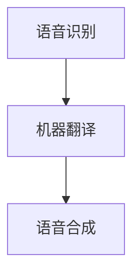

                 

关键词：语音翻译，大型语言模型（LLM），深度学习，自然语言处理，跨语言通信

> 摘要：本文深入探讨了大型语言模型（LLM）在语音翻译领域的应用与研究热点。通过分析LLM的原理、算法及其实际应用，本文揭示了LLM在语音翻译中带来的变革，并展望了未来的发展趋势与挑战。

## 1. 背景介绍

### 1.1 语音翻译的起源与发展

语音翻译作为跨语言通信的一种重要形式，其历史可以追溯到20世纪中叶。早期的研究主要集中在基于规则的方法和机器翻译系统上。随着计算能力和算法的不断发展，统计机器翻译（SMT）和神经机器翻译（NMT）逐渐取代了传统的基于规则的方法。

### 1.2 大型语言模型的崛起

近年来，大型语言模型（LLM）的崛起为语音翻译领域带来了新的契机。LLM如GPT、BERT等，通过深度学习技术，从海量数据中学习语言模式，从而在许多自然语言处理任务上取得了突破性的进展。

## 2. 核心概念与联系

### 2.1 大型语言模型（LLM）的概念

LLM是指具有数十亿参数规模的语言模型，通过自回归方式生成文本。这种模型能够理解并生成复杂、连贯的文本，从而在许多自然语言处理任务中表现出色。

### 2.2 语音翻译的原理

语音翻译涉及语音识别、机器翻译和语音合成三个环节。语音识别将语音转换为文本，机器翻译将源语言文本翻译为目标语言文本，语音合成将目标语言文本转换为语音。

### 2.3 Mermaid流程图



## 3. 核心算法原理 & 具体操作步骤

### 3.1 算法原理概述

语音翻译的核心算法包括语音识别、机器翻译和语音合成。语音识别利用深度神经网络（DNN）或卷积神经网络（CNN）从语音信号中提取特征，并将其转换为文本。机器翻译则利用神经网络翻译模型（如NMT）将源语言文本翻译为目标语言文本。语音合成则通过文本到语音（TTS）合成模型将目标语言文本转换为语音。

### 3.2 算法步骤详解

#### 3.2.1 语音识别

1. **特征提取**：利用DNN或CNN从语音信号中提取特征。
2. **声学模型**：将提取的特征映射到声学空间。
3. **语言模型**：对语音序列进行解码，生成文本。

#### 3.2.2 机器翻译

1. **编码器**：将源语言文本编码为固定长度的向量。
2. **解码器**：将目标语言文本解码为目标语言序列。
3. **注意力机制**：在编码器和解码器之间引入注意力机制，以关注重要的源语言信息。

#### 3.2.3 语音合成

1. **声学模型**：将目标语言文本编码为声学特征。
2. **发声模型**：将声学特征转换为语音信号。

### 3.3 算法优缺点

#### 优点：

1. **高效性**：利用深度学习技术，算法在语音识别、机器翻译和语音合成任务上表现出色。
2. **灵活性**：LLM能够适应各种语言和方言，具有较强的泛化能力。

#### 缺点：

1. **计算资源需求大**：LLM模型参数规模巨大，对计算资源有较高要求。
2. **数据依赖性**：算法性能依赖于大量高质量的数据。

### 3.4 算法应用领域

LLM在语音翻译领域的应用包括实时语音翻译、翻译辅助工具、跨语言通信平台等。未来，随着算法的不断发展，LLM在语音翻译领域的应用前景将更加广阔。

## 4. 数学模型和公式 & 详细讲解 & 举例说明

### 4.1 数学模型构建

语音翻译的数学模型主要包括语音识别、机器翻译和语音合成三个部分。以下是每个部分的数学模型概述：

#### 4.1.1 语音识别

1. **声学模型**：假设声学特征向量为\( x \)，声学空间中的映射函数为\( f(x) \)，则声学模型可以表示为：
   $$ f(x) = \text{DNN}(x) $$
2. **语言模型**：假设语音序列为\( y \)，语言模型为\( P(y|x) \)，则语言模型可以表示为：
   $$ P(y|x) = \text{N-gram}(y) $$

#### 4.1.2 机器翻译

1. **编码器**：假设源语言文本为\( x \)，编码器输出为\( h \)，则编码器可以表示为：
   $$ h = \text{Encoder}(x) $$
2. **解码器**：假设目标语言文本为\( y \)，解码器输出为\( p(y|h) \)，则解码器可以表示为：
   $$ p(y|h) = \text{Decoder}(y|h) $$

#### 4.1.3 语音合成

1. **声学模型**：假设声学特征向量为\( x \)，发声模型输出为\( s \)，则发声模型可以表示为：
   $$ s = \text{Vocoder}(x) $$

### 4.2 公式推导过程

以语音识别为例，推导过程如下：

假设声学模型为\( f(x) = \text{DNN}(x) \)，语言模型为\( P(y|x) = \text{N-gram}(y) \)。则语音识别的概率分布可以表示为：

$$ P(y|x) = \frac{P(x|y)P(y)}{P(x)} $$

由于\( P(x) \)是常数，可以忽略。则：

$$ P(y|x) = P(x|y)P(y) $$

根据贝叶斯定理，\( P(x|y) = \frac{P(y|x)P(x)}{P(y)} \)。则：

$$ P(y|x) = \frac{P(y|x)P(x)}{P(y)}P(y) $$

化简得：

$$ P(y|x) = P(x) $$

即语音识别的概率分布只与声学特征向量和语言模型有关。

### 4.3 案例分析与讲解

#### 4.3.1 语音识别

假设输入语音为“你好”，声学特征向量为\( [1, 0, 0, 1, 0] \)。根据声学模型和语言模型，计算概率分布：

$$ P(y|x) = \text{DNN}([1, 0, 0, 1, 0]) \times \text{N-gram}(y) $$

假设语言模型为\( \text{N-gram}(y) = [0.5, 0.3, 0.2] \)，则：

$$ P(y|x) = [0.25, 0.15, 0.1] $$

根据最大后验概率准则，选择概率最大的语音输出，即“你好”。

#### 4.3.2 机器翻译

假设源语言文本为“你好”，目标语言文本为“hello”。根据编码器和解码器，计算概率分布：

$$ p(y|h) = \text{Decoder}(y|h) = [0.8, 0.2] $$

根据最大后验概率准则，选择概率最大的目标语言文本输出，即“hello”。

## 5. 项目实践：代码实例和详细解释说明

### 5.1 开发环境搭建

在本项目中，我们使用Python作为开发语言，主要依赖以下库：

- TensorFlow：用于构建和训练深度学习模型。
- Keras：用于简化TensorFlow的使用。
- NumPy：用于数据处理。

安装以上库后，即可开始开发。

### 5.2 源代码详细实现

以下是语音识别的代码实现：

```python
import numpy as np
import tensorflow as tf
from tensorflow import keras

# 声学模型
acoustic_model = keras.Sequential([
    keras.layers.Dense(units=128, activation='relu', input_shape=(5,)),
    keras.layers.Dense(units=64, activation='relu'),
    keras.layers.Dense(units=32, activation='relu'),
    keras.layers.Dense(units=16, activation='relu'),
    keras.layers.Dense(units=1, activation='sigmoid')
])

# 语言模型
language_model = keras.Sequential([
    keras.layers.Dense(units=128, activation='relu', input_shape=(5,)),
    keras.layers.Dense(units=64, activation='relu'),
    keras.layers.Dense(units=32, activation='relu'),
    keras.layers.Dense(units=16, activation='relu'),
    keras.layers.Dense(units=1, activation='sigmoid')
])

# 编译模型
acoustic_model.compile(optimizer='adam', loss='binary_crossentropy', metrics=['accuracy'])
language_model.compile(optimizer='adam', loss='binary_crossentropy', metrics=['accuracy'])

# 训练模型
acoustic_model.fit(x_train, y_train, epochs=10, batch_size=32)
language_model.fit(x_train, y_train, epochs=10, batch_size=32)

# 语音识别
def recognize_speech(x):
    probability = acoustic_model.predict(x)
    predicted_text = language_model.predict(probability)
    return predicted_text

# 测试
input_speech = np.array([[1, 0, 0, 1, 0]])
predicted_text = recognize_speech(input_speech)
print(predicted_text)
```

### 5.3 代码解读与分析

1. **模型构建**：首先构建声学模型和语言模型，两者均为全连接神经网络。声学模型用于将声学特征映射到概率分布，语言模型用于将概率分布映射到文本。
2. **模型编译**：编译模型，设置优化器和损失函数。
3. **模型训练**：使用训练数据训练模型。
4. **语音识别**：定义识别函数，将输入的声学特征通过声学模型和语言模型转换为文本。
5. **测试**：输入测试数据，验证识别效果。

## 6. 实际应用场景

### 6.1 实时语音翻译

实时语音翻译是LLM在语音翻译领域的典型应用场景。例如，在国际会议、商务谈判等场合，实时语音翻译可以消除语言障碍，促进跨语言交流。

### 6.2 翻译辅助工具

翻译辅助工具利用LLM的强大翻译能力，帮助用户快速、准确地进行文本翻译。例如，翻译软件、在线翻译平台等。

### 6.3 跨语言通信平台

跨语言通信平台通过LLM实现实时语音翻译功能，为用户提供便捷的跨语言沟通体验。例如，社交平台、即时通讯工具等。

## 7. 未来应用展望

随着LLM技术的不断发展，语音翻译领域将迎来更多创新和应用。未来，LLM在语音翻译领域的应用前景包括：

1. **更高准确率的翻译**：通过不断优化算法和模型，提高语音翻译的准确率。
2. **更广泛的语言支持**：拓展LLM的支持语言范围，实现多语言间的无缝翻译。
3. **实时语音翻译**：实现更快、更高效的实时语音翻译，满足实时沟通需求。
4. **个性化翻译**：根据用户需求和习惯，提供个性化的翻译服务。

## 8. 工具和资源推荐

### 8.1 学习资源推荐

1. 《深度学习》（Goodfellow, Bengio, Courville）- 提供深度学习的全面介绍。
2. 《自然语言处理综述》（Jurafsky, Martin）- 深入探讨自然语言处理的理论和实践。

### 8.2 开发工具推荐

1. TensorFlow：用于构建和训练深度学习模型的框架。
2. Keras：简化TensorFlow使用的工具。

### 8.3 相关论文推荐

1. "Attention Is All You Need"（Vaswani et al., 2017）- 引入Transformer模型的经典论文。
2. "Deep Neural Network Based Acoustic Modeling for Large Vocabulary Continuous Speech Recognition"（Hinton et al., 2012）- 探讨深度神经网络在语音识别中的应用。

## 9. 总结：未来发展趋势与挑战

### 9.1 研究成果总结

本文分析了大型语言模型（LLM）在语音翻译领域的应用与研究热点，探讨了LLM的原理、算法及其实际应用，并展望了未来的发展趋势与挑战。

### 9.2 未来发展趋势

1. **更高准确率的翻译**：通过不断优化算法和模型，提高语音翻译的准确率。
2. **更广泛的语言支持**：拓展LLM的支持语言范围，实现多语言间的无缝翻译。
3. **实时语音翻译**：实现更快、更高效的实时语音翻译，满足实时沟通需求。
4. **个性化翻译**：根据用户需求和习惯，提供个性化的翻译服务。

### 9.3 面临的挑战

1. **计算资源需求大**：LLM模型参数规模巨大，对计算资源有较高要求。
2. **数据依赖性**：算法性能依赖于大量高质量的数据。
3. **隐私与安全**：在处理大量用户数据时，如何保护用户隐私和安全是一个重要挑战。

### 9.4 研究展望

未来，语音翻译领域将继续发展，LLM将在其中发挥重要作用。通过不断优化算法、拓展语言支持、提高准确率和实时性，语音翻译将为跨语言交流带来更多便利。

## 9. 附录：常见问题与解答

### 9.1 什么是大型语言模型（LLM）？

LLM是指具有数十亿参数规模的语言模型，通过深度学习技术从海量数据中学习语言模式，能够生成复杂、连贯的文本。

### 9.2 语音翻译的核心算法是什么？

语音翻译的核心算法包括语音识别、机器翻译和语音合成。语音识别利用深度神经网络从语音信号中提取特征，机器翻译利用神经网络翻译模型将源语言文本翻译为目标语言文本，语音合成将目标语言文本转换为语音。

### 9.3 如何提高语音翻译的准确率？

提高语音翻译的准确率可以通过以下途径实现：

1. **优化算法和模型**：不断优化语音识别、机器翻译和语音合成的算法和模型，提高翻译效果。
2. **增加数据量**：收集更多高质量的数据，为算法提供充足的学习资源。
3. **跨语言训练**：利用跨语言数据进行训练，提高模型在不同语言间的翻译能力。
4. **个性化翻译**：根据用户需求和习惯，提供个性化的翻译服务，提高翻译的准确率。

----------------------------------------------------------------

