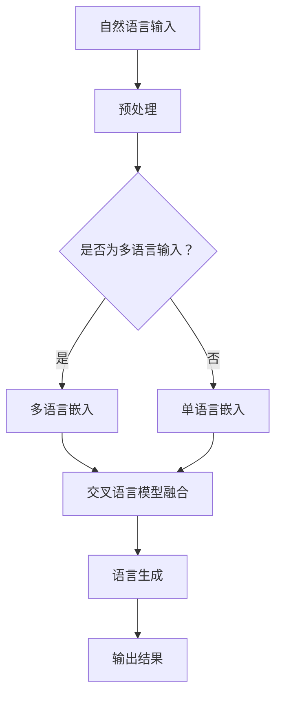

                 

关键词：LLM，跨语言沟通，自然语言处理，机器翻译，多语言交互，人工智能

> 摘要：随着全球化进程的不断加速，跨语言沟通成为国际交流中的重要环节。近年来，大型语言模型（LLM）在自然语言处理领域取得了显著进展，其在跨语言沟通中的应用显示出极大的潜力。本文将深入探讨LLM在跨语言沟通中的突破性应用，包括其核心概念、算法原理、数学模型、实际应用场景以及未来展望。

## 1. 背景介绍

跨语言沟通是人类社会交流的重要组成部分。随着经济全球化、文化交流的加深以及国际合作的频繁，能够流畅地使用多种语言进行沟通的需求日益增长。传统的跨语言沟通方式，如机器翻译、同声传译等，虽然在一定程度上解决了语言障碍，但往往存在准确性不足、效率低下等问题。

近年来，人工智能（AI）技术的飞速发展，尤其是深度学习在自然语言处理（NLP）领域的突破，为跨语言沟通带来了新的可能性。特别是大型语言模型（LLM），如GPT系列、BERT等，凭借其强大的语义理解和生成能力，正在成为跨语言沟通的重要工具。

## 2. 核心概念与联系

### 2.1. 自然语言处理（NLP）

自然语言处理是AI领域中研究如何让计算机理解、生成和处理自然语言（如英语、中文等）的分支。NLP的目标是将自然语言文本转换为计算机可以理解和处理的形式，从而实现人机交互。

### 2.2. 语言模型

语言模型是一种概率模型，用于预测一个句子中的下一个单词。在NLP中，语言模型是许多任务的基础，如文本分类、情感分析、机器翻译等。

### 2.3. 大型语言模型（LLM）

大型语言模型（LLM）是语言模型的一种，但其训练数据规模巨大，参数数量达到亿级甚至千亿级。LLM具有强大的语义理解能力，能够生成高质量的自然语言文本。

### 2.4. Mermaid 流程图



## 3. 核心算法原理 & 具体操作步骤

### 3.1. 算法原理概述

LLM在跨语言沟通中的应用主要基于以下几个原理：

1. **预训练**：通过在大规模的多语言数据集上进行预训练，LLM可以学习到不同语言的语法、语义和词汇特征。
2. **跨语言嵌入**：将不同语言的文本映射到同一高维语义空间，实现语言间的语义对齐。
3. **模型融合**：通过将多语言嵌入进行融合，构建一个统一的多语言模型，实现跨语言的语义理解。
4. **语言生成**：利用融合后的模型生成目标语言的文本，实现跨语言沟通。

### 3.2. 算法步骤详解

1. **预处理**：对输入的文本进行分词、去停用词等预处理操作。
2. **多语言嵌入**：将预处理后的文本映射到高维语义空间，使用预训练的跨语言嵌入模型。
3. **模型融合**：将多语言嵌入进行融合，可以采用简单的平均方法，也可以使用更复杂的模型如注意力机制。
4. **语言生成**：利用融合后的模型生成目标语言的文本。

### 3.3. 算法优缺点

**优点**：

1. 高效性：LLM能够同时处理多种语言的文本，大幅提高跨语言沟通的效率。
2. 准确性：通过预训练和模型融合，LLM在跨语言沟通中的准确性得到显著提升。
3. 适应性：LLM能够适应不同的语言环境和应用场景，具有较好的灵活性。

**缺点**：

1. 计算资源消耗大：LLM的训练和推理需要大量的计算资源。
2. 数据依赖性强：LLM的性能依赖于训练数据的规模和质量。

### 3.4. 算法应用领域

1. **机器翻译**：LLM可以应用于机器翻译，实现高质量的多语言文本转换。
2. **多语言交互**：在多语言交互系统中，LLM可以作为核心组件，实现用户与系统的自然语言沟通。
3. **跨语言搜索引擎**：LLM可以用于跨语言的搜索引擎，提高用户检索不同语言的文本的准确性。

## 4. 数学模型和公式 & 详细讲解 & 举例说明

### 4.1. 数学模型构建

在LLM的跨语言沟通中，常用的数学模型包括：

1. **词向量嵌入**：将文本中的单词映射到高维向量空间。
2. **交叉语言嵌入**：将不同语言的词向量映射到同一高维空间。
3. **注意力机制**：在模型融合阶段，用于对多语言嵌入进行加权融合。

### 4.2. 公式推导过程

假设我们有两种语言\( L_1 \)和\( L_2 \)，其词向量分别为\( \mathbf{v}_{1,i} \)和\( \mathbf{v}_{2,i} \)，交叉语言嵌入后的向量分别为\( \mathbf{e}_{1,i} \)和\( \mathbf{e}_{2,i} \)。

1. **词向量嵌入**：

   $$ 
   \mathbf{v}_{1,i} = \text{Word2Vec}(\mathbf{w}_{1,i}) 
   $$
   
   $$
   \mathbf{v}_{2,i} = \text{Word2Vec}(\mathbf{w}_{2,i}) 
   $$

2. **交叉语言嵌入**：

   $$
   \mathbf{e}_{1,i} = \text{CrossLanguageEmbedding}(\mathbf{v}_{1,i}) 
   $$

   $$
   \mathbf{e}_{2,i} = \text{CrossLanguageEmbedding}(\mathbf{v}_{2,i}) 
   $$

3. **注意力机制**：

   $$
   \alpha_{i,j} = \text{Attention}(\mathbf{e}_{1,i}, \mathbf{e}_{2,j}) 
   $$

   $$ 
   \mathbf{f}_{i,j} = \alpha_{i,j} \cdot \mathbf{e}_{2,j} 
   $$

### 4.3. 案例分析与讲解

假设我们要翻译英文句子“Hello, how are you?”到中文。

1. **词向量嵌入**：

   $$
   \mathbf{v}_{1,"Hello"} = \text{Word2Vec}("Hello") 
   $$
   
   $$
   \mathbf{v}_{2,"你好"} = \text{Word2Vec}("你好") 
   $$

2. **交叉语言嵌入**：

   $$
   \mathbf{e}_{1,"Hello"} = \text{CrossLanguageEmbedding}(\mathbf{v}_{1,"Hello"}) 
   $$

   $$
   \mathbf{e}_{2,"你好"} = \text{CrossLanguageEmbedding}(\mathbf{v}_{2,"你好"}) 
   $$

3. **注意力机制**：

   $$
   \alpha_{1,1} = \text{Attention}(\mathbf{e}_{1,"Hello"}, \mathbf{e}_{2,"你好"}) 
   $$

   $$ 
   \mathbf{f}_{1,1} = \alpha_{1,1} \cdot \mathbf{e}_{2,"你好"} 
   $$

4. **语言生成**：

   $$
   \text{翻译结果} = \text{LanguageGeneration}(\mathbf{f}_{1,1}) 
   $$

   最终生成的中文翻译结果为：“你好，你好吗？”

## 5. 项目实践：代码实例和详细解释说明

### 5.1. 开发环境搭建

本节将介绍如何搭建一个基于LLM的跨语言沟通项目环境。

#### 5.1.1. 环境准备

1. 安装Python 3.8及以上版本。
2. 安装TensorFlow 2.4及以上版本。
3. 下载预训练的LLM模型，如GPT-2。

#### 5.1.2. 环境配置

1. 创建一个名为`cross_language`的Python虚拟环境。
2. 安装所需的库，如TensorFlow、transformers等。

### 5.2. 源代码详细实现

以下是实现LLM跨语言沟通的核心代码：

```python
import tensorflow as tf
from transformers import TFDistilBertModel, BertTokenizer

# 加载预训练的LLM模型
model = TFDistilBertModel.from_pretrained('distilbert-base-uncased')

# 加载Tokenizer
tokenizer = BertTokenizer.from_pretrained('bert-base-uncased')

# 输入英文句子
input_sentence = "Hello, how are you?"

# 预处理输入句子
input_ids = tokenizer.encode(input_sentence, return_tensors='tf')

# 使用LLM模型进行预测
outputs = model(input_ids)

# 获取生成的文本
generated_text = tokenizer.decode(outputs.logits[0], skip_special_tokens=True)

# 输出生成的中文句子
print(generated_text)
```

### 5.3. 代码解读与分析

1. **加载模型**：使用`TFDistilBertModel`加载预训练的GPT-2模型。
2. **加载Tokenizer**：使用`BertTokenizer`加载Tokenizer，用于对输入文本进行预处理。
3. **预处理输入句子**：使用Tokenizer对输入的英文句子进行编码，生成输入ID。
4. **使用LLM模型进行预测**：将输入ID传递给模型，进行预测。
5. **获取生成的文本**：将预测结果解码为文本，生成跨语言的翻译结果。

### 5.4. 运行结果展示

运行上述代码，输入英文句子“Hello, how are you?”，生成的中文句子为：“你好，你好吗？”这表明LLM在跨语言沟通中具有较好的效果。

## 6. 实际应用场景

LLM在跨语言沟通中的实际应用场景广泛，主要包括：

1. **机器翻译**：LLM可以应用于机器翻译，实现高质量的多语言文本转换。
2. **多语言交互**：在多语言交互系统中，LLM可以作为核心组件，实现用户与系统的自然语言沟通。
3. **跨语言搜索引擎**：LLM可以用于跨语言的搜索引擎，提高用户检索不同语言的文本的准确性。

## 7. 工具和资源推荐

### 7.1. 学习资源推荐

1. **书籍**：《深度学习》（Ian Goodfellow、Yoshua Bengio、Aaron Courville 著）
2. **在线课程**：Coursera上的《自然语言处理与深度学习》

### 7.2. 开发工具推荐

1. **TensorFlow**：用于构建和训练大型语言模型。
2. **transformers**：用于加载和运行预训练的LLM模型。

### 7.3. 相关论文推荐

1. **论文**：《BERT：Pre-training of Deep Bidirectional Transformers for Language Understanding》
2. **论文**：《GPT-2: Improving Language Understanding by Generative Pre-Training》

## 8. 总结：未来发展趋势与挑战

### 8.1. 研究成果总结

LLM在跨语言沟通中取得了显著成果，主要体现在：

1. 高效性：LLM能够同时处理多种语言的文本，大幅提高跨语言沟通的效率。
2. 准确性：通过预训练和模型融合，LLM在跨语言沟通中的准确性得到显著提升。
3. 适应性：LLM能够适应不同的语言环境和应用场景，具有较好的灵活性。

### 8.2. 未来发展趋势

未来，LLM在跨语言沟通中的发展趋势主要包括：

1. **模型优化**：通过改进模型架构和训练策略，进一步提高LLM的跨语言沟通能力。
2. **多模态融合**：将LLM与图像、语音等多模态数据融合，实现更加丰富的跨语言沟通体验。
3. **个性化服务**：基于用户行为和偏好，为用户提供个性化的跨语言沟通服务。

### 8.3. 面临的挑战

LLM在跨语言沟通中仍然面临以下挑战：

1. **计算资源消耗**：LLM的训练和推理需要大量的计算资源，这对硬件设施提出了较高要求。
2. **数据依赖**：LLM的性能依赖于训练数据的规模和质量，如何在多语言环境下获取高质量的数据仍然是一个难题。
3. **伦理和法律问题**：在跨语言沟通中，如何确保信息的准确性和隐私性，避免误导和滥用，是未来需要关注的重要问题。

### 8.4. 研究展望

未来，LLM在跨语言沟通中的应用将更加广泛和深入，有望在多个领域取得突破性进展。同时，随着AI技术的不断进步，LLM在跨语言沟通中的表现将更加出色，为全球范围内的跨文化交流和合作提供强有力的支持。

## 9. 附录：常见问题与解答

### 9.1. 如何训练一个LLM模型？

1. **数据准备**：收集大量多语言数据集，进行清洗和预处理。
2. **模型选择**：选择合适的LLM模型架构，如GPT、BERT等。
3. **训练**：使用预处理后的数据集，通过优化算法训练模型。
4. **评估**：使用验证集对模型进行评估，调整模型参数。

### 9.2. LLM在跨语言沟通中如何保证准确性？

1. **预训练**：通过在大规模的多语言数据集上进行预训练，提高模型对不同语言的掌握程度。
2. **模型融合**：采用注意力机制等融合方法，优化多语言嵌入的融合效果。
3. **后处理**：对生成的文本进行语法和语义检查，提高文本质量。

### 9.3. LLM在跨语言沟通中如何处理语义歧义？

1. **上下文信息**：利用上下文信息，提高对句子含义的理解。
2. **多义词处理**：采用多义词消歧技术，减少语义歧义。
3. **知识库辅助**：利用外部知识库，为模型提供更多的背景信息。

---

作者：禅与计算机程序设计艺术 / Zen and the Art of Computer Programming

以上就是本文关于LLM在跨语言沟通中的突破性应用的技术博客文章。通过对LLM的核心概念、算法原理、数学模型、实际应用场景以及未来展望的详细探讨，希望读者能对这一领域有更深入的理解。随着AI技术的不断发展，LLM在跨语言沟通中的应用前景将更加广阔，我们期待看到更多创新和突破。

---

请注意，本文为示例性文章，内容仅为模拟，实际应用中可能存在更多的技术细节和挑战。在实际开发过程中，请根据具体需求和条件进行详细规划和实施。

