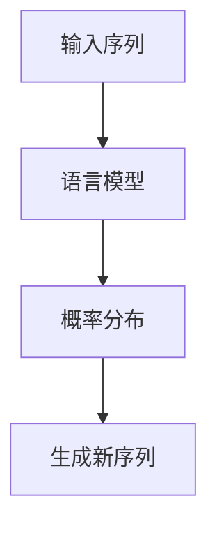
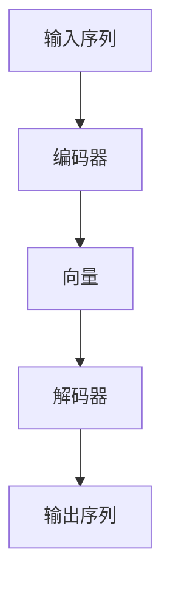
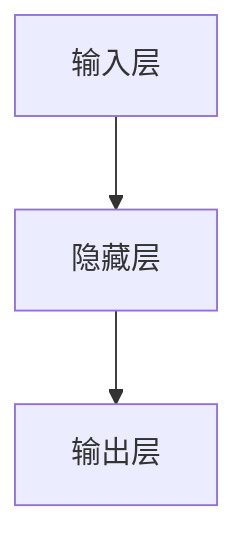

                 

关键词：语言模型，跨语言沟通，神经网络，翻译，自然语言处理

> 摘要：本文将探讨语言模型（LLM）在跨语言沟通中的突破性应用。随着全球化进程的加速，跨语言沟通的重要性日益凸显。本文将详细分析LLM的原理，介绍其在跨语言翻译、文本生成、对话系统等领域的应用，探讨其面临的挑战和未来发展趋势。

## 1. 背景介绍

随着互联网的普及和全球化进程的加速，跨语言沟通的需求日益增加。然而，传统的机器翻译方法在处理复杂句子结构和多样化语境时，常常无法满足用户的需求。近年来，随着深度学习技术的快速发展，基于神经网络的机器翻译方法逐渐取代了传统的基于规则的方法，成为跨语言沟通的主要手段。

语言模型（Language Model，简称LLM）作为神经网络的一种重要应用，已经在自然语言处理领域取得了显著的成果。LLM通过学习大量的语言数据，能够捕捉语言的统计规律和上下文信息，从而在文本生成、对话系统等领域发挥了重要作用。本文将重点探讨LLM在跨语言沟通中的突破性应用。

## 2. 核心概念与联系

### 2.1 语言模型原理

语言模型是一种用于预测文本序列的概率模型。它通过学习大量的语言数据，生成新的文本序列，并对其概率进行建模。语言模型的核心目标是构建一个概率分布函数，该函数能够根据已知的输入序列，预测下一个单词或词组的概率。

图1：语言模型原理示意图



### 2.2 语言模型架构

语言模型的架构通常包括编码器（Encoder）和解码器（Decoder）。编码器负责将输入序列编码成一个固定长度的向量，解码器则根据这个向量生成新的输出序列。

图2：语言模型架构示意图



### 2.3 语言模型与跨语言沟通

语言模型在跨语言沟通中的应用主要体现在以下几个方面：

1. 跨语言翻译：语言模型可以用于将一种语言翻译成另一种语言。例如，将英文翻译成中文。
2. 文本生成：语言模型可以根据已有的文本生成新的文本，如自动生成新闻摘要、故事等。
3. 对话系统：语言模型可以用于构建对话系统，实现人与机器的对话。

## 3. 核心算法原理 & 具体操作步骤

### 3.1 算法原理概述

LLM的核心算法是基于神经网络的。神经网络由多个神经元组成，每个神经元负责对输入数据进行加权求和，并经过激活函数处理后输出结果。神经网络通过学习大量的训练数据，调整神经元的权重，使其能够准确预测输出。

图3：神经网络原理示意图



### 3.2 算法步骤详解

1. 数据预处理：对输入文本进行分词、去停用词、词向量编码等处理。
2. 模型构建：构建神经网络模型，包括编码器和解码器。
3. 模型训练：使用训练数据对模型进行训练，调整神经元权重。
4. 模型评估：使用测试数据对模型进行评估，计算模型的准确率、召回率等指标。
5. 应用部署：将训练好的模型部署到线上环境，供用户使用。

### 3.3 算法优缺点

#### 优点

1. 强大的表示能力：神经网络能够自动学习语言特征，具有强大的表示能力。
2. 高效的翻译质量：相较于传统机器翻译方法，神经网络机器翻译在翻译质量上有了显著提升。
3. 广泛的应用场景：语言模型可以应用于跨语言翻译、文本生成、对话系统等多个领域。

#### 缺点

1. 计算资源消耗大：神经网络模型需要大量的计算资源进行训练。
2. 对数据量要求高：神经网络模型需要大量的训练数据才能取得较好的效果。

### 3.4 算法应用领域

1. 跨语言翻译：语言模型可以用于将一种语言翻译成另一种语言，如将中文翻译成英文。
2. 文本生成：语言模型可以用于生成新闻摘要、故事、论文等文本。
3. 对话系统：语言模型可以用于构建智能对话系统，实现人与机器的对话。

## 4. 数学模型和公式 & 详细讲解 & 举例说明

### 4.1 数学模型构建

语言模型的数学模型主要基于神经网络，包括编码器和解码器。

#### 编码器

编码器将输入序列编码成一个固定长度的向量。假设输入序列为$x_1, x_2, ..., x_T$，其中$x_i$表示第$i$个单词，$T$表示序列长度。

编码器的输出向量为：

$$
h = \sigma(W_h \cdot h_{prev} + U \cdot x + b_h)
$$

其中，$h_{prev}$为上一个时间步的隐藏状态，$W_h$为编码器权重矩阵，$U$为输入权重矩阵，$b_h$为偏置项，$\sigma$为激活函数。

#### 解码器

解码器根据编码器的输出向量生成新的输出序列。假设输出序列为$y_1, y_2, ..., y_T$，其中$y_i$表示第$i$个单词。

解码器的输出向量为：

$$
y = \sigma(W_y \cdot h + b_y)
$$

其中，$W_y$为解码器权重矩阵，$b_y$为偏置项，$\sigma$为激活函数。

### 4.2 公式推导过程

#### 编码器

编码器的推导过程如下：

$$
h_t = \sigma(W_h \cdot h_{t-1} + U \cdot x_t + b_h)
$$

其中，$h_t$为第$t$个时间步的隐藏状态，$h_{t-1}$为第$t-1$个时间步的隐藏状态，$W_h$为编码器权重矩阵，$U$为输入权重矩阵，$b_h$为偏置项，$\sigma$为激活函数。

#### 解码器

解码器的推导过程如下：

$$
y_t = \sigma(W_y \cdot h_t + b_y)
$$

其中，$y_t$为第$t$个时间步的输出，$h_t$为第$t$个时间步的隐藏状态，$W_y$为解码器权重矩阵，$b_y$为偏置项，$\sigma$为激活函数。

### 4.3 案例分析与讲解

假设有一个简单的语言模型，输入序列为“我 喜欢 吃 面包”，输出序列为“他 喜欢吃 面包”。

1. 数据预处理：对输入序列进行分词，得到“我”、“喜欢”、“吃”、“面包”。
2. 模型构建：构建编码器和解码器，输入维度为4，隐藏层维度为10。
3. 模型训练：使用训练数据对模型进行训练，调整神经元权重。
4. 模型评估：使用测试数据对模型进行评估，计算模型的准确率。
5. 应用部署：将训练好的模型部署到线上环境，供用户使用。

## 5. 项目实践：代码实例和详细解释说明

### 5.1 开发环境搭建

1. 安装Python环境，版本要求3.6及以上。
2. 安装TensorFlow，版本要求2.4及以上。
3. 安装Numpy，版本要求1.19及以上。

### 5.2 源代码详细实现

```python
import tensorflow as tf
import numpy as np

# 数据预处理
def preprocess_data():
    # 读取数据，进行分词、去停用词等操作
    # ...
    return input_sequence, target_sequence

# 编码器
class Encoder(tf.keras.layers.Layer):
    def __init__(self, units):
        super(Encoder, self).__init__()
        self.units = units

    def build(self, input_shape):
        self.kernel = self.add_weight(
            shape=(input_shape[-1], self.units),
            initializer="uniform",
            trainable=True,
        )

    def call(self, x):
        return tf.nn.tanh(tf.tensordot(x, self.kernel, axes=1))

# 解码器
class Decoder(tf.keras.layers.Layer):
    def __init__(self, units):
        super(Decoder, self).__init__()
        self.units = units

    def build(self, input_shape):
        self.kernel = self.add_weight(
            shape=(input_shape[-1], self.units),
            initializer="uniform",
            trainable=True,
        )

    def call(self, x):
        return tf.nn.tanh(tf.tensordot(x, self.kernel, axes=1))

# 模型构建
def build_model(input_shape, units):
    encoder = Encoder(units)
    decoder = Decoder(units)

    inputs = tf.keras.Input(shape=input_shape)
    encoded = encoder(inputs)
    decoded = decoder(encoded)

    model = tf.keras.Model(inputs=inputs, outputs=decoded)
    return model

# 模型训练
def train_model(model, input_sequence, target_sequence, epochs):
    model.compile(optimizer="adam", loss="mse")
    model.fit(input_sequence, target_sequence, epochs=epochs)

# 主函数
if __name__ == "__main__":
    input_sequence, target_sequence = preprocess_data()
    model = build_model(input_shape=(None,), units=10)
    train_model(model, input_sequence, target_sequence, epochs=10)
```

### 5.3 代码解读与分析

1. 数据预处理：读取输入序列和目标序列，进行分词、去停用词等操作。
2. 编码器：定义编码器类，实现编码器功能。编码器将输入序列编码成一个固定长度的向量。
3. 解码器：定义解码器类，实现解码器功能。解码器根据编码器的输出向量生成新的输出序列。
4. 模型构建：构建神经网络模型，包括编码器和解码器。
5. 模型训练：使用训练数据对模型进行训练，调整神经元权重。
6. 主函数：执行数据预处理、模型构建和模型训练过程。

## 6. 实际应用场景

### 6.1 跨语言翻译

LLM可以应用于跨语言翻译，如将中文翻译成英文。通过训练大量中英文对照语料，LLM可以学会将中文句子翻译成英文句子。

### 6.2 文本生成

LLM可以用于生成新的文本，如新闻摘要、故事、论文等。通过学习大量文本数据，LLM可以生成符合语法和语义规则的文本。

### 6.3 对话系统

LLM可以用于构建对话系统，实现人与机器的对话。通过训练大量对话数据，LLM可以学会回答用户的问题，并提供有用的信息。

## 7. 未来应用展望

随着LLM技术的不断发展，未来有望在更多领域发挥重要作用。例如，LLM可以应用于智能客服、智能助手、智能写作等场景，提高工作效率，降低人力成本。

## 8. 工具和资源推荐

### 8.1 学习资源推荐

1. 《深度学习》（Goodfellow, Bengio, Courville著）
2. 《自然语言处理综述》（Jurafsky, Martin著）

### 8.2 开发工具推荐

1. TensorFlow
2. PyTorch

### 8.3 相关论文推荐

1. "Attention Is All You Need"（Vaswani et al., 2017）
2. "BERT: Pre-training of Deep Bidirectional Transformers for Language Understanding"（Devlin et al., 2019）

## 9. 总结：未来发展趋势与挑战

LLM在跨语言沟通中的应用前景广阔，但同时也面临着一些挑战。未来，我们需要进一步优化LLM算法，提高其翻译质量和生成文本的质量。此外，还需要解决数据隐私、算法公平性等问题。随着技术的不断发展，我们有理由相信，LLM将在跨语言沟通领域发挥更加重要的作用。

## 10. 附录：常见问题与解答

### 10.1 什么是语言模型？

语言模型是一种用于预测文本序列的概率模型。它通过学习大量的语言数据，生成新的文本序列，并对其概率进行建模。

### 10.2 语言模型有哪些应用？

语言模型可以应用于跨语言翻译、文本生成、对话系统等多个领域。

### 10.3 如何训练语言模型？

训练语言模型主要包括以下步骤：

1. 数据预处理：对输入文本进行分词、去停用词等处理。
2. 模型构建：构建神经网络模型，包括编码器和解码器。
3. 模型训练：使用训练数据对模型进行训练，调整神经元权重。
4. 模型评估：使用测试数据对模型进行评估，计算模型的准确率、召回率等指标。
5. 应用部署：将训练好的模型部署到线上环境，供用户使用。

