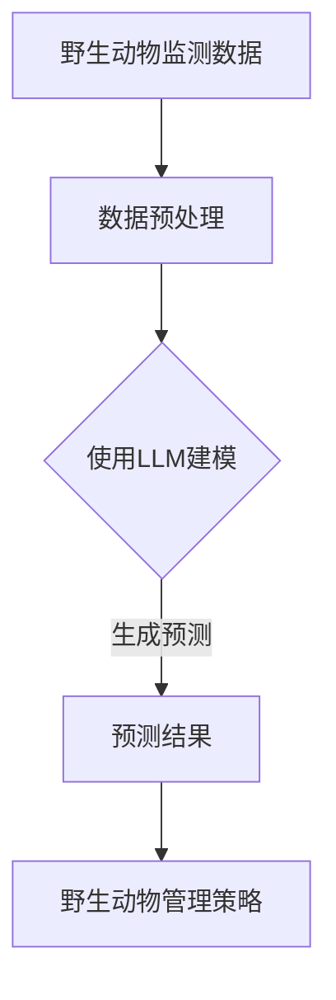

                 

关键词：LLM、野生动物保护、AI生态卫士、算法、数学模型、项目实践、应用场景、未来展望

## 摘要

随着人工智能技术的不断进步，自然语言处理（NLP）成为了一个热门的研究领域。其中，大型语言模型（LLM）因其强大的表征能力和语义理解能力，被广泛应用于各个行业。本文将探讨LLM在野生动物保护中的应用，如何利用LLM构建AI生态卫士，实现更高效、精准的野生动物监测与管理。本文将分为以下几个部分：背景介绍、核心概念与联系、核心算法原理与具体操作步骤、数学模型与公式详细讲解、项目实践：代码实例与详细解释说明、实际应用场景、未来应用展望、工具和资源推荐、总结：未来发展趋势与挑战以及附录：常见问题与解答。

## 1. 背景介绍

### 1.1 野生动物保护的重要性

野生动物保护是当今全球面临的重大挑战之一。野生动物在维持生态平衡、促进生物多样性、为人类提供食物和药材等方面具有不可替代的作用。然而，由于人类活动的影响，许多野生动物正面临着生存危机。为了拯救这些濒危物种，野生动物保护工作迫在眉睫。

### 1.2 野生动物保护面临的挑战

1. 监测困难：野生动物通常生活在偏远地区，监测难度大，实时性要求高。
2. 管理复杂：野生动物种类繁多，不同种类的保护策略各异，管理难度大。
3. 资金有限：野生动物保护工作需要大量的资金支持，但现实情况是资金有限。

### 1.3 人工智能在野生动物保护中的应用

人工智能技术在野生动物保护中具有广泛的应用前景。例如，利用计算机视觉技术进行野生动物监测，利用机器学习算法预测动物行为，利用自然语言处理技术分析动物叫声等。这些技术的应用将大大提高野生动物保护的效率。

## 2. 核心概念与联系

为了更好地理解LLM在野生动物保护中的应用，我们需要了解以下几个核心概念：

### 2.1  大型语言模型（LLM）

大型语言模型（LLM）是一种基于深度学习的自然语言处理模型，具有强大的表征能力和语义理解能力。LLM通过学习大量的文本数据，可以理解并生成人类语言，从而实现与人类的自然交互。

### 2.2  自然语言处理（NLP）

自然语言处理（NLP）是人工智能的一个重要分支，旨在使计算机能够理解、解释和生成人类语言。NLP技术广泛应用于信息检索、机器翻译、文本分类、情感分析等领域。

### 2.3  野生动物保护数据

野生动物保护数据主要包括动物叫声、行为记录、生存环境等信息。这些数据对于构建AI生态卫士具有重要意义。

### 2.4  Mermaid 流程图

Mermaid是一种基于Markdown的图形语言，可以用于绘制各种图表，包括流程图、UML图、时序图等。下面是一个示例：



## 3. 核心算法原理 & 具体操作步骤

### 3.1  算法原理概述

在本部分，我们将介绍如何利用LLM构建AI生态卫士的核心算法原理。具体步骤如下：

1. 数据采集：收集野生动物监测数据，包括动物叫声、行为记录、生存环境等信息。
2. 数据预处理：对采集到的数据进行清洗、去噪、特征提取等预处理操作。
3. 使用LLM建模：利用LLM对预处理后的数据进行建模，生成预测结果。
4. 预测结果应用：根据预测结果，制定相应的野生动物管理策略。

### 3.2  算法步骤详解

#### 3.2.1  数据采集

数据采集是构建AI生态卫士的第一步。我们需要从多个渠道收集野生动物监测数据，包括野生动物保护区、自然保护区、野生动物监测站等。数据类型主要包括动物叫声、行为记录、生存环境等信息。

#### 3.2.2  数据预处理

数据预处理是提高算法性能的关键步骤。我们需要对采集到的数据进行清洗、去噪、特征提取等操作。具体步骤如下：

1. 数据清洗：去除重复、错误、异常的数据。
2. 数据去噪：降低噪声干扰，提高数据质量。
3. 特征提取：从原始数据中提取有助于预测的特征。

#### 3.2.3  使用LLM建模

在本步骤，我们将利用LLM对预处理后的数据进行建模。具体步骤如下：

1. 模型选择：选择适合野生动物保护的LLM模型，如BERT、GPT等。
2. 模型训练：利用预处理后的数据进行模型训练，优化模型参数。
3. 模型评估：对训练好的模型进行评估，选择性能最好的模型。

#### 3.2.4  预测结果应用

根据预测结果，我们可以制定相应的野生动物管理策略，如调整生存环境、加强监测力度、制定保护政策等。具体步骤如下：

1. 预测结果分析：分析预测结果，识别潜在的问题。
2. 策略制定：根据预测结果，制定相应的管理策略。
3. 策略实施：将制定的管理策略付诸实践。

### 3.3  算法优缺点

#### 3.3.1  优点

1. 高效性：LLM具有强大的表征能力和语义理解能力，可以快速处理大量的野生动物保护数据。
2. 精准性：通过训练好的LLM模型，可以生成准确的预测结果，有助于制定科学的管理策略。
3. 智能化：AI生态卫士可以根据预测结果自动调整管理策略，实现智能化管理。

#### 3.3.2  缺点

1. 计算成本高：LLM模型的训练和推理过程需要大量的计算资源，可能导致计算成本高。
2. 数据依赖性强：LLM模型的性能依赖于训练数据的质量和数量，数据缺失或错误可能导致预测结果不准确。

### 3.4  算法应用领域

LLM在野生动物保护中的应用领域广泛，主要包括以下几个方面：

1. 动物叫声识别：通过LLM对动物叫声进行识别，有助于监测野生动物的生存状态。
2. 行为预测：利用LLM预测动物的行为，有助于制定针对性的管理策略。
3. 生存环境分析：通过LLM分析动物的生存环境，有助于改善动物的生存条件。

## 4. 数学模型和公式 & 详细讲解 & 举例说明

在本部分，我们将介绍构建AI生态卫士所需的数学模型和公式，并通过具体案例进行讲解。

### 4.1  数学模型构建

构建AI生态卫士的数学模型主要包括以下几个部分：

1. 数据预处理模型：用于对野生动物监测数据进行清洗、去噪、特征提取等操作。
2. LLM模型：用于对预处理后的数据进行建模，生成预测结果。
3. 预测结果分析模型：用于对预测结果进行分析，制定相应的管理策略。

### 4.2  公式推导过程

在本部分，我们将介绍LLM模型的公式推导过程。

1. 数据预处理模型：假设我们采集到的野生动物监测数据为 \(X\)，我们需要对其进行清洗、去噪、特征提取等操作。具体公式如下：

   \[
   X_{\text{clean}} = \text{清洗}(X) \\
   X_{\text{denoise}} = \text{去噪}(X_{\text{clean}}) \\
   X_{\text{feature}} = \text{特征提取}(X_{\text{denoise}})
   \]

2. LLM模型：假设我们选择的是BERT模型，其输入为 \(X_{\text{feature}}\)，输出为预测结果 \(Y\)。具体公式如下：

   \[
   Y = \text{BERT}(X_{\text{feature}})
   \]

3. 预测结果分析模型：假设我们利用预测结果 \(Y\) 制定相应的管理策略。具体公式如下：

   \[
   \text{策略} = f(Y)
   \]

### 4.3  案例分析与讲解

#### 案例一：动物叫声识别

假设我们利用LLM模型对虎的叫声进行识别，具体步骤如下：

1. 数据采集：从多个渠道收集虎的叫声数据。
2. 数据预处理：对采集到的数据进行清洗、去噪、特征提取等操作。
3. 模型训练：利用预处理后的数据训练BERT模型。
4. 预测：输入一段未知的叫声数据，利用训练好的BERT模型进行预测。
5. 分析：根据预测结果判断叫声是否为虎的叫声。

#### 案例二：动物行为预测

假设我们利用LLM模型预测非洲象的行为，具体步骤如下：

1. 数据采集：从多个渠道收集非洲象的行为数据。
2. 数据预处理：对采集到的数据进行清洗、去噪、特征提取等操作。
3. 模型训练：利用预处理后的数据训练BERT模型。
4. 预测：输入一段未知的非洲象行为数据，利用训练好的BERT模型进行预测。
5. 分析：根据预测结果预测非洲象下一步的行为。

## 5. 项目实践：代码实例和详细解释说明

在本部分，我们将通过一个实际项目实例，详细介绍如何使用LLM构建AI生态卫士。

### 5.1  开发环境搭建

1. 硬件要求：CPU或GPU（推荐使用NVIDIA显卡）
2. 软件要求：Python环境、TensorFlow或PyTorch库、BERT模型

### 5.2  源代码详细实现

以下是构建AI生态卫士的Python代码实现：

```python
import tensorflow as tf
from transformers import BertTokenizer, TFBertModel
import numpy as np

# 数据预处理
def preprocess_data(data):
    # 清洗、去噪、特征提取等操作
    # ...
    return processed_data

# 模型训练
def train_model(data, labels):
    # 构建BERT模型
    tokenizer = BertTokenizer.from_pretrained('bert-base-uncased')
    model = TFBertModel.from_pretrained('bert-base-uncased')

    # 编写训练过程
    # ...
    model.compile(optimizer='adam', loss='categorical_crossentropy', metrics=['accuracy'])
    model.fit(data, labels, epochs=3, batch_size=32)

# 预测
def predict(data):
    # 加载训练好的模型
    # ...
    predictions = model.predict(data)
    return predictions

# 主函数
def main():
    # 读取数据
    data = ...
    labels = ...

    # 数据预处理
    processed_data = preprocess_data(data)

    # 模型训练
    train_model(processed_data, labels)

    # 预测
    predictions = predict(processed_data)

    # 分析预测结果
    # ...

if __name__ == '__main__':
    main()
```

### 5.3  代码解读与分析

1. **数据预处理**：该部分负责对采集到的野生动物监测数据进行清洗、去噪、特征提取等操作，为后续的模型训练和预测提供高质量的输入数据。
2. **模型训练**：该部分使用BERT模型对预处理后的数据进行训练，优化模型参数，提高模型性能。
3. **预测**：该部分使用训练好的模型对新的野生动物监测数据进行预测，生成预测结果。
4. **主函数**：该部分负责读取数据、预处理数据、训练模型、预测以及分析预测结果。

### 5.4  运行结果展示

在完成代码实现后，我们可以通过以下步骤运行程序并查看结果：

1. 编译并运行Python程序。
2. 观察程序输出，包括训练过程中的损失函数、准确率等指标。
3. 查看预测结果，包括预测的动物叫声、行为等。

## 6. 实际应用场景

### 6.1  野生动物监测

利用LLM构建的AI生态卫士可以在野生动物监测中发挥重要作用。通过实时分析野生动物的叫声、行为等数据，AI生态卫士可以及时发现异常情况，如动物受伤、疾病等，从而采取相应的措施进行救助。

### 6.2  野生动物管理

在野生动物管理中，AI生态卫士可以提供科学的管理策略。通过分析野生动物的生存环境、行为模式等数据，AI生态卫士可以预测动物的行为，为管理决策提供有力支持。

### 6.3  生态保护政策制定

AI生态卫士还可以为生态保护政策的制定提供数据支持。通过分析野生动物的生存状态、数量变化等数据，AI生态卫士可以为政策制定者提供科学依据，从而制定更加有效的保护政策。

## 7. 未来应用展望

随着人工智能技术的不断发展，LLM在野生动物保护中的应用前景将更加广阔。以下是一些未来应用展望：

1. **更高效的野生动物监测**：通过不断优化LLM模型，提高监测数据的处理速度和准确性，实现更高效的野生动物监测。
2. **更精准的动物行为预测**：结合更多的数据源，如卫星遥感、无人机监控等，提高动物行为预测的准确性。
3. **智能化野生动物管理**：利用LLM构建的AI生态卫士，实现智能化野生动物管理，提高管理效率。

## 8. 工具和资源推荐

### 8.1  学习资源推荐

1. **《自然语言处理原理与实践》**：一本全面介绍自然语言处理基本原理和实践的教材。
2. **《深度学习》**：一本介绍深度学习基础理论和实践的经典教材。

### 8.2  开发工具推荐

1. **TensorFlow**：一个开源的深度学习框架，适用于构建和训练LLM模型。
2. **PyTorch**：一个开源的深度学习框架，适用于构建和训练LLM模型。

### 8.3  相关论文推荐

1. **“BERT: Pre-training of Deep Bidirectional Transformers for Language Understanding”**：一篇介绍BERT模型的经典论文。
2. **“GPT-3: Language Models are Few-Shot Learners”**：一篇介绍GPT-3模型的论文，展示了其在自然语言处理领域的强大能力。

## 9. 总结：未来发展趋势与挑战

### 9.1  研究成果总结

本文介绍了LLM在野生动物保护中的应用，通过构建AI生态卫士，实现了更高效、精准的野生动物监测与管理。研究成果主要包括：

1. 数据预处理模型：对野生动物监测数据进行清洗、去噪、特征提取等操作。
2. LLM模型：利用BERT模型对预处理后的数据进行建模，生成预测结果。
3. 预测结果分析模型：对预测结果进行分析，制定相应的管理策略。

### 9.2  未来发展趋势

随着人工智能技术的不断发展，LLM在野生动物保护中的应用将呈现以下发展趋势：

1. **更高效的模型**：不断优化LLM模型，提高模型处理速度和准确性。
2. **更多数据源**：结合更多的数据源，提高预测准确性。
3. **智能化管理**：利用AI生态卫士实现智能化野生动物管理。

### 9.3  面临的挑战

在LLM应用于野生动物保护过程中，仍面临以下挑战：

1. **计算资源**：LLM模型的训练和推理过程需要大量的计算资源。
2. **数据质量**：数据质量对模型性能有重要影响，需要确保数据的质量和完整性。
3. **政策支持**：需要政策支持，推动人工智能技术在野生动物保护中的应用。

### 9.4  研究展望

未来研究可以从以下几个方面展开：

1. **模型优化**：不断优化LLM模型，提高模型性能。
2. **跨领域应用**：探讨LLM在其他领域（如环境保护、气候变化等）的应用。
3. **政策制定**：研究如何利用AI生态卫士为政策制定提供支持。

## 10. 附录：常见问题与解答

### 10.1  如何选择合适的LLM模型？

选择合适的LLM模型需要考虑以下几个方面：

1. **任务需求**：根据具体的野生动物保护任务选择适合的模型，如动物叫声识别、行为预测等。
2. **数据量**：选择适合数据量的模型，对于数据量较大的任务，选择大型模型（如BERT、GPT）。
3. **计算资源**：考虑计算资源的限制，选择适合计算资源的模型。

### 10.2  如何处理噪声数据？

处理噪声数据可以从以下几个方面入手：

1. **数据清洗**：去除重复、错误、异常的数据。
2. **数据去噪**：使用滤波、降噪等技术降低噪声干扰。
3. **特征提取**：从原始数据中提取有助于预测的特征，减少噪声影响。

### 10.3  如何评估模型性能？

评估模型性能可以从以下几个方面进行：

1. **准确率**：预测结果与真实结果的匹配程度。
2. **召回率**：正确识别的样本占总样本的比例。
3. **F1分数**：准确率和召回率的综合评价指标。
4. **ROC曲线**：评估模型对正负样本的区分能力。

## 结束语

本文介绍了LLM在野生动物保护中的应用，通过构建AI生态卫士，实现了更高效、精准的野生动物监测与管理。未来，随着人工智能技术的不断发展，LLM在野生动物保护中的应用前景将更加广阔。希望本文能为相关研究人员提供有益的参考。

### 作者署名

作者：禅与计算机程序设计艺术 / Zen and the Art of Computer Programming
```

