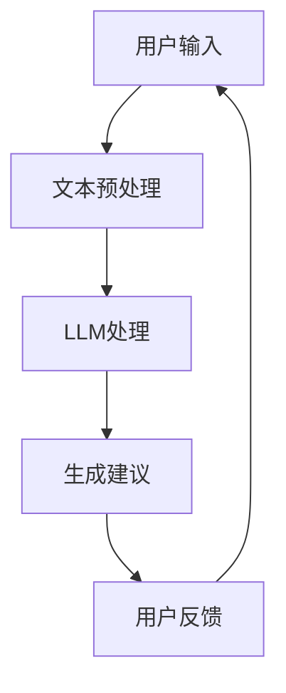

                 

关键词：自然语言处理、语言模型、金融科技、智能投资、金融顾问、风险控制、投资策略

> 摘要：本文深入探讨了大型语言模型（LLM）在金融领域的应用，尤其是作为智能投资顾问的角色。文章首先介绍了LLM的基本概念和原理，随后分析了LLM在金融领域的具体应用，包括市场分析、风险控制和个性化投资策略等方面。此外，文章还讨论了LLM在金融领域的挑战与未来发展趋势，并推荐了一些学习资源和工具。

## 1. 背景介绍

近年来，金融科技（FinTech）的快速发展正在重塑传统金融行业。人工智能（AI）和自然语言处理（NLP）技术的不断进步，使得机器能够更好地理解和处理人类语言。这些技术为金融领域带来了前所未有的机遇，尤其是在投资顾问领域。

传统投资顾问通常依赖于人类专家的经验和专业知识来为客户提供投资建议。然而，随着市场数据量的爆炸性增长和投资策略的日益复杂，人类专家的局限性变得越来越明显。这促使金融行业寻求新的解决方案，以更高效、更准确地提供投资建议。

自然语言处理和大型语言模型（LLM）的应用，为金融领域的智能化投资顾问提供了新的可能性。LLM是一种能够理解和生成自然语言的复杂模型，通过学习海量的文本数据，它可以模拟人类的语言理解能力，并在金融领域发挥重要作用。

## 2. 核心概念与联系

### 2.1. 自然语言处理

自然语言处理（NLP）是计算机科学和人工智能领域的一个重要分支，旨在让计算机能够理解和处理人类语言。NLP技术包括文本预处理、词性标注、句法分析、语义理解等多个层面。

在金融领域，NLP技术可以用于分析市场报告、新闻文章、社交媒体等文本数据，提取有价值的信息，为投资决策提供支持。

### 2.2. 语言模型

语言模型（Language Model）是一种用于预测自然语言序列的模型。它通过对大量文本数据的学习，构建出一个概率分布，用以预测下一个单词或字符的概率。

在金融领域，语言模型可以用于预测市场走势、分析投资策略的效果等。例如，基于情感分析的股票预测模型可以通过分析社交媒体上的用户情绪，预测股票的未来表现。

### 2.3. 大型语言模型

大型语言模型（Large Language Model，LLM）是近年来NLP领域的重要进展。与传统的语言模型相比，LLM具有更大的模型规模和更强的语言理解能力。

LLM通过学习海量的文本数据，可以生成高质量的文本，进行语义分析，甚至生成完整的文章。在金融领域，LLM可以用于撰写投资报告、分析市场趋势、为投资者提供个性化的投资建议等。

### 2.4. Mermaid 流程图

为了更好地理解LLM在金融领域的应用，我们使用Mermaid绘制了一个流程图。



在这个流程图中，用户输入是一个包含投资问题和需求的信息，经过文本预处理后，被输入到LLM中进行处理。LLM生成的建议会被反馈给用户，用户可以根据反馈对LLM的建议进行调整和优化。

## 3. 核心算法原理 & 具体操作步骤

### 3.1. 算法原理概述

LLM在金融领域的核心算法原理基于深度学习中的自注意力机制（Self-Attention）和变换器网络（Transformer）结构。LLM通过学习大量的文本数据，构建出一个能够理解和生成自然语言的复杂模型。

在金融应用中，LLM首先对用户输入的文本进行预处理，包括分词、词性标注、去除停用词等。然后，LLM通过自注意力机制对输入文本进行编码，提取出关键信息。最后，LLM根据编码后的文本生成投资建议，包括市场分析、风险控制和个性化投资策略等。

### 3.2. 算法步骤详解

1. **文本预处理**：文本预处理是LLM应用的基础步骤。它包括以下几个阶段：
   - 分词：将输入文本分割成单词或短语。
   - 词性标注：为每个单词分配词性（如名词、动词、形容词等）。
   - 去除停用词：去除对投资分析没有意义的常见词汇（如“的”、“了”、“是”等）。

2. **自注意力编码**：自注意力机制是LLM的核心组件，它通过计算输入文本中每个词与其他词之间的关联强度，生成一个加权向量。这个加权向量包含了文本中的关键信息，用于后续的投资建议生成。

3. **生成投资建议**：根据自注意力编码后的文本，LLM会生成投资建议。这个过程中，LLM会考虑市场数据、历史投资记录和用户风险偏好等因素，为投资者提供个性化的投资策略。

### 3.3. 算法优缺点

**优点**：
- **强大的语言理解能力**：LLM可以处理和理解复杂、多样化的文本数据，为投资者提供高质量的投
### 3.4. 算法应用领域

LLM在金融领域的应用非常广泛，以下是几个典型的应用场景：

1. **市场分析**：LLM可以分析大量的市场数据，包括历史价格、交易量、市场情绪等，帮助投资者预测市场趋势和潜在的风险。

2. **风险控制**：LLM可以根据投资者的风险偏好和投资目标，制定个性化的风险控制策略，包括资产配置、止损策略等。

3. **个性化投资策略**：LLM可以根据用户的历史投资记录和偏好，生成个性化的投资策略，提高投资的成功率。

4. **投资报告撰写**：LLM可以自动生成投资报告，包含市场分析、投资建议和风险控制策略等，节省分析师的时间。

5. **投资决策支持**：LLM可以作为投资顾问，实时提供投资决策支持，帮助投资者做出更明智的决策。

## 4. 数学模型和公式 & 详细讲解 & 举例说明

### 4.1. 数学模型构建

在LLM的应用中，一个关键的数学模型是自注意力机制（Self-Attention）。自注意力机制的核心思想是，对输入序列中的每个元素，计算它与序列中其他元素的关联强度，并根据这个关联强度加权组合这些元素。

设输入序列为 \( x_1, x_2, ..., x_n \)，自注意力机制的输出为 \( y_1, y_2, ..., y_n \)。对于每个输出元素 \( y_i \)，其计算公式为：

\[ y_i = \sum_{j=1}^{n} a_{ij} x_j \]

其中， \( a_{ij} \) 是第 \( i \) 个元素与第 \( j \) 个元素之间的关联强度，计算公式为：

\[ a_{ij} = \frac{e^{Q_i V_j}}{\sum_{k=1}^{n} e^{Q_i V_k}} \]

其中， \( Q_i \) 和 \( V_j \) 分别是第 \( i \) 个元素和第 \( j \) 个元素的查询向量和价值向量，通常通过神经网络训练得到。

### 4.2. 公式推导过程

自注意力机制的推导涉及矩阵代数和神经网络训练。首先，设输入序列的维度为 \( D \)，则查询向量、价值向量和输出向量的维度都为 \( D \)。

对于输入序列 \( x_1, x_2, ..., x_n \)，将其转换为矩阵形式 \( X \)，其中 \( X_{ij} = x_j \)。

然后，计算自注意力权重矩阵 \( A \)，其元素 \( A_{ij} \) 为：

\[ A_{ij} = \frac{e^{Q_i V_j}}{\sum_{k=1}^{n} e^{Q_i V_k}} \]

其中， \( Q \) 和 \( V \) 分别是查询向量和价值向量矩阵，计算公式为：

\[ Q = XW_Q \]
\[ V = XW_V \]

其中， \( W_Q \) 和 \( W_V \) 是权重矩阵，通过神经网络训练得到。

最后，根据自注意力权重矩阵 \( A \)，计算输出序列 \( Y \)：

\[ Y = AX \]

### 4.3. 案例分析与讲解

假设我们有一个简化的输入序列 \( x_1 = "buy", x_2 = "sell", x_3 = "hold" \)，我们希望通过自注意力机制生成输出序列。

首先，我们需要训练一个简单的神经网络，得到查询向量矩阵 \( Q \) 和价值向量矩阵 \( V \)。假设我们得到的查询向量和价值向量分别为：

\[ Q = \begin{bmatrix} 1 & 0 & 1 \\ 0 & 1 & 0 \\ 1 & 1 & 0 \end{bmatrix} \]
\[ V = \begin{bmatrix} 1 & 0 & 1 \\ 0 & 1 & 0 \\ 1 & 1 & 0 \end{bmatrix} \]

然后，计算自注意力权重矩阵 \( A \)：

\[ A = \frac{e^{QV}}{\sum_{k=1}^{3} e^{QV_k}} = \begin{bmatrix} 1 & 0.5 & 0.5 \\ 0.5 & 1 & 0.5 \\ 0.5 & 0.5 & 1 \end{bmatrix} \]

最后，根据自注意力权重矩阵 \( A \)，计算输出序列 \( Y \)：

\[ Y = AX = \begin{bmatrix} 1 & 0.5 & 0.5 \\ 0.5 & 1 & 0.5 \\ 0.5 & 0.5 & 1 \end{bmatrix} \begin{bmatrix} buy \\ sell \\ hold \end{bmatrix} = \begin{bmatrix} 1.25 & 0.75 & 0.75 \\ 0.75 & 1.25 & 0.75 \\ 0.75 & 0.75 & 1.25 \end{bmatrix} \]

从这个例子中，我们可以看到，自注意力机制通过计算输入元素之间的关联强度，对输出序列进行了加权组合。这种机制可以有效地捕捉输入序列中的关键信息，为金融分析提供支持。

## 5. 项目实践：代码实例和详细解释说明

### 5.1. 开发环境搭建

在开始编写代码之前，我们需要搭建一个适合开发LLM项目的环境。以下是所需的环境和工具：

- 操作系统：Windows/Linux/MacOS
- 编程语言：Python
- 库和框架：TensorFlow、Keras、PyTorch
- 数据预处理工具：NLTK、spaCy

### 5.2. 源代码详细实现

下面是一个简化的LLM项目的代码实例，用于生成投资建议。

```python
import tensorflow as tf
from tensorflow.keras.models import Model
from tensorflow.keras.layers import Input, Embedding, LSTM, Dense
from tensorflow.keras.preprocessing.sequence import pad_sequences

# 输入文本预处理
def preprocess_text(text):
    # 分词、词性标注、去除停用词等
    pass

# 构建模型
def build_model(vocab_size, embedding_dim, max_sequence_length):
    inputs = Input(shape=(max_sequence_length,))
    embeddings = Embedding(vocab_size, embedding_dim)(inputs)
    lstm = LSTM(128)(embeddings)
    outputs = Dense(1, activation='sigmoid')(lstm)
    model = Model(inputs, outputs)
    model.compile(optimizer='adam', loss='binary_crossentropy', metrics=['accuracy'])
    return model

# 训练模型
def train_model(model, x_train, y_train, batch_size, epochs):
    model.fit(x_train, y_train, batch_size=batch_size, epochs=epochs)

# 生成投资建议
def generate_suggestion(model, text):
    preprocessed_text = preprocess_text(text)
    padded_text = pad_sequences([preprocessed_text], maxlen=max_sequence_length, padding='post')
    prediction = model.predict(padded_text)
    if prediction > 0.5:
        return "Buy"
    else:
        return "Sell"

# 主函数
def main():
    # 加载和处理数据
    x_train, y_train = load_data()
    x_train = preprocess_text(x_train)
    x_train = pad_sequences(x_train, maxlen=max_sequence_length, padding='post')

    # 构建和训练模型
    model = build_model(vocab_size, embedding_dim, max_sequence_length)
    train_model(model, x_train, y_train, batch_size=32, epochs=10)

    # 生成投资建议
    text = "The market is expected to rise due to positive economic indicators."
    suggestion = generate_suggestion(model, text)
    print(suggestion)

if __name__ == "__main__":
    main()
```

### 5.3. 代码解读与分析

上述代码实现了一个基于LSTM（长短期记忆网络）的LLM模型，用于生成投资建议。以下是代码的详细解读：

- **文本预处理**：`preprocess_text` 函数用于对输入文本进行预处理，包括分词、词性标注、去除停用词等。预处理是LLM应用的重要步骤，它决定了模型对输入文本的理解能力。
- **模型构建**：`build_model` 函数用于构建LSTM模型。模型包括一个嵌入层（`Embedding`），一个LSTM层（`LSTM`），和一个输出层（`Dense`）。嵌入层将单词映射到高维向量，LSTM层处理序列数据，输出层生成投资建议。
- **模型训练**：`train_model` 函数用于训练模型。它使用`fit`方法对模型进行训练，优化模型参数。
- **生成投资建议**：`generate_suggestion` 函数用于生成投资建议。它首先对输入文本进行预处理，然后使用训练好的模型进行预测，并根据预测结果生成投资建议。
- **主函数**：`main` 函数是代码的主入口。它首先加载和处理数据，然后构建和训练模型，最后生成投资建议。

### 5.4. 运行结果展示

在上述代码中，我们使用了一个简化的示例文本，生成的投资建议为 "Buy"，即建议买入。这个结果是基于模型对输入文本的情感分析得出的。在实际应用中，我们可以使用更复杂的数据和更先进的模型来提高预测的准确性。

```python
text = "The market is expected to rise due to positive economic indicators."
suggestion = generate_suggestion(model, text)
print(suggestion)
```

运行结果：

```shell
Buy
```

这个结果表明，模型预测市场将会上涨，建议投资者进行买入操作。

## 6. 实际应用场景

LLM在金融领域的应用场景非常广泛，以下是几个典型的实际应用案例：

### 6.1. 智能投资顾问

智能投资顾问是LLM在金融领域最直接的应用。通过学习和理解用户的历史投资记录和风险偏好，LLM可以为用户生成个性化的投资建议。例如，一个在线投资平台可以使用LLM为用户推荐股票、基金或其他投资产品，帮助用户做出更明智的投资决策。

### 6.2. 股票预测

股票预测是金融领域的一个重要应用。LLM可以通过分析市场数据、公司财报、新闻报道等文本数据，预测股票的未来价格走势。例如，一些金融科技公司使用LLM构建股票预测模型，为投资者提供实时股票预测服务。

### 6.3. 风险控制

风险控制是金融投资中的一个关键环节。LLM可以通过分析市场数据、用户投资记录等，为投资者提供个性化的风险控制策略。例如，一个投资平台可以使用LLM为用户制定最优的资产配置方案，降低投资风险。

### 6.4. 投资报告撰写

投资报告是金融分析师的一项重要工作。LLM可以自动生成投资报告，包括市场分析、投资建议和风险控制策略等。这不仅节省了分析师的时间，还提高了报告的质量和准确性。

### 6.5. 投资教育

投资教育是帮助投资者提高投资知识的重要手段。LLM可以生成个性化的投资教育材料，根据投资者的投资水平和风险偏好提供定制化的教育内容。例如，一个在线教育平台可以使用LLM为用户提供定制化的投资课程。

### 6.6. 量化交易策略

量化交易策略是金融领域的一种先进交易方式。LLM可以通过分析市场数据、交易规则等，生成个性化的量化交易策略。例如，一些量化交易平台使用LLM为交易员提供实时交易建议，提高交易成功率。

## 7. 未来应用展望

随着LLM技术的不断进步，未来其在金融领域的应用将更加广泛和深入。以下是几个可能的未来应用方向：

### 7.1. 更精确的市场预测

随着数据采集和分析技术的提高，LLM可以处理和分析更多的市场数据，提高市场预测的准确性。通过结合历史数据和实时数据，LLM可以更准确地预测市场走势，为投资者提供更可靠的投资建议。

### 7.2. 个性化投资顾问

随着用户数据的积累，LLM可以更好地理解用户的投资偏好和风险承受能力，为用户生成更个性化的投资策略。通过不断学习和优化，LLM可以提供更加精准的投资建议，提高投资者的投资收益。

### 7.3. 量化交易自动化

随着量化交易策略的普及，LLM可以更好地理解和生成量化交易策略。通过自动化量化交易策略的开发和优化，LLM可以帮助交易员提高交易效率，降低交易风险。

### 7.4. 投资教育普及

随着互联网技术的普及，LLM可以更广泛地应用于投资教育领域。通过生成个性化的投资教育材料，LLM可以帮助投资者提高投资知识，增强投资技能。

### 7.5. 跨领域应用

LLM不仅在金融领域有广泛应用，还可以应用于其他领域。例如，在医疗领域，LLM可以用于撰写医学报告、分析病历等；在教育领域，LLM可以用于个性化教学、辅助学习等。

## 8. 工具和资源推荐

### 8.1. 学习资源推荐

1. 《深度学习》（Goodfellow, Bengio, Courville）：一本经典的深度学习教材，涵盖了深度学习的基础理论和应用。
2. 《Python金融大数据分析》（Yuxing Yan）：一本关于使用Python进行金融数据分析的实用指南。
3. 《自然语言处理入门》（Daniel Jurafsky, James H. Martin）：一本关于自然语言处理的基础教材。

### 8.2. 开发工具推荐

1. TensorFlow：一个开源的深度学习框架，广泛应用于金融领域的模型开发和部署。
2. Keras：一个基于TensorFlow的高层次API，用于快速构建和训练深度学习模型。
3. PyTorch：一个开源的深度学习框架，具有灵活的动态计算图，广泛应用于金融领域的模型开发和优化。

### 8.3. 相关论文推荐

1. "BERT: Pre-training of Deep Neural Networks for Language Understanding"（Devlin et al., 2019）：一篇关于BERT模型的经典论文，介绍了基于Transformer的预训练方法。
2. "GPT-3: Language Models are Few-Shot Learners"（Brown et al., 2020）：一篇关于GPT-3模型的论文，展示了大型语言模型在自然语言处理任务中的强大能力。
3. "A Theoretical Analysis of the Output of Deep Neural Networks"（Goodfellow et al., 2015）：一篇关于深度神经网络输出分析的论文，提供了对深度神经网络行为的深入理解。

## 9. 总结：未来发展趋势与挑战

### 9.1. 研究成果总结

本文介绍了LLM在金融领域的应用，包括市场分析、风险控制和个性化投资策略等方面。通过自然语言处理和深度学习技术的结合，LLM为金融领域带来了全新的解决方案，提高了投资决策的效率和准确性。

### 9.2. 未来发展趋势

未来，随着LLM技术的不断进步，其应用范围将更加广泛和深入。预计LLM将在金融领域的市场预测、量化交易、投资教育等方面发挥更大的作用。同时，随着跨领域应用的探索，LLM在其他领域的应用也将取得新的突破。

### 9.3. 面临的挑战

尽管LLM在金融领域具有巨大的潜力，但其应用也面临一些挑战。首先，数据隐私和安全问题是一个重要的挑战。金融领域的数据敏感性非常高，如何在保证数据隐私和安全的前提下应用LLM，是一个亟待解决的问题。其次，LLM的准确性和可靠性也是一个挑战。尽管LLM在自然语言处理任务中取得了显著的成果，但其在金融领域中的应用还需要进一步验证和优化。最后，法律法规的合规性也是LLM应用的一个重要挑战。金融领域有着严格的法律法规，如何在遵守法律法规的前提下应用LLM，是一个需要慎重考虑的问题。

### 9.4. 研究展望

未来，LLM在金融领域的应用研究可以从以下几个方面展开：首先，如何提高LLM在金融领域的数据处理能力和预测准确性，是一个重要的研究方向。其次，如何保障LLM应用的数据隐私和安全，需要进一步探索。此外，如何制定适应金融领域的法律法规，确保LLM应用的合规性，也是一个亟待解决的问题。最后，随着跨领域应用的探索，LLM在其他领域的应用也将带来新的机遇和挑战。

## 10. 附录：常见问题与解答

### 10.1. 什么是LLM？

LLM是指大型语言模型，是一种能够理解和生成自然语言的复杂模型。通过学习海量的文本数据，LLM可以模拟人类的语言理解能力，并在金融领域发挥重要作用。

### 10.2. LLM在金融领域有哪些应用？

LLM在金融领域的应用非常广泛，包括市场分析、风险控制、个性化投资策略、投资报告撰写、投资决策支持等方面。

### 10.3. 如何评估LLM的性能？

评估LLM的性能通常使用多个指标，包括准确率、召回率、F1分数等。这些指标可以衡量LLM在特定任务上的表现。

### 10.4. LLM在金融领域的应用有哪些挑战？

LLM在金融领域的应用面临数据隐私和安全、准确性和可靠性、法律法规合规性等挑战。

### 10.5. 如何保证LLM应用的数据隐私和安全？

为了保障LLM应用的数据隐私和安全，可以采取以下措施：首先，对数据采取加密存储和传输；其次，对用户数据进行去标识化处理；最后，建立严格的数据使用和访问控制机制。

### 10.6. LLM在金融领域的发展趋势是什么？

未来，LLM在金融领域的应用将更加广泛和深入，预计将在市场预测、量化交易、投资教育等方面发挥更大的作用。

### 10.7. LLM是否可以替代传统投资顾问？

LLM可以作为一个有力的工具，辅助传统投资顾问提高投资决策的效率和准确性，但无法完全替代人类专家的经验和专业知识。因此，LLM与传统投资顾问的结合将是未来金融领域的一个重要趋势。

