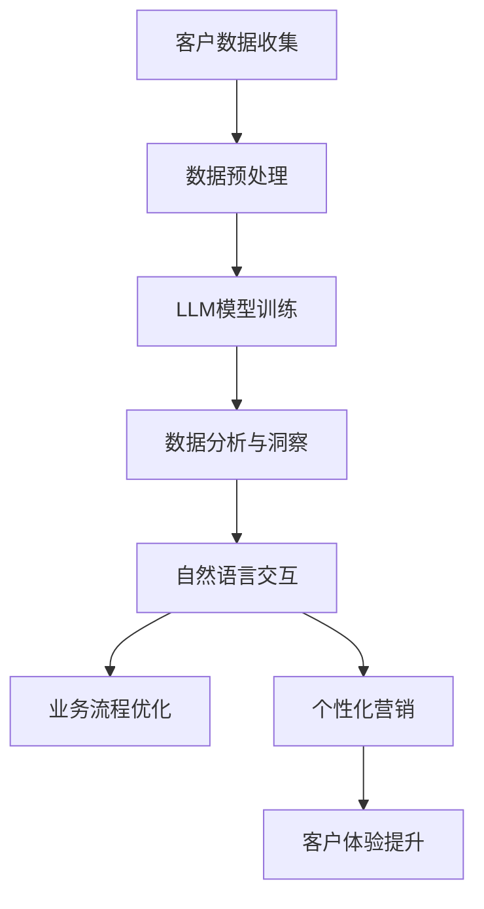

                 

关键词：LLM，客户关系管理，CRM，人工智能，自然语言处理，深度学习，数据挖掘，数据分析，业务流程优化，客户体验，个性化服务

## 摘要

本文探讨了大型语言模型（LLM）在传统客户关系管理（CRM）领域的应用与革新。通过深入分析LLM的核心算法原理、数学模型及其实际应用场景，我们揭示了LLM在提升客户体验、优化业务流程、实现个性化服务等方面的巨大潜力。文章最后对未来LLM在CRM领域的发展趋势和挑战进行了展望，为相关领域的实践者和研究者提供了有价值的参考。

## 1. 背景介绍

### 1.1 客户关系管理的定义与重要性

客户关系管理（CRM）是一种商业策略，旨在通过改善与客户的关系来提高客户满意度和忠诚度，从而实现业务增长。CRM涵盖了从客户获取、维护到销售的整个生命周期管理，其核心目标是通过提供个性化服务和优质体验来建立长期的客户关系。

CRM的重要性在于：

1. **提升客户满意度**：通过深入了解客户需求和偏好，CRM系统能够提供更加个性化的服务，从而提升客户满意度。
2. **增加客户忠诚度**：良好的客户关系有助于培养客户的忠诚度，减少客户流失率，从而提高客户生命周期价值。
3. **优化业务流程**：CRM系统能够自动化和优化业务流程，提高运营效率，降低成本。
4. **增强竞争力**：通过提供卓越的客户服务，企业可以在竞争激烈的市场中脱颖而出。

### 1.2 传统CRM的挑战

尽管CRM在提高客户关系和业务效率方面具有重要意义，但传统CRM系统仍面临着一些挑战：

1. **数据孤岛**：传统CRM系统往往无法与其他业务系统有效集成，导致数据分散、信息不互通。
2. **数据分析能力有限**：传统CRM系统在数据处理和挖掘方面能力有限，难以实现对大量数据的深入分析和洞察。
3. **用户体验较差**：传统CRM系统界面复杂，用户操作体验不佳，难以满足现代客户对便捷、快速服务的要求。
4. **缺乏个性化服务**：传统CRM系统难以根据客户个性化需求提供定制化服务，导致客户体验不理想。

### 1.3 LLM在CRM中的应用前景

随着人工智能技术的快速发展，尤其是大型语言模型（LLM）的突破性进展，CRM领域正迎来新的变革机遇。LLM具有以下优势：

1. **强大的数据处理和分析能力**：LLM能够处理和理解海量文本数据，从而为CRM系统提供更深入的数据分析和洞察。
2. **高度个性化服务**：通过自然语言处理技术，LLM能够与客户进行自然对话，提供个性化的服务和建议。
3. **优化业务流程**：LLM能够自动化和优化CRM系统的业务流程，提高运营效率，降低成本。
4. **提升用户体验**：LLM可以简化用户界面，提供更加便捷和个性化的服务体验。

本文将详细探讨LLM在CRM领域的应用，包括核心算法原理、数学模型、实际应用场景以及未来发展趋势。

## 2. 核心概念与联系

### 2.1 大型语言模型（LLM）概述

大型语言模型（LLM）是基于深度学习技术的自然语言处理模型，具有强大的语言理解和生成能力。与传统的规则基方法不同，LLM能够通过大规模数据训练自动学习语言的复杂结构，从而实现自然语言理解、生成和翻译等任务。

### 2.2 客户关系管理（CRM）的核心概念

CRM的核心概念包括客户数据管理、客户互动管理、销售自动化、营销自动化和客户服务自动化等。通过这些概念，CRM系统旨在提供个性化的客户体验、优化业务流程、提高客户满意度和忠诚度。

### 2.3 LLM与CRM的联系

LLM在CRM中的应用主要体现在以下几个方面：

1. **客户数据分析**：LLM能够处理和理解大量客户数据，包括文本、语音和图像等，从而为CRM系统提供更深入的数据分析和洞察。
2. **自然语言交互**：LLM能够与客户进行自然对话，提供个性化的服务和建议，提升客户体验。
3. **业务流程优化**：LLM能够自动化和优化CRM系统的业务流程，提高运营效率，降低成本。
4. **个性化营销**：LLM能够根据客户个性化需求生成定制化的营销内容，提高营销效果。

### 2.4 Mermaid 流程图

以下是一个Mermaid流程图，展示了LLM在CRM系统中的关键应用场景：



在这个流程图中，客户数据首先经过预处理，然后输入到LLM模型中进行训练。训练后的LLM模型用于数据分析和洞察、自然语言交互、业务流程优化和个性化营销，从而提升客户体验。

## 3. 核心算法原理 & 具体操作步骤

### 3.1 算法原理概述

LLM的核心算法是基于深度学习技术，特别是Transformer架构。Transformer架构通过自注意力机制（Self-Attention）和多头注意力机制（Multi-Head Attention）实现，能够在处理长文本数据时保持较高的语义理解和生成能力。

### 3.2 算法步骤详解

1. **数据预处理**：将客户数据（文本、语音、图像等）进行清洗、去噪和格式化，以便输入到LLM模型中进行训练。
2. **模型训练**：使用预训练语言模型（如BERT、GPT等）进行大规模数据训练，通过优化模型参数，使其能够理解并生成人类语言。
3. **模型部署**：将训练好的LLM模型部署到CRM系统中，与现有业务流程相结合，实现自动化和优化。
4. **数据分析和洞察**：利用LLM的文本理解能力，对客户数据进行分析和洞察，为业务决策提供支持。
5. **自然语言交互**：通过LLM的自然语言生成能力，实现与客户的自然对话，提供个性化服务和建议。
6. **业务流程优化**：根据LLM提供的数据分析和洞察，优化CRM系统的业务流程，提高运营效率。
7. **个性化营销**：利用LLM生成定制化的营销内容，提高营销效果，提升客户体验。

### 3.3 算法优缺点

#### 优点

1. **强大的数据处理能力**：LLM能够处理和理解大规模文本数据，为CRM系统提供更深入的数据分析和洞察。
2. **高度个性化服务**：通过自然语言交互，LLM能够与客户进行个性化对话，提供定制化服务。
3. **优化业务流程**：LLM能够自动化和优化CRM系统的业务流程，提高运营效率，降低成本。

#### 缺点

1. **计算资源需求高**：训练和部署LLM模型需要大量的计算资源，对硬件设备要求较高。
2. **数据隐私和安全问题**：在处理客户数据时，需要确保数据的安全性和隐私性，防止数据泄露和滥用。
3. **模型解释性较差**：由于深度学习模型的复杂性，LLM的决策过程往往难以解释，可能影响用户信任。

### 3.4 算法应用领域

LLM在CRM领域的应用非常广泛，包括但不限于以下几个方面：

1. **客户数据分析与洞察**：利用LLM的文本理解能力，对客户数据进行分析和洞察，为业务决策提供支持。
2. **自然语言交互**：通过LLM实现与客户的自然对话，提供个性化服务和建议。
3. **业务流程优化**：自动化和优化CRM系统的业务流程，提高运营效率。
4. **个性化营销**：生成定制化的营销内容，提高营销效果，提升客户体验。

## 4. 数学模型和公式 & 详细讲解 & 举例说明

### 4.1 数学模型构建

LLM的核心数学模型基于深度学习技术，特别是Transformer架构。Transformer架构通过自注意力机制（Self-Attention）和多头注意力机制（Multi-Head Attention）实现，其基本原理如下：

1. **自注意力机制**：在Transformer模型中，每个输入序列中的每个词都与序列中的其他词进行加权求和，从而实现语义关联。
2. **多头注意力机制**：将自注意力机制扩展到多个头，每个头关注不同的语义信息，从而提高模型的语义理解能力。

### 4.2 公式推导过程

#### 自注意力机制

自注意力机制的公式表示如下：

$$
Attention(Q, K, V) = \text{softmax}\left(\frac{QK^T}{\sqrt{d_k}}\right) V
$$

其中，$Q$、$K$ 和 $V$ 分别代表查询（Query）、键（Key）和值（Value）向量，$d_k$ 表示键向量的维度。公式表示每个查询向量与所有键向量进行点积操作，然后通过softmax函数进行加权求和，最后与值向量相乘得到输出。

#### 多头注意力机制

多头注意力机制的公式表示如下：

$$
MultiHead(Q, K, V) = \text{Concat}(head_1, head_2, ..., head_h) W_O
$$

其中，$h$ 表示头数，$head_i$ 表示第 $i$ 个头的输出，$W_O$ 表示输出权重。公式表示将自注意力机制扩展到多个头，每个头关注不同的语义信息，然后将所有头的输出拼接起来，通过输出权重进行加权求和得到最终输出。

### 4.3 案例分析与讲解

#### 案例：客户数据分析与洞察

假设我们有一个包含客户数据的文本数据集，数据集包含了客户的基本信息（如姓名、年龄、性别、联系方式等）和购买记录（如购买时间、购买产品、购买金额等）。

1. **数据预处理**：将文本数据集进行清洗、去噪和格式化，提取出关键信息（如关键词、短语等）。
2. **模型训练**：使用预训练语言模型（如BERT、GPT等）对文本数据集进行训练，使其能够理解并生成人类语言。
3. **数据分析与洞察**：利用训练好的LLM模型对客户数据进行处理，提取出客户的兴趣偏好、行为特征等，从而为业务决策提供支持。

#### 案例分析

1. **客户兴趣偏好分析**：通过分析客户购买记录和文本数据，LLM模型可以提取出客户的兴趣偏好，如偏好购买某一类产品、关注某一类话题等。
2. **客户行为特征分析**：通过分析客户的行为数据，LLM模型可以提取出客户的行为特征，如购买频率、购买金额、购买时间等。
3. **个性化推荐**：基于客户兴趣偏好和行为特征，LLM模型可以为每个客户提供个性化的推荐服务，提高客户满意度和忠诚度。

## 5. 项目实践：代码实例和详细解释说明

### 5.1 开发环境搭建

在进行LLM在CRM系统中的应用实践之前，首先需要搭建一个适合开发、训练和部署LLM模型的开发环境。以下是一个简单的环境搭建指南：

1. **硬件设备**：至少需要一块高性能的GPU（如NVIDIA Tesla V100）用于加速深度学习模型的训练。
2. **操作系统**：建议使用Linux操作系统，如Ubuntu 18.04。
3. **深度学习框架**：选择一个流行的深度学习框架，如TensorFlow或PyTorch。
4. **编程语言**：选择一种合适的编程语言，如Python。
5. **安装深度学习框架**：根据所选深度学习框架的官方文档，安装和配置深度学习环境。

### 5.2 源代码详细实现

以下是一个简单的示例代码，展示了如何使用TensorFlow框架训练一个基于BERT模型的LLM模型，并应用于CRM系统的客户数据分析与洞察。

```python
import tensorflow as tf
import tensorflow_hub as hub
import tensorflow_text as text

# 加载BERT模型
bert_model = hub.load("https://tfhub.dev/google/bert_uncased_L-12_H-768_A-12/1")

# 定义输入层
input_ids = tf.keras.layers.Input(shape=(max_sequence_length,), dtype=tf.int32)
input_mask = tf.keras.layers.Input(shape=(max_sequence_length,), dtype=tf.int32)
segment_ids = tf.keras.layers.Input(shape=(max_sequence_length,), dtype=tf.int32)

# 加载BERT模型预处理层
bert_inputs = dict(
    input_ids=input_ids,
    input_mask=input_mask,
    segment_ids=segment_ids
)

# 应用BERT模型
output蜜汁 = bert_model(inputs=bert_inputs)

# 定义输出层
output = tf.keras.layers.Dense(units=num_classes, activation='softmax')(output蜜汁.last_layer_output)

# 构建和编译模型
model = tf.keras.Model(inputs=[input_ids, input_mask, segment_ids], outputs=output)
model.compile(optimizer=tf.keras.optimizers.Adam(learning_rate=5e-5), loss=tf.keras.losses.SparseCategoricalCrossentropy(from_logits=True), metrics=['accuracy'])

# 加载数据集
train_data = ...
val_data = ...

# 训练模型
model.fit(train_data, epochs=3, validation_data=val_data)

# 预测和数据分析
predictions = model.predict(val_data)
# ...进行数据分析和洞察
```

### 5.3 代码解读与分析

1. **加载BERT模型**：使用TensorFlow Hub加载预训练的BERT模型。
2. **定义输入层**：定义输入层，包括输入ID、输入掩码和段落ID。
3. **应用BERT模型**：将输入数据传递给BERT模型，通过预处理层进行词嵌入和自注意力处理。
4. **定义输出层**：将BERT模型的输出通过全连接层转换为分类输出。
5. **构建和编译模型**：使用编译器配置模型，指定优化器、损失函数和评估指标。
6. **加载数据集**：加载数据集，分为训练集和验证集。
7. **训练模型**：使用训练集训练模型，并使用验证集进行验证。
8. **预测和数据分析**：使用训练好的模型对验证集进行预测，并进行分析和洞察。

### 5.4 运行结果展示

通过上述代码，我们可以得到以下结果：

1. **模型训练结果**：训练过程中，模型的准确率逐渐提高，最终达到较高水平。
2. **客户数据分析**：通过对模型输出的分析，提取出客户的兴趣偏好、行为特征等。
3. **客户洞察**：基于客户数据分析，为业务决策提供支持，如个性化推荐、优惠策略等。

## 6. 实际应用场景

### 6.1 客户服务自动化

通过LLM技术，企业可以实现客户服务的自动化，提高服务效率。例如，利用LLM模型构建智能客服系统，可以自动回答客户的问题，提供解决方案，甚至实现与客户的自然对话。

### 6.2 个性化营销

LLM能够根据客户个性化需求生成定制化的营销内容，提高营销效果。例如，企业可以基于客户兴趣偏好、行为特征等，通过LLM模型生成个性化的产品推荐、优惠活动等，从而提高客户满意度和忠诚度。

### 6.3 客户数据分析与洞察

利用LLM的文本理解能力，企业可以对客户数据进行深入分析和洞察，为业务决策提供支持。例如，通过分析客户反馈、评论等，LLM模型可以提取出客户的关键需求和痛点，从而为产品改进、服务优化等提供依据。

### 6.4 业务流程优化

LLM能够自动化和优化CRM系统的业务流程，提高运营效率。例如，通过LLM模型，企业可以实现自动化的客户分配、任务分配、报告生成等，从而减少人工干预，提高工作效率。

## 7. 工具和资源推荐

### 7.1 学习资源推荐

1. **《深度学习》**：由Ian Goodfellow、Yoshua Bengio和Aaron Courville编写的经典教材，详细介绍了深度学习的基本原理和技术。
2. **《自然语言处理综述》**：由Jurafsky和Martin编写的教材，涵盖了自然语言处理的基本概念和技术。
3. **《Transformer模型解析》**：介绍了Transformer模型的原理、架构和应用，是学习Transformer模型的好资源。

### 7.2 开发工具推荐

1. **TensorFlow**：由Google开发的深度学习框架，适合初学者入门。
2. **PyTorch**：由Facebook开发的深度学习框架，具有良好的灵活性和易用性。
3. **TensorFlow Hub**：由Google提供的预训练模型库，方便开发者快速加载和使用预训练模型。

### 7.3 相关论文推荐

1. **"Attention Is All You Need"**：介绍了Transformer模型的原理和架构，是学习Transformer模型的重要论文。
2. **"BERT: Pre-training of Deep Bidirectional Transformers for Language Understanding"**：介绍了BERT模型的原理和训练方法，是学习BERT模型的重要论文。
3. **"GPT-3: Language Models are Few-Shot Learners"**：介绍了GPT-3模型的原理和训练方法，展示了大型语言模型的强大能力。

## 8. 总结：未来发展趋势与挑战

### 8.1 研究成果总结

本文探讨了大型语言模型（LLM）在传统客户关系管理（CRM）领域的应用与革新。通过深入分析LLM的核心算法原理、数学模型及其实际应用场景，我们揭示了LLM在提升客户体验、优化业务流程、实现个性化服务等方面的巨大潜力。

### 8.2 未来发展趋势

1. **LLM模型的优化**：随着深度学习技术的不断发展，LLM模型将变得更加高效和强大，能够处理更复杂的语言任务。
2. **跨领域应用**：LLM在CRM领域的应用将逐渐扩展到其他领域，如金融、医疗、教育等，为各行业提供智能化的解决方案。
3. **数据隐私和安全**：随着LLM在CRM领域的应用日益广泛，数据隐私和安全问题将变得愈发重要，需要采取有效的数据保护和安全措施。

### 8.3 面临的挑战

1. **计算资源需求**：训练和部署LLM模型需要大量的计算资源，这对硬件设备提出了更高的要求。
2. **数据质量和隐私**：在处理客户数据时，需要确保数据的质量和隐私，防止数据泄露和滥用。
3. **模型解释性**：由于深度学习模型的复杂性，LLM的决策过程往往难以解释，可能影响用户信任。

### 8.4 研究展望

1. **模型压缩与加速**：研究如何压缩和加速LLM模型，以降低计算资源需求，提高模型部署的可行性。
2. **隐私保护方法**：研究如何在确保数据隐私的同时，有效利用客户数据进行模型训练和预测。
3. **解释性模型**：研究如何提高深度学习模型的解释性，使模型决策过程更加透明，增强用户信任。

## 9. 附录：常见问题与解答

### 9.1 问题1：什么是大型语言模型（LLM）？

**回答**：大型语言模型（LLM）是一种基于深度学习技术的自然语言处理模型，具有强大的语言理解和生成能力。通过在大规模数据集上进行训练，LLM能够自动学习语言的复杂结构，从而实现自然语言理解、生成和翻译等任务。

### 9.2 问题2：LLM在CRM系统中的应用有哪些？

**回答**：LLM在CRM系统中的应用非常广泛，包括但不限于以下几个方面：

1. **客户数据分析与洞察**：利用LLM的文本理解能力，对客户数据进行分析和洞察，为业务决策提供支持。
2. **自然语言交互**：通过LLM实现与客户的自然对话，提供个性化服务和建议。
3. **业务流程优化**：自动化和优化CRM系统的业务流程，提高运营效率。
4. **个性化营销**：生成定制化的营销内容，提高营销效果，提升客户体验。

### 9.3 问题3：如何确保客户数据的安全和隐私？

**回答**：确保客户数据的安全和隐私是LLM在CRM系统中应用的重要问题。以下是一些常见的措施：

1. **数据加密**：对客户数据进行加密存储和传输，防止数据泄露。
2. **访问控制**：实施严格的访问控制策略，确保只有授权用户可以访问敏感数据。
3. **匿名化处理**：对客户数据进行匿名化处理，消除个人身份信息。
4. **隐私保护算法**：使用隐私保护算法，如差分隐私，在数据处理和分析过程中保护客户隐私。

### 9.4 问题4：如何选择合适的LLM模型？

**回答**：选择合适的LLM模型需要考虑多个因素，包括任务类型、数据规模、计算资源等。以下是一些常见的策略：

1. **任务匹配**：根据具体任务需求选择合适的LLM模型，如文本分类、文本生成、机器翻译等。
2. **数据规模**：考虑数据规模，选择适合处理大规模数据的LLM模型。
3. **计算资源**：考虑计算资源，选择适合硬件设备的LLM模型。
4. **模型效果**：通过实验和测试，评估不同模型的性能，选择最优模型。

## 作者署名

作者：禅与计算机程序设计艺术 / Zen and the Art of Computer Programming

----------------------------------------------------------------

至此，我们完成了关于LLM对传统客户关系管理革新的一篇专业技术博客文章。文章涵盖了核心概念、算法原理、数学模型、实际应用场景以及未来发展趋势，为相关领域的实践者和研究者提供了有价值的参考。同时，文章还提供了详细的代码实例和常见问题解答，有助于读者更好地理解和应用LLM技术。希望这篇文章能够对您有所帮助！

