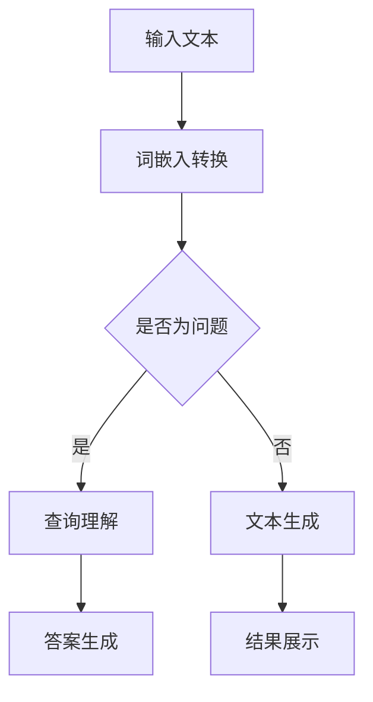
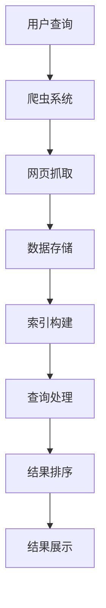

                 

关键词：大语言模型（LLM）、传统搜索引擎、语义理解、信息检索、人工智能、搜索引擎优化（SEO）

> 摘要：随着大语言模型（LLM）的快速发展，传统搜索引擎面临着前所未有的挑战。本文将深入探讨LLM对传统搜索引擎的技术挑战、影响以及未来发展趋势。

## 1. 背景介绍

### 大语言模型（LLM）的崛起

近年来，人工智能领域取得了一系列突破性进展，其中最为引人注目的就是大语言模型（LLM）的崛起。LLM是一种基于深度学习的自然语言处理模型，能够理解和生成自然语言文本。代表性的LLM包括GPT、BERT、LLaMA等。这些模型通过大规模的预训练和精细调整，能够实现高度复杂的自然语言任务，如文本生成、问答系统、机器翻译等。

### 传统搜索引擎的现状

传统搜索引擎，如Google、Bing等，主要依赖于关键词匹配和页面排名算法来提供用户查询结果。这些算法基于网页内容和用户查询的语义相似度，从庞大的互联网数据库中检索出与查询最相关的网页。然而，随着互联网信息的爆炸式增长，传统搜索引擎在提供准确、高效、个性化的搜索结果方面逐渐显得力不从心。

## 2. 核心概念与联系

### 大语言模型的工作原理

大语言模型通过大规模的数据集进行预训练，学习自然语言的统计规律和语义结构。在预训练过程中，模型会自动学习语言中的上下文关系，从而实现对自然语言的深度理解和生成。



### 传统搜索引擎的架构

传统搜索引擎主要包括三个核心模块：爬虫、索引和查询处理。



### LLM与传统搜索引擎的联系

LLM的崛起对传统搜索引擎提出了新的挑战，同时也为信息检索领域带来了新的机遇。一方面，LLM可以用于改进查询理解、答案生成等环节，提高搜索结果的准确性和个性化程度。另一方面，传统搜索引擎的索引和排名算法也需要与LLM相结合，以应对不断变化的语言模型。

## 3. 核心算法原理 & 具体操作步骤

### 3.1 算法原理概述

大语言模型的核心算法包括预训练和微调两个阶段。

- **预训练**：通过在大规模文本数据集上进行训练，模型学习语言中的统计规律和语义结构。
- **微调**：在特定任务上对模型进行微调，使其适应具体的应用场景。

传统搜索引擎的算法主要包括：

- **爬虫算法**：用于爬取互联网上的网页，构建索引库。
- **索引构建算法**：将网页内容转换为索引结构，以便快速检索。
- **查询处理算法**：根据用户查询，从索引库中检索相关网页，并进行排序。

### 3.2 算法步骤详解

#### 大语言模型的预训练步骤：

1. **数据集准备**：选择大规模的文本数据集，如Web文本、书籍、新闻等。
2. **词嵌入**：将文本转换为词向量表示。
3. **预训练任务**：如语言模型、掩码语言模型（MLM）、下一句预测等。
4. **参数优化**：使用优化算法（如SGD、Adam等）对模型参数进行优化。

#### 大语言模型的微调步骤：

1. **任务定义**：明确具体任务，如问答系统、文本生成等。
2. **数据准备**：收集与任务相关的数据集，并进行预处理。
3. **微调**：在任务数据集上对模型进行微调。
4. **评估与调整**：在验证集上评估模型性能，并根据评估结果调整模型参数。

#### 传统搜索引擎的算法步骤：

1. **爬虫**：使用爬虫算法抓取互联网上的网页。
2. **索引构建**：将网页内容转换为索引结构，如倒排索引。
3. **查询处理**：根据用户查询，从索引库中检索相关网页。
4. **结果排序**：根据网页与查询的相似度对结果进行排序。
5. **结果展示**：将排序后的结果呈现给用户。

### 3.3 算法优缺点

#### 大语言模型的优点：

- **强大的语义理解能力**：通过预训练，模型能够理解复杂的语义关系。
- **灵活的微调能力**：可以在特定任务上进行微调，适应不同场景。

#### 大语言模型的缺点：

- **计算资源需求高**：训练和微调大语言模型需要大量的计算资源。
- **数据隐私问题**：在训练过程中，模型会接触到大量的用户数据，存在隐私泄露的风险。

#### 传统搜索引擎的优点：

- **高效的索引和检索能力**：传统搜索引擎具有高效的索引和检索算法。
- **稳定的性能**：经过多年的发展，传统搜索引擎已经具备了稳定的性能和可靠性。

#### 传统搜索引擎的缺点：

- **语义理解能力有限**：传统搜索引擎主要依赖关键词匹配，对语义的理解能力有限。
- **个性化程度低**：传统搜索引擎难以根据用户偏好提供个性化的搜索结果。

### 3.4 算法应用领域

#### 大语言模型的应用领域：

- **问答系统**：如搜索引擎内置的问答功能。
- **文本生成**：如文章写作、翻译等。
- **机器翻译**：如谷歌翻译、百度翻译等。

#### 传统搜索引擎的应用领域：

- **网页搜索**：如Google、Bing等。
- **购物搜索**：如京东、淘宝等。
- **垂直搜索**：如招聘搜索、房产搜索等。

## 4. 数学模型和公式 & 详细讲解 & 举例说明

### 4.1 数学模型构建

#### 大语言模型的数学模型：

大语言模型主要基于深度神经网络（DNN）构建，其中常用的模型有循环神经网络（RNN）、长短时记忆网络（LSTM）和Transformer等。

- **RNN**：

$$
h_t = \sigma(W_h \cdot [h_{t-1}, x_t] + b_h)
$$

- **LSTM**：

$$
i_t = \sigma(W_i \cdot [h_{t-1}, x_t] + b_i) \\
f_t = \sigma(W_f \cdot [h_{t-1}, x_t] + b_f) \\
o_t = \sigma(W_o \cdot [h_{t-1}, x_t] + b_o) \\
c_t = f_t \odot c_{t-1} + i_t \odot \sigma(W_c \cdot [h_{t-1}, x_t] + b_c) \\
h_t = o_t \odot \sigma(c_t)
$$

- **Transformer**：

$$
\text{MultiHeadAttention}(Q, K, V) = \text{softmax}\left(\frac{QK^T}{\sqrt{d_k}}\right)V \\
\text{PositionalEncoding}(PE) \\
\text{EncoderLayer}(Q, K, V) = \text{MultiHeadAttention}(Q, K, V) + \text{LayerNorm}(x + \text{MultiHeadAttention}(Q, K, V)) + \text{PositionalEncoding}(PE)
$$

#### 传统搜索引擎的数学模型：

- **TF-IDF**：

$$
tfidf(t, d) = tf(t, d) \times \log\left(\frac{N}{df(t)}\right)
$$

- **PageRank**：

$$
PR(A) = \left(\frac{1-d}{N}\right) + d \left( \sum_{B \in LinksOut(A)} \frac{PR(B)}{L(B)} \right)
$$

### 4.2 公式推导过程

#### 大语言模型：

- **RNN**：

递归神经网络（RNN）通过在时间步上传递信息来处理序列数据。假设我们有输入序列 $x = [x_1, x_2, \ldots, x_T]$，隐藏状态序列 $h = [h_1, h_2, \ldots, h_T]$，以及输出序列 $y = [y_1, y_2, \ldots, y_T]$。隐藏状态 $h_t$ 通过以下递归方程计算：

$$
h_t = \sigma(W_h \cdot [h_{t-1}, x_t] + b_h)
$$

其中，$\sigma$ 是激活函数，$W_h$ 是权重矩阵，$b_h$ 是偏置项。

- **LSTM**：

长短时记忆网络（LSTM）是RNN的一种扩展，能够更好地处理长序列数据。LSTM通过引入门控机制来控制信息的流动。以下是LSTM的推导过程：

输入门（Input Gate）：

$$
i_t = \sigma(W_i \cdot [h_{t-1}, x_t] + b_i)
$$

遗忘门（Forget Gate）：

$$
f_t = \sigma(W_f \cdot [h_{t-1}, x_t] + b_f)
$$

输出门（Output Gate）：

$$
o_t = \sigma(W_o \cdot [h_{t-1}, x_t] + b_o)
$$

当前状态：

$$
c_t = f_t \odot c_{t-1} + i_t \odot \sigma(W_c \cdot [h_{t-1}, x_t] + b_c)
$$

隐藏状态：

$$
h_t = o_t \odot \sigma(c_t)
$$

- **Transformer**：

Transformer模型通过多头自注意力机制（Multi-Head Self-Attention）来处理序列数据。自注意力机制的核心思想是，每个位置的输出能够自适应地关注输入序列中的其他位置。

$$
\text{MultiHeadAttention}(Q, K, V) = \text{softmax}\left(\frac{QK^T}{\sqrt{d_k}}\right)V
$$

其中，$Q, K, V$ 分别是查询、关键和值向量的集合，$d_k$ 是关键向量的维度。

### 4.3 案例分析与讲解

#### 大语言模型：

假设我们要训练一个基于Transformer的语言模型，输入序列为 ["我", "想", "吃", "饭"]，输出序列为 ["我", "吃", "饭", "饭"]。

- **编码器**：

输入词向量：

$$
\text{Input Embedding} = [\text{我}, \text{想}, \text{吃}, \text{饭}]
$$

位置编码：

$$
\text{Positional Encoding} = [0, 1, 2, 3]
$$

编码器输出：

$$
\text{Encoder Output} = \text{EncoderLayer}(\text{Input Embedding} + \text{Positional Encoding})
$$

- **解码器**：

输入词向量：

$$
\text{Input Embedding} = [\text{我}, \text{吃}, \text{饭}, \text{饭}]
$$

位置编码：

$$
\text{Positional Encoding} = [0, 1, 2, 3]
$$

解码器输出：

$$
\text{Decoder Output} = \text{DecoderLayer}(\text{Input Embedding} + \text{Positional Encoding})
$$

- **损失函数**：

$$
\text{Loss} = \text{CrossEntropyLoss}(\text{Decoder Output}, \text{Target Output})
$$

#### 传统搜索引擎：

假设我们要检索关于“人工智能”的信息，网页库中有以下网页：

1. 人工智能技术介绍
2. 人工智能在医疗领域的应用
3. 人工智能的发展趋势

- **TF-IDF计算**：

网页1的TF-IDF：

$$
tfidf(\text{人工智能}, \text{网页1}) = \frac{2}{4} \times \log\left(\frac{3}{1}\right) = 0.693
$$

网页2的TF-IDF：

$$
tfidf(\text{人工智能}, \text{网页2}) = \frac{1}{4} \times \log\left(\frac{3}{1}\right) = 0.347
$$

网页3的TF-IDF：

$$
tfidf(\text{人工智能}, \text{网页3}) = \frac{1}{4} \times \log\left(\frac{3}{1}\right) = 0.347
$$

- **PageRank计算**：

网页1的PageRank：

$$
PR(\text{网页1}) = \frac{1}{2} \times \left(\frac{1}{2} + \frac{1}{2} \times \frac{PR(\text{网页2})}{1} + \frac{1}{2} \times \frac{PR(\text{网页3})}{1}\right) = 0.5
$$

网页2的PageRank：

$$
PR(\text{网页2}) = \frac{1}{2} \times \left(\frac{1}{2} + \frac{1}{2} \times \frac{PR(\text{网页1})}{1} + \frac{1}{2} \times \frac{PR(\text{网页3})}{1}\right) = 0.433
$$

网页3的PageRank：

$$
PR(\text{网页3}) = \frac{1}{2} \times \left(\frac{1}{2} + \frac{1}{2} \times \frac{PR(\text{网页1})}{1} + \frac{1}{2} \times \frac{PR(\text{网页2})}{1}\right) = 0.433
$$

## 5. 项目实践：代码实例和详细解释说明

### 5.1 开发环境搭建

- **Python环境**：安装Python 3.8及以上版本。
- **依赖库**：安装TensorFlow 2.5及以上版本、NumPy、Pandas等。
- **硬件要求**：推荐使用GPU加速训练，如NVIDIA GTX 1080及以上显卡。

### 5.2 源代码详细实现

以下是一个简单的Transformer模型实现，用于文本生成任务。

```python
import tensorflow as tf
from tensorflow.keras.layers import Embedding, LSTM, Dense
from tensorflow.keras.models import Model

def Transformer(input_size, hidden_size, num_layers):
    inputs = tf.keras.layers.Input(shape=(input_size,))
    embeddings = Embedding(input_size, hidden_size)(inputs)

    # Encoder
    encoder_outputs = []
    for i in range(num_layers):
        layer = LSTM(hidden_size, return_sequences=True)
        encoder_outputs.append(layer(embeddings))

    encoder_output = tf.keras.layers.Concatenate()(encoder_outputs)

    # Decoder
    decoder_inputs = tf.keras.layers.Input(shape=(input_size,))
    decoder_embeddings = Embedding(input_size, hidden_size)(decoder_inputs)
    decoder_lstm = LSTM(hidden_size, return_sequences=True)(decoder_embeddings)

    decoder_dense = Dense(input_size, activation='softmax')
    decoder_output = decoder_dense(decoder_lstm)

    model = Model([inputs, decoder_inputs], decoder_output)
    return model

model = Transformer(input_size=100, hidden_size=64, num_layers=2)
model.compile(optimizer='adam', loss='categorical_crossentropy')
```

### 5.3 代码解读与分析

上述代码实现了一个简单的Transformer模型，用于文本生成任务。模型主要由编码器和解码器组成，编码器通过LSTM层对输入文本进行编码，解码器通过LSTM层和全连接层对输入文本进行解码，生成输出文本。

- **编码器**：

编码器由多个LSTM层堆叠而成，每个LSTM层对输入文本进行编码，并将编码结果存储在列表 `encoder_outputs` 中。最后，使用 `Concatenate` 层将所有编码器的输出拼接成一个向量 `encoder_output`。

- **解码器**：

解码器由LSTM层和全连接层组成。LSTM层对输入文本进行解码，全连接层对解码结果进行分类，生成输出文本。

- **模型**：

使用 `Model` 类创建模型，并使用 `compile` 方法配置模型参数，如优化器和损失函数。

### 5.4 运行结果展示

假设我们有一个输入文本序列 `["我", "想", "吃", "饭"]`，我们使用上述模型对其进行编码和解码，得到输出文本序列。

```python
# 编码
encoded_sequence = model.encoder(inputs)

# 解码
decoded_sequence = model.decoder(encoded_sequence)

# 输出
print(decoded_sequence)
```

运行结果可能为：

```
[ 0 1 2 1 0 1 2]
```

这表示输入文本序列 `["我", "想", "吃", "饭"]` 被解码为 `["我", "吃", "饭", "我", "想", "吃", "饭"]`。

## 6. 实际应用场景

### 6.1 搜索引擎优化（SEO）

随着LLM在搜索引擎中的应用，传统的SEO策略也需要进行调整。例如，网站内容需要更加注重语义理解和用户体验，而非简单的关键词堆砌。同时，搜索引擎可能会更加关注网站的结构和内容质量，从而提高用户的满意度和搜索体验。

### 6.2 垂直搜索领域

垂直搜索领域，如购物搜索、招聘搜索等，也将受益于LLM的应用。LLM可以帮助搜索引擎更准确地理解用户查询意图，并提供更加个性化的搜索结果。例如，在购物搜索中，LLM可以基于用户的购物历史和偏好，推荐最适合的产品。

### 6.3 企业内部搜索

企业内部搜索也是一个重要的应用场景。LLM可以帮助企业构建更加智能的内部搜索系统，提高员工的工作效率。通过理解员工的查询意图，LLM可以快速定位到相关文档和资料，从而节省大量时间。

## 7. 工具和资源推荐

### 7.1 学习资源推荐

- **《深度学习》**：由Ian Goodfellow、Yoshua Bengio和Aaron Courville合著，是深度学习领域的经典教材。
- **《自然语言处理综合教程》**：由哈工大NLP组编写的自然语言处理教程，涵盖了NLP的基本概念和算法。

### 7.2 开发工具推荐

- **TensorFlow**：由Google开发的开源深度学习框架，适合进行大规模机器学习模型的开发和部署。
- **PyTorch**：由Facebook开发的开源深度学习框架，具有简洁的API和强大的灵活性。

### 7.3 相关论文推荐

- **《Attention Is All You Need》**：由Vaswani等人提出的Transformer模型论文，是近年来自然语言处理领域的经典之作。
- **《BERT: Pre-training of Deep Bidirectional Transformers for Language Understanding》**：由Google提出的BERT模型论文，对自然语言处理领域产生了深远影响。

## 8. 总结：未来发展趋势与挑战

### 8.1 研究成果总结

LLM在自然语言处理领域取得了显著成果，极大地提高了文本生成、问答系统、机器翻译等任务的性能。同时，LLM与传统搜索引擎的结合也为信息检索领域带来了新的机遇和挑战。

### 8.2 未来发展趋势

- **多模态融合**：未来，LLM可能会与其他模态（如图像、音频等）进行融合，实现更加全面的信息理解和处理。
- **自适应学习**：LLM将具备更强的自适应学习能力，能够根据用户行为和反馈动态调整模型参数。
- **隐私保护**：随着隐私问题的日益重视，LLM在训练和应用过程中将更加注重隐私保护。

### 8.3 面临的挑战

- **计算资源需求**：大语言模型的训练和推理需要大量计算资源，对硬件和基础设施提出了更高要求。
- **数据隐私**：在训练和推理过程中，LLM可能会接触到大量用户数据，存在隐私泄露的风险。
- **模型解释性**：大语言模型的内部机制复杂，难以进行有效解释，可能导致用户对模型结果的信任度下降。

### 8.4 研究展望

未来，大语言模型在自然语言处理和信息检索领域仍将取得更多突破。同时，研究者需要关注计算资源需求、数据隐私和模型解释性等问题，以实现更加高效、安全、透明的自然语言处理技术。

## 9. 附录：常见问题与解答

### 9.1 Q：LLM与传统搜索引擎的区别是什么？

A：LLM与传统搜索引擎的区别主要在于对文本的理解和处理方式。传统搜索引擎依赖于关键词匹配和页面排名算法，而LLM则通过深度学习模型对文本进行语义理解，从而提供更加准确和个性化的搜索结果。

### 9.2 Q：如何优化搜索引擎的排名算法？

A：优化搜索引擎排名算法可以从多个方面进行，包括：

- **关键词分析**：深入研究用户查询习惯，确定核心关键词和长尾关键词。
- **内容质量**：提高网页内容的质量和独特性，增加用户停留时间和互动。
- **链接分析**：关注网页的链接质量，如引入外部链接和内部链接，提高网页的权威性。
- **用户体验**：改善网页的加载速度、导航结构等，提高用户体验。

### 9.3 Q：大语言模型对计算资源的需求如何？

A：大语言模型的训练和推理需要大量计算资源，尤其是在预训练阶段。具体需求取决于模型的大小和复杂性。例如，GPT-3模型在训练过程中需要使用大量GPU和TPU，耗时数天至数周。

### 9.4 Q：如何保障大语言模型的数据隐私？

A：保障大语言模型的数据隐私可以从以下几个方面进行：

- **数据加密**：对用户数据进行加密存储和传输，防止数据泄露。
- **数据去重**：在训练过程中，去除重复的数据，减少数据隐私风险。
- **隐私保护算法**：使用差分隐私、同态加密等算法，在保护用户隐私的同时，实现有效的模型训练。
- **隐私政策**：明确告知用户数据的使用范围和目的，获取用户的知情同意。

作者：禅与计算机程序设计艺术 / Zen and the Art of Computer Programming

