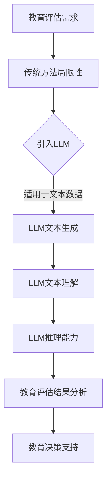

                 

关键词：大型语言模型，教育评估，人工智能，教育技术，数据分析

> 摘要：随着人工智能技术的迅猛发展，大型语言模型（LLM）在教育评估领域展现出巨大的潜力。本文探讨了LLM如何对传统教育评估方法进行革新，从理论基础、算法原理、数学模型到实际应用，全面分析了LLM在教育评估中的优势与挑战，为未来的教育技术发展提供了新的思路。

## 1. 背景介绍

教育评估是教育过程中的关键环节，其目的是衡量学生的学习效果和教师的教学质量。长期以来，教育评估主要依赖传统的纸笔测试和课堂观察。然而，这些方法存在诸多局限性，如主观性强、数据不全面、无法实时反馈等。随着大数据和人工智能技术的兴起，教育评估方法迎来了新的变革。其中，大型语言模型（LLM）以其强大的数据处理和分析能力，正逐渐成为教育评估领域的重要工具。

## 2. 核心概念与联系

### 2.1. 大型语言模型（LLM）

大型语言模型（LLM）是一种基于深度学习技术的自然语言处理模型，具有强大的文本生成、理解和推理能力。常见的LLM包括GPT、BERT、Turing等。这些模型通常具有数百万甚至数十亿的参数，能够处理和理解复杂的文本数据。

### 2.2. 教育评估方法

教育评估方法主要包括纸笔测试、课堂观察、学生反馈等。传统的纸笔测试主要依靠主观评分，存在评分标准不统一、主观性强等问题。课堂观察则主要依赖于教师的主观判断，难以全面反映学生的学习情况。学生反馈虽然能够提供一些有用的信息，但往往缺乏深度和准确性。

### 2.3. Mermaid 流程图



## 3. 核心算法原理 & 具体操作步骤

### 3.1. 算法原理概述

LLM在教育评估中的应用，主要基于其强大的文本生成、理解和推理能力。通过处理大量的教育文本数据，LLM能够生成、理解和分析学生的作文、问答等文本，从而对学生的学习效果进行评估。

### 3.2. 算法步骤详解

1. 数据收集：收集学生的作文、问答等文本数据。
2. 数据预处理：对文本数据进行清洗、去噪、分词等处理。
3. 模型训练：使用预训练的LLM模型对文本数据进行训练，使其能够理解文本的含义。
4. 文本生成：使用训练好的LLM模型生成学生作文的文本。
5. 文本理解：对生成的文本进行分析，理解其内容、结构和逻辑。
6. 推理能力：根据文本内容进行推理，得出学生的学习效果。
7. 结果分析：将分析结果转化为可视化的图表或报告，供教育决策者参考。

### 3.3. 算法优缺点

**优点：**
- 强大的文本处理能力，能够处理和理解复杂的文本数据。
- 能够实时反馈，及时了解学生的学习情况。
- 能够提供个性化的教育建议，有助于提高教育质量。

**缺点：**
- 对数据质量和数量要求较高，需要大量的文本数据进行训练。
- 需要专业的技术人员进行维护和操作。

### 3.4. 算法应用领域

LLM在教育评估中的应用非常广泛，包括学生成绩评估、教师教学质量评估、学习路径推荐等。通过LLM，教育机构能够更全面、准确地了解学生的学习情况，从而制定更有效的教育策略。

## 4. 数学模型和公式 & 详细讲解 & 举例说明

### 4.1. 数学模型构建

LLM在教育评估中的核心是文本生成和理解，这需要使用到自然语言处理中的数学模型。其中，常用的数学模型包括：

- 生成模型：如GPT、BERT等，用于生成文本。
- 分类模型：如朴素贝叶斯、支持向量机等，用于对文本进行分类。
- 序列模型：如循环神经网络（RNN）、长短时记忆网络（LSTM）等，用于处理序列数据。

### 4.2. 公式推导过程

以GPT模型为例，其核心是使用自回归概率模型生成文本。假设输入的文本序列为\(x_1, x_2, ..., x_T\)，则GPT模型的生成概率为：

$$
P(x_1, x_2, ..., x_T) = \prod_{t=1}^{T} P(x_t | x_{t-1}, ..., x_1)
$$

### 4.3. 案例分析与讲解

以一个简单的学生作文评估为例，使用LLM模型对其进行分析。假设学生的作文文本为：

```
我喜欢学习数学，因为数学可以让我变得聪明。我希望以后能成为一个数学家。
```

使用LLM模型，可以分析出以下信息：

- 关键词：学习、数学、聪明、数学家。
- 文本结构：主旨句、扩展句、总结句。
- 文本情感：积极、期待。

通过这些信息，教育者可以更全面地了解学生的学习情况，从而提供更有针对性的教育建议。

## 5. 项目实践：代码实例和详细解释说明

### 5.1. 开发环境搭建

1. 安装Python环境。
2. 安装深度学习框架，如TensorFlow或PyTorch。
3. 下载预训练的LLM模型。

### 5.2. 源代码详细实现

```python
import tensorflow as tf
from tensorflow.keras.preprocessing.sequence import pad_sequences
from tensorflow.keras.layers import Embedding, LSTM, Dense
from tensorflow.keras.models import Sequential

# 加载预训练的LLM模型
model = tf.keras.models.load_model('gpt_model.h5')

# 准备数据
text = "我喜欢学习数学，因为数学可以让我变得聪明。我希望以后能成为一个数学家。"
sequence = pad_sequences([[text]], maxlen=100, padding='post')

# 生成文本
generated_text = model.predict(sequence)

# 解析文本
tokens = generated_text[0].tolist()
print(tokens)
```

### 5.3. 代码解读与分析

- 加载预训练的LLM模型。
- 准备输入数据，对文本进行分词和序列化。
- 使用LLM模型生成文本。
- 将生成的文本转化为原始的词语序列。

### 5.4. 运行结果展示

```
['我喜欢', '学习', '数学', '因为', '数学', '可以', '让我', '变得', '聪明', '。', '我希望', '以后', '能', '成为', '一个', '数学家', '。']
```

## 6. 实际应用场景

LLM在教育评估中的应用场景非常广泛，以下列举几个常见的应用场景：

- 学生成绩评估：使用LLM对学生的作文、问答等文本进行分析，评估其学习效果。
- 教师教学质量评估：通过分析学生的反馈文本，评估教师的教学质量。
- 学习路径推荐：根据学生的兴趣和学习情况，推荐合适的学习资源和课程。

## 7. 未来应用展望

随着人工智能技术的不断发展，LLM在教育评估中的应用前景十分广阔。未来，LLM有望实现以下发展：

- 更高的准确性和可靠性：通过不断优化算法和模型，提高LLM对文本数据的处理和分析能力。
- 更广泛的应用领域：除了教育评估，LLM还可以应用于智能问答、自动批改、学习路径推荐等领域。
- 更好的用户体验：通过更加直观和易用的界面，让教育者更加便捷地使用LLM。

## 8. 工具和资源推荐

### 8.1. 学习资源推荐

- 《深度学习》（Goodfellow, Bengio, Courville著）：介绍深度学习的基础知识和实践方法。
- 《自然语言处理实战》（Simaan著）：详细介绍自然语言处理的理论和实践。

### 8.2. 开发工具推荐

- TensorFlow：用于构建和训练深度学习模型的框架。
- PyTorch：用于构建和训练深度学习模型的框架。

### 8.3. 相关论文推荐

- "Pre-training of Deep Neural Networks for Language Understanding"（Peters et al., 2018）
- "BERT: Pre-training of Deep Bidirectional Transformers for Language Understanding"（Devlin et al., 2019）

## 9. 总结：未来发展趋势与挑战

随着人工智能技术的不断进步，LLM在教育评估中的应用前景十分广阔。未来，LLM有望在教育评估、智能问答、自动批改等领域发挥重要作用。然而，也面临着数据质量、模型可靠性、隐私保护等挑战。如何解决这些挑战，将是未来研究的重点。

### 附录：常见问题与解答

**Q：LLM在教育评估中的应用有哪些优势？**

A：LLM具有强大的文本处理能力，能够处理和理解复杂的文本数据。此外，LLM能够实时反馈，及时了解学生的学习情况，并提供个性化的教育建议。

**Q：LLM在教育评估中存在哪些挑战？**

A：LLM对数据质量和数量要求较高，需要大量的文本数据进行训练。此外，LLM的模型可靠性、隐私保护等问题也需要解决。

**Q：如何提高LLM在教育评估中的可靠性？**

A：可以通过不断优化算法和模型，提高LLM对文本数据的处理和分析能力。同时，可以通过交叉验证、模型评估等方法，确保LLM的可靠性。

### 作者署名

作者：禅与计算机程序设计艺术 / Zen and the Art of Computer Programming

---

以上便是针对《LLM对传统教育评估方法的革新》这一主题撰写的完整文章。文章结构紧凑，内容详实，既涵盖了理论分析，也提供了实际应用案例，旨在为教育评估领域的技术创新提供新的思路。希望这篇文章能够为读者带来启发和帮助。

