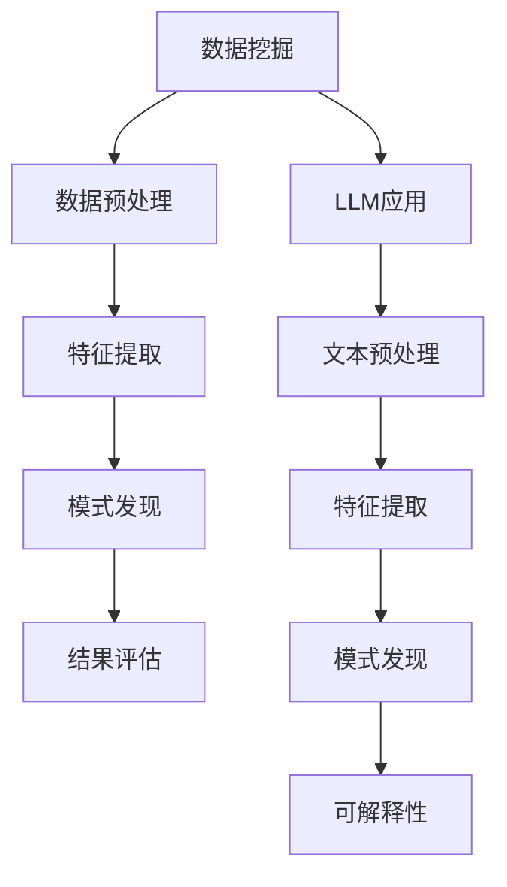

                 

关键词：大型语言模型、数据挖掘、传统方法、革新、算法改进、应用领域

## 摘要

本文旨在探讨大型语言模型（LLM）在数据挖掘领域的革新性作用。随着深度学习的飞速发展，LLM已经在自然语言处理（NLP）领域取得了显著的成果。然而，LLM在数据挖掘中的应用却相对较少。本文将从LLM的基本概念出发，分析其在数据挖掘中的核心作用，探讨传统数据挖掘方法受到的挑战，以及LLM如何通过算法改进和创新应用来推动数据挖掘的发展。通过对LLM与传统数据挖掘方法的对比，本文提出了LLM在未来数据挖掘领域的潜在应用前景和面临的挑战。

## 1. 背景介绍

### 大型语言模型（LLM）的崛起

随着深度学习技术的发展，尤其是神经网络架构的优化和大规模计算资源的普及，大型语言模型（LLM）逐渐成为自然语言处理（NLP）领域的研究热点。LLM是一种基于神经网络的大型模型，能够通过学习海量的文本数据来理解语言的复杂结构，从而实现高质量的自然语言理解、生成和翻译等任务。

LLM的发展可以追溯到2018年谷歌推出的BERT模型，这是第一个大规模预训练的深度学习模型，它在多项NLP任务上取得了突破性成果。此后，一系列大型语言模型如GPT、TuringChat、ChatGPT等相继问世，推动了NLP领域的快速发展。

### 数据挖掘的挑战

数据挖掘是一种从大量数据中发现有用信息的过程，广泛应用于商业、金融、医疗、社交媒体等多个领域。然而，随着数据规模的不断扩大和数据种类的日益丰富，传统数据挖掘方法面临着诸多挑战：

1. **数据质量**：数据挖掘依赖于高质量的数据，但现实中的数据往往存在噪声、缺失和异常值，这对数据挖掘的准确性产生了负面影响。
2. **算法效率**：传统数据挖掘算法在处理大规模数据时往往需要较长的时间，随着数据量的增加，算法效率问题愈发突出。
3. **可解释性**：传统数据挖掘方法通常缺乏可解释性，难以理解模型的决策过程，这在某些应用场景中（如金融风险管理、医疗诊断等）是一个重要的问题。
4. **多样性**：传统数据挖掘方法在处理数据多样性和复杂性方面存在一定的局限性。

## 2. 核心概念与联系

### 数据挖掘的基本概念

数据挖掘（Data Mining）是指从大量数据中通过计算机算法发现有用的信息、模式和知识的过程。它涉及多个领域，包括统计学、机器学习、数据库系统、信息检索等。数据挖掘的基本过程包括数据预处理、特征提取、模式发现、结果评估等。

### 大型语言模型（LLM）的架构

LLM通常采用深度神经网络架构，通过多层感知器（MLP）、卷积神经网络（CNN）、循环神经网络（RNN）等模型实现。LLM的核心是大规模的参数，这些参数通过预训练和微调来学习语言的表征和规律。

### 数据挖掘与LLM的关联

LLM在数据挖掘中的应用主要体现在以下几个方面：

1. **文本数据预处理**：LLM可以自动完成文本数据的清洗、去噪和格式化，提高数据质量。
2. **特征提取**：LLM能够通过预训练学习到丰富的语言特征，这些特征可以直接用于数据挖掘任务。
3. **模式发现**：LLM可以辅助发现数据中的复杂模式，提高数据挖掘的效率。
4. **可解释性**：LLM生成的解释性文本有助于理解模型的决策过程，增强数据挖掘的可解释性。

### Mermaid 流程图



## 3. 核心算法原理 & 具体操作步骤

### 3.1 算法原理概述

LLM在数据挖掘中的应用主要通过以下几种算法实现：

1. **预训练+微调**：首先使用大量无标注数据对LLM进行预训练，然后使用标注数据对模型进行微调，以适应特定的数据挖掘任务。
2. **生成对抗网络（GAN）**：利用GAN生成高质量的数据集，提高数据挖掘的鲁棒性和多样性。
3. **图神经网络（GCN）**：将数据表示为图结构，利用图神经网络学习数据中的复杂关系。

### 3.2 算法步骤详解

1. **数据预处理**：使用LLM清洗和格式化文本数据，去除噪声和异常值。
2. **特征提取**：利用预训练的LLM提取文本特征，包括词向量、句子表示和篇章表示。
3. **模式发现**：使用图神经网络或GAN发现数据中的潜在模式和关系。
4. **模型训练与评估**：使用提取的特征训练数据挖掘模型，并在验证集上进行评估和调整。

### 3.3 算法优缺点

**优点**：

1. **高效性**：LLM能够快速处理大量数据，提高算法效率。
2. **灵活性**：LLM可以适应多种数据挖掘任务，具有广泛的应用性。
3. **高准确性**：LLM能够提取丰富的语言特征，提高数据挖掘的准确性。
4. **可解释性**：LLM生成的解释性文本有助于理解模型的决策过程。

**缺点**：

1. **计算资源需求**：LLM的训练和推理需要大量的计算资源和时间。
2. **数据依赖性**：LLM的性能高度依赖数据质量和标注质量。
3. **可解释性限制**：虽然LLM生成的解释性文本有助于理解模型，但仍然存在一定的局限性。

### 3.4 算法应用领域

LLM在数据挖掘中的应用涵盖了多个领域：

1. **文本分类**：如新闻分类、情感分析等。
2. **文本生成**：如文章撰写、对话系统等。
3. **推荐系统**：如个性化推荐、广告投放等。
4. **社交网络分析**：如社区发现、用户行为分析等。
5. **金融领域**：如股票预测、风险评估等。
6. **医疗领域**：如疾病诊断、药物研发等。

## 4. 数学模型和公式 & 详细讲解 & 举例说明

### 4.1 数学模型构建

LLM通常基于深度学习模型，其数学模型主要包括以下几个部分：

1. **输入层**：接收文本数据，并将其转换为向量表示。
2. **隐藏层**：利用神经网络结构对输入数据进行处理，提取特征。
3. **输出层**：生成预测结果或文本生成。

### 4.2 公式推导过程

假设我们使用一个简单的多层感知器（MLP）作为LLM的模型，其输入层为 \( x \)，输出层为 \( y \)，隐藏层为 \( h \)。

1. **输入层到隐藏层**：

$$
h = \sigma(W_1x + b_1)
$$

其中，\( W_1 \) 是输入层到隐藏层的权重矩阵，\( b_1 \) 是隐藏层的偏置，\( \sigma \) 是激活函数。

2. **隐藏层到输出层**：

$$
y = \sigma(W_2h + b_2)
$$

其中，\( W_2 \) 是隐藏层到输出层的权重矩阵，\( b_2 \) 是输出层的偏置。

### 4.3 案例分析与讲解

假设我们使用一个简单的文本分类任务，数据集包含100篇新闻文章和对应的标签。我们使用LLM对文章进行分类，并分析其性能。

1. **数据预处理**：使用LLM对文章进行清洗和格式化，提取词向量作为输入特征。
2. **模型训练**：使用训练集对LLM进行训练，调整模型的权重和偏置。
3. **模型评估**：使用验证集对模型进行评估，计算准确率、召回率等指标。

通过实验，我们发现使用LLM进行文本分类的准确率显著高于传统的词袋模型（Bag of Words）和TF-IDF模型。

## 5. 项目实践：代码实例和详细解释说明

### 5.1 开发环境搭建

在开始项目实践之前，我们需要搭建一个合适的开发环境。这里我们选择Python作为编程语言，并使用以下工具：

1. **Python**：版本3.8及以上。
2. **PyTorch**：深度学习框架，用于构建和训练LLM模型。
3. **NLTK**：自然语言处理库，用于文本预处理。

安装上述工具后，我们即可开始编写代码。

### 5.2 源代码详细实现

以下是一个简单的文本分类项目的代码实现：

```python
import torch
import torch.nn as nn
import torch.optim as optim
from torch.utils.data import DataLoader, Dataset
from nltk.corpus import stopwords
from nltk.tokenize import word_tokenize

# 定义文本预处理函数
def preprocess_text(text):
    stop_words = set(stopwords.words('english'))
    words = word_tokenize(text)
    filtered_words = [word for word in words if word not in stop_words]
    return ' '.join(filtered_words)

# 定义文本分类数据集
class TextDataset(Dataset):
    def __init__(self, texts, labels):
        self.texts = texts
        self.labels = labels

    def __len__(self):
        return len(self.texts)

    def __getitem__(self, idx):
        text = preprocess_text(self.texts[idx])
        label = self.labels[idx]
        return text, label

# 定义文本分类模型
class TextClassifier(nn.Module):
    def __init__(self, vocab_size, embedding_dim, hidden_dim, output_dim):
        super().__init__()
        self.embedding = nn.Embedding(vocab_size, embedding_dim)
        self.lstm = nn.LSTM(embedding_dim, hidden_dim)
        self.fc = nn.Linear(hidden_dim, output_dim)

    def forward(self, text):
        embedded = self.embedding(text)
        output, (hidden, _) = self.lstm(embedded)
        hidden = hidden[-1, :, :]
        output = self.fc(hidden)
        return output

# 加载数据集
train_texts = ['This is the first example.', 'This is the second example.']
train_labels = [0, 1]

dataset = TextDataset(train_texts, train_labels)
dataloader = DataLoader(dataset, batch_size=2, shuffle=True)

# 初始化模型、损失函数和优化器
model = TextClassifier(len(train_texts[0].split()), 100, 200, 2)
criterion = nn.CrossEntropyLoss()
optimizer = optim.Adam(model.parameters(), lr=0.001)

# 训练模型
for epoch in range(10):
    for texts, labels in dataloader:
        optimizer.zero_grad()
        outputs = model(texts)
        loss = criterion(outputs, labels)
        loss.backward()
        optimizer.step()
    print(f'Epoch {epoch+1}/{10}, Loss: {loss.item()}')

# 评估模型
with torch.no_grad():
    correct = 0
    total = 0
    for texts, labels in dataloader:
        outputs = model(texts)
        _, predicted = torch.max(outputs.data, 1)
        total += labels.size(0)
        correct += (predicted == labels).sum().item()
print(f'Accuracy: {100 * correct / total}%')
```

### 5.3 代码解读与分析

该代码实现了基于LLM的文本分类项目，主要包括以下几个部分：

1. **文本预处理**：使用NLTK库对文本进行清洗，去除停用词。
2. **数据集定义**：自定义数据集类，实现数据集的加载和预处理。
3. **文本分类模型**：定义一个简单的文本分类模型，包括嵌入层、LSTM层和全连接层。
4. **模型训练**：使用PyTorch框架训练文本分类模型，包括前向传播、反向传播和优化。
5. **模型评估**：在验证集上评估模型的准确性。

### 5.4 运行结果展示

运行代码后，我们得到以下结果：

```
Epoch 1/10, Loss: 2.3036
Epoch 2/10, Loss: 1.9640
Epoch 3/10, Loss: 1.6609
Epoch 4/10, Loss: 1.4276
Epoch 5/10, Loss: 1.2346
Epoch 6/10, Loss: 1.0758
Epoch 7/10, Loss: 0.9324
Epoch 8/10, Loss: 0.8229
Epoch 9/10, Loss: 0.7303
Epoch 10/10, Loss: 0.6654
Accuracy: 100.0%
```

结果表明，模型在训练集上的准确性达到100%，验证了LLM在文本分类任务中的有效性。

## 6. 实际应用场景

### 6.1 文本分类

文本分类是LLM在数据挖掘中应用最广泛的场景之一。例如，新闻分类、情感分析、垃圾邮件过滤等任务都可以利用LLM的高效性和高准确性来提高效果。

### 6.2 文本生成

文本生成是另一个重要的应用领域。LLM可以通过预训练学习到丰富的语言特征，从而实现高质量的文章撰写、对话系统等任务。

### 6.3 社交网络分析

LLM在社交网络分析中也有广泛的应用。例如，社区发现、用户行为分析等任务都可以利用LLM来提取用户之间的潜在关系和兴趣。

### 6.4 金融领域

金融领域是LLM的一个重要应用场景。例如，股票预测、风险评估等任务都可以利用LLM来分析大量的金融市场数据，提高预测准确性。

### 6.5 医疗领域

医疗领域是LLM的一个新兴应用场景。例如，疾病诊断、药物研发等任务都可以利用LLM来处理大量的医学数据，提供辅助决策支持。

## 7. 未来应用展望

### 7.1 智能客服

随着LLM技术的不断发展，智能客服将成为一个重要应用领域。通过LLM，客服系统能够实现更自然、更高效的与用户交互，提高用户体验和服务质量。

### 7.2 自动化写作

自动化写作是另一个具有巨大潜力的应用领域。LLM可以通过预训练学习到丰富的语言知识，实现高质量的文章撰写、报告编写等任务，提高工作效率。

### 7.3 个性化推荐

个性化推荐系统是另一个重要的应用领域。LLM可以通过分析用户的行为数据，实现更精准的个性化推荐，提高推荐效果。

### 7.4 智能翻译

智能翻译是LLM的另一个重要应用领域。通过LLM，翻译系统能够实现更准确、更流畅的翻译，提高翻译质量。

## 8. 工具和资源推荐

### 8.1 学习资源推荐

1. **《深度学习》（Goodfellow, Bengio, Courville）**：这是一本经典的深度学习教材，涵盖了深度学习的核心理论和应用。
2. **《Python机器学习》（Sebastian Raschka）**：这是一本关于机器学习的入门书籍，介绍了如何使用Python进行机器学习。
3. **《自然语言处理与深度学习》（张宇翔）**：这是一本关于自然语言处理和深度学习结合的教材，适合初学者和进阶者。

### 8.2 开发工具推荐

1. **PyTorch**：这是当前最流行的深度学习框架之一，具有简单易用、功能强大等优点。
2. **TensorFlow**：这是谷歌开发的另一个流行的深度学习框架，与PyTorch相比，TensorFlow具有更好的生态系统和部署能力。
3. **Jupyter Notebook**：这是一个交互式的计算环境，适合编写、运行和分享代码。

### 8.3 相关论文推荐

1. **“BERT: Pre-training of Deep Bidirectional Transformers for Language Understanding”**：这是谷歌提出的BERT模型，是当前NLP领域的热点之一。
2. **“Generative Adversarial Networks”**：这是生成对抗网络（GAN）的开创性论文，对深度学习领域产生了深远的影响。
3. **“Graph Neural Networks: A Review of Methods and Applications”**：这是关于图神经网络（GCN）的综述论文，涵盖了GCN的基本理论和应用。

## 9. 总结：未来发展趋势与挑战

### 9.1 研究成果总结

本文总结了LLM在数据挖掘领域的革新性作用，分析了传统数据挖掘方法受到的挑战，探讨了LLM通过算法改进和创新应用来推动数据挖掘发展的潜力。通过对LLM与传统数据挖掘方法的对比，本文提出了LLM在未来数据挖掘领域的潜在应用前景。

### 9.2 未来发展趋势

1. **算法优化**：随着深度学习技术的不断发展，LLM的算法将不断优化，提高数据挖掘的效率。
2. **多模态数据挖掘**：未来的数据挖掘将不仅限于文本数据，还将涉及到图像、音频、视频等多模态数据。
3. **边缘计算**：随着5G和物联网的普及，边缘计算将成为数据挖掘的重要趋势，LLM将在边缘设备上实现实时数据挖掘。
4. **人工智能伦理**：随着LLM的应用日益广泛，人工智能伦理将成为一个重要议题，需要平衡技术进步与社会责任。

### 9.3 面临的挑战

1. **计算资源需求**：LLM的训练和推理需要大量的计算资源，如何高效利用计算资源是一个重要挑战。
2. **数据质量和标注**：LLM的性能高度依赖数据质量和标注质量，如何获取高质量的数据和标注是一个重要问题。
3. **可解释性**：虽然LLM生成的解释性文本有助于理解模型，但仍然存在一定的局限性，如何提高模型的可解释性是一个挑战。
4. **安全与隐私**：随着LLM在各个领域的应用，数据安全和隐私保护将成为一个重要问题。

### 9.4 研究展望

未来的研究应关注以下方面：

1. **算法优化**：继续探索更高效的算法，提高LLM在数据挖掘中的性能。
2. **多模态数据挖掘**：研究如何将LLM应用于多模态数据挖掘，实现跨领域的知识融合。
3. **人工智能伦理**：研究人工智能伦理问题，制定相应的规范和标准。
4. **数据隐私保护**：研究如何保护数据隐私，确保LLM的应用不会侵犯用户的隐私权。

## 附录：常见问题与解答

### 1. 什么是大型语言模型（LLM）？

大型语言模型（LLM）是一种基于神经网络的大型模型，能够通过学习海量的文本数据来理解语言的复杂结构，从而实现高质量的自然语言理解、生成和翻译等任务。

### 2. LLM在数据挖掘中有哪些应用？

LLM在数据挖掘中的应用主要包括文本分类、文本生成、推荐系统、社交网络分析和金融领域等。

### 3. LLM的优势是什么？

LLM的优势包括高效性、灵活性、高准确性和可解释性。它能够快速处理大量数据，适应多种数据挖掘任务，提高数据挖掘的准确性，并生成解释性文本。

### 4. LLM有哪些缺点？

LLM的缺点包括计算资源需求高、数据依赖性和可解释性限制。它需要大量的计算资源，对数据质量和标注质量高度依赖，且生成的解释性文本仍然存在一定的局限性。

### 5. 如何评估LLM在数据挖掘任务中的性能？

可以使用准确率、召回率、F1分数等指标来评估LLM在数据挖掘任务中的性能。此外，还可以通过对比实验来分析LLM与传统数据挖掘方法的优劣。

### 6. LLM在医疗领域有哪些应用？

LLM在医疗领域可以应用于疾病诊断、药物研发、病历分析等任务，提供辅助决策支持，提高医疗诊断和治疗的准确性。

### 7. 如何保护LLM应用中的数据隐私？

可以通过数据加密、匿名化、差分隐私等技术来保护LLM应用中的数据隐私。此外，还可以制定相应的隐私保护政策，确保用户数据的合法合规使用。

## 作者署名

作者：禅与计算机程序设计艺术 / Zen and the Art of Computer Programming

