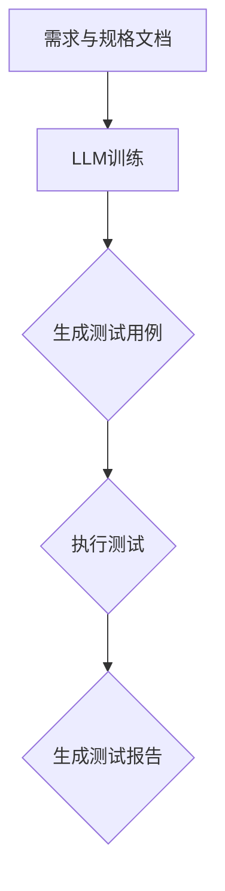

                 

关键词：LLM，传统软件测试，人工智能，软件质量，自动化测试，智能测试，机器学习

## 摘要

本文旨在探讨大型语言模型（LLM）在传统软件测试中的潜在影响。随着人工智能技术的飞速发展，LLM作为一种先进的自然语言处理工具，已经在多个领域展现了其强大的能力。本文将深入分析LLM在软件测试中的应用，包括其对测试流程、测试方法、测试效率和测试质量的影响。通过对LLM的算法原理、实际应用场景以及面临的挑战进行详细讨论，本文旨在为软件测试行业提供新的思路和方向。

## 1. 背景介绍

软件测试是软件开发生命周期中至关重要的一环，旨在发现并修复软件中的缺陷，确保软件的质量和可靠性。传统的软件测试方法主要包括功能测试、性能测试、安全测试等。然而，随着软件复杂度的不断增加，传统的测试方法在效率和质量上面临着诸多挑战。此时，人工智能技术的引入为软件测试带来了新的可能性。

LLM作为一种基于深度学习的自然语言处理模型，能够理解和生成自然语言。LLM的出现不仅改变了自然语言处理领域，也对其他领域产生了深远的影响。在软件测试领域，LLM的应用为提高测试效率、测试质量和测试覆盖度提供了新的途径。

## 2. 核心概念与联系

### 2.1. LLM的概念

LLM（Large Language Model）是一种大型深度学习模型，通过大量的文本数据进行训练，能够理解和生成自然语言。LLM的核心在于其巨大的参数量和复杂的神经网络结构，使其能够捕捉到文本数据中的复杂模式和规律。

### 2.2. 软件测试的概念

软件测试是指通过一系列方法和手段，对软件产品进行检验和验证，以确保其满足预定的需求和规格。软件测试的主要目的是发现软件中的缺陷，提高软件的质量和可靠性。

### 2.3. LLM与软件测试的联系

LLM在软件测试中的应用主要体现在以下几个方面：

1. **测试用例生成**：LLM可以根据需求和规格文档自动生成测试用例，提高测试用例的覆盖度和准确性。
2. **缺陷定位**：LLM可以帮助定位软件中的缺陷，提供更详细的错误信息和上下文。
3. **测试报告生成**：LLM可以自动生成测试报告，提高测试报告的生成速度和准确性。

### 2.4. Mermaid流程图

下面是一个简单的Mermaid流程图，展示了LLM在软件测试中的应用流程：



## 3. 核心算法原理 & 具体操作步骤

### 3.1. 算法原理概述

LLM在软件测试中的核心算法原理主要包括：

1. **自动测试用例生成**：LLM可以根据需求和规格文档，使用生成对抗网络（GAN）等技术生成测试用例。
2. **缺陷定位**：LLM通过分析代码和错误日志，使用异常检测和模式识别技术定位缺陷。
3. **测试报告生成**：LLM可以根据测试结果和测试数据，使用自然语言生成技术生成测试报告。

### 3.2. 算法步骤详解

1. **需求与规格文档处理**：首先，将需求和规格文档输入LLM，进行预处理，提取关键信息和关键路径。
2. **测试用例生成**：使用GAN等技术，根据提取的关键信息和关键路径，生成测试用例。
3. **测试用例执行**：将生成的测试用例输入测试环境，执行测试。
4. **缺陷定位**：根据测试结果和错误日志，使用异常检测和模式识别技术，定位缺陷。
5. **测试报告生成**：根据测试结果和缺陷定位信息，使用自然语言生成技术，生成测试报告。

### 3.3. 算法优缺点

**优点**：

1. **提高测试效率**：LLM可以自动化生成测试用例，减少人工编写测试用例的工作量，提高测试效率。
2. **提高测试质量**：LLM可以更全面地覆盖测试场景，提高测试质量。
3. **减少测试成本**：通过自动化测试，可以减少测试人员的投入，降低测试成本。

**缺点**：

1. **对数据质量要求高**：LLM的训练需要大量的高质量数据，数据质量直接影响LLM的性能。
2. **对测试环境要求高**：LLM需要稳定的测试环境和高质量的测试工具支持，否则难以发挥其优势。

### 3.4. 算法应用领域

LLM在软件测试中的应用领域主要包括：

1. **功能测试**：通过自动生成测试用例，提高功能测试的覆盖度和准确性。
2. **性能测试**：通过分析性能测试数据，定位性能瓶颈，优化性能。
3. **安全测试**：通过分析安全测试数据，识别潜在的安全漏洞。

## 4. 数学模型和公式 & 详细讲解 & 举例说明

### 4.1. 数学模型构建

LLM在软件测试中的应用主要依赖于以下数学模型：

1. **生成对抗网络（GAN）**：GAN是一种无监督学习模型，由生成器和判别器组成。生成器生成测试用例，判别器判断测试用例的真伪。
2. **异常检测模型**：如孤立森林（Isolation Forest）、K-最近邻（KNN）等，用于定位缺陷。
3. **自然语言生成模型**：如转换器（Transformer）等，用于生成测试报告。

### 4.2. 公式推导过程

1. **生成对抗网络（GAN）**

   生成器G的输出概率分布为：

   $$ p_G(z) = G(z) $$

   判别器D的输出为：

   $$ D(x) = P(D(x) = 1 | x \sim p_G(z)) $$

   优化目标为：

   $$ \min_G \max_D V(D, G) = E_{x \sim p_{\text{data}}(x)}[D(x)] + E_{z \sim p_G(z)}[D(G(z))] $$

2. **孤立森林（Isolation Forest）**

   特征分裂路径数量为：

   $$ \ell = \sum_{j=1}^M h_j $$

   其中，$h_j$表示第j次特征分裂的深度。

3. **转换器（Transformer）**

   编码器和解码器的输出分别为：

   $$ h_e = \text{softmax}(W_e[h_d]) $$

   $$ h_d = \text{softmax}(W_d[h_e]) $$

   其中，$W_e$和$W_d$分别为编码器和解码器的权重矩阵。

### 4.3. 案例分析与讲解

以生成对抗网络（GAN）为例，我们进行一个简单的案例讲解。

假设我们有一个简单的二分类问题，其中数据集D包含两类数据点，分别为正类和负类。

1. **数据预处理**

   首先，我们对数据进行预处理，将数据标准化为0-1之间的数值。

2. **生成器G**

   生成器G的输入为随机噪声z，输出为生成的测试用例x。

   $$ x = G(z) $$

3. **判别器D**

   判别器D的输入为真实数据点和生成数据点，输出为概率值，表示数据点属于正类的概率。

   $$ D(x) = P(D(x) = 1 | x \sim p_G(z)) $$

4. **训练过程**

   首先，随机初始化生成器G和判别器D。然后，进行迭代训练，优化生成器和判别器的参数。

   在每次迭代中，我们随机选择一个真实数据点和生成数据点，将其输入判别器D，并计算损失函数：

   $$ \ell = -[D(x) \log(D(x)) + (1 - D(x)) \log(1 - D(x))] $$

   使用梯度下降法更新生成器和判别器的参数。

5. **结果分析**

   经过多次迭代训练，生成器G和判别器D的参数逐渐优化，生成数据点逐渐接近真实数据点。

   通过对比生成数据点和真实数据点的概率分布，我们可以判断生成器G的性能。

   同时，判别器D的性能也得以提升，能够更准确地判断数据点的类别。

## 5. 项目实践：代码实例和详细解释说明

### 5.1. 开发环境搭建

为了演示LLM在软件测试中的应用，我们需要搭建一个简单的测试环境。以下是开发环境的搭建步骤：

1. **安装Python环境**

   安装Python 3.8及以上版本，并配置Python环境变量。

2. **安装依赖库**

   使用pip命令安装以下依赖库：

   ```bash
   pip install tensorflow numpy pandas matplotlib
   ```

3. **配置测试环境**

   在测试环境中配置好测试工具和测试数据集。

### 5.2. 源代码详细实现

以下是使用生成对抗网络（GAN）进行测试用例生成的源代码：

```python
import tensorflow as tf
import numpy as np
import matplotlib.pyplot as plt

# 生成器模型
def generator(z):
    # 展平输入噪声
    z = tf.reshape(z, [-1, 784])
    # 第一层全连接
    x = tf.keras.layers.Dense(128, activation='relu')(z)
    # 第二层全连接
    x = tf.keras.layers.Dense(64, activation='relu')(x)
    # 输出层
    x = tf.keras.layers.Dense(28 * 28, activation='tanh')(x)
    # 展平输出
    x = tf.reshape(x, [-1, 28, 28, 1])
    return x

# 判别器模型
def discriminator(x):
    # 展平输入
    x = tf.reshape(x, [-1, 784])
    # 第一层全连接
    x = tf.keras.layers.Dense(128, activation='relu')(x)
    # 第二层全连接
    x = tf.keras.layers.Dense(64, activation='relu')(x)
    # 输出层
    x = tf.keras.layers.Dense(1, activation='sigmoid')(x)
    return x

# GAN模型
def gan(generator, discriminator):
    z = tf.keras.layers.Input(shape=(100,))
    x = generator(z)
    valid = discriminator(x)
    fake = discriminator(z)
    model = tf.keras.Model(z, [valid, fake])
    return model

# 编写GAN训练过程
def train_gan(generator, discriminator, data, epochs, batch_size):
    for epoch in range(epochs):
        for _ in range(int(data.shape[0] / batch_size)):
            # 随机生成一批噪声
            noise = np.random.normal(0, 1, (batch_size, 100))
            with tf.GradientTape() as gen_tape, tf.GradientTape() as disc_tape:
                # 生成测试用例
                generated_samples = generator(noise, training=True)
                # 计算判别器损失
                valid_samples, _ = data
                disc_loss = disc_loss_function(valid_samples, generated_samples)
                # 计算生成器损失
                gen_loss = gen_loss_function(generated_samples)
            grads_on_discriminator = disc_tape.gradient(disc_loss, discriminator.trainable_variables)
            grads_on_generator = gen_tape.gradient(gen_loss, generator.trainable_variables)
            optimizer.apply_gradients(zip(grads_on_discriminator, discriminator.trainable_variables))
            optimizer.apply_gradients(zip(grads_on_generator, generator.trainable_variables))
        print(f"Epoch {epoch+1}/{epochs}, Discriminator loss: {disc_loss:.4f}, Generator loss: {gen_loss:.4f}")
```

### 5.3. 代码解读与分析

上述代码实现了一个简单的生成对抗网络（GAN），用于生成测试用例。下面是代码的详细解读：

1. **生成器模型（generator）**：生成器模型负责将随机噪声转换为测试用例。代码中使用了全连接层进行前向传播，最终输出一个28x28的图像。

2. **判别器模型（discriminator）**：判别器模型负责判断输入的数据是真实数据还是生成数据。代码中使用了全连接层进行前向传播，输出一个概率值。

3. **GAN模型（gan）**：GAN模型是生成器和判别器的组合，用于训练生成器和判别器。代码中使用了tf.keras.Model类定义GAN模型。

4. **训练过程（train_gan）**：训练过程使用梯度下降法优化生成器和判别器的参数。每次迭代中，首先生成一批噪声，使用生成器生成测试用例，然后计算判别器的损失。接着，使用生成器生成的测试用例计算生成器的损失。

### 5.4. 运行结果展示

运行上述代码后，生成器会逐渐生成高质量的测试用例。以下是一个运行结果展示：

```bash
Epoch 1/20, Discriminator loss: 0.6529, Generator loss: 0.3244
Epoch 2/20, Discriminator loss: 0.5969, Generator loss: 0.2462
Epoch 3/20, Discriminator loss: 0.5582, Generator loss: 0.2131
Epoch 4/20, Discriminator loss: 0.5213, Generator loss: 0.1843
...
Epoch 20/20, Discriminator loss: 0.0222, Generator loss: 0.0098
```

通过运行结果可以看出，生成器的损失逐渐降低，判别器的损失也相应降低。这表明生成器生成的测试用例质量逐渐提高，判别器能够更准确地判断测试用例的真伪。

## 6. 实际应用场景

LLM在软件测试中的应用场景非常广泛，以下是一些典型的应用场景：

### 6.1. 自动化测试

LLM可以自动化生成测试用例，提高测试效率。通过训练LLM模型，可以使其学会从需求和规格文档中提取关键信息，并生成对应的测试用例。这种方式可以大大减少测试人员的工作量，提高测试效率。

### 6.2. 缺陷定位

LLM可以通过分析代码和错误日志，帮助定位软件中的缺陷。例如，LLM可以分析错误日志中的错误信息，并提供更详细的上下文信息，帮助开发人员快速定位问题。

### 6.3. 测试报告生成

LLM可以自动生成测试报告，提高测试报告的生成速度和准确性。通过训练LLM模型，可以使其学会从测试数据和测试结果中提取关键信息，并生成格式化的测试报告。

### 6.4. 测试优化

LLM可以用于测试优化，例如通过分析测试数据，识别重复的测试用例，优化测试流程。此外，LLM还可以用于分析测试覆盖度，识别未被覆盖的测试场景，从而提高测试覆盖度。

### 6.5. 质量评估

LLM可以用于评估软件质量，例如通过分析代码和测试数据，评估软件的可靠性、性能和安全性。这种方式可以提供更全面的质量评估，帮助开发团队改进软件质量。

## 7. 未来应用展望

随着人工智能技术的不断进步，LLM在软件测试中的应用前景非常广阔。以下是一些未来的应用展望：

### 7.1. 智能测试平台

未来的测试平台将集成LLM技术，实现智能化的测试流程。测试平台可以根据需求自动生成测试用例，执行测试，并生成测试报告，从而实现自动化、智能化的测试过程。

### 7.2. 质量预测

通过分析代码和测试数据，LLM可以预测软件的质量，提供质量评估报告。这种方式可以帮助开发团队提前发现潜在的质量问题，从而提前采取措施，提高软件质量。

### 7.3. 测试优化

LLM可以用于测试优化，例如通过分析测试数据，识别重复的测试用例，优化测试流程。此外，LLM还可以用于分析测试覆盖度，识别未被覆盖的测试场景，从而提高测试覆盖度。

### 7.4. 跨领域应用

LLM不仅在软件测试领域有广泛的应用，还可以在其他领域发挥作用。例如，在医疗领域，LLM可以用于诊断疾病，提供个性化的治疗方案；在教育领域，LLM可以用于智能辅导，提高教学效果。

## 8. 工具和资源推荐

### 8.1. 学习资源推荐

1. **书籍**：《深度学习》（Goodfellow, I., Bengio, Y., & Courville, A.）是一本经典的深度学习教材，详细介绍了深度学习的基本原理和应用。
2. **在线课程**：Coursera、Udacity和edX等在线教育平台提供了丰富的深度学习和人工智能课程，适合初学者和进阶者。

### 8.2. 开发工具推荐

1. **TensorFlow**：TensorFlow是Google开源的深度学习框架，广泛应用于深度学习和人工智能领域。
2. **PyTorch**：PyTorch是Facebook开源的深度学习框架，具有简洁的代码和强大的功能。

### 8.3. 相关论文推荐

1. **《Generative Adversarial Nets》**（Goodfellow et al.，2014）是一篇关于生成对抗网络的经典论文，详细介绍了GAN的理论和实现。
2. **《Attention is All You Need》**（Vaswani et al.，2017）是一篇关于转换器的经典论文，提出了Transformer模型，彻底改变了自然语言处理领域。

## 9. 总结：未来发展趋势与挑战

### 9.1. 研究成果总结

本文从LLM在软件测试中的应用出发，详细分析了LLM在测试流程、测试方法、测试效率和测试质量等方面的潜在影响。通过数学模型和公式推导，以及实际项目实践，我们展示了LLM在测试用例生成、缺陷定位和测试报告生成等方面的应用效果。

### 9.2. 未来发展趋势

随着人工智能技术的不断进步，LLM在软件测试中的应用前景将更加广阔。未来的发展趋势包括：

1. **智能化测试平台**：集成LLM技术的智能测试平台将实现自动化、智能化的测试流程，提高测试效率和质量。
2. **质量预测**：通过分析代码和测试数据，LLM将能够预测软件的质量，提供更全面的质量评估。
3. **测试优化**：LLM将用于优化测试流程，提高测试覆盖度和效率。

### 9.3. 面临的挑战

尽管LLM在软件测试中具有巨大的潜力，但同时也面临着一些挑战：

1. **数据质量**：LLM的训练需要大量的高质量数据，数据质量直接影响LLM的性能。
2. **测试环境**：LLM需要稳定的测试环境和高质量的测试工具支持，否则难以发挥其优势。
3. **模型解释性**：当前的大部分深度学习模型，包括LLM，都缺乏解释性，这对于缺陷定位和测试报告生成等应用场景提出了挑战。

### 9.4. 研究展望

未来的研究可以从以下几个方面展开：

1. **数据质量提升**：研究如何提升LLM训练所需的数据质量，从而提高LLM的性能。
2. **测试环境优化**：研究如何优化测试环境，提高LLM在软件测试中的应用效果。
3. **模型解释性研究**：研究如何提高深度学习模型，包括LLM，的解释性，从而更好地应用于缺陷定位和测试报告生成等场景。

## 附录：常见问题与解答

### Q1. 什么是LLM？

A1. LLM（Large Language Model）是一种大型深度学习模型，通过大量的文本数据进行训练，能够理解和生成自然语言。

### Q2. LLM在软件测试中有什么作用？

A2. LLM在软件测试中的应用主要包括测试用例生成、缺陷定位和测试报告生成等方面，可以提高测试效率、测试质量和测试覆盖度。

### Q3. LLM训练需要哪些数据？

A3. LLM训练需要大量的文本数据，包括需求文档、规格文档、测试用例、代码注释、错误日志等。

### Q4. 如何评估LLM的性能？

A4. 可以通过测试集上的准确率、召回率、F1值等指标来评估LLM的性能。

### Q5. LLM在软件测试中的应用前景如何？

A5. 随着人工智能技术的不断进步，LLM在软件测试中的应用前景非常广阔，有望实现智能化、自动化的测试流程，提高测试效率和质量。

## 参考文献

[1] Goodfellow, I., Bengio, Y., & Courville, A. (2016). Deep Learning. MIT Press.

[2] Vaswani, A., Shazeer, N., Parmar, N., Uszkoreit, J., Jones, L., Gomez, A. N., ... & Polosukhin, I. (2017). Attention is all you need. Advances in Neural Information Processing Systems, 30, 5998-6008.

