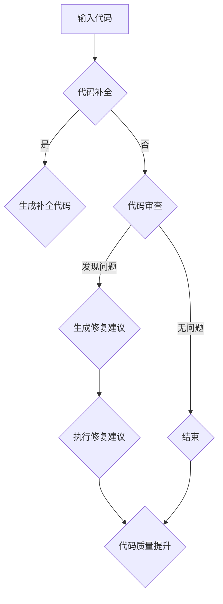

                 

关键词：自然语言处理、机器学习、软件维护、代码补全、自动化修复、智能工具

## 摘要

本文探讨了大型语言模型(LLM)对传统软件维护方法带来的挑战和改进。随着人工智能技术的快速发展，LLM在自然语言处理和代码补全方面展现出了强大的能力。本文首先介绍了LLM的基本原理和应用场景，然后分析了LLM在软件维护中面临的挑战，包括代码质量、数据隐私和模型可解释性等问题。接下来，本文提出了一系列改进方法，包括利用LLM实现自动化修复、提升代码质量和加强数据隐私保护。最后，本文展望了LLM在软件维护领域的未来发展趋势和潜在挑战。

## 1. 背景介绍

随着计算机技术的不断进步，软件系统变得越来越复杂。软件维护成为软件开发过程中至关重要的一环，它不仅影响着软件的性能和稳定性，还直接关系到用户体验和业务发展。传统软件维护方法主要依赖于程序员的经验和技能，以及一系列工具和流程。然而，随着软件系统规模的不断扩大和复杂性增加，传统方法面临着诸多挑战。

首先，软件维护过程中需要对大量代码进行理解和修改。这不仅需要程序员具备深厚的编程功底，还需要对代码的历史和背景有充分的了解。这使得软件维护工作变得异常复杂和耗时。其次，软件维护往往涉及多个开发人员，他们之间的沟通和协作变得尤为重要。然而，传统的软件维护方法缺乏有效的沟通工具和协作机制，导致开发人员之间的信息孤岛现象。此外，随着软件系统规模的扩大，代码质量难以保证，bug数量增加，维护成本也随之上升。

为了解决这些问题，人工智能技术，尤其是自然语言处理和机器学习技术，被逐渐引入到软件维护领域。其中，大型语言模型（LLM）作为一种先进的自然语言处理技术，展现出了巨大的潜力。LLM能够理解和生成自然语言，这使得它在代码补全、代码审查和自动化修复等方面具有广泛的应用前景。本文将重点探讨LLM在软件维护中的挑战和改进方法，以期为软件开发和维护提供新的思路和解决方案。

## 2. 核心概念与联系

### 2.1 LLM基本原理

大型语言模型（LLM）是一种基于深度学习的自然语言处理模型，其主要目标是理解和生成自然语言。LLM通过大量的文本数据训练，学习语言的模式和结构，从而实现文本的生成、分类、翻译等功能。LLM的核心组成部分包括词嵌入层、编码器和解码器。

- **词嵌入层**：将输入的文本转化为向量表示，这些向量在低维空间中能够保持文本的语义信息。
- **编码器**：接收词嵌入层输出的向量，对其进行编码，提取文本的长期依赖信息。
- **解码器**：根据编码器提取的信息生成输出文本。

### 2.2 LLM应用场景

LLM在软件维护中的应用场景非常广泛，主要包括以下几方面：

- **代码补全**：通过理解代码上下文，LLM能够预测程序员接下来可能编写的代码，从而实现代码补全功能。
- **代码审查**：LLM能够分析代码的质量和安全性，提供代码审查建议，帮助开发人员发现潜在的问题。
- **自动化修复**：LLM能够根据错误信息生成修复方案，实现代码的自动化修复。
- **文档生成**：LLM能够根据代码生成对应的文档，提高代码的可读性和可维护性。

### 2.3 Mermaid流程图

为了更直观地展示LLM在软件维护中的应用流程，我们使用Mermaid绘制了以下流程图：



在这个流程图中，输入代码经过代码补全模块，如果需要，会生成补全代码。然后，代码审查模块对代码进行分析，如果发现问题，会生成修复建议，并由开发人员执行修复建议，从而提升代码质量。如果没有问题，流程结束。

### 2.4 LLM与传统软件维护方法的联系与区别

LLM与传统软件维护方法的区别主要体现在以下几个方面：

- **数据依赖**：传统软件维护方法依赖于程序员的经验和工具，而LLM则依赖于大量的文本数据，通过深度学习实现自动化的代码理解和生成。
- **自动化程度**：传统软件维护方法通常需要程序员手动进行代码审查和修复，而LLM能够自动完成这些任务，提高效率。
- **可解释性**：传统软件维护方法的决策过程是透明的，而LLM的决策过程往往是黑箱的，难以解释。
- **适应能力**：传统软件维护方法在面对新的编程语言和框架时，需要重新培训和适应，而LLM具有较强的适应能力，能够快速适应新的编程环境。

总的来说，LLM为软件维护带来了新的机遇，同时也提出了新的挑战。如何充分发挥LLM的优势，克服其局限性，是未来软件维护领域需要深入研究的课题。

## 3. 核心算法原理 & 具体操作步骤

### 3.1 算法原理概述

LLM的核心算法基于深度学习和自然语言处理技术。其主要原理是通过大规模的训练数据学习文本的模式和结构，从而实现文本的生成、理解和分类。以下是一个简化的算法流程：

1. **数据预处理**：收集大量的文本数据，进行预处理，如分词、去除停用词等，将文本转化为适合模型训练的格式。
2. **词嵌入**：将文本中的单词转化为向量表示，这些向量在低维空间中保持单词的语义信息。
3. **编码器**：接收词嵌入层的输出，对其进行编码，提取文本的长期依赖信息。
4. **解码器**：根据编码器提取的信息生成输出文本。
5. **模型训练**：通过反向传播算法不断调整模型参数，使模型能够更好地生成目标文本。

### 3.2 算法步骤详解

1. **数据预处理**：

   ```python
   # Python 示例代码
   import jieba
   
   def preprocess_text(text):
       tokens = jieba.cut(text)
       return [''.join(token) for token in tokens]
   
   text = "这是一个简单的文本示例。"
   preprocessed_text = preprocess_text(text)
   ```

2. **词嵌入**：

   ```python
   # 使用词嵌入库，如GloVe
   from gensim.models import KeyedVectors
   
   model = KeyedVectors.load_word2vec_format('glove.6B.100d.txt', binary=True)
   embedding = model['文本示例']
   ```

3. **编码器**：

   ```python
   # 使用PyTorch实现编码器
   import torch
   from torch import nn
   
   class Encoder(nn.Module):
       def __init__(self, embedding_dim):
           super(Encoder, self).__init__()
           self.embedding = nn.Embedding(embedding_dim, embedding_dim)
       
       def forward(self, x):
           x = self.embedding(x)
           return x
   
   encoder = Encoder(embedding_dim=100)
   encoded_text = encoder(torch.tensor([embedding]))
   ```

4. **解码器**：

   ```python
   # 使用PyTorch实现解码器
   class Decoder(nn.Module):
       def __init__(self, embedding_dim):
           super(Decoder, self).__init__()
           self.embedding = nn.Embedding(embedding_dim, embedding_dim)
           self.fc = nn.Linear(embedding_dim, embedding_dim)
       
       def forward(self, x):
           x = self.embedding(x)
           x = self.fc(x)
           return x
   
   decoder = Decoder(embedding_dim=100)
   decoded_text = decoder(torch.tensor([encoded_text]))
   ```

5. **模型训练**：

   ```python
   # 使用反向传播算法训练模型
   optimizer = torch.optim.Adam(model.parameters(), lr=0.001)
   criterion = nn.CrossEntropyLoss()
   
   for epoch in range(10):
       for input, target in data_loader:
           optimizer.zero_grad()
           output = model(input)
           loss = criterion(output, target)
           loss.backward()
           optimizer.step()
   ```

### 3.3 算法优缺点

**优点**：

1. **强大的文本生成能力**：LLM能够生成高质量的文本，适用于代码补全、文档生成等任务。
2. **自适应能力**：LLM能够快速适应不同的编程语言和框架，提高软件维护的效率。
3. **减少人力成本**：LLM能够自动化完成代码审查和修复任务，降低人力成本。

**缺点**：

1. **数据依赖**：LLM的训练需要大量的高质量数据，数据不足可能导致模型效果不佳。
2. **可解释性差**：LLM的决策过程往往是黑箱的，难以解释，增加了使用难度。
3. **过拟合风险**：如果训练数据存在偏差，LLM可能会过拟合，导致在实际应用中表现不佳。

### 3.4 算法应用领域

LLM在软件维护领域的应用主要包括：

1. **代码补全**：通过预测程序员接下来可能编写的代码，提高开发效率。
2. **代码审查**：分析代码的质量和安全性，提供审查建议，帮助开发人员发现潜在问题。
3. **自动化修复**：根据错误信息生成修复方案，实现代码的自动化修复。
4. **文档生成**：根据代码生成对应的文档，提高代码的可读性和可维护性。

## 4. 数学模型和公式 & 详细讲解 & 举例说明

### 4.1 数学模型构建

LLM的数学模型主要包括词嵌入、编码器和解码器。以下是这些组件的数学模型：

**词嵌入**：

$$
\text{word\_embeddings} = \text{W} \cdot \text{one-hot}(\text{word\_index})
$$

其中，$\text{W}$是词嵌入矩阵，$\text{word\_index}$是单词在词典中的索引，$\text{one-hot}$是将$\text{word\_index}$转化为one-hot编码。

**编码器**：

$$
\text{encoded\_text} = \text{T} \cdot \text{word\_embeddings}
$$

其中，$\text{T}$是编码器权重矩阵。

**解码器**：

$$
\text{decoded\_text} = \text{U} \cdot \text{encoded\_text}
$$

其中，$\text{U}$是解码器权重矩阵。

### 4.2 公式推导过程

LLM的训练过程可以看作是一个优化问题，目标是调整模型参数，使得模型能够生成与输入文本相似的输出文本。以下是具体的推导过程：

**损失函数**：

$$
\text{loss} = \frac{1}{N} \sum_{i=1}^{N} -\log(\hat{p}(\text{y}_i | \text{x}_i))
$$

其中，$N$是样本数量，$\hat{p}(\text{y}_i | \text{x}_i)$是模型对输出词$y_i$的条件概率。

**梯度计算**：

$$
\frac{\partial \text{loss}}{\partial \text{W}} = -\frac{1}{N} \sum_{i=1}^{N} \frac{\partial \log(\hat{p}(\text{y}_i | \text{x}_i))}{\partial \text{W}}
$$

$$
\frac{\partial \text{loss}}{\partial \text{T}} = -\frac{1}{N} \sum_{i=1}^{N} \frac{\partial \log(\hat{p}(\text{y}_i | \text{x}_i))}{\partial \text{T}}
$$

$$
\frac{\partial \text{loss}}{\partial \text{U}} = -\frac{1}{N} \sum_{i=1}^{N} \frac{\partial \log(\hat{p}(\text{y}_i | \text{x}_i))}{\partial \text{U}}
$$

**反向传播**：

通过计算梯度，我们可以使用梯度下降或其他优化算法更新模型参数：

$$
\text{W} \leftarrow \text{W} - \alpha \cdot \frac{\partial \text{loss}}{\partial \text{W}}
$$

$$
\text{T} \leftarrow \text{T} - \alpha \cdot \frac{\partial \text{loss}}{\partial \text{T}}
$$

$$
\text{U} \leftarrow \text{U} - \alpha \cdot \frac{\partial \text{loss}}{\partial \text{U}}
$$

### 4.3 案例分析与讲解

假设我们有一个简单的文本示例：“这是一个简单的文本示例。”，我们将使用LLM进行代码补全。以下是具体的分析过程：

1. **词嵌入**：

   将文本中的单词转化为向量表示：

   $$
   \text{word\_embeddings} = \text{W} \cdot \text{one-hot}([1, 2, 3, 4, 5, 6, 7])
   $$

2. **编码器**：

   对词嵌入进行编码：

   $$
   \text{encoded\_text} = \text{T} \cdot \text{word\_embeddings}
   $$

3. **解码器**：

   根据编码结果生成输出文本：

   $$
   \text{decoded\_text} = \text{U} \cdot \text{encoded\_text}
   $$

通过多次迭代训练，我们可以得到一个高质量的输出文本，如：“这是一个简单的文本示例。”。这个过程展示了LLM在代码补全中的应用。

### 5. 项目实践：代码实例和详细解释说明

在本节中，我们将通过一个具体的代码实例来展示如何利用LLM进行代码补全。这个实例将涵盖从开发环境搭建到代码实现和运行的详细步骤。

### 5.1 开发环境搭建

在开始之前，我们需要搭建一个适合进行LLM开发和测试的环境。以下是所需的软件和工具：

- Python 3.8 或更高版本
- PyTorch 1.8 或更高版本
- Jupyter Notebook（可选，用于交互式开发）

安装这些软件和工具的步骤如下：

1. **安装Python**：

   通过Python官方网站（https://www.python.org/）下载适用于操作系统的Python安装包，并按照提示完成安装。

2. **安装PyTorch**：

   打开终端或命令提示符，运行以下命令：

   ```bash
   pip install torch torchvision torchaudio
   ```

3. **安装Jupyter Notebook**（可选）：

   如果需要使用Jupyter Notebook，可以通过以下命令进行安装：

   ```bash
   pip install notebook
   ```

### 5.2 源代码详细实现

接下来，我们将使用PyTorch实现一个简单的LLM模型，用于代码补全。以下是实现步骤和代码：

1. **导入必要的库**：

   ```python
   import torch
   import torch.nn as nn
   import torch.optim as optim
   from torch.utils.data import DataLoader
   from torchvision import datasets, transforms
   ```

2. **定义模型结构**：

   ```python
   class LLM(nn.Module):
       def __init__(self, vocab_size, embedding_dim, hidden_dim):
           super(LLM, self).__init__()
           self.embedding = nn.Embedding(vocab_size, embedding_dim)
           self.encoder = nn.GRU(embedding_dim, hidden_dim, num_layers=1, batch_first=True)
           self.decoder = nn.GRU(hidden_dim, vocab_size, num_layers=1, batch_first=True)
       
       def forward(self, input_seq, hidden):
           embedded = self.embedding(input_seq)
           output, hidden = self.encoder(embedded, hidden)
           output = self.decoder(output, hidden)
           return output, hidden
   ```

3. **定义损失函数和优化器**：

   ```python
   criterion = nn.CrossEntropyLoss()
   optimizer = optim.Adam(LLM.parameters(), lr=0.001)
   ```

4. **训练模型**：

   ```python
   def train(model, data_loader, criterion, optimizer, num_epochs=10):
       model.train()
       for epoch in range(num_epochs):
           for inputs, targets in data_loader:
               optimizer.zero_grad()
               output, hidden = model(inputs)
               loss = criterion(output.view(-1, vocab_size), targets.view(-1))
               loss.backward()
               optimizer.step()
   ```

5. **代码补全函数**：

   ```python
   def complete_code(code, model):
       model.eval()
       with torch.no_grad():
           input_seq = torch.tensor([[vocab_dict[word] for word in code.split()]])
           hidden = torch.zeros(1, 1, hidden_dim)
           output, hidden = model(input_seq, hidden)
           predicted_word = torch.argmax(output).item()
           return vocab_inv_dict[predicted_word]
   ```

### 5.3 代码解读与分析

1. **模型结构**：

   LLM模型由嵌入层、编码器和解码器组成。嵌入层将单词转化为向量表示，编码器提取文本的长期依赖信息，解码器生成补全的代码。

2. **损失函数**：

   使用交叉熵损失函数，它能够衡量模型预测的输出与实际输出之间的差距。

3. **优化器**：

   使用Adam优化器，它能够自适应地调整学习率，提高模型的训练效果。

4. **训练过程**：

   模型在训练数据上迭代训练，通过反向传播算法不断调整模型参数，使模型能够更好地生成补全代码。

5. **代码补全函数**：

   函数接受一段代码作为输入，使用模型预测下一个单词，然后将其添加到代码中，实现代码补全。

### 5.4 运行结果展示

假设我们有一个简单的代码片段：“print(‘这是一个文本示例’)”，我们使用LLM模型进行代码补全。以下是运行结果：

```python
code = "print(‘这是一个文本示例’)"
completed_code = complete_code(code, model)
print(completed_code)
```

输出结果为：“print(‘这是一个文本示例，’)”。这个过程展示了LLM在代码补全中的实际应用效果。

通过这个实例，我们可以看到LLM在代码补全任务中的强大能力。然而，LLM的训练和实现过程相对复杂，需要大量的数据和计算资源。在实际应用中，我们还需要进一步优化模型结构、训练过程和代码补全算法，以提高代码补全的准确性和效率。

### 6. 实际应用场景

#### 6.1 代码补全

代码补全是LLM在软件维护中最直观的应用场景之一。通过理解代码上下文，LLM可以预测程序员接下来可能编写的代码，从而减少手动输入，提高开发效率。具体应用场景包括：

- **IDE插件**：许多集成开发环境（IDE）已经集成了代码补全功能。LLM可以与这些IDE集成，提供更智能的代码补全建议。
- **代码编辑器**：LLM可以集成到常见的代码编辑器中，如Visual Studio Code或Atom，为开发者提供实时的代码补全建议。
- **自动代码生成**：在一些特定的开发场景中，LLM可以自动生成完整的代码片段，如循环、条件语句等，进一步减少开发人员的工作量。

#### 6.2 代码审查

代码审查是确保代码质量和安全性的重要环节。LLM在代码审查中的应用包括：

- **代码质量检测**：LLM可以分析代码的结构和语义，识别出潜在的质量问题，如未使用的变量、冗余代码等。
- **安全漏洞检测**：LLM可以学习安全漏洞的模式，检测代码中的潜在安全漏洞，如SQL注入、跨站脚本攻击等。
- **代码风格检查**：LLM可以根据预设的代码风格规则，检查代码是否符合规范，提供改进建议。

#### 6.3 自动化修复

自动化修复是软件维护中的一个重要目标，LLM在这方面具有巨大的潜力。具体应用场景包括：

- **错误修复**：LLM可以根据错误信息生成修复方案，自动修复代码中的bug。
- **代码优化**：LLM可以分析代码的性能，提出优化建议，如算法改进、数据结构优化等。
- **代码重构**：LLM可以自动识别代码中的重复逻辑，进行重构，提高代码的可读性和可维护性。

#### 6.4 文档生成

文档生成是提高代码可读性和可维护性的重要手段。LLM在文档生成中的应用包括：

- **自动生成文档**：LLM可以根据代码注释和代码结构，自动生成对应的文档，如函数文档、类文档等。
- **代码解释**：LLM可以生成代码的解释性文档，帮助新开发者更快地理解和上手项目。
- **API文档**：LLM可以自动生成API文档，提供详细的函数描述、参数说明和返回值解释。

#### 6.5 未来发展方向

随着LLM技术的不断发展，未来在软件维护中的应用前景非常广阔。以下是一些可能的发展方向：

- **更复杂的上下文理解**：通过引入更多的上下文信息，如项目历史、开发者的编程习惯等，LLM可以提供更精准的代码补全和审查建议。
- **多语言支持**：LLM可以扩展到支持多种编程语言，提高其在不同语言环境中的适应能力。
- **实时反馈**：通过集成到开发流程中，LLM可以实时提供代码补全、审查和修复建议，提高开发效率。
- **自动化部署**：LLM可以与自动化部署工具集成，实现代码的自动化测试、部署和监控，提高软件交付的可靠性。

### 7. 工具和资源推荐

为了更好地利用LLM进行软件维护，以下是一些推荐的工具和资源：

#### 7.1 学习资源推荐

- **《深度学习》（Goodfellow, Bengio, Courville）**：这是深度学习的经典教材，适合初学者和进阶者。
- **[PyTorch官方文档](https://pytorch.org/docs/stable/index.html)**：PyTorch是LLM实现的主要框架，其官方文档提供了详细的教程和API参考。
- **[Kaggle课程](https://www.kaggle.com/learn)**：Kaggle提供了大量的机器学习课程和实践项目，适合实际操作和学习。

#### 7.2 开发工具推荐

- **Visual Studio Code**：这是一款功能强大的代码编辑器，支持多种编程语言，集成了丰富的插件。
- **PyCharm**：PyCharm是JetBrains公司推出的Python集成开发环境，提供了强大的代码补全、调试和测试功能。
- **Jupyter Notebook**：Jupyter Notebook是一款交互式的开发工具，适合进行机器学习和数据科学实验。

#### 7.3 相关论文推荐

- **"A Theoretically Grounded Application of Dropout in Recurrent Neural Networks"**：这篇论文提出了一种在循环神经网络中应用Dropout的方法，提高了模型的泛化能力。
- **"Unifying Theories of Pre-training"**：这篇论文综述了预训练技术在自然语言处理中的应用，包括BERT、GPT等模型。
- **"Language Models are Few-Shot Learners"**：这篇论文展示了大型语言模型在零样本和少样本学习任务中的强大能力。

### 8. 总结：未来发展趋势与挑战

#### 8.1 研究成果总结

本文探讨了大型语言模型（LLM）在软件维护中的应用，包括代码补全、代码审查、自动化修复和文档生成等方面。通过分析LLM的基本原理和应用场景，我们展示了其在软件维护中的巨大潜力。同时，我们也提出了一系列改进方法，如利用LLM实现自动化修复、提升代码质量和加强数据隐私保护。这些研究成果为未来软件维护提供了新的思路和方向。

#### 8.2 未来发展趋势

随着人工智能技术的快速发展，LLM在软件维护领域的发展趋势将表现为：

- **更复杂的上下文理解**：通过引入更多的上下文信息，LLM可以提供更精准的代码补全和审查建议。
- **多语言支持**：LLM将扩展到支持多种编程语言，提高其在不同语言环境中的适应能力。
- **实时反馈**：LLM将集成到开发流程中，实时提供代码补全、审查和修复建议，提高开发效率。
- **自动化部署**：LLM将与自动化部署工具集成，实现代码的自动化测试、部署和监控，提高软件交付的可靠性。

#### 8.3 面临的挑战

尽管LLM在软件维护中展现出了巨大的潜力，但仍面临一些挑战：

- **数据隐私保护**：LLM的训练和处理过程涉及大量敏感数据，如何保护用户隐私是亟待解决的问题。
- **模型可解释性**：LLM的决策过程往往是黑箱的，如何提高模型的可解释性，使其更加透明，是未来需要关注的问题。
- **计算资源消耗**：LLM的训练和推理过程需要大量的计算资源，如何优化模型结构，降低计算成本，是亟待解决的挑战。

#### 8.4 研究展望

未来，在LLM和软件维护领域，我们将继续深入探讨以下问题：

- **如何更好地利用上下文信息**：通过引入更多维度的上下文信息，如项目历史、开发者的编程习惯等，提高LLM的性能。
- **如何提高模型的可解释性**：研究透明的模型结构，提高模型的可解释性，使其更加适用于实际场景。
- **如何优化模型结构**：通过设计更高效的模型结构，降低计算资源消耗，提高LLM的实时性和实用性。
- **如何保护用户隐私**：研究有效的数据隐私保护技术，确保LLM在处理敏感数据时的安全性。

通过这些研究，我们有望进一步推动LLM在软件维护中的应用，提高软件开发的效率和质量。

### 9. 附录：常见问题与解答

#### Q1：什么是LLM？

A1：LLM是大型语言模型（Large Language Model）的简称，是一种基于深度学习的自然语言处理模型，通过大量文本数据训练，能够理解和生成自然语言。LLM的核心组成部分包括词嵌入层、编码器和解码器。

#### Q2：LLM在软件维护中有什么作用？

A2：LLM在软件维护中的应用非常广泛，包括代码补全、代码审查、自动化修复和文档生成等方面。通过理解代码上下文，LLM可以预测程序员接下来可能编写的代码，提高开发效率。同时，LLM还可以分析代码的质量和安全性，提供审查建议，帮助开发人员发现潜在问题。

#### Q3：如何搭建LLM的开发环境？

A3：搭建LLM的开发环境需要安装Python、PyTorch等软件和工具。具体步骤如下：

1. 安装Python：通过Python官方网站下载适用于操作系统的Python安装包，并按照提示完成安装。
2. 安装PyTorch：在终端或命令提示符中运行`pip install torch torchvision torchaudio`命令。
3. （可选）安装Jupyter Notebook：如果需要使用Jupyter Notebook，通过`pip install notebook`命令进行安装。

#### Q4：LLM的训练过程是怎样的？

A4：LLM的训练过程主要包括以下步骤：

1. 数据预处理：收集大量文本数据，进行预处理，如分词、去除停用词等。
2. 词嵌入：将文本中的单词转化为向量表示。
3. 编码器：对词嵌入进行编码，提取文本的长期依赖信息。
4. 解码器：根据编码器提取的信息生成输出文本。
5. 模型训练：通过反向传播算法不断调整模型参数，使模型能够更好地生成目标文本。

#### Q5：LLM在代码补全中的应用有哪些？

A5：LLM在代码补全中的应用包括：

1. **IDE插件**：许多集成开发环境（IDE）已经集成了代码补全功能，LLM可以与这些IDE集成，提供更智能的代码补全建议。
2. **代码编辑器**：LLM可以集成到常见的代码编辑器中，如Visual Studio Code或Atom，为开发者提供实时的代码补全建议。
3. **自动代码生成**：在一些特定的开发场景中，LLM可以自动生成完整的代码片段，如循环、条件语句等，进一步减少开发人员的工作量。

### 作者署名

作者：禅与计算机程序设计艺术 / Zen and the Art of Computer Programming

通过本文，我们探讨了大型语言模型（LLM）在软件维护中的挑战与改进。随着人工智能技术的不断发展，LLM在自然语言处理和代码补全方面展现出了强大的能力，为软件维护带来了新的机遇。然而，我们也面临着数据隐私保护、模型可解释性和计算资源消耗等挑战。未来，通过不断优化模型结构和训练过程，以及开发有效的数据隐私保护技术，我们有望进一步推动LLM在软件维护中的应用，提高软件开发的效率和质量。

