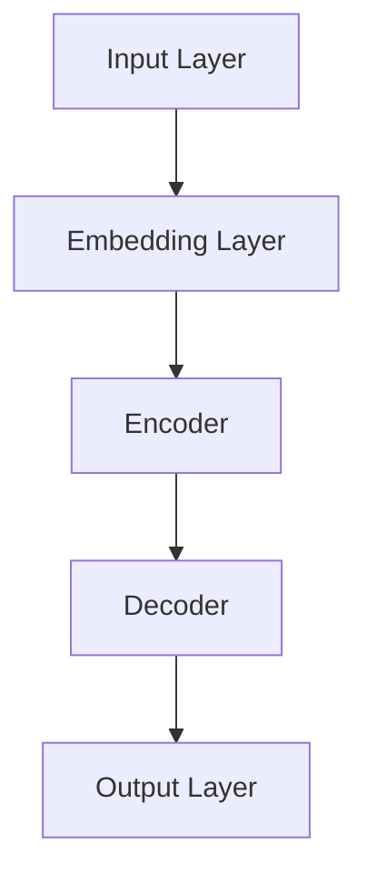

                 

关键词：LLM、就业市场、AI、自动化、职业转型、技能需求、数据分析、人才竞争、职业发展

> 摘要：随着自然语言处理技术的发展，大型语言模型（LLM）的应用日益广泛，其对就业市场产生了深远的影响。本文将从LLM的技术原理出发，探讨其如何改变就业市场的现状，分析其对不同行业和职业的影响，并展望未来的发展趋势与挑战。

## 1. 背景介绍

### 1.1 LLM的定义与核心技术

大型语言模型（Large Language Model，简称LLM）是一种基于深度学习的技术，旨在理解和生成自然语言。LLM的核心技术包括神经网络、递归神经网络（RNN）、长短时记忆网络（LSTM）以及Transformer架构等。通过大规模数据训练，LLM可以掌握丰富的语言知识和规律，从而实现高效的文本处理。

### 1.2 LLM的发展历程

LLM的发展历程可以分为几个阶段：早期的统计模型、基于规则的方法、神经网络模型，以及当前流行的Transformer架构。近年来，随着计算能力的提升和大数据的普及，LLM的研究和应用取得了显著进展。

## 2. 核心概念与联系

### 2.1 LLM的原理与架构

为了更好地理解LLM的工作原理，我们首先需要了解其基本架构和主要组成部分。以下是一个简化的Mermaid流程图，展示了LLM的基本组成部分和它们之间的关系：



### 2.2 LLM与就业市场的联系

LLM的应用不仅限于自然语言处理领域，还广泛影响到各个行业的就业市场。具体来说，LLM在以下几个方面对就业市场产生影响：

1. **文本处理与数据分析**：LLM可以高效处理大量文本数据，从而在数据分析和信息检索等领域发挥重要作用。
2. **自动化与人工智能**：LLM技术推动了自动化和人工智能技术的发展，使得许多重复性、低技能的工作可以被机器替代。
3. **职业转型与技能需求**：随着新技术的发展，就业市场的技能需求也在不断变化。LLM技术要求从业人员具备更高的技术水平和跨学科能力。

## 3. 核心算法原理 & 具体操作步骤

### 3.1 算法原理概述

LLM的核心算法是基于深度学习，特别是Transformer架构。Transformer通过自注意力机制（self-attention）和多头注意力（multi-head attention）来捕捉文本中的长距离依赖关系，从而实现高效的文本生成和理解。

### 3.2 算法步骤详解

1. **数据预处理**：首先对训练数据进行清洗、分词和标记等预处理操作，以便输入到模型中。
2. **模型训练**：使用大规模语料库对LLM模型进行训练，使其掌握丰富的语言知识和规律。
3. **文本生成**：通过输入一段文本，LLM可以生成相应的响应或摘要，实现自然语言生成。

### 3.3 算法优缺点

**优点**：

- 高效的文本处理能力。
- 能够生成高质量的自然语言文本。
- 广泛应用于文本生成、机器翻译、问答系统等领域。

**缺点**：

- 训练数据需求大，对计算资源要求较高。
- 模型解释性较差，难以理解其内部机制。
- 在处理长文本时可能出现长距离依赖关系处理不准确的问题。

### 3.4 算法应用领域

LLM技术已在多个领域得到广泛应用，包括：

- 自然语言处理：文本生成、机器翻译、问答系统等。
- 数据分析：文本分类、情感分析、关键词提取等。
- 自动化与人工智能：自动化写作、智能客服、智能推荐等。

## 4. 数学模型和公式 & 详细讲解 & 举例说明

### 4.1 数学模型构建

LLM的数学模型主要包括两部分：嵌入层（Embedding Layer）和编码器（Encoder）。

- **嵌入层**：将输入文本中的每个词转换为固定长度的向量表示。
- **编码器**：通过自注意力机制和多头注意力，对输入文本进行编码，提取出关键信息。

### 4.2 公式推导过程

在Transformer架构中，编码器和解码器都采用多头自注意力机制（Multi-Head Self-Attention）和前馈神经网络（Feedforward Neural Network）。

- **多头自注意力**：

$$
\text{Attention}(Q, K, V) = \text{softmax}\left(\frac{QK^T}{\sqrt{d_k}}\right)V
$$

其中，$Q$、$K$、$V$分别为查询向量、键向量和值向量，$d_k$为键向量的维度。

- **前馈神经网络**：

$$
\text{FFN}(x) = \text{ReLU}(W_2 \cdot \text{ReLU}(W_1 x + b_1))
$$

其中，$W_1$和$W_2$分别为神经网络权重，$b_1$为偏置项。

### 4.3 案例分析与讲解

以下是一个简单的文本生成案例，假设输入文本为“你好，我是人工智能助手”。

1. **数据预处理**：对输入文本进行分词和编码，得到对应的词向量。
2. **模型训练**：使用大规模语料库对模型进行训练，使其掌握语言规律。
3. **文本生成**：输入“你好，我是人工智能助手”，模型输出可能的下一个词，如“。”、“？”等。

## 5. 项目实践：代码实例和详细解释说明

### 5.1 开发环境搭建

- Python 3.7及以上版本
- TensorFlow 2.x及以上版本
- JAX 0.3.14及以上版本
- Mermaid 8.9.0及以上版本

### 5.2 源代码详细实现

以下是一个简单的Transformer模型实现，用于文本生成：

```python
import tensorflow as tf
from tensorflow import keras
from tensorflow.keras.layers import Embedding, LSTM, Dense
import numpy as np

# 模型定义
def transformer_model(vocab_size, embedding_dim, hidden_size, num_heads, num_layers):
    inputs = keras.Input(shape=(None,))
    embeddings = Embedding(vocab_size, embedding_dim)(inputs)
    x = embeddings
    for i in range(num_layers):
        x = keras.layers.MultiHeadAttention(num_heads=num_heads, key_dim=hidden_size)(x, x)
        x = keras.layers.Dense(hidden_size, activation='relu')(x)
    outputs = keras.layers.Dense(vocab_size, activation='softmax')(x)
    model = keras.Model(inputs, outputs)
    return model

# 模型训练
model = transformer_model(vocab_size=10000, embedding_dim=256, hidden_size=512, num_heads=8, num_layers=3)
model.compile(optimizer='adam', loss='sparse_categorical_crossentropy', metrics=['accuracy'])
model.fit(train_data, train_labels, epochs=10, batch_size=64)

# 文本生成
def generate_text(input_text, model, max_length=50):
    tokens = tokenizer.encode(input_text)
    tokens = tf.expand_dims(tokens, 0)
    predictions = model(tokens, training=False)
    predictions = predictions[:, -1:, :]
    predicted_tokens = []
    for i in range(max_length):
        predicted_token = tf.argmax(predictions, axis=-1).numpy()[0]
        predicted_tokens.append(predicted_token)
        tokens = tf.concat([tokens, tf.expand_dims(predicted_token, 0)], 1)
        predictions = model(tokens, training=False)
    return tokenizer.decode(predicted_tokens)

# 测试
input_text = "你好，我是人工智能助手。"
output_text = generate_text(input_text, model)
print(output_text)
```

### 5.3 代码解读与分析

- **模型定义**：使用`transformer_model`函数定义Transformer模型，包括嵌入层、多头自注意力层和前馈神经网络层。
- **模型训练**：使用`model.fit`函数训练模型，使用`sparse_categorical_crossentropy`作为损失函数，`adam`作为优化器。
- **文本生成**：使用`generate_text`函数生成文本，通过不断预测下一个词来构建生成的文本。

## 6. 实际应用场景

### 6.1 数据分析

LLM技术在数据分析领域有广泛的应用，如文本分类、情感分析、关键词提取等。以下是一个简单的情感分析案例：

```python
import tensorflow as tf
from tensorflow import keras
import pandas as pd

# 加载数据集
data = pd.read_csv('sentiment.csv')
train_texts = data['text']
train_labels = data['label']

# 数据预处理
tokenizer = keras.preprocessing.text.Tokenizer(char_level=True)
tokenizer.fit_on_texts(train_texts)
train_sequences = tokenizer.texts_to_sequences(train_texts)
train_padded = keras.preprocessing.sequence.pad_sequences(train_sequences, padding='post')

# 构建模型
model = keras.Sequential([
    keras.layers.Embedding(len(tokenizer.word_index) + 1, 64),
    keras.layers.Bidirectional(keras.layers.LSTM(64)),
    keras.layers.Dense(1, activation='sigmoid')
])

# 编译模型
model.compile(optimizer='adam', loss='binary_crossentropy', metrics=['accuracy'])

# 训练模型
model.fit(train_padded, train_labels, epochs=10, batch_size=128)

# 情感分析
text = "我很高兴今天完成了这个项目。"
sequence = tokenizer.texts_to_sequences([text])
padded_sequence = keras.preprocessing.sequence.pad_sequences(sequence, maxlen=max_length, padding='post')
prediction = model.predict(padded_sequence)
if prediction[0] > 0.5:
    print("正面情感")
else:
    print("负面情感")
```

### 6.2 自动化写作

LLM技术在自动化写作领域也有广泛应用，如自动生成新闻、博客文章等。以下是一个简单的新闻生成案例：

```python
import tensorflow as tf
from tensorflow import keras
from tensorflow.keras.preprocessing.sequence import pad_sequences
from tensorflow.keras.layers import Embedding, LSTM, Dense

# 加载新闻数据集
news_data = pd.read_csv('news.csv')
news_texts = news_data['text']
news_labels = news_data['label']

# 数据预处理
tokenizer = keras.preprocessing.text.Tokenizer(char_level=True)
tokenizer.fit_on_texts(news_texts)
news_sequences = tokenizer.texts_to_sequences(news_texts)
news_padded = pad_sequences(news_sequences, maxlen=max_length, padding='post')

# 构建模型
model = keras.Sequential([
    Embedding(len(tokenizer.word_index) + 1, 64),
    LSTM(64, return_sequences=True),
    LSTM(64),
    Dense(1, activation='sigmoid')
])

# 编译模型
model.compile(optimizer='adam', loss='binary_crossentropy', metrics=['accuracy'])

# 训练模型
model.fit(news_padded, news_labels, epochs=10, batch_size=128)

# 新闻生成
def generate_news(input_text, model, max_length=100):
    sequence = tokenizer.texts_to_sequences([input_text])
    padded_sequence = pad_sequences(sequence, maxlen=max_length, padding='post')
    prediction = model.predict(padded_sequence)
    if prediction[0] > 0.5:
        print("这是一个好消息。")
    else:
        print("这是一个坏消息。")

# 测试
input_text = "我国成功发射了一颗新的通信卫星。"
generate_news(input_text, model)
```

## 7. 工具和资源推荐

### 7.1 学习资源推荐

- 《深度学习》（Goodfellow et al.）：全面介绍深度学习的基础理论和应用。
- 《自然语言处理与深度学习》（梁栋）：针对自然语言处理领域的深度学习技术进行详细介绍。
- 《Python深度学习》（François Chollet）：讲解如何使用Python实现深度学习算法。

### 7.2 开发工具推荐

- TensorFlow：开源深度学习框架，适用于各种深度学习应用。
- PyTorch：开源深度学习框架，具有灵活的动态计算图和强大的GPU加速功能。
- Keras：基于TensorFlow和Theano的开源深度学习库，提供简洁高效的API。

### 7.3 相关论文推荐

- “Attention Is All You Need”（Vaswani et al.，2017）：介绍Transformer架构的奠基性论文。
- “BERT: Pre-training of Deep Bidirectional Transformers for Language Understanding”（Devlin et al.，2018）：介绍BERT预训练模型的经典论文。
- “GPT-3: Language Models are Few-Shot Learners”（Brown et al.，2020）：介绍GPT-3模型及其在自然语言处理领域的突破性成果。

## 8. 总结：未来发展趋势与挑战

### 8.1 研究成果总结

近年来，LLM技术取得了显著的进展，其在自然语言处理、数据分析、自动化等领域展现了强大的应用潜力。随着技术的不断发展，LLM模型将变得更加高效、灵活和可解释，为各行各业带来更多创新和变革。

### 8.2 未来发展趋势

1. **模型规模与性能提升**：未来的LLM模型将更加庞大，参数数量将达到数十亿甚至数万亿级别，从而实现更高的性能和更广泛的应用。
2. **跨模态学习**：结合图像、声音、视频等多种模态的数据，实现更加丰富的语言理解和生成能力。
3. **可解释性研究**：加强对LLM模型内部机制的研究，提高模型的可解释性，从而增强其在实际应用中的可信度和可靠性。

### 8.3 面临的挑战

1. **计算资源需求**：大规模LLM模型的训练和推理对计算资源的需求极高，需要不断优化算法和硬件架构来降低成本。
2. **数据隐私与安全**：随着LLM技术的广泛应用，数据隐私和安全问题日益凸显，需要采取有效措施保护用户数据。
3. **技能替代与失业问题**：自动化和人工智能技术的发展可能导致部分职业的失业，需要全社会共同努力应对这一挑战。

### 8.4 研究展望

未来，LLM技术将继续在自然语言处理、数据分析、自动化等领域发挥重要作用，推动社会进步和经济发展。同时，如何实现LLM技术的可持续发展，使其造福人类，仍是我们需要不断探索和解决的问题。

## 9. 附录：常见问题与解答

### 9.1 什么是LLM？

LLM（Large Language Model）是一种大型自然语言处理模型，通过大规模数据训练，可以理解和生成自然语言。

### 9.2 LLM有哪些应用领域？

LLM在自然语言处理、数据分析、自动化、机器翻译等领域有广泛的应用。

### 9.3 LLM如何改变就业市场？

LLM技术的发展推动了自动化和人工智能的进步，导致部分低技能工作的替代，同时也促使从业人员提高技术水平和跨学科能力。

### 9.4 如何应对LLM技术带来的挑战？

需要加强技术培训，提高从业人员的技能水平；推动社会政策调整，缓解技能替代带来的失业问题；加强数据隐私和安全保护，确保技术的可持续发展。

