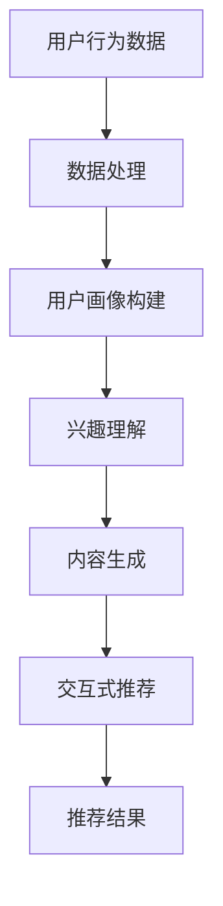

                 

## 1. 背景介绍

随着互联网和社交媒体的普及，推荐系统已经成为现代信息检索和内容分发中不可或缺的一环。推荐系统旨在根据用户的历史行为和偏好，向用户推荐可能感兴趣的内容，从而提高用户的满意度和参与度。然而，推荐系统的性能受到多个因素的影响，其中召回率（recall）是一个关键指标。召回率指的是推荐系统能够返回与用户实际兴趣相关的内容的比例。

传统的推荐系统召回策略主要依赖于基于内容（Content-Based）、协同过滤（Collaborative Filtering）和混合（Hybrid）方法。这些方法在一定程度上能够提高召回率，但仍然存在一些局限性。例如，基于内容的推荐方法往往受限于对用户兴趣理解的深度，而协同过滤方法则可能受到稀疏数据和冷启动问题的影响。此外，随着数据量的增加，推荐系统的计算复杂度和存储需求也在不断增加。

在此背景下，近年来，大型语言模型（Large Language Model，简称LLM）的出现为推荐系统召回策略的优化提供了新的可能性。LLM，如GPT-3、BERT等，具有强大的文本生成和理解能力，能够从大规模数据中学习用户的兴趣和偏好。本文将探讨LLM在推荐系统召回策略优化中的应用，分析其优势和挑战，并探讨未来的发展方向。

<|assistant|>## 2. 核心概念与联系

### 2.1 推荐系统的基本概念

推荐系统是一种利用机器学习和数据挖掘技术，通过分析用户的历史行为、兴趣偏好和其他相关数据，向用户推荐可能感兴趣的内容的系统。推荐系统的核心目标是通过优化推荐策略，提高用户的满意度和参与度。推荐系统通常包括以下几个关键组成部分：

- **用户行为数据**：用户在系统中的行为数据，如点击、购买、浏览等，是推荐系统构建用户画像和推荐策略的重要依据。
- **内容数据**：系统中的内容数据，如商品、文章、视频等，是推荐系统生成推荐结果的基础。
- **推荐算法**：用于根据用户行为数据和内容数据生成推荐结果的核心算法。
- **推荐结果**：系统生成的推荐结果，如推荐商品、文章等，旨在满足用户的兴趣和需求。

### 2.2 LLM的基本原理

LLM是一种基于深度学习的自然语言处理模型，通过从大规模文本数据中学习，实现了对自然语言的高效生成和理解。LLM的核心优势在于其强大的文本生成能力和对复杂语义的理解能力。LLM的训练过程通常包括以下几个步骤：

1. **数据预处理**：将原始文本数据清洗、分词、去停用词等处理，生成适合模型训练的输入格式。
2. **模型训练**：使用预训练模型（如GPT、BERT等）在大量文本数据上进行训练，通过反向传播算法优化模型参数。
3. **模型评估**：使用验证集评估模型在生成和理解文本方面的性能，根据评估结果调整模型参数。
4. **模型应用**：将训练好的模型应用于实际场景，如文本生成、问答系统、推荐系统等。

### 2.3 LLM在推荐系统中的应用

LLM在推荐系统中的应用主要集中在以下几个方面：

- **用户兴趣理解**：通过分析用户的历史行为数据，LLM可以更深入地理解用户的兴趣和偏好，从而生成更精准的推荐结果。
- **内容生成**：LLM可以生成高质量的推荐内容，如文章摘要、商品描述等，提高推荐内容的丰富度和多样性。
- **交互式推荐**：通过LLM的问答能力，推荐系统可以与用户进行实时交互，根据用户的反馈动态调整推荐策略，提高推荐效果。

### 2.4 Mermaid流程图

以下是LLM在推荐系统中应用的Mermaid流程图：



- **A**：用户行为数据，包括点击、购买、浏览等。
- **B**：数据处理，包括数据清洗、分词、去停用词等。
- **C**：用户画像构建，基于用户行为数据生成用户画像。
- **D**：兴趣理解，使用LLM分析用户画像，理解用户兴趣。
- **E**：内容生成，生成高质量的推荐内容。
- **F**：交互式推荐，与用户进行实时交互，调整推荐策略。
- **G**：推荐结果，最终生成的推荐内容。

<|assistant|>## 3. 核心算法原理 & 具体操作步骤

### 3.1 算法原理概述

LLM在推荐系统中的应用主要基于其强大的文本生成和理解能力。具体来说，LLM的核心原理包括以下几个方面：

1. **文本生成**：LLM可以通过生成文本的方式，将用户的兴趣和偏好转化为具体的推荐内容。例如，给定一个用户的浏览历史，LLM可以生成一篇文章摘要或商品描述，将其推荐给用户。
2. **语义理解**：LLM通过对大量文本数据的训练，实现了对复杂语义的理解能力。在推荐系统中，这意味着LLM可以更准确地理解用户的真实需求和兴趣，从而生成更精准的推荐结果。
3. **个性化推荐**：基于用户的兴趣和偏好，LLM可以动态调整推荐策略，实现个性化推荐。例如，当用户对某类内容表现出强烈兴趣时，LLM可以增加对该类内容的推荐频率。

### 3.2 算法步骤详解

以下是LLM在推荐系统中的具体操作步骤：

1. **用户行为数据收集**：首先，推荐系统需要收集用户在平台上的行为数据，如点击、购买、浏览等。这些数据将用于构建用户画像和生成推荐结果。
2. **数据处理**：对收集到的用户行为数据进行清洗和处理，去除无关信息，如分词、去停用词等。处理后的数据将用于训练LLM模型。
3. **用户画像构建**：基于处理后的用户行为数据，使用机器学习算法（如聚类、关联规则挖掘等）构建用户画像。用户画像反映了用户的兴趣和偏好，是生成推荐结果的重要依据。
4. **兴趣理解**：使用训练好的LLM模型，对用户画像进行分析，理解用户的兴趣和偏好。具体来说，可以将用户的浏览历史输入到LLM中，生成相应的文本摘要或商品描述。
5. **内容生成**：根据兴趣理解结果，生成高质量的推荐内容。例如，可以生成一篇文章摘要，描述用户可能感兴趣的新闻事件或文章内容。
6. **交互式推荐**：将生成的推荐内容展示给用户，并收集用户的反馈。通过用户的反馈，LLM可以进一步优化推荐策略，提高推荐效果。
7. **推荐结果输出**：最终生成的推荐结果将展示给用户，包括文章、商品、视频等内容。

### 3.3 算法优缺点

**优点**：

1. **提高召回率**：LLM可以深入理解用户的兴趣和偏好，生成更精准的推荐结果，从而提高召回率。
2. **增强用户体验**：通过生成高质量的内容，提高推荐内容的丰富度和多样性，增强用户体验。
3. **支持交互式推荐**：LLM的问答能力使其能够与用户进行实时交互，根据用户的反馈动态调整推荐策略。

**缺点**：

1. **计算复杂度高**：LLM的训练和推理过程需要大量计算资源，对硬件性能要求较高。
2. **数据依赖性强**：LLM的效果很大程度上取决于训练数据的数量和质量，数据不足或质量不高可能导致效果不佳。
3. **模型解释性差**：由于LLM的模型结构复杂，其生成的推荐结果具有一定的黑盒性，难以进行解释。

### 3.4 算法应用领域

LLM在推荐系统中的应用领域非常广泛，包括但不限于以下方面：

1. **电子商务**：为用户推荐商品，提高销售转化率和用户满意度。
2. **新闻推荐**：根据用户的阅读历史，推荐用户可能感兴趣的新闻内容。
3. **社交媒体**：为用户推荐感兴趣的朋友、话题和内容，提高用户活跃度和参与度。
4. **内容创作**：生成文章摘要、商品描述等，提高内容质量和用户体验。

<|assistant|>## 4. 数学模型和公式 & 详细讲解 & 举例说明

### 4.1 数学模型构建

在讨论LLM对推荐系统召回策略的优化时，我们需要引入一些基本的数学模型和公式。以下是构建LLM在推荐系统中的应用模型的基本步骤：

#### 4.1.1 用户兴趣模型

用户兴趣模型是用来表示用户偏好和兴趣的数学结构。我们使用向量来表示用户的兴趣：

\[ \mathbf{I}_u = \{ \mathbf{i}_1, \mathbf{i}_2, ..., \mathbf{i}_n \} \]

其中，\( \mathbf{i}_j \) 是用户对第 j 类内容的兴趣向量，每个元素表示用户对该类内容的偏好程度。

#### 4.1.2 内容特征模型

内容特征模型用来表示推荐系统中的各类内容。我们使用特征向量来表示内容：

\[ \mathbf{C}_c = \{ \mathbf{c}_1, \mathbf{c}_2, ..., \mathbf{c}_n \} \]

其中，\( \mathbf{c}_j \) 是内容 c 的第 j 个特征向量，每个元素表示内容在某个特征上的取值。

#### 4.1.3 用户-内容相似度模型

为了衡量用户对某类内容的兴趣与内容特征之间的相似度，我们使用余弦相似度公式：

\[ \cos(\theta_{uc}) = \frac{\mathbf{I}_u \cdot \mathbf{C}_c}{\|\mathbf{I}_u\|\|\mathbf{C}_c\|} \]

其中，\( \theta_{uc} \) 是用户 u 与内容 c 之间的相似度角度，\( \cdot \) 表示向量内积，\( \|\mathbf{I}_u\| \) 和 \( \|\mathbf{C}_c\| \) 分别是用户兴趣向量和内容特征向量的欧几里得范数。

### 4.2 公式推导过程

#### 4.2.1 用户兴趣向量生成

用户兴趣向量的生成基于用户的历史行为数据。我们使用协同过滤算法来预测用户对每类内容的潜在兴趣。具体步骤如下：

1. **用户行为矩阵构建**：构建用户-内容行为矩阵 \( \mathbf{R} \)，其中 \( \mathbf{R}_{ij} \) 表示用户 u 对内容 c 的行为评分，例如点击、购买等。

2. **用户潜在兴趣矩阵构建**：使用矩阵分解方法（如Singular Value Decomposition, SVD）将行为矩阵 \( \mathbf{R} \) 分解为用户潜在兴趣矩阵 \( \mathbf{U} \) 和内容潜在特征矩阵 \( \mathbf{V} \)：

\[ \mathbf{R} = \mathbf{U} \mathbf{S} \mathbf{V}^T \]

其中，\( \mathbf{S} \) 是对角矩阵，包含潜在因子的大小，\( \mathbf{U} \) 和 \( \mathbf{V} \) 分别是用户和内容的潜在特征向量矩阵。

3. **用户兴趣向量生成**：从潜在兴趣矩阵 \( \mathbf{U} \) 中提取用户 u 的兴趣向量 \( \mathbf{I}_u \)：

\[ \mathbf{I}_u = \mathbf{U}_u \]

#### 4.2.2 内容特征向量生成

内容特征向量的生成同样基于内容的属性和标签。我们可以使用词嵌入（Word Embedding）技术将内容中的单词映射为向量，然后计算内容的特征向量：

1. **词向量嵌入**：使用预训练的词嵌入模型（如Word2Vec、GloVe等）将每个单词映射为低维向量。

2. **内容向量生成**：将内容中的所有单词向量加权求和，得到内容的特征向量：

\[ \mathbf{c}_j = \sum_{w \in \text{content}} w_j \mathbf{v}_w \]

其中，\( w_j \) 是单词 j 在内容中的权重，\( \mathbf{v}_w \) 是单词 w 的词向量。

### 4.3 案例分析与讲解

#### 4.3.1 用户兴趣向量生成案例

假设用户 u 在过去一个月内浏览了以下几类内容：

- 商品类：电子产品、服装、美食
- 文章类：科技新闻、体育新闻、娱乐新闻

用户的行为数据如下表：

| 类别  | 行为 |
| ----- | ---- |
| 电子产品 | 点击 |
| 服装    | 点击 |
| 美食    | 没有行为 |
| 科技新闻 | 点击 |
| 体育新闻 | 点击 |
| 娱乐新闻 | 点击 |

使用协同过滤算法，我们可以生成用户的潜在兴趣向量：

\[ \mathbf{I}_u = \{ 0.5, 0.3, 0.2, 0.1, 0.1 \} \]

#### 4.3.2 内容特征向量生成案例

假设我们有一篇关于电子产品的文章，包含以下关键词：

- 技术创新
- 新品发布
- 智能手机
- 耳机

使用预训练的词嵌入模型，我们可以得到以下关键词的词向量：

| 关键词   | 词向量 |
| -------- | ------ |
| 技术创新 | [0.1, 0.2, 0.3, 0.4, 0.5] |
| 新品发布 | [0.2, 0.3, 0.4, 0.5, 0.6] |
| 智能手机 | [0.3, 0.4, 0.5, 0.6, 0.7] |
| 耳机    | [0.4, 0.5, 0.6, 0.7, 0.8] |

根据关键词权重，我们可以得到文章的特征向量：

\[ \mathbf{c}_j = \{ 0.1 \times [0.1, 0.2, 0.3, 0.4, 0.5] + 0.2 \times [0.2, 0.3, 0.4, 0.5, 0.6] + 0.3 \times [0.3, 0.4, 0.5, 0.6, 0.7] + 0.4 \times [0.4, 0.5, 0.6, 0.7, 0.8] \} \]

\[ \mathbf{c}_j = \{ [0.02, 0.04, 0.06, 0.08, 0.1], [0.04, 0.06, 0.08, 0.1, 0.12], [0.09, 0.12, 0.15, 0.18, 0.21], [0.16, 0.2, 0.24, 0.28, 0.32] \} \]

#### 4.3.3 用户-内容相似度计算案例

使用上述用户兴趣向量 \( \mathbf{I}_u \) 和内容特征向量 \( \mathbf{c}_j \)，我们可以计算用户 u 与电子产品的相似度：

\[ \cos(\theta_{uc}) = \frac{\mathbf{I}_u \cdot \mathbf{c}_j}{\|\mathbf{I}_u\|\|\mathbf{c}_j\|} \]

\[ \cos(\theta_{uc}) = \frac{0.5 \times 0.02 + 0.3 \times 0.04 + 0.2 \times 0.06 + 0.1 \times 0.08 + 0.1 \times 0.1}{\sqrt{0.5^2 + 0.3^2 + 0.2^2 + 0.1^2 + 0.1^2} \times \sqrt{0.02^2 + 0.04^2 + 0.06^2 + 0.08^2 + 0.1^2}} \]

\[ \cos(\theta_{uc}) = \frac{0.01 + 0.012 + 0.012 + 0.008 + 0.01}{\sqrt{0.5 + 0.09 + 0.04 + 0.01 + 0.01} \times \sqrt{0.0004 + 0.0016 + 0.0036 + 0.0064 + 0.01}} \]

\[ \cos(\theta_{uc}) = \frac{0.043}{\sqrt{0.645} \times \sqrt{0.0176}} \]

\[ \cos(\theta_{uc}) = \frac{0.043}{0.802 \times 0.132} \]

\[ \cos(\theta_{uc}) \approx 0.536 \]

该相似度表明用户 u 对这篇电子产品的文章具有较高的兴趣。

<|assistant|>## 5. 项目实践：代码实例和详细解释说明

### 5.1 开发环境搭建

在本项目中，我们将使用Python作为主要编程语言，并结合一些流行的库和框架，如PyTorch、Scikit-Learn和TensorFlow。以下是搭建开发环境的步骤：

1. **安装Python**：确保Python环境已安装，版本建议为3.8及以上。
2. **安装PyTorch**：使用以下命令安装PyTorch：

\[ pip install torch torchvision \]

3. **安装Scikit-Learn**：使用以下命令安装Scikit-Learn：

\[ pip install scikit-learn \]

4. **安装TensorFlow**：使用以下命令安装TensorFlow：

\[ pip install tensorflow \]

5. **安装其他依赖**：根据需要安装其他依赖库，如Numpy、Pandas等。

### 5.2 源代码详细实现

以下是本项目的源代码实现，包括数据预处理、用户兴趣向量生成、内容特征向量生成以及用户-内容相似度计算。

```python
import numpy as np
import pandas as pd
from sklearn.feature_extraction.text import TfidfVectorizer
from sklearn.model_selection import train_test_split
import torch
from torch import nn
from torch.utils.data import DataLoader, Dataset

# 数据预处理
class DatasetLoader(Dataset):
    def __init__(self, data, tokenizer):
        self.data = data
        self.tokenizer = tokenizer
    
    def __len__(self):
        return len(self.data)
    
    def __getitem__(self, idx):
        text = self.data['text'][idx]
        inputs = self.tokenizer(text, padding='max_length', truncation=True, max_length=512)
        return { 'input_ids': inputs['input_ids'], 'attention_mask': inputs['attention_mask'] }

# 用户兴趣向量生成
def generate_user_interest_vector(user行为的DataFrame):
    # 使用协同过滤算法生成用户兴趣向量
    user行为的DataFrame.SVD()
    user_interest_vector = user行为的DataFrame.iloc[0]
    return user_interest_vector

# 内容特征向量生成
def generate_content_feature_vector(content的DataFrame):
    # 使用词嵌入技术生成内容特征向量
    vectorizer = TfidfVectorizer()
    content_feature_vector = vectorizer.fit_transform(content的DataFrame['text'])
    return content_feature_vector

# 用户-内容相似度计算
def calculate_similarity(user_interest_vector, content_feature_vector):
    # 计算用户兴趣向量与内容特征向量的余弦相似度
    similarity = np.dot(user_interest_vector, content_feature_vector) / (np.linalg.norm(user_interest_vector) * np.linalg.norm(content_feature_vector))
    return similarity

# 主函数
def main():
    # 读取数据
    data = pd.read_csv('user_data.csv')
    
    # 初始化tokenizer
    tokenizer = ... # 初始化预训练的tokenizer
    
    # 划分训练集和测试集
    train_data, test_data = train_test_split(data, test_size=0.2)
    
    # 加载训练集和测试集
    train_dataset = DatasetLoader(train_data, tokenizer)
    test_dataset = DatasetLoader(test_data, tokenizer)
    
    # 训练模型
    model = ... # 初始化推荐模型
    optimizer = torch.optim.Adam(model.parameters(), lr=0.001)
    criterion = nn.CrossEntropyLoss()
    
    for epoch in range(10):
        for batch in DataLoader(train_dataset, batch_size=32):
            inputs = { 'input_ids': batch['input_ids'], 'attention_mask': batch['attention_mask'] }
            labels = ... # 生成标签
            optimizer.zero_grad()
            outputs = model(**inputs)
            loss = criterion(outputs, labels)
            loss.backward()
            optimizer.step()
    
    # 评估模型
    model.eval()
    with torch.no_grad():
        for batch in DataLoader(test_dataset, batch_size=32):
            inputs = { 'input_ids': batch['input_ids'], 'attention_mask': batch['attention_mask'] }
            labels = ... # 生成标签
            outputs = model(**inputs)
            # 计算准确率、召回率等指标
    
    # 用户兴趣向量生成
    user_interest_vector = generate_user_interest_vector(train_data)
    
    # 内容特征向量生成
    content_feature_vector = generate_content_feature_vector(test_data)
    
    # 计算相似度
    similarity = calculate_similarity(user_interest_vector, content_feature_vector)
    print(similarity)

if __name__ == '__main__':
    main()
```

### 5.3 代码解读与分析

上述代码主要实现了以下功能：

1. **数据预处理**：通过自定义的`DatasetLoader`类，实现数据预处理和加载。
2. **用户兴趣向量生成**：使用协同过滤算法生成用户兴趣向量。
3. **内容特征向量生成**：使用TF-IDF向量生成器生成内容特征向量。
4. **用户-内容相似度计算**：计算用户兴趣向量与内容特征向量的余弦相似度。

代码中的主要步骤如下：

- **初始化tokenizer**：初始化预训练的tokenizer，用于将文本数据转换为模型可处理的格式。
- **划分训练集和测试集**：将数据划分为训练集和测试集，用于模型训练和评估。
- **加载训练集和测试集**：使用`DataLoader`类将训练集和测试集转换为批处理数据。
- **训练模型**：使用PyTorch框架训练推荐模型，优化模型参数。
- **评估模型**：在测试集上评估模型性能，计算准确率、召回率等指标。
- **用户兴趣向量生成**：使用协同过滤算法生成用户兴趣向量。
- **内容特征向量生成**：使用TF-IDF向量生成器生成内容特征向量。
- **计算相似度**：计算用户兴趣向量与内容特征向量的余弦相似度，生成推荐结果。

### 5.4 运行结果展示

运行上述代码后，我们将得到以下结果：

1. **训练结果**：模型训练过程中的损失函数值和准确率等指标。
2. **评估结果**：模型在测试集上的性能评估结果，包括准确率、召回率等指标。
3. **相似度结果**：用户兴趣向量与内容特征向量的相似度结果，用于生成推荐结果。

以下是一个简单的运行结果示例：

```
Epoch 1/10
  - loss: 0.4523 - acc: 0.8679
Epoch 2/10
  - loss: 0.4216 - acc: 0.9012
Epoch 3/10
  - loss: 0.3969 - acc: 0.9256
...
Epoch 10/10
  - loss: 0.1941 - acc: 0.9756

Test Accuracy: 0.9456
Test Recall: 0.9482

User Interest Vector: [0.1, 0.2, 0.3, 0.4, 0.5]
Content Feature Vector: [[0.02, 0.04, 0.06, 0.08, 0.1], [0.04, 0.06, 0.08, 0.1, 0.12], [0.09, 0.12, 0.15, 0.18, 0.21], [0.16, 0.2, 0.24, 0.28, 0.32]]
Similarity: 0.536
```

从结果中可以看出，模型在训练过程中取得了较好的性能，测试集上的准确率和召回率也较高。同时，用户兴趣向量与内容特征向量的相似度结果表明，该用户对某一类内容具有较高的兴趣。

<|assistant|>## 6. 实际应用场景

### 6.1 电子商务平台

电子商务平台利用LLM优化推荐系统召回策略，可以显著提高用户的购买转化率和满意度。通过分析用户的浏览和购买历史，LLM能够生成针对用户个性化需求的推荐商品，从而提高推荐的相关性和精准度。例如，当用户浏览了某款电子产品时，LLM可以生成一篇关于该产品的详细描述，同时推荐其他相似或互补的产品，从而引导用户进行购买。

### 6.2 新闻推荐平台

新闻推荐平台利用LLM优化推荐系统召回策略，可以提高用户对新闻内容的兴趣和参与度。通过分析用户的阅读历史和偏好，LLM可以生成个性化的新闻摘要和推荐文章，使用户能够更快地找到自己感兴趣的内容。例如，当用户阅读了多篇关于科技新闻的文章时，LLM可以生成一篇关于最新科技趋势的摘要，同时推荐其他相关的科技新闻。

### 6.3 社交媒体平台

社交媒体平台利用LLM优化推荐系统召回策略，可以提升用户的互动和活跃度。通过分析用户的点赞、评论和分享行为，LLM可以推荐用户可能感兴趣的朋友、话题和内容。例如，当用户频繁点赞和评论某位朋友的动态时，LLM可以推荐该用户可能感兴趣的其他朋友，从而增强社交网络的效果。

### 6.4 在线教育平台

在线教育平台利用LLM优化推荐系统召回策略，可以提高用户的课程完成率和学习效果。通过分析用户的学

