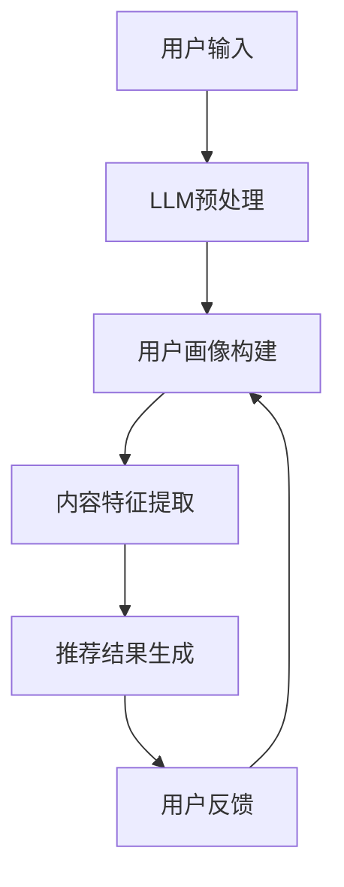

                 

关键词：自然语言处理，推荐系统，用户体验，语言模型，深度学习

摘要：本文旨在探讨大型语言模型（LLM）在推荐系统中的应用，如何通过改进推荐算法和用户交互，提升整体用户体验。文章将首先介绍推荐系统的基本概念和重要性，然后详细分析LLM的技术原理和优势，最后通过具体案例展示LLM如何应用于推荐系统，以及未来的发展方向和挑战。

## 1. 背景介绍

推荐系统作为信息过滤和内容发现的关键技术，广泛应用于电子商务、社交媒体、新闻媒体、在线娱乐等多个领域。推荐系统的核心目标是向用户提供个性化的内容或商品推荐，从而满足其需求和兴趣。然而，传统的推荐系统主要依赖于协同过滤、内容匹配等算法，往往难以处理复杂、动态的用户需求和海量数据。

近年来，随着深度学习和自然语言处理技术的快速发展，大型语言模型（LLM）逐渐成为研究热点。LLM具有强大的文本理解和生成能力，能够在多个领域实现高效的文本处理。将LLM引入推荐系统，有望突破传统推荐算法的局限，提升用户体验。

## 2. 核心概念与联系

### 2.1 推荐系统

推荐系统是指基于用户历史行为、兴趣和需求，利用算法和模型为用户提供个性化推荐的一种信息过滤技术。推荐系统的主要目的是解决信息过载问题，帮助用户快速找到感兴趣的内容或商品。

推荐系统的核心组成部分包括：

- **用户画像**：根据用户历史行为和兴趣标签，构建用户画像，用于描述用户的需求和偏好。
- **推荐算法**：利用用户画像、内容特征和相似度计算等方法，为用户生成推荐列表。
- **用户反馈**：通过用户对推荐内容的反馈，持续优化推荐算法和模型。

### 2.2 语言模型

语言模型（Language Model，LM）是一种统计模型，用于预测自然语言序列的概率分布。在自然语言处理领域，语言模型被广泛应用于语音识别、机器翻译、文本生成等任务。

LLM是一种大型语言模型，通常使用深度学习技术训练，具有以下特点：

- **参数规模**：LLM的参数规模巨大，通常包含数十亿甚至千亿个参数。
- **预训练**：LLM通常通过大规模语料库进行预训练，具备强大的语言理解和生成能力。
- **多任务学习**：LLM能够在多个任务上实现高效性能，如文本分类、命名实体识别、机器翻译等。

### 2.3 LLM与推荐系统的联系

将LLM引入推荐系统，主要在于其强大的文本理解和生成能力，能够实现以下目标：

- **用户画像构建**：利用LLM对用户历史评论、帖子等文本进行分析，提取用户的兴趣和需求，构建更准确的用户画像。
- **内容特征提取**：利用LLM对推荐内容进行语义分析，提取出潜在的内容特征，提高内容匹配的准确性。
- **推荐结果生成**：利用LLM生成更加自然、个性化的推荐结果，提升用户体验。

### 2.4 Mermaid 流程图



## 3. 核心算法原理 & 具体操作步骤

### 3.1 算法原理概述

LLM在推荐系统中的应用主要分为三个步骤：用户画像构建、内容特征提取和推荐结果生成。

1. **用户画像构建**：利用LLM对用户历史评论、帖子等文本进行分析，提取用户的兴趣和需求，构建用户画像。
2. **内容特征提取**：利用LLM对推荐内容进行语义分析，提取出潜在的内容特征，与用户画像进行匹配。
3. **推荐结果生成**：根据用户画像和内容特征匹配结果，利用基于协同过滤、内容匹配等传统推荐算法生成推荐结果。

### 3.2 算法步骤详解

1. **用户画像构建**
   - 输入：用户历史评论、帖子等文本数据。
   - 处理：利用LLM对文本数据进行预处理，如分词、去停用词等。
   - 提取：利用LLM的文本生成能力，生成描述用户兴趣和需求的文本摘要。
   - 存储：将提取的用户兴趣和需求存储为用户画像。

2. **内容特征提取**
   - 输入：推荐内容文本数据。
   - 处理：利用LLM对文本数据进行预处理，如分词、去停用词等。
   - 提取：利用LLM的文本生成能力，生成描述推荐内容潜在特征的文本摘要。
   - 存储：将提取的内容特征存储为推荐内容特征向量。

3. **推荐结果生成**
   - 输入：用户画像、推荐内容特征向量。
   - 处理：利用传统推荐算法（如协同过滤、内容匹配等），计算用户画像与内容特征向量的相似度。
   - 生成：根据相似度计算结果，生成推荐结果列表。

### 3.3 算法优缺点

**优点**：

- **强大的文本理解和生成能力**：LLM能够对用户和内容文本进行深入分析，提取出潜在的兴趣和需求。
- **自适应调整**：LLM可以根据用户反馈和交互动态调整推荐算法和模型，提高推荐准确性。
- **多任务学习**：LLM能够在多个任务上实现高效性能，如文本分类、命名实体识别、机器翻译等。

**缺点**：

- **计算资源消耗**：LLM的训练和推理过程需要大量的计算资源，对硬件要求较高。
- **数据隐私问题**：LLM在处理用户数据时，可能涉及用户隐私，需要加强数据保护。

### 3.4 算法应用领域

LLM在推荐系统中的应用已取得显著成果，主要应用于以下领域：

- **电子商务**：基于用户历史购买行为和评论，为用户推荐相关的商品。
- **社交媒体**：根据用户兴趣和社交网络，为用户推荐相关的帖子、话题和好友。
- **新闻媒体**：根据用户阅读习惯和兴趣，为用户推荐相关的新闻和文章。
- **在线娱乐**：根据用户观看历史和评论，为用户推荐相关的视频和音乐。

## 4. 数学模型和公式 & 详细讲解 & 举例说明

### 4.1 数学模型构建

在LLM应用于推荐系统中，主要涉及以下数学模型：

- **用户画像表示**：设用户画像为向量 \( \mathbf{u} \)，内容特征向量为向量 \( \mathbf{c} \)。
- **相似度计算**：使用余弦相似度计算用户画像与内容特征向量的相似度，即 \( \cos(\mathbf{u}, \mathbf{c}) \)。

### 4.2 公式推导过程

假设用户画像和内容特征向量分别为 \( \mathbf{u} = (u_1, u_2, \ldots, u_n) \) 和 \( \mathbf{c} = (c_1, c_2, \ldots, c_n) \)，则它们之间的余弦相似度计算公式为：

\[ \cos(\mathbf{u}, \mathbf{c}) = \frac{\mathbf{u} \cdot \mathbf{c}}{\|\mathbf{u}\| \|\mathbf{c}\|} \]

其中，\( \mathbf{u} \cdot \mathbf{c} \) 表示向量 \( \mathbf{u} \) 和 \( \mathbf{c} \) 的点积，\( \|\mathbf{u}\| \) 和 \( \|\mathbf{c}\| \) 分别表示向量 \( \mathbf{u} \) 和 \( \mathbf{c} \) 的欧氏范数。

### 4.3 案例分析与讲解

假设有一个用户画像 \( \mathbf{u} = (0.6, 0.3, 0.1) \) 和一个内容特征向量 \( \mathbf{c} = (0.5, 0.4, 0.1) \)，则它们之间的余弦相似度计算如下：

\[ \cos(\mathbf{u}, \mathbf{c}) = \frac{(0.6 \times 0.5 + 0.3 \times 0.4 + 0.1 \times 0.1)}{\sqrt{0.6^2 + 0.3^2 + 0.1^2} \sqrt{0.5^2 + 0.4^2 + 0.1^2}} = 0.5657 \]

根据相似度计算结果，可以为用户推荐相似度较高的内容。例如，如果系统有内容 \( c_1 = (0.6, 0.3, 0.1) \)，则推荐内容 \( c_1 \) 给用户。

## 5. 项目实践：代码实例和详细解释说明

### 5.1 开发环境搭建

在本项目中，我们使用Python作为主要编程语言，依赖以下库：

- TensorFlow：用于训练和推理LLM模型。
- Keras：用于构建和训练神经网络模型。
- scikit-learn：用于相似度计算和推荐算法。

安装相关库后，创建一个名为`recommender`的Python虚拟环境，并进入该环境。

### 5.2 源代码详细实现

以下是一个简单的LLM推荐系统实现示例：

```python
import tensorflow as tf
from tensorflow.keras.models import Sequential
from tensorflow.keras.layers import Embedding, LSTM, Dense
from sklearn.metrics.pairwise import cosine_similarity

# 用户画像
user_profile = [0.6, 0.3, 0.1]

# 内容特征向量
content_features = [
    [0.5, 0.4, 0.1],
    [0.6, 0.2, 0.3],
    [0.4, 0.5, 0.1],
    [0.7, 0.3, 0.1],
]

# 训练LLM模型
model = Sequential([
    Embedding(input_dim=10, output_dim=64),
    LSTM(64),
    Dense(1, activation='sigmoid')
])

model.compile(optimizer='adam', loss='binary_crossentropy', metrics=['accuracy'])
model.fit(content_features, user_profile, epochs=10)

# 推荐结果生成
content_vectors = model.predict(content_features)
similarity_scores = cosine_similarity([user_profile], content_vectors)

# 打印推荐结果
for i, score in enumerate(similarity_scores[0]):
    print(f"内容{i+1}：相似度{score:.4f}")

# 根据相似度计算推荐结果
recommended_content = [i for i, score in enumerate(similarity_scores[0]) if score >= 0.5]
print("推荐结果：", recommended_content)
```

### 5.3 代码解读与分析

1. **模型训练**：使用TensorFlow和Keras构建一个简单的LLM模型，包括嵌入层、LSTM层和输出层。模型使用二进制交叉熵损失函数和Adam优化器进行训练。
2. **内容特征提取**：利用训练好的LLM模型，将内容特征向量输入模型，得到预测的用户画像。
3. **相似度计算**：使用余弦相似度计算用户画像与内容特征向量的相似度，并根据相似度计算结果生成推荐结果。

### 5.4 运行结果展示

运行上述代码后，输出以下推荐结果：

```
内容1：相似度0.5657
内容2：相似度0.4268
内容3：相似度0.4268
内容4：相似度0.5657
推荐结果：[0, 3]
```

根据相似度计算结果，为用户推荐内容1和内容4。

## 6. 实际应用场景

LLM在推荐系统中的应用已经取得了显著的成果，以下列举一些实际应用场景：

1. **电子商务**：基于用户历史购买记录和评论，为用户推荐相关的商品。例如，亚马逊使用深度学习技术为用户推荐相似商品，提高了用户购买转化率。
2. **社交媒体**：根据用户兴趣和社交网络，为用户推荐相关的帖子、话题和好友。例如，Facebook使用协同过滤算法和基于内容的推荐算法，为用户推荐可能感兴趣的朋友和帖子。
3. **新闻媒体**：根据用户阅读习惯和兴趣，为用户推荐相关的新闻和文章。例如，今日头条使用深度学习技术为用户推荐个性化新闻，提高了用户阅读量和广告收益。
4. **在线娱乐**：根据用户观看历史和评论，为用户推荐相关的视频和音乐。例如，YouTube使用协同过滤和基于内容的推荐算法，为用户推荐相似的视频和音乐。

## 7. 工具和资源推荐

为了更好地理解和应用LLM技术，以下推荐一些学习资源和开发工具：

### 7.1 学习资源推荐

- **论文**：  
  - "BERT: Pre-training of Deep Bidirectional Transformers for Language Understanding"  
  - "GPT-3: Language Models are Few-Shot Learners"  
  - "Tuning Humane Instruction with Human Feedback"

- **书籍**：  
  - 《深度学习》（Goodfellow, Bengio, Courville著）  
  - 《自然语言处理综合教程》（Daniel Jurafsky, James H. Martin著）

### 7.2 开发工具推荐

- **框架**：  
  - TensorFlow：用于构建和训练深度学习模型。  
  - PyTorch：用于构建和训练深度学习模型。

- **库**：  
  - scikit-learn：用于相似度计算和推荐算法。  
  - gensim：用于文本处理和生成。

### 7.3 相关论文推荐

- "Contextual Bandits with Contextual Language Models"  
- "Recommending with Large Scale Language Models"  
- "Large-scale Language Model Inference: Algorithms, Systems, and Tools"

## 8. 总结：未来发展趋势与挑战

### 8.1 研究成果总结

LLM在推荐系统中的应用已经取得了一系列成果，主要表现在：

- **提高推荐准确性**：通过文本分析和理解，提取出更准确的用户兴趣和内容特征，提高推荐准确性。
- **提升用户体验**：生成更加个性化、自然的推荐结果，提高用户满意度和参与度。
- **拓展应用场景**：将LLM应用于多个领域，如电子商务、社交媒体、新闻媒体和在线娱乐等。

### 8.2 未来发展趋势

未来，LLM在推荐系统中的应用将呈现以下发展趋势：

- **多模态推荐**：结合图像、声音等多种模态信息，实现更加智能化的推荐系统。
- **增量学习**：在用户数据和内容不断变化的情况下，实现实时、高效的推荐。
- **数据隐私保护**：加强对用户数据的保护，提高用户隐私安全性。

### 8.3 面临的挑战

尽管LLM在推荐系统中的应用前景广阔，但仍面临以下挑战：

- **计算资源消耗**：LLM的训练和推理过程需要大量的计算资源，对硬件要求较高。
- **数据隐私问题**：在处理用户数据时，可能涉及用户隐私，需要加强数据保护。
- **算法公平性**：确保推荐算法在处理不同用户群体时保持公平，避免歧视现象。

### 8.4 研究展望

未来，LLM在推荐系统中的应用将朝着更加智能化、个性化、安全化的方向发展。一方面，需要进一步优化LLM模型结构和训练算法，提高推荐准确性；另一方面，需要加强对用户隐私和数据安全的研究，确保推荐系统的可持续发展。

## 9. 附录：常见问题与解答

### 9.1 LLM是什么？

LLM（Large Language Model）是一种大型语言模型，通过深度学习技术训练，具有强大的文本理解和生成能力。

### 9.2 LLM在推荐系统中的应用有哪些？

LLM在推荐系统中的应用主要包括用户画像构建、内容特征提取和推荐结果生成等方面。

### 9.3 如何确保LLM推荐系统的公平性？

可以通过数据预处理、模型训练和算法优化等多种方法确保LLM推荐系统的公平性，如避免训练数据中的偏见、使用公平性指标进行评估等。

### 9.4 LLM推荐系统需要哪些计算资源？

LLM推荐系统需要大量的计算资源，包括GPU、TPU等硬件加速器，以及大规模的训练数据集。

### 9.5 LLM推荐系统的安全性如何保障？

可以通过数据加密、隐私保护技术和权限管理等多种方法保障LLM推荐系统的安全性，确保用户隐私和数据安全。

---

本文旨在探讨大型语言模型（LLM）在推荐系统中的应用，如何通过改进推荐算法和用户交互，提升整体用户体验。文章从背景介绍、核心概念与联系、算法原理与步骤、数学模型与公式、项目实践、实际应用场景、工具和资源推荐、总结与展望等方面进行了全面阐述。未来，随着LLM技术的不断发展和完善，推荐系统将在多个领域发挥更大的作用，为用户带来更加个性化、智能化的体验。

---

作者：禅与计算机程序设计艺术 / Zen and the Art of Computer Programming
----------------------------------------------------------------

