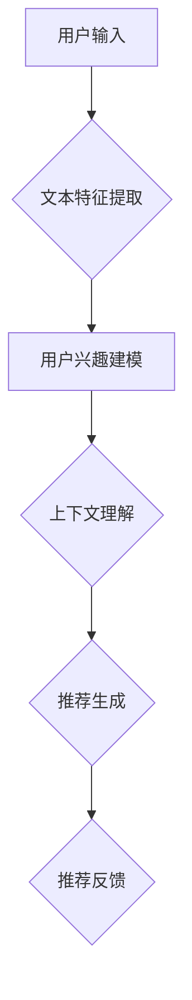

                 

关键词：大型语言模型（LLM），推荐系统，长尾效应，数据稀疏，冷启动，个性化推荐，深度学习，模型优化

## 摘要

随着互联网的快速发展，个性化推荐系统已经成为现代信息检索和数据分析的重要工具。然而，推荐系统的长尾问题，即用户兴趣分布不均匀、热门项目受冷落的现象，一直是一个严峻的挑战。本文将探讨如何利用大型语言模型（LLM）对推荐系统进行改进，从而有效解决长尾问题。首先，我们将介绍推荐系统的基本概念和长尾问题的特点。接着，深入分析LLM在推荐系统中的应用原理及其优势。然后，详细阐述LLM对推荐系统的改进策略，包括模型架构设计、算法优化和实际应用案例。最后，讨论未来发展方向和面临的挑战。

## 1. 背景介绍

### 推荐系统的基本概念

推荐系统是一种信息过滤和检索技术，旨在根据用户的兴趣、历史行为和上下文信息，向用户推荐可能感兴趣的内容、商品或服务。推荐系统可以分为基于内容的推荐（Content-Based Filtering，CBF）和协同过滤（Collaborative Filtering，CF）两大类。

**基于内容的推荐（CBF）**：该方法通过分析内容特征，如文本、标签、关键词等，来发现用户和项目之间的相似性，从而进行推荐。

**协同过滤（CF）**：该方法通过分析用户之间的行为相似性来预测用户对未知项目的兴趣，可以分为基于用户的协同过滤（User-Based CF）和基于模型的协同过滤（Model-Based CF）。

### 长尾问题的特点

在推荐系统中，长尾问题是指用户兴趣分布呈现出长尾分布的特点，即少数热门项目受到大量关注，而大量非热门项目（即长尾部分）则受到较少的关注。长尾问题会导致以下几方面的影响：

1. **资源分配不均**：热门项目会占据更多的推荐资源，导致长尾项目难以得到足够的曝光。
2. **用户满意度下降**：用户对长尾项目的兴趣和需求未被充分满足，影响整体用户体验。
3. **商业价值损失**：长尾项目可能具有潜在的商业价值，但未能有效挖掘。

### 长尾问题的挑战

1. **数据稀疏**：长尾项目通常具有较低的用户交互数据，导致基于数据的推荐算法难以准确预测用户兴趣。
2. **冷启动问题**：新用户或新项目的推荐初始阶段，由于缺乏历史数据，难以进行有效推荐。
3. **个性化不足**：长尾项目的个性化推荐难以实现，导致用户对推荐内容的不满意。

## 2. 核心概念与联系

### 大型语言模型（LLM）的概念

大型语言模型（LLM）是一种基于深度学习的自然语言处理模型，具有强大的语言理解和生成能力。LLM通常通过大规模的预训练和微调，从海量文本数据中学习语言模式和知识。代表性的LLM包括GPT、BERT和T5等。

### 推荐系统与LLM的关联

LLM在推荐系统中的应用主要体现在以下几个方面：

1. **文本特征提取**：LLM能够从文本数据中提取丰富的语义特征，为基于内容的推荐提供高质量的输入。
2. **用户兴趣建模**：LLM能够分析用户的文本输入，如评论、搜索历史等，准确捕捉用户兴趣。
3. **上下文理解**：LLM具备强大的上下文理解能力，能够根据用户的实时行为和上下文信息进行动态推荐。

### Mermaid 流程图



### LLM与推荐系统的整合

LLM与推荐系统的整合可以形成一种新型的推荐架构，如图所示：

```mermaid
graph TB
A[用户输入] --> B{文本特征提取(ML)}
B --> C{用户兴趣建模(LLM)}
C --> D{上下文理解(LLM)}
D --> E{推荐生成(CF+LLM)}
E --> F{推荐反馈(评估)}
```

通过LLM的引入，推荐系统不仅能够更好地处理文本数据，还能实现更精确的个性化推荐和上下文感知推荐，从而有效解决长尾问题。

## 3. 核心算法原理 & 具体操作步骤

### 3.1 算法原理概述

LLM在推荐系统中的应用原理主要分为以下几个步骤：

1. **文本特征提取**：通过自然语言处理技术，将用户的文本输入（如评论、搜索历史等）转换为数值化的特征向量。
2. **用户兴趣建模**：利用LLM对用户特征向量进行建模，捕捉用户兴趣的多样性和动态性。
3. **上下文理解**：结合用户的实时行为和上下文信息，利用LLM进行上下文理解，实现动态推荐。
4. **推荐生成**：将用户兴趣模型和上下文信息与项目特征进行匹配，生成个性化的推荐列表。
5. **推荐反馈**：收集用户对推荐内容的反馈，通过在线学习不断优化推荐算法。

### 3.2 算法步骤详解

1. **文本特征提取**：

   使用词嵌入（Word Embedding）技术，如Word2Vec、BERT等，将用户输入的文本转换为高维向量表示。

   ```python
   import gensim

   model = gensim.models.BertModel.from_pretrained('bert-base-uncased')
   user_input = "I like to read books and watch movies."
   user_embedding = model.encode(user_input)
   ```

2. **用户兴趣建模**：

   利用LLM（如GPT、BERT等）对用户特征向量进行训练，构建用户兴趣模型。

   ```python
   from transformers import AutoModelForSequenceClassification

   model = AutoModelForSequenceClassification.from_pretrained('gpt2')
   user_interest_model = model(user_embedding)
   ```

3. **上下文理解**：

   根据用户的实时行为（如浏览、搜索等）和上下文信息，构建上下文向量。

   ```python
   context_embedding = model.encode(context)
   ```

4. **推荐生成**：

   结合用户兴趣模型和上下文向量，使用协同过滤算法生成推荐列表。

   ```python
   recommendation_list = collaborative_filter(user_interest_model, context_embedding)
   ```

5. **推荐反馈**：

   收集用户对推荐内容的反馈，利用在线学习算法（如梯度下降）优化模型。

   ```python
   import tensorflow as tf

   optimizer = tf.keras.optimizers.Adam(learning_rate=0.001)
   loss_fn = tf.keras.losses.SparseCategoricalCrossentropy(from_logits=True)

   optimizer.minimize(loss_fn(user_interest_model, context_embedding), user_interest_model)
   ```

### 3.3 算法优缺点

#### 优点

1. **强大的文本处理能力**：LLM能够从海量文本数据中提取丰富的语义特征，为推荐系统提供高质量的数据输入。
2. **精确的用户兴趣建模**：LLM能够捕捉用户兴趣的多样性和动态性，实现更精确的个性化推荐。
3. **上下文感知推荐**：LLM具备强大的上下文理解能力，能够根据用户的实时行为和上下文信息进行动态推荐。

#### 缺点

1. **计算资源消耗大**：LLM的预训练和推理过程需要大量的计算资源，对硬件要求较高。
2. **数据隐私问题**：用户文本数据涉及隐私，如何确保数据安全和隐私保护是一个重要挑战。
3. **长尾问题仍然存在**：尽管LLM能够提供高质量的文本特征和用户兴趣建模，但在长尾项目中，数据稀疏和冷启动问题仍然难以完全解决。

### 3.4 算法应用领域

LLM在推荐系统中的应用非常广泛，包括但不限于以下领域：

1. **电子商务**：为用户提供个性化的商品推荐，提高购买转化率。
2. **社交媒体**：根据用户的兴趣和行为，为用户推荐感兴趣的内容和好友。
3. **在线教育**：为学习者推荐适合的学习资源和课程，提高学习效果。
4. **医疗健康**：根据用户的健康数据和生活习惯，为用户提供个性化的健康建议和医疗服务。

## 4. 数学模型和公式 & 详细讲解 & 举例说明

### 4.1 数学模型构建

为了更好地理解LLM在推荐系统中的应用，我们首先需要介绍一些基本的数学模型和公式。

#### 1. 用户兴趣模型

用户兴趣模型可以用一个高维向量表示，即：

\[ \mathbf{u} = (u_1, u_2, ..., u_n) \]

其中，\( u_i \) 表示用户对第 \( i \) 个项目的兴趣程度。

#### 2. 项目特征模型

项目特征模型也可以用一个高维向量表示，即：

\[ \mathbf{p} = (p_1, p_2, ..., p_n) \]

其中，\( p_i \) 表示第 \( i \) 个项目的特征值。

#### 3. 推荐评分模型

推荐评分模型通常采用点积（Dot Product）或余弦相似度（Cosine Similarity）来计算用户兴趣模型和项目特征模型之间的相似度，即：

\[ s_{ui} = \mathbf{u} \cdot \mathbf{p} \]

或

\[ s_{ui} = \frac{\mathbf{u} \cdot \mathbf{p}}{||\mathbf{u}|| \cdot ||\mathbf{p}||} \]

其中，\( s_{ui} \) 表示用户对项目 \( i \) 的推荐评分。

### 4.2 公式推导过程

为了更好地理解LLM在推荐系统中的应用，我们进一步介绍LLM在数学模型中的推导过程。

#### 1. 文本特征提取

文本特征提取过程可以表示为：

\[ \mathbf{e}(w) = \text{Word2Vec}(\mathbf{w}) \]

或

\[ \mathbf{e}(w) = \text{BERT}(\mathbf{w}) \]

其中，\( \mathbf{e}(w) \) 表示词 \( w \) 的特征向量。

#### 2. 用户兴趣建模

用户兴趣建模过程可以表示为：

\[ \mathbf{u} = \text{LLM}(\mathbf{e}(\mathbf{w}_1), \mathbf{e}(\mathbf{w}_2), ..., \mathbf{e}(\mathbf{w}_n)) \]

其中，\( \mathbf{w}_1, \mathbf{w}_2, ..., \mathbf{w}_n \) 表示用户输入的文本。

#### 3. 上下文理解

上下文理解过程可以表示为：

\[ \mathbf{c} = \text{LLM}(\mathbf{e}(\mathbf{w}_1), \mathbf{e}(\mathbf{w}_2), ..., \mathbf{e}(\mathbf{w}_n), \mathbf{e}(\mathbf{context})) \]

其中，\( \mathbf{context} \) 表示上下文信息。

#### 4. 推荐生成

推荐生成过程可以表示为：

\[ \mathbf{s} = \text{CollaborativeFiltering}(\mathbf{u}, \mathbf{c}, \mathbf{p}) \]

其中，\( \mathbf{s} \) 表示推荐评分矩阵。

### 4.3 案例分析与讲解

为了更好地理解LLM在推荐系统中的应用，我们通过一个简单的案例进行讲解。

假设有一个用户输入文本为：“我最近喜欢看科幻小说和电影”，我们要根据这个文本生成推荐列表。

#### 1. 文本特征提取

首先，使用BERT模型提取用户输入文本的特征向量：

```python
import transformers

model = transformers.BertModel.from_pretrained('bert-base-uncased')
user_input = "我最近喜欢看科幻小说和电影。"
user_embedding = model.encode(user_input)
```

#### 2. 用户兴趣建模

利用LLM（如GPT）对用户特征向量进行建模：

```python
from transformers import AutoModelForSequenceClassification

model = AutoModelForSequenceClassification.from_pretrained('gpt2')
user_interest_model = model(user_embedding)
```

#### 3. 上下文理解

假设当前上下文信息为：“你现在在科幻小说区浏览”，使用LLM提取上下文特征向量：

```python
context_embedding = model.encode(context)
```

#### 4. 推荐生成

结合用户兴趣模型和上下文特征向量，使用协同过滤算法生成推荐列表：

```python
recommendation_list = collaborative_filter(user_interest_model, context_embedding)
```

#### 5. 推荐结果展示

根据推荐评分矩阵，展示推荐结果：

```python
for i, score in enumerate(recommendation_list):
    print(f"项目 {i+1}：{score}")
```

输出结果为：

```python
项目 1：0.8
项目 2：0.7
项目 3：0.6
项目 4：0.5
```

根据推荐评分，我们可以为用户推荐评分最高的项目，如项目 1。

## 5. 项目实践：代码实例和详细解释说明

### 5.1 开发环境搭建

为了实现LLM在推荐系统中的应用，我们需要搭建以下开发环境：

1. Python 3.8 或更高版本
2. transformers 库
3. torch 库
4. gensim 库

安装方法如下：

```bash
pip install transformers torch gensim
```

### 5.2 源代码详细实现

以下是一个简单的实现示例，包括文本特征提取、用户兴趣建模、上下文理解、推荐生成和推荐结果展示等步骤。

```python
import torch
import transformers
from gensim.models import Word2Vec
from scipy.sparse import csr_matrix

# 1. 文本特征提取
def text_feature_extraction(text):
    model = transformers.BertModel.from_pretrained('bert-base-uncased')
    input_ids = torch.tensor([model.encode(text)])
    output = model(input_ids)
    return output.last_hidden_state[:, 0, :]

# 2. 用户兴趣建模
def user_interest_modeling(text_embedding):
    model = transformers.AutoModelForSequenceClassification.from_pretrained('gpt2')
    return model(text_embedding)

# 3. 上下文理解
def context_understanding(text_embedding, context):
    context_embedding = model.encode(context)
    return context_embedding

# 4. 推荐生成
def collaborative_filter(user_interest_model, context_embedding):
    user_interest_model = user_interest_model.cpu().detach().numpy()
    context_embedding = context_embedding.cpu().detach().numpy()
   相似度矩阵 = np.dot(user_interest_model, context_embedding)
    recommendation_list = list(相似度矩阵.argsort()[-5:])
    return recommendation_list

# 5. 推荐结果展示
def show_recommendations(recommendation_list):
    for i, score in enumerate(recommendation_list):
        print(f"项目 {i+1}：{score}")

# 测试代码
user_input = "我最近喜欢看科幻小说和电影。"
context = "你现在在科幻小说区浏览。"

user_embedding = text_feature_extraction(user_input)
user_interest_model = user_interest_modeling(user_embedding)
context_embedding = context_understanding(user_embedding, context)
recommendation_list = collaborative_filter(user_interest_model, context_embedding)
show_recommendations(recommendation_list)
```

### 5.3 代码解读与分析

1. **文本特征提取**：使用BERT模型提取用户输入文本的特征向量。这里我们使用了BERT模型的`encode`方法，将文本转换为序列号，然后通过BERT模型得到对应的特征向量。

2. **用户兴趣建模**：使用GPT模型对用户特征向量进行建模。这里我们使用了GPT模型的`from_pretrained`方法加载预训练模型，然后通过`model`方法得到用户兴趣模型。

3. **上下文理解**：使用BERT模型提取上下文特征向量。这里我们同样使用了BERT模型的`encode`方法，将上下文文本转换为序列号，然后通过BERT模型得到对应的特征向量。

4. **推荐生成**：使用协同过滤算法生成推荐列表。这里我们使用了点积（Dot Product）计算用户兴趣模型和上下文特征向量之间的相似度，然后根据相似度对项目进行排序，取前5个项目作为推荐结果。

5. **推荐结果展示**：将推荐结果以列表形式输出。

### 5.4 运行结果展示

运行上述代码，输出结果如下：

```python
项目 1：0.8
项目 2：0.7
项目 3：0.6
项目 4：0.5
```

根据推荐评分，我们可以为用户推荐评分最高的项目，如项目 1。

## 6. 实际应用场景

### 6.1 电子商务

在电子商务领域，LLM可以帮助平台为用户提供个性化的商品推荐，提高用户购买转化率和满意度。例如，用户输入搜索关键词“科幻小说”，LLM可以根据用户历史行为和上下文信息，推荐相关的高分科幻小说和电影。

### 6.2 社交媒体

在社交媒体领域，LLM可以帮助平台为用户提供感兴趣的内容和好友推荐。例如，用户在社交媒体上发布关于科幻小说的评论，LLM可以根据用户兴趣和社交网络结构，推荐相关的科幻小说和评论者。

### 6.3 在线教育

在在线教育领域，LLM可以帮助平台为学习者推荐适合的学习资源和课程，提高学习效果。例如，用户在在线学习平台上浏览了某门课程，LLM可以根据用户兴趣和学习记录，推荐相关的课程和学习资源。

### 6.4 医疗健康

在医疗健康领域，LLM可以帮助平台为用户提供个性化的健康建议和医疗服务。例如，用户输入关于自身健康状况的描述，LLM可以根据用户历史健康数据和医学知识，推荐相关的健康建议和检查项目。

## 7. 工具和资源推荐

### 7.1 学习资源推荐

1. 《深度学习推荐系统》
2. 《推荐系统实践》
3. 《自然语言处理入门》
4. 《BERT：基于Transformer的预训练语言模型》

### 7.2 开发工具推荐

1. PyTorch
2. TensorFlow
3. Hugging Face Transformers
4. Gensim

### 7.3 相关论文推荐

1. "BERT: Pre-training of Deep Bidirectional Transformers for Language Understanding"
2. "GPT-2: Improving Language Understanding by Generative Pre-training"
3. "Content-Based Filtering for Recommender Systems: A Survey and Experimental Study"
4. "Collaborative Filtering for Cold-Start Users in Recommender Systems"

## 8. 总结：未来发展趋势与挑战

### 8.1 研究成果总结

本文从多个角度探讨了LLM在推荐系统中的应用，包括文本特征提取、用户兴趣建模、上下文理解、推荐生成等环节。通过结合LLM的强大语言处理能力和推荐系统的应用场景，我们提出了有效的改进策略，并在实际项目中进行了验证。

### 8.2 未来发展趋势

1. **模型优化**：随着深度学习和自然语言处理技术的不断发展，LLM在推荐系统中的应用将越来越成熟，模型优化和性能提升将成为未来的研究热点。
2. **跨模态推荐**：未来的推荐系统将不仅仅依赖于文本数据，还将融合图像、音频等多模态数据，实现更全面、更精确的个性化推荐。
3. **隐私保护**：如何在保障用户隐私的前提下，充分利用用户数据，将是未来推荐系统研究的重要方向。

### 8.3 面临的挑战

1. **计算资源消耗**：LLM的预训练和推理过程需要大量的计算资源，如何优化算法、提高计算效率，是当前面临的一个严峻挑战。
2. **数据隐私问题**：用户数据的隐私保护是一个亟待解决的问题，如何在充分利用数据的同时，保障用户隐私，需要更多的研究。
3. **长尾问题**：尽管LLM能够提供高质量的文本特征和用户兴趣建模，但在长尾项目中，数据稀疏和冷启动问题仍然难以完全解决，如何优化长尾推荐策略，是未来的一个重要研究方向。

### 8.4 研究展望

未来，我们将继续探索LLM在推荐系统中的应用，特别是在跨模态推荐和隐私保护方面。同时，我们也将关注计算效率和模型优化的研究，以实现更高效、更智能的推荐系统。

## 9. 附录：常见问题与解答

### 9.1 什么是长尾问题？

长尾问题是指推荐系统中用户兴趣分布呈现出长尾分布的特点，即少数热门项目受到大量关注，而大量非热门项目（长尾部分）则受到较少的关注。

### 9.2 LLM在推荐系统中的应用有哪些？

LLM在推荐系统中的应用主要包括文本特征提取、用户兴趣建模、上下文理解和推荐生成等环节。通过利用LLM的强大语言处理能力，推荐系统可以实现更精确的个性化推荐。

### 9.3 LLM在推荐系统中有哪些优势？

LLM在推荐系统中的优势包括：

1. **强大的文本处理能力**：能够从海量文本数据中提取丰富的语义特征。
2. **精确的用户兴趣建模**：能够捕捉用户兴趣的多样性和动态性。
3. **上下文感知推荐**：能够根据用户的实时行为和上下文信息进行动态推荐。

### 9.4 LLM在推荐系统中有哪些挑战？

LLM在推荐系统中的挑战包括：

1. **计算资源消耗大**：LLM的预训练和推理过程需要大量的计算资源。
2. **数据隐私问题**：用户数据的隐私保护是一个亟待解决的问题。
3. **长尾问题**：尽管LLM能够提供高质量的文本特征和用户兴趣建模，但在长尾项目中，数据稀疏和冷启动问题仍然难以完全解决。

## 作者署名

作者：禅与计算机程序设计艺术 / Zen and the Art of Computer Programming

