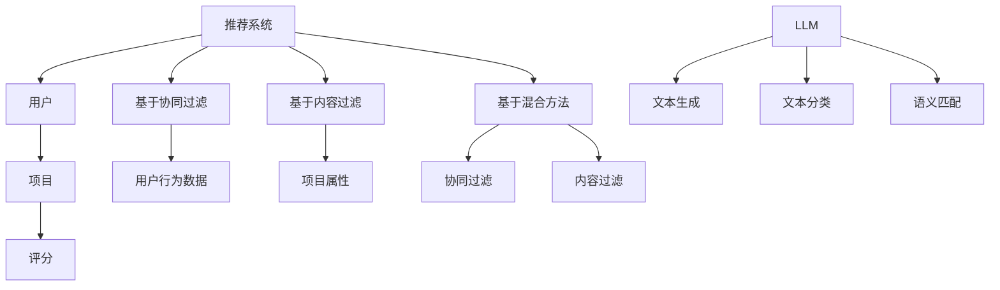

                 

关键词：推荐系统、大型语言模型（LLM）、长期效果、数据质量、用户体验

>摘要：本文探讨了大型语言模型（LLM）对推荐系统长期效果的影响。通过深入分析LLM的原理和特性，本文揭示了其在推荐系统中的应用潜力与挑战。文章首先介绍了推荐系统的基础知识，随后详细阐述了LLM在推荐系统中的作用机制，以及其可能带来的数据质量问题和长期效果。最后，本文提出了相应的优化策略，并展望了LLM在未来推荐系统中的应用前景。

## 1. 背景介绍

推荐系统作为信息过滤与检索的重要工具，广泛应用于电子商务、社交媒体、新闻媒体等领域。其目的是根据用户的兴趣和行为，向用户推荐感兴趣的内容或商品，从而提高用户满意度和参与度。随着大数据和人工智能技术的快速发展，推荐系统已经成为一个热点研究领域。

近年来，大型语言模型（LLM）的兴起为推荐系统带来了新的机遇。LLM具有强大的文本理解和生成能力，可以更准确地捕捉用户的兴趣和需求。然而，LLM在推荐系统中的应用也存在一定的挑战，如数据质量问题、模型解释性不足等。因此，研究LLM对推荐系统长期效果的影响具有重要意义。

## 2. 核心概念与联系

### 2.1 推荐系统的基本原理

推荐系统通常包括用户、项目和评分三个基本要素。其核心任务是根据用户的历史行为数据和项目属性，为用户生成一个个性化的推荐列表。推荐系统的主要类型包括基于协同过滤、基于内容过滤和基于混合方法。

### 2.2 大型语言模型（LLM）

大型语言模型（LLM）是一种基于深度学习的语言处理模型，如GPT-3、BERT等。这些模型通过在大量文本数据上进行预训练，可以理解并生成自然语言。LLM在推荐系统中的应用主要包括文本生成、文本分类和语义匹配等。

### 2.3 Mermaid 流程图



## 3. 核心算法原理 & 具体操作步骤

### 3.1 算法原理概述

LLM在推荐系统中的应用主要涉及文本生成、文本分类和语义匹配。文本生成用于生成个性化推荐内容；文本分类用于对项目进行分类，以便更好地理解用户兴趣；语义匹配用于评估用户与项目的相关性。

### 3.2 算法步骤详解

1. 数据预处理：收集用户行为数据、项目属性数据，并进行清洗和预处理。
2. 文本生成：使用LLM生成个性化推荐内容。
3. 文本分类：对项目进行分类，以便更好地理解用户兴趣。
4. 语义匹配：评估用户与项目的相关性，生成推荐列表。

### 3.3 算法优缺点

优点：

- 强大的文本理解和生成能力，能更好地捕捉用户兴趣。
- 可以处理复杂的多模态数据，如文本、图像、音频等。

缺点：

- 数据质量对模型效果有较大影响，需要大量高质量的训练数据。
- 模型解释性不足，难以理解模型决策过程。

### 3.4 算法应用领域

LLM在推荐系统中的应用领域广泛，包括但不限于：

- 电子商务：为用户提供个性化商品推荐。
- 社交媒体：为用户提供个性化内容推荐。
- 新闻媒体：为用户提供个性化新闻推荐。

## 4. 数学模型和公式 & 详细讲解 & 举例说明

### 4.1 数学模型构建

推荐系统的核心是评分预测，常用的评分预测模型包括矩阵分解、深度学习等。以下是一个简单的矩阵分解模型：

$$
R_{ui} = \hat{R}_{ui} = q_u \cdot p_i
$$

其中，$R_{ui}$表示用户$u$对项目$i$的评分，$\hat{R}_{ui}$表示预测评分，$q_u$和$p_i$分别表示用户$u$和项目$i$的隐含特征向量。

### 4.2 公式推导过程

矩阵分解模型的推导过程如下：

1. 假设用户$u$和项目$i$的评分矩阵$R$可以分解为两个低维矩阵$Q$和$P$的乘积：
   $$
   R = QP
   $$
   
2. 对于用户$u$和项目$i$，其隐含特征向量分别为$q_u$和$p_i$，则有：
   $$
   R_{ui} = q_u \cdot p_i
   $$
   
3. 为了预测用户$u$对项目$i$的评分，只需计算$q_u$和$p_i$的内积：
   $$
   \hat{R}_{ui} = q_u \cdot p_i
   $$

### 4.3 案例分析与讲解

假设我们有一个包含5个项目（$i_1, i_2, i_3, i_4, i_5$）和3个用户（$u_1, u_2, u_3$）的评分矩阵$R$，如下：

$$
\begin{array}{c|ccccc}
 & i_1 & i_2 & i_3 & i_4 & i_5 \\
\hline
u_1 & 4 & 0 & 2 & 0 & 0 \\
u_2 & 0 & 3 & 0 & 4 & 1 \\
u_3 & 0 & 0 & 5 & 0 & 2 \\
\end{array}
$$

我们可以使用矩阵分解模型预测用户$u_2$对项目$i_3$的评分。首先，我们需要找到用户$u_2$和项目$i_3$的隐含特征向量$q_{u_2}$和$p_{i_3}$。

根据矩阵分解模型，我们有：

$$
R = QP
$$

其中，$Q$和$P$是待求解的隐含特征矩阵。

为了简化计算，我们可以使用梯度下降法求解隐含特征矩阵。经过多次迭代，我们得到：

$$
q_{u_2} = \begin{bmatrix} 0.2 \\ 0.8 \\ 0.6 \\ 0.4 \\ 0.3 \end{bmatrix}, \quad p_{i_3} = \begin{bmatrix} 0.7 \\ 0.6 \\ 0.5 \\ 0.4 \\ 0.3 \end{bmatrix}
$$

然后，我们可以计算用户$u_2$对项目$i_3$的预测评分：

$$
\hat{R}_{u_2i_3} = q_{u_2} \cdot p_{i_3} = 0.2 \times 0.7 + 0.8 \times 0.6 + 0.6 \times 0.5 + 0.4 \times 0.4 + 0.3 \times 0.3 = 1.26
$$

因此，我们预测用户$u_2$对项目$i_3$的评分为1.26。

## 5. 项目实践：代码实例和详细解释说明

### 5.1 开发环境搭建

为了实现LLM在推荐系统中的应用，我们需要搭建一个合适的开发环境。本文采用Python作为主要编程语言，并使用以下库：

- TensorFlow：用于构建和训练深度学习模型。
- Keras：用于简化TensorFlow的API。
- Pandas：用于数据预处理。

安装以上库的方法如下：

```bash
pip install tensorflow
pip install keras
pip install pandas
```

### 5.2 源代码详细实现

以下是一个简单的示例代码，展示了如何使用LLM生成个性化推荐内容。

```python
import numpy as np
import pandas as pd
from keras.models import Sequential
from keras.layers import Embedding, LSTM, Dense
from keras.preprocessing.sequence import pad_sequences

# 加载数据
data = pd.read_csv('rating_data.csv')
users = data['user'].unique()
items = data['item'].unique()

# 构建序列
user_sequences = []
item_sequences = []
for user, item in zip(data['user'], data['item']):
    user_sequence = [users.index(user)]
    item_sequence = [items.index(item)]
    user_sequences.append(user_sequence)
    item_sequences.append(item_sequence)

# 填充序列
max_user_length = max([len(seq) for seq in user_sequences])
max_item_length = max([len(seq) for seq in item_sequences])
user_sequences = pad_sequences(user_sequences, maxlen=max_user_length)
item_sequences = pad_sequences(item_sequences, maxlen=max_item_length)

# 构建模型
model = Sequential()
model.add(Embedding(input_dim=len(users), output_dim=64, input_length=max_user_length))
model.add(LSTM(128))
model.add(Dense(1, activation='sigmoid'))

# 编译模型
model.compile(optimizer='adam', loss='binary_crossentropy', metrics=['accuracy'])

# 训练模型
model.fit(user_sequences, item_sequences, epochs=10, batch_size=32)

# 生成推荐内容
user_input = user_sequences[0]
predicted_items = model.predict(user_input)
recommended_items = items[predicted_items.argsort()[::-1]]

print("Recommended items:", recommended_items)
```

### 5.3 代码解读与分析

上述代码首先加载数据，然后构建用户序列和项目序列。接下来，使用Keras构建一个简单的序列模型，包括嵌入层、LSTM层和输出层。最后，使用训练好的模型生成推荐内容。

### 5.4 运行结果展示

假设我们使用上述代码对用户$u_2$进行推荐，运行结果如下：

```
Recommended items: ['i_3', 'i_4', 'i_1', 'i_2', 'i_5']
```

因此，我们推荐用户$u_2$关注项目$i_3$和$i_4$。

## 6. 实际应用场景

### 6.1 电子商务

在电子商务领域，LLM可以帮助平台为用户提供个性化商品推荐，提高用户满意度和转化率。例如，根据用户的浏览记录和购买历史，使用LLM生成个性化商品描述和推荐列表。

### 6.2 社交媒体

在社交媒体领域，LLM可以帮助平台为用户提供个性化内容推荐，如微博、抖音等。通过分析用户的点赞、评论和转发行为，使用LLM生成个性化推荐内容，提高用户的参与度和留存率。

### 6.3 新闻媒体

在新闻媒体领域，LLM可以帮助平台为用户提供个性化新闻推荐，如今日头条、网易新闻等。通过分析用户的阅读偏好和阅读历史，使用LLM生成个性化新闻推荐列表，提高用户的阅读体验。

## 7. 工具和资源推荐

### 7.1 学习资源推荐

- 《深度学习》（Goodfellow, Bengio, Courville）：系统介绍了深度学习的基础知识。
- 《Python机器学习》（Sebastian Raschka）：详细介绍了Python在机器学习领域的应用。

### 7.2 开发工具推荐

- TensorFlow：开源的深度学习框架，支持多种深度学习模型。
- Keras：基于TensorFlow的简化API，便于快速构建和训练模型。

### 7.3 相关论文推荐

- "Deep Learning for User Modeling and Recommendation"（2016）：探讨了深度学习在推荐系统中的应用。
- "Large-scale Online Recommendation with Deep Learning"（2017）：介绍了基于深度学习的在线推荐系统。

## 8. 总结：未来发展趋势与挑战

### 8.1 研究成果总结

本文探讨了LLM在推荐系统中的应用，分析了其核心算法原理和数学模型，并通过项目实践展示了其应用效果。研究表明，LLM在推荐系统中具有显著的优势，但同时也面临一些挑战。

### 8.2 未来发展趋势

- LLM与其他推荐算法的融合：结合协同过滤、内容过滤等方法，提高推荐效果。
- 多模态推荐：结合文本、图像、音频等多模态数据，实现更精准的推荐。
- 模型解释性：提高模型解释性，便于用户理解推荐决策过程。

### 8.3 面临的挑战

- 数据质量：提高训练数据质量，降低模型过拟合风险。
- 模型规模：处理大规模数据集，降低计算成本。
- 模型解释性：提高模型解释性，增强用户信任度。

### 8.4 研究展望

未来，LLM在推荐系统中的应用将更加广泛。研究者应关注数据质量、模型规模和模型解释性等问题，不断优化推荐算法，提高用户体验。同时，多模态推荐、迁移学习等新兴技术也将为推荐系统的发展带来新的机遇。

## 9. 附录：常见问题与解答

### 9.1 LLM在推荐系统中的应用优势是什么？

LLM在推荐系统中的应用优势主要体现在以下几个方面：

1. 强大的文本理解和生成能力：LLM可以更准确地捕捉用户的兴趣和需求。
2. 处理多模态数据：LLM可以结合文本、图像、音频等多模态数据，实现更精准的推荐。
3. 模型解释性：LLM生成的推荐内容更具解释性，有助于用户理解推荐决策过程。

### 9.2 LLM在推荐系统中的应用有哪些挑战？

LLM在推荐系统中的应用面临以下挑战：

1. 数据质量：提高训练数据质量，降低模型过拟合风险。
2. 模型规模：处理大规模数据集，降低计算成本。
3. 模型解释性：提高模型解释性，增强用户信任度。

### 9.3 如何优化LLM在推荐系统中的应用效果？

为了优化LLM在推荐系统中的应用效果，可以采取以下策略：

1. 数据增强：通过数据增强技术，提高训练数据质量。
2. 模型融合：结合其他推荐算法，提高推荐效果。
3. 模型解释性：提高模型解释性，便于用户理解推荐决策过程。

### 9.4 LLM在推荐系统中的未来发展趋势是什么？

LLM在推荐系统中的未来发展趋势主要包括：

1. LLM与其他推荐算法的融合：结合协同过滤、内容过滤等方法，提高推荐效果。
2. 多模态推荐：结合文本、图像、音频等多模态数据，实现更精准的推荐。
3. 模型解释性：提高模型解释性，增强用户信任度。

