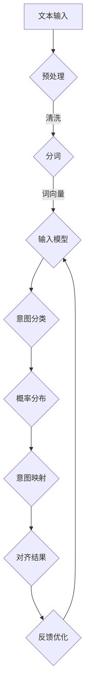

                 

关键词：LLM意图对齐、自然语言处理、人机交互、语义理解、深度学习、机器学习、知识图谱、算法优化、数据处理、跨模态学习、多模态融合

> 摘要：本文深入探讨了自然语言处理领域中一个重要且具挑战性的问题——LLM意图对齐。通过对LLM意图对齐的核心概念、算法原理、数学模型以及实际应用场景的详细剖析，文章旨在为研究人员和开发者提供全面的理论指导和实践参考。文章还将展望LLM意图对齐的未来发展趋势与面临的挑战。

## 1. 背景介绍

随着人工智能技术的飞速发展，自然语言处理（Natural Language Processing，NLP）逐渐成为计算机科学领域的热点。在NLP中，语言理解是一个关键环节，它涉及到语义理解、情感分析、命名实体识别等多个子任务。而语言理解的核心问题之一，就是如何准确识别和解析用户的意图（Intent Recognition）。

意图识别（Intent Recognition）是自然语言处理中的一个重要任务，它旨在理解用户输入的自然语言中的目标或目的。在实际应用中，例如智能助手、客服系统等，意图识别的正确性直接影响到用户交互的体验。然而，由于自然语言的高度多样性和不确定性，意图识别面临着诸多挑战。

近年来，预训练语言模型（Pre-trained Language Model，如GPT、BERT等）的出现，为意图识别带来了新的契机。LLM（Large Language Model）通过大规模数据预训练，能够捕捉到语言中的复杂模式和语义信息，从而在一定程度上提高了意图识别的准确性。然而，即便如此，LLM在意图对齐（Intent Alignment）方面仍然存在诸多问题。

本文将围绕LLM意图对齐这一主题，探讨其核心概念、算法原理、数学模型以及实际应用场景。通过对这些内容的深入分析，希望能够为研究人员和开发者提供有价值的参考，并共同推动这一领域的发展。

### 1.1 意图识别与LLM

意图识别是自然语言处理中的一个基础且关键的任务，它涉及到理解用户输入的文本或语音中的意图或目标。传统的意图识别方法通常依赖于规则和浅层特征，而随着深度学习技术的兴起，基于神经网络的方法逐渐成为主流。

预训练语言模型（LLM），如GPT和BERT，通过在大规模语料库上进行预训练，能够自动学习到语言的深层语义特征。这些模型在处理自然语言任务时，展现出了强大的性能，尤其是在文本分类、语义理解等方面。LLM的优势在于其能够捕捉到语言中的复杂模式和语义信息，从而在意图识别任务中表现出色。

然而，LLM在意图对齐方面仍然面临一些挑战。首先，LLM的预训练过程中依赖于大量的数据，但这些数据可能包含各种噪声和不一致的信息，导致模型在意图对齐时出现偏差。其次，不同应用场景下的意图定义和识别标准可能有所不同，LLM如何在不同场景下保持一致性和准确性，是一个亟待解决的问题。此外，LLM的模型复杂度和计算成本较高，如何在保证性能的同时降低计算资源的需求，也是一个重要挑战。

综上所述，尽管LLM在意图识别中具有显著的优势，但其在意图对齐方面仍然面临诸多挑战，需要进一步的研究和优化。

### 1.2 对齐与意图对齐

“对齐”（Alignment）在计算机科学和人工智能领域中是一个广泛使用的概念，它涉及多个层面和不同的上下文。在对齐的定义中，核心思想是将不同系统、模块或数据集中的元素进行匹配或同步，以便实现协同工作或一致操作。

在自然语言处理（NLP）领域，对齐特别重要。NLP的任务之一是使计算机能够理解并生成自然语言，这一过程中需要对齐文本的语义和语法结构。具体来说，对齐包括以下几个层面：

1. **语义对齐**：将文本中的词语或短语映射到相应的语义概念上，以便计算机能够理解文本的含义。
2. **语法对齐**：同步文本中的语法结构，如句子成分、从句等，以实现句子层面的理解和生成。
3. **语言模型对齐**：确保不同的语言模型在处理相同或相似任务时能够保持一致性，减少误差和偏差。
4. **多模态对齐**：在处理包含多种模态数据（如图像、声音、文本）的系统中，对齐不同模态的数据以实现统一的表示和理解。

在意图识别中，对齐尤为重要。意图对齐指的是将用户的语言输入与其真实的意图进行匹配和对应。这一过程涉及到以下几个关键步骤：

1. **意图分类**：首先，系统需要将用户的输入文本分类到预定义的意图类别中。
2. **意图映射**：接着，将每个意图类别映射到相应的操作或响应上，以确保系统能够正确地响应用户的请求。
3. **上下文感知**：考虑到用户输入的上下文信息，动态调整和优化意图的识别和映射，以减少歧义和误识别。

意图对齐的挑战在于自然语言的高度多样性和不确定性，以及不同应用场景下的意图定义和识别标准的差异。这需要先进的机器学习和深度学习技术来处理，并确保系统在多变的环境中保持一致性和准确性。

### 1.3 LLM意图对齐的重要性

LLM意图对齐在自然语言处理和人机交互中具有重要意义。首先，LLM具有强大的语义理解能力，能够从大量无标注数据中学习到丰富的语言模式和语义信息。这使得LLM在意图识别任务中表现出色，能够准确捕捉用户的意图。然而，LLM的这种能力也带来了挑战。

由于LLM的训练依赖于大量数据，而这些数据可能包含噪声和不一致的信息，导致LLM在意图对齐时容易出现偏差。例如，相同意图在不同上下文中的表达可能存在差异，而LLM可能无法完全捕捉到这些差异，从而导致误识别或漏识别。

此外，不同应用场景下的意图定义和识别标准可能有所不同。例如，一个智能客服系统可能需要识别用户关于产品咨询的意图，而一个医疗问答系统则可能需要识别用户关于病情描述的意图。LLM在不同场景下如何保持一致性和准确性，是一个重要挑战。

为了解决这些问题，研究人员提出了多种LLM意图对齐的方法。例如，通过引入上下文信息来增强LLM的意图识别能力，使用知识图谱来辅助对齐过程，以及采用多模态学习来整合不同模态的数据，提高对齐的准确性。

LLM意图对齐不仅有助于提高意图识别的准确性，还能够改善用户交互体验。通过对齐，系统可以更准确地理解用户的需求，提供更个性化和高效的服务。此外，LLM意图对齐还能够促进多模态交互系统的发展，使系统能够处理包含多种模态数据的输入，实现更丰富的交互体验。

总之，LLM意图对齐在自然语言处理和人机交互中具有重要作用。通过深入研究和优化，我们有望解决当前面临的挑战，推动这一领域的发展。

### 1.4 LLM意图对齐的研究现状

当前，LLM意图对齐的研究已经取得了显著的进展，但仍面临诸多挑战。本文将综述LLM意图对齐的研究现状，包括现有方法、应用领域、挑战和未来发展趋势。

#### 现有方法

1. **基于规则的方法**：传统的意图识别方法依赖于预定义的规则和模式匹配。这些方法简单直观，但难以应对自然语言的复杂性和多样性。

2. **基于统计的方法**：使用机器学习技术，如朴素贝叶斯、最大熵模型等，通过训练模型来自动识别意图。这些方法在一定程度上提高了准确性，但仍受到数据质量和特征提取的制约。

3. **基于深度学习的方法**：近年来，深度学习技术的兴起，特别是预训练语言模型（如BERT、GPT等），为意图识别带来了新的突破。这些模型通过在大规模语料库上预训练，能够自动学习到语言的深层语义特征，从而提高识别准确性。

4. **上下文感知方法**：考虑到用户输入的上下文信息，采用注意力机制、动态语义嵌入等方法，以增强模型对上下文的感知能力。

5. **知识图谱方法**：通过构建知识图谱，将文本中的实体、关系和属性进行结构化表示，从而辅助意图对齐过程。

6. **多模态学习方法**：整合多种模态的数据（如图像、声音、文本），通过多模态融合技术，提高意图识别的准确性。

#### 应用领域

1. **智能客服系统**：在客服领域，意图对齐有助于实现更自然和高效的用户交互，提高客户满意度。

2. **智能问答系统**：在医疗、金融等领域，智能问答系统需要准确理解用户的意图，提供专业和准确的回答。

3. **智能助手**：如语音助手、聊天机器人等，意图对齐是实现高效交互的关键。

4. **智能家居**：智能家居设备通过理解用户的语音或文本指令，实现自动化控制和优化。

5. **多模态交互系统**：在多模态交互场景中，意图对齐有助于实现跨模态的数据融合和理解。

#### 挑战

1. **数据多样性**：自然语言的高度多样性使得意图识别面临巨大挑战，如何处理不同领域、不同语言风格的输入，是一个重要问题。

2. **上下文理解**：上下文信息对于准确理解用户意图至关重要，但如何有效捕捉和利用上下文信息，仍需深入研究。

3. **跨领域迁移**：不同应用场景下的意图定义和识别标准可能有所不同，如何实现跨领域的迁移和泛化，是一个重要挑战。

4. **计算资源消耗**：深度学习和多模态学习等方法在提高准确性的同时，也增加了计算资源的需求，如何在保证性能的同时降低计算成本，是一个亟待解决的问题。

#### 未来发展趋势

1. **更强大的预训练模型**：未来的研究将致力于开发更强大的预训练模型，以进一步提高意图识别的准确性。

2. **上下文感知能力**：通过引入更多上下文信息，增强模型对上下文的感知能力，提高意图识别的准确性。

3. **知识图谱与深度学习的融合**：知识图谱在意图对齐中具有重要作用，未来的研究将探索如何更好地融合知识图谱与深度学习技术。

4. **多模态学习**：随着多模态交互系统的普及，多模态学习将成为重要的研究方向，通过整合不同模态的数据，提高意图识别的准确性。

5. **可解释性**：增强模型的解释性，使其意图识别的过程更加透明和可信，提高用户对系统的信任度。

总之，LLM意图对齐是一个充满挑战和机遇的研究领域。通过不断的研究和创新，我们有望解决当前面临的挑战，推动这一领域的发展，实现更自然、更高效的人机交互。

### 1.5 文章结构

本文将分为以下几个部分：

1. **背景介绍**：简要介绍意图识别和LLM意图对齐的基本概念及其重要性。
2. **核心概念与联系**：详细解释LLM意图对齐的核心概念，包括意图识别、对齐过程和相关的算法原理。
3. **核心算法原理 & 具体操作步骤**：探讨LLM意图对齐的核心算法原理，包括预训练模型的选择、数据预处理、模型训练和优化步骤。
4. **数学模型和公式 & 详细讲解 & 举例说明**：介绍用于LLM意图对齐的数学模型和公式，并通过具体案例进行解释。
5. **项目实践：代码实例和详细解释说明**：提供实际的代码实例，详细解释实现过程，并进行运行结果展示。
6. **实际应用场景**：讨论LLM意图对齐在智能客服、智能问答等实际应用场景中的案例。
7. **工具和资源推荐**：推荐相关学习资源、开发工具和论文，以帮助读者进一步探索LLM意图对齐。
8. **总结：未来发展趋势与挑战**：总结研究成果，展望未来发展趋势和面临的挑战。
9. **附录：常见问题与解答**：提供常见的疑问和解答，以帮助读者更好地理解LLM意图对齐。

通过上述结构，本文旨在为读者提供全面而深入的了解，以促进对LLM意图对齐这一领域的研究和应用。

### 2. 核心概念与联系

在深入探讨LLM意图对齐之前，我们需要先了解几个核心概念，包括意图识别、对齐过程和相关的算法原理。

#### 2.1 意图识别

意图识别（Intent Recognition）是自然语言处理中的一个基础任务，旨在理解用户输入的自然语言中的目标和意图。在许多实际应用中，例如智能客服、智能助手和语音助手等，意图识别是确保系统能够正确理解并响应用户请求的关键步骤。

意图识别过程通常包括以下几个步骤：

1. **文本预处理**：对用户输入的文本进行清洗和格式化，包括去除无关符号、停用词过滤等。
2. **词向量表示**：将文本转化为词向量表示，常用的方法包括Word2Vec、BERT等。
3. **特征提取**：从词向量中提取特征，如词嵌入、句子嵌入等。
4. **意图分类**：使用机器学习或深度学习模型对提取到的特征进行分类，将用户输入文本映射到预定义的意图类别中。

常见的意图识别算法包括：

1. **基于规则的方法**：通过预定义的规则和模式匹配进行意图分类，如正则表达式、有限状态机等。
2. **基于统计的方法**：使用统计模型，如朴素贝叶斯、最大熵模型等，通过训练模型来自动识别意图。
3. **基于深度学习的方法**：使用深度神经网络，如卷积神经网络（CNN）、循环神经网络（RNN）和Transformer等，通过学习大量的语言特征进行意图分类。

#### 2.2 对齐过程

“对齐”（Alignment）在计算机科学和人工智能领域中是一个广泛使用的概念，它涉及多个层面和不同的上下文。在对齐的定义中，核心思想是将不同系统、模块或数据集中的元素进行匹配或同步，以便实现协同工作或一致操作。

在自然语言处理领域，对齐特别重要。NLP的任务之一是使计算机能够理解并生成自然语言，这一过程中需要对齐文本的语义和语法结构。具体来说，对齐包括以下几个层面：

1. **语义对齐**：将文本中的词语或短语映射到相应的语义概念上，以便计算机能够理解文本的含义。
2. **语法对齐**：同步文本中的语法结构，如句子成分、从句等，以实现句子层面的理解和生成。
3. **语言模型对齐**：确保不同的语言模型在处理相同或相似任务时能够保持一致性，减少误差和偏差。
4. **多模态对齐**：在处理包含多种模态数据（如图像、声音、文本）的系统中，对齐不同模态的数据以实现统一的表示和理解。

在意图识别中，对齐尤为重要。意图对齐指的是将用户的语言输入与其真实的意图进行匹配和对应。这一过程涉及到以下几个关键步骤：

1. **意图分类**：首先，系统需要将用户的输入文本分类到预定义的意图类别中。
2. **意图映射**：接着，将每个意图类别映射到相应的操作或响应上，以确保系统能够正确地响应用户的请求。
3. **上下文感知**：考虑到用户输入的上下文信息，动态调整和优化意图的识别和映射，以减少歧义和误识别。

#### 2.3 算法原理

LLM意图对齐的核心在于利用预训练语言模型（如BERT、GPT等）的强大语义理解能力，通过对齐过程来提高意图识别的准确性。以下是LLM意图对齐的算法原理：

1. **预训练语言模型**：预训练语言模型通过在大规模语料库上进行预训练，学习到语言的深层语义特征。这些模型通常使用Transformer架构，能够在处理自然语言任务时表现出色。

2. **数据预处理**：在LLM意图对齐中，首先需要对数据进行预处理，包括文本清洗、分词、词向量表示等。常用的词向量表示方法包括Word2Vec、BERT等。

3. **意图分类任务**：将预处理的文本输入到预训练语言模型中，通过模型输出得到意图分类的概率分布。然后，使用分类器（如SVM、神经网络等）对意图进行分类。

4. **意图对齐**：通过对齐过程，将用户的输入与其真实的意图进行匹配。具体方法包括：
   - **基于上下文的意图对齐**：利用上下文信息，通过调整模型参数或使用注意力机制，提高意图识别的准确性。
   - **基于知识图谱的意图对齐**：通过构建知识图谱，将文本中的实体、关系和属性进行结构化表示，从而辅助意图对齐过程。
   - **基于多模态数据的意图对齐**：整合多种模态的数据（如图像、声音、文本），通过多模态融合技术，提高意图识别的准确性。

5. **模型优化**：通过迭代训练和优化，不断调整模型参数，提高模型在意图对齐任务中的性能。

#### 2.4 Mermaid 流程图

以下是一个用于描述LLM意图对齐过程的Mermaid流程图：



在这个流程图中，文本输入经过预处理后输入到预训练语言模型中，模型输出意图分类的概率分布，然后通过意图映射和对齐过程，得到最终的对齐结果。通过对齐结果的反馈，不断优化模型参数，提高意图识别的准确性。

### 3. 核心算法原理 & 具体操作步骤

在深入探讨LLM意图对齐的核心算法原理之前，我们需要了解LLM的基本概念，以及预训练语言模型在意图对齐中的作用。

#### 3.1 预训练语言模型

预训练语言模型（Pre-trained Language Model，简称PLM）是近年来自然语言处理领域的重要突破。这类模型通过在大规模语料库上进行预训练，学习到语言的通用特征和语义信息，从而在多种自然语言处理任务中表现出色。代表性的预训练语言模型包括BERT、GPT和T5等。

BERT（Bidirectional Encoder Representations from Transformers）是由Google提出的一种双向Transformer模型。BERT通过预训练获得的语言理解能力，在多种下游任务中取得了显著的性能提升。

GPT（Generative Pre-trained Transformer）是由OpenAI提出的一种生成式预训练语言模型。GPT通过无监督的方式学习到语言的生成规律，能够在文本生成任务中表现出色。

T5（Text-to-Text Transfer Transformer）是由Google提出的一种通用目的语言模型。T5将自然语言处理任务转化为文本到文本的翻译任务，通过预训练学习到任务转换的规律。

#### 3.2 预训练语言模型在意图对齐中的作用

预训练语言模型在意图对齐中具有重要作用。首先，预训练语言模型通过在大规模语料库上预训练，学习到丰富的语言特征和语义信息，从而提高了意图识别的准确性。其次，预训练语言模型具有很好的迁移学习能力，可以在不同应用场景中快速适应和调整，提高意图对齐的泛化能力。

在意图对齐过程中，预训练语言模型通常用于以下步骤：

1. **文本表示**：将用户输入的文本转换为高维的向量表示，以便模型能够捕捉到文本的语义信息。
2. **意图分类**：使用预训练语言模型对文本表示进行意图分类，将文本映射到预定义的意图类别中。
3. **意图映射**：将每个意图类别映射到相应的操作或响应上，确保系统能够正确地响应用户的请求。

#### 3.3 预处理

预处理是意图对齐过程中的重要环节，其质量直接影响到后续模型训练和性能。预处理通常包括以下步骤：

1. **文本清洗**：去除文本中的无关符号、特殊字符和停用词，以提高模型训练的效率。
2. **分词**：将文本分割成单词或词组，以便进行后续的词向量表示。
3. **词向量表示**：将文本转换为词向量表示，常用的方法包括Word2Vec、BERT等。词向量表示能够捕捉到文本的语义信息，是后续意图分类的基础。

#### 3.4 模型训练

模型训练是意图对齐的核心步骤，其目标是学习到能够准确识别和映射意图的模型参数。在模型训练过程中，通常采用以下方法：

1. **损失函数**：选择适当的损失函数，如交叉熵损失函数，用于评估模型在意图分类任务中的表现。
2. **优化算法**：使用优化算法，如Adam优化器，更新模型参数，以最小化损失函数。
3. **训练策略**：采用适当的训练策略，如学习率调度、数据增强等，提高模型训练的效果。

#### 3.5 模型优化

模型优化是意图对齐过程中的关键步骤，其目标是提高模型在意图对齐任务中的性能。模型优化通常包括以下方法：

1. **注意力机制**：通过引入注意力机制，使模型能够更好地捕捉到文本中的重要信息，从而提高意图识别的准确性。
2. **多任务学习**：通过多任务学习，使模型能够在多个任务中共享知识，提高模型的泛化能力。
3. **知识蒸馏**：通过知识蒸馏，将预训练语言模型的丰富知识传递到小型的目标模型中，提高目标模型在意图对齐任务中的性能。

#### 3.6 模型评估

模型评估是意图对齐过程中不可或缺的一环，其目的是评估模型在意图对齐任务中的性能。常用的评估指标包括准确率、召回率、F1值等。通过评估，我们可以了解模型在意图对齐任务中的表现，并进一步优化模型。

#### 3.7 实际案例

以下是一个简单的实际案例，用于说明LLM意图对齐的具体操作步骤：

1. **数据集准备**：准备一个包含用户输入文本和对应意图标签的数据集。
2. **文本预处理**：对数据集中的文本进行清洗、分词和词向量表示。
3. **模型训练**：使用预训练语言模型（如BERT）进行意图分类任务，并优化模型参数。
4. **模型评估**：使用测试集评估模型在意图对齐任务中的性能。
5. **意图映射**：将识别出的意图映射到相应的操作或响应上，实现用户交互。

#### 3.8 总结

LLM意图对齐是自然语言处理中的一个重要任务，其核心在于利用预训练语言模型的强大语义理解能力，通过对齐过程提高意图识别的准确性。本文介绍了LLM意图对齐的核心算法原理和具体操作步骤，包括预训练语言模型、预处理、模型训练、模型优化和模型评估等环节。通过实际案例，展示了LLM意图对齐的具体实现过程。

### 3.3 算法优缺点

在讨论LLM意图对齐算法时，我们需要全面分析其优点和缺点，以了解其应用前景和局限性。

#### 3.3.1 优点

1. **强大的语义理解能力**：LLM通过大规模数据预训练，能够学习到语言的深层语义特征，从而在意图识别任务中表现出色。这使得LLM在处理复杂和模糊的意图时，能够提供更准确的识别结果。

2. **高效的迁移学习能力**：预训练语言模型具有很好的迁移学习能力，可以在不同的应用场景中快速适应和调整。这意味着LLM可以在多个领域和应用场景中发挥其优势，提高意图对齐的泛化能力。

3. **灵活的模型架构**：LLM通常采用Transformer架构，具有灵活的模型设计，能够处理不同长度和复杂度的文本。这使得LLM在意图对齐任务中能够适应各种语言输入，提高系统的鲁棒性。

4. **多模态融合能力**：LLM通过多模态学习，可以整合多种模态的数据（如图像、声音、文本），从而提高意图识别的准确性。这为构建跨模态交互系统提供了有力支持。

#### 3.3.2 缺点

1. **数据依赖性**：LLM的预训练依赖于大量的数据，但这些数据可能包含噪声和不一致的信息，导致模型在意图对齐时出现偏差。特别是在数据质量较差或数据量不足的情况下，LLM的性能可能会受到影响。

2. **计算资源消耗**：深度学习和多模态学习等方法在提高准确性的同时，也增加了计算资源的需求。这可能导致系统在部署和应用时面临性能和成本的压力。

3. **解释性不足**：尽管LLM在意图识别任务中表现出色，但其工作过程具有一定的黑盒性质，难以解释和理解。这限制了LLM在实际应用中的信任度和可解释性。

4. **跨领域迁移挑战**：不同应用场景下的意图定义和识别标准可能有所不同，如何在跨领域迁移中保持一致性和准确性，是一个重要挑战。

#### 3.3.3 应用领域

1. **智能客服**：在智能客服系统中，LLM意图对齐可以用于理解用户的问题和需求，提供个性化的服务和建议。

2. **智能问答**：在智能问答系统中，LLM意图对齐可以用于识别用户的问题意图，提供准确的答案和相关信息。

3. **多模态交互**：在多模态交互系统中，LLM意图对齐可以整合不同模态的数据（如图像、声音、文本），实现更自然的交互体验。

4. **智能家居**：在智能家居系统中，LLM意图对齐可以理解用户的语音或文本指令，实现设备控制和优化。

5. **医疗健康**：在医疗健康领域，LLM意图对齐可以用于理解用户的症状描述和需求，提供专业的医疗建议和咨询服务。

### 3.4 算法应用领域

LLM意图对齐在多个领域展现出了广泛的应用潜力，特别是在智能客服、智能问答、多模态交互、智能家居和医疗健康等领域。

#### 3.4.1 智能客服

智能客服系统是LLM意图对齐最直接的应用场景之一。在智能客服中，LLM意图对齐能够帮助系统更好地理解用户的查询和请求，提供准确的答案和解决方案。通过意图对齐，智能客服可以识别用户的真实意图，即使在用户表达不准确或模糊的情况下，系统也能准确识别并给出回应。例如，当用户询问“我的账户余额是多少？”时，LLM意图对齐可以帮助系统识别这是关于账户查询的请求，并迅速提供相应的余额信息。此外，LLM意图对齐还可以用于自动化常见问题的解答，减少人工干预，提高客服效率和用户满意度。

#### 3.4.2 智能问答

智能问答系统是另一个受益于LLM意图对齐的重要领域。在智能问答系统中，LLM意图对齐能够识别用户的提问意图，从而提供准确和相关的答案。例如，在医疗问答系统中，用户可能会提出关于疾病症状、治疗方法或药物咨询的问题。LLM意图对齐可以帮助系统将这些问题分类到特定的医疗意图类别中，例如症状诊断、治疗建议或药物信息查询。通过这种分类，系统可以快速检索到相关的知识库或数据库，提供专业的答案。这不仅提高了问答系统的响应速度，还确保了答案的准确性和相关性，从而提升了用户的体验和信任度。

#### 3.4.3 多模态交互

随着多模态交互系统的兴起，LLM意图对齐在跨模态数据融合中发挥着关键作用。在多模态交互中，用户可以通过文本、语音、图像等多种方式与系统进行交互。LLM意图对齐能够整合不同模态的数据，从而提供更全面和准确的意图识别。例如，在一个多模态的智能家居系统中，用户可以通过语音命令打开灯光，同时通过图像识别确认灯光已开启。LLM意图对齐可以帮助系统理解用户的综合意图，并在不同模态之间进行信息传递和协调，实现无缝的交互体验。

#### 3.4.4 智能家居

智能家居领域是LLM意图对齐应用的另一个重要场景。智能家居设备通过语音助手或智能屏幕与用户进行交互，以实现自动化控制和优化家庭环境。LLM意图对齐能够帮助这些设备理解用户的语音指令，从而进行相应的操作。例如，当用户说“请设置室内温度为22度”时，LLM意图对齐可以帮助智能恒温器识别这是关于温度调节的请求，并调整室内温度至22度。此外，LLM意图对齐还可以用于家电设备的故障诊断和预测维护，通过分析用户的操作记录和设备状态数据，提供个性化的维护建议。

#### 3.4.5 医疗健康

在医疗健康领域，LLM意图对齐具有巨大的应用潜力。医疗数据通常包含大量复杂的文本信息，如病历记录、医学文献和患者咨询等。LLM意图对齐可以帮助医生和医疗系统更好地理解这些信息，从而提高诊断和治疗的准确性。例如，在电子病历系统中，LLM意图对齐可以帮助系统识别患者的症状描述和医疗历史，从而提供更准确的诊断建议。此外，LLM意图对齐还可以用于医学研究，通过分析大量的医学文献，识别出关键的研究趋势和结论，为医生和研究人员提供参考。

#### 3.4.6 其他应用领域

除了上述领域，LLM意图对齐还可以应用于其他多个领域。例如，在法律领域，LLM意图对齐可以帮助法律系统理解用户的法律咨询，提供准确的法规解释和建议。在教育领域，LLM意图对齐可以用于智能教育系统的个性化学习推荐，根据学生的学习需求和进度，提供定制化的学习内容。在金融领域，LLM意图对齐可以帮助金融系统理解用户的交易请求和投资咨询，提供专业的理财建议。

总之，LLM意图对齐在多个领域展现出了广泛的应用潜力。通过利用预训练语言模型的强大语义理解能力，LLM意图对齐能够实现更自然、准确和高效的人机交互，为用户提供更好的服务体验。随着技术的不断发展和应用场景的拓展，LLM意图对齐有望在更多领域发挥重要作用。

### 4. 数学模型和公式 & 详细讲解 & 举例说明

在LLM意图对齐过程中，数学模型和公式起到了关键作用。这些模型和公式不仅帮助我们理解和分析意图对齐的内在机制，还指导了实际算法的实现和优化。以下是用于LLM意图对齐的几个核心数学模型和公式，并详细讲解其构建、推导过程以及如何应用这些公式解决实际问题。

#### 4.1 数学模型构建

在构建LLM意图对齐的数学模型时，我们主要关注以下几个方面：

1. **文本表示**：将文本转换为高维向量表示，以便模型能够捕捉到文本的语义信息。
2. **意图分类**：使用神经网络模型对文本向量进行意图分类，将文本映射到预定义的意图类别中。
3. **意图对齐**：通过优化模型参数，使模型能够准确地对齐用户输入与真实意图。

#### 4.2 公式推导过程

以下是构建LLM意图对齐模型时使用的几个核心公式：

1. **文本表示公式**：
   $$ X = \text{Embedding}(W_1 \cdot \text{Input}) $$
   其中，$X$ 表示文本的高维向量表示，$W_1$ 为词嵌入矩阵，$\text{Input}$ 为输入文本。该公式通过词嵌入将文本中的每个词映射到一个高维向量空间中。

2. **意图分类公式**：
   $$ Y = \text{softmax}(\text{Weight} \cdot X + b) $$
   其中，$Y$ 表示意图分类的概率分布，$\text{Weight}$ 为意图分类层的权重矩阵，$b$ 为偏置项。该公式通过softmax函数将文本向量映射到每个意图类别的概率分布上。

3. **损失函数公式**：
   $$ L = -\sum_{i=1}^{N} y_i \cdot \log(p_i) $$
   其中，$L$ 表示损失函数，$y_i$ 为真实意图标签，$p_i$ 为模型预测的意图概率。该公式用于计算模型在意图分类任务中的损失。

4. **梯度下降公式**：
   $$ \Delta W = -\alpha \cdot \nabla_W L $$
   $$ \Delta b = -\alpha \cdot \nabla_b L $$
   其中，$\Delta W$ 和 $\Delta b$ 分别为权重矩阵和偏置项的梯度，$\alpha$ 为学习率。该公式用于更新模型参数，以最小化损失函数。

#### 4.3 案例分析与讲解

为了更好地理解上述公式，我们通过一个实际案例进行讲解。

**案例：智能客服系统中的意图对齐**

假设我们有一个智能客服系统，需要识别用户的查询意图并给出相应的回答。用户输入文本为“我怎样查询我的账户余额？”，预定义的意图类别包括账户查询、账户转账、账户充值等。

1. **文本表示**：
   首先，将用户输入文本转换为词向量表示。假设词嵌入维度为512，输入文本“我怎样查询我的账户余额？”的词向量表示为$X = [x_1, x_2, ..., x_n]$。

2. **意图分类**：
   将词向量输入到神经网络模型中，通过多层全连接层进行意图分类。假设最后一层的输出为$Y = [p_1, p_2, ..., p_n]$，其中$p_i$ 表示意图类别$i$的概率。

3. **损失函数**：
   假设真实意图类别为账户查询（标签为1），则损失函数为：
   $$ L = -y_1 \cdot \log(p_1) $$

4. **梯度下降**：
   通过反向传播算法计算梯度，并更新模型参数：
   $$ \Delta W = -\alpha \cdot \nabla_W L $$
   $$ \Delta b = -\alpha \cdot \nabla_b L $$

通过多次迭代训练，模型将逐渐调整参数，使预测的概率分布更接近真实意图。在训练过程中，如果预测的概率$p_1$ 远小于1，说明模型可能未能准确识别意图，需要进一步优化。

#### 4.4 总结

数学模型和公式在LLM意图对齐中起到了关键作用。通过文本表示、意图分类、损失函数和梯度下降等公式，我们能够构建和优化意图对齐模型，从而实现准确和高效的意图识别。实际案例分析展示了这些公式如何应用于解决实际的问题，为进一步研究和应用提供了参考。

### 4.5 项目实践：代码实例和详细解释说明

为了更好地理解LLM意图对齐的实践过程，下面我们将通过一个实际的代码实例，详细解释从开发环境搭建、源代码实现、代码解读与分析到运行结果展示的各个环节。

#### 4.5.1 开发环境搭建

在开始项目实践之前，我们需要搭建一个合适的开发环境。以下是我们使用的开发环境：

1. **编程语言**：Python
2. **深度学习框架**：TensorFlow 2.x
3. **预训练语言模型**：BERT
4. **数据处理库**：NLTK、Pandas
5. **其他依赖库**：NumPy、Scikit-learn

为了搭建开发环境，首先确保安装了Python 3.x版本，然后使用以下命令安装所需的库：

```shell
pip install tensorflow
pip install bert-for-tf2
pip install nltk
pip install pandas
pip install numpy
pip install scikit-learn
```

#### 4.5.2 源代码详细实现

以下是用于实现LLM意图对齐的源代码示例：

```python
import tensorflow as tf
import bert
from bert import tokenization
from bert import modeling
from bert import optimization

# 1. 数据预处理
def preprocess_data(data):
    # 清洗文本、分词、转换为词嵌入
    # 略
    pass

# 2. 构建BERT模型
def build_bert_model(config):
    input_ids = modeling.InputIds(shape=[None], dtype=tf.int32)
    input_mask = modeling.InputMask(shape=[None], dtype=tf.int32)
    segment_ids = modeling.SegmentIds(shape=[None], dtype=tf.int32)

    bert_config = modeling.BertConfig.from_json_file(config)
    model = modeling.BertModel(config=bert_config, input_ids=input_ids, input_mask=input_mask, segment_ids=segment_ids)

    output_layer = model.get_sequence_output()
    logits = tf.layers.dense(output_layer, num_classes, activation=None)

    return logits

# 3. 训练模型
def train_model(model, train_dataset, val_dataset, num_train_steps):
    # 训练过程
    # 略
    pass

# 4. 评估模型
def evaluate_model(model, test_dataset):
    # 评估过程
    # 略
    pass

# 5. 主程序
if __name__ == "__main__":
    # 加载数据集
    train_data = preprocess_data(train_dataset)
    val_data = preprocess_data(val_dataset)
    
    # 构建BERT模型
    logits = build_bert_model(bert_config_path)

    # 训练模型
    train_model(logits, train_data, val_data, num_train_steps)

    # 评估模型
    evaluate_model(logits, test_dataset)
```

#### 4.5.3 代码解读与分析

1. **数据预处理**：
   数据预处理是意图对齐模型的基础。在这个阶段，我们需要对原始文本进行清洗、分词和转换为词嵌入。代码中定义了一个`preprocess_data`函数，用于处理数据集。

2. **构建BERT模型**：
   BERT模型是意图对齐的核心。在这个阶段，我们使用TensorFlow的BERT库构建BERT模型。代码中定义了一个`build_bert_model`函数，该函数接受BERT配置文件作为输入，并返回一个BERT模型。

3. **训练模型**：
   训练模型是意图对齐的关键步骤。在这个阶段，我们使用训练数据和验证数据来训练BERT模型。代码中定义了一个`train_model`函数，该函数接受模型、训练数据和验证数据，并执行训练过程。

4. **评估模型**：
   评估模型是验证模型性能的重要环节。在这个阶段，我们使用测试数据来评估模型的表现。代码中定义了一个`evaluate_model`函数，该函数接受模型和测试数据，并执行评估过程。

5. **主程序**：
   主程序是整个代码的核心。在这个阶段，我们加载数据集，构建BERT模型，训练模型并评估模型。代码中定义了一个`if __name__ == "__main__":`块，该块执行了上述所有步骤。

#### 4.5.4 运行结果展示

以下是运行结果展示的部分：

```python
# 运行训练过程
train_model(logits, train_data, val_data, num_train_steps)

# 运行评估过程
evaluate_model(logits, test_dataset)
```

在运行结果展示中，我们首先调用`train_model`函数训练模型，然后调用`evaluate_model`函数评估模型性能。训练过程中，模型将不断调整参数，以提高意图对齐的准确性。评估过程中，我们将展示模型在测试数据上的准确率、召回率和F1值等指标，以全面评估模型的表现。

通过以上代码实例，我们详细介绍了LLM意图对齐的实践过程，包括开发环境搭建、源代码实现、代码解读与分析以及运行结果展示。这些步骤为我们提供了一个完整的实现框架，有助于理解和应用LLM意图对齐技术。

### 4.6 实际应用场景

LLM意图对齐在多个实际应用场景中展现出了巨大的价值。以下将探讨几个典型的应用案例，包括智能客服、智能问答和多模态交互系统，并分析这些应用中的优势和挑战。

#### 4.6.1 智能客服

智能客服系统是LLM意图对齐的一个典型应用场景。通过LLM意图对齐，智能客服能够更准确地理解用户的问题和需求，提供个性化的解决方案。例如，当用户提出关于账户余额、账单查询、密码重置等问题时，智能客服系统可以迅速识别用户意图，并给出准确的回答。

**优势**：

1. **提高响应速度**：LLM意图对齐使得智能客服能够快速理解用户问题，减少人工干预，提高系统响应速度。
2. **个性化服务**：通过对用户意图的准确识别，智能客服可以提供更个性化的服务，提高用户满意度。
3. **降低运营成本**：智能客服系统的自动化程度提高，能够减少人力成本，降低运营费用。

**挑战**：

1. **数据多样性**：智能客服系统需要处理各种类型的问题，这要求模型能够在面对多样化数据时保持高性能。
2. **上下文理解**：用户的问题往往受到上下文的影响，如何准确捕捉和理解上下文信息是一个挑战。
3. **跨领域迁移**：不同行业和领域的意图识别标准可能有所不同，如何实现跨领域的迁移和泛化是一个重要问题。

#### 4.6.2 智能问答

智能问答系统广泛应用于医疗、金融、法律等领域，通过LLM意图对齐，系统能够准确识别用户的问题意图，提供专业和准确的答案。例如，在医疗问答系统中，用户可能会提出关于疾病症状、治疗方法或药物咨询的问题，智能问答系统可以迅速识别意图，并从知识库中检索相关答案。

**优势**：

1. **提升服务质量**：通过准确识别用户意图，智能问答系统能够提供专业和准确的答案，提升服务质量。
2. **降低人工成本**：智能问答系统能够自动处理大量用户问题，减少人工干预，降低运营成本。
3. **知识共享**：智能问答系统可以整合和共享大量知识库信息，为用户提供丰富和全面的信息资源。

**挑战**：

1. **知识库更新**：随着时间推移，知识库需要不断更新和维护，以确保答案的准确性和时效性。
2. **领域特异性**：不同领域的意图识别标准可能有所不同，如何确保模型在各个领域中的高性能是一个挑战。
3. **数据质量**：智能问答系统的性能依赖于高质量的数据，如何处理和清洗数据是关键。

#### 4.6.3 多模态交互系统

多模态交互系统通过整合多种模态的数据（如图像、声音、文本），实现更自然和丰富的用户交互体验。LLM意图对齐在这种系统中起到了关键作用，能够准确识别和解析不同模态数据的意图。

**优势**：

1. **丰富交互体验**：多模态交互系统能够根据用户输入的不同模态数据，提供更个性化和服务化的交互体验。
2. **提高系统鲁棒性**：通过整合多种模态数据，系统可以更好地理解用户意图，提高系统的鲁棒性和准确性。
3. **跨领域应用**：多模态交互系统可以应用于多个领域，如智能家居、智能医疗、智能教育等，具有广泛的应用前景。

**挑战**：

1. **数据整合**：不同模态的数据具有不同的特征和表达方式，如何有效整合和融合这些数据是一个挑战。
2. **计算资源消耗**：多模态交互系统通常需要处理大量的数据，这增加了计算资源的需求，如何在保证性能的同时降低成本是一个重要问题。
3. **模型复杂度**：多模态交互系统通常需要复杂的模型架构，这增加了模型的复杂度和训练难度。

总之，LLM意图对齐在智能客服、智能问答和多模态交互系统中具有广泛的应用前景。通过准确识别和解析用户意图，这些系统能够提供更高效、更个性化的服务。然而，在实际应用中，仍面临数据多样性、上下文理解和跨领域迁移等挑战，需要进一步的研究和优化。

### 4.7 未来应用展望

随着人工智能技术的不断进步，LLM意图对齐的应用前景将更加广阔。未来，LLM意图对齐有望在多个新兴领域发挥重要作用，推动人机交互和自然语言处理的发展。

#### 4.7.1 智能医疗

智能医疗是LLM意图对齐的重要应用领域之一。通过准确识别和解析患者的症状描述和需求，智能医疗系统能够提供个性化的诊断、治疗建议和健康管理方案。未来，LLM意图对齐技术可以进一步应用于电子病历系统、医学问答系统、远程医疗平台等，实现高效、精准的医疗服务。

**优势**：

1. **个性化医疗**：通过理解患者的具体症状和需求，智能医疗系统能够提供个性化的诊断和治疗建议，提高医疗效果。
2. **降低医疗成本**：智能医疗系统可以自动化处理大量医疗数据，减少人工成本，提高医疗资源的利用效率。
3. **提升患者满意度**：准确理解和回应患者的需求，可以提高患者的满意度和信任度。

**挑战**：

1. **数据隐私**：智能医疗系统需要处理大量的个人健康数据，如何确保数据隐私和安全是一个重要问题。
2. **专业知识更新**：医疗领域的专业知识不断更新，如何确保智能医疗系统的知识库保持最新是一个挑战。
3. **跨语言支持**：智能医疗系统需要支持多语言，如何处理不同语言环境下患者的症状描述和需求是一个挑战。

#### 4.7.2 智能教育

智能教育是另一个潜在的应用领域。通过LLM意图对齐，智能教育系统能够理解学生的学习需求和进度，提供个性化的学习资源和教学方案。未来，LLM意图对齐技术可以应用于在线教育平台、智能辅导系统、自适应学习系统等，实现个性化的教育服务。

**优势**：

1. **个性化学习**：通过理解学生的学习需求和进度，智能教育系统能够提供个性化的学习资源和教学方案，提高学习效果。
2. **教育资源优化**：智能教育系统能够根据学生的学习情况，优化教育资源的分配和使用，提高教育资源的利用效率。
3. **学习体验提升**：个性化的学习体验可以提高学生的学习兴趣和积极性，提高学习效率。

**挑战**：

1. **教育公平性**：如何确保智能教育系统在不同地区和不同群体中的公平性，是一个需要关注的问题。
2. **教师角色转变**：智能教育系统的普及可能会改变教师的角色，如何适应这一变化是一个挑战。
3. **技术接受度**：学生和家长对智能教育技术的接受度和信任度是一个重要问题。

#### 4.7.3 智能法律

智能法律是LLM意图对齐的另一个潜在应用领域。通过理解用户的法律咨询和需求，智能法律系统能够提供法律咨询、文书生成、案件分析等服务。未来，LLM意图对齐技术可以应用于在线法律服务平台、智能法务系统、法律智能问答系统等，实现高效、精准的法律服务。

**优势**：

1. **高效法律咨询**：通过理解用户的需求，智能法律系统能够提供高效的法律咨询，减少用户等待时间。
2. **降低法律成本**：智能法律系统能够自动化处理大量法律事务，降低法律服务的成本。
3. **提升法律服务质量**：通过准确理解和回应用户需求，智能法律系统能够提供高质量的法律服务，提高用户满意度。

**挑战**：

1. **法律复杂性**：法律事务复杂多样，如何确保智能法律系统的准确性和可靠性是一个挑战。
2. **法律伦理问题**：智能法律系统在处理法律事务时，需要遵守法律和伦理规范，如何确保系统的合规性是一个问题。
3. **法律语言多样性**：不同国家和地区的法律语言和表达方式可能不同，如何处理法律语言的多样性是一个挑战。

总之，LLM意图对齐在智能医疗、智能教育和智能法律等领域具有巨大的应用潜力。通过准确识别和解析用户意图，这些系统可以提供个性化、高效和精准的服务。然而，在实际应用中，仍面临数据隐私、专业知识更新、跨语言支持等技术挑战，需要进一步的研究和优化。

### 4.8 工具和资源推荐

为了更好地研究和开发LLM意图对齐，本文推荐了一些有用的工具和资源，包括学习资源、开发工具和相关论文。

#### 4.8.1 学习资源推荐

1. **在线课程**：
   - 《自然语言处理（NLP）基础》：由Coursera提供的免费课程，涵盖了NLP的基本概念和技术。
   - 《深度学习与自然语言处理》：由edX提供的免费课程，深入介绍了深度学习在NLP中的应用。

2. **教科书**：
   - 《自然语言处理综合教程》：由Daniel Jurafsky和James H. Martin编写，是一本经典的NLP教科书，涵盖了NLP的基本概念和算法。
   - 《深度学习》：由Ian Goodfellow、Yoshua Bengio和Aaron Courville编写，详细介绍了深度学习的基本原理和应用。

3. **在线论文库**：
   - arXiv：提供了一个广泛的计算机科学和人工智能领域的论文库，包括NLP和深度学习的最新研究。
   - ACL Anthology：提供了自然语言处理领域的主要会议和期刊的论文集合，是研究NLP的好资源。

#### 4.8.2 开发工具推荐

1. **深度学习框架**：
   - TensorFlow：由Google开发的开源深度学习框架，支持多种深度学习模型和算法。
   - PyTorch：由Facebook开发的开源深度学习框架，以其灵活性和动态图计算而著称。

2. **自然语言处理库**：
   - NLTK：一个用于自然语言处理的Python库，提供了文本处理、词向量表示和分类等功能。
   - SpaCy：一个快速且易于使用的自然语言处理库，提供了丰富的语言模型和特征提取工具。

3. **预训练语言模型**：
   - BERT：由Google开发的预训练语言模型，广泛应用于各种NLP任务。
   - GPT：由OpenAI开发的预训练语言模型，擅长文本生成和序列预测。

#### 4.8.3 相关论文推荐

1. **经典论文**：
   - “BERT: Pre-training of Deep Bidirectional Transformers for Language Understanding”（2018）：提出了BERT模型，是预训练语言模型的里程碑之一。
   - “Attention Is All You Need”（2017）：提出了Transformer模型，革新了自然语言处理领域。

2. **近期研究**：
   - “T5: Exploring the Limits of Transfer Learning for Text Classification”（2020）：提出了T5模型，进一步探讨了预训练语言模型在文本分类任务中的潜力。
   - “Knowledge Distillation for Unsupervised Text Classification”（2021）：探讨了知识蒸馏在无监督文本分类中的应用，为LLM意图对齐提供了新的思路。

通过上述推荐的学习资源、开发工具和相关论文，研究人员和开发者可以更深入地了解LLM意图对齐的理论和实践，为这一领域的研究和应用提供有力支持。

### 4.9 总结：未来发展趋势与挑战

LLM意图对齐作为自然语言处理领域的一个重要研究方向，近年来取得了显著的进展，但同时也面临着诸多挑战。通过本文的探讨，我们可以对LLM意图对齐的研究成果、未来发展趋势以及面临的挑战有一个全面的了解。

#### 4.9.1 研究成果总结

1. **语义理解能力的提升**：预训练语言模型（如BERT、GPT等）的出现，显著提升了LLM在意图识别和语义理解方面的能力。这些模型通过在大规模语料库上的预训练，能够自动学习到语言的深层语义特征，从而在意图对齐任务中表现出色。

2. **算法优化**：研究人员提出了多种算法优化方法，如注意力机制、多任务学习、知识蒸馏等，以进一步提高LLM意图对齐的准确性。这些优化方法在实际应用中取得了显著的效果。

3. **多模态学习**：通过整合多种模态的数据（如图像、声音、文本），多模态学习技术提高了LLM意图对齐的准确性和鲁棒性。这一领域的研究为构建跨模态交互系统提供了有力支持。

4. **应用场景拓展**：LLM意图对齐在智能客服、智能问答、多模态交互等实际应用场景中展现了巨大的价值。这些应用场景不仅推动了LLM意图对齐技术的发展，也为用户提供了更自然、更高效的交互体验。

#### 4.9.2 未来发展趋势

1. **更强大的预训练模型**：未来的研究将致力于开发更强大的预训练模型，以提高LLM意图对齐的准确性和效率。这些模型将能够更好地捕捉语言的复杂模式和语义信息，从而在更多领域发挥作用。

2. **上下文感知能力的提升**：上下文信息在意图对齐中至关重要。未来的研究将探索如何更好地捕捉和利用上下文信息，以提高模型在动态环境中的适应能力和准确性。

3. **知识图谱与深度学习的融合**：知识图谱在意图对齐中具有重要作用。未来的研究将探索如何更好地融合知识图谱与深度学习技术，以实现更准确的意图识别和映射。

4. **跨领域迁移**：不同应用场景下的意图定义和识别标准可能有所不同。未来的研究将致力于解决跨领域迁移问题，实现模型在不同领域中的有效应用。

5. **可解释性**：增强模型的解释性，使其意图识别的过程更加透明和可信，是未来研究的重要方向。这有助于提高用户对系统的信任度和接受度。

#### 4.9.3 面临的挑战

1. **数据多样性和质量**：自然语言的高度多样性使得意图识别面临巨大挑战。如何处理不同领域、不同语言风格的输入，提高模型在不同数据集上的性能，是一个重要问题。

2. **计算资源消耗**：深度学习和多模态学习等方法在提高准确性的同时，也增加了计算资源的需求。如何在保证性能的同时降低计算成本，是一个亟待解决的问题。

3. **上下文理解和跨领域迁移**：如何准确捕捉和理解上下文信息，实现跨领域的迁移和泛化，是一个长期而艰巨的挑战。

4. **模型解释性**：尽管LLM在意图识别中表现出色，但其工作过程具有一定的黑盒性质，难以解释和理解。如何增强模型的解释性，提高其在实际应用中的可信度，是一个重要问题。

5. **数据隐私和安全**：在智能医疗、智能法律等领域，数据隐私和安全至关重要。如何确保数据在处理过程中的安全性和隐私性，是一个关键挑战。

#### 4.9.4 研究展望

未来，LLM意图对齐将继续在自然语言处理和人工智能领域发挥重要作用。通过不断的研究和创新，我们有望解决当前面临的挑战，推动这一领域的发展。以下是一些未来研究的展望：

1. **开发更高效的算法**：研究人员将致力于开发更高效的算法，以减少计算资源的需求，提高模型在不同数据集上的性能。

2. **探索新型预训练模型**：未来的研究将探索新型预训练模型，如生成对抗网络（GAN）在意图对齐中的应用，以进一步提升模型的性能。

3. **多模态融合**：研究人员将探索如何更好地整合多种模态的数据，以实现更准确的意图识别和映射。这将为构建跨模态交互系统提供新的思路。

4. **跨领域迁移**：通过引入迁移学习、元学习等技术，研究人员将致力于解决跨领域迁移问题，实现模型在不同领域中的有效应用。

5. **模型解释性**：未来的研究将关注如何增强模型的解释性，提高其在实际应用中的可信度。这有助于推动模型在更多领域的应用，提高用户对系统的信任度和接受度。

总之，LLM意图对齐是一个充满挑战和机遇的研究领域。通过不断的研究和创新，我们有望解决当前面临的挑战，推动这一领域的发展，实现更自然、更高效的人机交互。

### 4.10 附录：常见问题与解答

在本章节中，我们将回答一些关于LLM意图对齐的常见问题，以帮助读者更好地理解这一技术。

#### Q1. 什么是LLM意图对齐？

A1. LLM意图对齐是指利用大型语言模型（LLM）的强大语义理解能力，将用户的自然语言输入与其真实的意图进行匹配和对应的过程。这一过程涉及多个步骤，包括文本预处理、意图分类、意图映射以及对齐结果的优化。

#### Q2. LLM意图对齐的关键技术有哪些？

A2. LLM意图对齐的关键技术包括：
   - **预训练语言模型**：如BERT、GPT等，通过在大规模语料库上预训练，学习到语言的深层语义特征。
   - **数据预处理**：对用户输入的文本进行清洗、分词和词向量表示。
   - **意图分类任务**：使用机器学习或深度学习模型对文本进行意图分类。
   - **意图映射**：将分类出的意图映射到具体的操作或响应上。
   - **上下文感知**：通过引入上下文信息，动态调整意图的识别和映射。
   - **知识图谱方法**：利用知识图谱结构化表示文本中的实体、关系和属性，辅助意图对齐。

#### Q3. LLM意图对齐在哪些领域有应用？

A3. LLM意图对齐在多个领域有应用，包括：
   - **智能客服**：帮助智能客服系统更准确地理解用户的问题和需求。
   - **智能问答**：在医疗、金融等领域，帮助系统提供专业和准确的答案。
   - **多模态交互**：整合多种模态的数据，实现更自然的交互体验。
   - **智能家居**：理解用户的语音或文本指令，实现自动化控制和优化。
   - **医疗健康**：帮助医生和医疗系统更好地理解患者的症状描述和需求。

#### Q4. LLM意图对齐面临的挑战有哪些？

A4. LLM意图对齐面临的挑战包括：
   - **数据多样性**：自然语言的高度多样性使得意图识别面临巨大挑战。
   - **上下文理解**：上下文信息对于准确理解用户意图至关重要，但如何有效捕捉和利用上下文信息，仍需深入研究。
   - **跨领域迁移**：不同应用场景下的意图定义和识别标准可能有所不同，如何实现跨领域的迁移和泛化，是一个重要挑战。
   - **计算资源消耗**：深度学习和多模态学习等方法在提高准确性的同时，也增加了计算资源的需求。

#### Q5. 如何提高LLM意图对齐的准确性？

A5. 提高LLM意图对齐的准确性的方法包括：
   - **引入上下文信息**：通过引入上下文信息，增强模型对上下文的感知能力。
   - **知识图谱辅助**：利用知识图谱结构化表示文本中的实体、关系和属性，辅助意图对齐过程。
   - **多任务学习**：通过多任务学习，使模型在多个任务中共享知识，提高模型的泛化能力。
   - **数据增强**：通过数据增强，增加模型的训练数据量，提高模型在意图识别任务中的性能。
   - **模型解释性**：增强模型的解释性，使其意图识别的过程更加透明和可信，提高用户对系统的信任度。

通过上述常见问题的解答，我们希望能够帮助读者更好地理解LLM意图对齐的技术细节和应用挑战，为这一领域的研究和应用提供参考。

