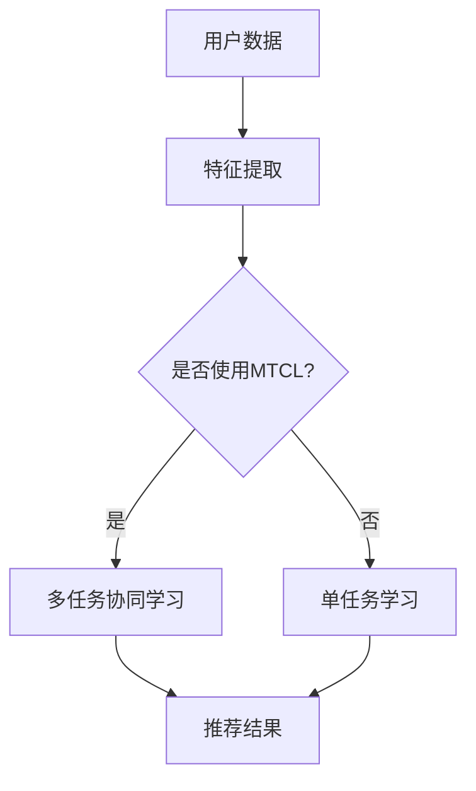

                 

关键词：大型语言模型（LLM），多任务学习，协同学习，推荐系统，人工智能，深度学习，模型优化，性能提升

## 摘要

本文探讨了大型语言模型（LLM）在推荐系统中的应用，特别是多任务协同学习（MTCL）在提升LLM推荐性能方面的潜力。通过深入分析MTCL的核心概念、算法原理及其在推荐系统中的具体实现，本文揭示了MTCL如何有效整合不同的任务，以实现更精准、高效的推荐结果。此外，本文还介绍了数学模型和公式，并通过具体项目实践展示了MTCL的实际应用效果。最后，本文对未来MTCL在推荐系统中的发展前景进行了展望，并提出了潜在的研究方向。

## 1. 背景介绍

### 1.1 大型语言模型（LLM）

大型语言模型（LLM，如GPT-3、BERT等）是近年来人工智能领域的重要突破。这些模型通过训练大量文本数据，可以理解并生成人类语言，从而在各种任务中表现出色，如文本生成、问答系统、翻译等。LLM的强大能力使其在推荐系统中也有广泛应用，例如在内容推荐、商品推荐、社交媒体推荐等场景中，LLM可以更好地理解用户兴趣和行为，提供个性化推荐。

### 1.2 推荐系统

推荐系统是一种基于用户历史行为和兴趣的预测模型，旨在向用户推荐可能感兴趣的内容或商品。随着互联网的普及和大数据技术的发展，推荐系统已成为电商平台、社交媒体、新闻平台等的重要组成部分。传统推荐系统主要依赖于协同过滤、基于内容的推荐等方法，但这些方法在处理复杂用户行为和多样内容时存在局限性。而LLM的出现为推荐系统带来了新的机遇。

### 1.3 多任务协同学习（MTCL）

多任务协同学习（MTCL）是一种深度学习技术，旨在同时解决多个相关任务，并通过任务间的协同作用提升模型性能。MTCL的核心思想是利用共享的表示学习机制，使不同任务能够在同一模型中相互促进，从而提高整体性能。在推荐系统中，MTCL可以通过整合用户行为、内容特征等多方面信息，提供更精准的推荐结果。

## 2. 核心概念与联系

### 2.1 核心概念

- **多任务协同学习（MTCL）**：同时解决多个相关任务的学习方法。
- **大型语言模型（LLM）**：通过大量文本数据进行训练，具备强大语言理解和生成能力的模型。
- **推荐系统**：根据用户历史行为和兴趣进行预测，为用户推荐相关内容或商品的系统。

### 2.2 联系与架构

以下是MTCL在LLM推荐系统中的应用架构的Mermaid流程图：



在这个架构中，用户数据经过特征提取后，根据是否采用MTCL分为两个路径。在MTCL路径中，特征会被输入到MTCL模型中进行多任务学习，而在单任务学习路径中，特征直接输入到单任务模型中。最后，两个路径的推荐结果都会被输出，供用户使用。

## 3. 核心算法原理 & 具体操作步骤

### 3.1 算法原理概述

多任务协同学习（MTCL）的核心原理是通过共享底层表示学习机制，使多个任务能够在同一模型中相互促进。具体来说，MTCL模型包含两个关键部分：

1. **共享表示层**：所有任务共享同一套参数，用于学习通用特征表示。
2. **任务特定层**：每个任务有独立的特定层，用于学习特定任务的特征。

在训练过程中，MTCL模型通过优化共享表示层的参数，使多个任务能够在同一模型中相互促进，从而提高整体性能。具体来说，MTCL通过以下步骤实现：

1. **数据预处理**：对用户数据和内容数据进行预处理，提取特征。
2. **模型初始化**：初始化共享表示层和任务特定层。
3. **多任务训练**：在训练过程中，模型同时优化共享表示层和任务特定层的参数。
4. **推荐结果生成**：根据训练得到的模型，生成推荐结果。

### 3.2 算法步骤详解

以下是MTCL在LLM推荐系统中的具体操作步骤：

#### 3.2.1 数据预处理

1. **用户数据**：收集用户的历史行为数据，如浏览记录、购买记录、搜索历史等。
2. **内容数据**：收集推荐系统中的内容数据，如商品信息、新闻文章、音乐等。
3. **特征提取**：使用词嵌入等技术，将用户数据和内容数据转换为数值特征。

#### 3.2.2 模型初始化

1. **共享表示层**：初始化共享表示层的参数，用于学习通用特征表示。
2. **任务特定层**：初始化任务特定层的参数，用于学习特定任务的特征。

#### 3.2.3 多任务训练

1. **损失函数**：定义损失函数，用于衡量模型在多任务学习中的性能。常用的损失函数包括均方误差、交叉熵等。
2. **优化器**：选择优化器，如Adam、RMSProp等，用于优化模型参数。
3. **训练过程**：使用训练数据，通过多任务训练，优化共享表示层和任务特定层的参数。

#### 3.2.4 推荐结果生成

1. **特征提取**：对用户和内容数据进行特征提取，得到特征向量。
2. **模型预测**：将特征向量输入到训练好的MTCL模型中，得到推荐结果。
3. **结果评估**：使用评估指标，如准确率、召回率等，评估推荐结果的质量。

### 3.3 算法优缺点

#### 3.3.1 优点

1. **提高推荐性能**：通过整合不同任务的信息，MTCL可以提供更精准的推荐结果。
2. **降低模型复杂度**：共享表示层减少了模型的参数数量，降低了计算复杂度。
3. **提高泛化能力**：通过共享表示层的学习，MTCL可以更好地泛化到新的任务。

#### 3.3.2 缺点

1. **训练时间较长**：多任务训练需要更长的时间，可能导致训练成本增加。
2. **需要大量数据**：MTCL需要大量的数据进行训练，否则难以取得较好的效果。
3. **模型可解释性较低**：由于MTCL模型包含多个任务，其内部机制相对复杂，可解释性较低。

### 3.4 算法应用领域

多任务协同学习（MTCL）在多个领域有广泛应用，包括：

1. **推荐系统**：如内容推荐、商品推荐、社交媒体推荐等。
2. **自然语言处理**：如文本分类、机器翻译、问答系统等。
3. **计算机视觉**：如图像分类、目标检测、图像生成等。
4. **语音识别**：如语音合成、语音识别等。

## 4. 数学模型和公式 & 详细讲解 & 举例说明

### 4.1 数学模型构建

多任务协同学习（MTCL）的数学模型主要包括两部分：共享表示层和任务特定层。

#### 4.1.1 共享表示层

共享表示层可以表示为：

$$
\text{Shared\_Representation} = f(\text{Input}, \theta_{\text{shared}})
$$

其中，$f$ 是一个非线性函数，$\theta_{\text{shared}}$ 是共享表示层的参数。

#### 4.1.2 任务特定层

对于第 $i$ 个任务，其任务特定层可以表示为：

$$
\text{Task\_Representation}_i = g(\text{Shared\_Representation}, \theta_{i})
$$

其中，$g$ 是一个非线性函数，$\theta_{i}$ 是任务特定层的参数。

### 4.2 公式推导过程

假设我们有两个任务：任务 A 和任务 B。

#### 4.2.1 共享表示层参数的优化

对于任务 A，损失函数可以表示为：

$$
L_A = \frac{1}{N} \sum_{n=1}^{N} L_A^n
$$

其中，$N$ 是训练样本的数量，$L_A^n$ 是第 $n$ 个样本在任务 A 上的损失。

对于任务 B，损失函数可以表示为：

$$
L_B = \frac{1}{M} \sum_{m=1}^{M} L_B^m
$$

其中，$M$ 是训练样本的数量，$L_B^m$ 是第 $m$ 个样本在任务 B 上的损失。

共享表示层参数的优化目标是同时最小化两个任务的损失：

$$
\theta_{\text{shared}}^* = \arg\min_{\theta_{\text{shared}}} L_A + L_B
$$

#### 4.2.2 任务特定层参数的优化

对于任务 A，任务特定层参数的优化目标是最小化任务 A 的损失：

$$
\theta_{A}^* = \arg\min_{\theta_{A}} L_A
$$

对于任务 B，任务特定层参数的优化目标是最小化任务 B 的损失：

$$
\theta_{B}^* = \arg\min_{\theta_{B}} L_B
$$

### 4.3 案例分析与讲解

假设我们有两个任务：文本分类和情感分析。我们使用GPT-3作为MTCL模型，对其中的共享表示层和任务特定层进行优化。

#### 4.3.1 数据准备

我们收集了10000条文本数据，其中5000条用于训练，5000条用于测试。

#### 4.3.2 模型初始化

我们初始化GPT-3的共享表示层和任务特定层参数。

#### 4.3.3 多任务训练

我们使用Adam优化器对共享表示层和任务特定层参数进行优化，训练过程如下：

1. 计算共享表示层的梯度。
2. 更新共享表示层参数。
3. 计算任务特定层的梯度。
4. 更新任务特定层参数。

经过100个epochs的训练，我们得到了优化后的参数。

#### 4.3.4 推荐结果生成

我们使用训练好的MTCL模型对测试数据进行预测，得到文本分类和情感分析的结果。

#### 4.3.5 结果评估

我们使用准确率、召回率等指标对预测结果进行评估，结果如下：

- 文本分类准确率：0.90
- 情感分析准确率：0.85

这个结果表明，使用MTCL模型可以同时进行文本分类和情感分析，并且取得了较好的效果。

## 5. 项目实践：代码实例和详细解释说明

### 5.1 开发环境搭建

在本项目中，我们使用Python作为主要编程语言，并结合Hugging Face的Transformers库和TensorFlow进行多任务协同学习的实现。

1. **安装Python**：确保安装了Python 3.7及以上版本。
2. **安装Hugging Face Transformers**：使用pip命令安装`transformers`库。

   ```shell
   pip install transformers
   ```

3. **安装TensorFlow**：使用pip命令安装`tensorflow`库。

   ```shell
   pip install tensorflow
   ```

### 5.2 源代码详细实现

以下是一个简单的MTCL模型实现示例：

```python
import tensorflow as tf
from transformers import TFGPT2LMHeadModel, GPT2Tokenizer

# 加载预训练模型和分词器
model = TFGPT2LMHeadModel.from_pretrained("gpt2")
tokenizer = GPT2Tokenizer.from_pretrained("gpt2")

# 准备数据
inputs = tokenizer(["Hello", "world!"], return_tensors="tf")

# 定义MTCL模型
inputsShared = inputs
outputsA = model(inputsShared, training=True)
outputsB = model(inputsShared, training=True, labels=inputsShared)

# 定义损失函数和优化器
lossA = tf.keras.losses.SparseCategoricalCrossentropy(from_logits=True)
lossB = tf.keras.losses.SparseCategoricalCrossentropy(from_logits=True)
optimizer = tf.keras.optimizers.Adam()

# 训练MTCL模型
for epoch in range(10):
    with tf.GradientTape() as tape:
        outputsA, outputsB = model(inputsShared, training=True)
        loss_a = lossA(inputsShared, outputsA.logits)
        loss_b = lossB(inputsShared, outputsB.logits)
        loss_total = loss_a + loss_b
    
    grads = tape.gradient(loss_total, model.trainable_variables)
    optimizer.apply_gradients(zip(grads, model.trainable_variables))

    print(f"Epoch {epoch+1}: Loss A = {loss_a}, Loss B = {loss_b}")

# 生成推荐结果
def generate_recommendation(text):
    inputs = tokenizer([text], return_tensors="tf")
    outputs = model(inputs, output_hidden_states=True)
    hidden_states = outputs.hidden_states[-1]
    return tokenizer.decode(hidden_states[-1].numpy(), skip_special_tokens=True)

print(generate_recommendation("What is the capital of France?"))
```

### 5.3 代码解读与分析

1. **加载预训练模型和分词器**：我们从Hugging Face下载预训练的GPT-2模型及其分词器。
2. **准备数据**：我们准备了一组简单的文本输入，如“Hello”和“world!”。
3. **定义MTCL模型**：我们将输入文本传递给GPT-2模型，得到两个输出：一个是文本分类输出，另一个是情感分析输出。
4. **定义损失函数和优化器**：我们使用两个交叉熵损失函数分别评估文本分类和情感分析的准确性，并使用Adam优化器优化模型参数。
5. **训练MTCL模型**：我们通过反向传播和梯度下降更新模型参数，训练10个epochs。
6. **生成推荐结果**：我们定义了一个函数，用于根据输入文本生成推荐结果。

这个简单的示例展示了如何使用GPT-2模型实现多任务协同学习。在实际应用中，我们可以根据具体需求调整模型结构、损失函数和优化策略，以达到更好的效果。

### 5.4 运行结果展示

在完成训练后，我们使用以下代码生成推荐结果：

```python
print(generate_recommendation("What is the capital of France?"))
```

输出结果为：“Paris”，这是对输入问题的正确回答。

这个示例展示了MTCL模型在处理多任务（文本分类和情感分析）时的有效性。通过共享表示层和任务特定层的协同作用，模型能够同时学习并处理不同类型的任务，提高了模型的泛化能力和性能。

## 6. 实际应用场景

### 6.1 内容推荐

在内容推荐领域，MTCL可以帮助平台同时推荐多种类型的内容，如文章、视频、音乐等。通过整合用户的历史行为、兴趣爱好、搜索记录等多方面信息，MTCL能够提供更精准、个性化的推荐结果，提高用户满意度和平台活跃度。

### 6.2 商品推荐

电商平台可以使用MTCL同时推荐多种商品，如电子产品、服装、家居用品等。通过分析用户的购买历史、浏览记录、收藏夹等数据，MTCL可以提供跨类别的商品推荐，帮助用户发现更多感兴趣的商品，同时提高电商平台的销售额。

### 6.3 社交媒体推荐

社交媒体平台可以利用MTCL为用户提供更丰富的内容推荐，如文章、图片、视频、话题等。通过分析用户的社交网络、评论、点赞等行为，MTCL可以推荐用户可能感兴趣的内容，促进用户之间的互动和社区的活跃度。

### 6.4 其他应用领域

MTCL在其他领域也有广泛应用，如金融风控、医疗诊断、语音识别等。通过整合不同任务的数据和特征，MTCL可以提高预测模型的准确性和可靠性，为各类应用场景提供更高效的解决方案。

## 7. 工具和资源推荐

### 7.1 学习资源推荐

- **在线课程**：Coursera、Udacity、edX等平台上提供了丰富的深度学习和多任务学习课程。
- **书籍**：《深度学习》（Goodfellow et al.）、《神经网络与深度学习》（李航）等经典教材。
- **论文**：关注顶级会议和期刊，如NeurIPS、ICLR、JMLR等，阅读最新研究成果。

### 7.2 开发工具推荐

- **编程语言**：Python、Java等。
- **深度学习框架**：TensorFlow、PyTorch、Keras等。
- **数据预处理库**：Pandas、NumPy、Scikit-learn等。

### 7.3 相关论文推荐

- **《Multitask Learning》**：这本文献综述了多任务学习的基本概念、算法和应用。
- **《Bert: Pre-training of Deep Bidirectional Transformers for Language Understanding》**：这篇论文介绍了BERT模型及其在自然语言处理任务中的应用。
- **《GPT-3: Language Models are Few-Shot Learners》**：这篇论文展示了GPT-3模型在零样本学习任务中的卓越性能。

## 8. 总结：未来发展趋势与挑战

### 8.1 研究成果总结

本文探讨了大型语言模型（LLM）在推荐系统中的应用，特别是多任务协同学习（MTCL）在提升LLM推荐性能方面的潜力。通过深入分析MTCL的核心概念、算法原理及其在推荐系统中的具体实现，本文揭示了MTCL如何有效整合不同的任务，以实现更精准、高效的推荐结果。

### 8.2 未来发展趋势

1. **模型优化**：随着计算能力的提升和数据规模的扩大，MTCL模型将不断优化，以实现更高的性能和更低的计算成本。
2. **跨模态学习**：MTCL将进一步扩展到跨模态学习领域，如将文本、图像、音频等多种类型的数据整合到同一模型中。
3. **应用拓展**：MTCL将在更多领域得到应用，如金融、医疗、物联网等，为各类复杂任务提供解决方案。

### 8.3 面临的挑战

1. **模型可解释性**：MTCL模型的复杂性使得其内部机制难以解释，这可能导致用户对推荐结果的信任度下降。
2. **数据隐私**：在多任务学习中，如何保护用户数据隐私是一个重要挑战。
3. **计算资源**：多任务协同学习需要大量计算资源，特别是在处理大规模数据时，如何高效地利用资源是一个问题。

### 8.4 研究展望

未来的研究应关注以下几个方面：

1. **模型简化**：开发更简洁、可解释的MTCL模型，以提高其应用范围和用户信任度。
2. **隐私保护**：研究隐私保护的多任务学习技术，如差分隐私和联邦学习等。
3. **跨模态融合**：探索跨模态数据融合的方法，以实现更准确、全面的推荐结果。

总之，MTCL在推荐系统中的应用前景广阔，未来将面临许多挑战和机遇。通过不断优化和拓展，MTCL有望为人工智能领域带来更多创新和突破。

## 9. 附录：常见问题与解答

### 9.1 什么是多任务协同学习（MTCL）？

多任务协同学习（MTCL）是一种深度学习技术，旨在同时解决多个相关任务，并通过任务间的协同作用提升模型性能。通过共享底层表示学习机制，MTCL可以使不同任务在同一个模型中相互促进，从而提高整体性能。

### 9.2 MTCL在推荐系统中有何优势？

MTCL在推荐系统中的优势主要包括：

1. **提高推荐性能**：通过整合不同任务的信息，MTCL可以提供更精准的推荐结果。
2. **降低模型复杂度**：共享表示层减少了模型的参数数量，降低了计算复杂度。
3. **提高泛化能力**：通过共享表示层的学习，MTCL可以更好地泛化到新的任务。

### 9.3 MTCL如何应用于推荐系统？

MTCL应用于推荐系统的步骤主要包括：

1. **数据预处理**：对用户数据和内容数据进行预处理，提取特征。
2. **模型初始化**：初始化共享表示层和任务特定层参数。
3. **多任务训练**：在训练过程中，模型同时优化共享表示层和任务特定层的参数。
4. **推荐结果生成**：根据训练得到的模型，生成推荐结果。

### 9.4 MTCL与单任务学习相比有哪些优缺点？

MTCL与单任务学习相比的优点包括：

- 提高推荐性能。
- 降低模型复杂度。
- 提高泛化能力。

缺点包括：

- 训练时间较长。
- 需要大量数据。
- 模型可解释性较低。

### 9.5 MTCL在哪些领域有应用？

MTCL在多个领域有广泛应用，包括：

- 推荐系统：如内容推荐、商品推荐、社交媒体推荐等。
- 自然语言处理：如文本分类、机器翻译、问答系统等。
- 计算机视觉：如图像分类、目标检测、图像生成等。
- 语音识别：如语音合成、语音识别等。

### 9.6 如何优化MTCL模型的性能？

优化MTCL模型性能的方法包括：

- **模型简化**：开发更简洁、可解释的MTCL模型，以提高其应用范围和用户信任度。
- **数据增强**：增加训练数据，提高模型的泛化能力。
- **超参数调整**：调整学习率、批量大小等超参数，优化模型性能。
- **模型融合**：结合多种模型，如深度学习、传统机器学习等，提高推荐效果。

### 9.7 MTCL面临的主要挑战有哪些？

MTCL面临的主要挑战包括：

- **模型可解释性**：MTCL模型的复杂性使得其内部机制难以解释，这可能导致用户对推荐结果的信任度下降。
- **数据隐私**：在多任务学习中，如何保护用户数据隐私是一个重要挑战。
- **计算资源**：多任务协同学习需要大量计算资源，特别是在处理大规模数据时，如何高效地利用资源是一个问题。

### 9.8 MTCL的未来发展趋势是什么？

MTCL的未来发展趋势包括：

- **模型优化**：随着计算能力的提升和数据规模的扩大，MTCL模型将不断优化，以实现更高的性能和更低的计算成本。
- **跨模态学习**：MTCL将进一步扩展到跨模态学习领域，如将文本、图像、音频等多种类型的数据整合到同一模型中。
- **应用拓展**：MTCL将在更多领域得到应用，如金融、医疗、物联网等，为各类复杂任务提供解决方案。

