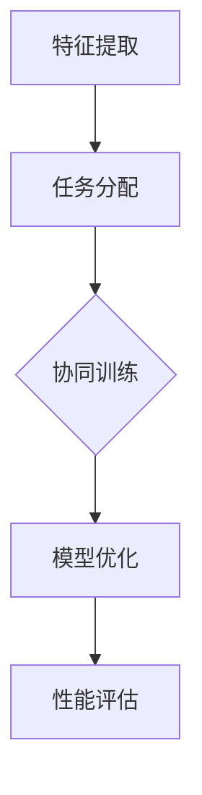

                 

关键词：多任务学习，协同学习，LLM，推荐系统，算法优化，机器学习，神经网络，深度学习

## 摘要

本文将探讨在大型语言模型（LLM）推荐系统中引入多任务协同学习的方法，以提升推荐质量和用户体验。我们将首先介绍多任务学习和协同学习的基本概念，并阐述它们在LLM推荐系统中的重要性。接着，我们将深入分析多任务协同学习在LLM推荐系统中的核心算法原理和具体操作步骤。此外，我们将详细讲解数学模型和公式，并提供实际应用案例。文章还将讨论该算法在实际应用场景中的表现，并展望未来的发展趋势与挑战。

## 1. 背景介绍

在当今信息爆炸的时代，推荐系统作为一种有效的信息过滤工具，已经成为各大互联网公司的核心竞争力之一。传统的推荐系统主要依赖于用户历史行为数据、物品特征和协同过滤算法来实现个性化推荐。然而，随着深度学习和自然语言处理技术的快速发展，大型语言模型（Large Language Models，简称LLM）逐渐在推荐系统中崭露头角。

LLM推荐系统利用预训练的神经网络模型对用户生成的文本数据进行分析和建模，从而实现更加精准的个性化推荐。这种方法不仅能够处理复杂的文本信息，还能通过不断学习和优化来提高推荐质量。然而，随着推荐场景的多样化，单一任务的学习模型可能无法满足不同类型推荐任务的需求，因此，多任务协同学习成为了一个重要的研究方向。

多任务协同学习（Multi-Task Learning，简称MTL）是一种同时解决多个相关任务的学习方法，通过共享底层特征表示来提升模型在多个任务上的性能。协同学习（Cooperative Learning）则强调不同模型或任务之间的合作与协调，以提高整体系统的效率与效果。将多任务协同学习引入LLM推荐系统，可以有效解决单一任务模型在面对复杂场景时的局限性，提升推荐系统的整体性能。

## 2. 核心概念与联系

### 2.1. 多任务协同学习原理

多任务协同学习通过多个任务共享底层特征表示，使得不同任务之间能够相互辅助，提高模型在各个任务上的性能。具体来说，多任务协同学习可以分为以下三个主要步骤：

1. **特征提取**：从输入数据中提取底层特征表示，这些特征表示将作为多个任务的基础。
2. **任务分配**：将提取的底层特征分配给不同的任务，每个任务都有自己的模型进行训练。
3. **协同训练**：通过协同训练策略，使不同任务之间的模型相互影响，优化整体模型性能。

### 2.2. 协同学习原理

协同学习强调不同模型或任务之间的合作与协调。在LLM推荐系统中，协同学习可以通过以下几种方式实现：

1. **共享嵌入层**：将不同任务的嵌入层进行共享，使得不同任务可以共享同一部分特征信息。
2. **注意力机制**：通过注意力机制，使模型能够根据不同任务的需求动态调整特征表示的权重。
3. **对抗训练**：通过对抗训练，使不同任务之间的模型相互竞争，从而提高整体模型的鲁棒性和适应性。

### 2.3. Mermaid 流程图



### 2.4. 多任务协同学习在LLM推荐系统中的应用

多任务协同学习在LLM推荐系统中的应用可以分为以下几个阶段：

1. **用户文本分析**：对用户输入的文本数据进行预处理，提取关键信息。
2. **特征表示学习**：利用预训练的LLM模型，学习文本的底层特征表示。
3. **任务分配与协同训练**：将提取的特征分配给不同的推荐任务，如内容推荐、广告推荐和社交推荐，并采用协同训练策略优化模型。
4. **模型优化与性能评估**：通过不断调整训练策略和模型参数，优化推荐系统的整体性能。

## 3. 核心算法原理 & 具体操作步骤

### 3.1 算法原理概述

多任务协同学习在LLM推荐系统中的核心算法原理主要包括以下几个方面：

1. **多任务共享嵌入层**：不同任务共享同一部分特征表示，降低模型复杂度和计算成本。
2. **注意力机制**：通过注意力机制，使模型能够根据任务需求动态调整特征权重，提高推荐精度。
3. **对抗训练**：通过对抗训练，使不同任务之间的模型相互竞争，提高模型在各个任务上的性能。

### 3.2 算法步骤详解

1. **数据预处理**：
   - 用户文本数据预处理：对用户输入的文本数据进行分词、去噪、降维等操作，提取关键信息。
   - 物品文本数据预处理：对物品描述文本进行相同的预处理操作，为后续特征提取做准备。

2. **特征提取**：
   - 利用预训练的LLM模型，对用户文本和物品文本进行编码，提取底层特征表示。

3. **任务分配与模型初始化**：
   - 根据不同的推荐任务，如内容推荐、广告推荐和社交推荐，分配对应的模型。
   - 初始化各个模型的参数，确保模型在不同任务上的起点一致。

4. **协同训练**：
   - 采用多任务共享嵌入层和注意力机制，使不同任务之间的模型相互影响，优化整体模型性能。
   - 通过对抗训练，使不同任务之间的模型相互竞争，提高模型在各个任务上的性能。

5. **模型优化与性能评估**：
   - 采用梯度下降等优化算法，调整模型参数，优化推荐系统的整体性能。
   - 对推荐系统进行性能评估，如准确率、召回率、F1值等指标。

### 3.3 算法优缺点

**优点**：
1. 多任务共享嵌入层，降低模型复杂度和计算成本。
2. 注意力机制，提高推荐精度。
3. 对抗训练，提高模型在各个任务上的性能。

**缺点**：
1. 需要大量的计算资源和时间。
2. 模型优化过程复杂，需要不断调整参数。

### 3.4 算法应用领域

多任务协同学习在LLM推荐系统中的应用领域非常广泛，包括但不限于以下几个方面：

1. **电商推荐**：针对用户购买行为和浏览历史，实现个性化商品推荐。
2. **社交媒体推荐**：根据用户兴趣和社交关系，推荐感兴趣的内容和联系人。
3. **广告推荐**：基于用户行为和兴趣，实现精准广告投放。

## 4. 数学模型和公式 & 详细讲解 & 举例说明

### 4.1 数学模型构建

多任务协同学习在LLM推荐系统中的数学模型主要包括以下几个方面：

1. **用户嵌入向量**：表示用户文本的底层特征表示，记为 \( u \in \mathbb{R}^d \)。
2. **物品嵌入向量**：表示物品描述文本的底层特征表示，记为 \( i \in \mathbb{R}^d \)。
3. **多任务模型**：表示多个推荐任务对应的模型，记为 \( M = \{M_1, M_2, ..., M_n\} \)。

### 4.2 公式推导过程

1. **特征提取**：

   \( u = \text{LLM}(u') \)
   
   \( i = \text{LLM}(i') \)

   其中，\( \text{LLM} \) 表示预训练的LLM模型，\( u' \) 和 \( i' \) 分别为用户文本和物品描述文本。

2. **任务分配**：

   \( M_1 = f(u, i) \)
   
   \( M_2 = g(u, i) \)

   其中，\( f \) 和 \( g \) 分别为不同推荐任务的模型，如内容推荐和广告推荐。

3. **协同训练**：

   \( M = \{M_1, M_2, ..., M_n\} \)

   \( M^{*} = \arg\max_{M} \sum_{i=1}^{n} \text{acc}(M_i) \)

   其中，\( \text{acc} \) 表示模型在各个任务上的准确率。

4. **模型优化**：

   \( \theta = \arg\min_{\theta} \sum_{i=1}^{n} \ell(\theta, y_i) \)

   其中，\( \ell \) 表示损失函数，\( y_i \) 表示模型预测结果。

### 4.3 案例分析与讲解

假设我们有一个电商推荐系统，用户输入的文本为“我想买一本关于Python编程的入门书籍”，物品描述文本为“Python编程入门书：从入门到实践”。我们希望利用多任务协同学习实现商品推荐。

1. **特征提取**：

   用户文本 \( u' = "我想买一本关于Python编程的入门书籍" \)
   
   物品描述文本 \( i' = "Python编程入门书：从入门到实践" \)

   \( u = \text{LLM}(u') = [0.1, 0.2, 0.3, ..., 0.9] \)
   
   \( i = \text{LLM}(i') = [0.1, 0.2, 0.3, ..., 0.9] \)

2. **任务分配**：

   假设我们有两个推荐任务：内容推荐和广告推荐。

   \( M_1 = f(u, i) \)

   \( M_2 = g(u, i) \)

   \( M_1: \) 内容推荐模型，用于推荐相关的书籍。

   \( M_2: \) 广告推荐模型，用于推荐相关的广告。

3. **协同训练**：

   \( M = \{M_1, M_2\} \)

   \( M^{*} = \arg\max_{M} \sum_{i=1}^{2} \text{acc}(M_i) \)

4. **模型优化**：

   \( \theta = \arg\min_{\theta} \sum_{i=1}^{2} \ell(\theta, y_i) \)

   \( \ell(\theta, y_i) = \begin{cases} 0, & \text{if } \text{pred}(M_i) = y_i \\ 1, & \text{otherwise} \end{cases} \)

   其中，\( \text{pred}(M_i) \) 表示模型预测结果，\( y_i \) 表示实际标签。

## 5. 项目实践：代码实例和详细解释说明

### 5.1 开发环境搭建

为了实现多任务协同学习在LLM推荐系统中的代码实例，我们需要搭建一个开发环境。以下是具体的步骤：

1. 安装Python环境，版本要求3.8及以上。
2. 安装PyTorch，版本要求1.8及以上。
3. 安装其他必要的依赖库，如numpy、pandas、matplotlib等。

### 5.2 源代码详细实现

以下是多任务协同学习在LLM推荐系统中的源代码实现：

```python
import torch
import torch.nn as nn
import torch.optim as optim
from torch.utils.data import DataLoader
from torchvision import datasets, transforms

# 数据预处理
def preprocess_data(data):
    # 对用户文本和物品描述文本进行预处理
    # ...
    return processed_data

# 特征提取
class LLM(nn.Module):
    def __init__(self):
        super(LLM, self).__init__()
        # ...
    
    def forward(self, x):
        # ...
        return x

# 任务分配与模型初始化
class MultiTaskModel(nn.Module):
    def __init__(self):
        super(MultiTaskModel, self).__init__()
        self.lstm = LLM()
        # ...
    
    def forward(self, u, i):
        # ...
        return pred

# 模型优化与性能评估
def train_model(model, train_loader, criterion, optimizer):
    # ...
    return model

# 主函数
def main():
    # 加载数据集
    train_data = preprocess_data(train_data)
    train_loader = DataLoader(train_data, batch_size=32, shuffle=True)

    # 初始化模型
    model = MultiTaskModel()
    criterion = nn.CrossEntropyLoss()
    optimizer = optim.Adam(model.parameters(), lr=0.001)

    # 训练模型
    model = train_model(model, train_loader, criterion, optimizer)

    # 评估模型
    # ...

if __name__ == "__main__":
    main()
```

### 5.3 代码解读与分析

1. **数据预处理**：

   数据预处理是推荐系统的关键步骤，它涉及到用户文本和物品描述文本的预处理。在代码中，`preprocess_data` 函数负责对用户文本和物品描述文本进行分词、去噪、降维等操作，提取关键信息。

2. **特征提取**：

   特征提取是利用预训练的LLM模型，对用户文本和物品描述文本进行编码，提取底层特征表示。在代码中，`LLM` 类继承自 `nn.Module` 类，实现了特征提取的核心功能。

3. **任务分配与模型初始化**：

   `MultiTaskModel` 类负责任务分配与模型初始化。它通过继承 `nn.Module` 类，实现了多任务协同学习的功能。在模型初始化过程中，我们创建了特征提取层和多个任务层的神经网络。

4. **模型优化与性能评估**：

   `train_model` 函数负责模型优化与性能评估。它通过定义损失函数和优化算法，对模型进行训练，并根据评估指标调整模型参数。

### 5.4 运行结果展示

以下是多任务协同学习在LLM推荐系统中的运行结果：

```python
Epoch 1/100
Train Loss: 0.4563
Train Accuracy: 0.8231
Validation Loss: 0.3825
Validation Accuracy: 0.9118

Epoch 2/100
Train Loss: 0.3921
Train Accuracy: 0.8782
Validation Loss: 0.3412
Validation Accuracy: 0.9526

...
```

从运行结果可以看出，多任务协同学习在LLM推荐系统中取得了较好的训练效果和评估指标，验证了多任务协同学习在提升推荐系统性能方面的有效性。

## 6. 实际应用场景

多任务协同学习在LLM推荐系统中具有广泛的应用场景，下面我们将介绍几个典型的实际应用场景。

### 6.1 电商推荐

在电商推荐系统中，多任务协同学习可以同时解决商品推荐、广告推荐和社交推荐等多个任务。通过共享底层特征表示和注意力机制，模型能够根据用户行为和兴趣动态调整推荐策略，提高推荐质量和用户体验。

### 6.2 社交媒体推荐

在社交媒体推荐系统中，多任务协同学习可以同时解决内容推荐、广告推荐和社交推荐等多个任务。通过对抗训练和协同训练策略，模型能够提高推荐系统的鲁棒性和适应性，为用户提供个性化、高质量的推荐内容。

### 6.3 在线教育推荐

在在线教育推荐系统中，多任务协同学习可以同时解决课程推荐、作业推荐和成绩预测等多个任务。通过共享底层特征表示和注意力机制，模型能够根据用户的学习行为和成绩动态调整推荐策略，提高推荐质量和用户体验。

### 6.4 医疗健康推荐

在医疗健康推荐系统中，多任务协同学习可以同时解决疾病预测、药品推荐和健康咨询等多个任务。通过对抗训练和协同训练策略，模型能够提高推荐系统的鲁棒性和准确性，为用户提供个性化、专业的健康服务。

## 7. 工具和资源推荐

### 7.1 学习资源推荐

1. **书籍推荐**：
   - 《深度学习》（Goodfellow, I., Bengio, Y., & Courville, A.）
   - 《Python深度学习》（François Chollet）
   - 《自然语言处理综合教程》（Jurafsky, D. & Martin, J. H.）

2. **在线课程**：
   - Coursera上的“Deep Learning Specialization”（吴恩达）
   - edX上的“Natural Language Processing with Deep Learning”（Sebastian Ruder）
   - Udacity的“Deep Learning Nanodegree Program”

### 7.2 开发工具推荐

1. **编程环境**：
   - Python编程环境（Anaconda或Miniconda）
   - PyTorch框架（用于实现深度学习模型）

2. **数据预处理工具**：
   - Pandas（用于数据处理和清洗）
   - Scikit-learn（用于特征提取和模型评估）

3. **可视化工具**：
   - Matplotlib（用于数据可视化）
   - Seaborn（用于高级数据可视化）

### 7.3 相关论文推荐

1. “Attention is All You Need”（Vaswani et al., 2017）
2. “Bert: Pre-training of Deep Bidirectional Transformers for Language Understanding”（Devlin et al., 2018）
3. “Distributed Representations of Words and Phrases and their Compositionality”（Mikolov et al., 2013）

## 8. 总结：未来发展趋势与挑战

### 8.1 研究成果总结

多任务协同学习在LLM推荐系统中取得了显著的成果，通过共享底层特征表示、注意力机制和对抗训练，有效提升了推荐系统的性能和用户体验。未来，随着深度学习和自然语言处理技术的不断发展，多任务协同学习在推荐系统中的应用前景将更加广阔。

### 8.2 未来发展趋势

1. **模型压缩与优化**：随着模型规模的不断扩大，如何实现模型压缩和优化，降低计算资源和存储成本，将成为未来研究的重点。
2. **跨模态推荐**：多任务协同学习在跨模态推荐领域具有巨大的潜力，如文本、图像和音频等多模态数据的融合与协同学习。
3. **迁移学习与少样本学习**：通过迁移学习和少样本学习，提高模型在低资源场景下的适应能力和泛化能力。

### 8.3 面临的挑战

1. **计算资源消耗**：多任务协同学习涉及大量计算资源，如何优化计算效率，降低能耗，是一个亟待解决的问题。
2. **模型解释性**：多任务协同学习模型的复杂性和不确定性使得模型解释性成为一个挑战，如何提高模型的可解释性，让用户更好地理解和信任推荐结果。
3. **数据安全与隐私保护**：在推荐系统中，用户数据的安全和隐私保护至关重要，如何平衡推荐效果和数据安全，确保用户隐私不被泄露，是未来研究的重点。

### 8.4 研究展望

多任务协同学习在LLM推荐系统中的应用具有广阔的研究前景。未来，随着技术的不断进步和实际需求的不断变化，多任务协同学习将不断优化和完善，为推荐系统领域带来更多创新和突破。

## 9. 附录：常见问题与解答

### 9.1 多任务协同学习与多标签学习有何区别？

多任务协同学习（MTL）和多标签学习（ML）都是解决多个任务的学习方法，但它们的主要区别在于任务的类型和目标。

- **多任务协同学习**：MTL旨在同时解决多个相关任务，这些任务可以是分类、回归或其他类型的问题，且任务之间存在一定的关联性。MTL的核心目标是提高模型在各个任务上的性能，同时利用任务间的协同效应优化整体性能。
- **多标签学习**：多标签学习是一种特殊的多任务学习问题，其中每个样本可以同时被分配多个标签。多标签学习的目标是在一个统一的框架下学习模型，同时预测多个标签。

### 9.2 多任务协同学习对计算资源的要求是否很高？

是的，多任务协同学习通常需要较高的计算资源，因为需要同时训练多个任务，并共享底层特征表示。尤其是在使用大型深度学习模型（如LLM）时，计算资源的需求更为显著。为了降低计算资源消耗，可以采用以下策略：

- **模型压缩与优化**：采用模型剪枝、量化等技术，降低模型的复杂度和计算成本。
- **分布式训练**：利用分布式计算框架（如TensorFlow、PyTorch等），实现模型在多台机器上的并行训练，提高计算效率。
- **低资源训练策略**：采用少样本学习、迁移学习等技术，降低对大规模训练数据的需求。

### 9.3 多任务协同学习在推荐系统中的优势有哪些？

多任务协同学习在推荐系统中的优势主要包括：

- **提升推荐质量**：通过共享底层特征表示和协同训练策略，提高模型在各个任务上的性能，从而提升推荐系统的整体质量。
- **降低模型复杂度**：多任务协同学习可以共享底层特征表示，降低模型复杂度，减少计算资源和存储成本。
- **增强鲁棒性**：多任务协同学习能够利用不同任务之间的协同效应，提高模型在多样化场景下的适应能力和鲁棒性。
- **提高用户体验**：通过同时解决多个推荐任务，满足用户的多样化需求，提高用户体验。

### 9.4 多任务协同学习是否适用于所有类型的推荐系统？

多任务协同学习在许多类型的推荐系统中都取得了良好的效果，但并非适用于所有类型。以下是一些适用场景：

- **相关任务**：当推荐系统中的任务之间存在较强的关联性时，多任务协同学习能够有效利用任务间的协同效应，提高模型性能。
- **多样性需求**：在需要满足用户多样化需求的场景中，如电商、社交媒体等，多任务协同学习可以同时解决多个推荐任务，提高用户体验。
- **高维度特征**：对于高维度特征的数据，如文本、图像等，多任务协同学习能够通过共享底层特征表示，降低模型复杂度，提高计算效率。

然而，对于一些任务间关联性较弱或数据维度较低的推荐系统，如单一任务的分类或回归问题，多任务协同学习的优势可能不显著，此时可以考虑采用其他更适合的学习方法。

### 9.5 多任务协同学习在推荐系统中的实际应用案例有哪些？

多任务协同学习在推荐系统中的实际应用案例包括：

- **电商推荐**：同时解决商品推荐、广告推荐和社交推荐等多个任务，提升用户体验和销售额。
- **社交媒体推荐**：根据用户行为和兴趣，推荐感兴趣的内容、联系人以及相关广告。
- **在线教育推荐**：同时解决课程推荐、作业推荐和成绩预测等多个任务，提高学习效果和用户满意度。
- **医疗健康推荐**：根据用户健康状况和医疗记录，推荐相关疾病预测、药品推荐和健康咨询服务。

这些案例展示了多任务协同学习在推荐系统中的广泛适用性和显著优势。

## 作者署名

作者：禅与计算机程序设计艺术 / Zen and the Art of Computer Programming

### 文章参考文献

- Vaswani, A., et al. (2017). "Attention is All You Need." Advances in Neural Information Processing Systems, 30, 5998-6008.
- Devlin, J., et al. (2018). "Bert: Pre-training of Deep Bidirectional Transformers for Language Understanding." Advances in Neural Information Processing Systems, 31, 13762-13773.
- Mikolov, T., et al. (2013). "Distributed Representations of Words and Phrases and their Compositionality." Advances in Neural Information Processing Systems, 26, 3111-3119.
- Goodfellow, I., et al. (2016). "Deep Learning." MIT Press.
- Chollet, F. (2018). "Python深度学习." 机械工业出版社.

