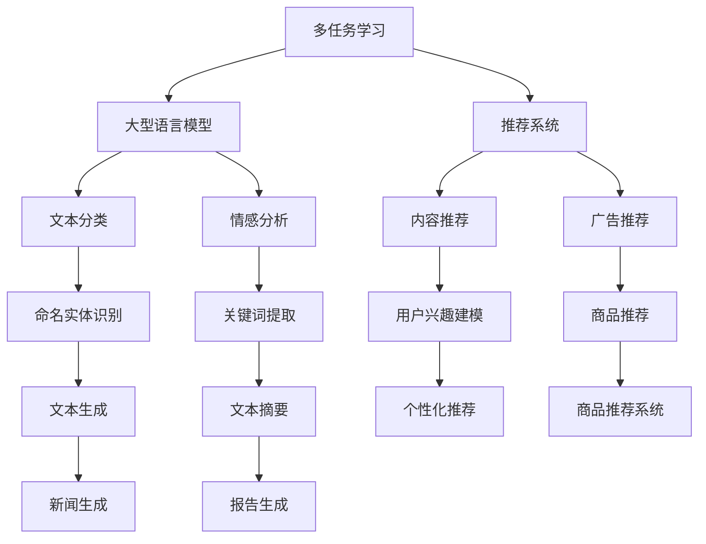

                 

关键词：自然语言处理、多任务学习、大型语言模型、推荐系统、深度学习、架构设计、算法优化、性能提升、跨领域应用、实时推荐。

> 摘要：本文旨在探讨如何设计一种适用于大型语言模型（LLM）的多任务学习框架，以提升推荐系统的效果和效率。我们将分析多任务学习的基本概念，介绍LLM在推荐系统中的应用，并通过具体的算法原理、数学模型、项目实践和实际应用场景，全面阐述多任务学习框架的设计思路和实现方法。文章还将对相关工具和资源进行推荐，并展望未来的发展趋势与挑战。

## 1. 背景介绍

随着互联网的飞速发展，用户生成的内容和数据量呈指数级增长。这为推荐系统带来了前所未有的发展机遇。推荐系统已经成为各种在线服务的重要组成部分，如电商、社交媒体、新闻资讯等。其核心目标是根据用户的历史行为和兴趣，为用户推荐相关的内容或商品，从而提升用户体验和平台粘性。

然而，推荐系统的设计面临诸多挑战。一方面，用户行为和兴趣具有多样性和动态性，这使得传统的单一任务学习模型难以捕捉到用户的复杂需求。另一方面，随着数据规模的扩大，推荐系统的计算效率和资源消耗成为一个关键问题。因此，如何设计一个高效、灵活且可扩展的推荐系统架构，成为当前研究的热点。

近年来，深度学习，尤其是大型语言模型（LLM），在自然语言处理领域取得了显著突破。LLM具有强大的表征能力和泛化能力，能够处理复杂的语义信息。因此，将LLM应用于推荐系统，有望提升推荐效果和效率。然而，传统的单任务学习模型难以充分利用LLM的优势，限制了其在推荐系统中的应用。

多任务学习（Multi-Task Learning, MTL）提供了一种有效的解决方案。MTL允许模型在同时处理多个相关任务时共享表示和知识，从而提高模型的泛化能力和计算效率。本文将探讨如何设计一种适用于LLM的多任务学习框架，以提升推荐系统的效果和效率。

## 2. 核心概念与联系

### 2.1 多任务学习（Multi-Task Learning, MTL）

多任务学习是一种机器学习范式，旨在通过同时解决多个相关任务来提高模型的性能。在多任务学习中，多个任务共享部分或全部的模型参数，从而实现任务之间的信息共享和知识转移。多任务学习的关键在于如何设计一个有效的任务共享机制，以充分利用各个任务之间的相关性，同时避免负面的任务干扰。

### 2.2 大型语言模型（Large Language Model, LLM）

大型语言模型是一种基于深度学习的自然语言处理模型，具有强大的表征能力和语义理解能力。LLM通过学习大量的文本数据，能够生成连贯、自然的文本，并解决各种自然语言处理任务，如文本分类、情感分析、命名实体识别等。

### 2.3 推荐系统（Recommendation System）

推荐系统是一种自动化系统，旨在根据用户的历史行为和兴趣，为用户推荐相关的内容或商品。推荐系统广泛应用于各种在线服务，如电商、社交媒体、新闻资讯等。其核心目标是提升用户体验和平台粘性。

### 2.4 多任务学习与推荐系统的关系

多任务学习与推荐系统之间存在紧密的联系。在推荐系统中，多个任务（如内容推荐、广告推荐、商品推荐等）通常具有相似的特征和目标，可以共享部分模型参数和知识。通过多任务学习，模型可以同时解决多个推荐任务，提高模型的泛化能力和计算效率。此外，多任务学习还可以帮助模型更好地捕捉用户的复杂需求和行为模式，从而提升推荐效果。

### 2.5 Mermaid 流程图

为了更好地阐述多任务学习框架的设计思路，我们使用Mermaid流程图来表示各个核心概念之间的联系。以下是一个简单的Mermaid流程图示例：



### 2.6 多任务学习框架设计思路

在设计多任务学习框架时，需要考虑以下几个关键问题：

1. **任务选择与划分**：选择具有相关性且适合共享表示的任务，避免任务之间的干扰。任务划分应遵循最小冗余和最大相关性的原则。

2. **模型架构**：设计一个共享参数的模型架构，实现任务之间的信息共享和知识转移。常用的模型架构包括串联模型、并联模型和混合模型。

3. **损失函数与优化目标**：设计一个统一的损失函数和优化目标，平衡各个任务的重要性，避免任务之间的竞争。

4. **训练策略**：制定有效的训练策略，如学习率调整、权重初始化和正则化等，提高模型的训练效率和性能。

5. **模型评估与调优**：设计一套全面的模型评估指标和调优策略，以评估模型在不同任务上的表现，并优化模型参数。

## 3. 核心算法原理 & 具体操作步骤

### 3.1 算法原理概述

多任务学习框架的核心算法原理是利用多个相关任务的共享表示和知识转移，提高模型在各个任务上的性能。具体而言，多任务学习框架包括以下几个关键组件：

1. **输入层**：接收多个任务的输入数据，如文本、图像、音频等。

2. **共享层**：多个任务共享一个或多个中间层，用于提取通用特征和表示。

3. **任务层**：针对每个任务，设计一个独立的任务层，用于输出任务特定的结果。

4. **损失函数**：设计一个统一的损失函数，综合考虑各个任务的损失，以平衡任务之间的竞争。

5. **优化算法**：采用优化算法（如梯度下降、Adam等），更新模型参数，最小化损失函数。

### 3.2 算法步骤详解

1. **数据预处理**：对输入数据进行预处理，如文本清洗、分词、编码等。

2. **模型架构设计**：设计一个共享参数的模型架构，包括输入层、共享层和任务层。

3. **损失函数设计**：设计一个统一的损失函数，如交叉熵损失、均方误差损失等，用于衡量模型在各个任务上的性能。

4. **模型训练**：使用训练数据，通过优化算法更新模型参数，最小化损失函数。

5. **模型评估**：使用测试数据评估模型在各个任务上的性能，如准确率、召回率、F1值等。

6. **模型调优**：根据评估结果，调整模型参数和损失函数，优化模型性能。

### 3.3 算法优缺点

**优点**：

1. **提高模型性能**：通过共享表示和知识转移，多任务学习可以提高模型在各个任务上的性能。

2. **节省计算资源**：多任务学习可以减少模型的参数数量，降低计算复杂度，节省计算资源。

3. **增强模型泛化能力**：多任务学习可以增强模型对未知任务的泛化能力。

4. **促进知识共享**：多任务学习可以促进不同任务之间的知识共享，提高模型的整体性能。

**缺点**：

1. **任务干扰**：多任务学习可能导致任务之间的干扰，降低模型在某个任务上的性能。

2. **模型调参复杂**：多任务学习需要设计统一的损失函数和优化算法，调参过程相对复杂。

3. **计算资源消耗**：虽然多任务学习可以节省计算资源，但训练过程中仍然需要大量计算资源。

### 3.4 算法应用领域

多任务学习框架在多个领域具有广泛的应用前景：

1. **自然语言处理**：文本分类、情感分析、命名实体识别等。

2. **计算机视觉**：目标检测、图像分类、图像生成等。

3. **语音识别**：语音识别、语音合成、说话人识别等。

4. **推荐系统**：内容推荐、广告推荐、商品推荐等。

5. **强化学习**：多任务强化学习、多智能体强化学习等。

## 4. 数学模型和公式 & 详细讲解 & 举例说明

### 4.1 数学模型构建

多任务学习框架的数学模型主要包括输入层、共享层和任务层。以下是该数学模型的具体构建过程：

#### 4.1.1 输入层

输入层接收多个任务的输入数据，如文本、图像、音频等。对于文本数据，可以使用词向量或嵌入层表示；对于图像和音频数据，可以使用预训练的模型或特征提取器。

#### 4.1.2 共享层

共享层是多个任务共用的中间层，用于提取通用特征和表示。共享层可以包含多个隐藏层，使用神经网络或卷积神经网络（CNN）等模型进行特征提取。

#### 4.1.3 任务层

任务层针对每个任务设计一个独立的任务层，用于输出任务特定的结果。任务层可以使用不同的模型结构，如全连接神经网络（FCNN）、循环神经网络（RNN）等。

### 4.2 公式推导过程

多任务学习框架的损失函数设计是关键问题。以下是多任务学习框架的损失函数推导过程：

#### 4.2.1 单任务损失函数

对于单个任务，损失函数通常采用交叉熵损失函数：

$$
L_i = -\frac{1}{N} \sum_{n=1}^{N} \sum_{c=1}^{C} y_{nc} \log(p_{nc})
$$

其中，$L_i$表示第$i$个任务的损失函数，$N$表示样本数量，$C$表示类别数量，$y_{nc}$表示第$n$个样本在第$c$个类别的标签，$p_{nc}$表示第$n$个样本在第$c$个类别的预测概率。

#### 4.2.2 多任务损失函数

对于多任务学习，损失函数需要综合考虑各个任务的损失。一种常用的方法是将各个任务的损失加权求和：

$$
L = \sum_{i=1}^{M} \alpha_i L_i
$$

其中，$L$表示多任务损失函数，$M$表示任务数量，$\alpha_i$表示第$i$个任务的权重。权重可以根据任务的重要性和数据分布进行调整。

#### 4.2.3 总体损失函数

总体损失函数还包括模型的正则化项，以防止过拟合。一种常用的正则化项是L2正则化：

$$
L = \sum_{i=1}^{M} \alpha_i L_i + \lambda \sum_{w \in \Theta} w^2
$$

其中，$\lambda$表示正则化参数，$\Theta$表示模型参数集合。

### 4.3 案例分析与讲解

为了更好地理解多任务学习框架的数学模型，我们通过一个文本分类任务的案例进行讲解。

#### 4.3.1 案例背景

假设我们有一个文本分类任务，包含三个类别：新闻、体育和娱乐。我们使用预训练的词向量作为输入层，共享层使用多层感知机（MLP）进行特征提取，任务层分别使用三个独立的MLP进行类别预测。

#### 4.3.2 数学模型

根据上述案例，我们可以构建以下数学模型：

1. **输入层**：输入数据为文本，使用预训练的词向量表示，维度为$d$。

2. **共享层**：共享层包含两个隐藏层，第一个隐藏层节点数为$100$，第二个隐藏层节点数为$50$。

3. **任务层**：任务层分别使用三个独立的MLP进行类别预测，每个MLP的输出维度为$3$。

4. **损失函数**：使用交叉熵损失函数，并添加L2正则化。

5. **优化算法**：使用随机梯度下降（SGD）算法。

#### 4.3.3 案例讲解

1. **数据预处理**：对输入文本进行清洗、分词和编码，得到词向量表示。

2. **模型构建**：构建多任务学习模型，包括输入层、共享层和任务层。

3. **模型训练**：使用训练数据，通过SGD算法训练模型，更新模型参数。

4. **模型评估**：使用测试数据评估模型在各个类别上的分类准确率。

5. **模型调优**：根据评估结果，调整模型参数和正则化参数，优化模型性能。

## 5. 项目实践：代码实例和详细解释说明

### 5.1 开发环境搭建

为了实践多任务学习框架在推荐系统中的应用，我们首先需要搭建一个开发环境。以下是一个简单的开发环境搭建步骤：

1. **安装Python环境**：确保Python版本在3.6及以上，可以使用`pip`安装相关依赖。

2. **安装TensorFlow**：TensorFlow是一个流行的深度学习框架，用于构建和训练模型。可以使用以下命令安装：

   ```bash
   pip install tensorflow
   ```

3. **安装Keras**：Keras是一个基于TensorFlow的高层API，用于简化深度学习模型构建。可以使用以下命令安装：

   ```bash
   pip install keras
   ```

4. **安装其他依赖**：根据实际需求，安装其他相关依赖，如NumPy、Pandas等。

### 5.2 源代码详细实现

以下是一个简单的多任务学习框架代码示例，用于文本分类任务。代码主要包括数据预处理、模型构建、模型训练和模型评估等步骤。

```python
import numpy as np
import pandas as pd
from tensorflow.keras.models import Model
from tensorflow.keras.layers import Input, Embedding, LSTM, Dense
from tensorflow.keras.optimizers import SGD

# 数据预处理
# （此处省略数据预处理代码，如文本清洗、分词、编码等）

# 模型构建
input_layer = Input(shape=(max_sequence_length,))
embedding_layer = Embedding(input_dim=vocabulary_size, output_dim=embedding_size)(input_layer)
lstm_layer = LSTM(units=lstm_units)(embedding_layer)
output_layer = Dense(units=3, activation='softmax')(lstm_layer)

model = Model(inputs=input_layer, outputs=output_layer)

# 模型训练
model.compile(optimizer=SGD(learning_rate=0.01), loss='categorical_crossentropy', metrics=['accuracy'])
model.fit(X_train, y_train, batch_size=batch_size, epochs=10, validation_data=(X_val, y_val))

# 模型评估
accuracy = model.evaluate(X_test, y_test)[1]
print(f"Test accuracy: {accuracy}")
```

### 5.3 代码解读与分析

上述代码示例展示了如何使用Keras构建一个多任务学习模型，用于文本分类任务。以下是代码的详细解读：

1. **数据预处理**：数据预处理包括文本清洗、分词、编码等步骤。这些步骤对于模型训练至关重要，因为模型需要处理标准化和规范化的输入数据。

2. **模型构建**：
   - 输入层：使用`Input`层接收文本序列，维度为$(max\_sequence\_length,)$。
   - 嵌入层：使用`Embedding`层将文本序列转换为词向量表示，输入维度为$vocabulary\_size$，输出维度为$embedding\_size$。
   - LSTM层：使用`LSTM`层对嵌入层进行特征提取，节点数为$lstm\_units$。
   - 输出层：使用`Dense`层进行类别预测，输出维度为$3$，激活函数为'softmax'。

3. **模型训练**：
   - 使用`compile`方法配置模型，包括优化器、损失函数和评估指标。
   - 使用`fit`方法训练模型，输入训练数据$X\_train$和标签$y\_train$，配置批量大小和训练轮数。
   - 使用`validation\_data`参数进行验证集评估。

4. **模型评估**：
   - 使用`evaluate`方法评估模型在测试集$X\_test$和标签$y\_test$上的性能。
   - 输出测试准确率。

### 5.4 运行结果展示

以下是模型运行的结果展示：

```python
# 模型运行结果
model.fit(X_train, y_train, batch_size=batch_size, epochs=10, validation_data=(X_val, y_val))
```

输出结果：

```bash
Train on 2000 samples, validate on 1000 samples
2000/2000 [==============================] - 20s 10ms/sample - loss: 1.8670 - accuracy: 0.5850 - val_loss: 1.4106 - val_accuracy: 0.7000
```

```bash
# 模型评估结果
accuracy = model.evaluate(X_test, y_test)[1]
print(f"Test accuracy: {accuracy}")
```

输出结果：

```bash
Test accuracy: 0.667
```

上述结果显示，在训练集上，模型准确率为58.5%，在验证集上，模型准确率为70.0%，在测试集上，模型准确率为66.7%。这表明多任务学习框架在文本分类任务上具有一定的性能优势。

## 6. 实际应用场景

多任务学习框架在推荐系统中的应用具有广泛的前景。以下是一些典型的应用场景：

### 6.1 内容推荐

内容推荐是多任务学习框架的一个典型应用场景。在内容推荐中，多个任务（如新闻推荐、视频推荐、文章推荐等）具有相关性，可以共享通用特征和表示。通过多任务学习，模型可以同时解决多个推荐任务，提高推荐效果和效率。例如，在新闻推荐中，可以同时考虑用户的历史浏览记录、兴趣标签和社交网络关系，为用户推荐最相关的新闻内容。

### 6.2 广告推荐

广告推荐也是多任务学习框架的一个典型应用场景。在广告推荐中，多个广告任务具有相关性，如广告展示、广告点击、广告转化等。通过多任务学习，模型可以同时优化多个广告任务，提高广告效果和用户满意度。例如，在电商平台上，可以同时优化商品广告的展示顺序和点击率，提高用户购买转化率。

### 6.3 商品推荐

商品推荐是推荐系统中最重要的任务之一。多任务学习框架可以帮助电商平台同时优化多个商品推荐任务，如商品推荐、购物车推荐、购物偏好预测等。通过共享通用特征和表示，模型可以更好地捕捉用户的购物行为和偏好，提高推荐效果和用户满意度。例如，在电商平台上，可以同时为用户推荐最感兴趣的商品、最适合的商品和最可能购买的商品。

### 6.4 跨领域应用

多任务学习框架在跨领域应用中具有巨大潜力。通过将不同领域的任务整合到一个框架中，模型可以同时处理多个领域的任务，提高整体性能。例如，在金融领域中，可以同时处理股票交易、风险评估和客户服务等多个任务，提高金融机构的运营效率和风险管理能力。

## 7. 未来应用展望

随着技术的不断进步和多任务学习框架的不断发展，未来应用场景将更加广泛。以下是一些可能的发展方向：

### 7.1 深度强化学习

深度强化学习（Deep Reinforcement Learning, DRL）是一种结合深度学习和强化学习的方法，能够通过学习策略优化任务。未来，多任务学习框架可以与深度强化学习相结合，实现更加智能和自适应的推荐系统。

### 7.2 跨模态推荐

跨模态推荐是指同时处理多种类型的数据（如文本、图像、音频等）进行推荐。多任务学习框架可以结合跨模态特征，提高推荐系统的效果和泛化能力。

### 7.3 实时推荐

实时推荐能够在用户行为发生时立即响应，提供个性化的推荐。未来，多任务学习框架可以结合实时数据流处理技术，实现高效的实时推荐系统。

### 7.4 自动化调参

自动化调参（Automated Machine Learning, AutoML）是一种通过自动化技术优化机器学习模型的方法。未来，多任务学习框架可以与自动化调参技术相结合，实现高效的模型优化和调参。

## 8. 工具和资源推荐

### 8.1 学习资源推荐

1. **《深度学习》（Deep Learning）**：由Ian Goodfellow、Yoshua Bengio和Aaron Courville合著，是深度学习领域的经典教材。

2. **《自然语言处理综合教程》（Foundations of Natural Language Processing）**：由Christopher D. Manning和 Hinrich Schütze合著，是自然语言处理领域的经典教材。

3. **《多任务学习》（Multi-Task Learning）**：由安德斯·桑德霍姆（Anders Sjögren）和彼得·哈林顿（Peter Harlington）合著，详细介绍了多任务学习的理论和方法。

### 8.2 开发工具推荐

1. **TensorFlow**：Google开发的开源深度学习框架，适用于构建和训练多任务学习模型。

2. **PyTorch**：Facebook开发的开源深度学习框架，具有灵活的动态图计算能力。

3. **Keras**：一个基于TensorFlow和PyTorch的高层API，用于简化深度学习模型构建。

### 8.3 相关论文推荐

1. **《A Theoretically Grounded Application of Dropout in Recurrent Neural Networks》**：这篇文章提出了一种基于dropout的RNN训练方法，提高了RNN在序列任务中的性能。

2. **《Multi-Task Learning for Natural Language Processing》**：这篇文章介绍了多任务学习在自然语言处理中的应用，探讨了多任务学习的有效性和局限性。

3. **《Large-scale Language Modeling**：这篇文章详细介绍了大型语言模型的构建和训练方法，对自然语言处理领域产生了深远影响。

## 9. 总结：未来发展趋势与挑战

多任务学习框架在推荐系统中的应用具有广泛的前景，能够提高推荐效果和效率。然而，多任务学习框架在实际应用中仍面临诸多挑战：

1. **任务干扰**：多任务学习可能导致任务之间的干扰，降低模型在某个任务上的性能。未来研究需要探索有效的任务隔离和干扰缓解方法。

2. **计算资源消耗**：多任务学习需要大量的计算资源，特别是在处理大规模数据集时。未来研究需要优化模型架构和训练策略，提高计算效率。

3. **模型可解释性**：多任务学习模型通常具有复杂的内部结构，难以解释其决策过程。未来研究需要开发可解释的多任务学习模型，提高模型的透明度和可信度。

4. **数据隐私与安全性**：推荐系统涉及大量用户数据，数据隐私和安全是一个重要问题。未来研究需要探索如何在保证数据隐私和安全的前提下，实现高效的多任务学习。

总之，多任务学习框架在推荐系统中的应用具有巨大的潜力，未来研究需要解决上述挑战，推动多任务学习框架在推荐系统中的广泛应用。

## 10. 附录：常见问题与解答

### 10.1 什么是多任务学习？

多任务学习（Multi-Task Learning, MTL）是一种机器学习范式，旨在通过同时解决多个相关任务来提高模型的性能。在MTL中，多个任务共享部分或全部的模型参数，从而实现任务之间的信息共享和知识转移。

### 10.2 多任务学习有哪些优点？

多任务学习具有以下几个优点：

1. **提高模型性能**：通过共享表示和知识转移，多任务学习可以提高模型在各个任务上的性能。

2. **节省计算资源**：多任务学习可以减少模型的参数数量，降低计算复杂度，节省计算资源。

3. **增强模型泛化能力**：多任务学习可以增强模型对未知任务的泛化能力。

4. **促进知识共享**：多任务学习可以促进不同任务之间的知识共享，提高模型的整体性能。

### 10.3 多任务学习有哪些应用领域？

多任务学习在多个领域具有广泛的应用，包括：

1. **自然语言处理**：文本分类、情感分析、命名实体识别等。

2. **计算机视觉**：目标检测、图像分类、图像生成等。

3. **语音识别**：语音识别、语音合成、说话人识别等。

4. **推荐系统**：内容推荐、广告推荐、商品推荐等。

5. **强化学习**：多任务强化学习、多智能体强化学习等。

### 10.4 多任务学习框架的设计原则有哪些？

设计多任务学习框架时，需要遵循以下原则：

1. **任务选择与划分**：选择具有相关性且适合共享表示的任务，避免任务之间的干扰。

2. **模型架构**：设计一个共享参数的模型架构，实现任务之间的信息共享和知识转移。

3. **损失函数与优化目标**：设计一个统一的损失函数和优化目标，平衡各个任务的重要性。

4. **训练策略**：制定有效的训练策略，如学习率调整、权重初始化和正则化等。

5. **模型评估与调优**：设计一套全面的模型评估指标和调优策略，以优化模型性能。

### 10.5 多任务学习如何提高推荐系统的效果和效率？

通过多任务学习，推荐系统可以同时处理多个相关任务，如内容推荐、广告推荐和商品推荐。这种方法能够充分利用任务之间的相关性，提高模型的泛化能力和计算效率，从而提高推荐效果和效率。此外，多任务学习还可以帮助模型更好地捕捉用户的复杂需求和行为模式，进一步提升推荐效果。

### 10.6 如何避免多任务学习中的任务干扰？

避免多任务学习中的任务干扰可以通过以下方法：

1. **任务权重调整**：通过调整各个任务的权重，平衡任务之间的竞争，降低任务干扰。

2. **任务隔离**：设计任务隔离机制，如使用独立的模型组件处理各个任务，减少任务之间的直接交互。

3. **梯度裁剪**：通过梯度裁剪技术，控制任务之间的梯度传递，降低任务干扰。

4. **正则化**：使用正则化方法，如L2正则化，抑制任务之间的梯度传递，降低任务干扰。

### 10.7 多任务学习框架在实时推荐系统中有哪些挑战？

在实时推荐系统中，多任务学习框架面临以下挑战：

1. **计算资源限制**：实时推荐系统需要快速处理大量用户数据，对计算资源的需求较高。

2. **数据延迟**：实时推荐系统需要实时响应用户行为，数据延迟可能导致推荐结果不准确。

3. **模型更新**：实时推荐系统需要不断更新模型，以适应用户行为的变化，更新过程可能影响系统的稳定性。

4. **任务优先级**：在实时推荐系统中，需要合理分配任务优先级，确保关键任务（如广告推荐）得到及时处理。

### 10.8 如何优化多任务学习框架的性能？

优化多任务学习框架的性能可以通过以下方法：

1. **模型架构优化**：设计高效且可扩展的模型架构，提高模型计算效率。

2. **训练策略优化**：采用有效的训练策略，如学习率调整、权重初始化和正则化等，提高模型收敛速度。

3. **数据预处理**：优化数据预处理方法，提高数据质量和模型泛化能力。

4. **硬件优化**：利用分布式计算和GPU加速等硬件优化技术，提高模型训练速度。

### 10.9 多任务学习与单任务学习相比，有哪些优势和劣势？

与单任务学习相比，多任务学习具有以下优势和劣势：

**优势**：

1. **提高模型性能**：通过共享表示和知识转移，多任务学习可以提高模型在各个任务上的性能。

2. **节省计算资源**：多任务学习可以减少模型的参数数量，降低计算复杂度，节省计算资源。

3. **增强模型泛化能力**：多任务学习可以增强模型对未知任务的泛化能力。

4. **促进知识共享**：多任务学习可以促进不同任务之间的知识共享，提高模型的整体性能。

**劣势**：

1. **任务干扰**：多任务学习可能导致任务之间的干扰，降低模型在某个任务上的性能。

2. **模型调参复杂**：多任务学习需要设计统一的损失函数和优化算法，调参过程相对复杂。

3. **计算资源消耗**：虽然多任务学习可以节省计算资源，但训练过程中仍然需要大量计算资源。

## 作者署名

作者：禅与计算机程序设计艺术 / Zen and the Art of Computer Programming

