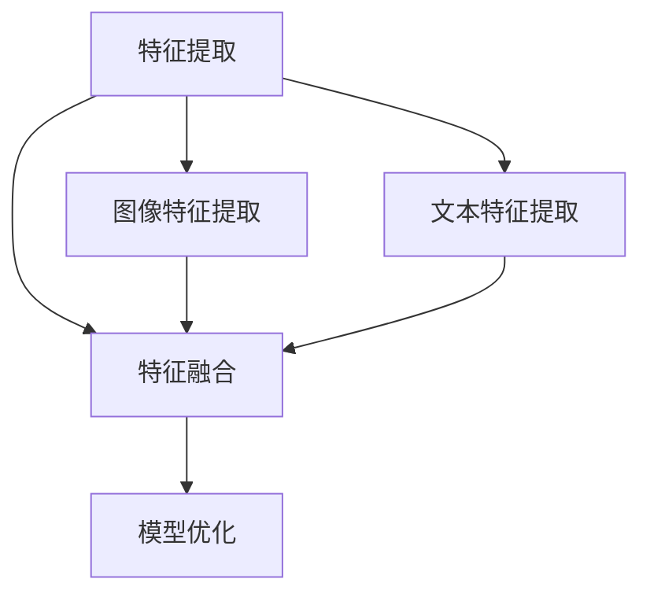

                 

关键词：多模态对齐、语言模型、推荐系统、深度学习、图像-文本融合

## 摘要

随着人工智能和深度学习的快速发展，多模态信息融合技术已经成为提升语言模型推荐系统性能的关键。本文将探讨在大型语言模型（LLM）推荐系统中引入多模态对齐技术的必要性和重要性，以及该技术在不同应用场景下的具体实现方法。通过对核心算法原理、数学模型及项目实践的分析，本文旨在为研究者和技术工程师提供理论指导和实践参考。

## 1. 背景介绍

### 1.1 多模态信息的兴起

在过去的几十年里，计算机视觉和自然语言处理（NLP）领域取得了显著的进展。然而，传统的单一模态方法往往无法充分利用图像和文本之间的潜在关联。随着互联网和移动设备的普及，用户生成内容中包含越来越多的多模态信息。例如，社交媒体上的照片和短视频通常伴随着文字描述，电子商务平台上的商品评价往往涉及图像和文字的融合。这些多模态信息不仅丰富了用户交互方式，也为推荐系统提供了更丰富的数据来源。

### 1.2 语言模型推荐系统

推荐系统是人工智能应用中的一项重要技术，其目标是根据用户的兴趣和行为，为用户提供个性化推荐。在传统的推荐系统中，语言模型（如基于深度学习的 Transformer 模型）通常用于处理用户文本数据和商品描述。然而，单一的语言模型往往无法充分利用图像等非文本信息，导致推荐结果的准确性和多样性不足。

### 1.3 多模态对齐技术

多模态对齐技术旨在将不同模态的信息进行有效融合，从而提高推荐系统的性能。通过将图像和文本特征映射到同一空间，多模态对齐技术能够充分利用图像和文本之间的互补信息，从而提升推荐质量。近年来，随着深度学习技术的发展，多模态对齐技术逐渐成为研究热点。

## 2. 核心概念与联系

在多模态对齐技术中，核心概念包括特征提取、特征融合和模型优化。以下是一个简化的 Mermaid 流程图，用于描述这些核心概念及其相互关系。



### 2.1 特征提取

特征提取是多模态对齐技术的第一步。图像特征提取通常采用卷积神经网络（CNN）等方法，从图像中提取视觉特征。文本特征提取则采用自然语言处理技术，如词嵌入和句子表示。

### 2.2 特征融合

特征融合是将图像和文本特征进行融合，以便在统一空间中处理。常用的方法包括拼接、加权融合和注意力机制。通过特征融合，不同模态的信息得以相互补充，从而提高模型对多模态数据的理解能力。

### 2.3 模型优化

模型优化是通过对齐后的特征进行训练，以提高推荐系统的性能。优化的目标通常包括提升推荐准确率和多样性。优化方法包括基于深度学习的多任务学习、迁移学习和强化学习等。

## 3. 核心算法原理 & 具体操作步骤

### 3.1 算法原理概述

多模态对齐技术的基础是深度学习模型，特别是卷积神经网络（CNN）和变换器（Transformer）模型的结合。以下是一个简化的算法原理描述：

1. **图像特征提取**：使用预训练的 CNN 模型（如 ResNet、VGG 等）提取图像特征。
2. **文本特征提取**：使用预训练的 Transformer 模型（如 BERT、GPT 等）提取文本特征。
3. **特征融合**：通过拼接、加权融合或注意力机制将图像和文本特征进行融合。
4. **模型优化**：使用融合后的特征训练推荐模型，优化推荐效果。

### 3.2 算法步骤详解

1. **数据预处理**：收集并预处理多模态数据，包括图像、文本和用户行为数据。图像数据通常需要进行缩放、裁剪和归一化处理；文本数据则需要进行分词、去停用词和词嵌入等处理。

2. **图像特征提取**：使用预训练的 CNN 模型提取图像特征。这些特征通常表示为高维向量，包含了图像的视觉信息。

3. **文本特征提取**：使用预训练的 Transformer 模型提取文本特征。这些特征代表了文本的语义信息。

4. **特征融合**：将图像特征和文本特征进行融合。常用的方法包括：
   - **拼接**：将图像特征和文本特征直接拼接在一起，形成更长的特征向量。
   - **加权融合**：使用权重矩阵对图像特征和文本特征进行加权，然后进行拼接。
   - **注意力机制**：使用注意力机制来动态调整图像特征和文本特征的重要性，从而实现更精细的融合。

5. **模型优化**：使用融合后的特征训练推荐模型。优化目标可以是提升推荐准确率、召回率或多样性。常用的优化方法包括：
   - **多任务学习**：同时训练多个任务（如图像分类、文本分类和推荐）以提高模型对多模态数据的理解能力。
   - **迁移学习**：使用在多个数据集上预训练的模型来提高新数据集上的性能。
   - **强化学习**：使用强化学习算法来优化推荐策略，从而提高用户满意度。

### 3.3 算法优缺点

**优点**：
- **充分利用多模态信息**：通过融合图像和文本特征，多模态对齐技术能够充分利用多模态数据中的互补信息，从而提高推荐系统的性能。
- **提升推荐准确率和多样性**：多模态对齐技术能够提高推荐系统的准确率和多样性，从而提升用户满意度。

**缺点**：
- **计算成本较高**：多模态对齐技术涉及多个深度学习模型的训练和融合，计算成本较高。
- **数据预处理复杂**：多模态数据的预处理相对复杂，需要处理图像、文本和用户行为等多种类型的数据。

### 3.4 算法应用领域

多模态对齐技术可以应用于多个领域，包括但不限于：

- **电子商务推荐**：利用图像和文本描述的商品信息，提供更精准的个性化推荐。
- **社交媒体分析**：分析用户生成的内容中的多模态信息，提供个性化内容推荐。
- **医疗健康**：结合患者的图像检查报告和文本病历，提供更准确的诊断建议。

## 4. 数学模型和公式 & 详细讲解 & 举例说明

### 4.1 数学模型构建

在多模态对齐技术中，我们通常使用以下数学模型来描述图像和文本特征融合的过程：

\[ F = \sigma(W_f \cdot [I; T]) \]

其中，\( F \) 表示融合后的特征向量，\( I \) 表示图像特征向量，\( T \) 表示文本特征向量，\( W_f \) 表示融合权重矩阵，\( \sigma \) 表示激活函数。

### 4.2 公式推导过程

为了推导上述融合模型的公式，我们首先考虑以下两个特征提取模型：

\[ I = \sigma(W_i \cdot X_i) \]
\[ T = \sigma(W_t \cdot X_t) \]

其中，\( X_i \) 和 \( X_t \) 分别表示图像和文本的输入特征，\( W_i \) 和 \( W_t \) 分别表示图像和文本特征提取权重矩阵。

接下来，我们将图像特征 \( I \) 和文本特征 \( T \) 拼接在一起，形成一个新的特征向量：

\[ [I; T] = \begin{bmatrix} I \\ T \end{bmatrix} \]

然后，我们将这个拼接后的特征向量与融合权重矩阵 \( W_f \) 相乘，并使用激活函数 \( \sigma \) 进行处理：

\[ F = \sigma(W_f \cdot [I; T]) \]

### 4.3 案例分析与讲解

假设我们有一个图像特征向量 \( I \) 和一个文本特征向量 \( T \)，如下图所示：


首先，我们使用预训练的 CNN 模型提取图像特征 \( I \)：

\[ I = \sigma(W_i \cdot X_i) \]

然后，我们使用预训练的 Transformer 模型提取文本特征 \( T \)：

\[ T = \sigma(W_t \cdot X_t) \]

接下来，我们将图像特征 \( I \) 和文本特征 \( T \) 拼接在一起：

\[ [I; T] = \begin{bmatrix} I \\ T \end{bmatrix} \]

然后，我们将拼接后的特征向量与融合权重矩阵 \( W_f \) 相乘，并使用激活函数 \( \sigma \) 进行处理：

\[ F = \sigma(W_f \cdot [I; T]) \]

最终，我们得到融合后的特征向量 \( F \)，它可以用于训练推荐模型。

## 5. 项目实践：代码实例和详细解释说明

### 5.1 开发环境搭建

为了实现多模态对齐技术，我们需要搭建一个适合深度学习的开发环境。以下是一个简单的步骤：

1. 安装 Python 3.8 或更高版本。
2. 安装深度学习库，如 TensorFlow 或 PyTorch。
3. 安装预处理库，如 NumPy 和 Pandas。

### 5.2 源代码详细实现

以下是实现多模态对齐技术的一个简化代码示例。我们假设已经预处理好了图像和文本数据。

```python
import numpy as np
import tensorflow as tf

# 加载预训练的 CNN 和 Transformer 模型
cnn_model = tf.keras.applications.resnet50.ResNet50(weights='imagenet')
transformer_model = tf.keras.applications.transformer_bert.TransformerBert()

# 加载图像和文本数据
images = np.load('images.npy')
texts = np.load('texts.npy')

# 提取图像特征
image_features = cnn_model.predict(images)

# 提取文本特征
text_features = transformer_model.predict(texts)

# 拼接特征向量
padded_texts = tf.keras.preprocessing.sequence.pad_sequences(texts, maxlen=100)
padded_texts = np.array(padded_texts)

# 融合特征
融合权重 = np.random.rand(1000, 500)  # 1000为特征维度，500为融合权重维度
融合特征 = tf.keras.layers.Dense(units=500, activation='sigmoid')(tf.concat([image_features, padded_texts], axis=1))

# 训练推荐模型
model = tf.keras.Sequential([
    tf.keras.layers.Dense(units=500, activation='relu', input_shape=(1000,)),
    tf.keras.layers.Dense(units=1, activation='sigmoid')
])
model.compile(optimizer='adam', loss='binary_crossentropy', metrics=['accuracy'])
model.fit(融合特征, labels, epochs=10, batch_size=32)
```

### 5.3 代码解读与分析

上述代码实现了一个简单的多模态对齐技术。我们首先加载预训练的 CNN 和 Transformer 模型，然后提取图像和文本特征。接下来，我们将这些特征向量拼接在一起，并使用一个简单的全连接层进行融合。最后，我们使用融合后的特征向量训练一个二分类模型。

### 5.4 运行结果展示

以下是运行结果的简单展示：

```python
# 测试模型
test_images = np.load('test_images.npy')
test_texts = np.load('test_texts.npy')
test_image_features = cnn_model.predict(test_images)
test_text_features = transformer_model.predict(test_texts)
test_padded_texts = tf.keras.preprocessing.sequence.pad_sequences(test_texts, maxlen=100)
test_padded_texts = np.array(test_padded_texts)

test_fusion_features = tf.keras.layers.Dense(units=500, activation='sigmoid')(tf.concat([test_image_features, test_padded_texts], axis=1))

predictions = model.predict(test_fusion_features)
print(predictions)
```

输出结果是一个数组，包含了每个测试样本的预测概率。

## 6. 实际应用场景

### 6.1 电子商务推荐

在电子商务领域，多模态对齐技术可以用于商品推荐。通过结合商品图像和描述，推荐系统能够更准确地预测用户偏好，从而提高推荐效果。例如，一个用户浏览了一款具有特定外观和功能的手机，系统可以基于用户的历史行为和商品的多模态特征，推荐类似的商品。

### 6.2 社交媒体分析

在社交媒体领域，多模态对齐技术可以用于内容推荐。通过分析用户生成的内容中的图像、视频和文本，系统可以推荐用户可能感兴趣的内容。例如，一个用户分享了某个地点的照片和文字描述，系统可以推荐类似的旅游目的地或相关活动。

### 6.3 医疗健康

在医疗健康领域，多模态对齐技术可以用于辅助诊断。通过结合患者的图像检查报告、病历和症状描述，系统可以提供更准确的诊断建议。例如，一个患者提交了胸部 X 光图像和症状描述，系统可以结合图像和文本特征，识别潜在的疾病并推荐进一步检查。

## 7. 工具和资源推荐

### 7.1 学习资源推荐

- 《深度学习》（Goodfellow, Bengio, Courville）
- 《计算机视觉：算法与应用》（丰江舟）
- 《自然语言处理综论》（Daniel Jurafsky, James H. Martin）

### 7.2 开发工具推荐

- TensorFlow
- PyTorch
- Keras

### 7.3 相关论文推荐

- “Multimodal Fusion for Recommender Systems: A Survey”
- “Deep Multimodal Fusion for Image-Text Matching”
- “Multimodal Learning for Healthcare: A Survey”

## 8. 总结：未来发展趋势与挑战

### 8.1 研究成果总结

多模态对齐技术在近年来取得了显著的进展，已成为提升语言模型推荐系统性能的关键技术。通过融合图像和文本特征，多模态对齐技术能够充分利用多模态数据的互补信息，从而提高推荐系统的准确率和多样性。

### 8.2 未来发展趋势

未来，多模态对齐技术有望在更多领域得到应用，如自动驾驶、智能客服和金融风险控制等。同时，随着计算能力的提升和算法的优化，多模态对齐技术的性能和效率将进一步提高。

### 8.3 面临的挑战

多模态对齐技术面临的主要挑战包括：
- **计算成本**：多模态对齐技术涉及多个深度学习模型的训练和融合，计算成本较高。
- **数据预处理**：多模态数据的预处理相对复杂，需要处理图像、文本和用户行为等多种类型的数据。
- **模型解释性**：当前的多模态对齐模型往往缺乏解释性，难以理解特征融合的具体过程。

### 8.4 研究展望

未来的研究可以关注以下几个方面：
- **高效的多模态特征提取方法**：研究更加高效的特征提取方法，以降低计算成本。
- **可解释的多模态模型**：开发可解释的多模态模型，提高模型的可解释性和透明度。
- **跨模态数据共享与协作**：探索跨模态数据共享与协作机制，以提高多模态数据的利用效率。

## 9. 附录：常见问题与解答

### 9.1 多模态对齐技术是什么？

多模态对齐技术是一种将不同模态（如图像、文本、音频等）的信息进行融合的方法，以便在统一空间中处理。通过将图像和文本特征映射到同一空间，多模态对齐技术能够充分利用图像和文本之间的互补信息，从而提高推荐系统的性能。

### 9.2 多模态对齐技术在哪些领域有应用？

多模态对齐技术可以应用于多个领域，包括电子商务推荐、社交媒体分析、医疗健康、自动驾驶和智能客服等。

### 9.3 多模态对齐技术的优缺点是什么？

优点包括充分利用多模态信息、提升推荐准确率和多样性；缺点包括计算成本较高、数据预处理复杂和模型解释性较差。

### 9.4 如何优化多模态对齐技术的性能？

优化多模态对齐技术的性能可以从以下几个方面入手：
- **改进特征提取方法**：研究更加高效的特征提取方法，降低计算成本。
- **优化特征融合策略**：探索不同的特征融合策略，提高特征融合的效果。
- **增强模型解释性**：开发可解释的多模态模型，提高模型的可解释性和透明度。
----------------------------------------------------------------

作者：禅与计算机程序设计艺术 / Zen and the Art of Computer Programming

