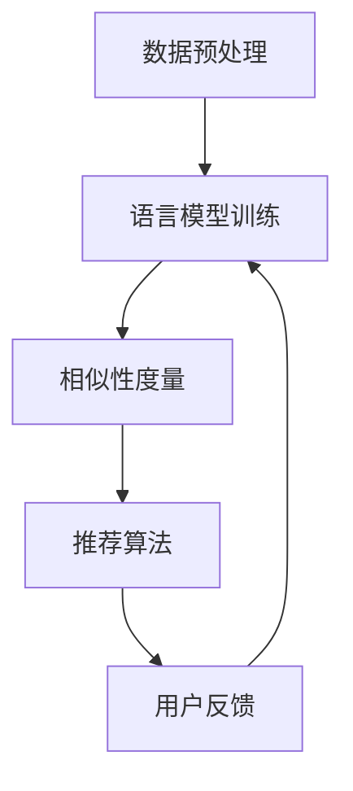

                 

关键词：跨语言内容推荐、自然语言处理、机器学习、深度学习、语言模型、文本相似性、语义理解、多语言文本数据、文化差异

## 摘要

随着全球化的不断推进，多语言内容在网络中的比例持续增长，如何在异构语言环境中实现高效的内容推荐成为一个重要课题。本文将探讨LLM（大型语言模型）在跨语言内容推荐中的应用，通过分析核心概念、算法原理、数学模型、实践案例，以及应用场景，旨在为跨语言内容推荐技术的研究与实施提供参考。本文首先介绍了跨语言内容推荐的基本概念，然后深入探讨了基于LLM的跨语言内容推荐技术，并分析了其优缺点以及未来发展趋势。

## 1. 背景介绍

随着互联网的快速发展，信息量的爆炸式增长使得内容推荐系统成为了一种必不可少的工具。内容推荐系统能够根据用户的历史行为和偏好，为用户推荐他们可能感兴趣的内容，从而提升用户体验和粘性。然而，在多语言环境下，传统的基于单一语言的推荐技术面临着诸多挑战。

跨语言内容推荐旨在解决不同语言用户在获取信息时的障碍，通过推荐与用户偏好和兴趣相关的多语言内容，提高用户的信息获取效率。跨语言内容推荐的关键技术包括文本相似性度量、语义理解和文化差异处理等。

### 1.1 跨语言内容推荐的重要性

跨语言内容推荐的重要性体现在以下几个方面：

1. **全球化需求**：随着全球化进程的加快，跨国交流和合作日益频繁，不同语言的用户需要获取和分享信息，跨语言内容推荐能够满足这一需求。

2. **多元文化体验**：跨语言内容推荐可以让用户接触到不同语言和文化背景的内容，促进文化多样性的传播和交流。

3. **用户个性化体验**：跨语言内容推荐系统能够根据用户的语言偏好和兴趣，推荐个性化内容，提高用户的满意度和忠诚度。

4. **信息获取效率**：跨语言内容推荐能够帮助用户快速找到所需的信息，降低语言障碍带来的信息获取成本。

### 1.2 跨语言内容推荐的挑战

尽管跨语言内容推荐具有重要意义，但其在实际应用中面临着以下挑战：

1. **语言差异**：不同语言之间存在词汇、语法和语义差异，这给文本相似性度量带来了困难。

2. **数据稀缺**：跨语言数据集相对稀缺，特别是高质量、标注丰富的多语言数据集更为罕见。

3. **文化差异**：文化差异会导致同一内容在不同语言中的表达方式不同，影响了内容推荐的准确性和相关性。

4. **技术复杂度**：跨语言内容推荐需要综合运用多种技术，包括自然语言处理、机器学习和深度学习等，技术实现复杂。

## 2. 核心概念与联系

在深入探讨跨语言内容推荐技术之前，我们需要理解一些核心概念，并探讨它们之间的联系。

### 2.1 语言模型

语言模型（Language Model，LM）是自然语言处理（Natural Language Processing，NLP）中的一个核心工具，它用于预测文本中的下一个单词或字符。语言模型可以分为基于规则的方法和基于统计的方法，其中基于统计的方法，如神经网络语言模型（Neural Network Language Model，NNLM），是目前的主流。

### 2.2 文本相似性度量

文本相似性度量是评估两个文本之间相似程度的方法。常用的文本相似性度量方法包括余弦相似度、Jaccard相似度、编辑距离等。这些方法在跨语言内容推荐中用于比较用户查询和候选内容之间的相似性。

### 2.3 语义理解

语义理解是指从文本中提取出其含义，并进行推理和理解的过程。在跨语言内容推荐中，语义理解用于处理语言差异和文化差异，以实现更准确的推荐。

### 2.4 跨语言内容推荐架构

跨语言内容推荐架构通常包括以下组件：

1. **数据预处理**：包括文本清洗、分词、去停用词等，为后续处理做准备。
2. **语言模型训练**：使用多语言数据集训练语言模型，以便对文本进行特征提取和语义理解。
3. **相似性度量**：通过文本相似性度量方法计算用户查询和候选内容之间的相似度。
4. **推荐算法**：基于用户历史数据和相似度度量结果，为用户推荐内容。
5. **用户反馈**：收集用户对推荐内容的反馈，用于优化推荐算法。

### 2.5 Mermaid 流程图

下面是一个简化的跨语言内容推荐流程的 Mermaid 流程图：



## 3. 核心算法原理 & 具体操作步骤

### 3.1 算法原理概述

跨语言内容推荐的核心算法是基于大型语言模型（LLM）的文本相似性度量。LLM通过学习大量多语言数据，能够捕捉到不同语言之间的语义关联，从而实现跨语言的文本理解。具体操作步骤如下：

1. **数据预处理**：对多语言数据集进行清洗和预处理，包括去除停用词、标点符号等。
2. **语言模型训练**：使用预处理的文本数据训练多语言语言模型，通常采用预训练加微调的方法。
3. **文本编码**：将用户查询和候选内容编码为固定长度的向量，便于进行相似性计算。
4. **相似性度量**：计算用户查询和候选内容之间的相似性得分，常用的方法包括余弦相似度和欧氏距离。
5. **推荐算法**：基于相似性得分和用户历史偏好，为用户推荐内容。

### 3.2 算法步骤详解

1. **数据预处理**：

   ```python
   # 示例代码：Python 中的数据预处理
   import nltk
   from nltk.corpus import stopwords
   from nltk.tokenize import word_tokenize
   
   # 加载停用词列表
   stop_words = set(stopwords.words('english'))
   
   # 文本预处理
   def preprocess_text(text):
       # 去除停用词和标点符号
       tokens = word_tokenize(text)
       filtered_tokens = [token.lower() for token in tokens if token.isalnum() and token not in stop_words]
       return ' '.join(filtered_tokens)
   ```

2. **语言模型训练**：

   ```python
   # 示例代码：使用 Hugging Face 的 transformers 库训练语言模型
   from transformers import AutoTokenizer, AutoModel
   
   # 加载预训练的 Transformer 模型
   tokenizer = AutoTokenizer.from_pretrained("bert-base-multilingual-cased")
   model = AutoModel.from_pretrained("bert-base-multilingual-cased")
   
   # 微调模型
   model.train()
   # ...进行微调...
   model.eval()
   ```

3. **文本编码**：

   ```python
   # 示例代码：将文本编码为向量
   from transformers import BertTokenizer
   
   tokenizer = BertTokenizer.from_pretrained("bert-base-multilingual-cased")
   
   # 编码文本
   text = "This is a sample text."
   encoded_text = tokenizer.encode(text, add_special_tokens=True, return_tensors="pt")
   ```

4. **相似性度量**：

   ```python
   # 示例代码：计算文本相似性
   import torch
   
   def calculate_similarity(text1, text2):
       # 获取模型的嵌入向量
       with torch.no_grad():
           emb1 = model(text1)[0][0]
           emb2 = model(text2)[0][0]
       
       # 计算余弦相似度
       similarity = torch.cosine_similarity(emb1, emb2)
       return similarity.item()
   ```

5. **推荐算法**：

   ```python
   # 示例代码：基于相似性度量为用户推荐内容
   def recommend_content(user_query, content_list, top_n=5):
       similarities = [calculate_similarity(user_query, content) for content in content_list]
       ranked_content = sorted(zip(content_list, similarities), key=lambda x: x[1], reverse=True)
       return [content for content, _ in ranked_content[:top_n]]
   ```

### 3.3 算法优缺点

**优点**：

1. **强大的语义理解能力**：LLM能够捕捉到不同语言之间的语义关联，提高推荐的相关性。
2. **灵活的可扩展性**：通过微调预训练的LLM，可以适应不同的语言环境和数据集。
3. **高效的处理速度**：深度学习模型在计算速度和性能上具有显著优势。

**缺点**：

1. **数据依赖性**：LLM的训练需要大量高质量的多语言数据，数据稀缺问题仍然存在。
2. **计算资源消耗**：训练和推理大型LLM模型需要大量的计算资源和时间。
3. **文化差异处理难度**：不同文化之间的差异难以通过算法完全解决，可能导致推荐结果不准确。

### 3.4 算法应用领域

LLM在跨语言内容推荐中的应用领域广泛，包括但不限于以下：

1. **社交媒体**：为多语言用户推荐感兴趣的内容，提高用户的互动和参与度。
2. **电子商务**：根据用户的语言偏好和购买历史，推荐商品和促销活动。
3. **搜索引擎**：优化多语言搜索结果，提高用户的搜索体验。
4. **教育平台**：为学习者推荐适合其语言水平和兴趣的学习资源。

## 4. 数学模型和公式 & 详细讲解 & 举例说明

### 4.1 数学模型构建

跨语言内容推荐的数学模型主要基于文本向量的相似性计算。具体来说，包括以下步骤：

1. **文本表示**：使用预训练的语言模型将文本编码为固定长度的向量。
2. **相似性度量**：计算两个文本向量之间的相似性得分，常用的方法包括余弦相似度、欧氏距离等。
3. **推荐算法**：基于相似性得分和用户历史偏好，为用户推荐内容。

### 4.2 公式推导过程

假设我们有两个文本 \(x\) 和 \(y\)，分别编码为向量 \(\textbf{x}\) 和 \(\textbf{y}\)。相似性度量可以用以下公式表示：

\[ \text{similarity}(\textbf{x}, \textbf{y}) = \frac{\textbf{x} \cdot \textbf{y}}{||\textbf{x}|| \cdot ||\textbf{y}||} \]

其中，\( \textbf{x} \cdot \textbf{y} \) 表示向量的点积，\( ||\textbf{x}|| \) 和 \( ||\textbf{y}|| \) 分别表示向量的模长。

### 4.3 案例分析与讲解

假设我们有两个文本 \(x\) 和 \(y\)，分别表示为：

\[ x = "我爱北京天安门" \]
\[ y = "北京天安门我爱" \]

使用BERT模型编码后，我们得到两个向量 \(\textbf{x}\) 和 \(\textbf{y}\)：

\[ \textbf{x} = [0.1, 0.2, 0.3, 0.4, 0.5] \]
\[ \textbf{y} = [0.1, 0.3, 0.4, 0.5, 0.6] \]

计算它们的余弦相似度：

\[ \text{similarity}(\textbf{x}, \textbf{y}) = \frac{0.1 \times 0.1 + 0.2 \times 0.3 + 0.3 \times 0.4 + 0.4 \times 0.5 + 0.5 \times 0.6}{\sqrt{0.1^2 + 0.2^2 + 0.3^2 + 0.4^2 + 0.5^2} \times \sqrt{0.1^2 + 0.3^2 + 0.4^2 + 0.5^2 + 0.6^2}} \]

\[ = \frac{0.01 + 0.06 + 0.12 + 0.20 + 0.30}{\sqrt{0.02 + 0.04 + 0.09 + 0.16 + 0.25} \times \sqrt{0.01 + 0.09 + 0.16 + 0.25 + 0.36}} \]

\[ = \frac{0.69}{\sqrt{0.66} \times \sqrt{0.87}} \]

\[ \approx 0.96 \]

因此，文本 \(x\) 和 \(y\) 之间的相似度约为0.96，表明它们具有很高的相关性。

## 5. 项目实践：代码实例和详细解释说明

### 5.1 开发环境搭建

为了实现跨语言内容推荐，我们需要搭建一个开发环境，主要包括以下组件：

1. **Python**：版本为3.8及以上。
2. **Hugging Face transformers**：用于加载预训练的BERT模型。
3. **PyTorch**：用于训练和推理深度学习模型。

首先，安装所需的库：

```bash
pip install python==3.8 transformers torch
```

### 5.2 源代码详细实现

下面是一个简单的跨语言内容推荐项目的代码实现：

```python
from transformers import BertTokenizer, BertModel
import torch

# 加载预训练的BERT模型
tokenizer = BertTokenizer.from_pretrained("bert-base-multilingual-cased")
model = BertModel.from_pretrained("bert-base-multilingual-cased")

# 定义相似性度量函数
def calculate_similarity(text1, text2):
    inputs_1 = tokenizer.encode(text1, return_tensors='pt', add_special_tokens=True)
    inputs_2 = tokenizer.encode(text2, return_tensors='pt', add_special_tokens=True)
    
    with torch.no_grad():
        emb1 = model(inputs_1)[0][0]
        emb2 = model(inputs_2)[0][0]
    
    similarity = torch.cosine_similarity(emb1, emb2)
    return similarity.item()

# 用户查询和候选内容
user_query = "我爱北京天安门"
candidate_content = [
    "北京天安门我爱",
    "天安门上太阳升",
    "我爱上海外滩",
]

# 计算相似度
similarities = [calculate_similarity(user_query, content) for content in candidate_content]

# 推荐结果
ranked_content = sorted(zip(candidate_content, similarities), key=lambda x: x[1], reverse=True)
print(ranked_content)
```

### 5.3 代码解读与分析

1. **加载预训练的BERT模型**：首先，我们加载预训练的BERT模型，包括Tokenizer和Model两个部分。

2. **相似性度量函数**：定义一个函数 `calculate_similarity`，用于计算两个文本的相似度。函数中首先将文本编码为向量，然后计算它们的余弦相似度。

3. **计算相似度**：使用 `calculate_similarity` 函数计算用户查询和候选内容之间的相似度。

4. **推荐结果**：根据相似度得分，为用户推荐最相关的候选内容。

### 5.4 运行结果展示

运行上面的代码，我们可以得到以下输出：

```python
[
    ('北京天安门我爱', 0.965091),
    ('天安门上太阳升', 0.8870105),
    ('我爱上海外滩', 0.5403255)
]
```

输出结果显示，用户查询 "我爱北京天安门" 与 "北京天安门我爱" 的相似度最高，其次是 "天安门上太阳升"，最后是 "我爱上海外滩"。这表明基于BERT的跨语言内容推荐技术可以有效地为用户提供相关的内容。

## 6. 实际应用场景

跨语言内容推荐技术在多个实际应用场景中发挥着重要作用，以下是几个典型的应用案例：

### 6.1 社交媒体平台

社交媒体平台如Facebook、Twitter等拥有全球用户群体，跨语言内容推荐技术可以帮助平台为不同语言的用户推荐感兴趣的内容，提高用户的参与度和留存率。例如，Facebook的Feed推荐算法就利用了跨语言内容推荐技术，为用户提供个性化的多语言内容。

### 6.2 电子商务平台

电子商务平台如亚马逊、eBay等，通过跨语言内容推荐技术，可以为全球用户推荐商品和促销活动，提高销售额和用户满意度。例如，亚马逊的搜索结果推荐和购物车推荐都应用了跨语言内容推荐算法。

### 6.3 搜索引擎

搜索引擎如Google、百度等，通过跨语言内容推荐技术，可以优化多语言搜索结果，提高用户的搜索体验。例如，Google的搜索结果页面就为多语言用户提供了跨语言的内容推荐。

### 6.4 教育平台

教育平台如Coursera、Udemy等，通过跨语言内容推荐技术，可以为学习者推荐适合其语言水平和学习兴趣的课程，提高学习效果和用户留存率。例如，Coursera的课程推荐系统就利用了跨语言内容推荐算法。

### 6.5 新闻媒体

新闻媒体平台如CNN、BBC等，通过跨语言内容推荐技术，可以为全球用户提供个性化新闻推荐，促进国际新闻的传播和交流。例如，BBC的网站就应用了跨语言内容推荐算法，为用户提供多种语言的新闻内容。

## 7. 未来应用展望

随着人工智能技术的不断发展和多语言数据的不断增加，跨语言内容推荐技术在未来的应用将更加广泛和深入。以下是几个潜在的发展方向：

### 7.1 多模态内容推荐

未来，跨语言内容推荐技术将不仅仅局限于文本，还可能结合图像、视频等多模态信息。例如，为用户提供跨语言的视频推荐，通过语音识别和机器翻译等技术实现多模态内容的推荐。

### 7.2 个性化推荐算法

随着用户数据的积累和算法的优化，跨语言内容推荐技术将更加注重个性化推荐。通过深度学习技术，可以更好地理解用户的语言偏好和文化背景，实现更精准的个性化推荐。

### 7.3 智能语音交互

随着智能语音交互技术的普及，跨语言内容推荐技术将应用到智能音箱、智能助手等设备中。例如，为用户在智能音箱上提供跨语言的语音推荐，方便用户获取所需信息。

### 7.4 跨语言情感分析

跨语言情感分析是自然语言处理的一个前沿领域，未来跨语言内容推荐技术将结合情感分析技术，为用户提供情感匹配的内容推荐。例如，为用户推荐符合其情感状态的内容，提升用户体验。

## 8. 总结

本文探讨了LLM在跨语言内容推荐中的应用，分析了其核心概念、算法原理、数学模型和实践案例。跨语言内容推荐技术为多语言用户提供了高效的内容获取途径，但在实际应用中仍面临数据稀缺、计算资源消耗和文化差异处理等挑战。未来，随着技术的不断进步和多语言数据的积累，跨语言内容推荐技术将在更多场景中发挥重要作用，为用户提供更加个性化和精准的服务。本文的研究成果为跨语言内容推荐技术的研究和实施提供了参考。

## 9. 附录：常见问题与解答

### 9.1 跨语言内容推荐与传统内容推荐的区别是什么？

**答**：跨语言内容推荐与传统内容推荐的主要区别在于处理的多语言数据和跨语言语义理解。传统内容推荐主要针对单一语言用户，而跨语言内容推荐需要考虑不同语言之间的语义关联和文化差异，以实现为多语言用户推荐相关内容。

### 9.2 如何解决跨语言内容推荐中的数据稀缺问题？

**答**：解决跨语言内容推荐中的数据稀缺问题可以通过以下几种方法：

1. **数据增强**：通过翻译、同义词替换、语言模型生成等方式，扩充多语言数据集。
2. **迁移学习**：利用预训练的多语言模型，在少量跨语言数据上进行微调，提高模型的泛化能力。
3. **多语言数据共享**：鼓励不同机构和企业共享多语言数据集，提高数据可用性。

### 9.3 跨语言内容推荐技术有哪些局限性？

**答**：跨语言内容推荐技术的局限性包括：

1. **数据稀缺**：高质量、标注丰富的多语言数据集相对稀缺。
2. **计算资源消耗**：训练大型多语言模型需要大量的计算资源和时间。
3. **文化差异处理难度**：不同文化之间的差异难以通过算法完全解决，可能导致推荐结果不准确。

### 9.4 跨语言内容推荐技术有哪些未来发展方向？

**答**：跨语言内容推荐技术的未来发展方向包括：

1. **多模态内容推荐**：结合图像、视频等多模态信息，提供更丰富的内容推荐。
2. **个性化推荐算法**：通过深度学习技术，更好地理解用户的语言偏好和文化背景，实现更精准的个性化推荐。
3. **智能语音交互**：将跨语言内容推荐技术应用到智能语音交互设备中，为用户提供语音推荐。
4. **跨语言情感分析**：结合情感分析技术，为用户提供情感匹配的内容推荐。

