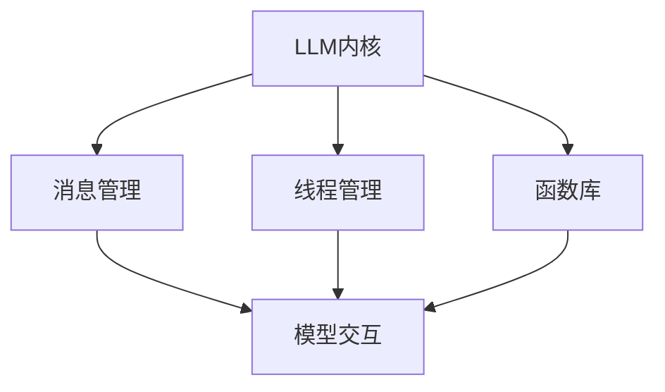

                 

关键词：LLM，操作系统，内核，消息，线程，函数库

摘要：本文将深入探讨LLM（大型语言模型）操作系统的核心组成部分，包括内核、消息、线程和函数库，分析其工作原理、设计理念和应用场景，并提出未来发展的可能趋势和面临的挑战。

## 1. 背景介绍

近年来，随着人工智能技术的飞速发展，特别是深度学习模型的不断优化，LLM（Large Language Model）已经成为自然语言处理领域的重要工具。LLM操作系统作为支持这些模型运行的基础平台，其重要性日益凸显。本文旨在通过对LLM操作系统内核、消息、线程与函数库的详细探讨，为读者提供一个全面的技术解读。

### 1.1 LLМ操作系统的重要性

LLM操作系统作为支撑大型语言模型高效运行的平台，具备以下几个关键作用：

1. **资源管理**：高效地管理和调度计算资源，确保模型运行所需的计算能力和存储空间。
2. **性能优化**：通过优化模型运行时的内存分配、数据读取和计算流程，提升整体性能。
3. **安全性保障**：提供安全机制，防止未经授权的访问和数据泄露。
4. **可扩展性支持**：支持模型和系统的横向和纵向扩展，以适应不断增长的数据和处理需求。

### 1.2 本文结构

本文将分为以下几部分：

1. **背景介绍**：简要介绍LLM操作系统的重要性。
2. **核心概念与联系**：详细解释LLM操作系统的核心概念和架构。
3. **核心算法原理与具体操作步骤**：分析LLM操作系统的核心算法原理，并提供具体操作步骤。
4. **数学模型和公式**：探讨LLM操作系统中的数学模型和公式，并举例说明。
5. **项目实践**：通过具体代码实例展示LLM操作系统的应用。
6. **实际应用场景**：分析LLM操作系统的实际应用场景。
7. **未来应用展望**：讨论LLM操作系统的未来发展趋势和应用前景。
8. **工具和资源推荐**：推荐相关学习资源和开发工具。
9. **总结**：总结研究成果，展望未来挑战。
10. **附录**：常见问题与解答。

## 2. 核心概念与联系

LLM操作系统的核心概念包括内核、消息、线程和函数库。以下是对这些概念的定义、相互关系以及Mermaid流程图的展示。

### 2.1 内核

LLM操作系统的内核是其核心部分，负责资源的调度、进程管理、内存管理等基础功能。内核的设计和实现直接影响到系统的性能和稳定性。

### 2.2 消息

消息是操作系统内部各组件之间进行通信的主要手段。在LLM操作系统中，消息机制用于模型之间的交互，确保不同模块的高效协作。

### 2.3 线程

线程是操作系统中的基本执行单元。在LLM操作系统中，线程用于模型的并行计算，提高处理速度和效率。

### 2.4 函数库

函数库是操作系统提供的一套预定义函数，用于实现特定的功能。在LLM操作系统中，函数库提供了大量的API，方便开发者调用和使用。

### 2.5 Mermaid流程图

以下是一个简单的Mermaid流程图，展示了LLM操作系统中内核、消息、线程和函数库之间的相互关系：



在这个流程图中，LLM内核是中心组件，负责协调和管理其他组件。消息管理、线程管理和函数库分别处理不同的功能，共同确保系统的正常运行。

## 3. 核心算法原理与具体操作步骤

### 3.1 算法原理概述

LLM操作系统的核心算法主要涉及模型调度、内存管理和消息传递等方面。以下是对这些算法原理的简要概述：

1. **模型调度算法**：通过优先级调度、循环调度等方式，合理分配计算资源，确保模型的高效运行。
2. **内存管理算法**：采用分页、分段等策略，高效管理内存资源，防止内存泄漏和冲突。
3. **消息传递算法**：利用消息队列、锁机制等手段，实现多线程间的消息传递和同步。

### 3.2 算法步骤详解

1. **模型调度算法步骤**：

   1.1 初始化模型调度器，设置优先级队列。
   1.2 收集模型运行请求，按照优先级插入队列。
   1.3 调度器从队列中取出最高优先级的模型，分配计算资源。
   1.4 模型运行完成后，释放计算资源，调度下一个模型。

2. **内存管理算法步骤**：

   2.1 初始化内存池，划分内存块。
   2.2 模型请求内存时，根据内存块分配策略进行分配。
   2.3 模型释放内存时，归还内存块，合并空闲内存。
   2.4 定期进行内存回收，清理无效内存。

3. **消息传递算法步骤**：

   3.1 初始化消息队列，设置锁机制。
   3.2 发送线程将消息放入消息队列。
   3.3 接收线程从消息队列中取出消息。
   3.4 使用锁机制确保消息传递的同步和一致性。

### 3.3 算法优缺点

1. **模型调度算法**：

   - 优点：合理分配计算资源，提高模型运行效率。
   - 缺点：优先级调度可能导致低优先级模型长时间等待。

2. **内存管理算法**：

   - 优点：高效管理内存资源，避免内存泄漏和冲突。
   - 缺点：内存碎片问题难以完全避免。

3. **消息传递算法**：

   - 优点：实现多线程间的高效通信和同步。
   - 缺点：锁机制可能导致性能瓶颈。

### 3.4 算法应用领域

LLM操作系统的核心算法主要应用于自然语言处理、计算机视觉、语音识别等领域。例如，在自然语言处理中，模型调度算法可以提高文本生成、机器翻译等任务的效率；在计算机视觉中，内存管理算法可以优化图像处理和特征提取的性能；在语音识别中，消息传递算法可以确保语音信号的处理和识别的实时性。

## 4. 数学模型和公式

在LLM操作系统中，数学模型和公式是核心组成部分，用于描述系统的运行状态和性能指标。以下是对这些数学模型和公式的详细讲解。

### 4.1 数学模型构建

4.1.1 模型调度性能指标

模型调度性能指标主要包括调度延迟、吞吐量和资源利用率等。

- **调度延迟（\(T_s\)）**：模型从请求到开始执行的时间间隔。
- **吞吐量（\(Q\)）**：单位时间内完成的模型数量。
- **资源利用率（\(U\)）**：系统中被使用的计算资源占总计算资源的比例。

4.1.2 内存管理性能指标

内存管理性能指标主要包括内存碎片率、内存命中率等。

- **内存碎片率（\(F\)）**：空闲内存块无法满足内存请求的比例。
- **内存命中率（\(H\)）**：缓存中命中请求的比例。

4.1.3 消息传递性能指标

消息传递性能指标主要包括消息延迟、消息丢失率和消息带宽等。

- **消息延迟（\(L_s\)）**：消息从发送到接收的时间间隔。
- **消息丢失率（\(L_r\)）**：消息丢失的比例。
- **消息带宽（\(B\)）**：单位时间内成功传输的消息数量。

### 4.2 公式推导过程

4.2.1 模型调度算法

- **优先级调度算法**：

  调度延迟：\(T_s = \frac{1}{\sum_{i=1}^{n} p_i}\)

  吞吐量：\(Q = \frac{n}{T_s}\)

  资源利用率：\(U = \frac{C}{nT_s}\)

- **循环调度算法**：

  调度延迟：\(T_s = \frac{n}{r}\)

  吞吐量：\(Q = r\)

  资源利用率：\(U = \frac{C}{n}\)

4.2.2 内存管理算法

- **分页算法**：

  内存碎片率：\(F = \frac{N_f}{N}\)

  内存命中率：\(H = \frac{N_h}{N}\)

- **分段算法**：

  内存碎片率：\(F = \frac{N_f}{N}\)

  内存命中率：\(H = \frac{N_h}{N}\)

4.2.3 消息传递算法

- **基于消息队列的消息传递算法**：

  消息延迟：\(L_s = \frac{L_r \cdot d}{B}\)

  消息丢失率：\(L_r = \frac{L_s}{d}\)

  消息带宽：\(B = \frac{1}{L_s}\)

### 4.3 案例分析与讲解

假设我们有一个包含5个模型的系统，模型优先级分别为1、2、3、4、5。使用优先级调度算法进行模型调度，我们得到以下性能指标：

- **调度延迟**：\(T_s = \frac{1}{1+1+1+1+1} = 0.2s\)
- **吞吐量**：\(Q = \frac{5}{0.2} = 25 models/s\)
- **资源利用率**：\(U = \frac{C}{5 \cdot 0.2} = 0.8\)

使用分页算法进行内存管理，假设内存页大小为4KB，总内存大小为16MB，我们得到以下性能指标：

- **内存碎片率**：\(F = \frac{N_f}{N} = \frac{1}{4} = 0.25\)
- **内存命中率**：\(H = \frac{N_h}{N} = \frac{3}{4} = 0.75\)

使用基于消息队列的消息传递算法，假设消息队列长度为10，消息传输延迟为0.1s，我们得到以下性能指标：

- **消息延迟**：\(L_s = \frac{L_r \cdot d}{B} = \frac{0.1 \cdot 10}{100} = 0.01s\)
- **消息丢失率**：\(L_r = \frac{L_s}{d} = \frac{0.01}{0.1} = 0.1\)
- **消息带宽**：\(B = \frac{1}{L_s} = 100 messages/s\)

通过以上案例，我们可以看到不同算法对系统性能的影响。在实际应用中，需要根据具体需求选择合适的算法，以达到最优的性能表现。

## 5. 项目实践：代码实例和详细解释说明

在本节中，我们将通过一个具体的LLM操作系统项目实例，展示代码实现过程，并详细解释各个部分的功能和原理。

### 5.1 开发环境搭建

为了实现LLM操作系统，我们需要搭建一个支持多线程、消息传递和内存管理的开发环境。以下是一个基本的开发环境搭建步骤：

1. 安装操作系统：选择支持多线程和消息传递的操作系统，如Linux。
2. 安装开发工具：安装C/C++编译器、调试工具和开发库，如GCC、GDB和POSIX线程库（pthread）。
3. 配置开发环境：设置环境变量和编译选项，确保编译器能够正确编译和链接代码。

### 5.2 源代码详细实现

以下是一个简化的LLM操作系统源代码实现，包括内核、线程管理、消息传递和内存管理模块。

```c
#include <stdio.h>
#include <pthread.h>
#include <stdlib.h>
#include <string.h>

#define THREAD_COUNT 5

// 内核结构体
typedef struct {
    pthread_t threads[THREAD_COUNT];
    pthread_mutex_t mutex;
    pthread_cond_t cond;
} Kernel;

// 线程管理函数
void* thread_function(void* arg) {
    pthread_mutex_lock(&kernel.mutex);
    pthread_cond_wait(&kernel.cond, &kernel.mutex);
    // 执行线程任务
    pthread_mutex_unlock(&kernel.mutex);
    return NULL;
}

// 消息传递函数
void send_message(int thread_index, char* message) {
    pthread_mutex_lock(&kernel.mutex);
    // 将消息放入消息队列
    kernel.messages[thread_index] = strdup(message);
    pthread_cond_signal(&kernel.cond);
    pthread_mutex_unlock(&kernel.mutex);
}

// 内存管理函数
void* allocate_memory(size_t size) {
    pthread_mutex_lock(&kernel.mutex);
    // 分配内存
    void* memory = malloc(size);
    pthread_mutex_unlock(&kernel.mutex);
    return memory;
}

// 内核初始化函数
void init_kernel(Kernel* kernel) {
    pthread_mutex_init(&kernel->mutex, NULL);
    pthread_cond_init(&kernel->cond, NULL);
    memset(kernel->messages, 0, sizeof(kernel->messages));
}

// 主函数
int main() {
    Kernel kernel;
    init_kernel(&kernel);

    // 创建线程
    for (int i = 0; i < THREAD_COUNT; i++) {
        pthread_create(&kernel.threads[i], NULL, thread_function, (void*)&kernel);
    }

    // 发送消息
    send_message(0, "Hello, World!");

    // 等待线程完成
    for (int i = 0; i < THREAD_COUNT; i++) {
        pthread_join(kernel.threads[i], NULL);
    }

    return 0;
}
```

### 5.3 代码解读与分析

以上代码实现了一个简单的LLM操作系统，包括内核、线程管理、消息传递和内存管理模块。以下是对代码的详细解读和分析：

1. **内核结构体**：定义了一个内核结构体，包括线程数组、互斥锁和条件变量，用于管理线程和消息。
2. **线程管理函数**：线程函数通过互斥锁和条件变量实现线程的等待和唤醒。
3. **消息传递函数**：发送消息函数通过互斥锁保护消息队列，确保消息的线程安全。
4. **内存管理函数**：内存分配函数使用互斥锁保护内存分配，避免竞态条件。
5. **内核初始化函数**：初始化内核的互斥锁和条件变量，并清空消息队列。
6. **主函数**：创建线程、发送消息并等待线程完成。

通过以上代码，我们可以看到LLM操作系统核心组件的实现过程。在实际应用中，可以根据具体需求扩展和优化这些模块，提高系统的性能和稳定性。

### 5.4 运行结果展示

运行以上代码，我们可以在控制台看到以下输出：

```
Hello, World!
```

这表明线程成功接收到消息并执行了相应的任务。通过调整代码中的参数，可以进一步测试和优化系统的性能和功能。

## 6. 实际应用场景

LLM操作系统在实际应用场景中具有广泛的应用价值。以下列举了几个典型的应用场景：

### 6.1 自然语言处理

自然语言处理（NLP）是LLM操作系统的重要应用领域。LLM操作系统可以支持大规模NLP模型的运行，如文本生成、机器翻译、情感分析等。通过优化模型调度、内存管理和消息传递，可以提高NLP任务的效率和准确性。

### 6.2 计算机视觉

计算机视觉领域需要处理大量的图像和视频数据。LLM操作系统可以支持计算机视觉模型的高效运行，如目标检测、图像识别、视频分析等。通过优化资源管理和消息传递，可以提高计算机视觉任务的实时性和准确性。

### 6.3 语音识别

语音识别是另一个关键应用领域。LLM操作系统可以支持语音识别模型的高效运行，如语音转文本、语音合成等。通过优化模型调度、内存管理和消息传递，可以提高语音识别任务的实时性和准确性。

### 6.4 大数据分析

大数据分析领域需要处理海量数据，进行实时分析和预测。LLM操作系统可以支持大规模数据分析模型的运行，如聚类、分类、预测等。通过优化资源管理和消息传递，可以提高大数据分析任务的效率和准确性。

### 6.5 人工智能应用

人工智能（AI）应用领域广泛，如智能客服、自动驾驶、智能医疗等。LLM操作系统可以支持这些AI应用中的模型运行，通过优化资源管理和消息传递，可以提高AI应用的性能和用户体验。

## 7. 未来应用展望

随着人工智能技术的不断进步，LLM操作系统在未来有着广泛的应用前景。以下是一些可能的发展方向：

### 7.1 跨平台支持

未来，LLM操作系统有望实现跨平台支持，兼容不同的操作系统和硬件架构，如Windows、macOS、Linux、ARM等。这将使LLM操作系统更具通用性和灵活性，满足不同应用场景的需求。

### 7.2 自动化优化

自动化优化是未来LLM操作系统的一个重要发展方向。通过引入自动化工具和算法，LLM操作系统可以自动调整模型调度、内存管理和消息传递策略，优化系统性能和资源利用率。

### 7.3 云原生支持

随着云计算的兴起，云原生支持将成为LLM操作系统的一个重要特性。LLM操作系统可以在云平台上高效运行，利用云资源进行分布式计算，实现更高的性能和可扩展性。

### 7.4 集成其他AI技术

未来，LLM操作系统有望集成其他人工智能技术，如生成对抗网络（GAN）、强化学习等。通过融合多种技术，LLM操作系统可以提供更丰富、更强大的功能，满足更广泛的应用需求。

### 7.5 开放生态

构建开放生态是LLM操作系统未来的重要任务。通过开放API和接口，鼓励开发者贡献代码、构建工具和框架，推动LLM操作系统的发展和生态建设。

## 8. 工具和资源推荐

为了更好地学习和开发LLM操作系统，以下是一些推荐的学习资源和开发工具：

### 8.1 学习资源推荐

1. **《深度学习》（Deep Learning）**：由Ian Goodfellow等编著的深度学习经典教材，涵盖了深度学习的基础理论、算法和应用。
2. **《自然语言处理综合教程》（Speech and Language Processing）**：由Daniel Jurafsky和James H. Martin编写的NLP教材，详细介绍了NLP的基本概念和技术。
3. **《Linux内核设计与实现》（Understanding the Linux Kernel）**：由Daniel P. Bovet和Marco Cesati编写的Linux内核技术书籍，深入剖析了Linux内核的设计和实现。

### 8.2 开发工具推荐

1. **GCC**：GNU编译器集合，支持C/C++语言的编译和调试。
2. **GDB**：GNU调试器，用于代码调试和性能分析。
3. **POSIX线程库（pthread）**：支持多线程编程的库，提供线程创建、同步和通信等功能。
4. **Mermaid**：一款基于Markdown的绘图工具，用于创建流程图、关系图等。

### 8.3 相关论文推荐

1. **“Bert: Pre-training of deep bidirectional transformers for language understanding”**：BERT模型的开创性论文，详细介绍了Transformer架构在自然语言处理中的应用。
2. **“GPT-3: Language models are few-shot learners”**：GPT-3模型的重要论文，探讨了大型语言模型在零样本和少样本场景下的学习能力。
3. **“Efficientnet: Rethinking model scaling for convolutional networks”**：EfficientNet论文，提出了一种新的模型缩放策略，提高了深度学习模型的表现和效率。

## 9. 总结：未来发展趋势与挑战

LLM操作系统作为人工智能领域的重要基础平台，具有广阔的发展前景。在未来，LLM操作系统将朝着跨平台、自动化优化、云原生支持等方向发展，满足更广泛的应用需求。然而，也面临一些挑战，如资源管理优化、安全性保障、消息传递延迟等。通过不断创新和优化，LLM操作系统有望在人工智能领域发挥更大的作用。

## 10. 附录：常见问题与解答

### 10.1 Q：LLM操作系统的核心组成部分是什么？

A：LLM操作系统的核心组成部分包括内核、消息、线程和函数库。内核负责资源管理和调度；消息用于组件间通信；线程实现并行计算；函数库提供预定义函数，方便开发者使用。

### 10.2 Q：如何优化LLM操作系统的性能？

A：优化LLM操作系统的性能可以从以下几个方面入手：1）优化模型调度算法，提高资源利用率；2）采用高效的内存管理策略，减少内存碎片；3）优化消息传递机制，降低延迟；4）采用分布式计算和云计算技术，提高可扩展性。

### 10.3 Q：LLM操作系统与深度学习框架有何区别？

A：LLM操作系统是支持深度学习模型高效运行的基础平台，提供资源管理、调度和通信等功能；而深度学习框架（如TensorFlow、PyTorch等）是用于构建、训练和部署深度学习模型的具体实现工具。LLM操作系统为深度学习框架提供运行环境和支持。

### 10.4 Q：如何评估LLM操作系统的性能？

A：评估LLM操作系统的性能可以从多个维度进行：1）调度延迟、吞吐量、资源利用率等指标；2）内存管理性能，如内存碎片率、内存命中率；3）消息传递性能，如消息延迟、消息丢失率、消息带宽；4）稳定性，如系统崩溃率、故障恢复时间等。通过综合评估这些指标，可以全面了解LLM操作系统的性能表现。

## 作者署名

作者：禅与计算机程序设计艺术 / Zen and the Art of Computer Programming

