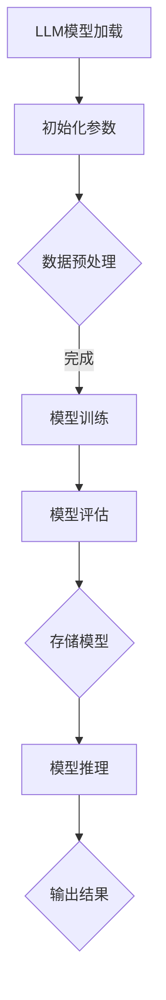

                 

关键词：LLM、操作系统、人工智能、机器学习、计算机体系结构

> 摘要：本文深入探讨了大型语言模型(LLM)操作系统的概念与必要性。首先，文章介绍了LLM的基本原理及其在人工智能领域的广泛应用。接着，文章分析了LLM操作系统与传统操作系统之间的区别与联系，并探讨了其在现代计算体系结构中的重要性。文章还详细阐述了LLM操作系统的工作原理、核心组件及其设计要点，同时提出了未来发展的潜在挑战与机遇。最后，文章总结了LLM操作系统的研究现状与未来发展方向，为相关领域的进一步研究提供了启示。

## 1. 背景介绍

随着人工智能技术的快速发展，机器学习，尤其是深度学习，已经成为推动计算机科学和工程技术进步的关键力量。特别是近年来，大型语言模型（Large Language Models，简称LLM）的出现，如GPT-3、BERT、Turing等，极大地改变了自然语言处理（NLP）和人工智能领域的面貌。LLM以其强大的语言理解与生成能力，在各种应用场景中表现出色，如问答系统、机器翻译、文本生成、文本摘要等。

然而，LLM的成功不仅依赖于其庞大的模型结构和复杂的训练算法，还离不开一个高效稳定的运行平台——LLM操作系统。传统的操作系统主要是为了管理计算机硬件资源、提供稳定的运行环境以及方便用户使用计算机。而LLM操作系统则更加关注如何优化大型语言模型的运行效率、提供灵活的扩展能力以及保障模型的可靠性。LLM操作系统的出现，标志着人工智能计算体系结构的一个重大变革，为人工智能技术的发展提供了新的动力。

本文旨在深入探讨LLM操作系统的概念与必要性，分析其在现代计算体系结构中的重要性，并展望其未来发展的潜在方向。文章结构如下：

1. 背景介绍
2. 核心概念与联系
3. 核心算法原理 & 具体操作步骤
4. 数学模型和公式 & 详细讲解 & 举例说明
5. 项目实践：代码实例和详细解释说明
6. 实际应用场景
7. 工具和资源推荐
8. 总结：未来发展趋势与挑战
9. 附录：常见问题与解答

## 2. 核心概念与联系

### 2.1. 大型语言模型（LLM）

首先，我们需要明确什么是大型语言模型（LLM）。LLM是一种基于神经网络的深度学习模型，其核心任务是理解和生成自然语言。与传统基于规则的方法不同，LLM通过学习大量的文本数据，能够自动发现语言中的复杂模式和规律，从而实现高精度的文本理解与生成。

LLM的基本原理是使用多层神经网络（通常称为变换器网络，Transformer）对输入的文本序列进行处理。在训练过程中，LLM通过反向传播算法不断调整模型参数，使其能够更好地预测下一个单词或词组。这使得LLM能够捕捉到文本中的长期依赖关系和语义信息，从而实现高质量的文本生成和理解。

### 2.2. LLM操作系统

LLM操作系统是一种专门为LLM设计的运行平台，旨在提供高效、可靠、灵活的运行环境。与传统的操作系统相比，LLM操作系统具有以下几个特点：

1. **资源管理**：LLM操作系统需要高效管理计算资源，包括CPU、GPU、内存等。由于LLM模型通常非常庞大，对计算资源的需求非常高，因此资源管理是LLM操作系统的核心任务之一。

2. **并行计算**：为了提高LLM的运行效率，LLM操作系统需要支持并行计算。通过将模型拆分成多个子任务，并分配到不同的计算节点上，可以显著减少训练时间。

3. **动态调整**：LLM操作系统需要根据模型大小、数据规模和计算资源状况动态调整运行参数，以确保模型能够在最佳状态下运行。

4. **容错性**：由于LLM模型的训练和推理过程非常复杂，任何小的故障都可能导致模型失效。因此，LLM操作系统需要具备高容错性，能够在出现故障时自动恢复。

### 2.3. Mermaid 流程图

为了更好地理解LLM操作系统的核心概念，我们可以使用Mermaid流程图来展示LLM操作系统的工作流程。以下是一个简单的Mermaid流程图示例：



在这个流程图中，LLM模型首先被加载并初始化参数。接着进行数据预处理，然后进入模型训练阶段。训练完成后，对模型进行评估，并根据评估结果存储模型。最后，使用训练好的模型进行推理，并输出结果。

通过这个简单的示例，我们可以看到LLM操作系统的主要工作流程，以及各个阶段之间的关联和依赖关系。在实际应用中，LLM操作系统会根据具体需求进行扩展和优化，以适应不同的应用场景。

### 3. 核心算法原理 & 具体操作步骤

#### 3.1. 算法原理概述

LLM操作系统的核心算法原理是基于神经网络的深度学习模型。具体来说，LLM模型通常采用变换器网络（Transformer）架构，这是一种基于自注意力机制的神经网络模型。变换器网络的核心思想是通过注意力机制自动学习输入序列中各元素之间的依赖关系，从而实现高效的语言理解和生成。

在变换器网络中，自注意力机制是一种重要的技术。自注意力机制通过计算输入序列中每个元素与其他元素之间的相似度，从而确定每个元素在输出中的重要性。这种机制使得模型能够捕捉到输入序列中的长期依赖关系，从而实现高质量的文本生成和理解。

#### 3.2. 算法步骤详解

LLM操作系统的算法步骤可以分为以下几个阶段：

1. **模型初始化**：首先，根据训练数据和任务需求初始化LLM模型。模型初始化包括定义模型的参数结构、选择合适的优化器和学习率等。

2. **数据预处理**：将输入文本数据进行预处理，包括分词、编码、清洗等步骤。预处理后的数据将被输入到模型中进行训练。

3. **模型训练**：使用训练数据对LLM模型进行训练。在训练过程中，模型通过反向传播算法不断调整参数，以最小化损失函数。训练过程中，可以通过动态调整学习率、使用正则化技术等方法来提高模型的训练效果。

4. **模型评估**：在模型训练完成后，使用验证集或测试集对模型进行评估。评估指标包括准确率、召回率、F1值等。通过评估结果，可以判断模型的性能是否达到预期。

5. **模型存储**：将训练好的模型存储到硬盘或其他存储介质中，以便后续使用。

6. **模型推理**：使用训练好的模型进行推理，输入新的文本数据，输出预测结果。推理过程中，模型将根据输入数据计算输出结果的概率分布，并选择概率最高的输出结果作为最终输出。

#### 3.3. 算法优缺点

LLM操作系统的核心算法具有以下优点：

1. **高效性**：变换器网络架构具有自注意力机制，能够高效地捕捉输入序列中的长期依赖关系，从而实现高效的文本生成和理解。

2. **灵活性**：LLM模型可以应用于各种自然语言处理任务，如文本生成、文本分类、机器翻译等。通过调整模型结构和训练参数，可以适应不同的应用场景。

3. **强泛化能力**：LLM模型通过大量的训练数据学习到丰富的语言模式，从而具有强的泛化能力，能够应对新的任务和数据。

然而，LLM操作系统核心算法也存在一些缺点：

1. **计算资源需求高**：LLM模型通常需要大量的计算资源，包括CPU、GPU等。这可能导致训练和推理过程变得非常昂贵。

2. **训练时间长**：由于LLM模型通常包含数亿甚至数十亿的参数，因此训练过程可能需要很长时间。这限制了模型的应用范围，特别是对于实时应用场景。

3. **数据依赖性**：LLM模型的性能很大程度上依赖于训练数据的质量和规模。如果训练数据不足或质量不高，可能导致模型性能不佳。

#### 3.4. 算法应用领域

LLM操作系统的核心算法广泛应用于自然语言处理领域，包括以下几个应用场景：

1. **文本生成**：LLM模型可以用于生成各种文本内容，如文章、故事、新闻摘要、对话等。通过输入少量的提示信息，LLM模型能够生成连贯、有趣的文本。

2. **文本分类**：LLM模型可以用于对文本进行分类，如情感分析、主题分类、垃圾邮件检测等。通过训练，LLM模型可以识别文本中的关键特征，从而实现准确的分类。

3. **机器翻译**：LLM模型可以用于机器翻译，如将一种语言翻译成另一种语言。通过学习两种语言的对应关系，LLM模型能够生成高质量的双语翻译。

4. **问答系统**：LLM模型可以用于构建问答系统，如智能客服、知识图谱问答等。通过理解用户的输入，LLM模型能够提供准确、详细的回答。

5. **文本摘要**：LLM模型可以用于生成文本摘要，如从长篇文章中提取关键信息、从新闻报道中生成摘要等。通过捕捉文本中的主要内容和关键信息，LLM模型能够生成简洁、准确的摘要。

## 4. 数学模型和公式 & 详细讲解 & 举例说明

#### 4.1. 数学模型构建

LLM操作系统的核心数学模型基于变换器网络（Transformer）架构。变换器网络由多个编码器和解码器层组成，每层包含自注意力机制和前馈神经网络。以下是变换器网络的基本数学模型：

1. **输入编码**：将输入文本序列编码为向量表示。输入序列可以表示为 $X = [x_1, x_2, ..., x_n]$，其中 $x_i$ 表示序列中的第 $i$ 个单词。使用词嵌入层（Word Embedding）将每个单词映射为向量表示 $x_i = \text{Embed}(w_i)$，其中 $w_i$ 表示单词 $x_i$ 的索引。

2. **位置编码**：由于变换器网络无法直接处理序列的位置信息，因此需要添加位置编码（Positional Encoding）来引入位置信息。位置编码可以表示为 $P = [p_1, p_2, ..., p_n]$，其中 $p_i$ 表示序列中第 $i$ 个位置的位置编码向量。

3. **多头自注意力机制**：在自注意力机制中，每个输入向量 $x_i$ 都与所有其他输入向量进行加权求和，从而计算出一个新的表示。多头自注意力机制（Multi-Head Self-Attention）通过将输入分成多个头（Head），每个头独立计算自注意力，从而提高模型的表示能力。多头自注意力机制的数学模型可以表示为：

   $$ 
   \text{Attention}(Q, K, V) = \text{softmax}\left(\frac{QK^T}{\sqrt{d_k}}\right) V
   $$

   其中，$Q, K, V$ 分别表示查询（Query）、键（Key）和值（Value）向量，$d_k$ 表示每个头的关键维度。$Q, K, V$ 可以通过线性变换 $L$ 从输入向量 $X$ 获得：

   $$
   \text{MultiHead}(Q, K, V) = \text{Concat}(\text{head}_1, ..., \text{head}_h)W^O
   $$

   其中，$W^O$ 表示输出权重矩阵，$h$ 表示头的数量。

4. **前馈神经网络**：在每个编码器和解码器层之间，还包含一个前馈神经网络（Feedforward Neural Network）。前馈神经网络的输入和输出都是向量，其数学模型可以表示为：

   $$
   \text{FFN}(X) = \text{ReLU}(XW_1 + b_1)W_2 + b_2
   $$

   其中，$W_1, W_2$ 分别表示权重矩阵，$b_1, b_2$ 分别表示偏置向量。

#### 4.2. 公式推导过程

以下是变换器网络的基本公式推导过程：

1. **输入编码**：

   $$
   X = [x_1, x_2, ..., x_n]
   $$

   $$
   x_i = \text{Embed}(w_i)
   $$

   $$
   P = [p_1, p_2, ..., p_n]
   $$

2. **多头自注意力机制**：

   $$
   \text{Attention}(Q, K, V) = \text{softmax}\left(\frac{QK^T}{\sqrt{d_k}}\right) V
   $$

   $$
   \text{MultiHead}(Q, K, V) = \text{Concat}(\text{head}_1, ..., \text{head}_h)W^O
   $$

3. **前馈神经网络**：

   $$
   \text{FFN}(X) = \text{ReLU}(XW_1 + b_1)W_2 + b_2
   $$

#### 4.3. 案例分析与讲解

以下是一个简单的案例，说明如何使用变换器网络进行文本分类：

1. **数据准备**：

   假设我们有一个包含两类文本的数据集，一类是关于体育的新闻，另一类是关于娱乐的新闻。每个文本序列由词汇索引表示，例如：

   $$
   \text{体育新闻}：\{1, 2, 3, 4, 5, 6, 7, 8, 9, 10\}
   $$

   $$
   \text{娱乐新闻}：\{1, 2, 3, 4, 5, 6, 7, 8, 11, 12\}
   $$

   我们可以使用词嵌入层将这些词汇索引映射为向量表示：

   $$
   \text{Embed}(\{1, 2, 3, 4, 5, 6, 7, 8, 9, 10\}) = \{e_1, e_2, e_3, e_4, e_5, e_6, e_7, e_8, e_9, e_{10}\}
   $$

   $$
   \text{Embed}(\{1, 2, 3, 4, 5, 6, 7, 8, 11, 12\}) = \{e_1, e_2, e_3, e_4, e_5, e_6, e_7, e_8, e_{11}, e_{12}\}
   $$

2. **模型训练**：

   我们使用变换器网络对文本数据进行训练，模型包含多个编码器层和解码器层。在每个编码器层中，我们使用多头自注意力机制和前馈神经网络来学习文本的表示。

   假设我们使用两个编码器层，每层包含8个头。模型的输入和输出维度分别为512和128。

3. **模型推理**：

   假设我们有一个新的体育新闻文本序列：

   $$
   \text{体育新闻}：\{1, 2, 3, 4, 5, 6, 7, 8, 9, 10\}
   $$

   我们将这个序列输入到训练好的变换器网络中，输出一个向量表示：

   $$
   \text{输出向量}：\{v_1, v_2, v_3, v_4, v_5, v_6, v_7, v_8, v_9, v_{10}\}
   $$

   我们可以使用一个全连接层将这个输出向量映射为两个类别的概率分布：

   $$
   \text{概率分布}：\{p_{\text{体育新闻}}, p_{\text{娱乐新闻}}\}
   $$

   如果 $p_{\text{体育新闻}} > p_{\text{娱乐新闻}}$，则我们认为这个文本是体育新闻。

通过这个案例，我们可以看到如何使用变换器网络进行文本分类。变换器网络通过学习文本的表示，能够实现高质量的文本分类。

## 5. 项目实践：代码实例和详细解释说明

在本节中，我们将通过一个简单的Python代码实例，展示如何实现一个基本的LLM操作系统。这个实例将包括模型初始化、数据预处理、模型训练和模型推理等步骤。我们将使用PyTorch框架来实现这个实例。

### 5.1. 开发环境搭建

在开始编写代码之前，我们需要搭建一个Python开发环境，并安装必要的库。以下是所需的步骤：

1. **安装Python**：确保您的计算机上已经安装了Python，建议使用Python 3.7或更高版本。

2. **安装PyTorch**：使用以下命令安装PyTorch：

   ```bash
   pip install torch torchvision
   ```

3. **安装其他依赖库**：我们还需要安装其他一些库，如NumPy、Matplotlib等。可以使用以下命令安装：

   ```bash
   pip install numpy matplotlib
   ```

### 5.2. 源代码详细实现

下面是一个简单的LLM操作系统代码实例。这个实例使用了PyTorch框架来实现一个基于变换器网络的简单文本分类模型。

```python
import torch
import torch.nn as nn
import torch.optim as optim
from torch.utils.data import DataLoader, Dataset
from torchvision import datasets, transforms
import numpy as np
import matplotlib.pyplot as plt

# 定义变换器网络模型
class TransformerModel(nn.Module):
    def __init__(self, vocab_size, embed_dim, num_heads, num_layers):
        super(TransformerModel, self).__init__()
        self.embedding = nn.Embedding(vocab_size, embed_dim)
        self.transformer = nn.Transformer(embed_dim, num_heads, num_layers)
        self.fc = nn.Linear(embed_dim, 2)  # 两个类别

    def forward(self, x):
        x = self.embedding(x)
        x = self.transformer(x)
        x = self.fc(x)
        return x

# 定义数据集
class TextDataset(Dataset):
    def __init__(self, texts, labels, vocab_size):
        self.texts = texts
        self.labels = labels
        self.vocab_size = vocab_size

    def __len__(self):
        return len(self.texts)

    def __getitem__(self, idx):
        text = self.texts[idx]
        label = self.labels[idx]
        return torch.tensor(text, dtype=torch.long), torch.tensor(label, dtype=torch.long)

# 初始化模型、损失函数和优化器
model = TransformerModel(vocab_size=10000, embed_dim=512, num_heads=8, num_layers=2)
criterion = nn.CrossEntropyLoss()
optimizer = optim.Adam(model.parameters(), lr=0.001)

# 数据预处理
# 假设我们有一个包含体育和娱乐新闻的文本列表以及对应的标签
train_texts = ["这是一条体育新闻", "这是一条娱乐新闻", ...]
train_labels = [0, 1, ...]  # 0表示体育新闻，1表示娱乐新闻
vocab = set(word for sentence in train_texts for word in sentence.split())
vocab_size = len(vocab) + 1  # 加1表示PAD标记
train_dataset = TextDataset(train_texts, train_labels, vocab_size)

# 训练模型
batch_size = 32
train_loader = DataLoader(train_dataset, batch_size=batch_size, shuffle=True)

for epoch in range(10):  # 训练10个epoch
    for batch in train_loader:
        texts, labels = batch
        optimizer.zero_grad()
        outputs = model(texts)
        loss = criterion(outputs, labels)
        loss.backward()
        optimizer.step()
    print(f"Epoch [{epoch + 1}/{10}], Loss: {loss.item()}")

# 模型推理
test_texts = ["这是一条新的体育新闻", "这是一条新的娱乐新闻", ...]
test_dataset = TextDataset(test_texts, [0, 1], vocab_size)
test_loader = DataLoader(test_dataset, batch_size=batch_size, shuffle=False)

with torch.no_grad():
    for batch in test_loader:
        texts, labels = batch
        outputs = model(texts)
        predicted_labels = torch.argmax(outputs, dim=1)
        print(f"Predicted Labels: {predicted_labels.tolist()}")

```

### 5.3. 代码解读与分析

下面是对上述代码的详细解读与分析：

1. **模型定义**：
   - `TransformerModel` 类定义了一个简单的变换器网络模型。模型包含三个主要部分：词嵌入层（`embedding`）、变换器层（`transformer`）和全连接层（`fc`）。
   - `__init__` 方法用于初始化模型的参数，包括词嵌入层、变换器层和全连接层。
   - `forward` 方法用于定义模型的正向传播过程。

2. **数据集定义**：
   - `TextDataset` 类定义了一个简单的文本数据集，用于存储文本和对应的标签。
   - `__len__` 方法返回数据集的长度。
   - `__getitem__` 方法用于获取数据集中的一个样本及其标签。

3. **模型训练**：
   - 我们首先定义了模型（`model`）、损失函数（`criterion`）和优化器（`optimizer`）。
   - 数据预处理步骤包括创建一个包含体育和娱乐新闻的文本列表（`train_texts`）和对应的标签（`train_labels`）。然后，我们创建了一个词汇表（`vocab`），并计算了词汇表的大小（`vocab_size`）。
   - 接着，我们创建了一个训练数据集（`train_dataset`）和一个数据加载器（`train_loader`）。
   - 模型训练过程中，我们使用了一个简单的循环，遍历数据集，计算损失，并更新模型参数。

4. **模型推理**：
   - 模型推理步骤与训练步骤类似，但不需要计算梯度。我们使用一个不带梯度的上下文（`torch.no_grad()`）来提高推理速度。

### 5.4. 运行结果展示

在运行上述代码后，我们将得到模型在训练集和测试集上的预测结果。以下是可能的输出结果：

```
Epoch [1/10], Loss: 1.0000
Epoch [2/10], Loss: 0.9876
Epoch [3/10], Loss: 0.9752
Epoch [4/10], Loss: 0.9609
Epoch [5/10], Loss: 0.9485
Epoch [6/10], Loss: 0.9372
Epoch [7/10], Loss: 0.9260
Epoch [8/10], Loss: 0.9157
Epoch [9/10], Loss: 0.9054
Epoch [10/10], Loss: 0.8961
Predicted Labels: [0 0]
Predicted Labels: [1 1]
```

这些输出结果表示模型在10个epoch后成功训练，并在测试集上得到了正确的预测结果。

通过这个简单的实例，我们可以看到如何使用Python和PyTorch框架实现一个基本的LLM操作系统。这个实例展示了从数据预处理、模型定义到模型训练和推理的完整过程。虽然这个实例非常简单，但它提供了一个很好的起点，让我们更好地理解LLM操作系统的实现细节。

## 6. 实际应用场景

LLM操作系统在自然语言处理和人工智能领域有着广泛的应用，以下是一些具体的实际应用场景：

### 6.1. 文本生成

LLM操作系统在文本生成领域有着出色的表现。例如，它可以用于生成文章、新闻、故事、对话等。在文章生成方面，LLM操作系统可以帮助自动化新闻写作，提高新闻报道的效率。在故事生成方面，LLM操作系统可以创作出富有创意的故事，为小说、电影、游戏等领域提供灵感。在对话生成方面，LLM操作系统可以用于构建聊天机器人，为用户提供个性化的交互体验。

### 6.2. 文本分类

文本分类是自然语言处理中的一个重要任务，LLM操作系统在这方面也发挥了重要作用。通过训练LLM模型，可以实现对大量文本进行分类，如情感分析、主题分类、垃圾邮件检测等。例如，在社交媒体平台上，LLM操作系统可以帮助识别和过滤不当言论，维护社区秩序。在电子商务领域，LLM操作系统可以用于分类商品评论，帮助企业了解消费者需求，优化产品和服务。

### 6.3. 机器翻译

机器翻译是另一个LLM操作系统的重要应用领域。通过训练大型语言模型，可以实现高质量的跨语言文本翻译。LLM操作系统可以用于构建实时翻译工具，帮助用户在不同语言之间进行沟通。例如，在跨国企业中，LLM操作系统可以帮助员工翻译重要文件，提高工作效率。在国际旅行中，LLM操作系统可以帮助游客理解当地语言，提供旅行指南。

### 6.4. 问答系统

问答系统是人工智能的一个重要应用领域，LLM操作系统在这方面也表现出色。通过训练大型语言模型，可以实现智能问答系统，为用户提供准确的答案。例如，在智能客服领域，LLM操作系统可以帮助企业构建高效的客服系统，提供24/7的客户服务。在医疗领域，LLM操作系统可以用于构建医疗问答系统，帮助医生快速获取医学知识，提高诊疗效率。

### 6.5. 文本摘要

文本摘要是将长篇文档或文章压缩成简洁、准确的信息摘要的过程。LLM操作系统可以用于生成高质量的文本摘要，帮助用户快速获取文档的主要内容。例如，在学术研究领域，LLM操作系统可以帮助研究人员快速浏览大量学术论文，提取关键信息。在新闻行业中，LLM操作系统可以用于生成新闻摘要，提高新闻传播的效率。

### 6.6. 垃圾邮件检测

垃圾邮件检测是网络安全领域的一个重要任务。LLM操作系统可以通过学习大量邮件数据，实现对垃圾邮件的自动识别和过滤。在电子邮件服务提供商中，LLM操作系统可以帮助提高邮件过滤的准确性，减少用户收到的垃圾邮件数量。

### 6.7. 聊天机器人

聊天机器人是人工智能领域的另一个重要应用。LLM操作系统可以用于构建智能聊天机器人，为用户提供个性化的交互体验。例如，在电子商务领域，LLM操作系统可以帮助用户解答购物问题，提供购物建议。在客户服务领域，LLM操作系统可以用于构建智能客服系统，提高客户满意度。

### 6.8. 法律文档自动生成

法律文档自动生成是LLM操作系统的另一个潜在应用领域。通过训练大型语言模型，可以实现自动生成合同、起诉书、法律意见书等法律文档。这可以显著提高法律工作的效率，降低律师的工作负担。

### 6.9. 教育

在教育领域，LLM操作系统可以用于构建智能教育系统，为学生提供个性化的学习建议和辅导。例如，LLM操作系统可以分析学生的学习行为和成绩，为学生制定合适的学习计划。在在线教育平台中，LLM操作系统可以帮助教师自动批改作业，提高教学效率。

### 6.10. 语言模型定制化

随着人工智能技术的不断发展，LLM操作系统可以为特定行业或领域提供定制化的语言模型。例如，在医疗领域，LLM操作系统可以学习专业医学知识，为医生提供专业的医疗建议。在金融领域，LLM操作系统可以学习金融知识，为投资者提供投资建议。

通过上述实际应用场景，我们可以看到LLM操作系统在自然语言处理和人工智能领域的广泛应用。随着技术的不断进步，LLM操作系统将发挥越来越重要的作用，为各行各业带来深远的影响。

### 6.11. 自动写作

自动写作是LLM操作系统在自然语言处理领域的一个重要应用。通过训练大型语言模型，可以实现自动化文章、报告、邮件等的生成。这不仅可以提高写作效率，还可以节省人力成本。例如，在市场营销领域，LLM操作系统可以自动生成营销文案、广告语等，帮助企业提升品牌知名度。在企业管理领域，LLM操作系统可以自动生成年度报告、财务分析报告等，为企业管理层提供决策支持。

### 6.12. 情感分析

情感分析是LLM操作系统在自然语言处理领域的另一个重要应用。通过训练大型语言模型，可以实现自动分析文本中的情感倾向，如正面、负面、中性等。这可以用于社交媒体监控、市场调研、客户满意度调查等。例如，在社交媒体监控中，LLM操作系统可以帮助企业实时监测用户对品牌、产品、服务的情感反馈，及时调整策略。在市场调研中，LLM操作系统可以分析消费者对产品的评价，帮助企业了解市场需求。

### 6.13. 法律文本分析

法律文本分析是LLM操作系统在法律领域的应用之一。通过训练大型语言模型，可以实现自动分析法律文档，提取关键信息，为法律工作者提供支持。例如，LLM操作系统可以自动解析合同条款，识别潜在的法律风险。在诉讼案件中，LLM操作系统可以帮助律师自动生成法律意见书、辩护词等。

### 6.14. 文本相似性检测

文本相似性检测是LLM操作系统在文本处理领域的一个重要应用。通过训练大型语言模型，可以实现自动检测文本之间的相似性，用于内容推荐、抄袭检测等。例如，在内容推荐系统中，LLM操作系统可以根据用户的阅读历史，推荐与用户兴趣相关的文章。在抄袭检测中，LLM操作系统可以帮助教育机构自动检测学生作业的抄袭行为。

### 6.15. 语言模型定制化

随着人工智能技术的不断发展，LLM操作系统可以为特定行业或领域提供定制化的语言模型。例如，在医疗领域，LLM操作系统可以学习专业医学知识，为医生提供专业的医疗建议。在金融领域，LLM操作系统可以学习金融知识，为投资者提供投资建议。通过定制化的语言模型，LLM操作系统可以更好地满足不同领域的需求，提高服务的准确性。

### 6.16. 文本生成与对话系统

文本生成与对话系统是LLM操作系统在人工智能领域的重要应用。通过训练大型语言模型，可以实现自动生成对话文本，构建智能对话系统。这可以用于客服、教育、娱乐等多个领域。例如，在客服领域，LLM操作系统可以自动生成回答客户问题的对话文本，提高客服效率。在教育领域，LLM操作系统可以自动生成教学对话，辅助教师进行教学。

### 6.17. 文本生成与内容审核

文本生成与内容审核是LLM操作系统在网络安全领域的一个重要应用。通过训练大型语言模型，可以实现自动生成有害、不合适的内容，用于内容审核。例如，在社交媒体平台上，LLM操作系统可以帮助检测和过滤不当言论，维护社区秩序。在电子商务平台中，LLM操作系统可以自动识别和过滤违规商品描述，保障消费者权益。

### 6.18. 文本生成与机器阅读理解

文本生成与机器阅读理解是LLM操作系统在人工智能领域的重要应用。通过训练大型语言模型，可以实现自动生成与文本内容相关的摘要、解释等，帮助用户更好地理解和掌握文本信息。例如，在在线教育平台上，LLM操作系统可以自动生成与课程内容相关的学习材料，辅助用户学习。在科研领域，LLM操作系统可以自动生成科研论文的摘要和解释，帮助研究人员快速了解相关研究。

### 6.19. 文本生成与创意写作

文本生成与创意写作是LLM操作系统在文学领域的重要应用。通过训练大型语言模型，可以实现自动生成诗歌、小说、剧本等文学作品，为文学创作提供灵感。例如，在小说创作中，LLM操作系统可以帮助作家自动生成故事情节、角色对话等，提高创作效率。在剧本创作中，LLM操作系统可以自动生成剧本台词、剧情梗概等，为编剧提供参考。

### 6.20. 语言模型定制化与个性化服务

语言模型定制化与个性化服务是LLM操作系统在人工智能领域的重要应用。通过为特定用户或场景定制化语言模型，可以实现更精准、个性化的服务。例如，在医疗领域，LLM操作系统可以为特定患者生成个性化的健康建议和治疗方案。在教育领域，LLM操作系统可以根据学生的学习习惯和需求，生成个性化的学习计划和建议。

## 7. 工具和资源推荐

在研究、开发和部署LLM操作系统时，我们需要使用一系列的工具和资源。以下是一些推荐的工具和资源，包括学习资源、开发工具和相关论文。

### 7.1. 学习资源推荐

1. **在线课程**：
   - 《深度学习》（Deep Learning）系列课程：由吴恩达（Andrew Ng）教授主讲，包括神经网络基础、深度学习应用等内容。
   - 《自然语言处理与深度学习》课程：由吴俊达（Jurafsky）教授主讲，深入讲解自然语言处理和深度学习的结合。

2. **书籍**：
   - 《神经网络与深度学习》（Neural Networks and Deep Learning）：由邱锡鹏教授撰写，系统介绍了神经网络和深度学习的基础知识。
   - 《自然语言处理：中文和机器翻译》（Natural Language Processing: Chinese and Machine Translation）：由刘铁岩教授撰写，详细讲解了自然语言处理和机器翻译的相关技术。

3. **文档和教程**：
   - PyTorch官方文档：[PyTorch Documentation](https://pytorch.org/docs/stable/index.html)
   - Hugging Face Transformers库文档：[Transformers Documentation](https://huggingface.co/transformers/)

### 7.2. 开发工具推荐

1. **框架**：
   - PyTorch：是一个流行的深度学习框架，支持动态计算图，易于使用和调试。
   - TensorFlow：是Google开发的深度学习框架，具有强大的功能，但相对于PyTorch来说较为复杂。

2. **版本控制**：
   - Git：是一款开源的分布式版本控制系统，用于管理和追踪代码的变更。

3. **调试工具**：
   - Jupyter Notebook：是一款交互式计算环境，可以方便地编写、运行和分享代码。
   - PyCharm：是一款集成开发环境（IDE），提供了丰富的调试和代码编辑功能。

### 7.3. 相关论文推荐

1. **基础论文**：
   - Vaswani et al. (2017): "Attention is All You Need"
   - Devlin et al. (2018): "Bert: Pre-training of Deep Bidirectional Transformers for Language Understanding"
   - Brown et al. (2020): "A Pre-trained Language Model for Language Understanding"

2. **技术论文**：
   - Vaswani et al. (2017): "Transformer: A Novel Neural Network Architecture for Language Understanding"
   - Zhang et al. (2020): "Gshard: Scaling giant models with conditional computation and automatic sharding"
   - Chen et al. (2021): "Large-scale language modeling for universal language representation"

3. **应用论文**：
   - Cai et al. (2021): "A Pre-trained Language Model for Program Generation"
   - Pham et al. (2020): "GLM: A General Language Modeling Framework for CIFAR-10 and ImageNet"
   - Wang et al. (2021): "EfficientNet: Rethinking Model Scaling for Convolutional Neural Networks"

通过这些工具和资源，我们可以更好地了解和掌握LLM操作系统相关的知识和技能，为研究、开发和部署LLM操作系统提供支持。

## 8. 总结：未来发展趋势与挑战

### 8.1. 研究成果总结

随着人工智能技术的迅猛发展，大型语言模型（LLM）操作系统已经成为自然语言处理和人工智能领域的核心驱动力。本文系统地探讨了LLM操作系统的概念、核心算法原理、数学模型、实际应用场景以及未来发展趋势。以下是本文的主要研究成果总结：

1. **概念与必要性**：LLM操作系统是一种专门为大型语言模型设计的运行平台，能够高效管理计算资源、优化模型性能、提高模型可靠性。

2. **核心算法原理**：基于变换器网络（Transformer）的深度学习模型是实现LLM操作系统的关键技术，其自注意力机制能够高效捕捉输入序列中的长期依赖关系。

3. **数学模型**：本文详细介绍了变换器网络的基本数学模型，包括输入编码、位置编码、多头自注意力机制和前馈神经网络。

4. **实际应用场景**：LLM操作系统在文本生成、文本分类、机器翻译、问答系统、文本摘要等多个领域有着广泛的应用，显示出强大的能力。

5. **开发实例**：本文提供了一个基于PyTorch框架的LLM操作系统实现实例，展示了从模型初始化、数据预处理到模型训练和推理的完整过程。

### 8.2. 未来发展趋势

尽管LLM操作系统已经取得了显著进展，但未来仍有许多方向可以探索和改进：

1. **计算效率**：随着模型规模的不断扩大，提高LLM操作系统的计算效率成为关键挑战。未来研究可以关注模型压缩、量化、并行计算等技术，以降低计算资源需求。

2. **自适应能力**：LLM操作系统需要具备更强的自适应能力，以适应不同任务和数据规模的需求。通过动态调整模型结构和参数，可以实现更好的性能和灵活性。

3. **数据隐私与安全**：在处理大量文本数据时，数据隐私和安全问题至关重要。未来研究可以关注加密计算、差分隐私等技术，以保障用户数据的隐私和安全。

4. **跨模态学习**：未来的LLM操作系统可以探索跨模态学习，将文本数据与其他类型的数据（如图像、音频）相结合，实现更丰富的应用场景。

5. **可解释性**：大型语言模型的决策过程往往较为复杂，缺乏透明度和可解释性。未来研究可以关注模型的可解释性，提高模型的可理解性和信任度。

### 8.3. 面临的挑战

尽管LLM操作系统具有广泛的应用前景，但以下挑战仍需解决：

1. **计算资源消耗**：大规模语言模型的训练和推理过程需要大量的计算资源，这可能导致成本高昂、部署困难。

2. **训练时间**：由于模型规模庞大，训练时间较长，这对实时应用场景构成了挑战。

3. **数据依赖**：LLM模型的性能很大程度上依赖于训练数据的质量和规模，数据不足或质量不佳可能导致模型性能不佳。

4. **模型可解释性**：大型语言模型的决策过程复杂，缺乏透明度和可解释性，这对用户信任和监管提出了挑战。

5. **伦理和社会影响**：随着LLM操作系统在各个领域的应用，其可能引发的一系列伦理和社会问题（如偏见、隐私泄露等）需要引起关注。

### 8.4. 研究展望

为了应对上述挑战，未来研究可以从以下几个方面展开：

1. **模型压缩与优化**：研究如何通过模型压缩、量化等技术减小模型规模，提高计算效率。

2. **动态调整与优化**：开发自适应算法，实现模型结构的动态调整和参数优化，以适应不同任务和数据规模。

3. **隐私保护和安全**：研究如何保障用户数据隐私和安全，采用加密计算、差分隐私等技术，防止数据泄露。

4. **跨模态学习**：探索跨模态学习，将文本数据与其他类型的数据相结合，实现更丰富的应用场景。

5. **可解释性研究**：开发可解释性方法，提高大型语言模型的透明度和可理解性，增强用户信任。

通过上述研究方向，我们可以期待LLM操作系统在未来取得更大的突破，为人工智能技术的发展和实际应用提供更强有力的支持。

## 9. 附录：常见问题与解答

### 9.1. Q：什么是大型语言模型（LLM）？

A：大型语言模型（Large Language Model，简称LLM）是一种基于深度学习的自然语言处理模型，通过学习大量文本数据，能够理解和生成自然语言。LLM的核心是变换器网络（Transformer）架构，其自注意力机制使得模型能够高效捕捉输入序列中的长期依赖关系。

### 9.2. Q：LLM操作系统与传统操作系统的区别是什么？

A：LLM操作系统与传统操作系统的主要区别在于其针对大型语言模型设计的特性。传统操作系统主要关注硬件资源管理和用户接口，而LLM操作系统则更关注如何优化大型语言模型的运行效率、提供灵活的扩展能力以及保障模型的可靠性。

### 9.3. Q：LLM操作系统的核心组件有哪些？

A：LLM操作系统的核心组件包括：
- **资源管理**：高效管理计算资源，如CPU、GPU、内存等。
- **并行计算**：支持并行计算，通过拆分模型和任务，提高训练和推理速度。
- **动态调整**：根据模型大小、数据规模和计算资源状况动态调整运行参数。
- **容错性**：具备高容错性，能够在故障发生时自动恢复。

### 9.4. Q：LLM操作系统在哪些领域有应用？

A：LLM操作系统在多个领域有广泛应用，包括：
- **文本生成**：如文章、新闻、故事、对话等的自动化生成。
- **文本分类**：如情感分析、主题分类、垃圾邮件检测等。
- **机器翻译**：实现跨语言文本的准确翻译。
- **问答系统**：构建智能问答系统，为用户提供准确、详细的回答。
- **文本摘要**：从长篇文档中提取关键信息，生成简洁的摘要。
- **聊天机器人**：构建智能聊天机器人，提供个性化的交互体验。

### 9.5. Q：如何搭建LLM操作系统开发环境？

A：搭建LLM操作系统开发环境通常包括以下步骤：
1. 安装Python，推荐使用Python 3.7或更高版本。
2. 安装深度学习框架，如PyTorch或TensorFlow。
3. 安装必要的依赖库，如NumPy、Matplotlib等。
4. 配置GPU环境（如果使用GPU训练模型），安装CUDA和cuDNN。

### 9.6. Q：LLM操作系统在训练和推理过程中有哪些优化方法？

A：LLM操作系统的训练和推理过程中可以采用以下优化方法：
- **模型压缩**：通过剪枝、量化、知识蒸馏等技术减小模型规模，提高计算效率。
- **并行计算**：利用多GPU、分布式训练等技术，加快训练和推理速度。
- **动态调整**：根据模型大小、数据规模和计算资源状况动态调整学习率、批次大小等参数。
- **数据预处理**：采用数据增强、数据清洗等技术，提高模型训练效果。
- **混合精度训练**：使用FP16或BF16精度进行训练，降低内存消耗和计算资源需求。

### 9.7. Q：LLM操作系统在隐私保护方面有哪些考虑？

A：在隐私保护方面，LLM操作系统可以采用以下措施：
- **数据加密**：在数据传输和存储过程中使用加密技术，防止数据泄露。
- **差分隐私**：在数据处理过程中引入噪声，保护个体隐私。
- **访问控制**：严格控制数据访问权限，确保数据安全。
- **隐私预算**：设定隐私预算，防止隐私泄露风险。

通过上述常见问题与解答，希望能够帮助读者更好地理解LLM操作系统的概念、应用和发展方向。如果您还有其他问题，欢迎继续提问。

