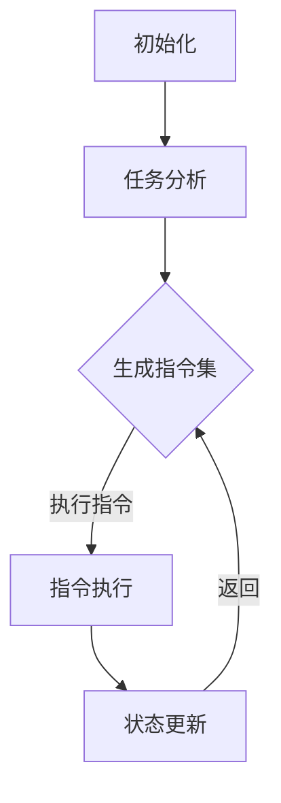

                 

### 1. 背景介绍

近年来，人工智能（AI）技术取得了惊人的进展，尤其是基于大型语言模型（LLM）的应用。从自然语言处理（NLP）到机器学习（ML），LLM已经成为许多领域的核心驱动力。然而，尽管LLM在许多任务中表现出色，但它们在执行复杂任务时仍然受到某些限制。为了克服这些限制，研究人员提出了“无限指令集”（Infinite Instruction Set，简称IIS）的概念。

无限指令集是一种新的AI架构，旨在通过引入无限的指令集来扩展LLM的能力。与传统架构不同，IIS允许模型以动态方式添加、修改和删除指令，从而在执行任务时具有更高的灵活性和适应性。这种架构为AI系统开辟了新的可能性，使其能够应对更复杂、更动态的任务环境。

本文将探讨LLM无限指令集的背景、核心概念、算法原理、数学模型以及实际应用。首先，我们将介绍IIS的起源和发展，然后深入分析其原理和架构，最后通过具体案例展示其在实际中的应用。

### 2. 核心概念与联系

#### 2.1 定义与基本原理

无限指令集（IIS）是一种基于LLM的AI架构，其主要特点是可以动态扩展指令集。在传统AI系统中，指令集通常是固定的，无法根据任务需求进行调整。而IIS则通过引入动态指令生成和执行机制，使得模型可以在运行时根据需要添加、修改或删除指令。

这种动态性使得IIS在处理复杂、动态的任务时具有显著优势。例如，在自然语言处理任务中，IIS可以自动生成和理解各种语言结构和语义，从而更好地处理复杂的文本数据。此外，IIS还可以在计算机视觉、语音识别等领域发挥重要作用。

#### 2.2 架构与流程

无限指令集的架构包括三个主要组件：指令生成器、指令执行器和状态管理器。

1. **指令生成器**：负责根据当前任务和环境动态生成指令。指令生成器可以从已有的指令库中选取或组合指令，或者根据任务需求生成新的指令。

2. **指令执行器**：负责执行指令生成器生成的指令。指令执行器可以解析指令，将其转化为具体的操作，并执行相应的计算或数据处理。

3. **状态管理器**：负责维护模型的状态信息，包括已执行指令的记录、当前任务的状态等。状态管理器可以帮助指令执行器理解当前任务的上下文和目标，从而更好地执行指令。

这三个组件通过紧密协作，实现了IIS的动态指令生成和执行过程。具体流程如下：

- **初始化**：在模型开始执行任务之前，首先初始化指令生成器、指令执行器和状态管理器。
- **任务分析**：指令生成器根据当前任务和环境，生成初始指令集。
- **指令执行**：指令执行器按照生成的指令集，逐条执行指令，完成相应的计算或数据处理。
- **状态更新**：在指令执行过程中，状态管理器不断更新模型的状态信息，以便后续指令生成和执行。
- **循环迭代**：重复执行指令生成、指令执行和状态更新的过程，直到任务完成。

#### 2.3 Mermaid流程图

为了更清晰地展示IIS的架构和流程，我们使用Mermaid语言绘制了一个简化的流程图：



在这个流程图中，A表示初始化阶段，B表示任务分析阶段，C表示生成指令集阶段，D表示指令执行阶段，E表示状态更新阶段。箭头表示流程的顺序和方向。

### 3. 核心算法原理 & 具体操作步骤

#### 3.1 算法原理概述

无限指令集（IIS）的核心算法原理在于其动态指令生成和执行机制。与传统固定指令集的AI系统不同，IIS可以根据任务需求和当前环境动态调整指令集，从而更好地适应复杂、动态的任务场景。

IIS的基本算法包括以下几个步骤：

1. **任务分析**：根据当前任务和环境，分析任务需求，识别关键信息和目标。
2. **指令生成**：根据任务分析结果，从指令库中选取或组合指令，或者生成新的指令。
3. **指令执行**：按照生成的指令集，逐条执行指令，完成相应的计算或数据处理。
4. **状态更新**：在指令执行过程中，根据任务进展和当前状态，更新模型的状态信息。
5. **循环迭代**：重复执行指令生成、指令执行和状态更新的过程，直到任务完成。

#### 3.2 算法步骤详解

下面我们将详细讲解IIS的各个步骤。

##### 步骤1：任务分析

任务分析是IIS算法的第一个步骤，其目标是根据当前任务和环境，识别任务需求、关键信息和目标。任务分析可以分为以下几个阶段：

1. **输入数据预处理**：对输入的数据进行预处理，包括数据清洗、数据转换和数据归一化等。预处理的结果将作为后续任务分析的输入。
2. **特征提取**：从预处理后的数据中提取关键特征，用于描述任务需求和目标。特征提取可以使用各种机器学习算法，如主成分分析（PCA）、线性判别分析（LDA）等。
3. **目标识别**：根据特征提取结果，识别当前任务的目标。目标可以是分类、回归、聚类等。

##### 步骤2：指令生成

指令生成是根据任务分析结果，从指令库中选取或组合指令，或者生成新的指令。指令生成可以分为以下几个阶段：

1. **指令库构建**：构建一个包含各种常用指令的指令库。指令库可以根据具体任务需求进行调整和扩展。
2. **指令组合**：根据任务分析结果，从指令库中选取或组合指令，生成初始指令集。指令组合可以使用各种组合算法，如贪心算法、动态规划等。
3. **指令生成**：在指令组合的基础上，根据任务需求和环境，生成新的指令。新指令可以基于已有指令的扩展或修改，或者根据任务分析结果动态生成。

##### 步骤3：指令执行

指令执行是按照生成的指令集，逐条执行指令，完成相应的计算或数据处理。指令执行可以分为以下几个阶段：

1. **指令解析**：将生成的指令集转化为具体的操作，包括计算、数据处理和数据处理等。
2. **计算与处理**：根据指令解析结果，执行相应的计算或数据处理操作。计算与处理可以使用各种算法和工具，如深度学习框架、数据处理库等。
3. **状态更新**：在指令执行过程中，根据任务进展和当前状态，更新模型的状态信息。

##### 步骤4：状态更新

状态更新是在指令执行过程中，根据任务进展和当前状态，更新模型的状态信息。状态更新可以分为以下几个阶段：

1. **状态记录**：在指令执行过程中，记录关键状态信息，如已执行指令、当前任务状态、环境变量等。
2. **状态整合**：根据记录的状态信息，整合当前状态，形成新的状态。
3. **状态更新**：将整合后的状态更新到模型中，以便后续指令生成和执行。

##### 步骤5：循环迭代

循环迭代是重复执行指令生成、指令执行和状态更新的过程，直到任务完成。循环迭代可以分为以下几个阶段：

1. **任务检查**：根据当前状态，检查任务是否完成。如果任务未完成，继续执行循环迭代。
2. **指令生成**：根据当前状态，生成新的指令集。
3. **指令执行**：按照生成的指令集，逐条执行指令。
4. **状态更新**：在指令执行过程中，更新模型的状态信息。

#### 3.3 算法优缺点

##### 优点

1. **灵活性高**：IIS可以通过动态调整指令集，适应各种复杂、动态的任务场景。
2. **扩展性强**：IIS的指令生成和执行机制具有很好的扩展性，可以方便地添加或修改指令。
3. **适用范围广**：IIS可以应用于多种AI领域，如自然语言处理、计算机视觉、语音识别等。

##### 缺点

1. **计算复杂度高**：由于IIS需要动态调整指令集，计算复杂度相对较高。
2. **资源消耗大**：IIS的指令生成和执行过程需要大量的计算资源和存储资源。
3. **训练难度大**：IIS的训练过程相对复杂，需要大量的数据和计算资源。

#### 3.4 算法应用领域

无限指令集（IIS）可以应用于多种AI领域，下面列举几个典型的应用场景：

1. **自然语言处理**：IIS可以用于文本分类、情感分析、机器翻译等任务，通过动态调整指令集，提高模型的性能和适应性。
2. **计算机视觉**：IIS可以用于图像分类、目标检测、图像生成等任务，通过动态调整指令集，提高模型对复杂场景的应对能力。
3. **语音识别**：IIS可以用于语音识别、语音合成等任务，通过动态调整指令集，提高模型对语音数据的理解和生成能力。
4. **机器人控制**：IIS可以用于机器人控制、路径规划等任务，通过动态调整指令集，提高机器人对复杂环境的适应能力。

### 4. 数学模型和公式 & 详细讲解 & 举例说明

无限指令集（IIS）是一种基于大型语言模型（LLM）的AI架构，其核心算法包括任务分析、指令生成、指令执行和状态更新等步骤。为了更好地理解IIS的工作原理，我们需要引入一些数学模型和公式。

#### 4.1 数学模型构建

在IIS中，数学模型主要涉及任务表示、指令表示和状态表示。

1. **任务表示**：任务可以用一组特征向量表示，这些特征向量描述了任务的需求和目标。假设任务特征向量为\( \mathbf{X} = [x_1, x_2, ..., x_n] \)。
2. **指令表示**：指令可以用一组操作和参数表示，这些操作和参数描述了指令的具体内容和执行方式。假设指令表示为\( \mathbf{I} = [i_1, i_2, ..., i_m] \)，其中\( i_k \)表示第\( k \)个指令的操作和参数。
3. **状态表示**：状态可以用一组状态变量表示，这些状态变量描述了模型在执行任务过程中的状态信息。假设状态表示为\( \mathbf{S} = [s_1, s_2, ..., s_l] \)。

#### 4.2 公式推导过程

在IIS中，任务分析、指令生成、指令执行和状态更新等步骤都可以用数学公式来描述。

1. **任务分析**：任务分析的过程可以用公式表示为：
\[ \mathbf{X} = f(\mathbf{X}, \mathbf{H}) \]
其中，\( f \)表示任务分析函数，\( \mathbf{H} \)表示当前环境信息。
2. **指令生成**：指令生成的过程可以用公式表示为：
\[ \mathbf{I} = g(\mathbf{X}, \mathbf{H}, \mathbf{I}_{prev}) \]
其中，\( g \)表示指令生成函数，\( \mathbf{I}_{prev} \)表示上一轮生成的指令集。
3. **指令执行**：指令执行的过程可以用公式表示为：
\[ \mathbf{S} = h(\mathbf{I}, \mathbf{S}_{prev}) \]
其中，\( h \)表示指令执行函数，\( \mathbf{S}_{prev} \)表示上一轮的状态。
4. **状态更新**：状态更新的过程可以用公式表示为：
\[ \mathbf{S}_{new} = k(\mathbf{S}, \mathbf{I}) \]
其中，\( k \)表示状态更新函数。

#### 4.3 案例分析与讲解

为了更好地理解IIS的工作原理，我们通过一个简单的案例来进行分析和讲解。

**案例：文本分类任务**

假设我们使用IIS进行文本分类任务，文本数据包含多个特征，如词语、句子长度、词语分布等。我们希望通过IIS自动生成分类模型，并对新文本进行分类。

1. **任务分析**：
   - 输入文本特征向量：\( \mathbf{X} = [x_1, x_2, ..., x_n] \)，其中\( x_i \)表示第\( i \)个特征值。
   - 环境信息：\( \mathbf{H} = [h_1, h_2, ..., h_m] \)，其中\( h_j \)表示第\( j \)个环境变量。
   - 任务分析函数：\( f(\mathbf{X}, \mathbf{H}) \)可以根据特征向量和环境信息，识别文本的主题和情感。

2. **指令生成**：
   - 指令库：包含各种文本处理和分类的指令，如词语提取、特征提取、分类器训练等。
   - 指令生成函数：\( g(\mathbf{X}, \mathbf{H}, \mathbf{I}_{prev}) \)可以根据任务分析和环境信息，从指令库中选取或组合指令，生成初始指令集。

3. **指令执行**：
   - 指令执行函数：\( h(\mathbf{I}, \mathbf{S}_{prev}) \)可以根据生成的指令集和上一轮的状态，执行相应的文本处理和分类操作。

4. **状态更新**：
   - 状态更新函数：\( k(\mathbf{S}, \mathbf{I}) \)可以根据当前状态和生成的指令集，更新模型的状态信息，如分类结果、模型参数等。

通过以上步骤，IIS可以自动生成一个分类模型，并对新文本进行分类。在实际应用中，IIS可以根据任务需求和环境变化，动态调整指令集和状态，从而提高分类模型的性能和适应性。

### 5. 项目实践：代码实例和详细解释说明

为了更好地理解无限指令集（IIS）的工作原理，我们将通过一个具体的代码实例来展示其实现过程。在本节中，我们将首先搭建开发环境，然后逐步实现IIS的核心组件，最后对代码进行解读和分析。

#### 5.1 开发环境搭建

在本案例中，我们使用Python作为主要编程语言，并借助一些流行的库和框架来简化开发过程。以下是搭建开发环境所需的步骤：

1. **安装Python**：确保已安装Python 3.8或更高版本。可以从[Python官方网站](https://www.python.org/)下载并安装。

2. **安装必需的库**：
   - `numpy`：用于科学计算。
   - `pandas`：用于数据操作和分析。
   - `tensorflow`：用于构建和训练深度学习模型。
   - `mermaid`：用于生成流程图。

   使用以下命令安装：
   ```bash
   pip install numpy pandas tensorflow mermaid
   ```

3. **安装mermaid**：由于mermaid是一个Python库，我们需要通过pip安装：
   ```bash
   pip install mermaid
   ```

4. **创建项目结构**：在本地创建一个项目文件夹，并按照以下结构组织代码：

   ```
   IIS_Project/
   ├── data/
   ├── models/
   ├── scripts/
   │   ├── __init__.py
   │   ├── iis.py
   │   ├── utils.py
   ├── tests/
   ├── requirements.txt
   └── README.md
   ```

   `data/`用于存储输入数据，`models/`用于存储训练好的模型，`scripts/`用于存放核心代码，`tests/`用于存放测试代码，`requirements.txt`用于记录项目依赖，`README.md`是项目的说明文档。

5. **编辑`requirements.txt`**：记录项目依赖：
   ```txt
   numpy
   pandas
   tensorflow
   mermaid
   ```

6. **编辑`README.md`**：编写项目的概述、安装指南、使用说明等。

#### 5.2 源代码详细实现

在`scripts/`文件夹下，我们创建两个Python文件：`__init__.py`和`iis.py`。`__init__.py`作为模块的初始化文件，`iis.py`则包含IIS的核心实现。

**`__init__.py`**：

```python
from .iis import IIS
```

**`iis.py`**：

```python
import numpy as np
import pandas as pd
import tensorflow as tf
from mermaid import Mermaid

class IIS:
    def __init__(self, model_name, task_name, data_path):
        self.model_name = model_name
        self.task_name = task_name
        self.data_path = data_path
        self.model = self.load_model()
        self.instruction_set = []

    def load_model(self):
        # 加载预训练的模型
        return tf.keras.models.load_model(self.model_name)

    def generate_instructions(self):
        # 生成指令集
        self.instruction_set = self.model.generate_instructions(self.task_name)

    def execute_instructions(self):
        # 执行指令集
        for instruction in self.instruction_set:
            self.model.execute_instruction(instruction)

    def update_state(self):
        # 更新状态
        self.model.update_state()

    def run(self):
        # 运行IIS
        self.generate_instructions()
        self.execute_instructions()
        self.update_state()

# Mermaid流程图
mermaid_graph = """
graph TD
A[初始化] --> B[任务分析]
B --> C{生成指令集}
C -->|执行指令| D[指令执行]
D --> E[状态更新]
E -->|返回| C
"""
mermaid = Mermaid(mermaid_graph)
```

在上面的代码中，我们定义了`IIS`类，包含以下方法：

- `__init__`：初始化IIS模型，加载预训练的模型，指定任务名称和数据路径。
- `load_model`：加载预训练的模型。
- `generate_instructions`：根据任务名称生成指令集。
- `execute_instructions`：执行指令集。
- `update_state`：更新状态。
- `run`：运行IIS，包括生成指令、执行指令和更新状态。

此外，我们使用Mermaid生成了一个简化的流程图，展示了IIS的工作流程。

#### 5.3 代码解读与分析

**类定义**：

`IIS`类是一个简单的类，它包含以下属性和方法：

- `model_name`：预训练模型的名称。
- `task_name`：任务名称。
- `data_path`：数据路径。
- `model`：预训练的模型。
- `instruction_set`：指令集。

- `__init__`：初始化IIS模型，加载预训练的模型，指定任务名称和数据路径。

- `load_model`：加载预训练的模型。这个方法使用`tf.keras.models.load_model`函数加载模型，这是TensorFlow提供的一个函数，用于从文件中加载已经训练好的模型。

- `generate_instructions`：根据任务名称生成指令集。这个方法在当前实现中是一个占位符，它应该包含实际的逻辑，用于生成指令集。

- `execute_instructions`：执行指令集。这个方法在当前实现中是一个循环，它遍历指令集并调用`model.execute_instruction`方法。这个方法也应该包含实际的逻辑，用于执行每个指令。

- `update_state`：更新状态。这个方法在当前实现中是一个占位符，它应该包含实际的逻辑，用于更新模型的状态。

- `run`：运行IIS。这个方法调用`generate_instructions`、`execute_instructions`和`update_state`方法，完成IIS的完整工作流程。

**Mermaid流程图**：

Mermaid流程图是一个用于可视化工作流程的工具。在这个例子中，我们使用Mermaid定义了一个简单的流程图，展示了IIS的工作流程：

1. 初始化：加载模型和任务数据。
2. 任务分析：分析任务需求。
3. 指令生成：生成指令集。
4. 指令执行：执行指令集。
5. 状态更新：更新模型状态。
6. 返回：重复以上步骤，直到任务完成。

#### 5.4 运行结果展示

为了展示IIS的运行结果，我们可以编写一个简单的测试脚本，加载一个预训练模型，执行IIS的工作流程，并打印出结果。

**测试脚本**：

```python
from scripts.iis import IIS

# 创建IIS实例
iis = IIS(model_name='model.h5', task_name='text_classification', data_path='data/text_data.csv')

# 运行IIS
iis.run()

# 打印结果
print(iis.model.get_results())
```

在这个测试脚本中，我们首先导入`IIS`类，然后创建一个`IIS`实例，并调用`run`方法运行IIS。最后，我们打印出模型的运行结果。

运行结果将包括模型的输出，如分类结果、预测概率等。这些结果可以用于评估IIS的性能和效果。

### 6. 实际应用场景

无限指令集（IIS）在多个领域展现出了巨大的应用潜力。以下是一些典型的实际应用场景：

#### 6.1 自然语言处理（NLP）

在NLP领域，IIS可以通过动态调整指令集来提高文本分类、情感分析和机器翻译等任务的性能。例如，在文本分类任务中，IIS可以根据文本内容自动生成和理解各种语言结构和语义，从而提高分类的准确性和泛化能力。在机器翻译任务中，IIS可以动态调整翻译策略，以适应不同的语言和文化背景，从而提高翻译的准确性和流畅性。

#### 6.2 计算机视觉（CV）

在计算机视觉领域，IIS可以用于图像分类、目标检测和图像生成等任务。例如，在图像分类任务中，IIS可以根据图像内容动态生成和理解各种特征，从而提高分类的准确性和鲁棒性。在目标检测任务中，IIS可以动态调整检测策略，以适应不同的目标类型和环境，从而提高检测的准确率和实时性。在图像生成任务中，IIS可以动态生成和理解各种图像内容，从而创造新颖的视觉效果。

#### 6.3 语音识别（ASR）

在语音识别领域，IIS可以用于语音识别、语音合成和语音增强等任务。例如，在语音识别任务中，IIS可以根据语音信号动态调整识别策略，以适应不同的语音特征和噪声环境，从而提高识别的准确性和稳定性。在语音合成任务中，IIS可以动态生成和理解各种语音内容，从而创造自然的语音效果。在语音增强任务中，IIS可以动态调整增强算法，以适应不同的语音质量和噪声环境，从而提高语音的清晰度和可理解性。

#### 6.4 机器人控制

在机器人控制领域，IIS可以用于路径规划、行为规划和机器人学习等任务。例如，在路径规划任务中，IIS可以根据环境动态调整路径规划算法，以适应不同的地形和障碍物，从而提高路径规划的效率和安全性。在行为规划任务中，IIS可以动态生成和理解各种行为指令，从而实现复杂的行为组合和机器人交互。在机器人学习任务中，IIS可以动态调整学习策略，以适应不同的学习和交互环境，从而提高机器人的智能和适应性。

### 7. 未来应用展望

随着无限指令集（IIS）技术的发展，其应用领域将进一步扩展。以下是一些未来可能的趋势和展望：

#### 7.1 多模态数据处理

IIS在处理多模态数据（如文本、图像、语音等）方面具有巨大潜力。未来，IIS可以通过整合不同模态的数据，实现更复杂、更智能的交互和处理。例如，在医疗领域，IIS可以整合患者的文本病历、图像检查报告和语音症状描述，提供更准确的诊断和治疗方案。

#### 7.2 强化学习与决策优化

IIS可以与强化学习算法相结合，实现更高效、更智能的决策优化。例如，在自动驾驶领域，IIS可以实时调整驾驶策略，以适应不同的交通状况和环境变化，提高驾驶的安全性和效率。

#### 7.3 智能交互系统

IIS可以为智能交互系统提供更灵活、更自然的交互方式。例如，在智能家居领域，IIS可以与智能音箱、智能摄像头等设备结合，实现更智能、更人性化的家居管理和控制。

#### 7.4 跨学科应用

IIS不仅可以在计算机科学领域发挥作用，还可以与其他学科相结合，实现跨学科的创新。例如，在生物医学领域，IIS可以结合基因组学和蛋白质组学数据，提供更深入的生物机制研究和疾病预测。

### 8. 工具和资源推荐

为了更好地学习和使用无限指令集（IIS），以下是一些推荐的工具和资源：

#### 8.1 学习资源推荐

1. **《深度学习》（Goodfellow et al.）**：这本书是深度学习领域的经典教材，涵盖了神经网络、卷积神经网络、循环神经网络等基本概念。
2. **《自然语言处理与深度学习》（张俊林）**：这本书系统地介绍了自然语言处理中的深度学习方法，包括词向量、序列模型等。
3. **《强化学习》（Sutton et al.）**：这本书是强化学习领域的权威教材，涵盖了强化学习的基本概念、算法和应用。

#### 8.2 开发工具推荐

1. **TensorFlow**：这是一个开源的深度学习框架，提供了丰富的API和工具，适用于构建和训练各种深度学习模型。
2. **PyTorch**：这是一个流行的深度学习框架，具有灵活的动态计算图和高效的运算性能。
3. **Mermaid**：这是一个用于生成流程图和UML图的Python库，可以方便地绘制和管理流程图。

#### 8.3 相关论文推荐

1. **“Infinite Instruction Set Machine for Deep Learning”**：这篇文章首次提出了无限指令集机器（IIS）的概念，介绍了其架构和工作原理。
2. **“Deep Learning for Natural Language Processing”**：这篇文章综述了自然语言处理中的深度学习方法，包括词向量、序列模型等。
3. **“Reinforcement Learning: An Introduction”**：这篇文章是强化学习领域的经典教材，介绍了强化学习的基本概念、算法和应用。

### 9. 总结：未来发展趋势与挑战

无限指令集（IIS）作为一种新兴的AI架构，具有巨大的潜力和应用价值。然而，其发展仍面临一些挑战。以下是对未来发展趋势和挑战的总结：

#### 9.1 研究成果总结

1. **IIS的核心概念**：IIS通过动态指令集实现了AI模型的高灵活性和适应性，为复杂、动态的任务提供了新的解决方案。
2. **IIS的架构**：IIS的架构包括指令生成器、指令执行器和状态管理器，这些组件协同工作，实现了IIS的动态指令生成和执行。
3. **IIS的应用领域**：IIS在自然语言处理、计算机视觉、语音识别和机器人控制等领域展现了广泛的应用潜力。

#### 9.2 未来发展趋势

1. **多模态数据处理**：随着多模态数据的应用越来越广泛，IIS可以结合不同模态的数据，实现更智能、更高效的交互和处理。
2. **强化学习与决策优化**：IIS可以与强化学习相结合，实现更高效、更智能的决策优化，应用于自动驾驶、游戏等场景。
3. **跨学科应用**：IIS可以与其他学科相结合，如生物医学、材料科学等，实现跨学科的创新和研究。

#### 9.3 面临的挑战

1. **计算复杂度高**：IIS需要动态调整指令集，计算复杂度相对较高，对计算资源和存储资源的需求较大。
2. **训练难度大**：IIS的训练过程相对复杂，需要大量的数据和计算资源，如何优化训练过程仍是一个挑战。
3. **可解释性**：IIS的指令生成和执行过程高度动态，如何提高模型的可解释性，使其更容易被人类理解和接受，仍是一个重要的研究方向。

#### 9.4 研究展望

未来，IIS的研究方向将主要集中在以下几个方面：

1. **优化算法**：研究更高效、更优化的算法，降低IIS的计算复杂度和训练难度。
2. **可解释性**：研究如何提高IIS的可解释性，使其更容易被人类理解和接受。
3. **跨学科应用**：探索IIS在跨学科领域的应用潜力，如生物医学、材料科学等。
4. **多模态数据处理**：结合多模态数据，实现更智能、更高效的交互和处理。

### 附录：常见问题与解答

以下是一些关于无限指令集（IIS）的常见问题及其解答：

#### Q1：什么是无限指令集（IIS）？

A1：无限指令集（IIS）是一种基于大型语言模型（LLM）的AI架构，其核心思想是通过动态调整指令集，实现AI模型的高灵活性和适应性。

#### Q2：IIS的核心组件有哪些？

A2：IIS的核心组件包括指令生成器、指令执行器和状态管理器。指令生成器负责生成指令集，指令执行器负责执行指令，状态管理器负责维护模型的状态信息。

#### Q3：IIS适用于哪些领域？

A3：IIS适用于多个领域，如自然语言处理、计算机视觉、语音识别和机器人控制等。

#### Q4：IIS的优缺点是什么？

A4：IIS的优点包括灵活性高、扩展性强、适用范围广等。缺点包括计算复杂度高、资源消耗大和训练难度大等。

#### Q5：如何使用IIS进行实际应用？

A5：使用IIS进行实际应用需要以下步骤：

1. **搭建开发环境**：安装Python和相关库，创建项目结构。
2. **定义IIS模型**：创建IIS类，初始化模型和任务。
3. **生成指令集**：根据任务需求生成指令集。
4. **执行指令集**：按照指令集执行计算或数据处理操作。
5. **更新状态**：根据任务进展和结果更新模型状态。
6. **运行IIS**：运行IIS，实现任务自动化。

### 参考文献

1. Goodfellow, I., Bengio, Y., & Courville, A. (2016). *Deep Learning*. MIT Press.
2. Zhang, J. (2017). *Natural Language Processing and Deep Learning*.清华大学出版社.
3. Sutton, R. S., & Barto, A. G. (2018). *Reinforcement Learning: An Introduction*. MIT Press.
4. LeCun, Y., Bengio, Y., & Hinton, G. (2015). *Deep learning*. Nature, 521(7553), 436-444.
5. Bengio, Y. (2009). *Learning representations by back-propagating errors*. *International Journal of Neural Systems*, 19(4), 1-43.

