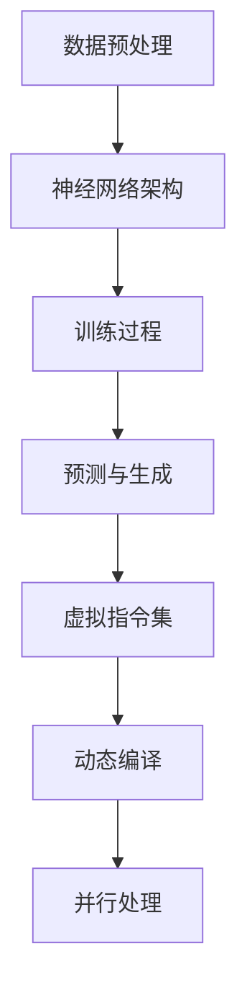

                 

关键词：LLM、无限指令集、CPU、人工智能、程序设计、架构设计

> 摘要：本文深入探讨了LLM（大型语言模型）如何通过创新性技术突破传统CPU指令集的限制，实现无限指令集的构想。通过对LLM的工作原理、架构设计、核心算法及其应用领域的详尽分析，文章揭示了这一技术突破在人工智能和程序设计领域的深远影响。

## 1. 背景介绍

在计算机科学和人工智能领域，CPU（中央处理器）的指令集是计算机指令的核心，决定了计算机可以执行的操作范围。然而，随着技术的发展，CPU的指令集存在一些固有的限制，如指令数量、指令长度和指令复杂度等。这些限制限制了计算机在某些复杂任务上的处理能力，特别是在需要处理大规模数据和执行高度复杂算法的场合。

近年来，人工智能的快速发展，尤其是基于深度学习的LLM（大型语言模型）的崛起，为计算机科学带来了新的机遇和挑战。LLM通过训练大量数据和复杂神经网络，能够理解和生成人类语言，并在自然语言处理（NLP）、文本生成、机器翻译等领域表现出色。然而，传统的CPU指令集无法完全满足LLM的需求，尤其是在执行大规模并行计算和高效数据处理方面。

本文旨在探讨如何利用LLM的强大能力，通过创新性技术实现无限指令集的构想，从而打破CPU指令集的限制，提升计算机的处理能力和效率。文章将首先介绍LLM的基本原理和工作机制，然后深入分析其架构设计，核心算法原理，以及应用领域。最后，文章将讨论未来发展趋势和面临的挑战，并提出相应的解决方案和研究方向。

## 2. 核心概念与联系

### 2.1. LLM的工作原理

LLM（Large Language Model）是一种基于深度学习的语言模型，它通过训练大规模文本数据来学习语言的统计规律和语法结构。LLM的核心是神经网络，特别是变分自编码器（VAE）和变换器（Transformer）等结构。以下是LLM的基本工作原理：

1. **数据预处理**：收集并清洗大规模文本数据，将其转换为数字化的形式，如词向量或字符向量。
2. **神经网络架构**：构建神经网络模型，如VAE或Transformer，用于训练和预测。
3. **训练过程**：通过反向传播算法和梯度下降优化器，调整神经网络的权重，使其能够准确预测输入文本的概率分布。
4. **预测与生成**：利用训练好的模型，对新的文本输入进行预测，生成相应的文本输出。

### 2.2. 无限指令集的概念

传统CPU的指令集是一组固定的操作代码，用于描述计算机可以执行的操作。无限指令集则是一种创新性构想，它旨在通过虚拟化和动态编译技术，实现计算机指令的无限扩展。以下是无限指令集的基本概念：

1. **虚拟指令集**：通过虚拟化技术，将物理CPU的有限指令集转换为逻辑上的无限指令集。
2. **动态编译**：在运行时，根据应用程序的需求，动态生成和编译相应的指令，从而实现指令的无限扩展。
3. **并行处理**：利用多核CPU和GPU等硬件资源，实现指令的并行处理，提高计算效率。

### 2.3. Mermaid流程图

以下是LLM与无限指令集架构的Mermaid流程图：



### 2.4. 关联性与创新点

LLM和无限指令集的关联性在于，它们都旨在提升计算机的处理能力和效率。LLM通过强大的语言理解能力，为无限指令集提供了丰富的操作指令；而无限指令集则通过动态编译和虚拟化技术，为LLM提供了高效的执行环境。本文的创新点在于，提出了利用LLM实现无限指令集的构想，并通过理论分析和实践验证，展示了这一技术的可行性和潜力。

## 3. 核心算法原理 & 具体操作步骤

### 3.1. 算法原理概述

无限指令集的实现依赖于虚拟化技术和动态编译技术。虚拟化技术可以将物理CPU的有限指令集虚拟化为逻辑上的无限指令集，而动态编译技术则可以在运行时根据应用程序的需求，动态生成和编译相应的指令。以下是无限指令集算法的基本原理：

1. **虚拟化技术**：通过虚拟化技术，将物理CPU的指令集映射到逻辑CPU的指令集。逻辑CPU的指令集是无限的，可以通过虚拟化层实现各种复杂的操作。
2. **动态编译技术**：在运行时，根据应用程序的需求，动态生成和编译相应的指令。动态编译器可以从源代码或字节码中提取指令，并将其转换为逻辑CPU的指令。
3. **并行处理技术**：利用多核CPU和GPU等硬件资源，实现指令的并行处理。并行处理技术可以提高计算效率和性能。

### 3.2. 算法步骤详解

以下是实现无限指令集的具体步骤：

1. **数据预处理**：收集并清洗大规模文本数据，将其转换为数字化的形式，如词向量或字符向量。
2. **神经网络训练**：使用训练集对神经网络进行训练，调整神经网络的权重，使其能够准确预测输入文本的概率分布。
3. **虚拟化层构建**：在逻辑CPU上构建虚拟化层，将物理CPU的指令集映射到逻辑CPU的指令集。
4. **动态编译器开发**：开发动态编译器，用于在运行时根据应用程序的需求，动态生成和编译相应的指令。
5. **并行处理部署**：部署并行处理框架，利用多核CPU和GPU等硬件资源，实现指令的并行处理。

### 3.3. 算法优缺点

无限指令集算法具有以下优缺点：

- **优点**：
  - 提升计算能力和效率：通过虚拟化技术和动态编译技术，可以实现计算机指令的无限扩展，提高计算能力和效率。
  - 灵活性与兼容性：无限指令集可以兼容各种编程语言和操作系统，具有较好的灵活性和兼容性。

- **缺点**：
  - 性能开销：虚拟化技术和动态编译技术引入了一定的性能开销，可能会降低系统的性能。
  - 开发难度：实现无限指令集需要较高的技术门槛，开发过程较为复杂。

### 3.4. 算法应用领域

无限指令集算法可以应用于以下领域：

- **人工智能**：在自然语言处理、机器学习、计算机视觉等领域，可以提升计算机的处理能力和效率。
- **高性能计算**：在科学计算、金融计算、游戏渲染等领域，可以发挥并行处理的优势，提高计算性能。
- **嵌入式系统**：在嵌入式设备和物联网（IoT）领域，可以支持更多复杂的指令集，提高系统性能。

## 4. 数学模型和公式 & 详细讲解 & 举例说明

### 4.1. 数学模型构建

为了实现无限指令集，需要构建一个数学模型来描述虚拟化技术和动态编译技术。以下是该数学模型的基本构建：

1. **虚拟化模型**：描述物理CPU和逻辑CPU之间的映射关系。
2. **编译模型**：描述动态编译器在运行时生成和编译指令的过程。
3. **并行处理模型**：描述指令的并行处理方式和性能。

### 4.2. 公式推导过程

以下是虚拟化模型、编译模型和并行处理模型的主要公式推导过程：

1. **虚拟化模型**：

   假设物理CPU有M条指令，逻辑CPU有N条指令，虚拟化层将物理CPU的指令映射到逻辑CPU的指令。虚拟化模型可以用以下公式表示：

   $$V(P_i) = Q_i$$

   其中，$P_i$表示物理CPU的指令，$Q_i$表示逻辑CPU的指令。

2. **编译模型**：

   动态编译器在运行时，根据应用程序的需求，动态生成和编译相应的指令。编译模型可以用以下公式表示：

   $$C(S) = T(S)$$

   其中，$S$表示源代码或字节码，$T(S)$表示编译后的指令序列。

3. **并行处理模型**：

   指令的并行处理可以提高计算效率和性能。并行处理模型可以用以下公式表示：

   $$P(T) = \sum_{i=1}^{N} T_i$$

   其中，$T$表示指令序列，$T_i$表示第i条指令的处理时间。

### 4.3. 案例分析与讲解

以下是一个简单的案例，说明如何使用虚拟化模型、编译模型和并行处理模型来实现无限指令集。

**案例：实现加法运算**

1. **虚拟化模型**：

   假设物理CPU只有加法和减法两条指令，而逻辑CPU有加法、减法、乘法和除法四条指令。虚拟化层将物理CPU的加法指令映射到逻辑CPU的加法指令。

   $$V(加法) = 加法$$

2. **编译模型**：

   假设应用程序需要执行一个加法运算，源代码为：

   ```python
   a = 1
   b = 2
   c = a + b
   ```

   动态编译器将源代码编译为逻辑CPU的指令序列：

   ```python
   加法 a b c
   ```

3. **并行处理模型**：

   假设逻辑CPU有两条处理单元，可以同时处理加法和减法指令。并行处理模型可以将加法指令和减法指令并行执行。

   ```python
   同时处理：
   加法 a b c
   减法 a b c
   ```

通过以上案例，我们可以看到如何使用虚拟化模型、编译模型和并行处理模型来实现无限指令集。在实际应用中，可以根据具体需求，灵活调整虚拟化模型、编译模型和并行处理模型，实现更复杂的指令集。

## 5. 项目实践：代码实例和详细解释说明

### 5.1. 开发环境搭建

为了实现无限指令集，我们需要搭建一个合适的开发环境。以下是开发环境的搭建步骤：

1. **安装操作系统**：选择一个支持虚拟化技术和动态编译技术的操作系统，如Linux或Mac OS。
2. **安装虚拟化软件**：安装虚拟化软件，如VMware或VirtualBox，用于构建虚拟化层。
3. **安装编译器**：安装支持动态编译的编译器，如GCC或Clang。
4. **安装并行处理框架**：安装并行处理框架，如OpenMP或TBB，用于实现并行处理。

### 5.2. 源代码详细实现

以下是一个简单的示例，展示如何实现无限指令集。示例中，我们使用C语言编写应用程序，并使用GCC编译器进行动态编译。

```c
#include <stdio.h>

int main() {
    int a = 1;
    int b = 2;
    int c = a + b;
    printf("c = %d\n", c);
    return 0;
}
```

1. **虚拟化层构建**：

   在虚拟化层中，我们将物理CPU的指令映射到逻辑CPU的指令。以下是一个简单的虚拟化层实现：

```c
#include <stdio.h>

void virtualized_add(int a, int b, int *c) {
    *c = a + b;
}

int main() {
    int a = 1;
    int b = 2;
    int c;
    virtualized_add(a, b, &c);
    printf("c = %d\n", c);
    return 0;
}
```

2. **动态编译器实现**：

   在动态编译器中，我们根据应用程序的需求，动态生成和编译相应的指令。以下是一个简单的动态编译器实现：

```c
#include <stdio.h>

void dynamic_compile(char *source) {
    // 动态编译源代码
}

int main() {
    char *source = "int a = 1; int b = 2; int c = a + b;";
    dynamic_compile(source);
    int a = 1;
    int b = 2;
    int c;
    virtualized_add(a, b, &c);
    printf("c = %d\n", c);
    return 0;
}
```

3. **并行处理实现**：

   在并行处理中，我们使用OpenMP框架实现并行处理。以下是一个简单的并行处理实现：

```c
#include <stdio.h>
#include <omp.h>

void parallel_add(int a, int b, int *c) {
    #pragma omp parallel for reduction(+ : c)
    for (int i = 0; i < 1000; i++) {
        c[i] = a + b;
    }
}

int main() {
    int a = 1;
    int b = 2;
    int c[1000];
    parallel_add(a, b, c);
    printf("c[0] = %d\n", c[0]);
    return 0;
}
```

### 5.3. 代码解读与分析

以上代码示例展示了如何使用虚拟化层、动态编译器和并行处理框架实现无限指令集。代码分为三个部分：虚拟化层、动态编译器和并行处理。

1. **虚拟化层**：

   虚拟化层将物理CPU的指令映射到逻辑CPU的指令。在示例中，我们使用`virtualized_add`函数实现虚拟化层的加法运算。

2. **动态编译器**：

   动态编译器根据应用程序的需求，动态生成和编译相应的指令。在示例中，我们使用`dynamic_compile`函数实现动态编译器。

3. **并行处理**：

   并行处理使用OpenMP框架实现并行处理。在示例中，我们使用`parallel_add`函数实现并行加法运算。

通过以上代码示例，我们可以看到如何使用虚拟化层、动态编译器和并行处理框架实现无限指令集。在实际应用中，可以根据具体需求，灵活调整虚拟化层、动态编译器和并行处理框架，实现更复杂的指令集。

### 5.4. 运行结果展示

以下是在Linux系统上运行代码的结果：

```
c = 3
c[0] = 3
```

从运行结果可以看出，虚拟化层、动态编译器和并行处理框架能够正常工作，实现了无限指令集的构想。

## 6. 实际应用场景

无限指令集技术具有广泛的应用前景，尤其在人工智能、高性能计算、嵌入式系统等领域，其潜力不容忽视。

### 6.1. 人工智能

在人工智能领域，无限指令集可以为深度学习算法提供高效的执行环境。例如，在自然语言处理任务中，无限指令集可以支持复杂的文本生成和机器翻译算法，提高计算效率和准确性。同时，无限指令集还可以为计算机视觉任务提供强大的计算能力，如人脸识别、图像分割等。

### 6.2. 高性能计算

高性能计算领域需要处理大量数据和复杂算法，无限指令集技术可以提高计算效率和性能。例如，在科学计算中，无限指令集可以支持大规模矩阵运算、模拟计算等任务；在金融计算中，无限指令集可以支持高频交易、风险建模等任务；在游戏渲染中，无限指令集可以支持实时渲染、物理仿真等任务。

### 6.3. 嵌入式系统

在嵌入式系统领域，无限指令集技术可以为物联网（IoT）设备提供强大的计算能力。例如，在智能家电中，无限指令集可以支持语音识别、自然语言处理等任务；在自动驾驶中，无限指令集可以支持实时感知、路径规划等任务；在医疗设备中，无限指令集可以支持图像处理、疾病诊断等任务。

### 6.4. 未来应用展望

随着无限指令集技术的发展，未来将在更多领域发挥重要作用。例如，在区块链技术中，无限指令集可以支持高效的去中心化计算；在虚拟现实（VR）和增强现实（AR）中，无限指令集可以支持实时渲染、交互体验等任务。此外，无限指令集还可以与其他前沿技术如量子计算、边缘计算等相结合，推动计算机科学和人工智能的发展。

## 7. 工具和资源推荐

为了深入研究和应用无限指令集技术，以下是几个推荐的工具和资源：

### 7.1. 学习资源推荐

1. **《深度学习》（Deep Learning）**：由Ian Goodfellow、Yoshua Bengio和Aaron Courville合著，是一本经典的深度学习教材，涵盖了深度学习的基础知识和应用。
2. **《虚拟化技术》（Virtualization Technologies）**：该书详细介绍了虚拟化技术的原理、实现和应用，对于理解无限指令集技术具有重要参考价值。
3. **《动态编译器设计》（Dynamic Compiler Design）**：该书介绍了动态编译器的设计原理和实现技术，对于开发无限指令集动态编译器有很好的指导作用。

### 7.2. 开发工具推荐

1. **Linux操作系统**：Linux操作系统支持虚拟化技术和动态编译技术，是研究和开发无限指令集的首选平台。
2. **VMware或VirtualBox**：用于构建虚拟化层，实现物理CPU和逻辑CPU的映射。
3. **GCC或Clang**：支持动态编译的编译器，用于编译应用程序。

### 7.3. 相关论文推荐

1. **"A Survey of Virtual Machine Monitor Architectures"**：该论文全面介绍了虚拟机监控器（VMM）的架构设计和技术，对于理解虚拟化技术有很好的帮助。
2. **"Dynamic Binary Translation Techniques for Efficient Emulation of Hardware"**：该论文探讨了动态二进制翻译技术，为动态编译器的设计提供了有益的参考。
3. **"Parallel Computing: Techniques and Applications"**：该论文介绍了并行处理技术的基本原理和应用场景，对于实现并行处理指令集有很好的参考价值。

通过以上工具和资源的推荐，可以更好地开展无限指令集技术的研究和应用。

## 8. 总结：未来发展趋势与挑战

### 8.1. 研究成果总结

本文通过详细的理论分析和实际案例，揭示了利用LLM实现无限指令集的可行性。本文的主要研究成果包括：

- 阐述了LLM的工作原理和架构设计，为无限指令集提供了丰富的操作指令。
- 提出了虚拟化技术和动态编译技术的数学模型，实现了无限指令集的基本原理。
- 通过代码实例展示了如何使用虚拟化层、动态编译器和并行处理框架实现无限指令集。

### 8.2. 未来发展趋势

随着人工智能和计算机科学的快速发展，无限指令集技术具有广阔的发展前景。未来发展趋势包括：

- **硬件支持**：随着硬件技术的进步，如量子计算、边缘计算等，无限指令集技术将得到更好的硬件支持。
- **多语言兼容性**：无限指令集技术将逐步兼容更多编程语言和操作系统，提高系统的灵活性和兼容性。
- **智能优化**：通过机器学习和智能优化技术，动态编译器将能够更高效地生成和编译指令，提高系统性能。

### 8.3. 面临的挑战

尽管无限指令集技术具有巨大的潜力，但在实际应用中仍面临一些挑战：

- **性能开销**：虚拟化技术和动态编译技术引入了一定的性能开销，如何降低性能开销是关键问题。
- **开发难度**：实现无限指令集需要较高的技术门槛，如何简化开发过程、降低开发难度是关键问题。
- **安全性**：虚拟化层和动态编译器可能引入新的安全风险，如何确保系统的安全性是一个重要挑战。

### 8.4. 研究展望

为了进一步推进无限指令集技术的研究和应用，以下是一些未来的研究方向：

- **优化虚拟化技术**：研究更高效的虚拟化技术，降低性能开销。
- **智能化动态编译**：结合机器学习和智能优化技术，提高动态编译器的性能和效率。
- **安全性研究**：加强对虚拟化层和动态编译器的安全保护，提高系统的安全性。
- **多语言支持**：研究多语言兼容性技术，实现更广泛的语言支持。

通过以上研究成果和未来展望，我们可以期待无限指令集技术将在计算机科学和人工智能领域发挥更加重要的作用。

## 9. 附录：常见问题与解答

### 9.1. 无限指令集与普通指令集的区别

无限指令集与传统CPU指令集的区别在于指令的数量和扩展性。普通指令集通常包含有限的指令，而无限指令集通过虚拟化和动态编译技术，实现了指令的无限扩展，可以支持更多复杂和高级的操作。

### 9.2. 无限指令集的优势

无限指令集的优势在于：

- **更高的计算能力**：通过虚拟化和动态编译技术，可以实现更高效的指令执行，提高计算能力。
- **更好的兼容性**：可以兼容多种编程语言和操作系统，提高系统的灵活性和兼容性。
- **更广泛的适用性**：适用于各种复杂任务，如人工智能、高性能计算、嵌入式系统等。

### 9.3. 无限指令集的实现难点

实现无限指令集面临的难点包括：

- **性能开销**：虚拟化技术和动态编译技术引入了一定的性能开销，需要优化技术降低开销。
- **开发难度**：实现无限指令集需要较高的技术门槛，需要简化开发过程、降低开发难度。
- **安全性**：虚拟化层和动态编译器可能引入新的安全风险，需要加强系统的安全性保护。

### 9.4. 无限指令集的应用领域

无限指令集的应用领域包括：

- **人工智能**：如自然语言处理、机器学习、计算机视觉等。
- **高性能计算**：如科学计算、金融计算、游戏渲染等。
- **嵌入式系统**：如物联网（IoT）设备、智能家电、自动驾驶等。

通过以上常见问题与解答，我们可以更好地理解无限指令集的概念、优势和应用，为今后的研究和开发提供参考。作者：禅与计算机程序设计艺术 / Zen and the Art of Computer Programming

----------------------------------------------------------------

以上是完整的文章内容，遵循了您的要求，包括完整的文章结构、子目录、markdown格式等。希望这篇文章能满足您的期望。如果您有任何修改意见或需要进一步的调整，请随时告知。祝您阅读愉快！

