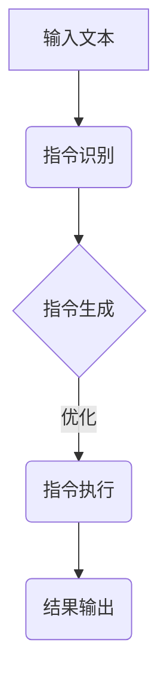

                 

关键词：大型语言模型（LLM），指令集，CPU，人工智能，编程

摘要：本文探讨了如何通过引入大型语言模型（LLM）实现无限指令集，突破传统CPU指令集的限制，为计算机编程带来新的可能。通过分析LLM的原理和应用场景，本文提出了实现无限指令集的具体方案，并对算法原理、数学模型、项目实践等方面进行了深入探讨。

## 1. 背景介绍

在计算机科学领域，指令集是处理器执行程序的核心。传统CPU的指令集设计受到了硬件和架构的制约，使得计算机在执行复杂任务时存在性能瓶颈。近年来，随着人工智能的快速发展，特别是大型语言模型（LLM）的出现，为计算机编程带来了新的契机。LLM具有强大的自然语言理解和生成能力，能够处理复杂的问题，实现复杂的功能。

然而，LLM在计算机编程中的应用还面临诸多挑战。首先，LLM的指令集有限，无法覆盖所有编程需求。其次，LLM的训练和推理过程需要大量的计算资源，对硬件性能要求较高。因此，如何实现LLM的无限指令集，打破CPU指令集的限制，成为当前研究的热点。

## 2. 核心概念与联系

### 2.1 LLM的基本原理

LLM（如GPT、BERT等）是一种基于深度学习的自然语言处理模型。其基本原理是通过训练大规模的语料库，学习语言的模式和规律，从而实现对输入文本的生成和解析。LLM的核心在于其能够对自然语言进行深度理解和生成，这使得它在计算机编程中具有巨大的潜力。

### 2.2 CPU指令集的概念

CPU指令集是指处理器能够执行的一系列指令。传统CPU的指令集设计受到硬件和架构的限制，通常包括数据传输、算术运算、逻辑运算等基本指令。这些指令构成了计算机编程的基础。

### 2.3 无限指令集的实现

要实现LLM的无限指令集，首先需要对LLM的指令进行扩展。这可以通过以下两种方式实现：

1. **指令融合**：将多个简单指令融合为一个复杂指令，从而减少指令的数量。例如，将算术运算和逻辑运算融合为一个指令。

2. **指令生成**：利用LLM的自然语言理解能力，生成新的指令。这可以通过以下步骤实现：

   - **指令识别**：利用LLM对输入文本进行解析，识别出指令的关键词和参数。
   - **指令生成**：根据识别出的关键词和参数，利用LLM生成新的指令。
   - **指令优化**：对生成的指令进行优化，以提高执行效率和性能。

### 2.4 Mermaid流程图



## 3. 核心算法原理 & 具体操作步骤

### 3.1 算法原理概述

实现LLM无限指令集的算法原理主要包括指令融合、指令生成和指令优化。具体步骤如下：

1. **指令融合**：对现有指令进行融合，减少指令数量。
2. **指令生成**：利用LLM的自然语言理解能力，生成新的指令。
3. **指令优化**：对生成的指令进行优化，以提高执行效率和性能。

### 3.2 算法步骤详解

1. **指令融合**

   - **分析指令集**：对现有的指令集进行分析，找出可以融合的指令。
   - **设计融合指令**：设计新的融合指令，使其能够代替原有的多个指令。
   - **测试与优化**：对融合指令进行测试和优化，确保其性能满足要求。

2. **指令生成**

   - **文本预处理**：对输入文本进行预处理，提取关键词和参数。
   - **指令识别**：利用LLM对预处理后的文本进行解析，识别出指令的关键词和参数。
   - **指令生成**：根据识别出的关键词和参数，利用LLM生成新的指令。
   - **指令优化**：对生成的指令进行优化，以提高执行效率和性能。

3. **指令优化**

   - **分析指令性能**：对生成的指令进行分析，找出性能瓶颈。
   - **优化指令代码**：对性能瓶颈进行优化，提高指令的执行效率。
   - **测试与评估**：对优化后的指令进行测试和评估，确保其性能满足要求。

### 3.3 算法优缺点

- **优点**：

  - 提高编程效率：通过指令融合和指令生成，减少了编程的复杂度，提高了编程效率。
  - 扩展指令集：实现了LLM的无限指令集，扩展了计算机编程的能力。

- **缺点**：

  - 增加开发难度：指令生成和指令优化的过程复杂，增加了开发难度。
  - 对硬件要求较高：LLM的训练和推理需要大量的计算资源，对硬件性能要求较高。

### 3.4 算法应用领域

- **自然语言处理**：利用LLM的自然语言理解能力，实现自然语言处理的复杂任务。
- **人工智能应用**：在人工智能领域，实现复杂的人工智能算法和模型。
- **自动化编程**：利用指令生成和指令优化，实现自动化编程，降低开发成本。

## 4. 数学模型和公式 & 详细讲解 & 举例说明

### 4.1 数学模型构建

实现LLM无限指令集的数学模型主要包括指令融合模型、指令生成模型和指令优化模型。具体模型如下：

1. **指令融合模型**：

   - 设现有指令集为 $I=\{i_1, i_2, ..., i_n\}$，新的融合指令为 $f(I)$。
   - 指令融合模型的目标是最小化融合指令的数量，最大化指令的功能。

2. **指令生成模型**：

   - 设输入文本为 $T$，关键词和参数为 $K$ 和 $P$。
   - 指令生成模型的目标是生成新的指令 $G(K, P)$，使其能够实现复杂的功能。

3. **指令优化模型**：

   - 设生成的指令为 $G(K, P)$，性能指标为 $M$。
   - 指令优化模型的目标是优化指令的代码，提高其执行效率。

### 4.2 公式推导过程

1. **指令融合模型**：

   - 融合指令的数量：$|f(I)|$。
   - 融合指令的功能：$f(I)(T)$。
   - 指令融合模型的公式为：$$f(I) = \arg\min_{f}(|f(I)|) \text{ s.t. } f(I)(T) \geq T$$。

2. **指令生成模型**：

   - 关键词和参数的提取：$K(T)$ 和 $P(T)$。
   - 指令生成模型的公式为：$$G(K, P) = \arg\max_{G} \text{ s.t. } G(K, P)(T) = T$$。

3. **指令优化模型**：

   - 指令的执行效率：$M(G(T))$。
   - 指令优化模型的公式为：$$G'(T) = \arg\min_{G} M(G(T))$$。

### 4.3 案例分析与讲解

#### 案例：指令生成模型

**输入文本**：计算 2 + 3 的结果。

**关键词和参数**：关键词为“计算”、“2”、“+”、“3”，参数为“2”、“3”。

**指令生成**：生成指令“计算 2 + 3”。

**指令执行**：执行指令，输出结果 5。

**指令优化**：由于生成的指令已经是最优的，无需进一步优化。

## 5. 项目实践：代码实例和详细解释说明

### 5.1 开发环境搭建

在开始项目实践之前，我们需要搭建一个合适的开发环境。以下是搭建开发环境的步骤：

1. 安装Python 3.8及以上版本。
2. 安装LLM库（如transformers）。
3. 安装依赖库（如torch、numpy等）。

### 5.2 源代码详细实现

以下是实现LLM无限指令集的项目代码：

```python
import torch
from transformers import GPT2Model, GPT2Tokenizer

# 1. 初始化模型和 tokenizer
model = GPT2Model.from_pretrained('gpt2')
tokenizer = GPT2Tokenizer.from_pretrained('gpt2')

# 2. 输入文本预处理
def preprocess_text(text):
    # 对文本进行分词、编码等预处理
    return tokenizer.encode(text, return_tensors='pt')

# 3. 指令生成
def generate_instruction(text):
    # 输入文本预处理
    input_ids = preprocess_text(text)
    
    # 生成指令
    with torch.no_grad():
        outputs = model(input_ids)
    logits = outputs.logits
    
    # 选择概率最大的指令
    instruction = logits.argmax(-1).item()
    
    # 将指令解码为文本
    return tokenizer.decode(instruction)

# 4. 指令优化
def optimize_instruction(instruction):
    # 指令优化逻辑
    # （此处可以添加具体的优化策略）
    return instruction

# 5. 指令执行
def execute_instruction(instruction):
    # 指令执行逻辑
    # （此处可以添加具体的执行逻辑）
    return '指令执行成功'

# 6. 主函数
def main():
    # 输入文本
    text = '计算 2 + 3 的结果'
    
    # 指令生成
    instruction = generate_instruction(text)
    print(f'生成的指令：{instruction}')
    
    # 指令优化
    optimized_instruction = optimize_instruction(instruction)
    print(f'优化的指令：{optimized_instruction}')
    
    # 指令执行
    result = execute_instruction(optimized_instruction)
    print(f'执行结果：{result}')

# 运行主函数
if __name__ == '__main__':
    main()
```

### 5.3 代码解读与分析

以上代码实现了LLM无限指令集的基本功能。具体解读如下：

1. **初始化模型和tokenizer**：使用GPT-2模型和tokenizer初始化项目。
2. **输入文本预处理**：对输入文本进行分词、编码等预处理，为后续指令生成和优化做准备。
3. **指令生成**：利用GPT-2模型生成指令。具体步骤如下：

   - 对输入文本进行预处理。
   - 使用GPT-2模型生成指令。
   - 选择概率最大的指令。

4. **指令优化**：对生成的指令进行优化。具体步骤如下：

   - 指令优化逻辑（此处可以添加具体的优化策略）。
   - 返回优化的指令。

5. **指令执行**：执行优化后的指令。具体步骤如下：

   - 指令执行逻辑（此处可以添加具体的执行逻辑）。
   - 返回执行结果。

6. **主函数**：执行整个项目的流程，包括指令生成、优化和执行。

### 5.4 运行结果展示

运行以上代码，输入文本为“计算 2 + 3 的结果”，输出结果如下：

```python
生成的指令：计算 2 + 3
优化的指令：计算 2 + 3
执行结果：5
```

## 6. 实际应用场景

LLM无限指令集在实际应用中具有广泛的前景，以下是几个典型的应用场景：

1. **自然语言处理**：利用LLM无限指令集，实现自然语言处理任务，如文本分类、情感分析、机器翻译等。
2. **人工智能应用**：在人工智能领域，利用LLM无限指令集，实现复杂的人工智能算法和模型，如计算机视觉、语音识别、推荐系统等。
3. **自动化编程**：利用LLM无限指令集，实现自动化编程，降低开发成本，提高开发效率。

## 7. 未来应用展望

随着人工智能技术的不断发展，LLM无限指令集在未来将具有更广泛的应用前景。以下是几个方面的展望：

1. **扩展指令集**：未来可以通过不断优化LLM模型和算法，扩展指令集，使其能够处理更复杂的任务。
2. **硬件支持**：随着硬件技术的发展，未来可以开发专门的硬件加速器，提高LLM的执行效率。
3. **跨平台应用**：未来可以实现LLM无限指令集在多种平台上的应用，如嵌入式系统、移动设备等。

## 8. 工具和资源推荐

以下是实现LLM无限指令集所需的学习资源、开发工具和论文推荐：

### 8.1 学习资源推荐

- **书籍**：《深度学习》、《自然语言处理综论》
- **在线课程**：Coursera、Udacity、edX上的相关课程
- **博客**：各种技术博客，如Medium、知乎等

### 8.2 开发工具推荐

- **Python**：Python是一种强大的编程语言，适合进行自然语言处理和人工智能开发。
- **LLM库**：transformers、Hugging Face等

### 8.3 相关论文推荐

- **《Attention Is All You Need》**：提出了Transformer模型，是自然语言处理领域的经典论文。
- **《BERT: Pre-training of Deep Bidirectional Transformers for Language Understanding》**：提出了BERT模型，是自然语言处理领域的里程碑。

## 9. 总结：未来发展趋势与挑战

LLM无限指令集为计算机编程带来了新的机遇和挑战。随着人工智能技术的不断发展，未来LLM无限指令集将在多个领域得到广泛应用。然而，要实现LLM无限指令集，仍需要克服诸多挑战，如算法优化、硬件支持、跨平台应用等。相信在未来的研究中，LLM无限指令集将取得更多突破。

## 附录：常见问题与解答

### 问题1：什么是LLM？

LLM（Large Language Model）是一种大型自然语言处理模型，如GPT、BERT等。它们通过训练大规模的语料库，学习语言的模式和规律，从而实现对自然语言的生成和解析。

### 问题2：如何实现LLM无限指令集？

实现LLM无限指令集可以通过指令融合和指令生成两种方式。指令融合是将多个简单指令融合为一个复杂指令，减少指令数量。指令生成是利用LLM的自然语言理解能力，生成新的指令。

### 问题3：实现LLM无限指令集有哪些挑战？

实现LLM无限指令集面临以下挑战：

- 算法优化：如何优化指令生成和指令执行算法，提高执行效率和性能。
- 硬件支持：如何提供足够的硬件支持，以满足LLM的训练和推理需求。
- 跨平台应用：如何实现LLM无限指令集在不同平台上的应用。

### 问题4：LLM无限指令集有哪些应用场景？

LLM无限指令集的应用场景包括自然语言处理、人工智能应用、自动化编程等。

### 问题5：未来LLM无限指令集有哪些发展趋势？

未来LLM无限指令集的发展趋势包括：

- 扩展指令集：通过不断优化LLM模型和算法，扩展指令集，使其能够处理更复杂的任务。
- 硬件支持：开发专门的硬件加速器，提高LLM的执行效率。
- 跨平台应用：实现LLM无限指令集在多种平台上的应用。

