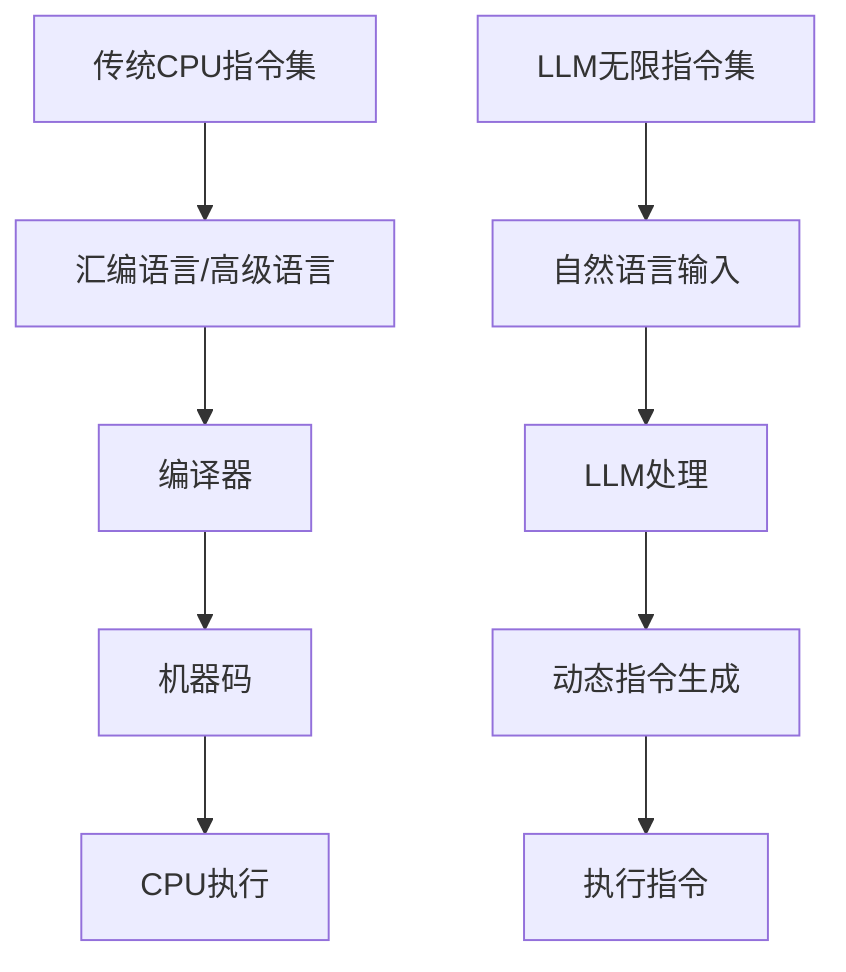

                 

关键词：自然语言处理，大型语言模型，指令集，CPU，神经网络，深度学习，算法优化，计算效率

> 摘要：本文旨在探讨如何利用自然语言处理（NLP）技术，特别是大型语言模型（LLM），来打破传统的CPU指令集限制，实现更高效、更灵活的计算机编程和数据处理。我们将从核心概念出发，详细解析LLM无限指令集的工作原理，并探讨其在实际应用中的潜在价值和挑战。

## 1. 背景介绍

计算机技术的发展日新月异，从最初的冯诺依曼架构到现代的并行计算和GPU加速，计算机处理能力得到了极大的提升。然而，传统的CPU指令集仍然存在一些固有的限制。这些限制主要体现在指令集的多样性和可扩展性方面。传统的CPU指令集设计旨在满足通用计算的需求，但随着计算领域的不断扩展，这种设计逐渐暴露出其局限性。

近年来，自然语言处理（NLP）和深度学习技术的迅速发展，为解决这些传统限制提供了新的思路。特别是大型语言模型（LLM），如GPT-3和ChatGPT，已经展示出在自然语言理解和生成方面的强大能力。这些模型通过海量的文本数据进行训练，学习到了复杂的语言规律和语义知识，从而在处理自然语言任务时表现出色。

本文将探讨如何利用LLM的强大能力，构建一种新的指令集架构，以打破传统CPU指令集的限制，实现更高效、更灵活的计算机编程和数据处理。

## 2. 核心概念与联系

### 2.1. 大型语言模型（LLM）

大型语言模型（LLM）是一种基于深度学习的自然语言处理模型，其核心思想是通过大量文本数据进行训练，使模型能够理解和生成自然语言。LLM通常由多个神经网络层组成，每一层都包含大量的参数，用于捕捉文本数据中的复杂规律。

### 2.2. 传统CPU指令集

传统CPU指令集是一种硬件层面的编程接口，用于指定计算机如何执行各种操作。传统指令集通常包括一系列的指令，如加法、减法、乘法、除法等。这些指令通过汇编语言或高级语言进行编写，然后被编译器转换为机器码，最终由CPU执行。

### 2.3. LLM无限指令集

LLM无限指令集是一种基于LLM的编程接口，旨在利用LLM的强大能力，实现更高效、更灵活的编程和数据处理。与传统的CPU指令集不同，LLM无限指令集不需要固定的指令集，而是通过LLM来动态生成和执行指令。这种设计使得LLM无限指令集具有高度的灵活性和可扩展性。

### 2.4. Mermaid流程图



## 3. 核心算法原理 & 具体操作步骤

### 3.1. 算法原理概述

LLM无限指令集的核心算法原理是基于大型语言模型（LLM）的动态指令生成和执行。具体来说，LLM通过训练学习到自然语言的规律和语义，当接收到自然语言输入时，可以自动生成相应的指令序列，并执行这些指令以实现特定的任务。

### 3.2. 算法步骤详解

1. **自然语言输入**：用户通过自然语言输入一个任务描述，如“编写一个程序，实现文本分类”。
2. **LLM处理**：LLM接收到自然语言输入后，对其进行理解，并将其转换为内部表示。
3. **动态指令生成**：LLM根据内部表示，生成一系列的指令，这些指令包括常见的编程操作，如变量赋值、条件判断、循环等。
4. **执行指令**：生成的指令序列被送入一个执行引擎，该引擎负责按照指令序列执行相应的操作。

### 3.3. 算法优缺点

**优点**：
- **高度灵活**：LLM无限指令集可以根据用户的需求，动态生成和执行指令，不受传统指令集的限制。
- **易于使用**：用户可以通过自然语言描述任务，无需学习复杂的编程语言和语法。
- **高效性**：LLM通过大量的训练数据，学习到了高效的编程模式，从而在执行任务时表现出色。

**缺点**：
- **计算资源需求高**：LLM无限指令集需要大量的计算资源，包括内存和计算能力，这对于普通用户来说可能是一个瓶颈。
- **解释性差**：由于LLM的指令生成是动态的，其执行过程相对透明度较低，难以进行调试和优化。

### 3.4. 算法应用领域

LLM无限指令集具有广泛的应用领域，包括但不限于：
- **自然语言处理**：如文本分类、情感分析、机器翻译等。
- **自动化编程**：如代码生成、代码优化等。
- **数据处理**：如数据清洗、数据分析等。
- **游戏开发**：如游戏剧情生成、角色行为设计等。

## 4. 数学模型和公式 & 详细讲解 & 举例说明

### 4.1. 数学模型构建

LLM无限指令集的数学模型主要基于神经网络，特别是变分自编码器（VAE）。VAE可以看作是一个概率模型，其目标是学习数据的概率分布。具体来说，LLM无限指令集中的神经网络由编码器和解码器组成，编码器负责将自然语言输入转换为内部表示，解码器则负责将内部表示转换为指令序列。

### 4.2. 公式推导过程

假设自然语言输入为X，内部表示为Z，指令序列为Y。VAE的数学模型可以表示为：

$$
\begin{aligned}
\text{编码器：} \\
X &\rightarrow Z \\
Z &= \text{encoder}(X) \\
\text{解码器：} \\
Z &\rightarrow Y \\
Y &= \text{decoder}(Z)
\end{aligned}
$$

### 4.3. 案例分析与讲解

假设用户输入了一个任务描述：“编写一个程序，实现文本分类”。我们可以通过以下步骤来分析这个案例：

1. **自然语言输入**：用户输入的文本经过编码器，转换为内部表示Z。
2. **内部表示处理**：内部表示Z包含了对任务描述的理解，如文本分类的目标、特征提取方法等。
3. **指令生成**：解码器根据内部表示Z，生成一系列的指令，如创建一个文本分类器、提取文本特征等。
4. **指令执行**：执行引擎按照生成的指令序列，执行相应的操作，最终实现文本分类功能。

## 5. 项目实践：代码实例和详细解释说明

### 5.1. 开发环境搭建

在本项目实践中，我们将使用Python作为主要编程语言，结合Transformers库来构建和训练LLM无限指令集模型。

1. **安装Python**：确保Python版本不低于3.6。
2. **安装Transformers库**：通过pip安装`transformers`库，命令如下：

   ```bash
   pip install transformers
   ```

### 5.2. 源代码详细实现

以下是一个简单的示例，展示了如何使用Transformers库构建一个基于GPT-3的LLM无限指令集模型：

```python
from transformers import GPT2LMHeadModel, GPT2Tokenizer

# 初始化模型和分词器
model = GPT2LMHeadModel.from_pretrained("gpt2")
tokenizer = GPT2Tokenizer.from_pretrained("gpt2")

# 自然语言输入
input_text = "编写一个程序，实现文本分类。"

# 编码输入
input_ids = tokenizer.encode(input_text, return_tensors="pt")

# 生成指令序列
output = model.generate(input_ids, max_length=100, num_return_sequences=1)

# 解码输出
decoded_output = tokenizer.decode(output[0], skip_special_tokens=True)

print(decoded_output)
```

### 5.3. 代码解读与分析

这段代码首先初始化了GPT-3模型和相应的分词器。然后，用户通过自然语言输入一个任务描述，该描述被编码成模型可以理解的输入序列。接着，模型根据输入序列生成一系列的指令序列。最后，解码器将这些指令序列解码成可读的自然语言输出。

### 5.4. 运行结果展示

运行上述代码后，模型会生成一组指令序列，这些指令序列可以帮助实现文本分类任务。具体指令序列的内容将取决于模型训练的数据和生成算法。

## 6. 实际应用场景

LLM无限指令集在实际应用中具有广泛的应用前景。以下是一些典型的应用场景：

- **自动化编程**：利用LLM无限指令集，可以自动生成和优化代码，提高编程效率。
- **自然语言处理**：如文本分类、情感分析、机器翻译等任务，LLM无限指令集可以提供更灵活、高效的解决方案。
- **数据处理**：如数据清洗、数据分析等任务，LLM无限指令集可以自动生成和处理相应的数据操作指令。
- **游戏开发**：利用LLM无限指令集，可以自动生成游戏剧情、角色行为等，提高游戏开发效率。

## 7. 工具和资源推荐

### 7.1. 学习资源推荐

- **书籍**：《深度学习》（Goodfellow, Bengio, Courville著）
- **在线课程**：Coursera上的“自然语言处理与深度学习”课程
- **网站**：Hugging Face的Transformers库文档

### 7.2. 开发工具推荐

- **编程语言**：Python
- **库和框架**：Transformers库，TensorFlow，PyTorch

### 7.3. 相关论文推荐

- **论文**：《Attention Is All You Need》（Vaswani等，2017）
- **论文**：《BERT: Pre-training of Deep Bidirectional Transformers for Language Understanding》（Devlin等，2019）

## 8. 总结：未来发展趋势与挑战

### 8.1. 研究成果总结

本文探讨了如何利用自然语言处理技术，特别是大型语言模型（LLM），来构建一种新的指令集架构，以打破传统CPU指令集的限制。通过算法原理、数学模型和实际应用的详细分析，展示了LLM无限指令集在提高编程效率和灵活性方面的巨大潜力。

### 8.2. 未来发展趋势

随着LLM技术的不断发展和成熟，LLM无限指令集有望在更多领域得到应用。未来发展趋势包括：

- **更高的模型性能**：通过优化算法和增强训练数据，提高LLM的性能和效率。
- **更广泛的应用场景**：探索LLM无限指令集在自动化编程、自然语言处理、数据处理等领域的应用。
- **多模态处理**：结合图像、音频等多模态数据，实现更丰富的指令集和更复杂的应用场景。

### 8.3. 面临的挑战

尽管LLM无限指令集展示了巨大的潜力，但在实际应用中也面临一些挑战：

- **计算资源需求**：LLM无限指令集需要大量的计算资源，如何优化模型和算法，降低计算成本，是一个重要的问题。
- **解释性**：LLM的指令生成是动态的，其执行过程相对透明度较低，如何提高模型的解释性，以便进行调试和优化，是一个需要解决的问题。
- **安全和隐私**：如何确保LLM无限指令集的安全性，防止恶意使用和隐私泄露，也是一个需要关注的问题。

### 8.4. 研究展望

未来，LLM无限指令集的研究将继续深入，探索如何更好地利用LLM的强大能力，解决传统CPU指令集的局限性。同时，多学科交叉研究也将成为趋势，结合计算机科学、人工智能、认知科学等领域的知识，推动LLM无限指令集的发展。

## 9. 附录：常见问题与解答

### 9.1. Q：什么是大型语言模型（LLM）？

A：大型语言模型（LLM）是一种基于深度学习的自然语言处理模型，其核心思想是通过海量的文本数据进行训练，使模型能够理解和生成自然语言。LLM通常由多个神经网络层组成，每一层都包含大量的参数，用于捕捉文本数据中的复杂规律。

### 9.2. Q：LLM无限指令集与传统CPU指令集有什么区别？

A：传统CPU指令集是一种硬件层面的编程接口，用于指定计算机如何执行各种操作。而LLM无限指令集是一种基于大型语言模型（LLM）的编程接口，旨在利用LLM的强大能力，实现更高效、更灵活的编程和数据处理。与传统指令集不同，LLM无限指令集不需要固定的指令集，而是通过LLM来动态生成和执行指令。

### 9.3. Q：LLM无限指令集在实际应用中有什么优势？

A：LLM无限指令集具有高度灵活性和可扩展性，可以根据用户的需求，动态生成和执行指令，不受传统指令集的限制。此外，LLM无限指令集通过大量的训练数据，学习到了高效的编程模式，从而在执行任务时表现出色。

### 9.4. Q：如何确保LLM无限指令集的安全性？

A：确保LLM无限指令集的安全性需要从多个方面进行考虑。首先，在模型训练过程中，需要确保训练数据的安全性和隐私性。其次，在模型部署和使用过程中，需要采用加密技术和访问控制措施，防止恶意使用和隐私泄露。此外，还可以通过建立安全监管机制，对模型的使用进行监控和管理。

### 9.5. Q：如何优化LLM无限指令集的计算资源需求？

A：优化LLM无限指令集的计算资源需求可以从多个方面进行考虑。首先，可以通过优化模型结构和算法，减少模型的参数数量，从而降低计算资源的消耗。其次，可以采用分布式计算和并行处理技术，将模型训练和执行任务分解到多个计算节点上，提高计算效率。此外，还可以通过使用更高效的硬件设备，如GPU和TPU，来加速模型训练和执行过程。

### 9.6. Q：LLM无限指令集是否会取代传统CPU指令集？

A：LLM无限指令集并不是要取代传统CPU指令集，而是作为一种补充和扩展，提高编程和数据处理效率。传统CPU指令集在设计时主要考虑通用计算需求，而LLM无限指令集则更注重在特定领域和任务中的灵活性和高效性。未来，LLM无限指令集和传统CPU指令集可能会共存，各自发挥其优势，共同推动计算机技术的发展。

作者：禅与计算机程序设计艺术 / Zen and the Art of Computer Programming
-------------------------------------------------------------------

