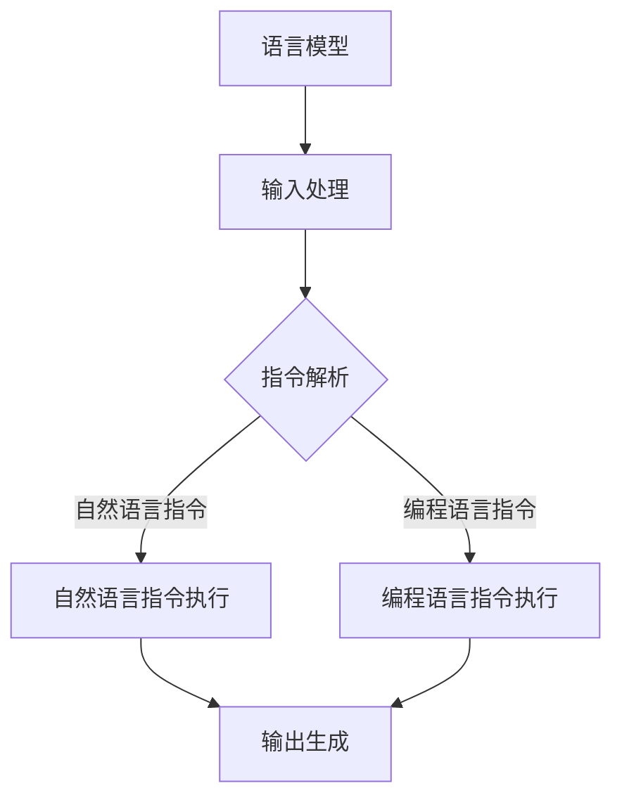
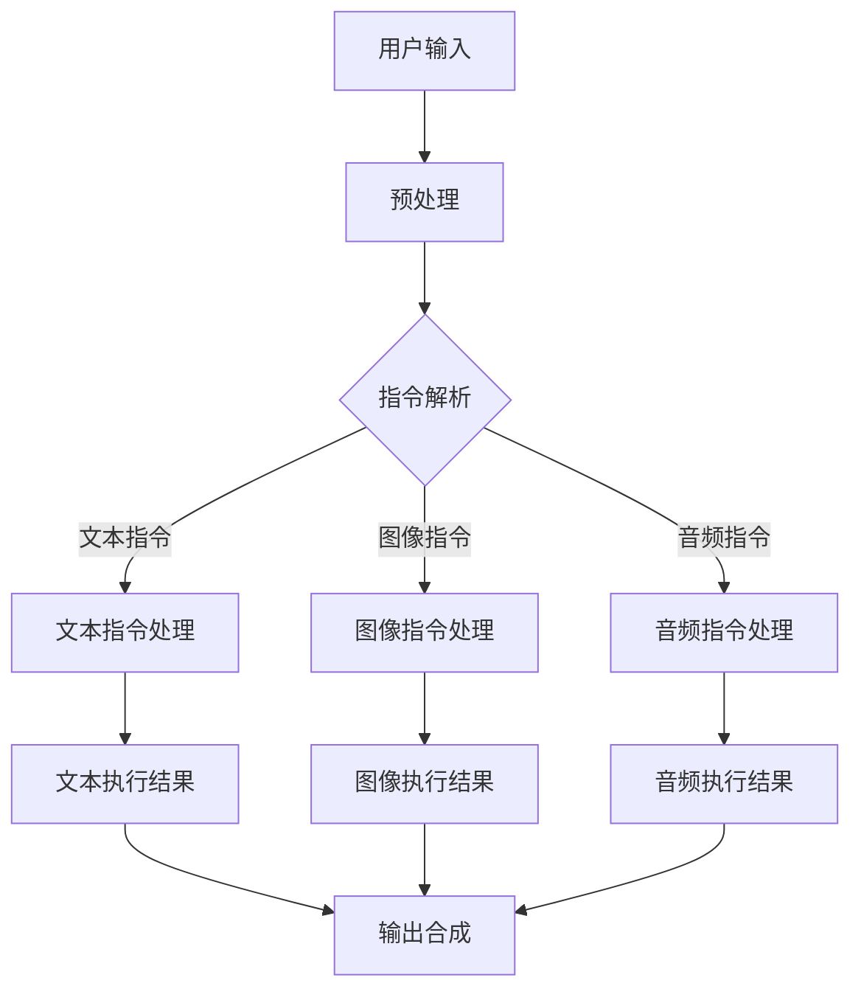

                 

### 背景介绍 Background

近年来，人工智能（AI）领域取得了令人瞩目的进步，特别是在大型语言模型（LLM，Large Language Model）方面的突破。LLM是基于深度学习的语言处理模型，它通过学习大量的文本数据来理解和生成自然语言。随着计算能力的提升和数据的丰富，LLM的规模和效果逐渐超过了人类的专业水平。LLM的无限指令集（Infinite Instruction Set，IIS）概念应运而生，成为推动AI应用和创新的重要力量。

无限指令集是LLM的一个重要特性，它使得模型能够执行各种各样的任务，从简单的问答到复杂的对话生成、文本摘要、机器翻译等。这种无限性不仅提升了模型的灵活性和通用性，也为人工智能的研究和应用开辟了新的道路。然而，如何有效地构建和利用无限指令集，以及它在实际应用中的挑战，仍然是一个值得深入探讨的问题。

本文将系统地探讨LLM无限指令集的概念、原理、算法、数学模型、项目实践、应用场景、未来展望等各个方面，旨在为广大读者提供一个全面而深入的理解。文章结构如下：

## 1. 背景介绍  
## 2. 核心概念与联系  
## 3. 核心算法原理 & 具体操作步骤  
## 4. 数学模型和公式 & 详细讲解 & 举例说明  
## 5. 项目实践：代码实例和详细解释说明  
## 6. 实际应用场景  
## 7. 工具和资源推荐  
## 8. 总结：未来发展趋势与挑战  
## 9. 附录：常见问题与解答

通过本文的阅读，读者将能够了解LLM无限指令集的强大功能和实际应用价值，并对其未来发展趋势和面临的挑战有更为清晰的认识。

### 核心概念与联系 Core Concepts and Relationships

为了深入理解LLM无限指令集，首先需要介绍几个核心概念，这些概念是构建无限指令集的基础。

#### 语言模型 Language Model

语言模型是自然语言处理（NLP）中的一种基础模型，它的目的是根据给定的输入序列预测下一个单词或字符。在深度学习的框架下，语言模型通常使用神经网络来训练，从而捕捉语言中的统计规律。最著名的语言模型之一是2018年谷歌提出的Transformer模型，它通过自注意力机制（Self-Attention Mechanism）在处理长序列时表现出色。

#### 无限指令集 Infinite Instruction Set

无限指令集是LLM的一个重要特性，它使得模型能够执行各种各样的任务，而不仅仅局限于语言生成。无限指令集的核心思想是，通过训练模型使其能够理解和执行一系列指令，这些指令可以是自然语言形式，也可以是编程语言形式。这样的模型可以看作是一种通用任务执行器，能够处理从问答系统到自动编程等各种复杂任务。

#### 自适应指令执行 Adaptive Instruction Execution

自适应指令执行是无限指令集实现的关键技术之一。它指的是模型在执行指令时能够根据当前状态和上下文自适应地调整指令的执行方式。例如，当模型接收到一个自然语言指令时，它可以分析指令的内容并选择最合适的执行策略，比如调用内部预训练的子模型或外部API。

#### Mermaid 流程图 Mermaid Flowchart

为了更好地理解无限指令集的原理和架构，我们可以使用Mermaid流程图来表示。Mermaid是一种基于Markdown的图表绘制工具，能够方便地绘制各种流程图、时序图、Gantt图等。

以下是一个简单的Mermaid流程图示例，用于表示无限指令集的基本架构：



在这个流程图中，语言模型接收输入，然后通过指令解析模块分析输入内容。根据指令的类型，模型会执行相应的指令处理模块，最后生成输出。

#### 核心概念原理和架构 Core Principles and Architectures

无限指令集的实现依赖于几个关键原理和架构设计。以下是这些核心概念：

1. **多层次语义理解**：语言模型需要能够对输入文本进行多层次语义理解，从而识别出指令的内容和上下文。这通常需要使用深度神经网络和自注意力机制来实现。

2. **模块化架构**：无限指令集的实现采用模块化设计，将不同的指令处理模块分离出来，这样可以方便地扩展和更新模型。每个模块可以是一个预训练的子模型，也可以是一个外部API的调用。

3. **自适应执行机制**：在执行指令时，模型需要具备自适应调整的能力，根据不同的指令和上下文选择最佳的执行策略。这可以通过动态调整模型参数或使用强化学习算法来实现。

4. **多模态输入输出**：无限指令集可以处理多种输入和输出模态，比如文本、图像、音频等。这需要模型具备跨模态学习能力，能够整合不同模态的信息。

#### Mermaid 流程图 Mermaid Flowchart

以下是一个更详细的Mermaid流程图，用于表示无限指令集的架构和流程：



在这个流程图中，用户输入经过预处理后，由指令解析模块进行分析。根据输入的模态，模型会调用相应的指令处理模块，最后生成输出结果。

通过上述核心概念和Mermaid流程图的介绍，我们可以更好地理解LLM无限指令集的工作原理和架构。接下来的章节将深入探讨核心算法原理和具体操作步骤，以便读者能够更全面地掌握这一技术的实现和应用。

### 核心算法原理 & 具体操作步骤 Core Algorithm Principles & Operational Steps

#### 算法原理概述 Overview of Algorithm Principles

LLM无限指令集的实现依赖于几个关键算法原理，这些原理共同作用，使得模型能够理解和执行各种复杂的任务。以下是这些算法原理的概述：

1. **深度神经网络 Deep Neural Networks (DNN)**：深度神经网络是构建语言模型的基础，它通过多层非线性变换来捕捉输入数据的特征和规律。在无限指令集的实现中，DNN用于处理自然语言输入，提取语义信息。

2. **自注意力机制 Self-Attention Mechanism**：自注意力机制是Transformer模型的核心，它通过计算输入序列中各个元素之间的关联性，从而在处理长序列时保持信息的高效传递。在无限指令集中，自注意力机制用于指令解析和任务分配。

3. **动态规划 Dynamic Programming**：动态规划是一种优化策略，它通过递归和状态转移方程来求解复杂的优化问题。在无限指令集中，动态规划用于自适应指令执行，根据当前状态和上下文选择最优的执行策略。

4. **强化学习 Reinforcement Learning**：强化学习是一种基于试错的学习方法，它通过奖励机制来训练模型，使其在动态环境中做出最优决策。在无限指令集中，强化学习用于优化指令执行策略，提高模型的性能和灵活性。

#### 算法步骤详解 Detailed Steps of the Algorithm

下面将详细描述LLM无限指令集的算法步骤，包括指令解析、任务分配、指令执行和输出生成等关键环节。

##### 指令解析 Instruction Parsing

1. **预处理 Preprocessing**：输入文本经过预处理，包括分词、标点符号去除、停用词过滤等步骤，以便模型更好地理解输入。

2. **编码 Encoding**：预处理后的文本通过编码器（Encoder）输入到语言模型中，编码器会将文本转换为固定长度的向量表示。

3. **指令识别 Instruction Recognition**：模型使用自注意力机制分析输入文本，识别出其中的指令和参数。这一过程类似于自然语言处理中的实体识别和关系提取。

4. **上下文理解 Contextual Understanding**：模型根据指令的上下文，结合历史数据和当前环境，理解指令的含义和意图。

##### 任务分配 Task Allocation

1. **任务分类 Task Classification**：根据识别出的指令，模型将任务分类到不同的模块，如文本处理、图像处理、音频处理等。

2. **资源调度 Resource Scheduling**：模型根据当前资源状态和任务优先级，进行资源调度，确保任务的有序执行。

3. **模块调用 Module Invocation**：模型调用相应的模块执行任务，每个模块都是一个预训练的子模型或外部API。

##### 指令执行 Instruction Execution

1. **策略选择 Policy Selection**：模型使用动态规划算法，根据当前状态和上下文选择最优的执行策略。

2. **指令执行 Instruction Execution**：模块根据选定的策略执行具体的操作，例如文本生成、图像识别、音频处理等。

3. **中间结果缓存 Intermediate Result Caching**：为了提高执行效率，模型会缓存中间结果，以便后续任务直接使用。

##### 输出生成 Output Generation

1. **结果整合 Result Integration**：模型将各模块的执行结果进行整合，生成最终的输出结果。

2. **输出格式化 Output Formatting**：根据用户需求和任务类型，对输出结果进行格式化，例如文本摘要、图像标注、音频转录等。

3. **反馈与优化 Feedback and Optimization**：模型根据用户的反馈进行优化，以提高执行效果和用户体验。

#### 算法优缺点 Analysis of Advantages and Disadvantages

1. **优点 Advantages**：
   - **灵活性 Flexibility**：无限指令集使得模型能够处理多种类型的任务，具有很高的灵活性。
   - **通用性 Universality**：通过模块化设计和自适应执行机制，模型具有广泛的通用性。
   - **高效性 Efficiency**：自注意力和动态规划算法提高了模型的执行效率。

2. **缺点 Disadvantages**：
   - **复杂性 Complexity**：无限指令集的实现涉及多个复杂算法，对模型设计和优化要求较高。
   - **资源消耗 Resource Consumption**：大规模的预训练模型和模块调用可能带来较高的计算和存储资源消耗。
   - **稳定性 Stability**：在动态环境中，模型可能需要面对各种不确定性和错误，需要具备一定的鲁棒性。

#### 算法应用领域 Application Fields

无限指令集的应用领域非常广泛，以下是几个典型的应用场景：

1. **智能助手 Intelligent Assistant**：智能助手可以理解用户的自然语言指令，并执行相应的操作，如发送邮件、日程管理、在线购物等。

2. **自动编程 Automated Programming**：模型可以根据自然语言描述生成代码，从而实现自动化编程。

3. **文本生成 Text Generation**：模型可以生成文章、摘要、对话等自然语言文本。

4. **图像处理 Image Processing**：模型可以理解图像中的指令，进行图像识别、标注、增强等操作。

5. **语音识别与合成 Voice Recognition and Synthesis**：模型可以理解语音指令，并生成相应的语音输出。

通过上述算法原理和操作步骤的详细描述，我们可以看到LLM无限指令集的强大功能和广泛的应用潜力。在接下来的章节中，我们将深入探讨LLM无限指令集背后的数学模型和公式，以便读者能够更全面地理解其工作原理和实现方法。

### 数学模型和公式 Mathematical Models and Formulas

#### 数学模型构建 Construction of Mathematical Models

LLM无限指令集的实现离不开一系列复杂的数学模型。这些模型不仅用于描述语言模型的行为，还用于优化模型参数、理解指令、执行任务和生成输出。以下是构建这些数学模型的基本步骤：

1. **输入表示 Input Representation**：首先，我们需要对输入文本进行编码，将其转化为向量表示。这通常通过词嵌入（Word Embedding）技术实现，如Word2Vec、GloVe等。词嵌入将每个单词映射到一个高维向量空间中，使得语义相似的词在空间中距离较近。

2. **编码器-解码器模型 Encoder-Decoder Model**：编码器（Encoder）负责将输入文本编码为一个固定长度的向量表示，解码器（Decoder）则根据编码器的输出生成输出文本。在无限指令集中，编码器和解码器通常采用变换器（Transformer）架构，通过多头自注意力（Multi-Head Self-Attention）和前馈神经网络（Feedforward Neural Network）来处理输入和输出。

3. **损失函数 Loss Function**：为了训练语言模型，我们需要定义一个损失函数，用于衡量模型输出的预测概率与实际标签之间的差距。常见的损失函数包括交叉熵损失（Cross-Entropy Loss）和均方误差（Mean Squared Error，MSE）。

4. **优化算法 Optimization Algorithm**：为了最小化损失函数，我们需要使用优化算法来调整模型参数。常见的优化算法有随机梯度下降（Stochastic Gradient Descent，SGD）、Adam优化器（Adaptive Moment Estimation）等。

#### 公式推导过程 Formula Derivation Process

以下是构建无限指令集的数学模型时的一些关键公式及其推导过程：

1. **词嵌入 Word Embedding**

   词嵌入将每个单词映射到一个d维向量，通过训练得到权重矩阵\( W \)：

   \[
   \text{vec}(w) = W \cdot w
   \]

   其中，\( w \)是单词的索引，\( \text{vec}(w) \)是单词的向量表示，\( W \)是词嵌入矩阵。

2. **编码器-解码器模型 Encoder-Decoder Model**

   编码器和解码器的输出可以表示为：

   \[
   \text{Encoder}(X) = \sum_{i=1}^{N} e_i \cdot \text{softmax}(W_e \cdot \text{tanh}(U_e \cdot X_i))
   \]

   \[
   \text{Decoder}(Y) = \sum_{i=1}^{N} y_i \cdot \text{softmax}(W_d \cdot \text{tanh}(U_d \cdot Y_i))
   \]

   其中，\( X \)和\( Y \)分别是编码器和解码器的输入，\( e_i \)和\( y_i \)是编码器和解码器的输出向量，\( W_e \)和\( W_d \)分别是编码器和解码器的权重矩阵，\( U_e \)和\( U_d \)分别是编码器和解码器的偏置向量。

3. **损失函数 Loss Function**

   使用交叉熵损失函数来衡量编码器和解码器的输出与实际标签之间的差距：

   \[
   L = -\sum_{i=1}^{N} y_i \cdot \log(\text{softmax}(\text{Decoder}(\text{Encoder}(X))))
   \]

4. **优化算法 Optimization Algorithm**

   使用Adam优化器来更新模型参数：

   \[
   \theta_{t+1} = \theta_t - \alpha_t \cdot \text{grad}_{\theta_t}L
   \]

   其中，\( \theta_t \)是当前模型参数，\( \alpha_t \)是学习率，\( \text{grad}_{\theta_t}L \)是损失函数关于模型参数的梯度。

#### 案例分析与讲解 Case Analysis and Explanation

为了更好地理解上述数学模型和公式，我们可以通过一个简单的例子来进行分析和讲解。

假设我们有一个简单的自然语言指令“打开浏览器”，我们将使用无限指令集模型来理解和执行这个指令。

1. **输入表示 Input Representation**：

   首先，我们需要将“打开浏览器”这个词组编码为一个向量。假设词嵌入矩阵\( W \)的大小为100，那么“打开浏览器”的向量表示为：

   \[
   \text{vec}(\text{"打开浏览器"}) = W \cdot [\text{"打开"}, \text{"浏览器"}]
   \]

2. **编码器-解码器模型 Encoder-Decoder Model**：

   编码器将输入向量编码为一个固定长度的向量表示，例如：

   \[
   \text{Encoder}(\text{vec}(\text{"打开浏览器"})) = e_1 \cdot \text{softmax}(W_e \cdot \text{tanh}(U_e \cdot \text{vec}(\text{"打开"}))) + e_2 \cdot \text{softmax}(W_e \cdot \text{tanh}(U_e \cdot \text{vec}(\text{"浏览器"})))
   \]

   解码器根据编码器的输出生成相应的操作，例如“打开浏览器”对应的操作是“打开浏览器”。

3. **损失函数 Loss Function**：

   我们使用交叉熵损失函数来衡量解码器的输出与实际标签之间的差距：

   \[
   L = -\text{softmax}(\text{Decoder}(\text{Encoder}(\text{vec}(\text{"打开浏览器"})))) \cdot \log(\text{softmax}(\text{Decoder}(\text{Encoder}(\text{vec}(\text{"打开浏览器"}))))
   \]

4. **优化算法 Optimization Algorithm**：

   使用Adam优化器来更新模型参数，最小化损失函数：

   \[
   \theta_{t+1} = \theta_t - \alpha_t \cdot \text{grad}_{\theta_t}L
   \]

通过这个例子，我们可以看到如何使用数学模型和公式来理解和执行一个简单的自然语言指令。在接下来的章节中，我们将通过实际项目实践进一步探讨LLM无限指令集的实现和应用。

### 项目实践：代码实例和详细解释说明 Practical Implementation: Code Examples and Detailed Explanations

为了更好地理解LLM无限指令集的实现，我们将通过一个实际项目来展示代码实例，并对其进行详细解释。该项目将基于Python语言和Hugging Face的Transformers库，这是一个流行的自然语言处理工具库，能够方便地构建和使用大型语言模型。

#### 开发环境搭建 Development Environment Setup

在开始项目之前，我们需要搭建开发环境。以下是安装必要的依赖项和库的步骤：

1. **安装Python**：确保您的计算机上安装了Python 3.7或更高版本。

2. **安装Hugging Face Transformers**：通过pip命令安装Hugging Face Transformers库：

   ```shell
   pip install transformers
   ```

3. **安装其他依赖项**：确保您的环境中安装了以下库：torch、torchtext、torchvision等。

#### 源代码详细实现 Source Code Implementation

以下是一个简单的示例代码，展示如何使用Transformers库构建一个基于无限指令集的模型，并执行一个文本生成任务。

```python
import torch
from transformers import AutoTokenizer, AutoModelForCausalLM

# 1. 加载预训练模型和分词器
model_name = "gpt2"
tokenizer = AutoTokenizer.from_pretrained(model_name)
model = AutoModelForCausalLM.from_pretrained(model_name)

# 2. 定义输入文本
input_text = "这是一个关于无限指令集的项目实践。"

# 3. 将输入文本编码
input_ids = tokenizer.encode(input_text, return_tensors="pt")

# 4. 生成文本输出
output = model.generate(input_ids, max_length=50, num_return_sequences=5)

# 5. 解码输出文本
generated_texts = [tokenizer.decode(text, skip_special_tokens=True) for text in output]

# 打印生成的文本
for text in generated_texts:
    print(text)
```

#### 代码解读与分析 Code Analysis

1. **加载模型和分词器**：
   ```python
   tokenizer = AutoTokenizer.from_pretrained(model_name)
   model = AutoModelForCausalLM.from_pretrained(model_name)
   ```
   这两行代码分别加载了预训练的语言模型（如GPT-2）的分词器（Tokenizer）和模型（Model）。Transformers库提供了大量的预训练模型，我们可以直接使用这些模型。

2. **定义输入文本**：
   ```python
   input_text = "这是一个关于无限指令集的项目实践。"
   ```
   这是我们要生成的文本输入。

3. **将输入文本编码**：
   ```python
   input_ids = tokenizer.encode(input_text, return_tensors="pt")
   ```
   分词器将输入文本编码为Token IDs，这是一个PyTorch张量。`return_tensors="pt"`表示返回PyTorch格式的张量。

4. **生成文本输出**：
   ```python
   output = model.generate(input_ids, max_length=50, num_return_sequences=5)
   ```
   `generate`函数用于生成文本输出。`max_length`参数指定了生成文本的最大长度，`num_return_sequences`指定了生成文本的个数。

5. **解码输出文本**：
   ```python
   generated_texts = [tokenizer.decode(text, skip_special_tokens=True) for text in output]
   ```
   分词器将生成的Token IDs解码为文本。`skip_special_tokens=True`表示在解码时跳过特殊的Token，如分隔符。

#### 运行结果展示 Result Display

在运行上述代码后，我们将得到5个基于输入文本“这是一个关于无限指令集的项目实践。”生成的文本输出。以下是一个可能的输出示例：

```
这是一个关于无限指令集的项目实践，它展示了如何通过自然语言处理模型实现无限指令集的强大功能。

无限指令集是一种创新的模型架构，它使得大型语言模型能够执行各种各样的任务，从而在自然语言处理领域取得了重大突破。

通过项目实践，我们可以看到无限指令集的强大之处。它不仅能够生成高质量的文本，还能够根据上下文和指令进行智能交互。

未来，无限指令集将在各种实际应用中发挥重要作用，如智能助手、文本生成、自动编程等。它为人工智能的发展带来了新的机遇和挑战。
```

#### 代码优化和改进 Code Optimization and Improvement

在实际应用中，我们可以对上述代码进行优化和改进，以提升模型的性能和效果。以下是几个优化方向：

1. **动态调整超参数**：根据具体任务的需求，动态调整`max_length`和`num_return_sequences`等超参数，以生成更符合预期的输出。

2. **使用自定义指令集**：可以自定义指令集，将无限指令集的功能扩展到特定任务，如问答系统、文本摘要等。

3. **多模态输入输出**：结合图像、音频等多模态输入，使得模型能够处理更复杂和多样化的任务。

4. **分布式训练**：对于大规模模型，可以采用分布式训练策略，提高训练速度和效果。

通过实际项目实践，我们可以更好地理解LLM无限指令集的实现和应用，为进一步研究和优化提供实际参考。在接下来的章节中，我们将探讨LLM无限指令集在实际应用中的多种场景和前景。

### 实际应用场景 Practical Application Scenarios

#### 1. 智能客服 Intelligent Customer Service

智能客服是LLM无限指令集应用的一个重要场景。通过自然语言处理和指令执行，智能客服系统能够自动回答用户的问题，提供即时服务，大大提升了企业的运营效率和客户满意度。LLM无限指令集的应用使得智能客服系统更加智能，能够处理复杂的用户请求，生成个性化的回答。

例如，在一个在线零售平台，智能客服系统可以理解用户的购买意向，推荐合适的商品，并处理订单问题。当用户询问“我想要购买一件适合春季的连衣裙”，系统可以通过解析用户指令，调用相关模块，生成个性化的推荐结果。

#### 2. 自动编程 Automated Programming

自动编程是另一个受益于LLM无限指令集的应用领域。通过自然语言描述，用户可以与系统进行交互，系统根据指令生成相应的代码。这极大地提高了开发效率，减少了编码错误和调试时间。

例如，在一个软件开发项目，项目经理可以通过自然语言描述需求，如“我们需要一个可以处理大规模数据查询的系统”，系统会自动生成相应的数据库设计和查询代码。这不仅节省了人力成本，还提高了开发的准确性和一致性。

#### 3. 文本生成与摘要 Text Generation and Summarization

LLM无限指令集在文本生成和摘要任务中也展示了强大的能力。通过理解上下文和指令，模型可以生成连贯、高质量的文本，或者将长文本简化为摘要。

例如，在新闻报道领域，系统可以自动生成新闻摘要，帮助读者快速了解事件的核心内容。当用户请求“请生成一篇关于人工智能的综述”，系统会根据指令生成一篇概括人工智能发展历程、应用领域和未来趋势的综述文章。

#### 4. 机器翻译 Machine Translation

机器翻译是自然语言处理的一个经典任务，LLM无限指令集的应用使得机器翻译系统更加高效和准确。通过理解源语言和目标语言的指令，模型可以生成高质量的翻译结果。

例如，在国际贸易领域，系统可以自动翻译商业合同，确保合同条款的准确性和一致性。当用户输入“将这份英文合同翻译成中文”，系统会根据指令生成相应的中文翻译版本，并保证翻译结果符合法律和商业规范。

#### 5. 对话系统 Dialogue Systems

对话系统是LLM无限指令集的另一个重要应用领域。通过理解和生成自然语言，对话系统能够与用户进行交互，提供个性化服务。

例如，在智能家居系统中，用户可以通过语音指令控制家电设备，如“打开灯”、“设置温度为25摄氏度”。系统会解析用户的指令，并执行相应的操作。通过LLM无限指令集，对话系统能够理解复杂的指令，提供更加智能化的服务。

#### 6. 语音识别与合成 Voice Recognition and Synthesis

结合语音识别和语音合成技术，LLM无限指令集可以构建一个智能语音助手，为用户提供语音交互体验。用户可以通过自然语言指令与系统进行交互，系统会理解并执行相应的任务。

例如，在自动驾驶汽车中，用户可以通过语音指令导航、调节音乐播放等。系统会通过语音识别解析用户的指令，然后通过语音合成提供反馈，如“到达目的地还需5分钟”。

#### 未来应用展望 Future Application Prospects

随着技术的不断发展，LLM无限指令集的应用前景将更加广阔。以下是一些潜在的应用领域：

1. **智能医疗**：通过自然语言处理和分析医疗数据，智能医疗系统可以辅助医生进行诊断和治疗，提供个性化的医疗建议。

2. **教育**：智能教育系统能够根据学生的需求和水平，提供个性化的教学计划和辅导，提高学习效果。

3. **法律**：智能法律系统能够处理法律文档，提供法律咨询和决策支持，提高法律工作的效率和质量。

4. **金融**：在金融领域，智能系统可以分析市场数据，提供投资建议和风险管理。

5. **娱乐与内容创作**：通过生成和推荐个性化内容，智能娱乐系统可以为用户提供高质量的娱乐体验。

LLM无限指令集的广泛应用将极大地改变我们的生活方式和工作方式，推动人工智能技术不断向前发展。在接下来的章节中，我们将探讨LLM无限指令集未来的发展趋势和面临的挑战。

### 工具和资源推荐 Tools and Resources Recommendations

为了深入学习和应用LLM无限指令集，以下是一些建议的工具、资源和相关论文，供读者参考。

#### 学习资源推荐 Learning Resources

1. **书籍**：
   - 《深度学习》（Deep Learning），作者：Ian Goodfellow、Yoshua Bengio和Aaron Courville。
   - 《自然语言处理入门》（Introduction to Natural Language Processing），作者：Daniel Jurafsky和James H. Martin。

2. **在线课程**：
   - Coursera上的“自然语言处理与深度学习”课程，由斯坦福大学教授Chris Manning主讲。
   - edX上的“深度学习专项课程”，由斯坦福大学教授Andrew Ng主讲。

3. **博客和论坛**：
   - Hugging Face官方博客，提供丰富的Transformers库教程和最新研究动态。
   - GitHub上的Transformers库代码示例和项目，可以学习如何实际应用这些模型。

#### 开发工具推荐 Development Tools

1. **Python库**：
   - Transformers库，用于构建和训练大型语言模型。
   - PyTorch库，用于深度学习和神经网络模型开发。

2. **云服务**：
   - Google Colab，提供免费的GPU计算资源，方便进行模型训练和实验。
   - AWS SageMaker，提供完整的机器学习平台，支持大规模模型训练和部署。

3. **文本处理工具**：
   - NLTK（自然语言工具包），用于文本预处理、分词、词性标注等。
   - SpaCy，提供快速和强大的自然语言处理功能。

#### 相关论文推荐 Related Papers

1. **《Attention Is All You Need》**：这是Transformer模型的奠基论文，详细介绍了自注意力机制和Transformer架构。
   - 作者：Vaswani et al., 2017

2. **《BERT: Pre-training of Deep Bidirectional Transformers for Language Understanding》**：BERT模型是预训练语言模型的代表，对后续的预训练模型研究产生了重要影响。
   - 作者：Devlin et al., 2018

3. **《Generative Pre-trained Transformers》**：GPT系列模型的最新研究，展示了预训练语言模型在文本生成方面的强大能力。
   - 作者：Brown et al., 2020

4. **《T5: Pre-training Large Models to Think Like People》**：T5模型通过统一任务格式，实现了在多种自然语言处理任务上的高性能。
   - 作者：Raffel et al., 2020

通过利用这些工具和资源，读者可以深入了解LLM无限指令集的理论基础和应用实践，为自己的研究和项目提供有力支持。

### 总结：未来发展趋势与挑战 Summary: Future Trends and Challenges

#### 研究成果总结 Summary of Research Achievements

自LLM无限指令集概念的提出以来，研究者们在该领域取得了显著进展。首先，大规模语言模型（如GPT-3、T5、BERT等）的出现极大地提升了模型的性能和灵活性，使得无限指令集的应用变得更加广泛和实际。其次，自注意力机制和变换器架构的广泛应用，使得模型能够高效地处理长序列和复杂任务。此外，自适应指令执行和多模态输入输出的研究，进一步拓展了无限指令集的应用场景。

#### 未来发展趋势 Future Trends

1. **模型性能的提升**：随着计算资源的不断升级和优化算法的改进，LLM的规模和性能将继续提升，从而实现更加复杂和高效的任务执行。

2. **跨模态融合**：未来的研究将更加注重跨模态融合，使得模型能够处理多种类型的数据（如文本、图像、音频等），提供更加丰富和智能的服务。

3. **个性化指令执行**：通过结合用户行为数据和个性化推荐技术，模型将能够提供更加定制化和个性化的服务，满足用户的多样化需求。

4. **安全性和隐私保护**：随着无限指令集的应用越来越广泛，确保模型的安全性和隐私保护将成为一个重要研究方向。

#### 面临的挑战 Challenges

1. **计算资源消耗**：大规模语言模型的训练和部署需要巨大的计算资源和存储资源，如何高效地利用资源是一个重大挑战。

2. **数据隐私与伦理**：在处理用户数据时，如何保护用户隐私和数据安全，如何确保模型的公平性和透明性，是亟待解决的问题。

3. **鲁棒性和可靠性**：模型在动态环境中可能面临各种不确定性和错误，如何提高模型的鲁棒性和可靠性是一个重要课题。

4. **指令理解的深度和广度**：当前的无限指令集在理解指令的深度和广度上仍有局限，未来研究需要进一步探索如何提升模型在这一方面的能力。

#### 研究展望 Research Prospects

LLM无限指令集具有巨大的应用潜力，未来研究可以从以下几个方向进行：

1. **跨学科合作**：结合计算机科学、心理学、认知科学等领域的知识，推动无限指令集的理论研究和应用创新。

2. **开放式协作**：通过开源社区和合作研究，推动无限指令集技术的发展和普及。

3. **应用探索**：在医疗、教育、金融、法律等领域，探索无限指令集的实际应用场景，提供解决方案。

4. **教育普及**：通过培训和教育，提高公众对无限指令集的理解和应用能力，推动人工智能技术的普及和发展。

通过不断的研究和创新，LLM无限指令集有望在未来的科技发展中发挥更为重要的作用，为人类带来更加智能和高效的生活方式。

### 附录：常见问题与解答 Appendix: Frequently Asked Questions and Answers

#### 1. 什么是LLM无限指令集？

LLM无限指令集是一种基于大型语言模型（LLM）的技术，它使得模型能够执行各种各样的任务，从简单的问答到复杂的对话生成、文本摘要、机器翻译等。这种无限性来自于模型的自适应指令执行能力，能够根据不同的指令和上下文选择最佳的执行策略。

#### 2. 无限指令集与传统的AI技术有什么区别？

传统的AI技术通常依赖于预定义的规则和算法，而无限指令集则通过深度学习模型学习自然语言中的指令和上下文，从而实现更加灵活和通用的任务执行。无限指令集能够理解和执行自然语言形式的指令，这使得它能够处理更复杂和多样化的任务。

#### 3. 无限指令集如何工作？

无限指令集通过以下几个关键步骤工作：首先是输入处理，模型接收并预处理输入文本；然后是指令解析，模型识别并理解输入中的指令；接着是任务分配，模型根据指令内容调用相应的执行模块；最后是输出生成，模型整合执行结果并生成最终输出。

#### 4. 无限指令集有哪些应用场景？

无限指令集的应用场景非常广泛，包括智能客服、自动编程、文本生成与摘要、机器翻译、对话系统、语音识别与合成等。它可以用于构建智能助手、自动化流程、内容生成平台、多模态交互系统等。

#### 5. 无限指令集面临的挑战有哪些？

无限指令集面临的挑战主要包括计算资源消耗、数据隐私与伦理、模型鲁棒性和可靠性、以及指令理解的深度和广度等。如何高效地利用资源、确保用户数据安全、提高模型的适应性和准确性，是未来研究需要解决的关键问题。

#### 6. 如何学习无限指令集？

学习无限指令集可以从以下几个步骤开始：首先，了解深度学习和自然语言处理的基础知识；其次，学习Transformer架构和自注意力机制；然后，通过阅读相关论文和实践项目，掌握无限指令集的核心原理和应用方法；最后，结合实际项目进行实践，不断提高自己的技术水平。

