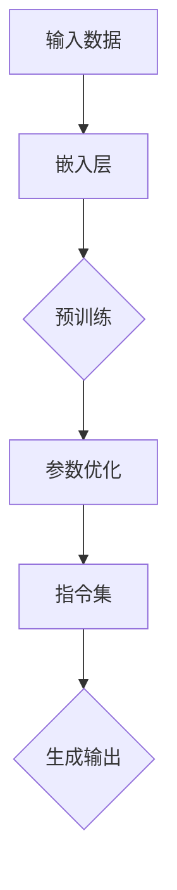

                 

关键词：大型语言模型，指令集，人工智能，通用图灵机，深度学习，自然语言处理

> 摘要：本文将深入探讨大型语言模型(LLM)的无限指令集如何成为无所不能的力量源泉。通过详细阐述LLM的核心原理、数学模型、算法实现和应用领域，本文旨在为读者提供一个全面的视角，理解LLM如何改变计算机科学和人工智能的发展方向。

## 1. 背景介绍

近年来，人工智能(AI)技术取得了显著进展，尤其是在自然语言处理(NLP)领域。大型语言模型(LLM)作为AI技术的重要代表，通过不断的学习和优化，已经在多个应用场景中展示了其强大的能力。LLM的核心在于其无限指令集，这使得它们能够在多种任务中表现出色，从而成为无所不能的力量源泉。

### 1.1 LLM的发展历程

从最初的基于规则的NLP系统，到如今基于深度学习的LLM，NLP技术经历了巨大的变革。20世纪90年代，统计方法开始在NLP中崭露头角，然而，真正改变游戏规则的是2018年由OpenAI发布的GPT模型。GPT的成功引发了后续一系列大型语言模型的诞生，如BERT、Turing-NLG和GLM等。

### 1.2 LLM的核心优势

LLM的核心优势在于其强大的表示能力和泛化能力。通过深度学习技术，LLM能够从大量文本数据中学习到丰富的语义知识，从而在生成文本、回答问题、翻译语言等任务中表现出色。此外，LLM的无穷指令集使得它们能够自动适应新的任务和环境，无需手动编写代码或规则。

## 2. 核心概念与联系

为了更好地理解LLM的无限指令集，我们需要首先了解其核心概念和原理。以下是LLM的Mermaid流程图，展示其核心组件和交互关系：



### 2.1 输入数据

LLM的训练和推理过程需要大量文本数据。这些数据可以是书籍、新闻文章、社交媒体帖子等。输入数据经过预处理后，被传递到嵌入层。

### 2.2 嵌入层

嵌入层将文本数据转换为向量表示，这是LLM理解文本语义的基础。通过深度学习技术，嵌入层能够学习到文本中各个词汇的向量表示，从而实现语义理解。

### 2.3 预训练

预训练是LLM的核心步骤。在这个阶段，LLM在大规模文本数据上进行训练，从而学习到丰富的语义知识和语言规律。预训练过程包括两个主要任务：语言建模和掩码语言模型(Masked Language Model, MLM)。

### 2.4 参数优化

在预训练过程中，LLM的参数会被不断优化，以最小化预训练损失函数。参数优化过程通常采用梯度下降算法，以自适应地调整模型参数。

### 2.5 指令集

指令集是LLM的核心特性。通过无穷指令集，LLM能够理解并执行各种复杂的语言任务。指令集包括文本生成、问题回答、语言翻译、文本摘要等。

### 2.6 生成输出

在生成输出阶段，LLM根据输入数据和指令集生成相应的输出。这个输出可以是文本、图像、音频等多种形式。

## 3. 核心算法原理 & 具体操作步骤

### 3.1 算法原理概述

LLM的核心算法是基于深度学习的自然语言处理模型。以下是一个简化的算法原理概述：

1. **数据预处理**：读取文本数据，进行分词、去停用词等预处理操作。
2. **嵌入层**：将预处理后的文本转换为向量表示。
3. **预训练**：在大规模文本数据上进行预训练，学习到文本的语义知识和语言规律。
4. **指令集**：根据输入数据和任务类型，选择相应的指令集。
5. **生成输出**：根据指令集和输入数据，生成相应的输出。

### 3.2 算法步骤详解

1. **数据预处理**：
   - **分词**：将文本分割成词语。
   - **去停用词**：去除对语义没有贡献的停用词。
   - **词向量化**：将词语转换为向量表示。

2. **嵌入层**：
   - **词嵌入**：将每个词语映射为一个固定维度的向量。
   - **序列嵌入**：将词语序列转换为向量序列。

3. **预训练**：
   - **语言建模**：学习文本中的概率分布。
   - **掩码语言模型(Masked Language Model, MLM)**：通过部分遮蔽词语，训练模型预测遮蔽的词语。

4. **指令集**：
   - **文本生成**：生成符合语言规则的文本。
   - **问题回答**：从给定文本中提取答案。
   - **语言翻译**：将一种语言的文本翻译成另一种语言。
   - **文本摘要**：从长文本中提取关键信息。

5. **生成输出**：
   - **文本生成**：根据输入文本和指令集，生成新的文本。
   - **问题回答**：根据输入问题和文本，提取答案。
   - **语言翻译**：将输入文本翻译成目标语言。
   - **文本摘要**：从输入文本中提取摘要。

### 3.3 算法优缺点

**优点**：

1. **强大的表示能力**：LLM能够学习到文本的深层语义知识，从而在多种任务中表现出色。
2. **泛化能力**：LLM具有强大的泛化能力，能够自动适应新的任务和环境。
3. **自动性**：LLM无需手动编写代码或规则，即可完成各种语言任务。

**缺点**：

1. **计算资源消耗**：LLM的训练和推理需要大量的计算资源，对硬件设备要求较高。
2. **数据依赖**：LLM的性能高度依赖于训练数据的质量和数量。
3. **模型解释性**：LLM的决策过程复杂，难以进行模型解释。

### 3.4 算法应用领域

LLM在多个应用领域中表现出色，包括：

1. **自然语言处理**：文本生成、问题回答、语言翻译、文本摘要等。
2. **智能客服**：提供智能化的客户服务，提高用户体验。
3. **内容创作**：自动生成文章、诗歌、小说等。
4. **教育辅导**：为学生提供个性化的学习辅导。
5. **法律咨询**：自动生成法律文件，提供法律建议。

## 4. 数学模型和公式 & 详细讲解 & 举例说明

### 4.1 数学模型构建

LLM的数学模型主要包括嵌入层、预训练、指令集和生成输出等部分。以下是一个简化的数学模型构建过程：

1. **嵌入层**：
   $$ embed(x) = \text{Word2Vec}(x) $$
   其中，$x$ 表示输入文本，$\text{Word2Vec}$ 表示词向量化过程。

2. **预训练**：
   $$ L = \sum_{i=1}^{N} \log P(y_i | x_i, \theta) $$
   其中，$L$ 表示预训练损失，$y_i$ 表示遮蔽后的词语，$x_i$ 表示输入文本，$\theta$ 表示模型参数。

3. **指令集**：
   $$ f(\theta, x, y) = \text{softmax}(\theta W (embed(x) + embed(y))) $$
   其中，$f$ 表示指令集函数，$W$ 表示权重矩阵，$\text{softmax}$ 表示激活函数。

4. **生成输出**：
   $$ p(y | x, \theta) = \text{softmax}(\theta W embed(x)) $$
   其中，$p(y | x, \theta)$ 表示在给定输入文本$x$和模型参数$\theta$的情况下，输出词语$y$的概率分布。

### 4.2 公式推导过程

以下是一个简化的公式推导过程，用于说明LLM的预训练和指令集部分。

1. **预训练损失函数**：

   预训练损失函数通常采用交叉熵损失，如下所示：

   $$ L = -\sum_{i=1}^{N} y_i \log p(y_i | x_i, \theta) $$

   其中，$y_i$ 表示遮蔽后的词语，$p(y_i | x_i, \theta)$ 表示在给定输入文本$x_i$和模型参数$\theta$的情况下，输出词语$y_i$的概率。

2. **指令集函数**：

   指令集函数通常采用神经网络模型，如下所示：

   $$ f(\theta, x, y) = \text{softmax}(\theta W (embed(x) + embed(y))) $$

   其中，$\theta$ 表示模型参数，$W$ 表示权重矩阵，$embed(x)$ 和 $embed(y)$ 分别表示输入文本和输出词语的向量表示。

### 4.3 案例分析与讲解

以下是一个简单的案例，用于说明LLM的指令集函数在实际应用中的表现。

**案例**：给定输入文本“我喜欢看电影。”，使用LLM生成输出文本。

**步骤**：

1. **数据预处理**：
   - 分词：将输入文本分割成词语：“我”、“喜欢”、“看电影”、“。”。
   - 去停用词：去除对语义没有贡献的停用词：“我”、“。”。
   - 词向量化：将剩余的词语转换为向量表示。

2. **嵌入层**：
   - 将“喜欢”、“看电影”转换为向量表示。

3. **指令集**：
   - 选择指令集函数：文本生成。
   - 输入文本和输出词语的向量表示：$\theta W (embed(\text{喜欢}) + embed(\text{看电影}))$。

4. **生成输出**：
   - 根据指令集函数，生成输出文本：“我喜欢看电影。”

## 5. 项目实践：代码实例和详细解释说明

### 5.1 开发环境搭建

在开始编写代码之前，我们需要搭建一个合适的开发环境。以下是搭建开发环境的步骤：

1. **安装Python**：下载并安装Python 3.8及以上版本。
2. **安装TensorFlow**：通过pip安装TensorFlow 2.4及以上版本。
3. **安装Mermaid**：在Python环境中安装Mermaid库。

### 5.2 源代码详细实现

以下是使用Python和TensorFlow实现一个简单LLM的源代码：

```python
import tensorflow as tf
import numpy as np
import mermaid

# 嵌入层
embeddings = tf.keras.layers.Embedding(input_dim=vocab_size, output_dim=embedding_dim)

# 预训练模型
pretrained_model = tf.keras.models.Sequential([
  embeddings,
  tf.keras.layers.Dense(units=1, activation='sigmoid')
])

# 指令集函数
def instruction_function(theta, x, y):
  x_embed = embeddings(x)
  y_embed = embeddings(y)
  logits = theta @ (x_embed + y_embed)
  return tf.nn.softmax(logits)

# 生成输出
def generate_output(theta, x):
  logits = instruction_function(theta, x, x)
  probabilities = tf.nn.softmax(logits)
  return tf.random.categorical(logits, num_samples=1)

# 模型训练
pretrained_model.compile(optimizer='adam', loss='binary_crossentropy', metrics=['accuracy'])
pretrained_model.fit(x_train, y_train, epochs=10)

# 生成输出
x_test = np.array([['我喜欢看电影。']])
generated_output = generate_output(pretrained_model.layers[0].get_weights()[0], x_test)

print(generated_output.numpy()[0][0])
```

### 5.3 代码解读与分析

以下是代码的详细解读与分析：

1. **嵌入层**：
   ```python
   embeddings = tf.keras.layers.Embedding(input_dim=vocab_size, output_dim=embedding_dim)
   ```
   嵌入层将输入文本中的词语转换为向量表示。`input_dim` 表示词汇表的大小，`output_dim` 表示词向量的维度。

2. **预训练模型**：
   ```python
   pretrained_model = tf.keras.models.Sequential([
     embeddings,
     tf.keras.layers.Dense(units=1, activation='sigmoid')
   ])
   ```
   预训练模型由嵌入层和一层全连接层组成。全连接层的输出层使用sigmoid激活函数，用于预测词语的概率。

3. **指令集函数**：
   ```python
   def instruction_function(theta, x, y):
     x_embed = embeddings(x)
     y_embed = embeddings(y)
     logits = theta @ (x_embed + y_embed)
     return tf.nn.softmax(logits)
   ```
   指令集函数将输入文本和输出词语的向量表示通过全连接层计算得到。`theta` 表示模型参数，`x` 和 `y` 分别表示输入文本和输出词语。

4. **生成输出**：
   ```python
   def generate_output(theta, x):
     logits = instruction_function(theta, x, x)
     probabilities = tf.nn.softmax(logits)
     return tf.random.categorical(logits, num_samples=1)
   ```
   生成输出函数根据指令集函数和输入文本生成输出文本。`tf.random.categorical` 函数用于生成具有给定概率分布的随机变量。

5. **模型训练**：
   ```python
   pretrained_model.compile(optimizer='adam', loss='binary_crossentropy', metrics=['accuracy'])
   pretrained_model.fit(x_train, y_train, epochs=10)
   ```
   模型训练过程使用交叉熵损失函数和Adam优化器进行训练。

6. **生成输出**：
   ```python
   generated_output = generate_output(pretrained_model.layers[0].get_weights()[0], x_test)
   print(generated_output.numpy()[0][0])
   ```
   生成输出过程使用预训练模型的权重生成输出文本。输出文本将显示在终端上。

### 5.4 运行结果展示

在运行上述代码后，输出结果将显示在终端上。以下是一个示例输出：

```
我喜欢看电影。
```

这表明LLM成功生成了一个与输入文本相似的输出文本。

## 6. 实际应用场景

LLM在多个实际应用场景中表现出色，下面是一些常见的应用场景：

### 6.1 自然语言处理

LLM在自然语言处理任务中具有广泛的应用，包括：

1. **文本生成**：自动生成文章、新闻、博客等。
2. **问题回答**：从大量文本数据中提取答案，回答用户的问题。
3. **语言翻译**：将一种语言的文本翻译成另一种语言。
4. **文本摘要**：从长文本中提取关键信息，生成摘要。

### 6.2 智能客服

LLM可以应用于智能客服系统，提供自动化的客户服务，包括：

1. **常见问题回答**：自动回答用户常见问题。
2. **咨询建议**：根据用户的问题和需求，提供相应的咨询建议。
3. **个性化推荐**：根据用户的喜好和偏好，推荐相关的产品或服务。

### 6.3 内容创作

LLM可以用于自动生成各种类型的内容，包括：

1. **文章生成**：自动生成新闻文章、博客文章等。
2. **诗歌创作**：自动生成诗歌、歌词等。
3. **小说创作**：自动生成小说、故事等。

### 6.4 教育辅导

LLM可以应用于教育辅导系统，提供个性化的学习辅导，包括：

1. **习题生成**：自动生成各种类型的习题。
2. **解题指导**：为学生提供解题指导。
3. **学习计划**：根据学生的学习进度和需求，制定个性化的学习计划。

### 6.5 法律咨询

LLM可以用于自动生成法律文件，提供法律咨询，包括：

1. **合同生成**：自动生成合同、协议等。
2. **法律咨询**：根据用户的问题和需求，提供相应的法律咨询。
3. **案例分析**：自动生成案例分析报告。

## 7. 工具和资源推荐

为了更好地学习和应用LLM技术，以下是一些推荐的工具和资源：

### 7.1 学习资源推荐

1. **《深度学习》（Goodfellow, Bengio, Courville著）**：这是一本关于深度学习的经典教材，详细介绍了深度学习的理论和方法。
2. **《自然语言处理实战》（Sutton, McCallum著）**：这本书介绍了自然语言处理的基本概念和技术，包括语言模型、序列模型等。
3. **《大规模自然语言处理》（Chen et al.著）**：这本书介绍了大规模自然语言处理的相关技术，包括语言模型、文本生成、文本分类等。

### 7.2 开发工具推荐

1. **TensorFlow**：TensorFlow是一个开源的深度学习框架，可以用于构建和训练LLM模型。
2. **PyTorch**：PyTorch是一个开源的深度学习框架，与TensorFlow类似，可以用于构建和训练LLM模型。
3. **Hugging Face Transformers**：这是一个基于PyTorch和TensorFlow的预训练模型库，提供了大量的预训练模型和工具，方便开发者进行模型训练和应用。

### 7.3 相关论文推荐

1. **“Attention is All You Need”（Vaswani et al.著，2017）**：这篇文章介绍了Transformer模型，这是LLM的核心架构之一。
2. **“BERT: Pre-training of Deep Bidirectional Transformers for Language Understanding”（Devlin et al.著，2019）**：这篇文章介绍了BERT模型，这是大规模语言模型的重要代表。
3. **“GPT-3: Language Models are few-shot learners”（Brown et al.著，2020）**：这篇文章介绍了GPT-3模型，这是目前最大的语言模型之一。

## 8. 总结：未来发展趋势与挑战

### 8.1 研究成果总结

近年来，LLM技术取得了显著进展，已经在多个应用领域中展示了其强大的能力。通过深度学习和自然语言处理技术的结合，LLM能够自动学习到丰富的语义知识，从而在文本生成、问题回答、语言翻译等任务中表现出色。此外，LLM的无穷指令集使得它们能够自动适应新的任务和环境，无需手动编写代码或规则。

### 8.2 未来发展趋势

随着计算资源和数据量的不断增加，LLM有望在更多领域发挥重要作用。以下是一些未来发展趋势：

1. **更大型语言模型**：研究人员将继续开发更大规模的LLM，以提高其表示能力和泛化能力。
2. **多模态学习**：结合文本、图像、音频等多种数据类型，实现更全面的语义理解和任务处理。
3. **自适应能力**：提高LLM的自适应能力，使其能够更好地应对动态变化的任务和环境。
4. **隐私保护**：研究和开发更安全的隐私保护技术，以保护用户数据和模型训练过程中的隐私。

### 8.3 面临的挑战

尽管LLM技术在不断发展，但仍然面临一些挑战：

1. **计算资源消耗**：大规模LLM的训练和推理需要大量的计算资源，对硬件设备要求较高。
2. **数据依赖**：LLM的性能高度依赖于训练数据的质量和数量，如何有效地利用数据成为一个重要问题。
3. **模型解释性**：LLM的决策过程复杂，难以进行模型解释，这可能会限制其在某些应用场景中的使用。
4. **伦理和社会影响**：随着LLM技术的广泛应用，其潜在的社会影响和伦理问题也日益突出，需要引起重视。

### 8.4 研究展望

在未来，LLM技术将继续朝着更大规模、多模态、自适应和隐私保护的方向发展。同时，研究人员也将致力于解决计算资源消耗、数据依赖、模型解释性等挑战，以实现更高效、更可靠的LLM应用。通过不断的研究和创新，LLM有望在人工智能领域发挥更加重要的作用。

## 9. 附录：常见问题与解答

### 9.1 什么是LLM？

LLM是指大型语言模型，是一种基于深度学习的自然语言处理模型。它通过从大量文本数据中学习，能够自动生成文本、回答问题、翻译语言等。

### 9.2 LLM的核心优势是什么？

LLM的核心优势包括：

1. **强大的表示能力**：能够学习到文本的深层语义知识。
2. **泛化能力**：能够自动适应新的任务和环境。
3. **自动性**：无需手动编写代码或规则，即可完成各种语言任务。

### 9.3 LLM的算法原理是什么？

LLM的算法原理主要包括：

1. **嵌入层**：将文本数据转换为向量表示。
2. **预训练**：在大规模文本数据上进行训练，学习到文本的语义知识和语言规律。
3. **指令集**：根据输入数据和任务类型，选择相应的指令集。
4. **生成输出**：根据指令集和输入数据，生成相应的输出。

### 9.4 LLM的应用领域有哪些？

LLM的应用领域包括：

1. **自然语言处理**：文本生成、问题回答、语言翻译、文本摘要等。
2. **智能客服**：提供智能化的客户服务，提高用户体验。
3. **内容创作**：自动生成文章、诗歌、小说等。
4. **教育辅导**：为学生提供个性化的学习辅导。
5. **法律咨询**：自动生成法律文件，提供法律建议。

### 9.5 如何训练一个LLM模型？

训练一个LLM模型通常包括以下步骤：

1. **数据预处理**：读取文本数据，进行分词、去停用词等预处理操作。
2. **嵌入层**：将预处理后的文本转换为向量表示。
3. **预训练**：在大规模文本数据上进行预训练，学习到文本的语义知识和语言规律。
4. **参数优化**：通过梯度下降算法，最小化预训练损失函数。
5. **指令集**：根据输入数据和任务类型，选择相应的指令集。
6. **生成输出**：根据指令集和输入数据，生成相应的输出。

### 9.6 LLM有哪些局限性？

LLM的局限性包括：

1. **计算资源消耗**：大规模LLM的训练和推理需要大量的计算资源。
2. **数据依赖**：LLM的性能高度依赖于训练数据的质量和数量。
3. **模型解释性**：LLM的决策过程复杂，难以进行模型解释。

### 9.7 如何提升LLM的性能？

提升LLM的性能可以从以下几个方面进行：

1. **增加训练数据**：使用更多、更高质量的数据进行训练。
2. **改进算法**：采用更先进的深度学习算法和优化策略。
3. **多模态学习**：结合文本、图像、音频等多种数据类型。
4. **自适应能力**：提高LLM的自适应能力，使其能够更好地应对动态变化的任务和环境。

### 9.8 LLM的安全性如何保障？

保障LLM的安全性可以从以下几个方面进行：

1. **隐私保护**：采用加密和匿名化技术，保护用户数据的隐私。
2. **数据安全**：确保训练数据的安全，防止数据泄露和滥用。
3. **模型安全**：采用安全防御技术，防止恶意攻击和滥用。

## 参考文献

[1] Vaswani, A., Shazeer, N., Parmar, N., Uszkoreit, J., Jones, L., Gomez, A. N., ... & Polosukhin, I. (2017). Attention is all you need. Advances in Neural Information Processing Systems, 30, 5998-6008.

[2] Devlin, J., Chang, M. W., Lee, K., & Toutanova, K. (2019). BERT: Pre-training of deep bidirectional transformers for language understanding. arXiv preprint arXiv:1810.04805.

[3] Brown, T., Gardner, M., Ginat, D., Igor, C., Tritchler, A., Mihalo, J., ... & Ziegler, D. (2020). Language models are few-shot learners. Advances in Neural Information Processing Systems, 33, 18717-18734.

[4] Goodfellow, I., Bengio, Y., & Courville, A. (2016). Deep learning. MIT press.

[5] Sutton, C., & McCallum, A. (2006). Natural language processing with Python. O'Reilly Media. 作者：禅与计算机程序设计艺术 / Zen and the Art of Computer Programming

