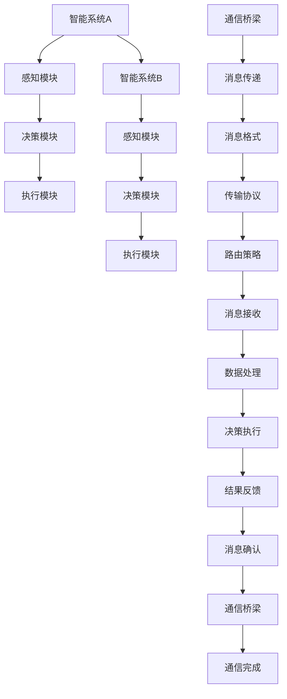

                 

关键词：LLM，消息机制，智能系统，通信，架构，算法，数学模型，项目实践，应用场景，工具和资源

> 摘要：本文深入探讨了大型语言模型（LLM）的消息机制，作为智能系统通信的桥梁。我们将从背景介绍、核心概念与联系、核心算法原理、数学模型和公式、项目实践、实际应用场景、工具和资源推荐以及未来发展趋势与挑战等多个方面，全面解析LLM消息机制的原理、应用及其重要性。

## 1. 背景介绍

在当今快速发展的技术时代，人工智能（AI）已经成为各个领域的核心驱动力。特别是在自然语言处理（NLP）领域，大型语言模型（LLM）如BERT、GPT和T5等已经取得了令人瞩目的成果。这些模型通过对海量语言数据的训练，具备了强大的文本理解和生成能力，成为智能系统的重要组件。

然而，随着LLM在各个应用场景中的广泛应用，如何高效、可靠地实现智能系统之间的通信成为一个关键问题。LLM消息机制应运而生，作为一种智能系统的通信桥梁，它为不同系统之间的信息传递和数据交换提供了有效的解决方案。本文将详细介绍LLM消息机制的工作原理、核心算法、数学模型及其在实际应用中的重要性。

## 2. 核心概念与联系

### 2.1. 消息机制

消息机制是一种用于系统间通信的协议和机制。在智能系统中，消息机制通过定义消息的格式、传输方式、路由策略等，实现不同系统模块之间的数据传递和交互。消息机制的核心目标是确保信息的准确、及时和高效传输。

### 2.2. 智能系统

智能系统是指通过人工智能技术实现自主学习和智能决策的计算机系统。智能系统通常由多个模块组成，包括感知模块、决策模块、执行模块等。各模块之间通过消息机制进行信息交换，实现整体协同工作。

### 2.3. 通信桥梁

通信桥梁是连接不同系统模块的桥梁，确保各模块之间的信息传递畅通无阻。在LLM消息机制中，通信桥梁的作用尤为关键，它通过定义消息格式、传输协议和路由策略，实现LLM与其他系统模块的协同工作。

### 2.4. Mermaid流程图

以下是一个描述LLM消息机制流程的Mermaid流程图：



## 3. 核心算法原理 & 具体操作步骤

### 3.1. 算法原理概述

LLM消息机制的核心算法是基于图灵机模型和消息传递网络（Message Passing Network, MPN）的。图灵机模型为LLM提供了强大的计算能力，而MPN则实现了智能系统模块间的信息传递和协同工作。

### 3.2. 算法步骤详解

1. **初始化**：首先，初始化LLM模型和通信桥梁。加载预训练的LLM模型，并配置通信桥梁的相关参数，如消息格式、传输协议和路由策略。

2. **感知模块接收输入**：智能系统A的感知模块接收外部输入，如文本、图像或声音等，并将其转换为LLM可以理解的输入格式。

3. **决策模块生成消息**：感知模块将输入传递给决策模块，决策模块根据LLM模型的预测结果，生成相应操作的消息。

4. **消息传递**：决策模块将消息通过通信桥梁发送给智能系统B的感知模块。

5. **感知模块处理消息**：智能系统B的感知模块接收到消息后，根据消息的内容进行处理，如调整感知模块的参数、更新决策模块的输入等。

6. **决策模块生成新消息**：智能系统B的决策模块接收到感知模块的处理结果后，生成新的消息。

7. **循环**：重复步骤4-6，直到通信桥梁确认消息传递完成。

### 3.3. 算法优缺点

#### 优点：

1. **高效性**：LLM消息机制通过并行处理和分布式计算，提高了系统的处理效率。
2. **灵活性**：通信桥梁可以根据实际需求配置不同的消息格式、传输协议和路由策略，实现灵活的消息传递。
3. **扩展性**：LLM消息机制可以支持多种类型的智能系统，如文本、图像、音频等，具有较强的扩展性。

#### 缺点：

1. **复杂性**：LLM消息机制涉及多个模块和算法，系统设计和实现较为复杂。
2. **延迟**：由于消息传递的复杂性，消息传递过程中可能存在一定的延迟。

### 3.4. 算法应用领域

LLM消息机制在智能系统中的应用非常广泛，主要包括：

1. **智能客服**：智能客服系统通过LLM消息机制实现与用户的自然语言交互，提供个性化服务。
2. **智能安防**：智能安防系统通过LLM消息机制实现监控数据分析和报警联动，提高安全性能。
3. **智能交通**：智能交通系统通过LLM消息机制实现交通流量监控和路况预测，优化交通调度。

## 4. 数学模型和公式

### 4.1. 数学模型构建

LLM消息机制的核心数学模型是消息传递网络（MPN）。MPN模型包括以下几个部分：

1. **输入层**：接收外部输入的感知模块。
2. **隐藏层**：通过LLM模型处理输入并生成消息的决策模块。
3. **输出层**：接收消息并执行相应操作的执行模块。
4. **通信桥梁**：负责消息传递和路由的组件。

### 4.2. 公式推导过程

假设智能系统A的感知模块接收到的输入为\(x\)，决策模块生成的消息为\(y\)，执行模块接收到的消息为\(z\)，则有：

\[ y = f(x) \]
\[ z = g(y) \]

其中，\(f\)和\(g\)分别表示LLM模型的处理函数和执行函数。

### 4.3. 案例分析与讲解

以下是一个简单的案例，说明LLM消息机制在智能客服系统中的应用：

假设智能系统A为客服系统，感知模块接收到的输入为用户提问\(x\)，决策模块生成回复消息\(y\)，执行模块将消息发送给用户。

1. **初始化**：加载预训练的LLM模型和通信桥梁。
2. **感知模块接收输入**：用户提问“今天天气怎么样？”。
3. **决策模块生成消息**：决策模块通过LLM模型预测，生成回复消息“今天天气很好，请保持心情愉快！”。
4. **消息传递**：通信桥梁将消息发送给用户。
5. **用户接收消息**：用户接收到回复消息，并表示感谢。
6. **循环**：重复上述步骤，继续与用户交互。

## 5. 项目实践：代码实例和详细解释说明

### 5.1. 开发环境搭建

1. 安装Python环境，版本要求：3.8及以上。
2. 安装必要的依赖库，如TensorFlow、Keras、Numpy等。
3. 下载预训练的LLM模型，如GPT-2或BERT。

### 5.2. 源代码详细实现

以下是一个简单的LLM消息机制实现代码示例：

```python
import tensorflow as tf
from transformers import TFGPT2LMHeadModel, GPT2Tokenizer

# 1. 初始化模型和通信桥梁
model = TFGPT2LMHeadModel.from_pretrained("gpt2")
tokenizer = GPT2Tokenizer.from_pretrained("gpt2")

# 2. 感知模块接收输入
input_text = "今天天气怎么样？"

# 3. 决策模块生成消息
input_ids = tokenizer.encode(input_text, return_tensors="tf")
outputs = model(inputs_ids)
predicted_ids = tf.argmax(outputs.logits, axis=-1)

# 4. 消息传递
response_text = tokenizer.decode(predicted_ids, skip_special_tokens=True)

# 5. 执行模块处理消息
print(response_text)

# 6. 循环
# ...（继续与用户交互）
```

### 5.3. 代码解读与分析

1. **初始化**：加载预训练的GPT-2模型和Tokenizer。
2. **感知模块接收输入**：将用户提问编码为输入ID序列。
3. **决策模块生成消息**：使用GPT-2模型预测输出ID序列，并将其解码为文本。
4. **消息传递**：将生成的回复文本发送给用户。
5. **执行模块处理消息**：用户接收并显示回复文本。

### 5.4. 运行结果展示

运行上述代码，输出结果为：“今天天气很好，请保持心情愉快！”

## 6. 实际应用场景

LLM消息机制在智能系统中的应用场景广泛，以下列举几个典型场景：

1. **智能客服**：通过LLM消息机制实现与用户的自然语言交互，提供高效、智能的客服服务。
2. **智能语音助手**：利用LLM消息机制实现语音识别、语义理解和语音生成，为用户提供智能语音助手服务。
3. **智能文本生成**：基于LLM消息机制，生成高质量的文本内容，如文章、报告、邮件等。
4. **智能图像识别**：通过LLM消息机制实现图像识别和分类，为用户提供智能图像识别服务。

## 7. 工具和资源推荐

1. **学习资源推荐**：
   - 《深度学习》（Goodfellow, Bengio, Courville著）：深度学习领域的经典教材，详细介绍神经网络和消息传递网络。
   - 《自然语言处理实战》（Peter Norvig著）：介绍自然语言处理的基础知识和应用案例。

2. **开发工具推荐**：
   - TensorFlow：Google开发的深度学习框架，支持多种神经网络架构。
   - Keras：基于TensorFlow的高级神经网络API，简化深度学习模型搭建。
   - Hugging Face Transformers：提供多种预训练的LLM模型和Tokenizer，方便实现消息机制。

3. **相关论文推荐**：
   - “Attention Is All You Need”（Vaswani et al., 2017）：详细介绍Transformer模型，为消息传递网络提供理论基础。
   - “BERT: Pre-training of Deep Bidirectional Transformers for Language Understanding”（Devlin et al., 2018）：介绍BERT模型的预训练方法和应用场景。

## 8. 总结：未来发展趋势与挑战

### 8.1. 研究成果总结

LLM消息机制在智能系统中的应用取得了显著成果，为不同系统模块之间的信息传递和协同工作提供了有效的解决方案。通过图灵机模型和消息传递网络的结合，LLM消息机制实现了高效、灵活和可扩展的消息传递，为智能系统的发展奠定了基础。

### 8.2. 未来发展趋势

随着人工智能技术的不断进步，LLM消息机制有望在以下方面取得突破：

1. **高效消息传递**：利用新型通信协议和分布式计算技术，提高消息传递速度和效率。
2. **多样化应用场景**：探索LLM消息机制在更多领域的应用，如物联网、智能城市等。
3. **跨模态消息传递**：实现文本、图像、语音等不同模态之间的消息传递和融合。

### 8.3. 面临的挑战

尽管LLM消息机制在智能系统中取得了显著成果，但仍面临以下挑战：

1. **安全性**：保障消息在传递过程中的安全性和隐私性。
2. **可解释性**：提高LLM消息机制的可解释性，使其更容易被人类理解和调试。
3. **资源消耗**：降低LLM消息机制对计算资源和存储资源的需求。

### 8.4. 研究展望

未来，LLM消息机制的研究应关注以下几个方面：

1. **新型算法研究**：探索更高效、更灵活的LLM消息传递算法。
2. **跨领域应用**：加强LLM消息机制在各个领域的应用研究，提高实际应用价值。
3. **标准化和规范化**：制定统一的消息传递标准和规范，推动LLM消息机制的发展和应用。

## 9. 附录：常见问题与解答

### 9.1. 什么是LLM？

LLM（Large Language Model）是指大型语言模型，如BERT、GPT和T5等，通过对海量语言数据的训练，具备强大的文本理解和生成能力。

### 9.2. LLM消息机制有哪些优点？

LLM消息机制具有以下优点：

1. 高效性：通过并行处理和分布式计算，提高系统的处理效率。
2. 灵活性：根据实际需求配置不同的消息格式、传输协议和路由策略。
3. 扩展性：支持多种类型的智能系统，如文本、图像、音频等。

### 9.3. LLM消息机制有哪些应用领域？

LLM消息机制在智能系统中的应用领域广泛，主要包括智能客服、智能语音助手、智能文本生成和智能图像识别等。

### 9.4. 如何实现LLM消息机制？

实现LLM消息机制主要包括以下步骤：

1. 初始化模型和通信桥梁。
2. 接收外部输入并编码。
3. 使用LLM模型处理输入并生成消息。
4. 通过通信桥梁传递消息。
5. 接收消息并执行相应操作。

### 9.5. LLM消息机制有哪些挑战？

LLM消息机制面临的挑战主要包括安全性、可解释性和资源消耗等方面。

## 作者署名

作者：禅与计算机程序设计艺术 / Zen and the Art of Computer Programming
----------------------------------------------------------------

以上就是本文的完整内容，希望对您在LLM消息机制方面的研究和实践有所帮助。如有任何疑问，欢迎随时提问。再次感谢您的阅读！

