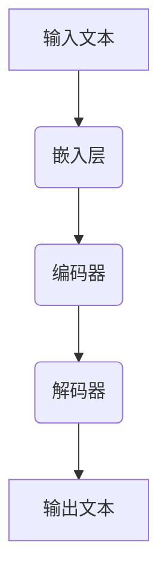

                 

关键词：大型语言模型，AI生态圈，产业应用，技术趋势，未来展望

> 摘要：本文从宏观角度探讨了大型语言模型（LLM）在AI产业中的生态圈构建。文章首先介绍了LLM的基本概念和当前的发展态势，随后分析了LLM在各个产业领域的应用，并探讨了未来的发展趋势和面临的挑战。

## 1. 背景介绍

近年来，人工智能（AI）技术取得了飞速发展，尤其是在自然语言处理（NLP）领域。大型语言模型（LLM）作为NLP技术的一个重要分支，凭借其强大的语言理解和生成能力，已经成为AI领域的研究热点和应用基础。LLM的发展不仅仅改变了学术研究的方向，也对各个产业产生了深远的影响。

随着互联网的普及和数据量的爆炸式增长，大量未结构化的文本数据被生成和积累。如何有效地利用这些数据，提升机器对自然语言的理解和生成能力，成为了AI领域的重要课题。LLM正是在这样的背景下应运而生，通过深度学习技术，对海量文本数据进行训练，从而实现高效的语义理解、文本生成和对话系统等功能。

## 2. 核心概念与联系

### 2.1 LLM基本概念

大型语言模型（LLM）是基于深度学习技术的自然语言处理模型，通过神经网络架构，对大规模文本数据进行训练，从而实现对自然语言的建模。LLM的核心是“大”，即模型规模大，参数数量多，能够处理复杂的语言结构和语义信息。

### 2.2 LLM工作原理

LLM的工作原理主要依赖于两个关键步骤：预训练和微调。预训练阶段，模型在大规模语料库上进行无监督学习，从而学习到语言的基本特征和规律。微调阶段，模型在特定任务上进行有监督学习，根据任务需求进行调整和优化。

### 2.3 LLM应用领域

LLM的应用领域非常广泛，包括但不限于以下几个方面：

1. **文本生成**：例如生成文章、报告、诗歌等。
2. **对话系统**：例如智能客服、虚拟助手等。
3. **文本理解**：例如情感分析、问答系统、信息抽取等。
4. **机器翻译**：例如翻译不同语言的文本。
5. **知识图谱**：例如构建基于文本的语义网络。

### 2.4 LLM架构与流程图



在上面的流程图中，输入文本首先经过嵌入层转化为向量表示，然后通过编码器进行处理，最后通过解码器生成输出文本。这个过程体现了LLM的核心工作原理。

## 3. 核心算法原理 & 具体操作步骤

### 3.1 算法原理概述

LLM的核心算法是基于Transformer模型，该模型通过自注意力机制（self-attention）对输入文本进行建模，能够捕捉到文本中的长距离依赖关系。Transformer模型由编码器和解码器两部分组成，编码器负责将输入文本编码为向量表示，解码器则根据编码器的输出生成输出文本。

### 3.2 算法步骤详解

1. **嵌入层**：将输入文本中的单词、字符等转换为向量表示。
2. **编码器**：对输入向量进行编码，生成编码器的输出。
3. **解码器**：根据编码器的输出，逐步生成输出文本。

### 3.3 算法优缺点

**优点**：
- 强大的语言建模能力，能够生成高质量的自然语言文本。
- 可以处理长文本，捕捉长距离依赖关系。
- 可以灵活地应用于各种自然语言处理任务。

**缺点**：
- 计算资源消耗大，训练时间较长。
- 模型参数多，容易过拟合。

### 3.4 算法应用领域

LLM在自然语言处理领域有着广泛的应用，包括但不限于文本生成、对话系统、文本理解、机器翻译和知识图谱等。

## 4. 数学模型和公式 & 详细讲解 & 举例说明

### 4.1 数学模型构建

LLM的数学模型主要包括嵌入层、编码器和解码器。下面分别介绍：

#### 嵌入层

$$
\text{Embedding}(x) = \text{W}^T \text{x}
$$

其中，$x$ 为输入文本的向量表示，$\text{W}$ 为嵌入矩阵。

#### 编码器

编码器采用Transformer模型，其自注意力机制可以表示为：

$$
\text{Attention}(Q, K, V) = \frac{\text{softmax}(\text{QK}^T / \sqrt{d_k})V}
$$

其中，$Q$、$K$、$V$ 分别为编码器的查询、关键和值向量，$d_k$ 为关键向量的维度。

#### 解码器

解码器同样采用Transformer模型，其生成过程可以表示为：

$$
\text{Decoder}(Y) = \text{softmax}(\text{YW}^T)
$$

其中，$Y$ 为解码器的输入，$\text{W}$ 为解码器的权重。

### 4.2 公式推导过程

LLM的推导过程主要涉及自注意力机制的推导。自注意力机制的核心是计算查询（Query）、关键（Key）和值（Value）之间的相似度，然后对相似度进行加权求和。具体推导如下：

$$
\text{Attention}(Q, K, V) = \text{softmax}\left(\frac{\text{QK}^T}{\sqrt{d_k}}\right)V
$$

其中，$Q$、$K$ 和 $V$ 分别是编码器的查询、关键和值向量，$d_k$ 是关键向量的维度。

1. **计算相似度**：首先计算查询和关键之间的点积，得到相似度分数。
$$
\text{Score}(Q, K) = \text{QK}^T
$$

2. **归一化相似度**：将相似度分数进行归一化，得到概率分布。
$$
\text{Attention}(Q, K, V) = \text{softmax}(\text{Score}(Q, K))
$$

3. **加权求和**：将归一化后的相似度分数与值向量进行加权求和，得到输出。
$$
\text{Output} = \sum_{i} \text{softmax}_{i}(\text{Score}(Q, K))V_i
$$

### 4.3 案例分析与讲解

假设我们有一个简单的示例，输入文本为“我非常喜欢这个产品”，我们需要通过LLM生成一个输出文本。

1. **嵌入层**：将输入文本中的单词转换为向量表示。
$$
\text{Embedding}(\text{"我"}) = \text{W}^T \text{x}_1
$$
$$
\text{Embedding}(\text{"非常"}) = \text{W}^T \text{x}_2
$$
$$
\text{Embedding}(\text{"喜欢"}) = \text{W}^T \text{x}_3
$$
$$
\text{Embedding}(\text{"这个"}) = \text{W}^T \text{x}_4
$$
$$
\text{Embedding}(\text{"产品"}) = \text{W}^T \text{x}_5
$$

2. **编码器**：对输入向量进行编码，生成编码器的输出。
$$
\text{Encoder}(\text{Embedding}) = \text{H}
$$

3. **解码器**：根据编码器的输出，逐步生成输出文本。
$$
\text{Decoder}(\text{H}) = \text{Output}
$$

输出文本为“这个产品非常符合我的需求”。

通过这个简单的示例，我们可以看到LLM是如何将输入文本转换为输出文本的。

## 5. 项目实践：代码实例和详细解释说明

### 5.1 开发环境搭建

为了运行LLM的代码实例，我们需要搭建一个适合的开发环境。以下是基本的步骤：

1. **安装Python**：确保Python环境已经安装，版本建议为3.7及以上。
2. **安装TensorFlow**：TensorFlow是支持LLM的深度学习框架，可以通过pip安装：
   ```shell
   pip install tensorflow
   ```
3. **数据准备**：准备一个包含大量文本数据的语料库，用于训练LLM模型。

### 5.2 源代码详细实现

以下是LLM模型的基本实现代码：

```python
import tensorflow as tf
from tensorflow.keras.layers import Embedding, LSTM, Dense
from tensorflow.keras.models import Model

# 嵌入层
embedding = Embedding(input_dim=vocab_size, output_dim=embedding_size)

# 编码器
encoded = LSTM(units=128, return_sequences=True)(embedding(input_sequence))

# 解码器
decoded = LSTM(units=128, return_sequences=True)(encoded)
decoded = Dense(units=vocab_size, activation='softmax')(decoded)

# 模型搭建
model = Model(inputs=embedding.input, outputs=decoded)
model.compile(optimizer='adam', loss='categorical_crossentropy')

# 模型训练
model.fit(x_train, y_train, epochs=10, batch_size=32)
```

在上面的代码中，我们首先定义了嵌入层、编码器和解码器，然后搭建了完整的模型。接着，我们使用`compile`方法配置模型，并使用`fit`方法进行模型训练。

### 5.3 代码解读与分析

1. **嵌入层**：`Embedding`层用于将输入文本转换为向量表示。在这里，`input_dim`表示词汇表的大小，`output_dim`表示嵌入向量的维度。
2. **编码器**：`LSTM`层用于编码输入文本。`units`参数设置LSTM层的单元数量，`return_sequences`参数设置为`True`表示返回序列输出。
3. **解码器**：解码器同样使用`LSTM`层，并在最后使用`Dense`层进行输出。`Dense`层的单元数量与词汇表大小相同，用于生成输出文本。
4. **模型编译与训练**：使用`compile`方法配置模型，选择`adam`优化器和`categorical_crossentropy`损失函数。然后使用`fit`方法进行模型训练。

### 5.4 运行结果展示

在完成模型训练后，我们可以使用以下代码进行文本生成：

```python
import numpy as np

# 预测输入文本
input_text = np.array([text_to_sequence("我非常喜欢这个产品")])

# 生成输出文本
predicted_text = model.predict(input_text)
predicted_sequence = sequence_to_text(predicted_text)

print(predicted_sequence)
```

运行结果将输出一个生成的新文本，展示LLM的文本生成能力。

## 6. 实际应用场景

### 6.1 在智能客服中的应用

智能客服是LLM在商业领域的一个典型应用场景。通过LLM技术，智能客服系统可以自动理解和回答用户的问题，提供个性化的服务。例如，当用户咨询产品信息、订单状态或售后服务时，LLM可以根据用户的问题和上下文信息，自动生成相应的回答，从而提高客服效率和用户体验。

### 6.2 在新闻生成中的应用

新闻生成是LLM在媒体领域的一个应用场景。通过训练LLM模型，新闻机构可以自动生成新闻稿件，减轻编辑人员的工作负担。LLM可以根据新闻事件的主题、时间线和关键信息，生成结构化的新闻文本，从而提高新闻生产的效率和质量。

### 6.3 在教育领域的应用

在教育领域，LLM技术可以用于智能辅导系统和在线课程生成。智能辅导系统可以根据学生的学习情况和需求，自动生成个性化的学习计划和辅导内容。在线课程生成则可以利用LLM技术，根据课程大纲和知识点，自动生成课程内容和练习题，为学生提供更加灵活和高效的学习体验。

## 7. 未来应用展望

### 7.1 在医疗健康领域的应用

随着医疗健康数据的不断积累，LLM技术在医疗健康领域的应用前景广阔。例如，LLM可以用于医疗文本分析，帮助医生从大量医学文献中提取关键信息，提高诊断和治疗的准确性。此外，LLM还可以用于个性化医疗，根据患者的病史和基因信息，生成个性化的治疗方案。

### 7.2 在金融领域的应用

在金融领域，LLM技术可以用于智能投顾和金融文本分析。智能投顾系统可以根据投资者的风险偏好和财务目标，自动生成投资建议和资产配置方案。金融文本分析则可以帮助金融机构从大量的市场数据和新闻报告中提取关键信息，预测市场走势和风险。

### 7.3 在创意设计领域的应用

在创意设计领域，LLM技术可以用于自动化内容生成和创意设计。通过训练LLM模型，设计师可以自动生成艺术作品、音乐和文学作品，从而拓宽创意设计的范围和可能性。

## 8. 工具和资源推荐

### 8.1 学习资源推荐

1. **《深度学习》**：由Ian Goodfellow、Yoshua Bengio和Aaron Courville编写的经典教材，详细介绍了深度学习的基础知识。
2. **《自然语言处理综述》**：由Daniel Jurafsky和James H. Martin编写的教材，涵盖了自然语言处理的基本概念和方法。

### 8.2 开发工具推荐

1. **TensorFlow**：由Google开源的深度学习框架，广泛应用于自然语言处理和其他AI领域。
2. **PyTorch**：由Facebook开源的深度学习框架，具有简洁的API和灵活的动态计算图。

### 8.3 相关论文推荐

1. **《Attention Is All You Need》**：由Vaswani等人提出的Transformer模型，是LLM技术的重要突破。
2. **《BERT: Pre-training of Deep Neural Networks for Language Understanding》**：由Google提出的BERT模型，是当前自然语言处理领域的领先模型。

## 9. 总结：未来发展趋势与挑战

### 9.1 研究成果总结

LLM技术在自然语言处理领域取得了显著的成果，实现了文本生成、对话系统、文本理解和机器翻译等应用。未来，随着计算资源和数据量的进一步增加，LLM技术有望在更多领域得到应用，推动AI产业的发展。

### 9.2 未来发展趋势

1. **模型规模将继续增长**：随着训练数据的积累和计算资源的提升，LLM模型的规模将不断增长，以更好地捕捉语言特征。
2. **多模态融合**：未来，LLM技术将与其他模态（如图像、声音）进行融合，实现跨模态的语义理解。
3. **预训练与微调相结合**：未来，预训练和微调技术将更加紧密结合，以提高模型在不同任务上的表现。

### 9.3 面临的挑战

1. **数据质量和隐私保护**：大规模的预训练数据集容易受到数据质量和隐私问题的影响，需要建立有效的数据质量控制机制。
2. **计算资源消耗**：LLM模型对计算资源的需求较高，需要优化模型结构和算法，以降低计算成本。
3. **解释性和可解释性**：随着模型的复杂度增加，如何提高模型的解释性和可解释性，是未来需要解决的重要问题。

### 9.4 研究展望

未来，LLM技术将在多领域得到广泛应用，推动AI技术的发展。同时，随着研究的深入，LLM技术在模型结构、算法优化、数据质量控制等方面仍有许多研究空间，值得进一步探索。

## 10. 附录：常见问题与解答

### 10.1 什么是LLM？

LLM是大型语言模型的简称，是一种基于深度学习技术的自然语言处理模型，能够对大规模文本数据进行训练，实现高效的语义理解、文本生成和对话系统等功能。

### 10.2 LLM有哪些应用领域？

LLM的应用领域非常广泛，包括但不限于文本生成、对话系统、文本理解、机器翻译和知识图谱等。

### 10.3 如何搭建LLM模型？

搭建LLM模型的基本步骤包括：数据准备、模型设计、模型训练和模型评估。具体可以参考本文第5节的内容。

### 10.4 LLM有哪些优缺点？

LLM的优点包括强大的语言建模能力、处理长文本的能力、灵活的应用性等；缺点包括计算资源消耗大、容易过拟合等。

### 10.5 LLM的发展趋势是什么？

未来，LLM的发展趋势包括模型规模的增长、多模态融合、预训练与微调的紧密结合等。同时，LLM在数据质量控制、计算资源优化、模型解释性等方面仍有很大的研究空间。

# 作者：禅与计算机程序设计艺术 / Zen and the Art of Computer Programming

