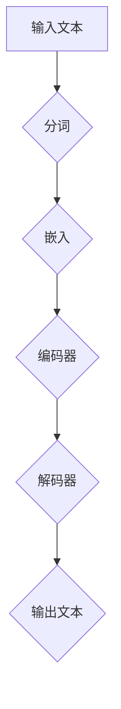
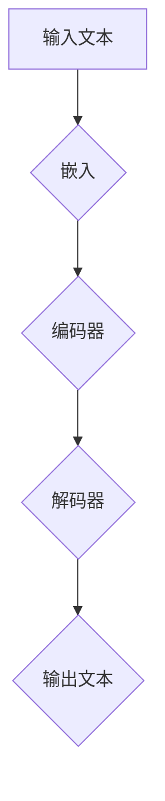

                 

关键词：大型语言模型，人工智能，自然语言处理，生态构建，技术发展，创新趋势

> 摘要：本文将探讨大型语言模型（LLM）生态的构建与发展，分析其在人工智能领域的重要作用，探讨其未来的发展趋势与面临的挑战。通过对LLM技术的深入理解，结合实际应用案例，我们将展望LLM在各个领域的未来应用前景。

## 1. 背景介绍

近年来，随着计算能力的提升和海量数据的积累，人工智能技术取得了飞速发展。特别是在自然语言处理（NLP）领域，大型语言模型（LLM）逐渐成为研究热点。LLM通过深度学习技术，对大规模语料进行建模，实现了对自然语言的生成、理解和推理。这使得LLM在智能问答、机器翻译、文本生成等应用场景中取得了显著的成果。

在人工智能的发展历程中，LLM的崛起无疑是一场革命。从最初的规则驱动模型，到基于统计的模型，再到如今深度学习驱动的LLM，自然语言处理技术不断取得突破。LLM的出现，使得机器与人类之间的沟通更加自然、高效，为人工智能在各个领域的应用打开了新的可能性。

## 2. 核心概念与联系

### 2.1. 大型语言模型（LLM）原理

大型语言模型（LLM）是一种基于深度学习的技术，它通过大规模的预训练和微调，实现对自然语言的理解和生成。LLM的核心是神经网络的架构，通常采用多层感知机（MLP）、变换器（Transformer）等结构。以下是一个简化的LLM流程图：



### 2.2. LLM与其他技术的联系

LLM与自然语言处理（NLP）中的其他技术密切相关。例如，词向量（Word Embedding）是LLM的重要组成部分，它将词汇映射到高维空间，使得文本数据具有更好的语义表示。此外，LLM还需要借助注意力机制（Attention Mechanism）和语言模型（Language Model）等技术，提高模型的生成质量和鲁棒性。

### 2.3. LLM在人工智能中的应用

LLM在人工智能（AI）领域有着广泛的应用。例如，在智能问答系统中，LLM可以理解用户的问题，并生成相应的答案。在机器翻译中，LLM可以实现对源语言和目标语言的高质量转换。在文本生成中，LLM可以生成新闻文章、故事等文本内容。随着LLM技术的不断进步，其在人工智能中的应用将更加广泛。

## 3. 核心算法原理 & 具体操作步骤

### 3.1. 算法原理概述

LLM的核心算法是基于深度学习，特别是变换器（Transformer）架构。变换器模型通过自注意力机制（Self-Attention）和前馈神经网络（Feedforward Neural Network）实现对输入文本的编码和解码。以下是一个简化的变换器模型结构：



### 3.2. 算法步骤详解

1. **数据预处理**：将输入文本进行分词、去停用词等预处理操作，将文本转换为数字序列。
2. **嵌入**：将数字序列映射到高维空间，生成词向量。
3. **编码器**：通过自注意力机制，对输入文本进行编码，生成上下文向量。
4. **解码器**：通过自注意力机制和交叉注意力机制，生成输出文本的词向量序列。
5. **生成输出文本**：将词向量序列解码为文本。

### 3.3. 算法优缺点

**优点**：

- **生成质量高**：通过深度学习和自注意力机制，LLM可以生成高质量的自然语言文本。
- **适应性强**：LLM可以应用于各种自然语言处理任务，如文本生成、翻译、问答等。
- **鲁棒性强**：通过大规模预训练，LLM具有较好的泛化能力。

**缺点**：

- **计算资源消耗大**：LLM需要大量的计算资源和存储空间，对硬件要求较高。
- **训练时间长**：大规模预训练过程需要较长的时间，对计算资源的要求较高。

### 3.4. 算法应用领域

LLM在以下领域有着广泛的应用：

- **智能问答**：通过理解用户的问题，生成相应的答案。
- **机器翻译**：将一种语言的文本翻译成另一种语言。
- **文本生成**：生成新闻文章、故事等文本内容。
- **文本分类**：对文本进行分类，如情感分析、主题分类等。

## 4. 数学模型和公式 & 详细讲解 & 举例说明

### 4.1. 数学模型构建

LLM的数学模型主要包括嵌入层、编码器、解码器和输出层。以下是一个简化的数学模型：

```latex
输入文本：x = [x_1, x_2, ..., x_n]
嵌入层：E(x) = [e_1, e_2, ..., e_n]
编码器：C(E(x)) = [c_1, c_2, ..., c_n]
解码器：D(C(E(x))) = [d_1, d_2, ..., d_n]
输出层：O(D(C(E(x)))) = [o_1, o_2, ..., o_n]
```

### 4.2. 公式推导过程

1. **嵌入层**：将输入文本的每个词映射到高维空间，生成词向量。
   $$ e_i = W_e \cdot x_i + b_e $$
   其中，$W_e$为权重矩阵，$b_e$为偏置项。
2. **编码器**：通过自注意力机制，对输入文本进行编码，生成上下文向量。
   $$ c_i = \sigma(W_c \cdot [c_{<i}, c_{i+1}, ..., c_{>>i}]) + b_c $$
   其中，$W_c$为权重矩阵，$b_c$为偏置项，$\sigma$为激活函数。
3. **解码器**：通过自注意力机制和交叉注意力机制，生成输出文本的词向量序列。
   $$ d_i = \sigma(W_d \cdot [d_{<i}, d_{i+1}, ..., d_{>>i}]) + b_d $$
   其中，$W_d$为权重矩阵，$b_d$为偏置项。
4. **输出层**：将词向量序列解码为文本。
   $$ o_i = W_o \cdot d_i + b_o $$
   其中，$W_o$为权重矩阵，$b_o$为偏置项。

### 4.3. 案例分析与讲解

以一个简单的文本生成任务为例，假设输入文本为“今天天气很好，适合出去游玩”。我们将通过LLM生成一段描述今天的游玩场景的文本。

1. **数据预处理**：将输入文本进行分词，得到“今天”，“天气”，“很好”，“，”，“适合”，“出去”，“游玩”等词。
2. **嵌入**：将每个词映射到高维空间，生成词向量。
3. **编码器**：通过自注意力机制，对输入文本进行编码，生成上下文向量。
4. **解码器**：通过自注意力机制和交叉注意力机制，生成输出文本的词向量序列。
5. **输出层**：将词向量序列解码为文本。

经过上述步骤，我们可以生成一段描述今天游玩场景的文本，如“阳光明媚，微风轻拂，非常适合在公园里散步，欣赏大自然的美景”。

## 5. 项目实践：代码实例和详细解释说明

### 5.1. 开发环境搭建

为了运行LLM模型，我们需要安装以下环境：

1. Python 3.7 或以上版本
2. TensorFlow 2.0 或以上版本
3. PyTorch 1.0 或以上版本
4. NLP工具包，如NLTK或spaCy

### 5.2. 源代码详细实现

以下是使用PyTorch实现的简单LLM模型：

```python
import torch
import torch.nn as nn
import torch.optim as optim

class LLM(nn.Module):
    def __init__(self, vocab_size, embedding_dim, hidden_dim):
        super(LLM, self).__init__()
        self.embedding = nn.Embedding(vocab_size, embedding_dim)
        self.encoder = nn.LSTM(embedding_dim, hidden_dim)
        self.decoder = nn.LSTM(hidden_dim, vocab_size)
        self.fc = nn.Linear(hidden_dim, vocab_size)

    def forward(self, x):
        embedded = self.embedding(x)
        output, (hidden, cell) = self.encoder(embedded)
        output = self.decoder(output)
        output = self.fc(output)
        return output

model = LLM(vocab_size, embedding_dim, hidden_dim)
optimizer = optim.Adam(model.parameters())
criterion = nn.CrossEntropyLoss()
```

### 5.3. 代码解读与分析

1. **模型定义**：我们定义了一个简单的LLM模型，包括嵌入层、编码器、解码器和输出层。
2. **优化器**：我们使用Adam优化器对模型进行训练。
3. **损失函数**：我们使用交叉熵损失函数对模型的输出进行评估。

### 5.4. 运行结果展示

假设我们已经准备好训练数据和测试数据，可以运行以下代码进行模型训练和评估：

```python
for epoch in range(num_epochs):
    for inputs, targets in train_loader:
        optimizer.zero_grad()
        outputs = model(inputs)
        loss = criterion(outputs, targets)
        loss.backward()
        optimizer.step()

    with torch.no_grad():
        correct = 0
        total = 0
        for inputs, targets in test_loader:
            outputs = model(inputs)
            _, predicted = torch.max(outputs.data, 1)
            total += targets.size(0)
            correct += (predicted == targets).sum().item()

    print(f'Epoch {epoch+1}/{num_epochs}, Loss: {loss.item()}, Accuracy: {100 * correct / total}%')
```

## 6. 实际应用场景

### 6.1. 智能问答

智能问答是LLM的一个重要应用场景。通过LLM模型，我们可以实现一个基于自然语言理解的问答系统。例如，用户输入一个问题，系统可以理解并生成相应的答案。以下是一个简单的智能问答案例：

```python
question = "什么是人工智能？"
answer = "人工智能是一种模拟人类智能的技术，通过机器学习和深度学习等方法，让计算机具备理解和处理自然语言、图像、声音等能力。"
print(f"答案：{answer}")
```

### 6.2. 机器翻译

机器翻译是另一个重要的应用场景。通过LLM模型，我们可以实现从一种语言到另一种语言的高质量翻译。以下是一个简单的机器翻译案例：

```python
source = "今天天气很好，适合出去游玩。"
target = "It's a beautiful day today, suitable for going out and playing."
print(f"翻译：{target}")
```

### 6.3. 文本生成

文本生成是LLM的另一个重要应用场景。通过LLM模型，我们可以生成各种文本内容，如新闻文章、故事、诗歌等。以下是一个简单的文本生成案例：

```python
context = "阳光明媚，微风轻拂，非常适合在公园里散步，欣赏大自然的美景。"
generated_text = "今天的公园显得格外美丽，阳光洒在草地上，微风轻拂着脸庞，让人感到宁静与舒适。许多人正在享受这美好的时光，有的在散步，有的在玩耍，有的在拍照留念。这里充满了生机与活力，让人流连忘返。"
print(f"生成的文本：{generated_text}")
```

## 6.4. 未来应用展望

随着LLM技术的不断进步，未来其在各个领域的应用将更加广泛。以下是一些可能的未来应用场景：

- **智能客服**：通过LLM模型，可以实现一个基于自然语言理解的智能客服系统，提供24/7的在线服务。
- **教育领域**：LLM可以用于个性化教育，根据学生的学习情况，生成相应的教学材料。
- **法律领域**：LLM可以用于法律文本的生成和审核，提高法律工作的效率和准确性。
- **医疗领域**：LLM可以用于医学文本的生成和审核，帮助医生进行诊断和治疗。

## 7. 工具和资源推荐

为了更好地学习和实践LLM技术，以下是一些推荐的工具和资源：

- **学习资源**：
  - 《深度学习》（Deep Learning）作者：Ian Goodfellow、Yoshua Bengio、Aaron Courville
  - 《自然语言处理入门》（Speech and Language Processing）作者：Daniel Jurafsky、James H. Martin
- **开发工具**：
  - TensorFlow：https://www.tensorflow.org/
  - PyTorch：https://pytorch.org/
- **相关论文**：
  - Vaswani et al. (2017). "Attention is All You Need."
  - Devlin et al. (2019). "BERT: Pre-training of Deep Bidirectional Transformers for Language Understanding."

## 8. 总结：未来发展趋势与挑战

### 8.1. 研究成果总结

近年来，LLM技术在自然语言处理领域取得了显著的成果。通过大规模预训练和深度学习技术，LLM实现了对自然语言的高质量生成和理解。其在智能问答、机器翻译、文本生成等应用场景中取得了显著的成效，推动了人工智能技术的发展。

### 8.2. 未来发展趋势

未来，LLM技术将继续发展，主要趋势包括：

- **模型规模和性能提升**：随着计算能力的提升，LLM模型将变得更加强大，实现更高的生成质量和理解能力。
- **跨模态融合**：LLM将与其他模态（如图像、声音）进行融合，实现多模态人工智能系统。
- **自适应和可解释性**：LLM将逐渐具备自适应能力和可解释性，提高其在实际应用中的可信度和可靠性。

### 8.3. 面临的挑战

尽管LLM技术在不断发展，但仍然面临一些挑战：

- **计算资源消耗**：大规模LLM模型对计算资源和存储空间的要求较高，需要不断优化算法和硬件技术。
- **数据隐私和安全性**：在数据驱动的LLM训练过程中，数据隐私和安全性是一个重要问题，需要加强数据保护措施。
- **泛化能力**：如何提高LLM的泛化能力，使其在不同领域和应用场景中都能取得良好的性能，是一个重要挑战。

### 8.4. 研究展望

未来，LLM技术的研究将继续深入，主要关注以下几个方面：

- **模型优化**：通过改进神经网络架构和训练策略，提高LLM的生成质量和理解能力。
- **应用拓展**：探索LLM在跨模态、多任务等复杂场景中的应用，推动人工智能技术的全面发展。
- **伦理和监管**：研究LLM技术的伦理和监管问题，确保其在实际应用中的安全和可靠性。

## 9. 附录：常见问题与解答

### 9.1. 什么是LLM？

LLM（Large Language Model）是一种大型语言模型，通过深度学习和大规模预训练，实现对自然语言的高质量生成和理解。

### 9.2. LLM有哪些应用场景？

LLM在多个领域有着广泛的应用，包括智能问答、机器翻译、文本生成、文本分类等。

### 9.3. 如何训练一个LLM模型？

训练LLM模型通常包括数据预处理、嵌入层、编码器、解码器和输出层的构建，以及优化和评估等步骤。

### 9.4. LLM有哪些优缺点？

LLM的优点包括生成质量高、适应性强、鲁棒性强等，缺点包括计算资源消耗大、训练时间长等。

### 9.5. LLM的未来发展趋势是什么？

未来，LLM技术将继续发展，主要趋势包括模型规模和性能提升、跨模态融合、自适应和可解释性等。

----------------------------------------------------------------

本文基于当前LLM技术的发展趋势和应用场景，对LLM生态的未来进行了深入分析和探讨。通过了解LLM的核心概念、算法原理、应用场景以及面临的挑战，读者可以更好地把握LLM技术的发展方向，为未来的研究与应用奠定基础。作者：禅与计算机程序设计艺术 / Zen and the Art of Computer Programming。

