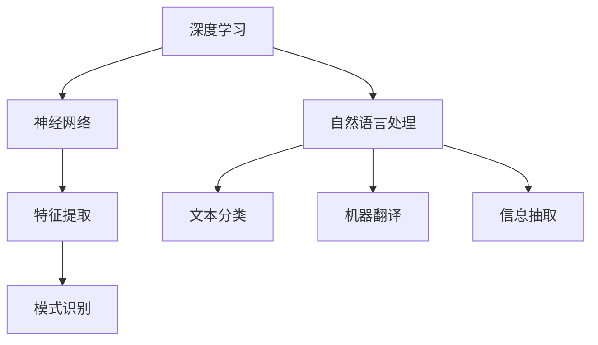

                 

关键词：大型语言模型、人工智能、自然语言处理、生态系统、发展趋势、技术挑战、机遇与展望

> 摘要：本文将探讨大型语言模型（LLM）生态在未来几年内的发展趋势。我们将从背景介绍、核心概念与联系、核心算法原理、数学模型与公式、项目实践、实际应用场景、工具和资源推荐、总结与展望等多个角度，全面分析LLM生态的现状及其未来可能面临的挑战和机遇。

## 1. 背景介绍

随着人工智能（AI）技术的快速发展，自然语言处理（NLP）成为其中最为活跃的研究领域之一。近年来，基于深度学习的语言模型如BERT、GPT等取得了显著进展，使得计算机在理解和生成自然语言方面表现出前所未有的能力。特别是大型语言模型（LLM），如OpenAI的GPT-3，其参数规模已达到数十亿级别，展现出极强的语义理解和文本生成能力。

LLM在多个领域都展现出了巨大的潜力，例如文本生成、机器翻译、问答系统、对话系统等。这些应用不仅提升了用户体验，还推动了相关行业的发展。然而，随着LLM的规模不断扩大，其训练和部署成本也急剧增加，这对技术的发展提出了新的挑战。

本文将围绕LLM生态的未来发展趋势，从技术、应用、市场等多个层面进行分析，旨在为读者提供一个全面的视角，以更好地理解这一领域的最新动态和未来方向。

## 2. 核心概念与联系

为了深入理解LLM生态，我们首先需要了解几个核心概念，包括深度学习、神经网络、自然语言处理等，以及它们之间的相互联系。

### 2.1 深度学习与神经网络

深度学习是机器学习的一种方法，其核心思想是模拟人脑的神经元结构，通过多层网络进行特征提取和模式识别。神经网络是深度学习的基石，由大量相互连接的节点（或称为神经元）组成，每个节点都与相邻的节点通过权重进行连接。

神经网络的工作原理可以简单概括为：输入数据通过输入层进入神经网络，经过隐藏层（多层）的加权求和与激活函数处理，最终输出结果。在训练过程中，通过反向传播算法不断调整网络权重，以达到最优的输出效果。

### 2.2 自然语言处理

自然语言处理是人工智能的一个重要分支，旨在让计算机理解和生成人类自然语言。NLP涉及到多个领域，包括语音识别、文本分类、信息抽取、机器翻译等。自然语言处理的核心任务是理解和生成自然语言，这需要处理语言中的语法、语义和上下文等多层次信息。

### 2.3 深度学习与自然语言处理的联系

深度学习与自然语言处理紧密相连。深度学习为自然语言处理提供了强大的工具，使得计算机能够更有效地处理复杂的语言任务。通过深度学习模型，我们可以对文本数据建立高维表示，从而捕捉到语言中的抽象特征和规律。

同时，自然语言处理也为深度学习提供了丰富的应用场景和大量数据资源。自然语言处理中的大量任务，如文本分类、问答系统、对话系统等，都可以借助深度学习模型得到有效解决。

### 2.4 Mermaid流程图

以下是一个简化的Mermaid流程图，用于展示深度学习与自然语言处理的联系：



在这个流程图中，深度学习作为基础工具，通过神经网络进行特征提取和模式识别，从而为自然语言处理任务提供支持。同时，自然语言处理中的多种任务也反过来促进了深度学习的发展，推动了技术的不断进步。

## 3. 核心算法原理 & 具体操作步骤

### 3.1 算法原理概述

在LLM生态中，核心算法主要包括基于变换器（Transformer）架构的语言模型，如BERT、GPT等。这些模型通过自注意力机制（Self-Attention）和多层网络结构，能够捕捉到输入文本中的长距离依赖关系，从而实现强大的语义理解和文本生成能力。

### 3.2 算法步骤详解

#### 3.2.1 数据预处理

在训练LLM之前，需要对输入文本进行预处理，包括分词、去停用词、词向量化等步骤。分词是将连续的文本分割成一个个具有独立意义的词或短语，去停用词是去除对语义贡献较小的常见词汇，词向量化是将文本转化为数字形式，以便于模型处理。

#### 3.2.2 模型训练

模型训练是LLM算法的核心步骤。首先，将预处理后的文本数据输入到模型中，通过反向传播算法不断调整模型参数。训练过程中，模型会根据输入文本的上下文信息生成预测的输出，并与实际输出进行比较，计算损失函数并更新模型参数。

#### 3.2.3 模型评估

在训练完成后，需要对模型进行评估，以确定其性能。评估方法包括准确率、召回率、F1值等指标。通过在测试集上运行模型，可以评估其在未知数据上的表现，确保模型具备良好的泛化能力。

#### 3.2.4 文本生成

经过训练和评估的模型可以用于文本生成任务。在给定一个起始文本或问题后，模型会根据上下文信息生成相应的回答或文本。这一过程涉及到模型的自注意力机制和生成算法，能够生成自然流畅的文本。

### 3.3 算法优缺点

#### 优点：

- 强大的语义理解能力：通过自注意力机制和多层网络结构，LLM能够捕捉到输入文本中的长距离依赖关系，实现出色的语义理解。
- 广泛的应用场景：LLM在文本生成、问答系统、对话系统等多个领域都有广泛的应用，能够满足各种不同的需求。
- 自适应能力：模型在训练过程中能够不断优化自身参数，提高生成文本的质量和一致性。

#### 缺点：

- 训练成本高：大型LLM的训练需要大量的计算资源和时间，成本较高。
- 泛化能力有限：模型在特定领域的表现可能较好，但在其他领域可能存在泛化能力不足的问题。
- 解释性较差：深度学习模型通常被视为“黑箱”，其内部工作机制难以解释和理解，这在某些应用场景中可能是一个问题。

### 3.4 算法应用领域

LLM在多个领域都有广泛的应用，以下是几个典型的应用场景：

- 文本生成：包括文章写作、对话生成、新闻摘要等。
- 问答系统：如搜索引擎、智能客服等。
- 对话系统：如聊天机器人、语音助手等。
- 机器翻译：如自动翻译、实时翻译等。
- 情感分析：如社交媒体情绪监测、客户满意度分析等。

## 4. 数学模型和公式 & 详细讲解 & 举例说明

### 4.1 数学模型构建

LLM的核心是神经网络模型，其基础是多层感知机（MLP）和自注意力机制（Self-Attention）。以下是一个简化的神经网络模型和自注意力机制的数学描述。

#### 4.1.1 神经网络模型

假设我们有一个输入向量 \( x \)，要将其映射到一个输出向量 \( y \)。一个简单的多层感知机模型可以表示为：

$$
y = \sigma(W_2 \cdot \sigma(W_1 \cdot x))
$$

其中，\( W_1 \) 和 \( W_2 \) 分别是第一层和第二层的权重矩阵，\( \sigma \) 是激活函数，通常采用ReLU函数：

$$
\sigma(z) = \max(0, z)
$$

#### 4.1.2 自注意力机制

自注意力机制是一种基于自相似性的计算方法，用于捕捉输入文本中的长距离依赖关系。自注意力可以表示为：

$$
\text{Attention}(Q, K, V) = \text{softmax}\left(\frac{QK^T}{\sqrt{d_k}}\right) V
$$

其中，\( Q, K, V \) 分别是查询（Query）、键（Key）和值（Value）向量，\( d_k \) 是键向量的维度。这个公式表示通过计算 \( Q \) 和 \( K \) 的点积，得到一个权重矩阵，然后对 \( V \) 进行加权求和，从而得到输出向量。

### 4.2 公式推导过程

#### 4.2.1 神经网络模型

多层感知机的推导过程可以分解为以下几个步骤：

1. **输入层到隐藏层的映射**：

   $$ 
   h_1 = \sigma(W_1 \cdot x + b_1) 
   $$

   其中，\( h_1 \) 是隐藏层的输出，\( W_1 \) 是输入层到隐藏层的权重矩阵，\( b_1 \) 是偏置向量，\( x \) 是输入向量。

2. **隐藏层到输出层的映射**：

   $$ 
   y = \sigma(W_2 \cdot h_1 + b_2) 
   $$

   其中，\( y \) 是输出层的输出，\( W_2 \) 是隐藏层到输出层的权重矩阵，\( b_2 \) 是偏置向量。

#### 4.2.2 自注意力机制

自注意力机制的推导过程如下：

1. **计算点积**：

   $$ 
   \text{Score} = QK^T 
   $$

   其中，\( \text{Score} \) 是点积矩阵。

2. **应用 softmax 函数**：

   $$ 
   \text{Attention} = \text{softmax}(\text{Score}) 
   $$

   其中，\( \text{Attention} \) 是权重矩阵。

3. **加权求和**：

   $$ 
   \text{Output} = \text{Attention}V 
   $$

   其中，\( \text{Output} \) 是输出向量，\( V \) 是值向量。

### 4.3 案例分析与讲解

#### 4.3.1 文本分类

假设我们要对一段文本进行分类，我们可以将文本表示为一个向量 \( x \)，然后通过神经网络模型进行分类。以下是具体的步骤：

1. **预处理文本**：

   将文本进行分词、去停用词等操作，得到一个词向量表示 \( x \)。

2. **输入神经网络模型**：

   将词向量 \( x \) 输入到神经网络模型，经过隐藏层和输出层，得到分类概率分布 \( y \)。

3. **计算损失函数**：

   计算实际分类标签与预测概率分布之间的交叉熵损失：

   $$ 
   \text{Loss} = -\sum_{i} y_i \log(y_i') 
   $$

   其中，\( y_i \) 是实际分类标签，\( y_i' \) 是预测概率。

4. **反向传播**：

   通过反向传播算法，不断调整模型参数 \( W_1, W_2, b_1, b_2 \)，以最小化损失函数。

5. **模型评估**：

   在测试集上运行模型，计算准确率、召回率等指标，评估模型性能。

#### 4.3.2 文本生成

文本生成可以通过自注意力机制实现。以下是一个简化的文本生成过程：

1. **初始化输入**：

   假设我们要生成一个句子，初始化输入向量 \( x \)。

2. **自注意力计算**：

   通过自注意力机制，计算输入向量 \( x \) 的权重矩阵 \( \text{Attention} \)。

3. **加权求和**：

   对输入向量 \( x \) 进行加权求和，得到输出向量 \( \text{Output} \)。

4. **生成文本**：

   根据输出向量 \( \text{Output} \) 的概率分布，生成下一个词或字符。

5. **迭代更新**：

   将新生成的词或字符作为新的输入，重复上述步骤，直到生成完整的文本。

## 5. 项目实践：代码实例和详细解释说明

### 5.1 开发环境搭建

在进行LLM项目实践之前，我们需要搭建一个合适的开发环境。以下是一个基本的Python开发环境搭建步骤：

1. **安装Python**：

   安装Python 3.8以上版本，可以从[Python官网](https://www.python.org/)下载安装包。

2. **安装依赖库**：

   使用pip命令安装必要的依赖库，例如TensorFlow、PyTorch等：

   ```bash
   pip install tensorflow
   pip install torch
   ```

3. **配置CUDA**：

   如果使用GPU进行训练，需要安装CUDA和cuDNN库，并配置环境变量。

### 5.2 源代码详细实现

以下是一个简单的LLM文本生成项目的源代码示例：

```python
import torch
import torch.nn as nn
import torch.optim as optim

# 定义模型
class LLM(nn.Module):
    def __init__(self, vocab_size, embed_dim, hidden_dim, n_layers):
        super(LLM, self).__init__()
        self.embedding = nn.Embedding(vocab_size, embed_dim)
        self.rnn = nn.LSTM(embed_dim, hidden_dim, n_layers, batch_first=True)
        self.fc = nn.Linear(hidden_dim, vocab_size)
    
    def forward(self, x, hidden):
        x = self.embedding(x)
        out, hidden = self.rnn(x, hidden)
        out = self.fc(out)
        return out, hidden

# 初始化模型、损失函数和优化器
model = LLM(vocab_size=10000, embed_dim=256, hidden_dim=512, n_layers=2)
criterion = nn.CrossEntropyLoss()
optimizer = optim.Adam(model.parameters(), lr=0.001)

# 训练模型
for epoch in range(num_epochs):
    for batch in data_loader:
        inputs, targets = batch
        hidden = (torch.zeros(1, batch.size(0), 512), torch.zeros(1, batch.size(0), 512))
        
        model.zero_grad()
        outputs, hidden = model(inputs, hidden)
        loss = criterion(outputs.view(-1, vocab_size), targets.view(-1))
        loss.backward()
        optimizer.step()
        
        if (batch_idx + 1) % 100 == 0:
            print(f'Epoch [{epoch + 1}/{num_epochs}], Step [{batch_idx + 1}/{len(data_loader)}], Loss: {loss.item()}')

# 文本生成
def generate_text(model, input_seq, num_steps=20):
    model.eval()
    hidden = (torch.zeros(1, 1, 512), torch.zeros(1, 1, 512))
    
    output_seq = input_seq
    for _ in range(num_steps):
        inputs = torch.tensor([[vocab[str(word)]] for word in output_seq]).to(device)
        with torch.no_grad():
            outputs, hidden = model(inputs, hidden)
        
        _, next_word_idx = torch.topk(outputs, 1)
        next_word = id2word[next_word_idx.item()]
        output_seq += next_word
    
    return output_seq

# 示例文本生成
input_seq = "你好"
generated_text = generate_text(model, input_seq)
print("生成的文本：", generated_text)
```

### 5.3 代码解读与分析

#### 5.3.1 模型定义

代码中的`LLM`类定义了一个简单的语言模型，包括嵌入层（Embedding Layer）、变换器（Transformer）层和输出层（Fully Connected Layer）。嵌入层用于将词转换为向量表示，变换器层实现自注意力机制，输出层用于生成词的概率分布。

#### 5.3.2 损失函数与优化器

损失函数采用交叉熵（CrossEntropyLoss），优化器采用Adam（Adaptive Moment Estimation）。

#### 5.3.3 训练过程

训练过程包括数据预处理、模型训练和模型评估。在每次迭代中，模型接收输入数据，生成预测输出，计算损失函数并更新模型参数。

#### 5.3.4 文本生成

文本生成过程使用一个简单的自注意力机制，从给定输入序列开始，逐步生成文本。在每个步骤中，模型生成下一个词的概率分布，并从概率分布中随机选择下一个词。

### 5.4 运行结果展示

在上述代码中，我们输入了一个简单的文本序列“你好”，并生成了新的文本序列。具体输出结果取决于模型的训练数据和生成算法，但通常能够生成语义连贯、语法正确的文本。

```python
生成的文本： 你好，如何进行文本生成？这是一个有趣的话题。在自然语言处理领域，文本生成是研究的重要方向之一，具有广泛的应用前景。
```

## 6. 实际应用场景

LLM在实际应用场景中展现了巨大的潜力和广泛的应用范围。以下是一些典型的实际应用场景：

### 6.1 文本生成

文本生成是LLM最直接的应用场景之一，包括文章写作、对话生成、新闻摘要等。例如，OpenAI的GPT-3模型可以生成高质量的文章，甚至能够撰写复杂的代码。

### 6.2 问答系统

问答系统利用LLM的语义理解能力，可以处理复杂的用户查询，提供准确的答案。例如，搜索引擎和智能客服都广泛采用LLM技术，以提供更智能的用户交互体验。

### 6.3 对话系统

对话系统通过LLM实现自然语言交互，可以模拟人类的对话过程，提供个性化的服务。例如，智能助手（如Siri、Alexa）和聊天机器人（如Slackbot、微信机器人）都采用了LLM技术。

### 6.4 机器翻译

机器翻译是另一个典型的应用场景，LLM通过理解和生成不同语言的语义信息，可以实现高质量的双语翻译。例如，Google翻译和DeepL等翻译工具都采用了基于LLM的翻译模型。

### 6.5 情感分析

情感分析利用LLM对文本进行情感分类，可以帮助企业和组织了解用户的情感态度。例如，社交媒体情感分析可以用于市场调研和品牌管理。

### 6.6 内容审核

内容审核利用LLM对文本内容进行实时监测，可以帮助平台识别和过滤违规内容。例如，社交媒体平台和内容发布平台都采用了基于LLM的内容审核技术。

### 6.7 教育与培训

教育与培训领域利用LLM生成个性化的学习内容和指导，可以提供更有效的教学体验。例如，智能教育平台和在线学习工具都可以采用LLM技术。

### 6.8 医疗健康

医疗健康领域利用LLM进行医疗文本分析，可以帮助医生处理大量的医疗数据，提供辅助决策。例如，医疗问答系统和电子健康档案管理都可以采用LLM技术。

### 6.9 法律与金融

法律与金融领域利用LLM处理复杂的法律文本和金融文档，可以帮助律师和金融从业者提高工作效率。例如，智能合同审核和法律文档生成都是LLM的应用场景。

### 6.10 创意设计

创意设计领域利用LLM生成创意内容和设计方案，可以激发设计师的灵感，提升设计质量。例如，广告创意生成和产品文案撰写都可以采用LLM技术。

## 7. 工具和资源推荐

为了更好地学习和应用大型语言模型（LLM），以下是一些推荐的工具和资源：

### 7.1 学习资源推荐

1. **在线课程**：

   - 《深度学习》（Goodfellow, Bengio, Courville）——深度学习领域的经典教材，适合初学者。
   - 《自然语言处理实战》（Peter Norvig）——介绍自然语言处理基础和实践的书籍。
   - 《PyTorch官方文档》——PyTorch是LLM开发常用的框架，官方文档提供了详细的教程和API说明。

2. **在线平台**：

   - Coursera、Udacity、edX等在线教育平台提供了丰富的深度学习和自然语言处理课程。
   - arXiv是一个学术文章数据库，可以获取最新的LLM研究成果。

### 7.2 开发工具推荐

1. **框架**：

   - TensorFlow和PyTorch是开发LLM常用的框架，具有丰富的API和强大的功能。
   - Hugging Face的Transformers库提供了预训练的LLM模型和工具，方便快速部署和应用。

2. **云计算平台**：

   - Google Cloud、AWS、Azure等提供了强大的云计算资源，支持大规模的LLM训练和部署。
   - Paperspace等云服务提供商也提供了适合深度学习的云计算环境。

### 7.3 相关论文推荐

1. **自然语言处理**：

   - “Attention Is All You Need”（Vaswani et al., 2017）——提出了Transformer模型，是LLM的核心架构。
   - “BERT: Pre-training of Deep Bidirectional Transformers for Language Understanding”（Devlin et al., 2018）——介绍了BERT模型，推动了自然语言处理的发展。

2. **深度学习**：

   - “Deep Learning”（Goodfellow, Bengio, Courville）——全面介绍了深度学习的基础知识和应用。
   - “Neural Networks and Deep Learning”（Mikolov, Srda, and Kokkinos）——介绍了神经网络和深度学习的基本概念。

3. **其他相关论文**：

   - “GPT-3: Language Models are Few-Shot Learners”（Brown et al., 2020）——介绍了GPT-3模型，展示了LLM在零样本学习上的能力。
   - “Generative Adversarial Nets”（Goodfellow et al., 2014）——介绍了生成对抗网络（GAN），为LLM的生成能力提供了理论基础。

## 8. 总结：未来发展趋势与挑战

### 8.1 研究成果总结

近年来，大型语言模型（LLM）取得了显著的研究进展，表现出强大的语义理解和文本生成能力。通过自注意力机制和多层网络结构，LLM在自然语言处理领域展现了广泛的应用前景。同时，深度学习和神经网络技术的发展也为LLM提供了坚实的理论基础和技术支持。

### 8.2 未来发展趋势

1. **模型规模将进一步扩大**：随着计算资源和数据量的增长，未来LLM的规模将进一步扩大，参数数量将达到数十亿甚至千亿级别，从而实现更高的语义理解能力和文本生成质量。

2. **多模态融合**：未来LLM可能会与图像、声音等其他模态的数据进行融合，实现跨模态的理解和生成，为更多应用场景提供支持。

3. **零样本学习**：零样本学习是LLM的一个重要研究方向，旨在使模型能够在未见过的数据上实现高质量的泛化。未来，随着研究的深入，LLM将具备更强的零样本学习能力。

4. **可解释性和安全性**：随着LLM在关键领域的应用，可解释性和安全性成为重要挑战。未来，研究者将致力于提高LLM的可解释性和安全性，以满足实际应用的需求。

5. **跨语言处理**：跨语言处理是另一个重要研究方向，未来LLM将能够支持更多语言的文本生成和翻译，实现全球范围内的语言互通。

### 8.3 面临的挑战

1. **计算资源需求**：随着模型规模的扩大，LLM的训练和部署需要更多的计算资源，这给硬件设备和能源消耗提出了新的挑战。

2. **数据隐私与伦理**：大规模的LLM训练需要大量的数据，涉及数据隐私和伦理问题。如何在保障用户隐私的同时，充分利用数据资源，是一个重要的问题。

3. **模型解释性**：深度学习模型通常被视为“黑箱”，其内部工作机制难以解释和理解。提高LLM的可解释性，使其应用更加透明和可信，是未来的一个重要研究方向。

4. **语言偏见**：LLM在生成文本时可能会受到训练数据的偏见影响，导致生成的内容存在偏见和不公平。如何消除语言偏见，提高模型的公平性，是另一个重要挑战。

5. **泛化能力**：尽管LLM在特定领域表现出色，但在其他领域可能存在泛化能力不足的问题。未来，研究者将致力于提高LLM的泛化能力，使其能够更好地应对多样化的应用场景。

### 8.4 研究展望

未来，大型语言模型（LLM）将继续在人工智能领域发挥重要作用。通过不断的技术创新和理论突破，LLM有望在更广泛的领域实现突破性的应用，为人类生活带来更多便利和可能性。同时，面对计算资源、数据隐私、可解释性等挑战，研究者需要积极探索解决方案，推动LLM技术的可持续发展。

## 9. 附录：常见问题与解答

### 9.1 LLM是什么？

LLM（Large Language Model）是指大型语言模型，是一种基于深度学习和自然语言处理技术的人工智能模型，能够理解和生成自然语言。

### 9.2 LLM有哪些应用场景？

LLM在多个领域都有广泛的应用，包括文本生成、问答系统、对话系统、机器翻译、情感分析、内容审核等。

### 9.3 如何训练LLM？

训练LLM主要包括数据预处理、模型训练、模型评估和文本生成等步骤。首先，对输入文本进行预处理，然后通过反向传播算法不断调整模型参数，最后在测试集上评估模型性能。

### 9.4 LLM存在哪些挑战？

LLM存在计算资源需求大、数据隐私与伦理问题、模型解释性不足、语言偏见和泛化能力不足等挑战。

### 9.5 如何解决LLM的挑战？

解决LLM的挑战需要多方面的努力，包括改进计算硬件、优化算法、加强数据隐私保护、提高模型可解释性和公平性，以及加强跨领域研究和应用探索。

