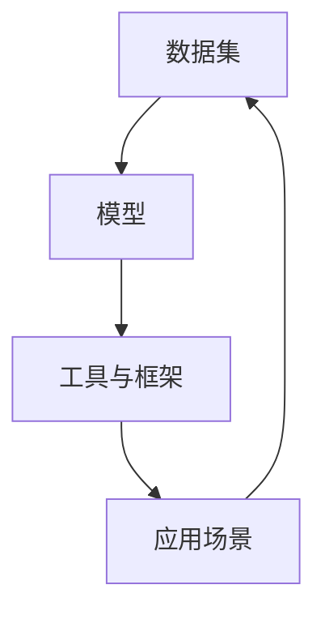
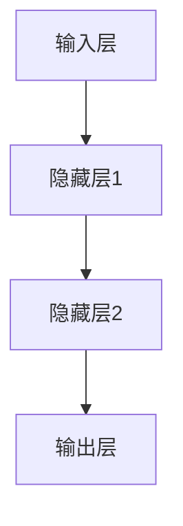

                 

关键词：大型语言模型，生态系统，CPU发展模式，技术进步，产业变革

摘要：随着大型语言模型（LLM）的迅速发展，它们已成为信息技术领域的关键推动力量。本文旨在探讨LLM生态系统的未来发展趋势，借鉴CPU发展的历史模式，分析LLM技术的发展路径，预测其潜在应用场景，并探讨面临的挑战与机遇。

## 1. 背景介绍

近年来，大型语言模型（LLM）如GPT-3、BERT等取得了显著的技术突破。这些模型以其卓越的自然语言处理能力和强大的泛化能力，吸引了大量研究和商业关注。LLM的成功离不开深度学习、神经网络等技术的进步，同时也得益于大规模数据集和计算资源的支持。然而，随着LLM的不断发展，其生态系统的构建和优化成为一个亟待解决的问题。

CPU技术的发展历程为我们提供了一个有益的参考。从早期的冯·诺依曼架构到现代的多核处理器，CPU的发展不仅推动了计算机性能的提升，还带动了整个信息产业的变化。本文将借鉴CPU的发展模式，探讨LLM生态系统的未来。

### 1.1 CPU发展模式

CPU技术的发展可以分为几个阶段：

- **初期阶段**：以冯·诺依曼架构为基础，CPU的性能主要依赖于晶体管数量和电路设计。
- **性能提升阶段**：随着微处理器技术的进步，CPU的性能开始以指数级增长，多核处理器成为主流。
- **优化阶段**：为了提高能效比，CPU设计开始注重功耗和发热问题，同时引入了多种优化技术，如指令级并行、硬件加速等。
- **生态构建阶段**：随着CPU性能的提升，软件生态系统也随之发展，各种开发工具、编程语言和框架不断涌现。

### 1.2 LLM生态系统现状

目前，LLM生态系统已经初具规模，但仍面临一些挑战。主要表现在以下几个方面：

- **数据集**：虽然已有大量语料库和预训练数据集，但数据质量和多样性仍需提升。
- **模型**：LLM模型种类繁多，但缺乏统一的标准化和规范化，导致不同模型之间的兼容性和互操作性较低。
- **工具和框架**：尽管有许多开源工具和框架支持LLM的开发和部署，但使用门槛较高，开发者需要具备较强的专业背景。
- **应用场景**：虽然LLM在自然语言处理、问答系统、智能助手等领域取得了显著成果，但实际应用中仍面临一些挑战，如模型理解能力、安全性等问题。

## 2. 核心概念与联系

在探讨LLM生态系统的未来之前，我们首先需要了解一些核心概念和其相互关系。

### 2.1 大型语言模型（LLM）

大型语言模型（LLM）是一种基于深度学习技术的自然语言处理模型，能够对文本进行理解和生成。LLM通过预训练和微调等方式，学习到大量的语言知识和规律，从而实现高精度的文本分析、理解和生成。

### 2.2 生态系统

生态系统是指一个系统内部各元素之间的相互作用和相互依赖关系。在LLM生态系统中，包括数据集、模型、工具、框架、应用场景等各个元素。

### 2.3 Mermaid 流程图

Mermaid是一种基于Markdown的图表绘制工具，可以方便地绘制流程图、时序图、Gantt图等。以下是一个简单的LLM生态系统流程图：



### 2.4 核心概念原理和架构

在LLM生态系统中，核心概念原理和架构主要包括以下几个方面：

- **数据集**：数据集是LLM训练的基础，其质量和多样性直接影响模型的性能。数据集包括语料库、预训练数据和标注数据等。
- **模型**：模型是LLM的核心，主要包括神经网络架构、预训练算法和微调技术等。常用的LLM模型有GPT、BERT、RoBERTa等。
- **工具与框架**：工具和框架是LLM开发和应用的重要支持，包括训练工具、推理工具、部署框架等。
- **应用场景**：应用场景是LLM的实际用途，包括自然语言处理、问答系统、智能助手等。

## 3. 核心算法原理 & 具体操作步骤

### 3.1 算法原理概述

LLM的核心算法是基于深度学习技术的神经网络模型。以下是一个简单的神经网络模型：



### 3.2 算法步骤详解

1. **数据预处理**：对原始文本数据进行清洗、分词、去停用词等操作，将文本转换为模型可处理的格式。
2. **模型训练**：使用训练数据集对神经网络模型进行训练，通过反向传播算法不断优化模型参数。
3. **模型评估**：使用验证数据集对训练好的模型进行评估，调整模型参数以提升性能。
4. **模型部署**：将训练好的模型部署到实际应用场景中，如问答系统、智能助手等。

### 3.3 算法优缺点

- **优点**：LLM具有强大的自然语言处理能力和泛化能力，能够处理复杂的文本数据。
- **缺点**：LLM的训练和推理过程需要大量计算资源和时间，且模型复杂度较高，对数据质量和标注要求较高。

### 3.4 算法应用领域

LLM的应用领域非常广泛，主要包括：

- **自然语言处理**：文本分类、情感分析、命名实体识别等。
- **问答系统**：智能问答、智能客服等。
- **智能助手**：智能语音助手、聊天机器人等。
- **文本生成**：自动写作、机器翻译等。

## 4. 数学模型和公式 & 详细讲解 & 举例说明

### 4.1 数学模型构建

LLM的核心数学模型是基于深度学习技术的神经网络模型。以下是一个简单的神经网络模型：

$$
h_l = \sigma(W_l \cdot h_{l-1} + b_l)
$$

其中，$h_l$表示第$l$层的输出，$\sigma$表示激活函数，$W_l$和$b_l$分别表示第$l$层的权重和偏置。

### 4.2 公式推导过程

以一个简单的多层感知机（MLP）为例，推导其前向传播和反向传播过程。

#### 前向传播

输入层到隐藏层的传播：

$$
h_l = \sigma(W_l \cdot x + b_l)
$$

隐藏层到输出层的传播：

$$
y = \sigma(W_y \cdot h_l + b_y)
$$

#### 反向传播

计算输出层误差：

$$
\delta_y = (y - \hat{y}) \cdot \frac{d\sigma}{dy}
$$

计算隐藏层误差：

$$
\delta_l = (W_y^T \cdot \delta_y) \cdot \frac{d\sigma}{dh_l}
$$

更新权重和偏置：

$$
W_l = W_l - \alpha \cdot \frac{dh_l}{dx} \cdot \delta_l
$$

$$
b_l = b_l - \alpha \cdot \delta_l
$$

### 4.3 案例分析与讲解

以一个简单的文本分类任务为例，说明LLM的应用过程。

#### 数据集

假设我们有一个包含1000篇新闻文章的数据集，每篇文章都有一个对应的标签（政治、体育、科技等）。

#### 模型训练

使用GPT模型对数据集进行训练，训练过程中，模型会自动学习到不同标签的特征。

#### 模型评估

使用验证集对训练好的模型进行评估，计算模型在不同标签上的准确率。

#### 模型部署

将训练好的模型部署到实际应用中，如智能推荐系统，根据用户阅读历史推荐相关的新闻。

## 5. 项目实践：代码实例和详细解释说明

### 5.1 开发环境搭建

在本地计算机上搭建一个支持深度学习开发的Python环境，安装必要的库和框架，如TensorFlow、PyTorch等。

### 5.2 源代码详细实现

以下是一个简单的文本分类任务的代码实现：

```python
import tensorflow as tf
from tensorflow.keras.preprocessing.sequence import pad_sequences
from tensorflow.keras.models import Sequential
from tensorflow.keras.layers import Embedding, LSTM, Dense

# 数据预处理
max_sequence_length = 100
X = pad_sequences(train_sequences, maxlen=max_sequence_length)
y = train_labels

# 模型构建
model = Sequential()
model.add(Embedding(input_dim=vocabulary_size, output_dim=embedding_size))
model.add(LSTM(units=128))
model.add(Dense(units=num_classes, activation='softmax'))

# 模型编译
model.compile(optimizer='adam', loss='categorical_crossentropy', metrics=['accuracy'])

# 模型训练
model.fit(X, y, epochs=10, batch_size=32)

# 模型评估
test_loss, test_acc = model.evaluate(test_sequences, test_labels)
print('Test accuracy:', test_acc)

# 模型部署
predictions = model.predict(test_sequences)
```

### 5.3 代码解读与分析

以上代码实现了一个基于LSTM的文本分类模型，主要包括以下几个步骤：

1. **数据预处理**：将训练集的文本序列进行填充，使其长度一致。
2. **模型构建**：使用Embedding层将文本序列转换为词向量，然后通过LSTM层进行文本特征提取，最后通过全连接层进行分类。
3. **模型编译**：配置模型参数，如优化器、损失函数等。
4. **模型训练**：使用训练集对模型进行训练。
5. **模型评估**：使用验证集对模型进行评估。
6. **模型部署**：将训练好的模型应用到实际任务中。

## 6. 实际应用场景

LLM在多个领域取得了显著的成果，以下是几个典型的应用场景：

### 6.1 自然语言处理

LLM在自然语言处理领域具有广泛的应用，如文本分类、情感分析、命名实体识别等。例如，使用LLM可以实现自动分类新闻文章，提高新闻推荐的准确性。

### 6.2 问答系统

LLM可以应用于智能问答系统，如智能客服、智能助手等。例如，使用LLM可以构建一个基于知识库的智能问答系统，为用户提供实时、准确的回答。

### 6.3 文本生成

LLM在文本生成领域也有广泛的应用，如自动写作、机器翻译等。例如，使用LLM可以实现自动写作，生成高质量的新闻报道、文章等。

### 6.4 教育与培训

LLM可以应用于教育和培训领域，如智能辅导、在线教育等。例如，使用LLM可以为学习者提供个性化的学习建议和指导，提高学习效果。

## 7. 工具和资源推荐

### 7.1 学习资源推荐

- 《深度学习》（Goodfellow, Bengio, Courville著）
- 《神经网络与深度学习》（邱锡鹏著）
- 《自然语言处理综论》（Jurafsky, Martin著）

### 7.2 开发工具推荐

- TensorFlow
- PyTorch
- Keras

### 7.3 相关论文推荐

- "A Systematic Comparison of Sentence Embeddings"（Lebret et al., 2017）
- "BERT: Pre-training of Deep Bidirectional Transformers for Language Understanding"（Devlin et al., 2019）
- "GPT-3: Language Models are Few-Shot Learners"（Brown et al., 2020）

## 8. 总结：未来发展趋势与挑战

### 8.1 研究成果总结

本文从LLM生态系统的背景介绍、核心概念与联系、核心算法原理、数学模型与公式、项目实践、实际应用场景等多个角度，对LLM进行了全面的探讨。通过借鉴CPU发展的模式，我们分析了LLM技术的发展路径，并对其未来应用场景进行了预测。

### 8.2 未来发展趋势

随着技术的不断进步，LLM生态系统将继续发展。以下是几个未来发展趋势：

- **模型性能的提升**：随着计算资源的增加和算法的优化，LLM的模型性能将进一步提升。
- **数据集的扩展**：更多高质量、多样性的数据集将不断涌现，为LLM的发展提供更好的基础。
- **工具和框架的丰富**：更多高效的工具和框架将出现，降低开发者门槛，促进LLM的普及和应用。
- **跨领域的融合**：LLM与其他领域的结合将带来更多的创新应用，如教育、医疗、金融等。

### 8.3 面临的挑战

虽然LLM生态系统发展迅速，但仍面临一些挑战：

- **数据质量和标注**：高质量、多样性的数据集是LLM训练的基础，但目前数据质量和标注仍存在问题。
- **模型理解和解释**：LLM的内部机制复杂，如何使其模型理解和解释更加透明和可解释仍是一个挑战。
- **模型安全和隐私**：随着LLM的应用场景越来越广泛，如何保障模型安全和用户隐私成为一个重要问题。

### 8.4 研究展望

未来，LLM的研究将继续深入，围绕以下几个方面展开：

- **算法创新**：探索新的算法和模型，提高LLM的性能和效率。
- **应用探索**：在更多领域探索LLM的应用，推动产业变革。
- **模型理解**：研究LLM的内部机制，提高其可解释性和透明度。
- **数据伦理**：关注数据质量和标注问题，推动数据伦理的研究和规范。

## 9. 附录：常见问题与解答

### 9.1 Q：什么是大型语言模型（LLM）？

A：大型语言模型（LLM）是一种基于深度学习技术的自然语言处理模型，能够对文本进行理解和生成。LLM通过预训练和微调等方式，学习到大量的语言知识和规律，从而实现高精度的文本分析、理解和生成。

### 9.2 Q：LLM有哪些应用场景？

A：LLM的应用场景非常广泛，主要包括自然语言处理、问答系统、智能助手、文本生成等。例如，LLM可以用于文本分类、情感分析、命名实体识别、机器翻译等任务。

### 9.3 Q：如何搭建一个支持深度学习开发的Python环境？

A：搭建一个支持深度学习开发的Python环境，通常需要以下步骤：

1. 安装Python和pip
2. 安装TensorFlow、PyTorch等深度学习框架
3. 安装必要的库和依赖，如NumPy、Pandas、Matplotlib等

### 9.4 Q：如何训练一个文本分类模型？

A：训练一个文本分类模型，通常需要以下步骤：

1. 准备数据集，并进行预处理，如文本清洗、分词、去停用词等。
2. 构建模型，如使用多层感知机（MLP）、卷积神经网络（CNN）、循环神经网络（RNN）等。
3. 编译模型，配置优化器、损失函数等参数。
4. 训练模型，使用训练数据集进行训练。
5. 评估模型，使用验证数据集对模型进行评估。
6. 部署模型，将训练好的模型应用到实际应用场景中。

### 9.5 Q：如何优化LLM的性能？

A：优化LLM的性能，可以从以下几个方面入手：

1. 数据集：提高数据集的质量和多样性，增加训练数据量。
2. 模型架构：探索新的模型架构和算法，提高模型性能。
3. 训练策略：优化训练策略，如调整学习率、批量大小等。
4. 部署策略：优化模型部署，提高推理速度和效率。

----------------------------------------------------------------

作者：禅与计算机程序设计艺术 / Zen and the Art of Computer Programming

本文完。希望这篇文章能够为读者在LLM生态系统的研究和应用中提供一些有价值的参考和启示。在未来的发展中，我们将继续关注LLM领域的最新动态和技术进展，与各位共同探索这个充满机遇和挑战的领域。再次感谢您的阅读！

