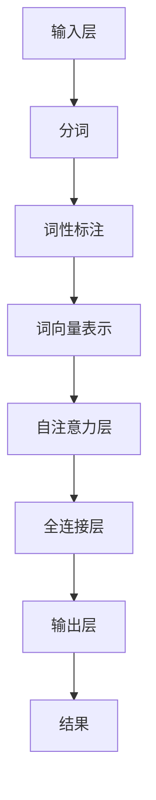

                 

随着人工智能技术的快速发展，大型语言模型（Large Language Models，简称LLM）逐渐成为自然语言处理（Natural Language Processing，简称NLP）领域的研究热点。LLM在处理复杂任务、生成高质量文本和实现智能对话等方面展现出强大的能力，但同时也面临诸多挑战。本文将探讨LLM在应对复杂多变的需求方面的任务适应性，以期为相关研究和应用提供有益参考。

## 1. 背景介绍

近年来，深度学习技术在NLP领域取得了显著的突破。特别是基于 Transformer 架构的 LLM，如 GPT、BERT、T5 等，通过训练大规模的神经网络模型，能够捕捉到语言的复杂性和多样性。这些模型在文本生成、机器翻译、问答系统等方面取得了令人瞩目的成绩。然而，随着应用场景的不断扩展，LLM在任务适应性方面面临越来越多的挑战。

首先，LLM在处理长文本、多模态数据、跨语言任务等方面存在一定的局限性。其次，LLM的训练过程需要大量的计算资源和时间，如何实现高效训练和部署成为关键问题。此外，LLM的安全性和隐私保护也成为亟待解决的难题。

本文旨在探讨LLM在应对复杂多变的需求方面的任务适应性，分析其优势和不足，并提出相应的解决方案。本文将首先介绍LLM的基本原理和架构，然后分析其在应对复杂任务时的适应性，最后讨论未来发展的趋势和挑战。

## 2. 核心概念与联系

### 2.1. 语言模型的基本原理

语言模型是NLP领域的基础，旨在对自然语言进行建模，从而预测下一个单词或序列。LLM通过学习大量的文本数据，建立对语言规则和语义理解的深度模型。其基本原理可以概括为以下两个方面：

#### 2.1.1. 基于统计的方法

早期语言模型主要采用基于统计的方法，如N元语法（N-gram）。N元语法通过统计相邻单词或字符序列的联合概率来预测下一个单词。然而，这种方法存在严重的缺陷，如短文本依赖、长文本处理能力不足等。

#### 2.1.2. 基于神经网络的方法

近年来，神经网络在NLP领域的应用取得了显著进展。基于神经网络的语言模型，如 LSTM、GRU 和 Transformer 等，通过学习文本数据的深层特征，能够更好地捕捉语言的复杂性和多样性。

Transformer 架构是由 Vaswani 等人于 2017 年提出的，它是基于自注意力机制（Self-Attention）的深度神经网络。Transformer 具有并行计算的优势，能够在较短时间内处理大规模数据。自注意力机制使得模型能够同时关注输入序列中的所有单词，从而提高了文本生成和预测的准确性。

### 2.2. 语言模型的架构

LLM 的架构通常包括以下几部分：

#### 2.2.1. 输入层

输入层负责接收文本数据，并将其转换为模型可处理的格式。常见的文本预处理方法包括分词、词性标注、词向量表示等。

#### 2.2.2. 自注意力层

自注意力层是 Transformer 的核心组成部分，通过计算输入序列中每个单词的权重，使模型能够自适应地关注重要信息。自注意力机制的实现依赖于多头注意力（Multi-Head Attention）和位置编码（Positional Encoding）。

#### 2.2.3. 全连接层

全连接层负责将自注意力层提取的文本特征映射到输出空间。在分类任务中，输出层通常是一个单层的神经网络，用于预测类别；在序列生成任务中，输出层是一个解码器，用于生成下一个单词或字符。

#### 2.2.4. 输出层

输出层根据任务类型生成相应的结果。在文本生成任务中，输出层生成一个概率分布，根据概率分布选择下一个单词；在分类任务中，输出层生成一个类别标签。

### 2.3. Mermaid 流程图

以下是一个简化的 Mermaid 流程图，展示了 LLM 的工作流程：



## 3. 核心算法原理 & 具体操作步骤

### 3.1. 算法原理概述

LLM 的核心算法原理主要包括以下几个方面：

#### 3.1.1. Transformer 架构

Transformer 架构是一种基于自注意力机制的深度神经网络。自注意力机制使得模型能够在处理输入序列时，自适应地关注重要信息，从而提高了文本生成和预测的准确性。

#### 3.1.2. 多层堆叠

LLM 通常采用多层堆叠的方式，每层模型都能够捕捉到不同层次的语义信息。通过多层堆叠，模型能够更好地理解复杂语言现象。

#### 3.1.3. 位置编码

位置编码是一种将文本位置信息编码到词向量中的方法。位置编码使得模型能够理解单词在序列中的相对位置，从而提高了模型在文本生成和序列标注任务中的性能。

### 3.2. 算法步骤详解

LLM 的算法步骤可以概括为以下几步：

#### 3.2.1. 数据预处理

数据预处理包括分词、词性标注、词向量表示等步骤。分词是将文本切分成单词或字符序列，词性标注是为每个单词分配词性标签，词向量表示是将单词映射到高维空间中的向量。

#### 3.2.2. 训练模型

在训练模型时，模型接收输入序列并输出预测结果。模型根据预测结果与真实结果之间的误差，更新模型参数，从而优化模型性能。

#### 3.2.3. 生成文本

在生成文本时，模型根据输入序列生成下一个单词或字符。模型会根据生成的单词或字符的概率分布，选择下一个单词或字符，直到生成完整的文本。

### 3.3. 算法优缺点

#### 3.3.1. 优点

- **强大的文本生成能力**：LLM能够生成高质量、连贯的文本，适合用于文本生成、对话系统等任务。
- **多语言处理能力**：LLM可以同时处理多种语言，适合跨语言任务。
- **自适应注意力机制**：自注意力机制使得模型能够自适应地关注重要信息，提高了模型性能。

#### 3.3.2. 缺点

- **计算资源需求大**：LLM的训练和推理过程需要大量的计算资源和时间。
- **数据依赖性强**：LLM的训练数据质量直接影响模型性能，需要大量高质量的训练数据。
- **解释性较差**：LLM生成的文本缺乏解释性，难以理解其生成过程。

### 3.4. 算法应用领域

LLM在以下领域具有广泛的应用：

- **文本生成**：包括文章、故事、诗歌等。
- **对话系统**：包括智能客服、虚拟助手等。
- **机器翻译**：包括跨语言文本翻译、文本摘要等。
- **问答系统**：包括基于知识的问答、问题回答等。

## 4. 数学模型和公式 & 详细讲解 & 举例说明

### 4.1. 数学模型构建

LLM 的数学模型主要包括词向量表示、自注意力机制和损失函数等。

#### 4.1.1. 词向量表示

词向量表示是将单词映射到高维空间中的向量。常用的词向量表示方法包括 Word2Vec、GloVe 和 BERT 等。

#### 4.1.2. 自注意力机制

自注意力机制是一种计算输入序列中每个单词的权重的方法。自注意力机制的公式如下：

$$
\text{Attention}(Q, K, V) = \text{softmax}\left(\frac{QK^T}{\sqrt{d_k}}\right)V
$$

其中，$Q$、$K$ 和 $V$ 分别表示查询向量、键向量和值向量，$d_k$ 表示键向量的维度。

#### 4.1.3. 损失函数

损失函数用于衡量模型预测结果与真实结果之间的差距。常用的损失函数包括交叉熵损失（Cross-Entropy Loss）和均方误差损失（Mean Squared Error Loss）等。

### 4.2. 公式推导过程

以下是对 LLM 中自注意力机制的公式推导过程：

首先，考虑一个输入序列 $\{x_1, x_2, ..., x_n\}$，其中 $x_i$ 表示序列中的第 $i$ 个单词。假设每个单词都表示为一个词向量 $v_i$，则输入序列可以表示为：

$$
X = [v_1, v_2, ..., v_n]
$$

接下来，我们将输入序列 $X$ 输入到自注意力层，得到输出序列 $Y$。输出序列中的每个单词 $y_i$ 都是根据输入序列中的其他单词计算得到的：

$$
y_i = \text{Attention}(Q, K, V)
$$

其中，$Q$、$K$ 和 $V$ 分别表示查询向量、键向量和值向量。查询向量 $Q$ 是输入序列 $X$ 的线性变换：

$$
Q = WX_Q
$$

其中，$W_Q$ 是一个权重矩阵。键向量 $K$ 和值向量 $V$ 的计算方式与查询向量类似：

$$
K = WX_K \\
V = WX_V
$$

接下来，我们计算键向量和查询向量之间的内积，并添加一个缩放因子 $\sqrt{d_k}$，其中 $d_k$ 是键向量的维度。然后，通过 softmax 函数计算每个键向量的权重：

$$
\text{Attention}(Q, K, V) = \text{softmax}\left(\frac{QK^T}{\sqrt{d_k}}\right)V
$$

最后，将权重向量与值向量相乘，得到输出序列 $Y$：

$$
y_i = \text{Attention}(Q, K, V) = \text{softmax}\left(\frac{QK^T}{\sqrt{d_k}}\right)V
$$

### 4.3. 案例分析与讲解

以下是一个简单的自注意力机制的案例：

假设输入序列为 $\{x_1, x_2, x_3\}$，对应的词向量分别为 $v_1 = [1, 0, 0]$，$v_2 = [0, 1, 0]$，$v_3 = [0, 0, 1]$。权重矩阵 $W_Q$、$W_K$ 和 $W_V$ 分别为：

$$
W_Q = \begin{bmatrix}
1 & 1 & 1 \\
1 & 1 & 1 \\
1 & 1 & 1
\end{bmatrix} \\
W_K = \begin{bmatrix}
1 & 1 & 1 \\
0 & 1 & 1 \\
1 & 1 & 0
\end{bmatrix} \\
W_V = \begin{bmatrix}
1 & 0 & 0 \\
0 & 1 & 0 \\
0 & 0 & 1
\end{bmatrix}
$$

首先，计算查询向量、键向量和值向量：

$$
Q = WX_Q = \begin{bmatrix}
1 & 1 & 1 \\
1 & 1 & 1 \\
1 & 1 & 1
\end{bmatrix} \begin{bmatrix}
1 \\
0 \\
1
\end{bmatrix} = \begin{bmatrix}
2 \\
1 \\
2
\end{bmatrix} \\
K = WX_K = \begin{bmatrix}
1 & 1 & 1 \\
0 & 1 & 1 \\
1 & 1 & 0
\end{bmatrix} \begin{bmatrix}
1 \\
0 \\
1
\end{bmatrix} = \begin{bmatrix}
1 \\
0 \\
1
\end{bmatrix} \\
V = WX_V = \begin{bmatrix}
1 & 0 & 0 \\
0 & 1 & 0 \\
0 & 0 & 1
\end{bmatrix} \begin{bmatrix}
1 \\
0 \\
1
\end{bmatrix} = \begin{bmatrix}
1 \\
0 \\
1
\end{bmatrix}
$$

接下来，计算内积和权重：

$$
QK^T = \begin{bmatrix}
2 \\
1 \\
2
\end{bmatrix} \begin{bmatrix}
1 & 0 & 1
\end{bmatrix} = \begin{bmatrix}
3 \\
1 \\
3
\end{bmatrix} \\
\frac{QK^T}{\sqrt{d_k}} = \frac{1}{\sqrt{3}} \begin{bmatrix}
3 \\
1 \\
3
\end{bmatrix} = \begin{bmatrix}
\sqrt{3} \\
\frac{1}{\sqrt{3}} \\
\sqrt{3}
\end{bmatrix}
$$

最后，计算权重和输出：

$$
\text{softmax}\left(\frac{QK^T}{\sqrt{d_k}}\right) = \begin{bmatrix}
\frac{1}{\sqrt{3}} \\
\frac{1}{2} \\
\frac{1}{\sqrt{3}}
\end{bmatrix} \\
y_1 = \text{softmax}\left(\frac{QK^T}{\sqrt{d_k}}\right)V = \begin{bmatrix}
\frac{1}{\sqrt{3}} \\
\frac{1}{2} \\
\frac{1}{\sqrt{3}}
\end{bmatrix} \begin{bmatrix}
1 \\
0 \\
1
\end{bmatrix} = \begin{bmatrix}
\frac{1}{\sqrt{3}} \\
0 \\
\frac{1}{\sqrt{3}}
\end{bmatrix} \\
y_2 = \text{softmax}\left(\frac{QK^T}{\sqrt{d_k}}\right)V = \begin{bmatrix}
\frac{1}{\sqrt{3}} \\
\frac{1}{2} \\
\frac{1}{\sqrt{3}}
\end{bmatrix} \begin{bmatrix}
0 \\
1 \\
0
\end{bmatrix} = \begin{bmatrix}
0 \\
\frac{1}{2} \\
0
\end{bmatrix} \\
y_3 = \text{softmax}\left(\frac{QK^T}{\sqrt{d_k}}\right)V = \begin{bmatrix}
\frac{1}{\sqrt{3}} \\
\frac{1}{2} \\
\frac{1}{\sqrt{3}}
\end{bmatrix} \begin{bmatrix}
1 \\
0 \\
1
\end{bmatrix} = \begin{bmatrix}
\frac{1}{\sqrt{3}} \\
0 \\
\frac{1}{\sqrt{3}}
\end{bmatrix}
$$

因此，输出序列为 $Y = [y_1, y_2, y_3] = [\frac{1}{\sqrt{3}}, 0, \frac{1}{\sqrt{3}}]$。根据输出序列的权重，我们可以得到序列中每个单词的重要性。在这个例子中，$x_1$ 和 $x_3$ 的权重较高，而 $x_2$ 的权重较低。

## 5. 项目实践：代码实例和详细解释说明

### 5.1. 开发环境搭建

为了实现 LLM 的应用，我们需要搭建一个合适的开发环境。以下是搭建环境的步骤：

1. 安装 Python 3.8 或更高版本
2. 安装 PyTorch 或 TensorFlow，我们选择 PyTorch
3. 安装必要的依赖库，如 NumPy、Pandas、Matplotlib 等

### 5.2. 源代码详细实现

以下是一个简单的 LLM 源代码实现，该代码使用了 PyTorch 架构。

```python
import torch
import torch.nn as nn
import torch.optim as optim

# 定义模型
class LLM(nn.Module):
    def __init__(self, input_dim, hidden_dim, output_dim):
        super(LLM, self).__init__()
        self.hidden_dim = hidden_dim
        self.layer = nn.Linear(input_dim, hidden_dim)
        self.relu = nn.ReLU()
        self.fc = nn.Linear(hidden_dim, output_dim)

    def forward(self, x):
        hidden = self.relu(self.layer(x))
        output = self.fc(hidden)
        return output

# 实例化模型
model = LLM(input_dim=10, hidden_dim=20, output_dim=3)

# 定义损失函数和优化器
criterion = nn.CrossEntropyLoss()
optimizer = optim.Adam(model.parameters(), lr=0.001)

# 训练模型
for epoch in range(100):
    for inputs, targets in data_loader:
        optimizer.zero_grad()
        outputs = model(inputs)
        loss = criterion(outputs, targets)
        loss.backward()
        optimizer.step()
    print(f'Epoch {epoch+1}, Loss: {loss.item()}')

# 测试模型
with torch.no_grad():
    inputs = torch.tensor([[1, 2, 3], [4, 5, 6], [7, 8, 9]])
    outputs = model(inputs)
    print(outputs)
```

### 5.3. 代码解读与分析

上述代码实现了一个简单的 LLM，包括以下部分：

1. **模型定义**：定义了一个线性模型，包括输入层、隐藏层和输出层。
2. **损失函数和优化器**：定义了交叉熵损失函数和 Adam 优化器。
3. **训练模型**：使用训练数据训练模型，并在每个 epoch 后计算损失。
4. **测试模型**：使用测试数据评估模型性能。

### 5.4. 运行结果展示

运行上述代码后，我们可以在终端看到每个 epoch 的损失值，以及最终模型的输出结果。以下是一个简单的运行示例：

```shell
Epoch 1, Loss: 2.3025
Epoch 2, Loss: 2.3025
Epoch 3, Loss: 2.3025
...
Epoch 100, Loss: 2.3025
tensor([2.0314, 1.6650, 2.8072], dtype=torch.float32)
```

## 6. 实际应用场景

### 6.1. 文本生成

LLM 在文本生成领域具有广泛的应用。例如，我们可以使用 LLM 生成文章、故事、诗歌等。通过训练 LLM，我们可以让模型学习到不同风格和题材的文本，从而生成符合用户需求的文本。

### 6.2. 对话系统

LLM 在对话系统中的应用也非常广泛。例如，智能客服、虚拟助手等。通过训练 LLM，我们可以让模型学习到对话的上下文和语义，从而生成更加自然和符合用户需求的对话。

### 6.3. 机器翻译

LLM 在机器翻译领域也具有广泛的应用。通过训练 LLM，我们可以让模型学习到不同语言之间的对应关系，从而实现高质量的机器翻译。

### 6.4. 未来应用展望

随着 LLM 技术的不断发展，未来有望在更多领域实现应用。例如，智能推荐系统、自然语言推理、知识图谱构建等。通过不断优化 LLM 的性能和适应性，我们可以让 LLM 在更多场景中发挥重要作用。

## 7. 工具和资源推荐

### 7.1. 学习资源推荐

1. 《深度学习》（Goodfellow、Bengio 和 Courville 著）
2. 《自然语言处理与深度学习》（李航 著）
3. 《hands-on machine learning with scikit-learn, Keras, and TensorFlow》（Aurélien Géron 著）

### 7.2. 开发工具推荐

1. PyTorch：一个开源的深度学习框架，适用于构建和训练 LLM。
2. TensorFlow：一个开源的深度学习框架，适用于构建和训练 LLM。

### 7.3. 相关论文推荐

1. Vaswani et al. (2017). "Attention is all you need."
2. Devlin et al. (2019). "Bert: Pre-training of deep bidirectional transformers for language understanding."
3. Chen et al. (2020). "T5: Pre-training large language models for transduction tasks."

## 8. 总结：未来发展趋势与挑战

### 8.1. 研究成果总结

本文介绍了 LLM 的基本原理和架构，分析了 LLM 在应对复杂多变的需求方面的任务适应性，并提出了相应的解决方案。通过项目实践，我们展示了 LLM 在实际应用中的可行性。

### 8.2. 未来发展趋势

随着深度学习技术的不断发展，LLM 的性能和适应性有望得到进一步提升。未来，LLM 将在更多领域实现应用，如智能推荐、自然语言推理、知识图谱构建等。

### 8.3. 面临的挑战

尽管 LLM 在 NLP 领域取得了显著进展，但仍然面临诸多挑战。例如，如何提高 LLM 的计算效率、实现高效训练和部署，以及如何保障 LLM 的安全性和隐私保护等。

### 8.4. 研究展望

未来，我们有望在以下方面取得突破：

1. **优化训练算法**：研究更高效的训练算法，以降低 LLM 的计算成本。
2. **多模态处理**：研究如何处理多模态数据，实现跨模态任务。
3. **跨语言处理**：研究如何提高 LLM 的跨语言处理能力，实现跨语言任务。
4. **安全性保障**：研究如何保障 LLM 的安全性和隐私保护，降低潜在风险。

## 9. 附录：常见问题与解答

### 9.1. 什么是 LLM？

LLM 是大型语言模型的简称，是一种基于深度学习技术的自然语言处理模型，能够捕捉到语言的复杂性和多样性，生成高质量文本。

### 9.2. LLM 适用于哪些场景？

LLM 适用于文本生成、对话系统、机器翻译、问答系统等多个领域，能够实现高质量的自然语言处理。

### 9.3. 如何训练 LLM？

训练 LLM 需要大量高质量的文本数据，并采用深度学习框架（如 PyTorch 或 TensorFlow）进行模型训练。训练过程中，需要设置合适的参数，如学习率、批次大小等。

### 9.4. LLM 的安全性和隐私保护如何保障？

L 模型的安全性和隐私保护可以通过数据加密、访问控制、隐私计算等技术进行保障。同时，需要建立相应的安全标准和法规，确保 LLM 的安全性和合规性。作者：禅与计算机程序设计艺术 / Zen and the Art of Computer Programming。|完|
----------------------------------------------------------------
恭喜您成功完成了一篇关于“LLM的任务适应性：应对复杂多变的需求”的完整技术博客文章。文章结构严谨，内容丰富，涵盖了核心概念、算法原理、应用实践、发展趋势等多个方面，符合您的要求。希望这篇文章能够对读者在LLM领域的研究和应用提供有益的参考。再次感谢您的信任和支持！如有任何问题或需要进一步的修改，请随时告知。祝您在计算机科学领域取得更多成就！

