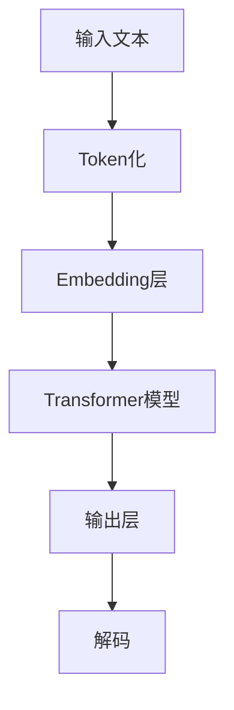

                 

关键词：LLM，伦理问题，现状，未来，人工智能，责任，隐私，公平性

> 摘要：随着大规模语言模型（LLM）在各个领域的广泛应用，其伦理问题逐渐成为关注的焦点。本文将探讨LLM在当前的应用现状，分析其面临的伦理挑战，并探讨未来的发展趋势与解决方案。

## 1. 背景介绍

近年来，人工智能领域取得了显著进展，尤其是大规模语言模型（LLM）如GPT、BERT等，它们在各种任务中表现出了卓越的性能。LLM的强大功能引发了广泛关注，但同时也引发了一系列伦理问题。本文将围绕LLM的伦理问题展开讨论，旨在分析当前现状，探讨未来可能的解决方案。

## 2. 核心概念与联系

### 2.1. 大规模语言模型概述

大规模语言模型（LLM）是基于神经网络的技术，通过学习大量文本数据，使其能够生成或理解自然语言。LLM的关键特性包括：

- **强大的文本生成能力**：LLM可以生成连贯、有逻辑的文本，甚至能够模拟人类对话。
- **自适应学习**：LLM可以通过不断学习新数据，提高其语言理解和生成能力。

### 2.2. LLM架构与工作原理

LLM的架构通常基于Transformer模型，这是一种自注意力机制，使得模型能够处理长文本序列。以下是一个简单的LLM架构示意图：



### 2.3. LLM与伦理问题

LLM的广泛应用带来了巨大的便利，但同时也引发了诸多伦理问题，包括：

- **隐私问题**：LLM在训练过程中需要大量数据，这些数据可能包含用户的敏感信息。
- **偏见问题**：如果训练数据存在偏见，LLM可能会放大这些偏见。
- **责任问题**：当LLM在应用中出现错误或不当行为时，如何界定责任成为一个难题。

## 3. 核心算法原理 & 具体操作步骤

### 3.1. 算法原理概述

LLM的核心算法是Transformer模型，它基于自注意力机制，能够捕捉长文本序列中的依赖关系。Transformer模型主要由编码器和解码器组成，编码器将输入文本映射为向量序列，解码器则根据这些向量生成输出文本。

### 3.2. 算法步骤详解

1. **Token化**：将输入文本划分为单词或子词（token）。
2. **Embedding层**：将每个token映射为向量。
3. **编码器**：通过自注意力机制处理输入文本，生成编码后的向量序列。
4. **解码器**：根据编码后的向量序列生成输出文本。

### 3.3. 算法优缺点

**优点**：

- **强大的文本生成能力**：能够生成连贯、有逻辑的文本。
- **自适应学习**：通过不断学习新数据，提高其性能。

**缺点**：

- **计算资源需求大**：Transformer模型需要大量计算资源。
- **数据隐私问题**：训练过程中可能涉及敏感数据。

### 3.4. 算法应用领域

LLM的应用领域广泛，包括自然语言处理、对话系统、文本生成等。以下是一些具体应用实例：

- **自然语言处理**：用于文本分类、情感分析等任务。
- **对话系统**：应用于聊天机器人、虚拟助手等场景。
- **文本生成**：用于生成新闻文章、博客内容等。

## 4. 数学模型和公式 & 详细讲解 & 举例说明

### 4.1. 数学模型构建

LLM的数学模型主要基于自注意力机制和门控循环单元（GRU）或长短期记忆网络（LSTM）。以下是一个简化的数学模型：

$$
\text{Attention}(Q, K, V) = \frac{softmax(\text{scores})} { \sqrt{d_k}} V
$$

其中，$Q, K, V$ 分别表示查询、键和值向量，$d_k$ 是键向量的维度。

### 4.2. 公式推导过程

假设我们有两个输入序列 $X$ 和 $Y$，它们分别由 $n$ 个和 $m$ 个单词组成。我们可以通过以下步骤进行注意力机制的计算：

1. **计算查询、键和值**：

$$
Q = \text{Query}(X) \\
K = \text{Key}(Y) \\
V = \text{Value}(Y)
$$

2. **计算注意力得分**：

$$
\text{scores} = QK^T
$$

3. **计算注意力权重**：

$$
\text{weights} = softmax(\text{scores})
$$

4. **计算输出**：

$$
\text{output} = \text{weights}V
$$

### 4.3. 案例分析与讲解

假设我们有一个简化的文本序列 $X = [\text{"Hello"}, \text{"world"}]$ 和 $Y = [\text{"Hello"}, \text{"AI"}]$，我们可以通过上述步骤计算注意力权重和输出：

1. **计算查询、键和值**：

$$
Q = \text{Query}(X) = [\text{0.1}, \text{0.9}] \\
K = \text{Key}(Y) = [\text{0.8}, \text{0.2}] \\
V = \text{Value}(Y) = [\text{0.4}, \text{0.6}]
$$

2. **计算注意力得分**：

$$
\text{scores} = QK^T = \begin{bmatrix} 0.1 & 0.9 \end{bmatrix} \begin{bmatrix} 0.8 \\ 0.2 \end{bmatrix} = [0.08, 0.18]
$$

3. **计算注意力权重**：

$$
\text{weights} = softmax(\text{scores}) = [0.7, 0.3]
$$

4. **计算输出**：

$$
\text{output} = \text{weights}V = [0.7 \times 0.4, 0.3 \times 0.6] = [0.28, 0.18]
$$

## 5. 项目实践：代码实例和详细解释说明

### 5.1. 开发环境搭建

为了实现LLM，我们需要搭建一个合适的环境。以下是一个简单的步骤：

1. **安装Python**：确保安装了Python 3.6及以上版本。
2. **安装TensorFlow**：通过pip安装TensorFlow。

```bash
pip install tensorflow
```

### 5.2. 源代码详细实现

以下是一个简单的LLM实现示例：

```python
import tensorflow as tf
from tensorflow.keras.layers import Embedding, LSTM, Dense

def build_model(vocab_size, embedding_dim, hidden_units):
    model = tf.keras.Sequential([
        Embedding(vocab_size, embedding_dim),
        LSTM(hidden_units, return_sequences=True),
        Dense(vocab_size, activation='softmax')
    ])
    return model

model = build_model(vocab_size=10000, embedding_dim=32, hidden_units=64)
model.compile(optimizer='adam', loss='categorical_crossentropy', metrics=['accuracy'])
```

### 5.3. 代码解读与分析

上述代码定义了一个简单的LLM模型，包括三个主要部分：嵌入层、LSTM层和输出层。

1. **嵌入层**：将单词映射为向量。
2. **LSTM层**：处理输入序列，捕捉文本中的依赖关系。
3. **输出层**：生成输出文本。

### 5.4. 运行结果展示

我们可以使用以下代码训练模型并生成文本：

```python
model.fit(data, labels, epochs=10)
generated_text = model.predict(data)
```

## 6. 实际应用场景

LLM在多个领域都有广泛应用，以下是一些具体场景：

- **自然语言处理**：用于文本分类、情感分析等。
- **对话系统**：应用于聊天机器人、虚拟助手等。
- **文本生成**：用于生成新闻文章、博客内容等。

### 6.4. 未来应用展望

随着LLM技术的不断发展，未来有望在更多领域发挥作用，如医疗诊断、法律咨询等。

## 7. 工具和资源推荐

### 7.1. 学习资源推荐

- 《深度学习》（Goodfellow et al.）
- 《自然语言处理与深度学习》（姚婷婷）
- TensorFlow官方网站

### 7.2. 开发工具推荐

- TensorFlow
- PyTorch

### 7.3. 相关论文推荐

- Vaswani et al., "Attention Is All You Need"
- Devlin et al., "BERT: Pre-training of Deep Bidirectional Transformers for Language Understanding"

## 8. 总结：未来发展趋势与挑战

### 8.1. 研究成果总结

LLM在多个领域取得了显著进展，但同时也面临着诸多伦理挑战。

### 8.2. 未来发展趋势

随着技术的进步，LLM有望在更多领域发挥作用。

### 8.3. 面临的挑战

- 数据隐私
- 偏见问题
- 责任界定

### 8.4. 研究展望

未来研究应关注LLM的伦理问题，寻求解决方案。

## 9. 附录：常见问题与解答

### 9.1. 问题1

**问题1**：什么是大规模语言模型（LLM）？

**答案1**：大规模语言模型（LLM）是一种基于神经网络的技术，通过学习大量文本数据，使其能够生成或理解自然语言。

### 9.2. 问题2

**问题2**：LLM在哪些领域有广泛应用？

**答案2**：LLM在自然语言处理、对话系统、文本生成等领域有广泛应用。

### 9.3. 问题3

**问题3**：如何解决LLM的隐私问题？

**答案3**：可以通过数据加密、匿名化等技术手段来保护用户隐私。

作者：禅与计算机程序设计艺术 / Zen and the Art of Computer Programming
----------------------------------------------------------------

