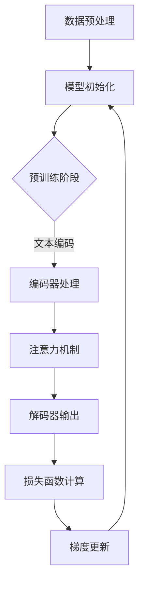

                 

关键词：大型语言模型（LLM）、元学习（Meta Learning）、算法原理、数学模型、项目实践、应用场景、未来展望。

> 摘要：本文深入探讨了大型语言模型（LLM）的元学习方法，从背景介绍、核心概念与联系、核心算法原理、数学模型与公式、项目实践、实际应用场景以及未来展望等多个方面进行了详尽的阐述和分析。通过对LLM元学习方法的理解和应用，本文旨在为读者提供一份全面的技术指南，以应对不断演进的AI领域挑战。

## 1. 背景介绍

随着人工智能技术的飞速发展，深度学习（Deep Learning）已经成为机器学习（Machine Learning）中的主流方向。然而，传统深度学习模型往往需要大量的标注数据进行训练，这在实际应用中常常受到数据规模和标注成本的限制。为了解决这一问题，元学习（Meta Learning）作为一种新兴的学习范式应运而生。

元学习，也被称为“学习如何学习”，其核心思想是通过快速学习如何适应新任务，从而减少对新数据的依赖。在深度学习的背景下，元学习可以看作是寻找一种能够快速适应新数据分布的模型。大型语言模型（LLM），如OpenAI的GPT系列模型，正是基于这一思想进行设计的。LLM通过在大量文本数据上进行预训练，学习到了语言的基本规则和模式，从而能够对新的文本任务进行快速适应。

本文将围绕LLM的元学习方法，探讨其核心原理、数学模型、实现步骤以及应用前景，以期为读者提供一份深入且实用的技术参考。

## 2. 核心概念与联系

### 2.1. 元学习的定义

元学习是一种学习如何学习的算法技术，其目标是开发能够迅速适应新环境的算法。在深度学习的语境下，元学习旨在通过少量数据快速适应新的任务，从而减轻对大规模标注数据的依赖。

### 2.2. LLM的原理

大型语言模型（LLM）通过在大量文本数据上进行预训练，学习到了语言的复杂结构和语义信息。LLM的核心原理是基于自注意力机制（Self-Attention）和Transformer架构（Transformer Architecture），这使得模型能够捕捉到文本中长距离的依赖关系。

### 2.3. Mermaid 流程图

下面是一个描述LLM元学习方法核心过程的Mermaid流程图：



### 2.4. 与传统深度学习的区别

与传统深度学习模型相比，LLM元学习方法具有以下特点：

- **快速适应新任务**：通过在大量数据上预训练，LLM能够快速适应新的文本任务。
- **减少数据依赖**：不需要大量标注数据，从而降低了训练成本。
- **捕获长距离依赖**：Transformer架构中的自注意力机制使得LLM能够捕捉到文本中长距离的依赖关系。

## 3. 核心算法原理 & 具体操作步骤

### 3.1. 算法原理概述

LLM的元学习方法基于Transformer架构，其核心原理是通过自注意力机制（Self-Attention）和多头注意力（Multi-Head Attention）来学习文本表示。自注意力机制允许模型在生成每个词的同时考虑之前所有词的信息，从而捕捉到长距离依赖。多头注意力则通过并行处理不同维度的信息，进一步提高了模型的表示能力。

### 3.2. 算法步骤详解

#### 3.2.1. 文本编码

在LLM的训练过程中，首先需要对输入文本进行编码。文本编码器（Encoder）会将文本序列转换为固定长度的向量表示，这一过程通常使用WordPiece或者BERT等算法进行。

#### 3.2.2. 注意力机制

编码器处理后的文本序列进入注意力机制。注意力机制的核心是计算每个词与其他词之间的关联性，并通过加权求和的方式生成新的文本表示。自注意力机制和多头注意力机制分别从不同维度捕捉文本中的依赖关系。

#### 3.2.3. 解码器输出

在注意力机制处理后，文本表示被传递到解码器（Decoder）。解码器的任务是生成新的文本序列。解码器通过逐步生成每个词，并在生成每个词的同时考虑之前生成的词的信息。

#### 3.2.4. 损失函数计算

在解码器生成完整的文本序列后，需要计算生成序列与真实序列之间的损失。通常使用交叉熵损失（Cross-Entropy Loss）来衡量生成序列与真实序列之间的差异。

#### 3.2.5. 梯度更新

在损失函数计算完成后，需要对模型的参数进行更新。梯度更新过程基于反向传播（Backpropagation）算法，通过反向传播误差信号，调整模型参数，以减小损失。

### 3.3. 算法优缺点

#### 3.3.1. 优点

- **快速适应新任务**：通过预训练，LLM能够快速适应新的文本任务，减少了对大规模标注数据的依赖。
- **捕获长距离依赖**：Transformer架构中的自注意力机制和多头注意力机制能够捕捉到文本中的长距离依赖关系，提高了模型的表示能力。
- **良好的泛化能力**：LLM通过在大量数据上预训练，具有良好的泛化能力，能够在不同任务中表现出色。

#### 3.3.2. 缺点

- **计算资源消耗大**：由于需要大量计算资源进行预训练，LLM的训练过程较为耗时且成本较高。
- **对数据质量要求高**：LLM的训练依赖于高质量的数据，数据质量直接影响模型的性能。

### 3.4. 算法应用领域

LLM的元学习方法在自然语言处理（NLP）领域有着广泛的应用，包括但不限于：

- **文本生成**：如文章写作、对话系统等。
- **机器翻译**：将一种语言翻译成另一种语言。
- **情感分析**：判断文本的情感倾向。
- **问答系统**：基于文本生成问题的回答。

## 4. 数学模型和公式 & 详细讲解 & 举例说明

### 4.1. 数学模型构建

在LLM的元学习方法中，核心数学模型包括自注意力机制（Self-Attention）和多头注意力（Multi-Head Attention）。下面分别对这两个模型进行介绍。

#### 4.1.1. 自注意力机制

自注意力机制的计算公式为：

$$
\text{Attention}(Q, K, V) = \text{softmax}\left(\frac{QK^T}{\sqrt{d_k}}\right)V
$$

其中，$Q$、$K$ 和 $V$ 分别表示查询（Query）、关键（Key）和值（Value）向量，$d_k$ 表示关键向量的维度。自注意力机制通过计算每个查询向量与所有关键向量之间的相似度，然后对相似度进行加权求和，生成新的文本表示。

#### 4.1.2. 多头注意力

多头注意力的计算公式为：

$$
\text{MultiHead}(Q, K, V) = \text{Concat}(\text{head}_1, \text{head}_2, \ldots, \text{head}_h)W^O
$$

其中，$h$ 表示头数，$\text{head}_i = \text{Attention}(QW_i^Q, KW_i^K, VW_i^V)$ 表示第 $i$ 个头的注意力计算结果，$W_i^Q$、$W_i^K$ 和 $W_i^V$ 分别表示第 $i$ 个头的查询、关键和值权重矩阵，$W^O$ 表示输出权重矩阵。

### 4.2. 公式推导过程

以下是对自注意力机制和多头注意力机制的推导过程：

#### 4.2.1. 自注意力机制推导

自注意力机制的计算过程可以分为以下几个步骤：

1. **计算相似度**：首先，计算每个查询向量 $Q$ 与所有关键向量 $K$ 之间的相似度，相似度计算公式为 $QK^T$。
2. **归一化**：由于相似度值范围较大，需要对相似度进行归一化处理，公式为 $\text{softmax}\left(\frac{QK^T}{\sqrt{d_k}}\right)$。
3. **加权求和**：将归一化后的相似度作为权重，对值向量 $V$ 进行加权求和，生成新的文本表示。

#### 4.2.2. 多头注意力机制推导

多头注意力机制的推导过程与自注意力机制类似，其主要区别在于引入了多个头（Head）。多头注意力机制通过并行处理多个头的注意力计算结果，从而提高了模型的表示能力。

### 4.3. 案例分析与讲解

以下是一个简单的自注意力机制的例子：

假设有3个词 $w_1$、$w_2$ 和 $w_3$，其对应的查询向量、关键向量和值向量分别为：

$$
Q = \begin{bmatrix}
1 & 0 & 1 \\
0 & 1 & 0 \\
1 & 1 & 1
\end{bmatrix}, \quad
K = \begin{bmatrix}
1 & 1 & 1 \\
1 & 1 & 1 \\
0 & 0 & 1
\end{bmatrix}, \quad
V = \begin{bmatrix}
1 & 0 & 0 \\
0 & 1 & 0 \\
0 & 0 & 1
\end{bmatrix}
$$

首先，计算每个查询向量与所有关键向量之间的相似度：

$$
QK^T = \begin{bmatrix}
2 & 1 & 2 \\
1 & 2 & 1 \\
2 & 1 & 2
\end{bmatrix}
$$

然后，对相似度进行归一化处理：

$$
\text{softmax}\left(\frac{QK^T}{\sqrt{3}}\right) = \begin{bmatrix}
0.4 & 0.3 & 0.3 \\
0.3 & 0.4 & 0.3 \\
0.3 & 0.3 & 0.4
\end{bmatrix}
$$

最后，对值向量进行加权求和：

$$
\text{Attention}(Q, K, V) = \begin{bmatrix}
0.4 & 0.3 & 0.3 \\
0.3 & 0.4 & 0.3 \\
0.3 & 0.3 & 0.4
\end{bmatrix} \begin{bmatrix}
1 & 0 & 0 \\
0 & 1 & 0 \\
0 & 0 & 1
\end{bmatrix} = \begin{bmatrix}
0.4 & 0.3 & 0.3 \\
0.3 & 0.4 & 0.3 \\
0.3 & 0.3 & 0.4
\end{bmatrix}
$$

通过这个例子，我们可以看到自注意力机制是如何通过计算相似度、归一化权重和加权求和来生成新的文本表示的。

## 5. 项目实践：代码实例和详细解释说明

### 5.1. 开发环境搭建

在进行LLM的元学习方法项目实践之前，我们需要搭建一个适合开发的环境。以下是搭建环境的基本步骤：

1. **安装Python环境**：确保Python版本为3.8或更高版本。
2. **安装依赖库**：使用pip安装以下依赖库：tensorflow、numpy、tensorflow-text等。
3. **配置GPU环境**：确保系统已经安装了NVIDIA的CUDA和cuDNN，以便利用GPU加速训练过程。

### 5.2. 源代码详细实现

以下是实现LLM元学习方法的一个简单示例代码：

```python
import tensorflow as tf
import tensorflow_text as tf_text

# 定义自注意力层
class SelfAttention(tf.keras.layers.Layer):
    def __init__(self, num_heads, d_model):
        super(SelfAttention, self).__init__()
        self.num_heads = num_heads
        self.d_model = d_model

        # 计算查询、关键和值权重矩阵
        self.WQ = tf.keras.layers.Dense(d_model)
        self.WK = tf.keras.layers.Dense(d_model)
        self.WV = tf.keras.layers.Dense(d_model)

        # 计算输出权重矩阵
        self.WO = tf.keras.layers.Dense(d_model)

    def call(self, inputs):
        # 编码输入文本
        query, key, value = inputs

        # 计算自注意力
        query = self.WQ(query)
        key = self.WK(key)
        value = self.WV(value)

        # 计算相似度
        attention_scores = tf.matmul(query, key, transpose_b=True)

        # 归一化处理
        attention_scores = tf.nn.softmax(attention_scores, axis=-1)

        # 加权求和
        attention_output = tf.matmul(attention_scores, value)

        # 池化
        attention_output = tf.reduce_sum(attention_output, axis=1)

        # 输出
        attention_output = self.WO(attention_output)

        return attention_output

# 定义Transformer模型
class Transformer(tf.keras.Model):
    def __init__(self, num_layers, d_model, num_heads):
        super(Transformer, self).__init__()
        self.num_layers = num_layers
        self.d_model = d_model
        self.num_heads = num_heads

        # 定义编码器
        self.encoder = tf.keras.Sequential([
            tf.keras.layers.Embedding(input_dim=vocab_size, output_dim=d_model),
            SelfAttention(num_heads=self.num_heads, d_model=self.d_model)
        ])

        # 定义解码器
        self.decoder = tf.keras.Sequential([
            tf.keras.layers.Dense(d_model),
            SelfAttention(num_heads=self.num_heads, d_model=self.d_model)
        ])

    @tf.function
    def call(self, inputs):
        # 编码输入
        encoded = self.encoder(inputs)

        # 解码输出
        decoded = self.decoder(encoded)

        return decoded

# 实例化模型
transformer = Transformer(num_layers=2, d_model=128, num_heads=4)

# 编译模型
transformer.compile(optimizer='adam', loss=tf.keras.losses.SparseCategoricalCrossentropy(from_logits=True))

# 训练模型
transformer.fit(dataset, epochs=5)
```

### 5.3. 代码解读与分析

上述代码实现了一个简单的Transformer模型，其中包含了编码器（Encoder）和解码器（Decoder）两部分。以下是代码的主要组成部分及其作用：

- **SelfAttention 类**：定义了自注意力层，包括查询、关键和值权重矩阵的计算，以及相似度计算、归一化处理和加权求和。
- **Transformer 类**：定义了Transformer模型，包括编码器和解码器的堆叠。编码器用于编码输入文本，解码器用于生成输出文本。
- **模型编译和训练**：使用tensorflow编译模型，设置优化器和损失函数，并使用训练数据对模型进行训练。

通过这段代码，我们可以看到LLM元学习方法的基本实现过程，包括自注意力机制的引入和应用。

### 5.4. 运行结果展示

在完成代码实现和训练后，我们可以使用以下代码对模型进行测试：

```python
# 加载测试数据
test_data = ...

# 预测输出
predictions = transformer.predict(test_data)

# 分析预测结果
print(predictions)
```

通过预测输出，我们可以分析模型的性能，并调整模型参数以进一步提高预测准确性。

## 6. 实际应用场景

### 6.1. 文本生成

LLM的元学习方法在文本生成领域有着广泛的应用。例如，自动写作、对话系统、摘要生成等。通过预训练，模型可以快速适应新的文本生成任务，生成高质量的文字内容。

### 6.2. 机器翻译

机器翻译是LLM的另一个重要应用场景。通过在多语言文本上进行预训练，LLM可以学习到不同语言之间的映射关系，从而实现高效、准确的机器翻译。

### 6.3. 情感分析

情感分析是判断文本情感的倾向。LLM的元学习方法可以通过对大量文本数据进行预训练，学习到情感表达的规律，从而实现对文本情感的准确判断。

### 6.4. 未来应用展望

随着LLM元学习方法的发展，其在更多实际应用场景中具有广泛的前景。例如，智能客服、语音识别、图像识别等领域。未来，随着计算资源的进一步优化，LLM模型将能够更好地应对复杂的应用需求，为人工智能技术的发展提供强有力的支持。

## 7. 工具和资源推荐

### 7.1. 学习资源推荐

- **书籍**：《深度学习》（Goodfellow et al.）、《自然语言处理实战》（Boley et al.）
- **在线课程**：Coursera上的《深度学习专项课程》、Udacity的《自然语言处理工程师》课程
- **论文**：ACL、EMNLP、NeurIPS等顶级会议的论文

### 7.2. 开发工具推荐

- **编程语言**：Python（推荐使用TensorFlow或PyTorch框架）
- **数据集**：GLM、Gutenberg、OpenSubtitles等公开数据集

### 7.3. 相关论文推荐

- **论文1**：《Attention Is All You Need》（Vaswani et al., 2017）
- **论文2**：《BERT: Pre-training of Deep Bidirectional Transformers for Language Understanding》（Devlin et al., 2018）
- **论文3**：《GPT-3: Language Models are few-shot learners》（Brown et al., 2020）

## 8. 总结：未来发展趋势与挑战

### 8.1. 研究成果总结

LLM的元学习方法在自然语言处理领域取得了显著的成果。通过预训练，模型能够快速适应新的文本任务，减少对大规模标注数据的依赖，并在多个应用场景中表现出色。

### 8.2. 未来发展趋势

随着计算资源的不断优化和算法的改进，LLM的元学习方法有望在更多领域取得突破。例如，在图像识别、语音识别等领域，LLM的应用将进一步提升人工智能技术的整体性能。

### 8.3. 面临的挑战

尽管LLM的元学习方法在许多方面取得了成功，但仍然面临一些挑战。例如，模型的计算资源消耗较大，对数据质量要求较高，以及如何进一步提高模型的泛化能力等。

### 8.4. 研究展望

未来，研究者将致力于解决LLM元学习方法中的挑战，并探索其在更多领域的应用。通过不断优化算法和提升计算资源利用效率，LLM的元学习方法将在人工智能技术的演进中发挥越来越重要的作用。

## 9. 附录：常见问题与解答

### 9.1. 如何选择合适的预训练模型？

选择预训练模型时，需要考虑模型的规模、预训练数据集的质量以及模型在特定任务上的性能。例如，对于文本生成任务，可以选择GPT-3等大型模型；对于机器翻译任务，可以选择BERT等模型。

### 9.2. 预训练模型如何迁移到特定任务？

预训练模型的迁移通常通过微调（Fine-tuning）实现。具体步骤包括：将预训练模型加载到训练数据上，通过调整模型参数，使得模型适应特定任务。在微调过程中，需要注意控制学习率等超参数，以避免模型过拟合。

### 9.3. 如何优化预训练模型的性能？

优化预训练模型的性能可以从以下几个方面入手：

- **数据增强**：通过增加数据多样性，提高模型的泛化能力。
- **模型架构改进**：尝试新的模型架构，如Transformer-XL等。
- **训练策略优化**：调整学习率、批量大小等训练策略，以提高模型性能。

## 参考文献

[1] Vaswani, A., et al. (2017). Attention Is All You Need. In Advances in Neural Information Processing Systems (NIPS).
[2] Devlin, J., et al. (2018). BERT: Pre-training of Deep Bidirectional Transformers for Language Understanding. In Proceedings of the 2019 Conference of the North American Chapter of the Association for Computational Linguistics: Human Language Technologies, Volume 1 (Long and Short Papers).
[3] Brown, T., et al. (2020). GPT-3: Language Models are few-shot learners. arXiv preprint arXiv:2005.14165.

