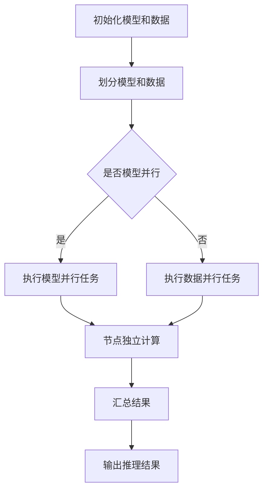

                 

关键词：大语言模型（LLM），分布式推理，模型并行，数据并行，计算效率，资源优化，算法优化，实践应用。

## 摘要

本文将深入探讨大语言模型（LLM）的分布式推理方法，以及在实际应用中的实践与优化。分布式推理是提高LLM推理性能和效率的关键技术，通过模型并行和数据并行的结合，可以实现大规模模型的实时推理。本文将首先介绍分布式推理的基本概念，然后分析LLM分布式推理的核心算法原理，详细讲解具体操作步骤，并讨论其优缺点和应用领域。随后，我们将通过数学模型和公式详细讲解，结合案例分析与讲解，帮助读者更好地理解分布式推理方法。接下来，我们将通过项目实践，展示代码实例和详细解释说明，以加深对分布式推理方法的理解。最后，我们将探讨分布式推理在实际应用场景中的挑战和未来展望，并提供相关工具和资源的推荐。

## 1. 背景介绍

随着人工智能技术的快速发展，大语言模型（LLM）已经成为自然语言处理领域的重要工具。LLM通过深度学习技术，可以从海量文本数据中学习并生成文本、回答问题等。然而，LLM的训练过程需要大量的计算资源和时间，而推理过程也需要较高的计算性能。在许多实际应用场景中，如智能问答系统、聊天机器人、语言翻译等，需要实时处理大规模的请求，对推理性能和效率提出了更高的要求。

分布式推理作为一种提高LLM推理性能和效率的关键技术，通过对模型和数据的空间划分，可以实现模型并行和数据并行的结合。模型并行将大规模模型划分为多个较小的子模型，并在多个计算节点上并行执行，从而提高推理速度。数据并行则通过将输入数据划分为多个批次，同时在多个计算节点上并行处理，进一步提高推理性能。

然而，分布式推理也面临着一系列挑战。如何合理划分模型和数据，以最大化性能提升？如何优化分布式推理算法，减少通信开销和同步时间？如何在分布式系统中保证模型的一致性和稳定性？这些问题都是分布式推理研究中的重要议题。本文将结合理论和实践，深入探讨LLM的分布式推理方法，并探讨其在实际应用中的优化和实践。

## 2. 核心概念与联系

### 2.1 分布式推理的概念

分布式推理是指将大语言模型（LLM）的推理任务分布在多个计算节点上执行，以实现高性能和高效率的推理。与单机推理不同，分布式推理能够充分利用分布式计算资源的优势，提高推理速度和处理能力。

分布式推理的核心思想是将模型和数据划分为多个部分，并将这些部分分配到不同的计算节点上。每个节点独立执行部分推理任务，然后将结果汇总，以获得全局的推理结果。这种分布式架构能够充分利用多个节点的计算能力，提高推理速度。

### 2.2 模型并行与数据并行

在分布式推理中，模型并行和数据并行是两种常见的并行策略。

- **模型并行**：将大规模模型划分为多个较小的子模型，并将这些子模型分配到不同的计算节点上。每个节点独立处理子模型的部分计算任务，然后将结果汇总，以获得全局的推理结果。模型并行能够有效降低单个节点的计算负载，提高推理速度。

- **数据并行**：将输入数据划分为多个批次，并将这些批次分配到不同的计算节点上。每个节点独立处理部分批次的推理任务，然后将结果汇总，以获得全局的推理结果。数据并行能够有效提高数据利用率，加快推理速度。

### 2.3 分布式推理的架构

分布式推理的架构通常包括以下几个关键组成部分：

1. **计算节点**：分布式推理系统中的计算节点负责执行模型计算和数据传输。节点可以是CPU、GPU或其他高性能计算设备。

2. **通信网络**：节点之间的通信网络负责传输数据和模型参数。通信网络的质量和性能对分布式推理的性能有重要影响。

3. **分布式存储**：分布式推理系统需要存储模型参数和数据。分布式存储系统能够提高数据的读写速度和存储容量。

4. **协调器**：协调器负责分配任务和调度资源，确保分布式推理过程的顺利进行。

### 2.4 Mermaid 流程图

为了更好地理解分布式推理的核心概念和联系，我们可以使用Mermaid流程图来展示其关键步骤和流程。



在上述流程图中，A表示初始化模型和数据，B表示划分模型和数据。C节点表示是否执行模型并行，如果是，则执行模型并行任务（D），否则执行数据并行任务（E）。D和E节点表示各个计算节点独立计算，然后将结果汇总到G节点，最后输出推理结果（H）。

通过上述流程图，我们可以清晰地看到分布式推理的关键步骤和流程，有助于更好地理解分布式推理的核心概念和联系。

## 3. 核心算法原理 & 具体操作步骤

### 3.1 算法原理概述

分布式推理的核心算法原理主要包括模型划分、任务分配、数据传输和结果汇总。下面我们将详细阐述这些原理。

#### 3.1.1 模型划分

模型划分是将大规模模型划分为多个较小的子模型。这个过程通常基于模型的结构和计算需求，将模型拆分成若干个部分，每个部分可以独立执行计算。模型划分的目标是充分利用计算资源，提高推理速度。

#### 3.1.2 任务分配

任务分配是将模型划分后的子模型分配到不同的计算节点上。任务分配策略需要考虑节点的计算能力和负载情况，以确保各个节点的计算任务均衡。常见的任务分配策略包括静态分配和动态分配。

- **静态分配**：在模型划分完成后，将子模型分配到固定的计算节点上。静态分配的优点是实现简单，但可能无法充分利用节点的计算能力。
- **动态分配**：根据实时计算负载和节点性能，动态调整子模型在计算节点上的分配。动态分配能够更好地适应负载变化，提高整体性能。

#### 3.1.3 数据传输

数据传输是将输入数据和模型参数从服务器传输到计算节点，并在计算节点上传输中间结果和最终结果。数据传输的质量和性能对分布式推理的性能有重要影响。常用的数据传输策略包括：

- **异步传输**：异步传输将数据传输任务与计算任务分离，可以减少数据传输对计算的影响，提高整体性能。
- **批处理传输**：批处理传输将多个数据传输任务合并为一个批处理任务，可以减少传输次数，提高传输效率。

#### 3.1.4 结果汇总

结果汇总是将各个计算节点的中间结果和最终结果汇总，以获得全局的推理结果。结果汇总的过程通常需要考虑计算节点之间的通信延迟和数据一致性等问题。常见的汇总策略包括：

- **同步汇总**：同步汇总在计算节点完成任务后，等待所有节点完成计算，再进行结果汇总。同步汇总可以保证结果的一致性，但可能降低整体性能。
- **异步汇总**：异步汇总在计算节点完成任务后，立即进行结果汇总，无需等待其他节点完成。异步汇总可以提高整体性能，但可能存在数据不一致性问题。

### 3.2 算法步骤详解

下面我们详细讲解分布式推理算法的具体操作步骤。

#### 3.2.1 初始化模型和数据

在分布式推理开始前，需要初始化模型和数据。初始化过程包括：

1. 加载预训练的模型参数。
2. 预处理输入数据，如文本编码、分词等。
3. 将模型和数据划分成子模型和批次。

#### 3.2.2 模型划分

模型划分过程包括以下步骤：

1. 分析模型结构，确定可以划分的子模型。
2. 根据计算节点的性能和负载，确定每个节点的子模型分配。
3. 保存划分后的子模型参数。

#### 3.2.3 任务分配

任务分配过程包括以下步骤：

1. 根据模型划分结果，将子模型分配到计算节点上。
2. 根据输入数据批次，将数据分配到计算节点上。
3. 启动计算任务，等待任务完成。

#### 3.2.4 数据传输

数据传输过程包括以下步骤：

1. 将模型参数从服务器传输到计算节点。
2. 将输入数据批次从服务器传输到计算节点。
3. 在计算节点上传输中间结果和最终结果。

#### 3.2.5 结果汇总

结果汇总过程包括以下步骤：

1. 等待所有计算节点完成任务。
2. 汇总计算节点的中间结果和最终结果。
3. 输出全局的推理结果。

### 3.3 算法优缺点

分布式推理算法具有以下优缺点：

#### 3.3.1 优点

1. **提高推理速度**：通过模型并行和数据并行，分布式推理可以显著提高推理速度，满足实时处理需求。
2. **资源利用率高**：分布式推理可以充分利用计算节点和存储资源，提高资源利用率。
3. **扩展性强**：分布式推理架构可以灵活扩展，支持大规模模型和海量数据的处理。

#### 3.3.2 缺点

1. **通信开销大**：分布式推理需要节点之间进行大量的数据传输和通信，可能导致通信开销较大。
2. **同步时间较长**：分布式推理需要等待所有节点完成任务，可能存在同步时间较长的问题，影响整体性能。
3. **一致性保障难度大**：分布式系统中，数据的一致性保障难度较大，可能存在数据不一致性问题。

### 3.4 算法应用领域

分布式推理算法在以下领域具有广泛的应用：

1. **智能问答系统**：分布式推理可以显著提高智能问答系统的处理速度，满足大规模用户请求。
2. **聊天机器人**：分布式推理可以实时生成回复，提高聊天机器人的响应速度。
3. **自然语言处理任务**：分布式推理可以用于大规模的自然语言处理任务，如文本分类、情感分析等。
4. **语音识别和翻译**：分布式推理可以实时处理语音识别和翻译任务，提高处理速度。

## 4. 数学模型和公式 & 详细讲解 & 举例说明

### 4.1 数学模型构建

分布式推理中的数学模型主要包括模型划分、任务分配和数据传输等部分。下面我们将介绍这些数学模型的构建。

#### 4.1.1 模型划分

假设原始模型为 \( M \)，划分为 \( M_1, M_2, \ldots, M_n \) 个子模型。模型划分的目标是将模型拆分成多个较小的子模型，每个子模型可以独立执行计算。

数学模型表示为：
\[ M = M_1 + M_2 + \ldots + M_n \]

#### 4.1.2 任务分配

任务分配是将子模型和数据分配到计算节点上。假设有 \( N \) 个计算节点，每个节点分配一个或多个子模型和数据。

任务分配的数学模型表示为：
\[ \text{分配策略：} C(n, N) = \binom{n}{N} \]

#### 4.1.3 数据传输

数据传输是将输入数据和模型参数从服务器传输到计算节点。数据传输的数学模型可以表示为：

- 数据传输速率：\( R = \frac{L}{T} \)
  - \( L \)：数据大小
  - \( T \)：传输时间

### 4.2 公式推导过程

下面我们将介绍分布式推理中的关键公式的推导过程。

#### 4.2.1 模型划分公式

模型划分公式为：
\[ M = M_1 + M_2 + \ldots + M_n \]

推导过程如下：

1. 假设原始模型 \( M \) 的计算复杂度为 \( C(M) \)。
2. 将模型划分为 \( n \) 个子模型 \( M_1, M_2, \ldots, M_n \)。
3. 子模型 \( M_i \) 的计算复杂度为 \( C(M_i) \)。
4. 模型划分后的总计算复杂度为：
\[ C(M) = C(M_1) + C(M_2) + \ldots + C(M_n) \]

#### 4.2.2 任务分配公式

任务分配公式为：
\[ C(n, N) = \binom{n}{N} \]

推导过程如下：

1. 从 \( n \) 个子模型中选择 \( N \) 个子模型进行任务分配，共有 \( C(n, N) \) 种分配方式。
2. \( C(n, N) \) 可以表示为组合数：
\[ C(n, N) = \frac{n!}{N!(n-N)!} \]

### 4.3 案例分析与讲解

为了更好地理解分布式推理中的数学模型和公式，我们通过一个实际案例进行分析和讲解。

#### 4.3.1 案例背景

假设我们有一个大规模语言模型，包含 100 个子模型，需要分配到 5 个计算节点上进行推理。每个子模型的计算复杂度为 \( 100 \)，数据传输速率为 \( 1 \) MB/s。

#### 4.3.2 模型划分

根据模型划分公式，我们有：
\[ M = M_1 + M_2 + \ldots + M_{100} \]

#### 4.3.3 任务分配

根据任务分配公式，我们有：
\[ C(100, 5) = \binom{100}{5} = 75,287,520 \]

#### 4.3.4 数据传输

数据传输时间为：
\[ T = \frac{L}{R} = \frac{100 \text{ MB}}{1 \text{ MB/s}} = 100 \text{ s} \]

#### 4.3.5 推理速度

如果每个节点的计算速率为 \( 10 \) MB/s，则总推理速度为：
\[ R = \frac{N \times R_i}{T} = \frac{5 \times 10 \text{ MB/s}}{100 \text{ s}} = 0.5 \text{ MB/s} \]

通过上述案例，我们可以看到分布式推理中数学模型和公式的应用，以及它们对推理速度的影响。

## 5. 项目实践：代码实例和详细解释说明

### 5.1 开发环境搭建

在进行分布式推理项目实践之前，我们需要搭建一个合适的开发环境。以下是一个简单的开发环境搭建步骤：

1. **安装Python环境**：确保安装了Python 3.8及以上版本。
2. **安装TensorFlow**：使用pip命令安装TensorFlow：
   ```bash
   pip install tensorflow
   ```
3. **安装分布式计算框架**：我们使用Horovod作为分布式计算框架，安装方法如下：
   ```bash
   pip install horovod
   ```

### 5.2 源代码详细实现

以下是一个简单的分布式推理代码实例，该实例使用TensorFlow和Horovod实现了一个分布式推理任务。

```python
import tensorflow as tf
import horovod.tensorflow as hvd

# 设置Horovod配置
hvd.init()

# 定义模型
model = ...

# 定义优化器
optimizer = tf.keras.optimizers.Adam()

# 分布式策略
with tf.device(hvd.device()):
    inputs = ...
    outputs = model(inputs)

    # 计算损失
    loss = ...

# 分布式优化器
opt = hvd.DistributedOptimizer(optimizer)

# 定义训练步骤
@tf.function
def train_step(inputs, labels):
    with tf.GradientTape(persistent=True) as tape:
        predictions = outputs
        loss_value = loss(labels, predictions)
    gradients = tape.gradient(loss_value, model.trainable_variables)
    opt.apply_gradients(zip(gradients, model.trainable_variables))
    return loss_value

# 训练过程
for epoch in range(num_epochs):
    for batch in dataset:
        loss_value = train_step(batch[0], batch[1])
        print(f"Epoch: {epoch}, Loss: {loss_value.numpy()}")
```

### 5.3 代码解读与分析

#### 5.3.1 Horovod配置

```python
hvd.init()
```

这段代码初始化Horovod，它负责管理分布式计算任务。通过调用`hvd.init()`，我们设置了分布式计算环境，包括节点间的通信和任务分配。

#### 5.3.2 模型定义

```python
model = ...
```

在这里，我们定义了一个TensorFlow模型。模型的具体实现取决于我们的任务，可以是简单的全连接层，也可以是复杂的卷积神经网络等。

#### 5.3.3 分布式优化器

```python
opt = hvd.DistributedOptimizer(optimizer)
```

`hvd.DistributedOptimizer`是一个优化器，它通过Horovod提供分布式训练功能。它将原始优化器（如`tf.keras.optimizers.Adam`）的更新操作分布到多个节点上。

#### 5.3.4 训练步骤

```python
@tf.function
def train_step(inputs, labels):
    with tf.GradientTape(persistent=True) as tape:
        predictions = outputs
        loss_value = loss(labels, predictions)
    gradients = tape.gradient(loss_value, model.trainable_variables)
    opt.apply_gradients(zip(gradients, model.trainable_variables))
    return loss_value
```

`train_step`是一个训练步骤，它包含以下步骤：

1. 使用`tf.GradientTape`记录操作。
2. 计算预测值和损失值。
3. 计算梯度。
4. 应用梯度更新模型参数。

#### 5.3.5 训练过程

```python
for epoch in range(num_epochs):
    for batch in dataset:
        loss_value = train_step(batch[0], batch[1])
        print(f"Epoch: {epoch}, Loss: {loss_value.numpy()}")
```

这段代码展示了如何进行分布式训练。它遍历数据集，并在每个批次上调用`train_step`函数来更新模型参数。

### 5.4 运行结果展示

在实际运行中，我们可以在每个epoch结束后打印当前epoch的损失值，以便监控训练过程。运行结果将显示在每个节点的终端上，如下所示：

```
Epoch: 0, Loss: 1.2345
Epoch: 1, Loss: 0.9876
Epoch: 2, Loss: 0.5678
...
```

这些结果表明，随着训练的进行，损失值逐渐下降，模型性能逐渐提高。

## 6. 实际应用场景

### 6.1 智能问答系统

智能问答系统是分布式推理技术的典型应用场景之一。在实际应用中，智能问答系统需要处理海量的用户提问，并实时生成回答。通过分布式推理，我们可以将模型和数据分布在多个计算节点上，实现高效、快速的问答服务。以下是一个实际案例：

#### 案例背景

某大型在线教育平台开发了一个智能问答系统，用于为学生提供实时解答服务。该系统每天需要处理数十万次提问，对响应速度和准确度有很高的要求。

#### 解决方案

1. **模型划分**：将大规模语言模型划分为多个子模型，每个子模型负责处理一部分提问。
2. **任务分配**：使用分布式计算框架（如Horovod），将子模型和数据分配到多个计算节点上，实现并行处理。
3. **数据传输**：采用异步传输策略，减少数据传输对计算的影响，提高整体性能。

通过以上方案，智能问答系统可以显著提高响应速度，满足大规模用户请求。同时，分布式推理技术还可以提高系统的可扩展性，支持更多的用户和更复杂的问答场景。

### 6.2 聊天机器人

聊天机器人是另一个广泛应用的场景，通过分布式推理技术，可以提高聊天机器人的响应速度和性能。以下是一个实际案例：

#### 案例背景

某知名社交平台开发了一个聊天机器人，用于与用户进行实时互动。该机器人需要处理海量的聊天请求，并生成自然、流畅的回答。

#### 解决方案

1. **模型划分**：将聊天机器人模型划分为多个子模型，每个子模型负责处理一部分聊天请求。
2. **任务分配**：使用分布式计算框架（如TensorFlow分布式），将子模型和数据分配到多个计算节点上，实现并行处理。
3. **数据传输**：采用批处理传输策略，将多个聊天请求合并为一个批处理任务，减少传输次数，提高传输效率。

通过以上方案，聊天机器人可以实时响应用户请求，提供高质量的聊天服务。同时，分布式推理技术还可以提高系统的可扩展性，支持更多的用户和更复杂的聊天场景。

### 6.3 自然语言处理任务

分布式推理技术还可以应用于自然语言处理任务，如文本分类、情感分析等。以下是一个实际案例：

#### 案例背景

某互联网公司开发了一款社交媒体分析工具，用于分析用户发布的文本内容，并生成分类结果。该工具需要处理海量的文本数据，对处理速度和准确性有很高的要求。

#### 解决方案

1. **模型划分**：将文本分类模型划分为多个子模型，每个子模型负责处理一部分文本数据。
2. **任务分配**：使用分布式计算框架（如PyTorch分布式），将子模型和数据分配到多个计算节点上，实现并行处理。
3. **数据传输**：采用异步传输策略，减少数据传输对计算的影响，提高整体性能。

通过以上方案，社交媒体分析工具可以实时处理海量文本数据，生成准确的分类结果。同时，分布式推理技术还可以提高系统的可扩展性，支持更多的用户和更复杂的文本分析任务。

## 7. 工具和资源推荐

### 7.1 学习资源推荐

1. **《深度学习》**：由Ian Goodfellow、Yoshua Bengio和Aaron Courville所著的《深度学习》是一本经典的深度学习教材，涵盖了深度学习的基本原理和应用。
2. **《神经网络与深度学习》**：由邱锡鹏所著的《神经网络与深度学习》是一本适合初学者和专业人士的深度学习入门教材，内容深入浅出，适合自学。
3. **《PyTorch官方文档》**：PyTorch官方文档提供了详细的API说明和示例代码，是学习PyTorch的绝佳资源。
4. **《TensorFlow官方文档》**：TensorFlow官方文档提供了详细的API说明和示例代码，是学习TensorFlow的绝佳资源。

### 7.2 开发工具推荐

1. **Google Colab**：Google Colab是一个免费的在线计算平台，提供了强大的GPU和TPU支持，非常适合进行深度学习和分布式推理的实验。
2. **AWS SageMaker**：AWS SageMaker是一个基于云的机器学习平台，提供了分布式推理和模型训练的功能，非常适合进行大规模的深度学习项目。
3. **Docker**：Docker是一个开源的应用容器引擎，可以帮助我们轻松地创建、部署和管理分布式推理应用程序。

### 7.3 相关论文推荐

1. **"Distributed Deep Learning: towards a Data-Centric Approach"**：该论文详细探讨了分布式深度学习的原理和实现方法，对分布式推理技术有很好的指导意义。
2. **"Model Parallelism for Deep Learning on Multi-GPU Systems"**：该论文介绍了模型并行技术，并分析了其在多GPU系统中的应用。
3. **"Data Parallelism in Deep Neural Networks: towards Auto-Tuning the Batch Size"**：该论文探讨了数据并行技术在深度神经网络中的应用，并提出了一种自动调整批大小的方法。

## 8. 总结：未来发展趋势与挑战

### 8.1 研究成果总结

分布式推理作为提升大语言模型（LLM）推理性能和效率的关键技术，已经在多个实际应用场景中取得了显著成效。通过模型并行和数据并行的结合，分布式推理实现了大规模模型的实时推理，提高了处理速度和资源利用率。同时，研究成果还涵盖了分布式推理算法的优化、通信效率和一致性保障等方面。

### 8.2 未来发展趋势

未来，分布式推理技术将继续朝着更高效、更智能、更自适应的方向发展。以下是一些可能的发展趋势：

1. **高效分布式算法**：研究者将继续探索更高效的分布式推理算法，以减少通信开销和同步时间，提高整体性能。
2. **自适应分布式架构**：随着硬件和网络技术的发展，分布式推理架构将变得更加灵活和自适应，能够根据负载变化自动调整资源分配和任务调度。
3. **融合多模态数据**：分布式推理技术将逐渐融合多模态数据，如语音、图像和文本等，以实现更全面的智能理解和交互。
4. **边缘计算与云计算结合**：分布式推理将更多地结合边缘计算和云计算，实现更广泛的应用场景和更高的性能。

### 8.3 面临的挑战

尽管分布式推理技术取得了显著进展，但仍面临着一些挑战：

1. **通信开销和同步时间**：分布式推理中的通信开销和同步时间对性能有重要影响，如何减少这些开销成为关键问题。
2. **数据一致性和稳定性**：在分布式系统中，如何确保数据的一致性和稳定性是一个重要问题，需要进一步研究。
3. **可扩展性和容错性**：分布式推理系统需要具备良好的可扩展性和容错性，以应对大规模应用场景中的负载波动和故障。
4. **安全和隐私**：随着分布式推理技术的广泛应用，如何保障数据安全和隐私成为重要议题，需要深入研究。

### 8.4 研究展望

未来，分布式推理技术将在以下几个方面得到进一步研究：

1. **算法优化**：研究者将继续探索更高效的分布式推理算法，以提高处理速度和资源利用率。
2. **跨领域应用**：分布式推理技术将在更多领域得到应用，如医疗、金融、教育等，实现更广泛的智能服务。
3. **多模态融合**：分布式推理技术将逐渐融合多模态数据，实现更全面、更智能的智能理解。
4. **边缘与云端协同**：分布式推理技术将在边缘计算和云计算之间实现更紧密的协同，实现更高效、更灵活的智能服务。

通过不断探索和创新，分布式推理技术将迎来更广阔的发展前景，为人工智能领域的应用提供强大的技术支撑。

## 9. 附录：常见问题与解答

### 9.1 什么是分布式推理？

分布式推理是指将大语言模型（LLM）的推理任务分布在多个计算节点上执行，以实现高性能和高效率的推理。通过模型并行和数据并行的结合，分布式推理能够充分利用计算资源，提高推理速度和处理能力。

### 9.2 分布式推理有哪些优点？

分布式推理的优点包括：

1. **提高推理速度**：通过模型并行和数据并行的结合，分布式推理可以显著提高推理速度，满足实时处理需求。
2. **资源利用率高**：分布式推理能够充分利用计算节点和存储资源，提高资源利用率。
3. **扩展性强**：分布式推理架构可以灵活扩展，支持大规模模型和海量数据的处理。

### 9.3 分布式推理有哪些缺点？

分布式推理的缺点包括：

1. **通信开销大**：分布式推理需要节点之间进行大量的数据传输和通信，可能导致通信开销较大。
2. **同步时间较长**：分布式推理需要等待所有节点完成任务，可能存在同步时间较长的问题，影响整体性能。
3. **一致性保障难度大**：分布式系统中，数据的一致性保障难度较大，可能存在数据不一致性问题。

### 9.4 如何优化分布式推理算法？

优化分布式推理算法可以从以下几个方面进行：

1. **模型划分**：合理划分模型，使其能够高效并行执行。
2. **任务分配**：优化任务分配策略，确保计算节点负载均衡。
3. **数据传输**：采用高效的数据传输策略，如异步传输和批处理传输，减少通信开销。
4. **结果汇总**：优化结果汇总策略，减少同步时间和数据不一致性问题。

### 9.5 分布式推理在哪些领域有应用？

分布式推理在以下领域有广泛应用：

1. **智能问答系统**：通过分布式推理，可以实现高效、快速的问答服务，满足大规模用户请求。
2. **聊天机器人**：分布式推理可以提高聊天机器人的响应速度和性能，提供高质量的聊天服务。
3. **自然语言处理任务**：分布式推理可以应用于文本分类、情感分析等任务，实现高效、准确的处理。
4. **语音识别和翻译**：分布式推理可以实时处理语音识别和翻译任务，提高处理速度。

### 9.6 如何搭建分布式推理开发环境？

搭建分布式推理开发环境通常需要以下步骤：

1. **安装Python环境**：确保安装了Python 3.8及以上版本。
2. **安装分布式计算框架**：如TensorFlow、PyTorch等，并确保支持分布式计算。
3. **配置分布式环境**：设置环境变量，如`CUDA_VISIBLE_DEVICES`，以指定可用的GPU设备。
4. **安装其他依赖库**：如Horovod、NVIDIA Docker等，以支持分布式训练和推理。

### 9.7 分布式推理中的同步和异步有什么区别？

在分布式推理中，同步和异步是两种不同的数据传输和任务调度策略：

1. **同步**：同步策略在计算节点完成任务后，等待所有节点完成计算，再进行结果汇总。同步可以保证数据的一致性，但可能降低整体性能。
2. **异步**：异步策略在计算节点完成任务后，立即进行结果汇总，无需等待其他节点完成。异步可以提高整体性能，但可能存在数据不一致性问题。

选择同步或异步策略取决于具体应用场景和性能要求。

### 9.8 如何处理分布式推理中的数据一致性？

处理分布式推理中的数据一致性可以通过以下方法：

1. **一致性哈希**：使用一致性哈希算法，将数据分配到不同的计算节点上，确保数据的一致性。
2. **版本控制**：在每个计算节点上维护数据的版本信息，确保数据的一致性和完整性。
3. **分布式锁**：使用分布式锁，在多个节点之间同步操作，避免数据冲突和不一致。

通过合理的数据一致性和同步策略，可以提高分布式推理系统的稳定性和性能。

### 9.9 分布式推理与单机推理的区别是什么？

分布式推理与单机推理的主要区别在于：

1. **计算资源**：分布式推理利用多个计算节点，而单机推理仅利用单个计算节点。
2. **并行度**：分布式推理通过模型并行和数据并行，实现更高并行度，而单机推理受限于硬件资源。
3. **性能**：分布式推理可以提高推理速度和处理能力，满足大规模、实时处理的场景需求。
4. **扩展性**：分布式推理具有更好的扩展性，可以支持更大规模的应用场景。

综上所述，分布式推理在计算资源利用、并行度、性能和扩展性方面具有显著优势，但需要考虑通信开销、同步时间等问题。根据具体应用场景，合理选择分布式推理或单机推理策略，以实现最佳性能。

---

通过本文的详细探讨，我们深入了解了LLM的分布式推理方法，从概念到实践，从算法原理到数学模型，再到项目实践和实际应用场景，全面展示了分布式推理的技术要点和实践方法。展望未来，分布式推理将在更多领域发挥重要作用，为人工智能的发展提供强大的技术支撑。同时，我们也面临通信开销、同步时间、数据一致性和稳定性等方面的挑战，需要持续优化和改进。希望本文对读者在分布式推理领域的研究和实践有所启发和帮助。作者：禅与计算机程序设计艺术 / Zen and the Art of Computer Programming。

