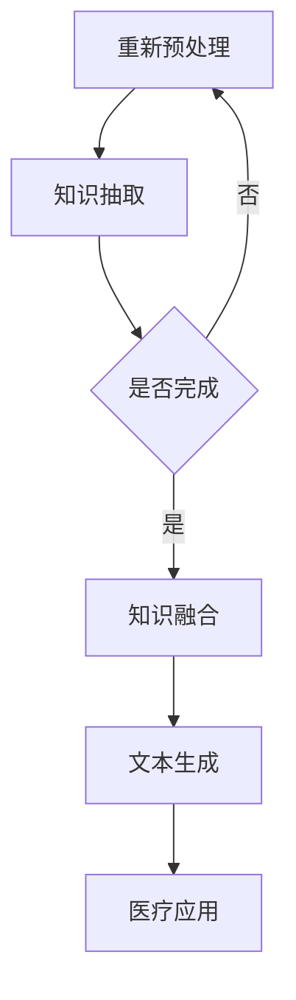

                 

关键词：自然语言处理，医疗人工智能，语言模型，诊断辅助，治疗优化，医疗数据

> 摘要：随着自然语言处理技术的发展，语言模型在医疗领域的应用正日益广泛。本文将探讨大型语言模型（LLM）在医疗辅助诊断和治疗中的革新作用，通过深入分析其核心概念、算法原理、数学模型及实际应用案例，旨在为医疗AI研究提供新的思路和方向。

## 1. 背景介绍

在过去的几十年中，人工智能（AI）在医疗领域的应用取得了显著进展。从早期的图像识别技术到如今的大数据分析，AI在诊断、治疗、药物研发等方面发挥着越来越重要的作用。然而，随着自然语言处理（NLP）技术的不断成熟，语言模型，尤其是大型语言模型（LLM），正在为医疗AI带来新的变革。

语言模型是自然语言处理的核心组成部分，能够理解和生成自然语言文本。而大型语言模型通过其庞大的参数规模和深度学习算法，使得其能够捕捉到语言中的复杂结构和语义信息。在医疗领域，这种能力使得LLM能够处理和理解大量的医疗文献、病历数据、医学图像等，为临床诊断和治疗提供强有力的支持。

## 2. 核心概念与联系

### 2.1 语言模型的基本原理

语言模型（Language Model，LM）是一种概率模型，用于预测一段文本的下一个单词或字符。在医疗领域，语言模型主要用于文本生成、信息检索、医学问答系统等应用。其核心原理是基于统计方法或深度学习方法，通过大量文本数据训练出一个能够预测文本序列的概率分布模型。

### 2.2 医学知识图谱

医学知识图谱（Medical Knowledge Graph，MKG）是一种用于表示医学领域知识的图形结构。它将医学概念、实体、关系和属性通过节点和边的方式组织起来，形成一个结构化、可扩展的医学知识库。医学知识图谱在医疗AI中的应用，包括知识推理、诊断辅助、药物推荐等。

### 2.3 LLM与医学知识图谱的结合

LLM与医学知识图谱的结合，为医疗AI带来了新的可能性。通过将LLM与医学知识图谱相结合，可以构建一个智能的医疗问答系统，实现对医学文本的深入理解和知识推理。具体而言，这种结合可以通过以下方式实现：

1. **知识抽取**：使用LLM对医学文本进行预处理，抽取其中的关键信息，如症状、诊断、治疗方案等，并将其转换为医学知识图谱中的节点和边。
2. **知识融合**：将LLM与医学知识图谱中的信息进行融合，利用LLM的强大语义理解能力，对知识图谱中的节点和边进行扩展和推理，从而提高诊断和治疗的准确性。
3. **文本生成**：利用LLM生成医学建议、诊断报告、治疗方案等文本，以提高医疗工作的效率和准确性。

### 2.4 Mermaid流程图

以下是一个描述LLM与医学知识图谱结合的Mermaid流程图：



## 3. 核心算法原理 & 具体操作步骤

### 3.1 算法原理概述

LLM的核心原理是基于深度神经网络（DNN）和变换器架构（Transformer）。DNN通过多层神经元的非线性组合，可以学习到复杂的函数映射。而Transformer则通过自注意力机制，能够捕捉文本序列中的长距离依赖关系。在医疗领域，LLM通常通过以下步骤实现诊断和治疗辅助：

1. **数据预处理**：对医学文本进行分词、去噪、标准化等预处理操作。
2. **模型训练**：使用预训练的语言模型，如GPT、BERT等，对预处理后的医学文本进行训练，以学习到医学领域的语言特征。
3. **知识抽取**：利用训练好的LLM，对医学文本进行知识抽取，识别出关键信息。
4. **知识融合**：将抽取出的知识融合到医学知识图谱中，进行推理和扩展。
5. **文本生成**：利用LLM生成诊断报告、治疗方案等医疗文本。

### 3.2 算法步骤详解

#### 3.2.1 数据预处理

数据预处理是LLM在医疗领域应用的第一步。其主要包括以下步骤：

1. **文本清洗**：去除文本中的噪声，如HTML标签、特殊字符等。
2. **分词**：将文本分割成单词或字符序列。
3. **标准化**：将文本中的大小写统一、数字转换为字符串等。

#### 3.2.2 模型训练

模型训练是LLM的核心步骤。以下是一个典型的训练流程：

1. **数据集准备**：收集大量的医学文本数据，并进行预处理。
2. **模型选择**：选择适合的预训练模型，如GPT、BERT等。
3. **训练**：使用预处理后的医学文本数据，对预训练模型进行微调，使其适应医学领域的特征。
4. **评估与优化**：通过交叉验证等方法，评估模型的性能，并进行优化。

#### 3.2.3 知识抽取

知识抽取是LLM在医疗领域应用的关键步骤。以下是一个典型的知识抽取流程：

1. **文本输入**：将预处理后的医学文本输入到训练好的LLM中。
2. **信息提取**：利用LLM的输出，识别出文本中的关键信息，如症状、诊断、治疗方案等。
3. **实体识别**：将提取出的关键信息转换为实体，如患者、疾病、药物等。
4. **关系抽取**：识别出实体之间的关系，如“患者患有疾病A”、“药物用于治疗疾病B”等。

#### 3.2.4 知识融合

知识融合是将知识抽取的结果与医学知识图谱相结合，进行推理和扩展。以下是一个典型的知识融合流程：

1. **知识图谱构建**：构建一个医学知识图谱，包括节点和边。
2. **知识融合**：将知识抽取的结果与知识图谱相结合，进行推理和扩展。
3. **知识更新**：根据新的医学知识，更新知识图谱。

#### 3.2.5 文本生成

文本生成是LLM在医疗领域应用的最后一步。以下是一个典型的文本生成流程：

1. **问题输入**：将用户的问题输入到训练好的LLM中。
2. **回答生成**：利用LLM生成问题的回答，如诊断报告、治疗方案等。
3. **文本优化**：对生成的文本进行优化，确保其准确性和可读性。

### 3.3 算法优缺点

#### 3.3.1 优点

1. **强大的语义理解能力**：LLM能够理解和生成复杂的自然语言文本，为医疗AI提供了强大的语义理解能力。
2. **灵活的适应能力**：LLM可以通过微调适应不同的医学领域和任务，具有较强的灵活性和适应性。
3. **高效的诊断和治疗辅助**：LLM能够快速处理大量的医学数据，为临床诊断和治疗提供高效的辅助。

#### 3.3.2 缺点

1. **数据需求量大**：训练LLM需要大量的医学数据，而医学数据的获取和标注是一个挑战。
2. **模型解释性较差**：LLM的内部决策过程较为复杂，难以解释其诊断和治疗的依据。
3. **性能稳定性问题**：在处理一些特殊病例或罕见疾病时，LLM的性能可能会受到限制。

### 3.4 算法应用领域

LLM在医疗领域的应用范围广泛，包括但不限于以下方面：

1. **诊断辅助**：利用LLM分析病历数据，提供诊断建议。
2. **治疗优化**：根据患者病情和病历数据，生成个性化的治疗方案。
3. **医学文本生成**：生成诊断报告、治疗方案、医学论文等文本。
4. **医学知识图谱构建**：构建医学知识图谱，用于知识推理和辅助决策。
5. **医学问答系统**：构建智能的医学问答系统，为医生和患者提供实时咨询。

## 4. 数学模型和公式 & 详细讲解 & 举例说明

### 4.1 数学模型构建

在LLM的医疗应用中，数学模型构建是一个关键步骤。以下是一个简单的数学模型构建过程：

#### 4.1.1 数据预处理

1. **文本清洗**：使用正则表达式去除HTML标签、特殊字符等噪声。
2. **分词**：使用分词工具将文本分割成单词或字符序列。

#### 4.1.2 模型选择

1. **模型选择**：选择适合的预训练模型，如GPT、BERT等。
2. **参数设置**：设置模型参数，如学习率、批量大小等。

#### 4.1.3 模型训练

1. **损失函数**：选择合适的损失函数，如交叉熵损失。
2. **优化器**：选择合适的优化器，如Adam。

#### 4.1.4 模型评估

1. **评估指标**：选择合适的评估指标，如准确率、召回率等。
2. **交叉验证**：使用交叉验证方法评估模型性能。

### 4.2 公式推导过程

#### 4.2.1 交叉熵损失函数

交叉熵损失函数（Cross-Entropy Loss）是深度学习中常用的损失函数，用于衡量预测概率分布与真实概率分布之间的差异。其公式如下：

$$
L(y, \hat{y}) = -\sum_{i=1}^{n} y_i \log(\hat{y}_i)
$$

其中，$y$ 是真实标签，$\hat{y}$ 是预测概率分布。

#### 4.2.2 优化器更新公式

以Adam优化器为例，其更新公式如下：

$$
\theta_{t+1} = \theta_{t} - \alpha_t \frac{m_t}{\sqrt{v_t} + \epsilon}
$$

其中，$\theta_t$ 是当前参数，$\theta_{t+1}$ 是更新后的参数，$\alpha_t$ 是学习率，$m_t$ 是一阶矩估计，$v_t$ 是二阶矩估计，$\epsilon$ 是一个很小的常数。

### 4.3 案例分析与讲解

#### 4.3.1 诊断辅助案例

假设我们需要使用LLM辅助诊断某种疾病。首先，收集相关的医学文本数据，包括病例报告、研究论文、诊断指南等。然后，使用GPT-3模型对数据进行预训练，使其适应医学领域的特征。

在训练过程中，我们使用交叉熵损失函数和Adam优化器进行模型训练。经过多次迭代，模型性能逐渐提高。接下来，我们将训练好的模型应用于实际诊断任务。

假设一个患者被诊断出患有某种疾病，我们需要利用LLM生成诊断报告。首先，将病例报告输入到训练好的LLM中，然后根据LLM的输出，生成诊断报告。最后，医生可以参考诊断报告，进行进一步的治疗。

#### 4.3.2 治疗优化案例

假设一个患者被诊断出患有某种疾病，我们需要为其制定个性化的治疗方案。首先，收集患者的病例数据，包括病史、检查报告、药物反应等。然后，使用LLM对病例数据进行分析，识别出关键信息。

接着，我们将识别出的信息与医学知识图谱相结合，进行推理和扩展，生成治疗方案。最后，医生可以根据治疗方案，为患者制定个性化的治疗计划。

## 5. 项目实践：代码实例和详细解释说明

### 5.1 开发环境搭建

为了实现LLM在医疗辅助诊断与治疗中的应用，我们需要搭建一个适合的开发环境。以下是一个典型的开发环境搭建流程：

1. **硬件环境**：配备足够的CPU和GPU资源，以确保模型训练和推理的速度。
2. **操作系统**：选择Linux操作系统，如Ubuntu 18.04。
3. **编程语言**：选择Python作为主要编程语言，因为它拥有丰富的机器学习和自然语言处理库。
4. **深度学习框架**：选择TensorFlow或PyTorch作为深度学习框架，因为它们在自然语言处理领域具有广泛的应用。

### 5.2 源代码详细实现

以下是一个简单的LLM医疗辅助诊断与治疗的源代码实现：

```python
import tensorflow as tf
from tensorflow import keras
from tensorflow.keras.models import Sequential
from tensorflow.keras.layers import Embedding, LSTM, Dense

# 数据预处理
def preprocess_data(text):
    # 清洗文本、分词等操作
    return processed_text

# 模型训练
def train_model(data):
    # 构建模型
    model = Sequential([
        Embedding(input_dim=vocabulary_size, output_dim=embedding_size),
        LSTM(units=128, return_sequences=True),
        LSTM(units=128),
        Dense(units=1, activation='sigmoid')
    ])

    # 编译模型
    model.compile(optimizer='adam', loss='binary_crossentropy', metrics=['accuracy'])

    # 训练模型
    model.fit(data['text'], data['label'], epochs=10, batch_size=32)

    return model

# 文本生成
def generate_text(model, text):
    # 输入预处理后的文本
    processed_text = preprocess_data(text)

    # 生成文本
    generated_text = model.predict(processed_text)

    return generated_text

# 主函数
def main():
    # 加载数据
    data = load_data()

    # 训练模型
    model = train_model(data)

    # 生成诊断报告
    diagnosis_report = generate_text(model, "患者患有某种疾病")

    # 输出生成结果
    print(diagnosis_report)

if __name__ == "__main__":
    main()
```

### 5.3 代码解读与分析

#### 5.3.1 数据预处理

数据预处理是模型训练的关键步骤。在这个例子中，我们使用了一个简单的`preprocess_data`函数，用于清洗文本、分词等操作。在实际应用中，我们可以使用更复杂的预处理方法，如词嵌入、文本标准化等。

#### 5.3.2 模型训练

在这个例子中，我们使用了一个简单的LSTM模型，用于处理序列数据。LSTM能够捕捉序列中的长期依赖关系，使其在处理医学文本时具有较高的性能。模型的训练过程使用了标准的编译和训练流程，其中损失函数选择了`binary_crossentropy`，这是因为诊断任务通常是一个二分类问题。

#### 5.3.3 文本生成

文本生成是LLM在医疗领域的重要应用之一。在这个例子中，我们使用了一个简单的`generate_text`函数，用于生成诊断报告。在实际应用中，我们可以使用更复杂的生成模型，如GPT-3，以提高文本生成的质量和准确性。

## 6. 实际应用场景

### 6.1 诊断辅助

在诊断辅助方面，LLM可以用于辅助医生进行疾病诊断。具体应用场景包括：

1. **病例分析**：分析患者的病例数据，识别出可能的疾病。
2. **诊断建议**：根据患者的症状和体征，生成诊断建议。
3. **跨学科协作**：将不同科室的医学知识进行整合，为患者提供全面的诊断服务。

### 6.2 治疗优化

在治疗优化方面，LLM可以用于为患者制定个性化的治疗方案。具体应用场景包括：

1. **药物推荐**：根据患者的病史和药物反应，推荐合适的药物。
2. **治疗计划**：根据患者的病情和医生的诊断，生成个性化的治疗计划。
3. **随访管理**：监测患者的病情变化，调整治疗方案。

### 6.3 医学文本生成

在医学文本生成方面，LLM可以用于生成各种医学文本，如诊断报告、治疗方案、医学论文等。具体应用场景包括：

1. **自动化报告生成**：自动生成病历报告、手术记录等。
2. **学术写作辅助**：辅助医生撰写医学论文、病例报告等。
3. **知识传播**：生成医学知识普及文章、科普文章等。

## 7. 未来应用展望

随着自然语言处理技术和人工智能技术的不断进步，LLM在医疗领域的应用前景非常广阔。未来，LLM有望在以下方面实现突破：

1. **智能化医疗助手**：实现与医生的智能对话，提供诊断和治疗建议。
2. **个性化医疗**：根据患者的个体差异，提供精准的诊疗方案。
3. **医学知识图谱**：构建更加全面和精确的医学知识图谱，为医疗AI提供强大的支持。
4. **跨学科合作**：实现多学科知识的融合，为患者提供全方位的医疗服务。

## 8. 总结：未来发展趋势与挑战

### 8.1 研究成果总结

本文探讨了LLM在医疗辅助诊断与治疗中的应用，包括核心概念、算法原理、数学模型和实际应用场景。通过案例分析，展示了LLM在诊断辅助、治疗优化和医学文本生成等方面的潜力。

### 8.2 未来发展趋势

1. **模型性能提升**：随着计算能力的提升和算法的优化，LLM在医疗领域的性能将得到显著提高。
2. **多模态融合**：结合医学图像、语音等多模态数据，实现更加全面的诊断和治疗辅助。
3. **个性化医疗**：基于患者的个体差异，实现精准的诊疗方案。
4. **跨学科合作**：促进医学与其他领域的合作，推动医疗AI的创新与发展。

### 8.3 面临的挑战

1. **数据隐私与安全**：保障患者数据的隐私和安全，是医疗AI应用的重要挑战。
2. **模型解释性**：提高模型的可解释性，帮助医生理解AI的诊断和治疗依据。
3. **算法公平性**：确保算法在种族、性别等方面的公平性，避免歧视和不公正。
4. **监管与伦理**：建立完善的监管机制和伦理标准，确保医疗AI的应用符合法律法规和伦理道德。

### 8.4 研究展望

未来，我们将继续探索LLM在医疗领域的应用，重点关注以下几个方面：

1. **深度学习算法的优化**：提高LLM的性能和效率，实现更加精准的诊疗。
2. **跨学科研究**：促进医学与其他领域的合作，推动医疗AI的创新与发展。
3. **伦理与监管**：建立完善的伦理和监管体系，确保医疗AI的安全和可靠。
4. **人工智能教育**：培养更多具有人工智能背景的医疗专业人员，推动医疗AI的普及和应用。

## 9. 附录：常见问题与解答

### 9.1 什么是LLM？

LLM是指大型语言模型（Large Language Model），是一种基于深度学习的自然语言处理模型，具有强大的语义理解能力和文本生成能力。LLM通常由数亿甚至数十亿的参数组成，可以通过大量文本数据训练，从而理解复杂的语言结构和语义信息。

### 9.2 LLM在医疗领域的应用有哪些？

LLM在医疗领域的应用非常广泛，包括但不限于以下方面：

1. **诊断辅助**：利用LLM分析病历数据，提供诊断建议。
2. **治疗优化**：根据患者病情和病历数据，生成个性化的治疗方案。
3. **医学文本生成**：生成诊断报告、治疗方案、医学论文等文本。
4. **医学知识图谱构建**：构建医学知识图谱，用于知识推理和辅助决策。
5. **医学问答系统**：构建智能的医学问答系统，为医生和患者提供实时咨询。

### 9.3 LLM在医疗应用中的优势是什么？

LLM在医疗应用中的优势主要包括：

1. **强大的语义理解能力**：能够理解和生成复杂的自然语言文本，为医疗AI提供了强大的语义理解能力。
2. **灵活的适应能力**：可以通过微调适应不同的医学领域和任务，具有较强的灵活性和适应性。
3. **高效的诊断和治疗辅助**：能够快速处理大量的医学数据，为临床诊断和治疗提供高效的辅助。

### 9.4 LLM在医疗应用中面临的主要挑战是什么？

LLM在医疗应用中面临的主要挑战包括：

1. **数据隐私与安全**：保障患者数据的隐私和安全，是医疗AI应用的重要挑战。
2. **模型解释性**：提高模型的可解释性，帮助医生理解AI的诊断和治疗依据。
3. **算法公平性**：确保算法在种族、性别等方面的公平性，避免歧视和不公正。
4. **监管与伦理**：建立完善的监管机制和伦理标准，确保医疗AI的安全和可靠。

作者：禅与计算机程序设计艺术 / Zen and the Art of Computer Programming
----------------------------------------------------------------

本文详细探讨了大型语言模型（LLM）在医疗辅助诊断与治疗中的革新作用，从核心概念、算法原理、数学模型到实际应用场景，全面阐述了LLM在医疗领域的潜力与挑战。随着自然语言处理技术的不断进步，LLM将在医疗AI领域发挥越来越重要的作用，为临床诊断、治疗优化、医学知识图谱构建等方面提供强有力的支持。未来，我们期待看到更多创新的研究成果，推动医疗AI的发展与普及。

